# agile@canary — Manual (en)

> Version 0.0.110 (draft). Português: [pt-BR](workflow.pt-BR.md).

Contents
1. Concepts in two minutes
2. Roles
3. Setting up a project
4. Bootstrap quiz
5. Feature lifecycle
6. Changing your mind
7. The feature file
8. Definition of done
9. Quality gates
10. Board
11. Languages and the app manual
12. Architecture profiles
13. Sessions and pauses
14. Worked examples
15. Quick reference
16. Command flows

---

## 1. Concepts in two minutes

- **The chat is where ideas mature.** You and Claude talk about epics, features and use cases until they are clear. Nothing is coded while a feature is still being discussed.
- **The disk is the source of truth.** Every decision that matters ends up in a file with a `status:` header. The chat can be lost; the files cannot.
- **One feature at a time.** Only one feature is in `building` or `validating` at any moment.
- **Three human gates.** A feature is **approved** before code, **validated on screen** before merge, and **merged** only with your go-ahead.
- **Simple code.** The architecture profile chosen at bootstrap decides how much structure a module gets. CRUD stays a thin vertical slice.
- **Fast feedback.** Hooks build and test only what changed. The full suite runs once, when shipping.

## 2. Roles

| You (product owner) | Claude (engineer) |
|---|---|
| Write the product brief | Runs the bootstrap quiz and records the decisions |
| Propose epics and features in the chat | Registers them on the board, unrefined |
| Answer refinement questions and approve features | Asks **all** questions in one round, each with a recommendation, after checking the code |
| Validate each feature on screen | Implements, tests and hands over a validation script |
| Authorize merges (typing `/agile:ship <id>` is the authorization) | Merges, removes the branch and worktree, updates the board and the app manual, runs the retro |

Subagents are the exception: a fresh-context reviewer for risky changes, two read-only passes before the code of a heavier item (`system-design` proposes the slice, the contracts and the data; `architect` reviews that proposal), two producing roles for screens (`ux-designer` designs one, `frontend` implements the mockup you approved), or parallel work that does not touch the same files. They are named jobs, not a chain of roles per feature, and none of them talks to you: the conversation is always with Claude, which reads what an agent wrote or proposed before following it. One writer at a time in a folder, and the two passes write nothing at all.

**Models.** The model is chosen per activity, on purpose: the independent review, the design and architecture passes and the screen design run on the strongest model, code searches on the smallest, screen implementation and bulk mechanical work that the tests verify on a mid model, and the main session on the model you pick. Each agent (`reviewer`, `system-design`, `architect`, `ux-designer`, `frontend`) declares its default model; your project overrides it in the "Models" section of `CLAUDE.md` (quiz question 34), never by editing the plugin.

## 3. Setting up a project

1. Install the plugin:
   ```
   /plugin marketplace add D:\dev\agile-canary
   /plugin install agile@canary
   ```
2. Create an empty repository and write `product/brief.md` using the brief template: problem, users, main capabilities, constraints, what is out of scope.
3. Run `/agile:bootstrap`.

## 4. Bootstrap quiz

`/agile:bootstrap` reads `product/brief.md` and asks questions in **rounds by topic**. For every question Claude gives a recommendation based on the brief and challenges answers that conflict with it. Decisions are made together; nothing is assumed.

Before anything is written, Claude checks that the skill it loaded and the installed plugin are the same version. When they differ it says so and copies from the installed one: otherwise the project records where its copies came from incorrectly, and the next `/agile:sync` compares against the wrong text.

| Round | Topics |
|---|---|
| 1. Shape | Type of app (web, mobile, desktop, API), architecture profile, the desktop technology (WinUI 3, Avalonia or MAUI) and how a desktop client reaches its data, **where a mobile app's backend lives** (question 2d), the **sections of a site** (question 2c, profile `website`), **a mobile app from day one beside a site** (question 2e), **online or offline-first for a mobile app** (question 2f), deployment target |
| 2. Data | Database (the house engine when there is an existing system next door), multi-tenancy, deletion, auditing, personal data and retention |
| 3. Access | Authentication (for `web-api`, question 10a: how the API's consumers authenticate), RBAC, the identity bridge to a neighbouring system's users, entitlements/plans (usage limits, trials, time-bound grants, promo codes), admin back office |
| 4. Integration | Messaging (none, in-process, broker), external services, file storage, and — when a feature calls a model — the LLM provider and where it runs, its cost ceiling and how it is faked in tests |
| 5. Experience | UI stack, languages (default pt-BR, pt-PT, en), accessibility, the **visual identity** (23a: a file, a website, an image or three basic questions), the design system library, icon family, how an item is edited — or, for a conversational UI, the language it answers in, how a proposal is corrected and a states gallery. The UI kit and gallery are no longer a question: an app with screens always gets one, built from the identity. Profile `web-api` has no screens: it skips the UI stack, the language switch (21), accessibility (22) and everything about the visual identity and the UI, and question 20 covers only the text the API sends to people |
| 6. Operations | Observability, hosting, CI, board (GitHub or Azure), environments, for a desktop app where its installed copies update from (question 26b), the house conventions when the code lives beside an existing system, and — always — where the item worktrees live (`D:\wt\<repository>`, or `C:\` without a D: drive) |
| 7. Quality | Test budget per level, coverage expectations, architecture tests, models per activity, and evals when a feature calls a model (which model runs the cases, with or without the no-plugin arm) |
| 8. Documentation | Technical docs generated from the code (entity diagrams, data dictionary, route map, module diagram, and a tool catalogue when the app exposes tools to a model), the system prompt as a versioned file, and a hand-written architecture overview |

When a feature calls a model, the quiz treats it as a system with its own decisions, not as a library: which provider and where it runs (a self-hosted one is the only place the data never leaves), a cost ceiling per user and a global breaker, a scripted fake so everything around the model stays testable, the system prompt as a versioned file, and a generated tool catalogue saying what each tool reaches and with whose permission. Example 14.14 shows the round.

For a public site (profile `website`), question 2c comes right after the profile: Claude shows the catalogue of 26 sections as a numbered list in the chat, grouped into **launch** (about me, testimonials, FAQ, e-mail signup, products, contact and WhatsApp) and **later** (services, portfolio, blog, gallery, search, newsletter, PWA and the rest), every one selected. You answer "ok" or the numbers to untick; unticking a section another one needs (e-mail signup while downloadable materials stays) is said once, and your answer stands. The foundation is not in the list, because the site always has it: content area, home, basic SEO, 404 and error pages, privacy policy and cookie consent. After the quiz the board holds one epic "Website sections": the foundation first, then launch, then later, one feature idea per section. An online store is never a section: it is captured as its own epic. For `website`, question 9b is always asked (signups are personal data), 12 and 14 are fixed (roles `Admin` and `Editor`, admin area in the same app), and e-mail (19) cannot be "none" with the signup or the contact section. Example 14.23 shows the question.

For an app that is only an API (profile `web-api`), answering "API only" in question 1 makes question 2 recommend `web-api`. Question 10a then asks, instead of question 10, how the API's consumers authenticate, as a multiple choice: **Identity bearer** (users sign in at the API; the default for the owner's own clients), an **external IdP** (users, and client credentials for machine clients; the API only validates the token) and **API key** (machine clients only, never a browser or mobile app, whose code is public). Each answer generates only the schemes, endpoints and policies it needs, and question 11 (social login, MFA) is asked only with Identity bearer. Claude does not ask 14 (there is no back office), 21 and 22 (no screens) or the visual identity and UI questions, and question 29 has no UI level. Example 14.28 shows the question.

For a mobile app (profile `mobile`), question 2d asks where the backend lives: **in this solution** (today's behavior: `monolith` by default) or **an existing API in another repository** — an agile `web-app`, `website` or `web-api` (its repository), or any API that publishes an OpenAPI document (its URL); question 1 offers "mobile on an existing API" for it. With the external answer the app is its own repository, and Claude skips what the API already decides — question 3, the whole data round, 12, 13 and 14 — lists them under "Already clear", and turns question 10 into "the API's sign-in", read from the API. `CLAUDE.md` gets the line ``- Backend: external — <API name>, <repository or URL>; contract in `docs/api/backend-openapi.json`.`` and ADR-0001 says so. When the API is an agile site whose `CLAUDE.md` names the `<App>.Shared` package, the screens are MAUI Blazor Hybrid: Claude reads that from the site, never asks it again, and adds ``- Shared screens: package `<App>.Shared` from the site's GitHub Packages feed``; otherwise they are XAML. Example 14.30 shows the quiz and what the bootstrap proposes; example 14.33 shows it with Hybrid.

For a mobile app, question 2f follows 2d with either backend answer: **online · offline-first**. The recommendation comes from the brief: the app works in the field, with poor or no connectivity, or the brief says "offline" or "sem internet" → offline-first; otherwise online, which keeps today's behavior (a feature may still ask for offline in its refinement). Offline-first covers reads and writes: `CLAUDE.md` gets `- Offline: first` under `Profile:`, ADR-0001 one line, and the board proposal gains "Offline foundation" (the local store, the write queue, the sender, the connectivity interface and the `OfflineStatus` banner) right after the UI kit and the first feature; from then on every feature file has an `## Offline` section. With an existing API, Claude reads the pinned document: an agile API whose write operations lack the `Idempotency-Key` header gets a proposed issue "Idempotent writes for <App>" on its board (with your yes; Claude never writes in that repository) and "Offline foundation" waits on it; any other API that does not declare it leaves the app offline for reads only, and ADR-0001 says so. Going back from offline-first to online is not offered; an online project turns it on later with an "Offline foundation" idea. Example 14.39.

For a desktop app, question 2f follows 2a2 when 2a2 chose an API, with the same recommendation and the same writes (the `- Offline: first` line, one line in ADR-0001, "Offline foundation" after the UI kit and the first feature). With direct access to the database it is not asked, and ADR-0001 says that offline-first needs an API (a SQLite store is already local). Example 14.43.

For a site that needs a mobile app from day one, question 2 first weighs the shape of the brief: when the API is the main consumer or there are several business areas, it recommends `mobile` (on `monolith`, or `modular-monolith`); when the product is a site with screens over simple data, or a public site, it recommends `web-app` or `website` and question 2e follows, right after 2 (after 2c for `website`): **a mobile app from day one: no · yes, MAUI Blazor Hybrid · yes, MAUI XAML**. The recommendation comes from the brief: no app named → no; an app named → Hybrid, so the site's screens are born where the app will reuse them. The app lives in this repository and solution; an app in its own repository is still started by its own bootstrap (question 2d). With yes, Claude lists the brief's features numbered in the same message, grouped as the brief groups them and all ticked (never a public section of a `website`); you answer "ok" or the numbers to untick. The bootstrap then adds `<App>.Contracts` and, with Hybrid, `<App>.Shared` (a Razor Class Library whose components have no `@page` and no render mode, with texts in every language of the app), both covered by the architecture and layout tests; it does **not** add the app's projects, the `Complement:` line or a second `<Version>`: those come with the epic's first item, so `/agile:sync` never asks for an app version before the app exists. The board proposal gains one epic "Mobile app" (`docs/epics/mobile-app.md`, with the list you approved written whole) whose ideas are "Mobile foundation" first, then one "<X> on mobile" per ticked feature; the site's own idea for each ticked feature says its screen is a component in `Shared` (Hybrid) and its rule or query a class in `Features/`, and with Hybrid the UI kit lives in `Shared` too. ADR-0001 records the answer. "No" leaves the bootstrap exactly as it was. Example 14.34.

When the brief names an existing code base to reuse and you give Claude access, it reads that code (never edits it) and uses what it finds as reasons. After round 8 comes one **closing question** — "which domain concept worries you most, or did the quiz not touch?" — because the core vocabulary of a domain (a taxonomy, an entitlement model, a scoring rule) rarely fits a fixed question list. What it raises is decided like any quiz question and recorded in ADR-0001.

Outputs, all in English:
- `CLAUDE.md` — short (under ~900 words, none of the template's comments), pointing to one profile.
- `docs/decisions/ADR-0001-foundation.md` — every quiz decision with its reason.
- `docs/agile/profile.md` — copy of the chosen architecture profile.
- `docs/agile/workflow.md` and `docs/agile/workflow.pt-BR.md` — this workflow in both languages, and `docs/agile/templates/` — the templates, copied into the project.
- `docs/glossary.md` — business terms and their English identifiers, and the technical terms Claude uses in reports and reviews (the review severities, for example) with the pt-BR word it uses when talking to you. A new technical term gets a row the first time it appears.
- `docs/infra.md` — how to run locally, which environments really exist (`provisioned` or `planned`), expected secrets (names only), for each environment the command that deploys it, its check URL and the version deployed there (written only by `/agile:publish`), for a desktop app the update source of the installed apps, release steps and measured build and test times. Updated on ship when any of it changes.
- `.github/workflows/deploy.yml` and `.github/scripts/agile-deploy.js` — only when `origin` is on github.com and a non-local environment declares a deploy command: the pipeline that deploys a pushed `v<Version>` tag by that same command (see "The deploy pipeline" below).
- Solution skeleton for the profile, with i18n and the test projects in place.
- `docs/design/identity.tokens.json` and `docs/design/DESIGN.md` — the app's visual identity (question 23a), for every app with screens. The tokens follow the W3C Design Tokens format (DTCG 2025.10) and are the source of the values: colors by role in light and dark, typography, corner radius, and the icon family, the source (file, URL, image or derived) and the date under `$extensions.agile`. `DESIGN.md` (Google's design-file format) has the same values as YAML front matter, generated from the tokens, followed by your own prose on why and where; regenerating keeps the prose. You can give a file (tokens or a `DESIGN.md`), a website URL, an image (a logo, a brand board) or nothing: three questions (primary color, font, light, dark or both) derive a full identity. A URL or an image is read by Claude, which shows one table before anything is written: colors by role (an image's are marked estimated), fonts, radius, icon family, and the WCAG 2.2 AA contrast of every foreground/background pair in both themes; a failing pair names its ratio and the nearest passing value, and you decide. Nothing is stored before you say "confirm". The plugin never writes the app's theme: the UI kit item does, from these tokens, and a test in the profile compares the two. Screen mockups take their colors, fonts and radius from the same file.
- `docs/architecture/` — when round 8 chose any document: `tools/<App>.DocGen` generates, per module, a DBML schema read in a dbdiagram viewer (`entities: "mermaid"` in `docgen.json` gives an ER diagram instead, which renders on the board but grows unreadable past a dozen tables) and a data dictionary (from the EF model), a route map per area (from the OpenAPI document that the `/openapi/v1.json` integration test writes to `docs/api/`) and a module diagram (from project references, in Mermaid); the generator references the app's own EF Core provider (question 5: PostgreSQL, SQL Server or SQLite) and calls it by reflection, so it documents the real column types and default schema (`public`, `dbo`, or none on SQLite) even for a `DbContext` with no design-time factory; a context with a factory is built through it instead, so the names follow the database (snake_case, for example) — the output is the same either way; when round 8 also chose the tool catalogue (question 37), `tools.md` lists every tool the app offers to a model — the description the model receives, the input schema, what it reaches, the permissions it requires, whether it writes and whether it asks first — and `--check` fails when a tool has no description, no permissions or no reaches, or when two tools would reach the model under one name. Bootstrap declares the generator as the project's **docs command** in `.claude/agile/build.json` (`{ "docs": { "command": "dotnet run --project tools/<App>.DocGen", "check": "… -- --check", "paths": ["docs/architecture/"] } }`), so from 0.0.72 `/agile:ship` regenerates and checks them through the one generic step (section 9, "A declared docs command") instead of a step of its own; `--check` fails when they are stale. A project that got DocGen before 0.0.72 declares nothing, and the ship still runs it: the gate finds the single `tools/*.DocGen` and runs it as an **implicit** docs command, saying `implicit DocGen docs command: declare it with /agile:sync` — so no window leaves the code map stale, and `/agile:sync` offers the block once. Optionally a one-page hand-written overview (C4 context and containers), which the generator never touches: only files carrying its `Do not edit` marker are rewritten or deleted; a module or external system a feature adds is written there by hand at ship.
- The first epics on the board, if the brief already names them.

## 5. Feature lifecycle

```mermaid
stateDiagram-v2
    [*] --> idea: /agile:idea
    idea --> refining: /agile:refine
    refining --> approved: you say "aprovo F-n"
    approved --> building: /agile:build
    building --> validating: coverage table + validation script
    validating --> building: a fix you reported
    validating --> done: you say "validado", then /agile:ship (typing it authorizes the merge)
    done --> [*]
    note right of approved: gate 1 — approved
    note right of validating: gate 2 — validated on screen
    note right of done: gate 3 — /agile:ship typed = merge authorized
```

| Status | What happens | Who moves it |
|---|---|---|
| `idea` | Captured from the chat with `/agile:idea`. Title, 2-3 lines and how it starts (`## Start`): what it depends on, what it waits on to start, what only its validation needs (never a block) and from whom, the suggested path, what can run beside it. What nobody said is written as unknown. A cause it names comes with its evidence (the command and the output line that shows it); without one, `## Start` says `Cause not verified: measure it at /agile:refine`, with the symptom seen. | Claude |
| `refining` | `/agile:refine` (an answer that turns something into a later item becomes an idea through the same procedure as `/agile:idea`: template, board, next number; an answer that folds an existing open item's scope into this one instead first checks that item — `git worktree list` for its folder and its file or issue for its status. Any status beyond `idea` anywhere blocks an automatic fold: Claude names the other item's status and worktree path and you decide, fold anyway (recorded in `## Decisions` with the reason) or drop it and leave the other item untouched. Still `idea` everywhere, with no worktree: it folds in exactly as before, no new question): before anything is written, Claude creates the item's branch and its own worktree — a folder outside the repository whose full path it tells you — and everything this item produces (the feature file, the cause of a bug, the mockup) is written there, on its branch; an item file not yet committed is moved in and no longer exists where it was created. No checkout is switched, so a session sitting in another item's folder can no longer leave this item's documents on that item's branch. Then Claude reads the related code and checks in today's code every premise about how something already behaves (an earlier item's file is not proof: a later bug may have moved it), every premise about how a library stores or protects data in the library's source or docs, a query-performance premise with `EXPLAIN` on the test container, and a premise a library's docs and source both leave open by reproducing it in a scratch project against a test container (source read raw, never summarized) — a premise that nothing uses a feature is checked by its effect, not by the callers of one helper. A bug whose cause lives only in an unmerged item's branch says so in `## Cause` and waits for that merge before branching. Then Claude asks every open question in one round, as quiz cards grouped by topic (rules, permissions, states, screens, data, packages, scope) with the recommended option first; in a terminal the same questions come as a numbered list. The round includes the new packages the item needs, for the code **and for the tests**, with versions checked against the registry at that moment, so your yes is given once and not in the middle of the build. You answer; at most one follow-up round. A list you approved or edited in the chat (a catalogue, a set of options, numbered choices) is written whole into the item's `## Approved list`, in the approved order with your edits applied, and the file never says "the list shown in the refinement"; before asking for your approval Claude re-reads the file for phrases that send the reader to the chat, and pastes the list in where it finds one. An item whose output is visual (a diagram, a generated page) is prototyped and seen at real size in the viewer it is meant for before you approve it. An authentication or account-linking item gets the independent review (`/agile:review`) on this file, before you approve it. A new or complex screen is designed by the `ux-designer` agent (`/agile:screen`), which never talks to you: Claude reads what it wrote and asks its open points as its own. The feature file is committed on the item's branch, in its worktree. | Claude |
| `approved` | You approve the feature file after reading it. Open questions block approval. **Gate 1.** | You |
| `building` | `/agile:build`: it continues in the worktree the refinement created — code and tests for what changed. When the item creates a project, an API contract, a message between modules or a schema change, two read-only passes run before the plan: `system-design` proposes the slice, the contracts, the data and the risks, and `architect` reviews that proposal against the profile and the checks your project really has. They write nothing; Claude verifies both against the files, writes the plan from them and records in `## Decisions` what it accepted and dropped. A thin CRUD skips both. When the item has a mockup you approved, the screen and its tests are written by the `frontend` agent, alone in that worktree; Claude then reads every file it names, runs the gate and quotes the real counts, and answers its stops or brings you the ones that are decisions (a pattern the kit lacks, a contract that does not exist). Domain, API and migrations stay with Claude. Before copying an existing pattern, Claude checks whether an open item exists to remove it and, if so, lets you choose between following it now or recording the copy as debt. Before the coverage table Claude opens the screen through the app host: tests do not see how the component library renders its states (an active link with no contrast, a link that is not a link). Keyboard checks stay in your validation script. Claude never changes state (sign-ups, counted requests, data) in an app host it did not start: it asks first, or uses data no one else uses and says which. A screen behind sign-in is not checked by Claude, whose rules forbid typing passwords: it says so, checks what needs no account (the route, the 401, the redirect) and puts the signed-in flow in your validation script. Only one feature can be here. | Claude |
| `validating` | Claude hands over a validation script (≤ 8 steps). You try it on screen. A step that needs a terminal gives the command for Git Bash and for PowerShell 7, with the expected output and how to repeat it, and Claude has already run both. **Gate 2.** | You |
| `done` | `/agile:ship`: full test suite, app version bumped, merge — typing the command is your go-ahead (**Gate 3**), board updated, app manual updated, retro. | Claude |

Small fixes found during validation are done right away, without leaving `validating`.

Before handing over the validation script, Claude shows a **criterion → test** table: every acceptance criterion points to its tests, or is explicitly left to the validation script. The test must go through the path a user reaches (page, endpoint, the handler that calls the code): a method written for a criterion that nothing in the app calls is a gap, even when its own test passes. When an effect leaves the request (an email or an event moves to a queue), every test that asserted it is re-read: "nothing was sent" passes for free once nothing is sent right away. A flaky test is reproduced in a loop (clean build before each run) and its fix proven by the same loop, N green in a row; a test of generated output counts each section, exactly once.

### The same path in one run: `/agile:autopilot`

`/agile:autopilot <id>` runs this whole path, from `idea` to `done`, and stops for you **exactly twice**. The three gates are all still there: the first stop is gate 1, the second stop holds gates 2 and 3, and you choose whether to pass them in one message.

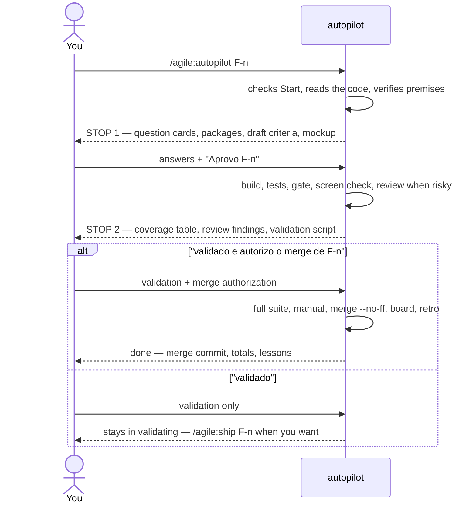

| Stop | What you get | How you answer | What follows |
|---|---|---|---|
| 1 — questions | Every open question as cards (recommended option first), the new packages with license and version, the **draft acceptance criteria** written from the recommended options, and for an item with a new or complex screen the **HTML mockup** built from the same options. The last card: "Approve F-n with these answers and criteria?" | Pick the answers and "Aprovo F-n". Any other answer is a follow-up round, never an approval. | The item file is filled with your answers and set to `approved`; the build starts in the same run. If a screen answer differs from the recommendation, the mockup is regenerated and the run stops once more for the screen only. |
| 2 — validation | Files, tests with real numbers, the criterion → test table, the reviewer's findings (it runs by itself when the change is risky: authentication, permissions, data, contracts, money, more than ~400 lines), what `--assume` assumed, the validation script. | "validado e autorizo o merge de F-n" — or "validado" alone — or the defect you found. | With the merge named: full suite, app manual in three languages, `merge --no-ff`, board, retro, `done`, without asking again. "validado" alone: the item stays in `validating` until `/agile:ship F-n`. A defect: fixed, then stop 2 again. |

`--assume` skips stop 1: every question gets its recommended option, recorded in `## Decisions` as `assumed by autopilot` with its reason, and the flag counts as your approval for that item. It never assumes a new package — when the item needs one, stop 1 happens with that question only. The mockup, when there is one, is then shown at stop 2.

Some decisions stay yours even inside a run. The run **ends** — nothing is reverted — and says where it stopped, what is done, what is left and the command to continue, when it meets: a package you did not approve at stop 1, a schema change not in the file, money, permissions, shared data, credentials, a screen behind sign-in, another module's contract, a false premise or an impossible criterion, a gate red three times, a blocker it cannot fix inside the item, a red suite at ship, or a merge conflict.

The run keeps an `Autopilot:` line in the item file (`refined`, `stop 1`, `approved`, `built`, `reviewed`, `stop 2`, `shipping`). `/agile:autopilot F-n` resumes from that line, so a new session or a summarized context loses nothing.

### Optional steps

| Command | When | Result |
|---|---|---|
| `/agile:discuss` | An idea with several possible directions, or doubts only you can answer | `docs/discussions/D-<n>-<slug>.md` (options, decisions, parked points) and the items captured as `idea` |
| `/agile:epic` | A new epic to plan | `docs/epics/<slug>.md` with prioritized, session-sized features, what each depends on and waits on, an execution plan (order, suggested path, what runs in parallel) and what waits outside the epic; each feature captured as `idea`. On a `web-app`/`website`, a mobile app epic follows the `mobile-client` complement (section 12) |
| `/agile:screen` | A feature in `refining` with a new or complex screen | The `ux-designer` agent writes the detailed screen section in the feature file and an HTML mockup (every state, three languages; a new colour only after its contrast is computed on every surface, in both themes), alone in the item's worktree; Claude reads both, asks the agent's open points with its own questions, and you approve the screen together with the feature. In the build, the `frontend` agent implements that approved mockup and the tests of that screen. The mockup's colors, fonts and radius come from `docs/design/identity.tokens.json`; a project without one is told so in the agent's open points, and the mockup uses the library defaults |
| `/agile:review` | A risky change (authentication, permissions, tenant isolation, data, contracts, money, or more than ~400 lines), before validation | Findings by severity from a read-only reviewer with fresh context; confirmed blockers are fixed before you validate |
| `/agile:publish` | After one or more ships, when you want the app version on `main` as a release | A `dotnet publish` package of the profile's deployable project(s) in `artifacts/publish/v<Version>/` with one `.zip` each (a mobile head: a signed Android `.aab`), the notes in `docs/releases/v<Version>.md` (and `v<Version>-store.md`, the store checklist, for a mobile head), an annotated tag `v<Version>`, both pushed, and a GitHub Release with the notes. Typing it is the authorization. With an environment named (`/agile:publish production [v<x.y.z>]`) it then deploys that release by the command `docs/infra.md` declares for the environment (see "Deploying" below) |

**Releasing: `/agile:publish`.** A ship bumps the app's `<Version>` and merges; it does not build anything you can hand to someone. `/agile:publish` turns the version already on `main` into a release. It runs from the main checkout and stops, changing nothing, unless `main` is clean, level with `origin` and `v<Version>` exists neither locally nor there. Claude shows the plan once (version, previous tag, the items merged since it, the projects and runtimes) and goes on: typing the command is the authorization for the commit of the notes, the tag, the push and the GitHub Release. It does not rerun the tests (the ship ran the full suite on what `main` holds); a compile error still fails `dotnet publish -c Release` (or `dotnet pack`), and then nothing is committed or tagged. The site of a Hybrid app in its own repository also packs its two packable projects, `<App>.Contracts` and `<App>.Shared`, at that same version and pushes them to its GitHub Packages feed after the tag (`--skip-duplicate`, so a rerun is safe), reading the token from `GITHUB_PACKAGES_TOKEN`; without the token, or with an `origin` outside github.com, the packages are left out with that reason and the site is still published.

What is packaged follows the profile: `web-app` and `website` → `<App>.Web`; `monolith`, `modular-monolith` and `web-api` → `<App>.Api`; `desktop` → the head, self-contained, once per runtime in its `<RuntimeIdentifiers>` (else this machine's), plus `<App>.Api` when there is one (with an update source declared in `docs/infra.md`, the head is packed by Velopack instead of zipped: see "Desktop updates" below); `mobile` → `<App>.Api` plus the Mobile head as a signed Android `.aab`, and a web app with the `mobile-client` complement → `<App>.Web` plus the same `.aab` (see "Store publishing" below); `microservices` is not supported. All projects of one release carry the same `<Version>`. The package drops `appsettings.Development.json` and the project's own `.xml` documentation file and keeps the `.pdb` files. A WinUI 3 head without `<EnableMsixTooling>true</EnableMsixTooling>` stops the plan: it would publish an exe that crashes on start. A linux or macOS runtime zipped on Windows loses the execute bit, and the report says to `chmod +x` it. The notes list one line per merge on `main` since the previous `v*` tag (`Feature F-3: …`, `Bug B-2: …`, other branches under "Other"), in English; the tag carries the same text. If the push or the GitHub Release fails after the tag, Claude names the exact command to rerun and never deletes the tag or the commit.

**Deploying: `/agile:publish <environment> [v<x.y.z>]`.** With an environment named, the release is followed by a deploy of it, by the command that `docs/infra.md` declares for that environment: its environments table has three more columns, `Deploy command` (`not declared` when there is none), `Check URL` (optional) and `Version (deployed on)`, which only `/agile:publish` writes. Typing the command is the authorization for that deploy too. Before it runs Claude shows the environment, the version deployed there now, the version to deploy, the command and the names (never the values) of the secrets it needs, and goes on. Three shapes: a new version (`/agile:publish staging` with no tag yet) runs the release above first, and a failed release deploys nothing; a **promotion** (`/agile:publish production` when `v<Version>` is already tagged) deploys that tag with no new package, notes or tag; a **rollback** (`/agile:publish production v0.3.0`) deploys an older tag, with no extra question. With no environment named, Claude lists the environments with their recorded versions and asks which one, or "none" (the release only). An environment whose command is `not declared` deploys nothing: Claude says where to declare it, and a new version is still released.

Every deploy runs in one fixed worktree, `<worktree root>/deploy`, detached at the tag (made the first time, moved with `git checkout --detach` after), so your main checkout is never switched and a tool that keys on the folder path (Aspire names its compose project after it) replaces the running app instead of starting a second one. The command gets `AGILE_ENVIRONMENT`, `AGILE_VERSION`, `AGILE_TAG` and `AGILE_ARTIFACTS` (the package folder of that version, rebuilt from the tag when it is missing and the command is not the Aspire recipe); its output is saved whole outside the repository, with the value of every secret blanked, and its exit code decides success. The command runs in the machine's default shell (cmd.exe on Windows, so `%AGILE_TAG%`; /bin/sh elsewhere, `$AGILE_TAG`) and is limited to 30 minutes; two deploys never run at once (a lock file next to the deploy worktree), and one that finds tracked files changed in that worktree stops before running. A secret listed in `## Expected secrets` with "environment variable" and this environment is only checked by name: the variable must be set in the shell that started Claude (for the Aspire recipe it is `Parameters__<name>`), or the publish stops before anything runs. With a `Check URL`, after exit 0 the URL is polled for HTTP 200 for up to 60 seconds; no 200 fails the deploy. On success the environment's `Version (deployed on)` cell becomes `v<x.y.z> (YYYY-MM-DD)`, committed on `main` (`docs(release): v<x.y.z> deployed to <environment>`) and pushed. On a failure nothing is recorded and **nothing is rolled back by itself**: the report quotes the output's tail and gives the exact command that redeploys the version recorded before (`/agile:publish production v0.3.0`). The plugin never deletes old images (it counts the `aspire-deploy-*` tags and names the commands) and never runs `docker compose down -v`, which would delete the volume that keeps the app's Data Protection keys and with it every signed-in session. `/agile:sync` lists a project whose `docs/infra.md` lacks the `Deploy command` column as a missing capability and offers to capture an item; it never writes that file.

**The deploy pipeline (GitHub Actions).** A project whose `origin` is on github.com and whose `docs/infra.md` declares a deploy command for a non-local environment gets `.github/workflows/deploy.yml` and its script `.github/scripts/agile-deploy.js`, written by `/agile:bootstrap` (`node sync.js pipeline write`). Pushing the tag `v<Version>` (which `/agile:publish` does) deploys it to the first environment that is neither `local` nor production, `staging` in the usual table, or to production when there is no other; the name is written once, as a literal, when the file is generated. Production is promoted by a manual run (Actions, Deploy, "Run workflow": `environment` and an existing `tag`, so a rollback is the same run with the old tag) or locally by `/agile:publish production`. What the run deploys is the **same `Deploy command` of the same row** that the local command runs, read from `docs/infra.md` when the run starts and never copied into the workflow, so the two cannot drift: edit the table, not the YAML. The job declares `environment: <name>`, so the secrets live in the GitHub environment of that name and you can add required reviewers there (the plugin never creates an environment, a reviewer or a secret, and never reads a value); it checks the tag out with its history, installs the .NET SDK from `global.json`, sets `AGILE_ENVIRONMENT`, `AGILE_VERSION`, `AGILE_TAG` and `AGILE_ARTIFACTS` (rebuilt from the tag when the command uses it), and polls the `Check URL` for 200 for up to 60 seconds. Every secret that `## Expected secrets` lists with "environment variable" for a non-local environment is passed from `secrets.<name>`; one that has no value stops the run **before** the command, naming it (values are never printed, and a value in the command's output is blanked). Runs of one environment never overlap, and the workflow holds read-only `contents` permission and uses only `actions/checkout` and `actions/setup-dotnet`. A failed command or check fails the run, nothing is rolled back, and the run summary names the rollback; a success prints `v<x.y.z> deployed to <environment>` and **commits nothing**: `Version (deployed on)` is still written only by a local `/agile:publish`. Before a local `/agile:publish <environment>` that will push the tag, Claude says that the pipeline also deploys it to its target (and, when that is the same environment, that the two run at the same time and are not serialized: the concurrency of the workflow queues only its own runs); typing the command stays the authorization. The file is yours once written: add a step before "Deploy" for any tool the command needs besides the SDK and what the Ubuntu runner has (the command runs in `/bin/sh` there, so `%AGILE_TAG%` forms do not work). `/agile:sync` never writes it: a project with a declared command and no workflow gets "Deploy pipeline" as a missing capability and the offer to capture an item, and one that has it sees a newer template, or a secret added to the table, as a `manual` difference to merge by hand. Only GitHub Actions is supported. Example 14.36.

The plugin ships one recipe, for "containers + Aspire" (every profile that can have an AppHost: `monolith`, `modular-monolith`, `web-api`, `microservices`, `web-app`, `website`; the profile's "Deploy recipe" section has the exact lines): the deploy command is `aspire deploy --apphost src/<App>.AppHost/<App>.AppHost.csproj -e <Environment> -o artifacts/deploy/<environment> --clear-cache --non-interactive --nologo`, which builds the container image and runs `docker compose up -d` for that environment. The AppHost declares one compose environment per environment name and pins each external port from its `appsettings.<Environment>.json` (staging and production run side by side, on `5081` and `5080` for example), each project resource sets `ASPNETCORE_ENVIRONMENT`, publishes only its `http` endpoint, and keeps the Data Protection keys in a named volume per environment, so a redeploy keeps cookies and antiforgery tokens valid. The Aspire CLI and every Aspire package of the AppHost are the latest stable and carry the same version (checked before the command runs; a mismatch stops with both versions). A `mobile` project has no AppHost: its `<App>.Api` is deployed only by a command you declare, and its `.aab` is never deployed. Docker must be running on the machine that deploys. Another target (Azure Container Apps, a server over SSH) is a command you declare in the same column; the GitHub Actions pipeline is #51.

## 6. Changing your mind

- **Before approval:** change anything. It is just conversation.
- **During build:** `/agile:change` adds a **change note** to the feature file (what changed, why, which acceptance criteria are affected). You re-approve only those criteria. Work continues.
- **After ship:** it is a new feature or a bug, captured with `/agile:idea`.
- **Wrong premise found** (for example, "the screen already has this field" and it does not): Claude stops and asks before coding around it.

## 7. The feature file

`docs/features/F-<number>-<slug>.md`, one per feature, created from `docs/agile/templates/feature.md`. Bugs use a shorter file, `docs/bugs/B-<number>-<slug>.md` (template `bug.md`): what happens, expected, confirmed cause (with every duplicate of a business rule), fix (which occurrences now, which deferred), one regression test per occurrence fixed and validation script.

Epics live in `docs/epics/<slug>.md` (features table, order, first release cut) and discussions in `docs/discussions/D-<n>-<slug>.md`. Screen mockups go to `docs/features/mockups/`.

A rule that protects a minimum ("never leave the last manager without a replacement") is written as a before-and-after — "there was at least one before and none after" — so it does not also block a case where the hole already existed.

Main sections of the feature file:

```markdown
---
feature: F-<number>
status: refining | approved | building | validating | done
board: <work item id>
---
# <Feature name>

## Goal
## Users and use cases
## Business rules
## Screens and API
## Acceptance criteria
## Decisions (date — decision — reason)
## Out of scope
## Open questions
## Change notes
## Validation script
```

`## Approved list` is an optional section, after `## Screens and API`: it exists only when you approved a list in the chat (26 site sections, five export formats, ten error codes). It holds every element, numbered, one per line, in the approved order and with your edits applied; criteria and decisions point to it by name. The build and any later reader take the list from the file, never from the refinement chat.

## 8. Definition of done

- [ ] Acceptance criteria met and covered by tests.
- [ ] Build with no new warnings; affected tests green.
- [ ] Every UI string localized in pt-BR, pt-PT and en.
- [ ] Validated on screen by you.
- [ ] Full test suite green before merge.
- [ ] Generated technical docs up to date — the docs command and its check, `gate.js docs` (DocGen, declared or implicit), when the project has them.
- [ ] App manual updated in the profile's languages (three by default; `web-api`: pt-BR and en).
- [ ] Board updated; the feature file reflects what was decided.

## 9. Quality gates

Hooks run outside the model. They are Node scripts (no bash) and do nothing in a repository without a .NET project.

| When | What happens |
|---|---|
| **Session start** | Shows the branch, the item in progress, the backlog head, approved files with open questions, and uncommitted work in **every** worktree. |
| **Every commit** | A guard refuses a `git commit` on the main branch in two cases: an item branch (`feature/F-<n>`, `bug/B-<n>`) is unmerged and checked out nowhere — the sign that an IDE switched the branch behind the session — or the commit carries an item file that is not `done` (refining, approved, building, validating), which belongs on the item branch. Claude tells you and switches back; if the commit really belongs on the main branch, you say so and Claude repeats it ending with the comment `# agile:main-ok`. |
| **Every shell command** | A second guard warns before a Bash or PowerShell command writes a repository file through the command's own text instead of the Write and Edit tools — a heredoc, `echo`/`printf`, a PowerShell `Set-Content`/`Out-File`/`Add-Content`, a Python `open(..., 'w'/'a')`, a `node -e`/`.js` write whose literal carries a backslash, an escaped quote or an embedded newline, or a `sed -i` on a tracked file — or edits a GitHub issue or PR with an inline `--body`/`-b` instead of a whole one from a file. It exits 2 naming the rule and the file or command; a path outside the repository (temp, the session's scratchpad) and the plugin's own generated files (`warnings-baseline.json`, `.claude/agile/sync.json`, `scripts/delivered.json`, `.claude/agile/sync-base/**`) are silent. With your yes, Claude repeats the command ending with the comment `# agile:literal-ok`. |
| **Every edit** | Nothing is built. The edited file is only remembered, under the git root it belongs to — so an edit inside a worktree is gated in that worktree, not in the folder where the session started. |
| **End of turn** (only if code changed) | Rebuilds the changed projects (`--no-incremental`) and runs only the test projects that reference them, directly or indirectly. It never runs the whole suite. |
| **Ship** | `gate.js ship`: full rebuild, full suite, architecture tests; then no tracked file may be left changed (a generated file the run rewrote is committed with the item), and the evals run when the project has them: `evals/compare.js` compares the result with the baseline and its exit code is the verdict (a drop or a missing case fails the ship; a partial run, or a run of another model or ablation than the baseline's, is "not measured" and stops it). After the app manual, `gate.js docs` runs the docs command the repository declares — or, with nothing declared, the single `tools/*.DocGen` it finds (below). |

Details:
- **New warnings only.** Warnings are compared with `.claude/agile/warnings-baseline.json`, a committed file. Existing warnings do not fail the gate; a new one does, listed with file, line and message. The baseline is rewritten only by a green ship (or by `gate.js baseline`, with your yes).
- **The verdict is the last line.** Every report ends with `agile gate GREEN`, `agile gate RED: <what failed>` (the new warnings, the failing tests, the blocked build) or `agile gate SKIPPED: <why>` (nothing was edited, no solution, not a git repository — when no solution is found, it says to name one as `solution` in `.claude/agile/build.json`), or `agile gate OFF: <why>` in a repository whose `build.json` says `engine: none`. As a hook, a turn with no code change stays silent. Run by hand, `stop` cannot see the hook's marks (they belong to the session), so it asks git which code files changed since the main branch — committed, uncommitted and new — builds and tests those, and always prints its verdict. It never reads standard input: only the Stop hook, called as `gate.js stop --hook`, reads the hook event. Before 0.0.68 a stop by hand waited forever on a standard input left open, as in Claude's Bash tool. Claude saves the whole output to a file and quotes from it, never filtering it with `grep`, `head` or `tail`: a filtered view once hid the only list of new warnings.
- **Wide changes.** If a change reaches more than 6 test projects, only the ones that reference it directly run; the rest waits for ship (`AGILE_GATE_MAX_TESTS`). A change to `.props`, `.targets` or the solution builds the whole solution and leaves the tests for ship.
- **Solution lookup.** The solution is searched at the git root and one folder down (`repo/App.slnx`, `src/App.sln`).
- **What the turn gate sees.** A code file is `.cs`, `.vb`, `.fs`, `.fsi`, `.razor`, `.cshtml`, `.xaml`, `.resx`, a project file (`.csproj`, `.vbproj`, `.fsproj`) or a build file (`.props`, `.targets`, `.sln`, `.slnx`); an edit to anything else is not remembered and starts no build. The project that owns a file is the nearest `.csproj`, `.vbproj` or `.fsproj` above it, and the project graph holds every one of those under the root, so a C# test project that references a VB.NET library runs when a `.vb` file changes. A test project is one whose file carries `Microsoft.NET.Test.Sdk`, `Sdk="MSTest.Sdk` (with or without a version), `<IsTestProject>true` or `xunit`, whatever its language. Until 0.0.90 a `.vb` or `.fs` edit was invisible to the turn gate (SKIPPED, while `ship` built and tested the whole solution), and a project on `MSTest.Sdk` was built but never tested. DocGen is still looked for as a `tools/*.DocGen` folder with a `.csproj`: it is the plugin's C# template. `.sqlproj` and `.fsx` are not code for the gate.
- **The solution's SDK.** Every `dotnet` call runs from the solution's folder (the git root when there is none), so the `global.json` beside the solution chooses the SDK and the test runner, exactly as it does for someone building in that folder. Every report opens with `sdk <version> (<folder>)`; `sdk unknown` means `dotnet --version` failed there (a pinned SDK that is not installed), and the build failure that follows says why. The baseline records the SDK it was taken with (`"#sdk"`). When a later build uses another one, the report adds `baseline taken with <a>, this build used <b>: warning counts may differ; ...`. That line is information, not a failure: retaking the baseline is your call. With the Microsoft.Testing.Platform runner, the report quotes its totals (`Test run summary`, `total`, `failed`, `succeeded`, `skipped`), and the gate passes a solution to `dotnet test` with `--solution` and a test project with `--project` (SDK 10.0.1xx refuses a solution after `--project`).
- **An adopted repository.** A code base that existed before the workflow (its `CLAUDE.md` says `Profile: adopted`, written by hand or by another plugin, such as legacy-lens's adoption) records how it is really built in `.claude/agile/build.json`: `engine` (`dotnet`, `msbuild` or `none`), `solution` (a path from the root), `scope` (the projects worth building when the whole solution is not), `testCommand`, `notes` and, under `msbuild`, the optional `msbuildPath` and `restoreCommand`. The gate reads `solution`, so a solution deep in the tree is still built, and `engine: none` turns it off with the reason in `notes`; `scope` is for people and is not read. The engine is trimmed and case does not matter, and a value outside the three is RED (`agile gate RED: unknown engine "MSBuild2" in .claude/agile/build.json (legal: dotnet, msbuild, none)`) instead of quietly behaving like `dotnet` — which is how `msbuild` went unhonored until 0.0.69. `/agile:sync` refreshes rules, templates and the workflow of such a repository but leaves its profile alone: there is no plugin profile to refresh it from.
- **`engine: msbuild`.** For a solution the .NET SDK cannot build — typically an old project type whose targets only Visual Studio ships, such as an ASP.NET web application importing `$(VSToolsPath)\WebApplications\Microsoft.WebApplication.targets`, where `dotnet build` stops with `error MSB4019`. The gate then drives MSBuild.exe instead of the `dotnet` CLI; the warning parser, the baseline, the locked-output hint and the RED/GREEN verdict are the same. What differs:
  - **Finding MSBuild:** `msbuildPath` from `build.json` (absolute, or from the repository root) when the file is there, then `msbuild` on the PATH (a Developer Command Prompt puts it there), then `vswhere.exe` at its fixed location under `Program Files (x86)`, which ships with every Visual Studio install. A declared `msbuildPath` that exists is used as it is: the gate never falls through to a different MSBuild than the one you named. When none works, `agile gate RED: MSBuild not found`, listing every place it looked. `vswhere` is Windows-only, so off Windows there are two places, not three.
  - **The report head** is `msbuild 18.10.1.42706 (.)` instead of `sdk <version> (<folder>)`, and the baseline keeps it in the same `#sdk` key as `msbuild 18.10.1.42706`. A `dotnet` baseline still stores the bare SDK version, so no baseline written before 0.0.69 has to be retaken.
  - **Restore**, on `ship` and `baseline` only: the build carries `-restore`, unless `restoreCommand` is declared, in which case that runs first instead — `msbuild -restore` does nothing for `packages.config`, which is what a legacy repository usually has. A `restoreCommand` that fails is `agile gate RED: restore failed (<command>)`, and nothing is built.
  - **Tests** are the `testCommand`, run whole through the shell, at `ship` only: `dotnet test` cannot reach a .NET Framework test assembly, and the gate's test-project detection does not recognise a `packages.config` MSTest or NUnit project. The turn gate builds the affected projects and says `tests skipped: engine msbuild runs the whole suite at ship`; `baseline` never ran tests. With no `testCommand`, the ship says `tests skipped: no testCommand in .claude/agile/build.json` and the build alone decides the verdict — a missing suite is debt the adoption recorded, not a gate nobody can clear. A `testCommand` that fails is RED; one that runs longer than 1800 seconds (`AGILE_TESTCMD_TIMEOUT`) is RED as a timeout.
  - Since 0.0.69 `testCommand` is **executed**, not just documentation: it has to run unattended, never opening an IDE or waiting for a key.
- **A declared docs command.** `build.json` may also carry `"docs": { "command": "...", "check": "...", "paths": ["docs/legacy/inventory"] }`, written by whoever prepared the repository (legacy-lens's adoption declares its inventory map there), so a living code map is refreshed with every item. At ship, after the app manual, `gate.js docs` runs `command` and then `check` (optional) through the shell, from the root of the item's worktree, whatever the `engine`. `command` and `paths` are required. It ends with `agile docs GREEN: <n> file(s) changed under <paths>`, and those files go into the item's docs commit. `agile docs SKIPPED: no docs command declared` means there is no `docs` block and no DocGen either, and the ship goes on as before. `agile docs RED: <what failed>` stops the ship like a red gate: a command or check that failed, is not installed, or ran longer than 600 seconds (`AGILE_DOCS_TIMEOUT`), a field that is missing, or a file changed outside `paths`. Such a file is listed and never committed.
- **The implicit DocGen command** (0.0.72). A project with DocGen has a docs command whether it declared one or not. With no `docs` block, `gate.js docs` looks for `tools/*.DocGen` folders holding a project file: exactly one is run as if it were declared — `dotnet run --project tools/<App>.DocGen`, then `-- --check`, with `paths: ["docs/architecture/"]` — and the run prints `implicit DocGen docs command: declare it with /agile:sync (tools/<App>.DocGen)` just before the verdict. That closes the window between a project getting DocGen and declaring it: before 0.0.72 the ship ran DocGen in a step of its own, and a project with the block ran it twice. **Several** `tools/*.DocGen` and nothing declared is RED naming them (`declare which one in .claude/agile/build.json`): running the wrong one would leave the other stale in silence. A declared `docs` always wins, and DocGen is not run behind it. `/agile:sync` offers the block as a plan row (section "Updating the plugin", example 14.10); until then every ship repeats the line.
- **Locked build output.** A running app host, preview or debugger keeps the DLLs open. The gate then reports "build blocked" and names the process instead of a plain build failure; Claude stops whatever it started before the turn ends, and asks you to close yours.
- **Honest counts.** An incremental build skips the compile of a project that did not change, and MSBuild does not repeat the warnings of a skipped compile. So every gate build is a `--no-incremental` rebuild of what it measures, at the turn as at ship. Before 0.0.67, a new warning found in one turn disappeared in the next, and the gate went GREEN with nothing fixed. The rebuild costs a few seconds per turn: it was measured at +0.6 s and +2.2 s on two small solutions, and each `built` line shows it. Claude quotes a warning count only from the gate or a `--no-incremental` build, and builds again after `git stash` or a branch switch before running tests: `--no-build` would run the other tree's binaries.
- **Hung tests.** A test that runs for more than 120 seconds (`AGILE_GATE_HANG_TIMEOUT`) counts as hung: the run fails with its name instead of blocking the turn for minutes.
- **No loops.** After 3 red gates in a row the turn ends and you see the failure; the pending check stays for the next turn.
- **Known limit.** Only edits made with the editing tools are tracked. Changes made by a shell command (`dotnet format`, a merge) are caught at ship.
- `AGILE_HOOKS=off` disables the hooks for a session.
- `AGILE_TESTCMD_TIMEOUT` (1800 s) caps the `testCommand` of an `engine: msbuild` repository, as `AGILE_DOCS_TIMEOUT` caps the docs command.

## 10. Board

`CLAUDE.md` has a `Board:` line: GitHub Issues + Projects (`gh`), Azure Boards (`az boards`), or none (then `docs/agile/backlog.md` is used). Mapping: epic → feature. No tasks per role. The feature file keeps the board id; the merge closes the work item.

Closing the issue is not trusted alone: at ship, after closing, Claude also sets the board's Status field to Done explicitly and reads it back, because a project's own automation for that can miss (seen once, cause unknown). A read-back that still shows something else is retried once, then reported with the exact command to fix it by hand; the ship does not stop or undo the merge over it — the file already says `done`. An item not yet on the project board is added first. Azure Boards gets the same read-back on `System.State`.

An issue body is only ever replaced whole. `gh issue edit --body` replaces the entire body with what it is given, so a partial text there silently deletes the rest of the item (it happened in legacy-lens B-1). Claude writes the full item text to a file, sends it with `gh issue edit <id> --body-file <file>`, and reads the body back to compare. An Azure Boards description is likewise always sent whole, from a file.

A GitHub Projects board with no "Ready" option no longer just gets a note about it: the first time `/agile:refine` mirrors a `refining` or `approved` item, Claude creates it — right after whatever option currently sits first (usually "Backlog"/"Todo"), so the flow stays Backlog → Ready → In Progress → Done. GitHub only lets you replace a Status field's whole option list, never add one option to it, and replacing the list gives every option a new id, which silently unsets the Status of every other item on the board — that cost 30 items their status by hand once (2026-09-27). Claude avoids it by reading every item's current Status **by name** first, replacing the list, then re-applying each captured name to its new id; an item that had no Status keeps having none. Any other missing option — "Ready" itself once `/agile:build` or `/agile:ship` run, or a missing done option — is still only reported, never invented.

## 11. Languages and the app manual

- Code, docs, commits and identifiers are in English.
- The app ships in **pt-BR, pt-PT and en** from day one: no hardcoded UI strings, one resource file per module per language, `IStringLocalizer`. Adding a language means adding resource files only.
- The **app manual** lives in `docs/manual/<locale>/` and is updated when each feature ships, in the locales the profile names: pt-BR, pt-PT and en by default, pt-BR and en for `web-api`.
- `web-api` has no screens: its responses carry codes only, and the three-language resource files (`Resources/`) appear with the first feature that sends text to people, such as an e-mail. The lines about UI text, the language switch and mockups do not apply to it.
- Only the conversation between you and Claude is in Portuguese.

## 12. Architecture profiles

The quiz picks one profile; `CLAUDE.md` points to it.

| Profile | When |
|---|---|
| `modular-monolith` | One deployable, several business modules with clear boundaries |
| `monolith` | One deployable, one business area |
| `web-app` | Mostly screens over simple data; thin API or server-side UI |
| `website` | A public site for visitors (search engines, content edited by the owner) that may grow into an app: `web-app` plus a public layer |
| `web-api` | An app that is only an API for the owner's own clients (mobile, a single-page app in other repositories) and, when the bootstrap says so, machine clients: `monolith` without `Web`, plus consumer authentication, per-consumer rate limiting and a published contract |
| `microservices` | Independent deployables owned separately; only with a real reason |
| `mobile` | Native or MAUI client, with its own API profile, or on an existing API in another repository (`Backend: external`) |
| `desktop` | Standalone XAML client on the user's machine (WinUI 3, Avalonia 12 or .NET MAUI), behind an API or reaching the database directly |

Each profile defines the folder layout, where business rules live, the test strategy and its time budget, and the architecture tests. The profile files are in `profiles/` in the plugin; bootstrap copies the chosen one to `docs/agile/profile.md`.

What every profile shares:
- **Simple code.** CRUD is a thin vertical slice (endpoint or page → `DbContext`): no repository, no mediator, no mapping library. A rule lives in its entity, or in the feature handler when it needs data. Structure is added on the second use.
- **One project per module.** In `modular-monolith` a module is one project plus a `Contracts` project. A module with a rich domain can use the Clean Architecture variant (five projects: Domain, Application, Infrastructure, Api, Contracts); Claude suggests it with a reason, you decide per module, and an ADR records it.
- **Time budget.** Unit < 30 s, integration < 2 min per test project, full suite < 5 min (smaller for `web-app` and `monolith`, < 10 min for `microservices`). **One PostgreSQL container per test project**, never one per test class.
- **Architecture tests** guard the boundaries and the English vocabulary in every assembly, and every rule of absence is paired with a rule of presence, so an empty assembly fails. A layout test keeps every project in the folder its profile assigns.

**Folder layout per profile.** Bootstrap creates it, and every project a feature adds later goes into the folder its kind has here; the solution folders mirror the disk folders, and a layout test fails when a project lands elsewhere. `<App>` is your app's name.

`modular-monolith` — hosts, technical building blocks and business modules in separate groups:
```
src/
├── Hosts/
│   ├── <App>.AppHost/                local orchestration (Aspire)
│   ├── <App>.ServiceDefaults/        telemetry, health, resilience
│   ├── <App>.Api/                    host only: composition, auth, OpenAPI
│   └── <App>.Web/                    Blazor UI, typed clients to the API
├── BuildingBlocks/
│   ├── <App>.SharedKernel/           Entity, TenantEntity, Result/Error, AppJson
│   └── <App>.<Block>/                Persistence, Email, Storage, Ai — by the first feature that needs it
└── Modules/
    └── <Module>/
        ├── <App>.<Module>/           one project per module (or five with Clean Architecture)
        │   ├── Features/<Feature>/   vertical slices
        │   ├── Domain/               entities with rules
        │   ├── Data/                 DbContext, own schema, migrations
        │   └── Resources/            .resx in en, pt-BR, pt-PT
        └── <App>.<Module>.Contracts/ what other modules may see
tests/
├── Hosts/<App>.Web.Tests/            bUnit
├── BuildingBlocks/<App>.<Block>.Tests/
├── Modules/<Module>/<App>.<Module>.Tests/
├── <App>.ArchitectureTests/          boundaries, vocabulary, layout
└── <App>.Testing/                    shared test helpers
```

`monolith` — one deployable with the business code inside it:
```
src/
├── <App>.AppHost/                    optional
├── <App>.Api/                        host + business code
│   ├── Features/<Feature>/
│   ├── Domain/
│   ├── Data/                         one DbContext, migrations
│   ├── Contracts/                    records shared with the UI
│   ├── Common/                       Result/Error, AppJson, helpers
│   └── Resources/
└── <App>.Web/                        Blazor UI, typed clients to the API
tests/
├── <App>.Tests/                      unit + integration
└── <App>.Web.Tests/                  bUnit
```

`web-api` — `monolith` without `Web`: one deployable that is only an API, and its contract:
```
src/
├── <App>.AppHost/                    optional
└── <App>.Api/                        the only deployable
    ├── Features/<Feature>/
    ├── Domain/
    ├── Data/                         one DbContext, migrations
    ├── Contracts/                    records for the API's consumers
    ├── Auth/                         scheme selector, consumer claims, API key handler: what question 10a needs
    ├── Common/                       Result/Error, AppJson, the helper that reads the caller
    └── Resources/                    only when a feature sends text to people
tests/
└── <App>.Tests/                      unit + integration, the foundation's HTTP tests
docs/api/openapi.json                 the contract, written by the integration tests
```
The bootstrap generates a foundation proven on a scratch solution (21 HTTP tests, then run by hand with each status code read). Every handler adds the same two claims, `consumer_kind` (`user` or `client`) and `consumer_id`, and code reads the caller only through them. A new endpoint accepts users only: machine clients enter where a feature names the `Clients` policy, and an anonymous endpoint must be on an allowlist an architecture test checks. Rate limiting answers 429 with `Retry-After` and a code, per user or client and per IP when anonymous, with a stricter limit on login and a separate one on refresh. CORS is an allowlist from configuration and never allows `X-Api-Key`. `/health` is public, `/health/ready` answers only on internal hosts, and neither is in the contract. OpenAPI and Scalar are not served in Production: consumers read the committed `docs/api/openapi.json`, which every feature's HTTP tests rewrite. Problems the framework writes itself (a 404, a 405, a malformed body) carry a `code` too. The Identity bearer answer lasts 1 hour for access and 14 days for refresh; a security-stamp change stops the next refresh, but an access token already issued lives until it expires, and `docs/infra.md` says so, with where the key ring (a secret folder shared by every instance) lives. Packages are approved with the profile; `Microsoft.AspNetCore.Authentication.JwtBearer` only when the external IdP is chosen. A second business area means an ADR and `modular-monolith` without `Web`.

`web-app` — one Blazor project is the whole app:
```
src/
└── <App>.Web/                        the only deployable
    ├── Pages/<Area>/                 page + code-behind
    ├── Components/                   shared UI components
    ├── Features/<Feature>/           only when an operation has rules
    ├── Domain/
    ├── Data/                         one DbContext, migrations
    ├── Api/                          endpoints only for external clients
    ├── Common/                       Result/Error, AppJson, helpers
    └── Resources/
tests/
└── <App>.Tests/                      unit + integration + bUnit
```

`website` — the `web-app` layout, plus the public pages, the content area and the islands:
```
src/
└── <App>.Web/                        the only deployable
    ├── Pages/<Area>/                 page + code-behind
    ├── Pages/Public/                 public pages, static, /{culture}/...
    ├── Pages/Content/                content area: Editor and Admin
    ├── Pages/Admin/                  users, e-mail signups, settings
    ├── Components/Islands/           interactive only where something changes live
    └── ...                           the rest as in web-app
tests/
└── <App>.Tests/                      unit + integration + bUnit + HTTP tests of public pages
```
Public pages render on the server with no circuit (no `@rendermode`), which is what search engines read and what keeps an anonymous visitor from holding a server connection; a form (the e-mail signup, the contact) is a plain form post. Every public address starts with the language, with English slugs (`/pt-BR/about`, `/en/about`), and `/` sends the visitor to their browser's language. Each page has its title, description, canonical address and `hreflang`; `/sitemap.xml` is built from the pages themselves, so a new page cannot be left out. A text with no translation shows the default language. The content area has two fixed roles: `Editor` changes content, `Admin` also sees users, signups and settings. There is no page cache: once the content area's interactive mode is on, ASP.NET Core marks every page as not cacheable (measured, #36), so the content read from the database is cached instead, and a save clears it. E-mail signups stay in the app's own table, with a confirmation link and an unsubscribe link that needs no sign-in (LGPD). When logged-in features start sharing rules, the profile says to move to `monolith`, as `web-app` does.

`microservices` — one solution, one folder per service, each a small monolith:
```
src/
├── <App>.AppHost/                    every service, broker, databases
├── <App>.ServiceDefaults/
├── <App>.Gateway/                    routing and auth at the edge (YARP)
├── <App>.Web/                        Blazor UI, calls the gateway only
├── BuildingBlocks/
│   └── <App>.Messaging/              outbox, inbox, broker setup
└── Services/
    └── <Service>/
        ├── <App>.<Service>/          Features/, Domain/, Data/ (own database)
        └── <App>.<Service>.Contracts/ records and integration events
tests/
├── <App>.<Service>.Tests/            unit + integration + contract
├── <App>.Web.Tests/                  bUnit
├── <App>.ArchitectureTests/
└── <App>.SystemTests/                a few end-to-end flows
```

`mobile` — a testable core, a thin MAUI head, and the backend under its own profile:
```
src/
├── <App>.Api/                        backend, per its own profile
├── <App>.Contracts/                  records and error codes shared with the app
├── <App>.Mobile.Core/                plain library: everything testable
│   ├── Features/<Feature>/           view models, feature services
│   ├── Api/                          typed clients, AppJson
│   ├── Storage/                      local cache, offline queue
│   └── Resources/
└── <App>.Mobile/                     MAUI head: XAML pages, shell, platform code
tests/
├── <App>.Mobile.Core.Tests/          view models, services, offline queue
└── <App>.Tests/                      backend tests, per its profile
```

**`mobile` on an existing API (`Backend: external`).** The app is its own repository and its API is another system. There is no `Api` project: the app's own `Directory.Build.props` carries the only `<Version>` (seeded at `0.1.0`), and `/agile:ship` bumps it alone. `<App>.Contracts` holds records you write by hand, and a pinned copy of the API's OpenAPI document sits in `docs/api/backend-openapi.json` (an agile API: its committed `docs/api/openapi.json` at a named commit; another API: its URL), with `docs/api/backend.md` saying where it came from. A test reads that document and fails when a record, a route, the `X-App-Version` header or the `426` response no longer match it (a generator was weighed and not adopted: the typed clients stay over one `HttpClient`); refreshing the copy is an explicit step of the item that needs it, and `/agile:sync` only reports when the API moved past the pinned commit. The app signs in at the API's `login`, adds the token and its version (`X-App-Version`) to every call, refreshes once on `401` (concurrent calls share one refresh) and, on `426` `app.update_required`, shows "update required" without trying to refresh. The screens are XAML, or MAUI Blazor Hybrid when the site shares its components as a package (next paragraph). Tests use a stub `HttpMessageHandler`; the API's own endpoints are tested in the API's repository, and each validation script has a device run against the API's development instance (`10.0.2.2` from the Android emulator).
```
src/
├── <App>.Contracts/                  hand-written records and error codes, checked against the pinned document
├── <App>.Mobile.Core/                view models, typed clients, token and version handler
└── <App>.Mobile/                     MAUI head: XAML pages, shell, platform code
tests/
└── <App>.Mobile.Core.Tests/          view models, the contract test, clients over a stub handler
docs/api/
├── backend-openapi.json              pinned copy of the API's document
└── backend.md                        where it came from, when, which API version
```
The API's side is the API's own session's work. For an agile site, an epic "API for the mobile app" (below) plans it; for an agile `web-api` or any other API, **the forced-update gate** is a line of its profile: the app sends `X-App-Version`, a middleware answers `426` with the code `app.update_required` when it is below a configured minimum or not a version (`2.0` equals `2.0.0`; no header passes; an empty minimum turns the gate off, a malformed one stops the app at start), it runs before authentication, and the OpenAPI document declares the header and the `426` on every `/api/v1` operation. It is a compatibility gate, not a security control.

**Hybrid across repositories (the site's package).** The site keeps its shared components in `<App>.Shared` (a Razor Class Library) and its records in `<App>.Contracts`; they are the only projects with `<IsPackable>true</IsPackable>`, and `/agile:publish` packs both at the site's `<Version>` and pushes them to the GitHub Packages feed of the `origin` owner (private; the token is the classic personal access token in the environment variable `GITHUB_PACKAGES_TOKEN`, never written anywhere). The app has no `<App>.Contracts` of its own: `Mobile.Core` references the `<App>.Shared` package, which brings the site's records, and implements the components' data interfaces over `HttpClient`; the head hosts each component in a page of its own (route, `[Authorize]`, no render mode) and builds the `AuthenticationStateProvider` from `GET /api/v1/auth/me`. A `nuget.config` at the root lists nuget.org and the site's feed with a `packageSourceMapping` (`<App>.*` on the feed, `*` on nuget.org; without it a machine with source mapping on never looks at the feed) and `Directory.Packages.props` pins the exact `<App>.Shared` version, from the same site release as the pinned OpenAPI document. Moving to a newer package is a step of the app item that needs a newer component, committed with the refreshed document; `/agile:sync` only says when the site's latest release is past the pin. A site's breaking change to a component's parameters or a data interface is a MAJOR release. Texts come from `<App>.Shared/Resources/` in pt-BR, pt-PT and en, and the head sets the culture from the device.

**The `mobile-client` complement.** A running `web-app` or `website` can gain a mobile app without changing profile. `mobile-client` is not a profile of its own: it adds the client half of `mobile` on top of the site's profile, and the project records it with one line under `Profile:` in `CLAUDE.md` (``- Complement: `mobile-client` — see `docs/agile/profile-mobile-client.md`.``). You start it with `/agile:epic` (example 14.24): Claude asks where the app lives (the site's own repository and solution, recommended, or a new repository — below) and its screens (MAUI Blazor Hybrid, recommended, reuses the site's Razor components; MAUI XAML gives the native look), then lists the site's features — the `done` items and the areas under `Pages/` — for you to tick; `Pages/Public/` of a `website` is never offered. The epic starts with "Mobile foundation" (the projects below, the app's sign-in with a bearer token on the site's own `/api/v1/auth/login` and `/api/v1/auth/refresh`, the app version) and then one "<X> on mobile" per ticked feature, with an "API for <X>" before it when the feature's logic still sits in a page used by several pages or holds a rule. One source of truth: the rule lives in one class in `Features/`, used in process by the site and by the endpoint the app calls. A shared screen is a component with no `@page` and no render mode, hosted by a page on each side. The app is online by default; offline comes per feature. A mobile client alone does not move the site to `monolith`.

**The app in a new repository.** Answering "a new repository" still asks the screens question (Hybrid recommended; in a new repository it works through the `<App>.Shared` package above) and goes on with the list to tick, but the site's epic is "API for the mobile app" (examples 14.30 and 14.33): "Mobile API foundation" first — the app's sign-in on the site, the forced-update gate, an OpenAPI document (`Microsoft.AspNetCore.OpenApi`, only the `/api/v1` routes, not served in Production, written to `docs/api/openapi.json` and committed with every API change) and, with Hybrid, the packable `Contracts` and `Shared` — then one item per ticked feature, always, because the app cannot extract a page's logic across repositories: "API for <X>" with XAML, "API and shared screen for <X>" with Hybrid (the component moves to `Shared` and its endpoints ship in the same release the app pins). The ticked list goes into the epic as you ticked it, and the epic ends telling you the next step: a new repository whose `product/brief.md` names this one, then `/agile:bootstrap` there, which reads the list. The site records ``- Complement: `mobile-client` — app in its own repository: <repository>; see `docs/agile/profile-mobile-client.md`.`` (with Hybrid: ``... <repository>; shared screens in the `<App>.Shared` package; see ...``); its version stays on `<App>.Web.csproj` alone, and the packages carry it. Claude writes nothing in the app's repository, and the app's session writes nothing in the site's.

**Born with the site.** A `web-app` or `website` bootstrapped with question 2e yes already has the epic "Mobile app", `<App>.Contracts` and, with Hybrid, `<App>.Shared` with the UI kit and the screens of the ticked features. `/agile:epic` does not create the epic again: it says so and names the next idea. "Mobile foundation" there creates neither `Contracts` nor `Shared` and moves no component; it waits for the UI kit (Hybrid) and the site's sign-in. Everything else is as for a running site: the complement copied to `docs/agile/profile-mobile-client.md`, the `Complement:` line, the ADR, `Mobile.Core` and `Mobile`, bearer sign-in, the head started at the site's current version with `ApplicationVersion` 1, the key ring. Each "<X> on mobile" adds the `/api/v1/` endpoint over the class already in `Features/`, the HTTP implementation in `Mobile.Core` and the host page (or the XAML page); no "API for <X>" is suggested, because no ticked feature keeps its logic in a page. `Shared` reads its texts through `IStringLocalizer`, which a Razor Class Library gets only from the `Microsoft.Extensions.Localization.Abstractions` package.
```
src/
├── <App>.Web/                        the site; Api/ gains the app's endpoints
├── <App>.Contracts/                  records and error codes shared with the app
├── <App>.Shared/                     Hybrid only: shared components, their data interfaces, texts
├── <App>.Mobile.Core/                plain library: HTTP implementations, token handler
└── <App>.Mobile/                     MAUI head: host pages or XAML pages, sign-in, platform code
tests/
├── <App>.Tests/                      the site's tests, plus bUnit for the shared components
└── <App>.Mobile.Core.Tests/          the app against the site in memory, with a bearer token
```

**Push notifications** (`mobile`, and a site with the `mobile-client` complement; only when the brief or an item asks for them). One provider: Firebase Cloud Messaging for Android and iOS (it relays to APNs), sent by the API through `FirebaseAdmin` behind an `IPushSender` interface. Registration is the API's: `PUT /api/v1/devices/{installationId}` with the device token, platform, culture and app version, and `DELETE` at sign-out, both bearer-only (`401` anonymous, `400` with `devices.invalid-token` for an empty token, `204` otherwise); a device belongs to one user and a token the provider reports as unregistered is deleted. A push carries a code and ids, never text: the app renders it from its resources in the device's culture. The app side is an interface in `Mobile.Core` implemented in the head with `Plugin.Firebase.CloudMessaging`; the permission prompt comes after sign-in. Tests need no device or Firebase account (fake sender, fake registration); the real delivery is a step of the validation script. The service-account key is a secret outside the repository. Store publishing is `/agile:publish`, below. Example 14.31.

**Offline-first** (`mobile`, and a site with the `mobile-client` complement when its epic part (c) said offline-first; the question is 2f). One SQLite file per signed-in user (`sqlite-net-pcl`; `sqlite-net-sqlcipher` instead when the brief marks the data as sensitive), kept out of Android's backup and deleted at sign-out. Reads show the cache first, with when it was fetched, and refresh when online without touching a row that has pending writes. A save goes to the cache and to a queue; the queue is sent one write at a time, in order, each with an `Idempotency-Key` and, for an update or delete, `If-Match`, at app start, when the network comes back, after a save and on pull-to-refresh. A network error keeps the write and retries later; a `401` goes through the refresh; a `426` stops the queue ("update required"); a `409` (someone else changed the record) moves the write to a conflict list where the user sends theirs again over the current version or discards it, and only the later writes on that record wait. Signing out with unsent changes asks: send now or discard. On Android the queue is also sent with the app closed: a unique one-time WorkManager request with the "network connected" constraint, scheduled when the queue stops being empty and when the app leaves the foreground, behind `IBackgroundSync` in `Mobile.Core` (a no-op on other heads; iOS is a separate item). A background run never signs out and never deletes a write; it records "sign in again" (`401` whose refresh fails) or "update required" (`426`) for the next open, shares one lock with the foreground sender, and a user who force-stops the app waits until the next open. Nothing is shown with the app closed. A conflict over an update also offers **Merge** (Example 14.42): each pending update keeps `base`, the record as it was before your first edit, so the screen compares three versions per field. A field only you or only the other person changed is kept without asking; a field changed on both sides to different values is a pick (a list is one pick, whole); nothing is preselected and "Send merged" waits until every pick is made. It replaces the record's pending writes with one update on the current version; a `404`, `400`, `422`, a conflict over a delete and a record whose `## Offline` turns the merge off keep "Send mine again" and "Discard". Run on a scratch app: 13 Core tests green. Example 14.41. One kit component, `OfflineStatus`, shows the banner, the pending count and the conflict list on every screen. The tests run on a real SQLite file with a fake connectivity; the device run (airplane mode on, two saves, network on) is a step of the validation script. The API's side is **Offline writes (the API)**, the same text in `web-api`, `mobile`, `mobile-client` and `desktop`: a write with an `Idempotency-Key` is recorded in the same transaction as the write and replayed (not run again) when the key returns, `422` when the key comes back with another body; an entity written offline carries a version (`xmin` on PostgreSQL), and its update and delete require `If-Match` (`428` without it, `409` with the current record when it is stale). Keys are kept 30 days. Both blocks were run on a scratch API and a scratch app on the Android emulator.

**Store publishing** (`mobile`, and a site with the `mobile-client` complement). `/agile:publish` also builds `<App>.Mobile` as an Android App Bundle, `dotnet publish -f <its android target framework> -c Release` with the signing as MSBuild properties, and copies only the signed file to `artifacts/publish/v<Version>/<App>.Mobile/<ApplicationId>-Signed.aab`. Signing comes from four environment variables, never from a file in the repository: `ANDROID_SIGNING_KEYSTORE` (an absolute path outside it), `ANDROID_SIGNING_ALIAS`, `ANDROID_SIGNING_STORE_PASS`, `ANDROID_SIGNING_KEY_PASS`; the passwords reach MSBuild as `env:` references, so no command line or log holds one, and `docs/infra.md` names the variables and where the keystore lives, never the values. The key is an **upload key** under Play App Signing (Google holds the app signing key; a lost upload key is reset through Play support, so keep a backup outside the machine). The Mobile head is left out, with the reason, and the server side is still published when: a variable is unset, the keystore is inside the repository or missing, `ApplicationId` still starts with the template's `com.companyname.` (Play makes the id permanent at the first upload), or the MAUI Android workload is missing. It is never built unsigned. A failed Android build stops the whole package step before any commit or tag. With a mobile head the release commit also carries `docs/releases/v<Version>-store.md`: the `.aab` path and both version numbers, the Play Console steps (testing track, then promote), the first-release-only steps (create the app, store listing, privacy policy URL, Data safety form from quiz 9b, content rating) and the iOS steps for a Mac, marked as not run by the plugin. The plugin uploads nothing to either store and builds nothing iOS. Play rejects a `versionCode` it has already seen: the ship raises `ApplicationVersion` at every release, and the checklist says so. The `.gitignore` template ignores `*.keystore`, `*.jks`, `*.p12`, `*.p8` and `*.mobileprovision`; a project whose file lacks them gets a warning from the plan, never an edit. First release with no keystore: Claude gives you the `keytool -genkeypair` command to run in your own terminal (it asks for the passwords there) and lists the variables to set. Example 14.32.

`desktop` — the same shape as `mobile`, with the API optional. The quiz asks the technology (Avalonia when more than one operating system, WinUI 3 for Windows only with the native look, MAUI when mobile is in the same product) and, for PostgreSQL or SQL Server, whether the client goes through an API or straight to the database (direct only for a single-user app or a closed network: the credential then lives on every machine). The app runs standalone (`dotnet publish --self-contained`, which `/agile:publish` runs once per runtime; a WinUI 3 head needs `<EnableMsixTooling>true</EnableMsixTooling>` or the published exe crashes on start); with an update source declared, the installed app updates itself ("Desktop updates", below). With an API it can also be offline-first (question 2f, below). The Stop gate never builds the head; only Avalonia has automated screen tests (`Avalonia.Headless`), WinUI 3 and MAUI go through the validation script:
```
src/
├── <App>.Api/                        only with an API, per its own profile
├── <App>.Contracts/                  only with an API
├── <App>.Desktop.Core/               plain library: everything testable
│   ├── Features/<Feature>/           view models, feature services
│   ├── Api/                          with an API: typed clients, AppJson
│   ├── Data/                         direct access only: DbContext, or the SQLite store
│   ├── Platform/                     interfaces the head implements
│   └── Resources/
└── <App>.Desktop/                    the head: XAML views, shell, platform code
tests/
├── <App>.Desktop.Core.Tests/         view models, services
├── <App>.Desktop.Tests/              Avalonia only: headless screen tests
└── <App>.Tests/                      backend tests, only with an API
```

**Desktop updates** (`desktop`; the source is quiz question 26b, a line of `docs/infra.md`). The updater is Velopack, for the three heads, Windows only, stable channel only, unsigned. `docs/infra.md` says `Update source:` a network share, an https URL or `not declared` (then the app stays a zip). The app reads it from `Updates:Source` in its `appsettings.json`; run from the IDE or a publish folder it checks nothing. At start the app checks the source in the background and downloads what is new (only the changed part, a delta, when one exists); then it asks "Update now / Later". "Update now" restarts on the new version; "Later" applies it when the app is closed; an app killed after a download applies it at its next start. A failed check is logged and shown to nobody. With an API, a `426` opens "Update required" with "Update now" only. `/agile:publish` packs each Windows runtime with `vpk` (Setup.exe, a portable zip, the full package, the delta, the feed index), sends the feed to a share after the tag, and for an https URL lists the files to copy by hand; the GitHub Release carries Setup.exe and the portable zip. The first release says: install once with Setup.exe (a zip copy does not update itself) and SmartScreen warns because the installer is unsigned ("More info", then "Run anyway"). The bootstrap writes the updater when the source is declared; an older project is told by `/agile:sync` ("Desktop updates") and captures an item. Example 14.44.

**Offline-first on desktop** (`desktop` with an API; the question is 2f). The same design as the mobile one, in `Desktop.Core/Storage/`: one SQLite file per signed-in user under `LocalApplicationData` (never the roaming folder; `sqlite-net-pcl`, or `sqlite-net-sqlcipher` with its key in the operating system's protected store when the brief marks the data as sensitive), deleted at sign-out, no backup exclusion because a desktop has none like Android's. Reads, the queue, `Idempotency-Key`, `If-Match`, the conflict list, the field-by-field merge and the sign-out question are the mobile lines word for word. What differs is the head: `IConnectivity` is implemented with `Connectivity.Current` on MAUI and with the BCL's `NetworkChange` on WinUI 3 and Avalonia; because "a network is available" does not mean the API answers, a failed send marks the API unreachable until the next connectivity change or the next successful request, and a Refresh command (F5) always tries; the queue is not sent with the app closed (no tray icon or service: installers and services are outside the profile). Run on a scratch Avalonia app in a Linux container with its network cut and restored: 19 Core tests green, `NetworkAvailabilityChanged` raised both ways, two saves sent once each and in order, and an API stopped with the network up cleared by the Refresh. The WinUI 3 and MAUI heads are measured on your machine, in the validation script of the first "Offline foundation". The API's side is the same **Offline writes (the API)** block, now word for word in four profiles.

**App version.** The app carries one `SemVer` version: a single `<Version>` property in the `Directory.Build.props` beside the solution file. Every project inherits it, so every DLL, libraries included, reports the release and the commit it was built from (`0.4.0+3f2a9c1…`), and no `.csproj` carries `<Version>`. `/agile:publish` packages the profile's deployable project(s): `<App>.Api` (`monolith`, `modular-monolith`, `web-api`), `<App>.Web` (`web-app`, `website`), `<App>.Api` and `<App>.Mobile` (`mobile`; `<App>.Mobile` alone with `Backend: external`), `<App>.Desktop` (`desktop`), `<App>.Web` and `<App>.Mobile` (the `mobile-client` complement). Bootstrap seeds `0.1.0`. Every `/agile:ship` looks at it first and asks nothing: with none anywhere it adds `0.1.0` and does not bump (that item ships as `0.1.0`); with one on one or more `.csproj` (the layout before 0.0.104) it moves it to `Directory.Build.props`, removes it from every project (the highest wins when they differ) and then bumps; with it already there it just bumps. The bump is MINOR for a feature (PATCH resets), PATCH for a bug, or MAJOR when the item's `## Decisions` records a breaking change (MINOR and PATCH reset), and the ship report says which of the three cases ran. In `mobile`, the `mobile-client` head and a `desktop` MAUI head, the same ship also sets the head's `ApplicationDisplayVersion` to that string and increments its `ApplicationVersion` — the store's ever-increasing integer — by 1, a counter that never resets. `/agile:sync` only reports the state ("the next `/agile:ship` adds it" or "moves it") and never writes it. There is one number for the whole app, not one per project: replacing a single DLL would leave a machine with a mix the gate never tested; downloading only what changed belongs to an updater with delta packages (#58). When the app is in its own repository (`Backend: external`, or a Hybrid app), its solution has its own `Directory.Build.props` and its own number. `microservices` is out of scope: one version does not map cleanly to independently deployable services.

Shared rules live in `rules/core/` and are copied to `.claude/rules/agile/` at bootstrap: `workflow`, `naming`, `git`, `definition-of-done` and `output-style` are always loaded; `i18n` and `api-contracts` load only when Claude works on code files, `ui` only on screen files (`.razor`, `.xaml`), and `build-config` only on project and build files. One rule per line, at most 30 lines per file. Core rules are generic: they hold for every profile. Anything that depends on a profile, a stack or a UI library lives in the profile file, in `templates/dotnet/` or in a rule scoped by file type, and the plugin applies it to every profile it concerns.

**Rules the build checks.** Bootstrap copies `templates/dotnet/` to the solution root, in every profile: `Directory.Build.props` (shared settings, code style enforced in the build), `Directory.Packages.props` (every package version in one place), `.editorconfig` (the owner's rules: naming, braces on every block, pattern matching, expression-bodied members, formatting), `BannedSymbols.txt` (forbidden APIs such as `new JsonSerializerOptions`, `DateTime.Now`, `Thread.Sleep`) and `global.json`. A broken rule becomes a build warning, and the gate fails on new warnings — so the rule holds even when nobody remembers to read it. `TreatWarningsAsErrors` stays off. When a retro lesson can be checked by the build, it goes there first.

**Stack lessons.** A lesson from a real item that depends on the stack goes to the rule scoped to those files or to the profiles it concerns, never to an always-loaded rule. Examples from the first app: `api-contracts` says a custom middleware resolves an optional dependency inside the branch that needs it (an `InvokeAsync` parameter is resolved on every request) and that a client asks the API for the user's claims instead of decoding its access token (it may be encrypted); `build-config` says a version-dependent investigation reads the version resolved in `obj/project.assets.json`, not the pinned one; the profiles with an Aspire AppHost say code reaches Redis, PostgreSQL or a broker through the Aspire client integration, because local resources run with TLS by default, and that the generated `ServiceDefaults` turns off retries for POST (a retried POST replays single-use tokens); the profiles with a Blazor UI say that, with Interactive Server, state that changes during a session lives in a server-side store keyed by an id in the cookie, because a circuit cannot rewrite the cookie; and the test strategy of the profiles says a bUnit test waits for what an async click handler does (`WaitForAssertion`), and a test host created per test class clears its Npgsql pool on dispose, or the test database runs out of connections; and, with Interactive Server, data from the first request that a circuit needs (the visitor's address, a header) is read in `App` and passed to the interactive root, because a circuit has no `HttpContext`; the profiles with bUnit also say every new page and dialog gets a test that renders it, because a Razor attribute mistake compiles (a string parameter without `@` is literal text); the profiles with EF Core say the delete that closes a unit of work goes outside the `try` that handles its failure, because a failed save keeps the entry `Deleted`; with ASP.NET Core Identity, only the last step of a multi-step sign-in clears the failure count; and in `modular-monolith` a row a request must not lose (a queued job, an outbox message) is written by the same save as the data that justifies it. `api-contracts` also says an anonymous endpoint that must give the same answer on every path runs every input check before the lookup that tells the paths apart. The profiles with a Blazor UI also say a page that peeks a single-use ticket (an invite, a confirmation link) in `OnInitialized` sees it twice — prerender runs before the interactive circuit — so it reads the ticket there but spends it only on success, and a ticket that must not be replayed is bound to the browser with an HttpOnly cookie, never carried by the URL alone; and, for a project with the technical-docs generator, the data dictionary shows the `WHERE` clause of a partial index next to it. The test strategy of every profile also says the SDK template still generates xUnit 2.x, where `TestContext.Current.CancellationToken` does not exist: that member is v3, and adopting v3 is a decision that gets pinned and written down.

**One behavior on every screen.** The `ui` rule keeps screens from drifting apart: a pattern is defined once, in a UI kit shown on a dev-only gallery page, and pages use the kit instead of raw library components. One icon family behind semantic names (`AppIcons.Edit`), one way to edit an item (row actions in the last column; dialog for simple entities, own page for complex ones; a name link only opens a read-only detail page), the same hover and focus everywhere, one confirmation dialog for destructive actions, the same feedback, list states, form layout and action vocabulary. Architecture tests forbid raw icons and raw tables outside the kit, and the kit comes before the first screen. A kit parameter whose right value depends on what the page means (autocomplete, a destructive action's wording) is required, so a page that forgets it does not build. A colour or contrast problem is checked in both themes and on every surface the component sits on, computed from the theme and then measured on screen, and a test over the theme tokens keeps every colour pair honest, including the ones no screen has rendered yet. The project records its choices (icon family, declared exceptions) in its own rules.

Claude writes every file (code, tests, docs) with its editing tools, never through the text of a script: escapes such as `\t` or `\b` turn into control characters, and a test can pass while checking nothing.

**Keeping a project up to date.** Bootstrap copies plugin files into the project (rules, templates, this workflow, the profile, the build files), so a plugin update does not reach them by itself. Update the plugin (`claude plugin marketplace update canary`, `claude plugin update agile@canary`, new session), then run `/agile:sync` in the project. Claude shows a table of what changed and copies only what you approve: a copy you never edited is replaced; a file you edited (usually the profile) is merged by hand, keeping your sections; build files (`Directory.Build.props`, `.editorconfig`, `global.json`...) are never copied over — each difference is proposed as an edit; your own rules (`project.md`, `*-project.md`) are never touched, and `CLAUDE.md` only gets what you approve: a section the template gained, or a `Worktrees:` line when it has none (the bootstrap recommendation, `D:\wt\<repository>` or `C:\`; existing worktrees keep their names). If build files or checked rules changed, Claude builds, runs the full suite and refreshes the warnings baseline. A project with no warnings baseline at all (an adopted repository, an old bootstrap) gets a row offering to take the first one: a full rebuild, run only with your yes, committed with the sync. A ⏳ plugin note in the retro log that cites an `agile-canary#N` the plugin has delivered gets a row too: with your yes, `sync.js notes` marks it ✅ with the version and merge commit. The project's own session is the only one that writes those marks; the plugin session never writes in your repository. The version and what was copied are recorded in `.claude/agile/sync.json`. Run it between features, not in the middle of one. `/agile:version` shows the plugin version running in the session next to the project's, and says whether a sync or a plugin update is the next step. The sync also names what only `/agile:bootstrap` installs and your project does not have — a tool of its own, such as the technical-docs generator — and offers to capture a feature for it; it never installs it behind your back. A project with screens and no `docs/design/identity.tokens.json` gets the same kind of note (from 0.0.86): the sync writes nothing, since the identity is your project's file and not a copy of the plugin, and suggests `/agile:identity`. Every run also shows one row with the size of what is loaded in every session (from 0.0.103): the words of `CLAUDE.md` (limit ~900) and the always-loaded estimate, `CLAUDE.md` plus every rule without `paths:`, in tokens (words × 1.3, budget ~4.5k). When either is over, the row says which and names the two largest sections of `CLAUDE.md` as where to trim. Nothing blocks on size and the sync writes nothing: you trim, or the retro proposes it before adding a line. Example 14.37.

`output-style` sets how Claude talks to you: in pt-BR, answer first, step reports of at most 10 lines, details in the file instead of the chat, one recommendation with its reason, no narration of the work, "not verified" said in those words, and bad news first. Long answers only when a gate failed, a question needs context, or you ask.

## 13. Sessions and pauses

- Start: Claude checks the branch, the board and the feature in progress before doing anything.
- Resume: `/agile:build <id>` on the item that is `building` continues from the last `wip` commit.
- Pause mid-feature: `/agile:pause`, or just say you are stopping. Claude commits on the feature branch with a `wip(F-<n>):` prefix and writes a note (where we stopped, what is next, who decides); nothing stays only on disk. Closing the session without a pause is fine too: the next session commits the leftover work as `wip` first.
- End: a short note (where we stopped, what is next, who decides).
- Before removing a worktree at ship: Claude no longer asks whether you closed the IDE or app host — typing `/agile:ship` counts as closed. It runs `dotnet build-server shutdown` (.NET), then a lock probe: it renames the folder to `<folder>.probe` and back. If a file is held, the rename fails, Claude names the holder and asks you to close it, then retries; nothing is removed halfway (a removal that fails halfway unregisters the worktree and leaves the folder on disk).

**One folder per item.** Every item gets its own worktree — a separate folder outside the repository (the root is the `Worktrees:` line of `CLAUDE.md`, asked at bootstrap — recommended `D:\wt\<repository>`, or `C:\wt\<repository>` without a D: drive; without the line, `<repository parent>/wt/<repository>/`, and `/agile:sync` offers the line. The folder is `f-<n>-<desc>` or `b-<n>-<desc>`, `<desc>` being up to 20 characters of the slug, cut at a hyphen: `f-3-exam-board`. Kept short because of Windows path limits; a worktree created before this keeps its `<type>-<n>` name until the merge) — created by `/agile:refine` before it writes anything and used until the merge. That is what keeps an item's documents on its own branch: a session working in another item's folder used to write the feature file and the mockup there, and they ended up on an unrelated branch. The build reuses that folder and never makes a second one.

**Two items in parallel.** The default is still one item at a time in `building`. When you really want a second one running — a long feature in one session and a bug in another — type `/agile:build <id> --worktree`. The flag is your request for parallel work: it lifts the one-at-a-time limit (and, for an item approved before this existed, creates the missing folder). Claude first tells you whether the two items can collide (same module schema, same screen, same contract) and recommends sequence when they do. One writer per worktree. The item status lives in that worktree until the merge, and `/agile:status` and the session start read every worktree. Only one app host runs at a time (the ports collide); ignored local files are not carried over. Previewing the app host from a worktree points the launch configuration at its absolute path temporarily, restored to the main checkout's path once the preview ends. On ship, the full check runs in the worktree and the merge in the main checkout; after the merge the worktree and the branch are removed, never with `--force` without asking, and the other item in progress is brought up to date. Recommended limit: two items — you validate each one on screen, and that is the real bottleneck.

## 14. Worked examples

All examples use a fictional app, **ExamPrep**: a platform where curators build a bank of exam questions and students practice with them. `>` marks what you type; `Claude:` marks the reply (shortened). In real sessions the chat is in Portuguese; it is shown in English here.

### 14.1 Bootstrapping a new app

**Before:** an empty repository with `product/brief.md`:

```markdown
# ExamPrep
Problem: candidates study with scattered PDFs of past exams.
Users: curators (build the question bank), students (practice).
Capabilities: exam boards and exams, question bank (8 question types), practice tests, progress reports.
Constraints: Brazil and Portugal; web first; one developer.
Out of scope (v1): payments, mobile app.
```

```
> /agile:bootstrap
```

```
Claude: I read product/brief.md. Round 1 of 7 — Shape.

1. Type of app → Recommendation: web app with an API (brief says "web first").
2. Architecture profile → Recommendation: modular-monolith.
   Reason: 4 business areas (catalog, question bank, practice, reports) with clear
   boundaries, but one developer — one deployable keeps operations simple.
3. Deployment target → Recommendation: containers, local with .NET Aspire, Azure later.

Answer each one ("ok" accepts the recommendation) or tell me what to change.
```

```
> 1 ok. 2 ok. 3 ok, but no Azure decision yet.
```

```
Claude: Recorded: deployment target = containers + Aspire; cloud provider deferred.

Round 2 of 7 — Data.
4. Database → Recommendation: PostgreSQL.
5. Multi-tenancy → Question: will schools or prep courses have private question banks?
   The brief does not say. If yes, tenant isolation must exist from day one.
...
```

Round 6 always carries one question the brief cannot answer — where the item folders live:

```
Claude: 28c. Worktree root → Recommendation: D:\wt\examprep (this machine has a D: drive;
    without one it would be C:\wt\examprep). Outside the repository; each item gets a
    folder such as f-3-exam-board — the id and at most 20 characters of its slug.
> ok
```

After round 7, Claude asks the closing question, settles what it raises, shows a summary of every decision and asks for confirmation. Then it creates:

```
CLAUDE.md                                  52 lines, points to the profile
docs/decisions/ADR-0001-foundation.md      every decision, with its reason
docs/agile/profile.md                      modular-monolith profile
src/ExamPrep.AppHost, src/ExamPrep.Api, src/ExamPrep.Web, src/Modules/...
tests/...                                  unit + integration (shared Postgres container)
Resources/*.pt-BR.resx, *.pt-PT.resx, *.en.resx
docs/manual/{pt-BR,pt-PT,en}/index.md
```

and the epics from the brief on the board: *Catalog*, *Question bank*, *Practice tests*, *Progress reports*.

### 14.2 A feature from idea to done

**Idea.** During a chat about the catalog:

```
> Curators need to register exam boards (name and acronym). Register it.
```

```
> /agile:idea "Exam board registration: name and acronym, list and edit"
```

```
Claude: Created feature F-3 "Exam board registration" (board #12) under epic "Catalog".
Status: idea. Nothing else is done until we refine it.
```

**Refinement.** When it is this feature's turn:

```
> /agile:refine F-3
```

```
Claude: Folder for this item: D:/wt/examprep/f-3-exam-board [feature/F-3] — created now,
outside the repository; the file moved in and everything about F-3 is written there.
I checked the code: the Catalog module exists but has no entities yet.
The user and role model from bootstrap has Curator and Admin.
```

An item about evals is the exception to "ask everything at once": runs per case and the cost ceiling are proposed only after Claude runs one case once and quotes what it cost (worked example 14.26).

The questions come as quiz cards, one per topic, the recommended option first. In the desktop app you click; in a terminal the same questions arrive as a numbered list you answer with "ok" or a letter. The first card, "Rules":

```
[Rules]
1. Is the acronym unique?
   ● Yes, case-insensitive (Recommended) — "FGV" and "fgv" are the same board
   ○ Yes, case-sensitive
   ○ No
2. Can an exam board be deleted?
   ● Deactivate only (Recommended) — exams will reference it
   ○ Hard delete
3. Maximum lengths?
   ● Name 120, acronym 20 (Recommended)
   ○ Other (type them)
```

Then "Permissions" and "Screens":

```
[Permissions]
1. Who can edit?
   ● Curator and Admin (Recommended) — curators own the catalog
   ○ Admin only
[Screens]
1. Is the list paged or searchable?
   ● Search by name/acronym, 20 per page (Recommended)
   ○ Plain list, no search
```

```
> Rules: all recommended. Permissions: Admin only. Screens: recommended.
```

Claude writes `docs/features/F-3-exam-board-registration.md`:

```markdown
---
feature: F-3
status: refining
board: 12
---
# Exam board registration

## Goal
Let admins keep the list of exam boards used by exams and questions.

## Users and use cases
- UC1 Admin registers an exam board (name, acronym).
- UC2 Admin edits an exam board.
- UC3 Admin deactivates / reactivates an exam board.
- UC4 Admin and curators search the list.

## Business rules
- BR1 Acronym is unique, case-insensitive.
- BR2 Deactivated boards cannot be chosen for new exams but keep existing links.
- BR3 Name ≤ 120, acronym ≤ 20 characters.

## Screens and API
- /catalog/exam-boards (list, search, 20 per page)
- /catalog/exam-boards/new and /{id}/edit
- GET/POST/PUT /api/v1/catalog/exam-boards; POST .../{id}/deactivate|reactivate

## Acceptance criteria
- AC1 Given a new name and acronym, when saved, then the board appears in the list.
- AC2 Given an existing acronym in another case, when saved, then error `exam_board.acronym_taken`.
- AC3 Given a curator, when opening the new/edit screens, then access is denied.
- AC4 All texts appear in pt-BR, pt-PT and en.

## Decisions
- 2026-09-20 — Admin only edits (not curators) — owner decision.

## Out of scope
- Import from a file.

## Open questions
- (none)
```

```
Claude: F-3 is ready for approval. Read the file; reply "approve F-3" or tell me what to change.
> approve F-3
```

Status becomes `approved` (**Gate 1**).

**Build.**

```
> /agile:build F-3
```

```
Claude: No other feature is in progress. Branch feature/F-3 created. Status: building.
...
Done:
- ExamBoard entity + configuration + migration AddExamBoards
- Endpoints with error codes exam_board.acronym_taken / exam_board.not_found
- Pages List / Form, texts in 3 resource files
- 14 tests (Catalog.Tests 3.1 s, Web.Tests 1.8 s) — green

Criterion → test:
| AC1 list        | ExamBoardsPage_Open_ShowsActiveBoards                        |
| AC3 unique      | CreateExamBoard_DuplicateAcronym_Returns409                  |
| AC5 deactivate  | ExamBoardsPage_Deactivate_ShowsInactive                      |
| AC7 languages   | validation script, step 7                                    |
AC5 was first a gap: ExamBoard.Deactivate had a passing test, but no page or
endpoint called it. Added the endpoint and the button, then the page test above.

Validation script (F-3):
1. Start the AppHost and sign in as admin.
2. Menu Catalog → Exam boards: empty list.
3. New: "Fundação Getulio Vargas" / "FGV" → saved, appears in the list.
4. New: "Other" / "fgv" → message "Acronym already in use".
5. Edit FGV, change the name → list shows the new name.
6. Deactivate FGV → status "Inactive"; reactivate it.
7. Switch language to pt-PT and en → texts change.
8. Sign in as curator → New/Edit are not available.
Status: validating.
```

When a step needs a terminal (a limit, an endpoint with no screen yet), it comes for both shells, already run by Claude:

```
4. Six sign-up attempts in a row from the same address: the 6th is refused.
   Git Bash:     for i in 1 2 3 4 5 6; do curl -sk -o /dev/null -w "%{http_code}\n" -X POST https://localhost:7101/api/v1/auth/sign-up -H "Content-Type: application/json" -d '{}'; done
   PowerShell 7: 1..6 | % { (Invoke-WebRequest -Method Post https://localhost:7101/api/v1/auth/sign-up -ContentType application/json -Body '{}' -SkipCertificateCheck -SkipHttpErrorCheck).StatusCode }
   Expected: 400 five times, then 429. To repeat: wait one minute.
```

**Validation** (**Gate 2**):

```
> Step 4 shows the message, but it is in English even in pt-BR.
Claude: A resource key was missing in the pt-BR file. Fixed; test added for AC4. Try step 4 again.
> ok, validated.
```

**Ship** (**Gate 3**):

```
> /agile:ship F-3
```

```
Claude: Full suite: 212 tests green (2 min 10 s). Architecture tests green.
The run rewrote docs/api/ExamPrep.Api.json (a new route): committed with F-3.
Merged feature/F-3 into main (--no-ff), pushed; branch and worktree removed. Board #12 closed, Status Done (read back). Manual updated: "Exam boards" page in pt-BR, pt-PT, en.
Retro: one lesson — "check every language file when adding a message". Add it as a rule?
> yes
Claude: Rule added to core/i18n. Status: done.
```

When the Status write does not stick — a permission error, or a board with no Done option under that field — the close line names the problem and the exact command instead of silently moving on:

```
Claude: Merged. Board #12 closed; Status is still "In Progress" after one retry —
set it by hand: gh project item-edit --id PVTI_xxx --field-id PVTF_xxx --project-id PVT_xxx --single-select-option-id <done>.
Manual updated: "Exam boards" page in pt-BR, pt-PT, en.
```

### 14.3 Changing your mind during build

While F-7 "Question registration" is in `building`:

```
> I want the "year" field to be optional for questions without an exam.
> /agile:change F-7
```

```
Claude: Change note added to F-7:
- What: Year becomes optional when no exam is linked.
- Why: authored questions have no exam year.
- Affected: BR4 (year required) and AC5. Other criteria unchanged.
Re-approve BR4 and AC5 as rewritten below? (the rest of the work continues)
> approve
```

The build continues from where it was. Nothing is redone.

### 14.4 A wrong premise found during build

```
Claude: Stopping F-9 "Edit question exam". The feature assumes the edit screen already
lets users change the subject, but it has no subject, board or year fields, and the
update API does not accept them. Options:
A. Add subject/board/year editing to F-9 (bigger, but the feature works end to end).
B. Keep F-9 to exam link only; register a new feature for the missing fields.
Recommendation: A, because rule BR3 ("choose a covered subject") is impossible without it.
> A
Claude: Change note added; scope and criteria updated for your approval.
```

### 14.5 A bug after ship

```
> The exam board list does not find "FGV" when I search "fgv".
> /agile:idea "Bug: exam board search is case-sensitive"
Claude: Created bug B-2 (board #31), linked to F-3.
> /agile:refine B-2
Claude: Cause confirmed in the query (plain equality). One question: should search also
ignore accents ("Fundacao" finds "Fundação")? Recommendation: yes.
> yes
```

The bug follows the same lifecycle, with one short file: cause, expected behavior, a test that reproduces it, and the validation script.

When the cause is a business rule, refinement also searches the whole solution for the same rule implemented again elsewhere (common in apps that grew without a shared rules layer), writes every occurrence under `## Cause` before asking anything, and asks which ones to fix now and which to record as debt:

```
> /agile:refine B-4
Claude: Cause confirmed: Enrollment/CpfValidator.cs:41 skips the second check digit.
The same check is implemented again in two other places (not callers of the validator):
  - Import/StudentCsvReader.cs:88 (own copy, same defect)
  - Web/Pages/Enroll.razor.cs:132 (own copy, correct)
All three are listed under ## Cause in docs/bugs/B-4-cpf-check-digit.md.
[card: Business rules]
  Which occurrences does B-4 fix?
  ● All three: the reader and the page call CpfValidator (Recommended)
    Only the validator and the reader; the page copy stays as recorded debt
    Only the validator
> (picks the first)
Claude: B-4 approved. The build adds one regression test per occurrence fixed.
```

### 14.6 Pausing and resuming

You stop whenever you want, in your own words or with the command; both do the same thing. In the middle of F-7:

```
> /agile:pause
Claude: Paused. Commit "wip(F-7): question form without type editor" on feature/F-7 (local, not pushed).
Next: type editor for T1-T3. Decision pending with you: none. Nothing running.
```

"Vamos parar por hoje" or "continuo amanhã" does exactly the same. If you just close the session, nothing is lost either: the next session starts by showing the uncommitted work, and Claude commits it as `wip` before anything else, with your OK.

Next session:

```
> /agile:status
```

```
Claude:
In progress: F-7 Question registration — building (branch feature/F-7, 1 wip commit)
Next step: type editor for T1-T3
Open questions: none
Backlog head: F-8 Question review queue (idea), B-3 Search accents (idea)
```

To continue, run the build again on the same item; Claude resumes instead of starting over:

```
> /agile:build F-7
Claude: Resuming F-7 from wip commit "question form without type editor" on feature/F-7.
Next: type editor for T1-T3 (step 4 of the plan). Continuing.
```

### 14.7 From a loose idea to an epic

```
> I'm thinking about practice tests that adapt to the student's level. Not sure how.
> /agile:discuss "adaptive practice tests"
```

```
Claude: What we know: the brief lists practice tests; questions have no difficulty field yet.
Options:
A — Fixed tests chosen by the curator (S). Simple; no adaptation.
B — Difficulty levels on questions + tests that pick by level (M). Needs difficulty data.
C — Adaptive engine that adjusts during the test (L). Needs history and tuning.
Recommendation: B now, C later — B creates the difficulty data C will need.
Questions:
1. Who sets the difficulty? → Recommendation: curator, with 3 levels.
```

```
> B, 3 levels, curator sets it. Park C.
Claude: D-1 recorded (decided; C parked). Captured F-12 "Question difficulty" and
F-13 "Practice test by level". They belong to a new epic "Practice tests" — plan it now?
> /agile:epic "Practice tests"
```

```
Claude:
| Id   | Feature                 | Priority | Size | Depends on | Waits on                       | Screen design |
| F-12 | Question difficulty     | Must     | S    | -          | -                              | no            |
| F-13 | Practice test by level  | Must     | M    | F-12       | -                              | yes           |
| F-14 | Practice test results   | Must     | M    | F-13       | score rules from the curator   | yes           |
| F-15 | Retry wrong answers     | Should   | S    | F-14       | -                              | no            |
Execution plan:
1. F-12 — first: the others need the difficulty data — /agile:autopilot F-12 (small and clear)
2. F-13 — /agile:refine with /agile:screen, then /agile:build — beside it: nothing
3. F-14 — /agile:refine once the curator sends the score rules — beside it: F-15 in a worktree
4. F-15 — /agile:refine → /agile:build
Waiting outside the epic: score rules for F-14, from the curator; you ask.
First release cut: F-12 to F-14.
1. Is F-15 in the first release? → Recommendation: no.
> ok
Claude: docs/epics/practice-tests.md agreed. F-14 and F-15 captured, each with its Start.
Next: /agile:refine F-12 (waits on nothing).
```

Later, `/agile:status` shows the wait until it is cleared:

```
Blocked: F-14 — waits on the score rules, from the curator | F-15 — depends on F-14 (idea)
Backlog head: F-12 (done), F-13 (approved) — can start, F-14 (idea), F-15 (idea)
```

### 14.8 Screen design and review

During the refinement of F-13:

```
> /agile:screen F-13
Claude: Design delegated to the ux-designer agent, alone in the item's worktree.
It wrote the screen section and the mockup; I read both files before showing them:
7 states, every text in the three languages, only kit patterns,
new colour 4.8:1 on the card and 5.1:1 on the page.
Mockup sent: docs/features/mockups/F-13-practice-test-by-level.html
Decisions: one question per page (mobile-friendly); timer visible only when the test has a limit.
Its open point — 1. Can the student go back to a previous question? → Recommendation: yes, until finishing.
> yes
> approve F-13
```

The agent never talks to you. It designs; Claude reads the two files it wrote, asks its open points as its own questions and collects your approval. In the build of the same feature a second agent, `frontend`, implements that approved mockup and the tests of that screen, alone in the worktree; Claude then reads what it wrote, runs the gate and quotes the real counts. Domain, API and migrations stay with Claude, and a feature with no approved mockup is built exactly as before, with no agent. Both models are yours, in the "Models" section of `CLAUDE.md`.

At the end of the build of F-14 (it writes results and changes the students' data):

```
Claude: This change touches student data. Running /agile:review before validation.
| Severity | Finding                                   | Verdict   | Action               |
| blocker  | Results endpoint does not check the owner | confirmed | fixed + test         |
| minor    | Duplicate mapping in ResultsPage          | confirmed | fixed                |
| major    | "Score can be negative"                   | rejected  | BR2 allows penalties |
Criterion → test: AC1-AC6 covered; AC7 (language switch) in the validation script.
Status: validating. Validation script: ...
```

### 14.9 Two items in parallel

F-6 is a long build in one session. A bug appears and the owner wants it fixed meanwhile, in another session:

```
> /agile:build B-2 --worktree
Claude: F-6 is building in its own worktree (feature/F-6). B-2 touches Identity/Login only;
F-6 touches Catalog. No shared schema or screen: they can run in parallel.
B-2 already has the worktree from its refinement: D:\wt\examprep\b-2-exam-board-search. Continue there?
> yes
Claude: B-2 in D:\wt\examprep\b-2-exam-board-search, status building (on that branch).
Only one app host at a time: stop the one from the main checkout before I open the screen here.
```

At the start of any session, the status shows both:

```
[agile] branch feature/F-6
In progress: F-6 Practice test by level — building (docs/features/F-6-...)
In progress in a worktree: B-2 — building [bug/B-2] D:/wt/examprep/b-2-exam-board-search
```

Shipping the bug: the full check runs in the worktree, the merge in the main checkout.

```
> /agile:ship B-2
Claude: Shutting down the .NET build server, then running the full suite in the worktree.
Full suite green (212 tests, 1 min 58 s). Merged bug/B-2 into main. Lock probe on
D:\wt\examprep\b-2-exam-board-search passed. Worktree removed, branch deleted, 0 0 against origin/main.
remote branch: never pushed, nothing to delete.
F-6 is now 1 commit behind main: bringing it up to date before its next test run.
```

The item branch lives only on your machine unless someone pushed it, so there is usually nothing to delete on the remote. Claude asks the remote first (`git ls-remote --exit-code --heads origin bug/B-2`) and runs `git push origin --delete` only when the branch is there; before 0.0.71 the ship tried it every time and ended with `error: unable to delete 'bug/B-2': remote ref does not exist`.

### 14.10 Updating the plugin and the project

A lesson for a plugin starts in a project's retro. The project's `CLAUDE.md` lists the plugins it uses on its `Plugins:` line: bootstrap writes `Plugins: agile`, and another plugin's adoption appends its own short name (`Plugins: agile, lens`). Each plugin note names its plugin next to its scope, and becomes a ⏳ row under "Plugin notes — status" in `docs/agile/retro-log.md`, with a Plugin column. In a project that uses both:

```
Claude: Lessons of F-12:
1. Plugin note → plugin: lens [generic] — the entry-point map missed a call made through a
   generic repository base class (Orders/OrderService.cs:88).
2. Project rule → project.md: "A new endpoint gets its authorization test in the same commit."
Approve?
> aprovo as duas
Claude: Retro log: ⏳ row for lens added. The legacy-lens session takes it in; agile leaves it alone.
```

A lesson that names a cause shows how the cause was measured, or says it was not. An item captured from it carries the same line:

```
Claude: Lessons of F-6:
1. Plugin note → plugin: agile [stack: dotnet] — the gate built with the 11.0 preview, not the SDK the
   solution pins. Evidence: `dotnet build adapters/dotnet/Lens.DotNet.slnx -getProperty:NETCoreSdkVersion`
   gives 11.0.100-rc.1 from the root and 10.0.401 from adapters/dotnet.
2. New item → "Clear the 911 baseline warnings": cause not verified (seen: 911 warnings accepted since
   the adoption). Its Start says "Cause not verified: measure it at /agile:refine".
Approve?
```

With no `Plugins:` line, or only `agile` on it, every note is `plugin: agile` and nothing is asked. An older table with no Plugin column gets the column, and `agile` in every row, from the next retro that writes to it. `/agile:status` counts the waiting notes per plugin ("Plugin notes waiting: 2 agile, 1 lens"). The agile plugin session takes in only `agile` rows, and it never writes in the project's repository (since 0.0.68). It comments on the issue it delivered and lists that issue in the plugin's `scripts/delivered.json`. The project's own session marks the note ✅ at its next `/agile:sync`. From the plugin's session:

```
> vamos ajustar o plugin com as recomendações em retro-log.md
Claude: 2 open notes (F-8), agile-canary#31 and #32. Done in 0.0.29: bUnit waits (4 profiles),
Npgsql pool (5 profiles), manuals en/pt-BR. Both issues closed with a comment and listed as delivered.
1. Push the plugin?  2. Update the installed plugin?
> pode fazer o push e atualizar o plugin
```

Each is asked for separately. The project gets the new files, and its ✅ marks, only through `/agile:sync`, between features, run by its own session.

The plugin moved from 0.0.10 to 0.0.13. First the plugin itself (terminal, then a new session):

```
claude plugin marketplace update canary
claude plugin update agile@canary
```

In a new session, `/agile:version` says where you stand:

```
> /agile:version
Claude: agile@canary 0.0.13 in this session. Project copies: 0.0.10.
Next step: /agile:sync, between features.
```

Then, in the project, between features:

```
> /agile:sync
Claude: agile@canary 0.0.10 → 0.0.13.
| File                                   | State  | Proposal                                              |
| .claude/rules/agile/git.md             | update | copy: branch check before every commit, guard hook    |
| docs/agile/workflow.md                 | update | copy: manual 0.0.13                                   |
| docs/agile/profile.md                  | edited | merge: two new test lines; your Simulab section stays |
| .editorconfig                          | manual | one line differs: CA1716 = none. Add it?              |
| CLAUDE.md                              | manual | no Worktrees: line. Add "Worktrees: D:\wt\examprep"?  |
| CLAUDE.md                              | manual | no Plugins: line. Add "Plugins: agile"?               |
Nothing else changed. Your project.md and ui-project.md are not touched; existing worktrees keep their names.
> ok
Claude: Copied 2, merged 1 (no conflicts), .editorconfig edited. Build 0 warnings; 252 tests green (9 s).
The plugin also ships DocGen (technical docs from the code, since 0.0.21), which bootstrap installs and this project does not have. Capture it as a feature?
Recorded 0.0.13 in .claude/agile/sync.json. Commit "chore: sync with agile@canary 0.0.13" on main. Authorize?
```

A project with no warnings baseline, such as a legacy repository just adopted by legacy-lens, is offered one, because until the file exists the gate calls no warning new:

```
> /agile:sync
Claude: agile@canary 0.0.64 → 0.0.65.
| File                                   | State   | Proposal                                                    |
| .claude/rules/agile/git.md             | update  | copy: one line about item worktrees                         |
| warnings baseline                      | missing | take it now (full rebuild of src/Billing.sln, may take minutes) |
> ok
Claude: Copied 1. Baseline: built src/Billing.sln (212 s), 1,847 entries, agile gate GREEN.
From the next item on, only the warnings it adds are new. Commit "chore: sync with agile@canary 0.0.65"
(with the baseline) on main. Authorize?
```

If that build fails, or no solution is found, Claude quotes the gate's RED or SKIPPED line, writes no baseline, finishes the rest of the sync, and records in the retro log that the baseline is still missing. A solution that only MSBuild can build fails there, because the gate runs `dotnet build` (#20).

A ⏳ plugin note that cites an issue the new version delivered gets its ✅ from the same sync. A note with no `agile-canary#N`, or one citing an issue still open, stays ⏳:

```
> /agile:sync
Claude: agile@canary 0.0.66 → 0.0.68.
| File                                   | State     | Proposal                                          |
| docs/agile/workflow.md                 | update    | copy: manual 0.0.68                               |
| plugin notes delivered                 | 2 lines   | mark ✅: agile-canary#19 (0.0.66), row and note    |
> ok
Claude: Copied 1. Notes: marked line 10 (row) and line 47 (note), agile@canary 0.0.66 (`6270ad6`).
Commit "chore: sync with agile@canary 0.0.68" (with the retro log) on main. Authorize?
```

A project that has DocGen but never declared it as its docs command gets the block offered once (0.0.72). The ship before this sync already ran DocGen, as the implicit command, and said so:

```
> /agile:sync
Claude: agile@canary 0.0.71 → 0.0.72.
| File / item                             | State     | Proposal                                          |
| docs/agile/workflow.md                  | update    | copy: manual 0.0.72                               |
| docs command                            | missing   | declare DocGen: dotnet run --project tools/Hutch.DocGen (check with -- --check, paths docs/architecture/) |
> ok
Claude: Copied 1. Declared the docs command: updated .claude/agile/build.json
(docs.command = dotnet run --project tools/Hutch.DocGen). From the next ship, gate.js docs runs it
as a declared command and the "implicit DocGen" line is gone.
Commit "chore: sync with agile@canary 0.0.72" (with build.json) on main. Authorize?
```

A project that already declares another docs command gets one line instead — `docs already declared: lens-map --out docs/legacy/inventory` — and nothing changes: combining two commands is done by hand. Two `tools/*.DocGen` folders are named as well, because `gate.js docs` is RED until you declare one yourself.

From 0.0.23 the template carries the final `.editorconfig`. In a project that still has the basic one, the `.editorconfig` row lists the new groups of rules (braces, pattern matching, expression-bodied members, formatting) and Claude proposes them one group at a time; code that breaks an approved rule shows up as warnings in the build that follows the sync.

### 14.11 When a gate says no

**A running app locks the build.** Claude opened the screen to check it and forgot the app host:

```
[agile gate] build blocked: ExamPrep.slnx
the build output is locked by a running process (ExamPrep.Web (18344)): stop the app host, preview or
debugger started from this folder, then build again.
Claude: My app host was still running. Stopped it; building again... green.
```

**A new warning at ship.** The list and the verdict come last, so they survive any view of the output:

```
new warnings (fix them, or accept with `node gate.js baseline` after the owner agrees):
src/ExamPrep.Web/Pages/Results.razor.cs|RS0030 (0 -> 1)
  src/ExamPrep.Web/Pages/Results.razor.cs(42,19): RS0030 The symbol 'DateTime.Now' is banned in this project: ...
agile gate RED: 1 new warning(s): RS0030 in src/ExamPrep.Web/Pages/Results.razor.cs
Claude: Replaced DateTime.Now with the injected TimeProvider; ship again... agile gate GREEN.
```

**A baseline taken with another SDK.** The solution lives in `src/` with its own `global.json`, and the baseline was taken before the gate built from that folder:

```
sdk 10.0.401 (src)
baseline taken with SDK 11.0.100-rc.1.26425.128, this build used 10.0.401: warning counts may differ; retake it with gate.js baseline after the owner agrees
built src/ExamPrep.Web/ExamPrep.Web.csproj (6 s)
agile gate GREEN
Claude: The baseline came from the 11.0 preview, which the repository root picked. It accepts warnings
this SDK does not raise, so a new one could hide behind them. Retake it now (full rebuild, a few minutes)?
```

**A test hangs.** Instead of blocking the turn for minutes:

```
[agile gate] a test hung (more than 120 s) or the test host crashed: tests/ExamPrep.Web.Tests
not finished: ExamPrep.Web.Tests.Ui.ConfirmDialogTests.Confirm_ReturnsTrue
Claude: The test awaited a dialog result inside InvokeAsync. Fixed with the shared test context; 14 tests green (2 s).
```

**A commit on the wrong branch.** The IDE switched the branch to main while F-6 was being built:

```
Claude: git commit -m "feat(F-6): add level filter"
[agile guard] This commit would land on `main`, but `feature/F-6` is not merged and is checked out nowhere.
The branch was probably switched outside this session (an IDE?). Run `git branch --show-current` ...
Claude: The checkout is on main; feature/F-6 is where this belongs. I am switching back to feature/F-6
and committing there. Nothing landed on main.
```

The same guard refuses a refinement or build commit that would put an item file on main:

```
Claude: git commit -m "docs(F-8): refine and approve"
[agile guard] This commit would land on `main` and carries `docs/features/F-8-question-review-queue.md` (approved).
An item that is not done is committed on its own branch ...
Claude: Creating feature/F-8 from main and committing there.
```

When a commit really belongs on main while an item is open (a retro note, for instance), Claude asks, and with your yes repeats the command ending with `# agile:main-ok`. A retro commit carries only rules, `CLAUDE.md`, templates and the retro log; a lesson that needs code becomes an item, so the code goes through the gate on its own branch.

**The docs command touched a file it does not own.** In an adopted repository whose `.claude/agile/build.json` declares a code map, the ship step `gate.js docs` runs it after the green full check:

```
ran docs.command (48 s): lens-map --out docs/legacy/inventory
changed outside docs.paths (not committed):
  src/Billing/Billing.csproj
agile docs RED: 1 file(s) changed outside docs/legacy/inventory: src/Billing/Billing.csproj
Claude: The map command rewrote a project file, which is outside docs.paths. I did not commit it and
restored it with git restore. This belongs to the tool that writes the command (legacy-lens), so I
logged it as a plugin note in the retro log. Merge on hold: ship it without the map this time, or wait?
```

A green run lists the files it changed under `docs.paths`, and they go into the `docs(F-<n>)` commit with the manual:

```
ran docs.command (47 s): lens-map --out docs/legacy/inventory
ran docs.check (3 s): lens-map --check
to commit with the item:
  docs/legacy/inventory/entry-points.md
agile docs GREEN: 1 file(s) changed under docs/legacy/inventory
```

**The docs command nobody declared** (0.0.72). A project that got DocGen before the block existed. The ship regenerates the code map anyway, and says who declares it:

```
ran docs.command (11 s): dotnet run --project tools/Hutch.DocGen
ran docs.check (4 s): dotnet run --project tools/Hutch.DocGen -- --check
to commit with the item:
  docs/architecture/modules.md
implicit DocGen docs command: declare it with /agile:sync (tools/Hutch.DocGen)
agile docs GREEN: 1 file(s) changed under docs/architecture/
Claude: The code map was regenerated and committed with the manual. This project runs DocGen without
declaring it: run /agile:sync between features and I will write the block into build.json once.
```

Two `tools/*.DocGen` folders and nothing declared is RED instead, because either choice would leave the other stale without saying so:

```
agile docs RED: 2 DocGen tools and no docs in .claude/agile/build.json: tools/Hutch.DocGen,
tools/Hutch.Legacy.DocGen — declare which one in .claude/agile/build.json
```

**A repository only MSBuild can build.** An adopted repository whose solution holds an ASP.NET web application. Before 0.0.69 every gate here failed on `dotnet build`, even with `engine: msbuild` in `build.json`:

```
sdk 10.0.401 (.)
build failed: App.sln
src\Web\Web.csproj(19,3): error MSB4019: The imported project "...\sdk\11.0.100\Microsoft\VisualStudio\v18.0\WebApplications\Microsoft.WebApplication.targets" was not found.
agile gate RED: build failed (App.sln)
```

From 0.0.69 the same repository builds. A turn that touched one project:

```
agile gate (by hand): 1 code file(s) changed since the main branch
msbuild 18.10.1.42706 (.)
built src/Lib/Lib.csproj (0 s)
tests skipped: engine msbuild runs the whole suite at ship
agile gate GREEN
```

The ship restores, rebuilds the solution and runs the declared suite:

```
msbuild 18.10.1.42706 (.)
restored (12 s): nuget restore App.sln
built App.sln (58 s)
tested (214 s): vstest.console.exe tests\**\bin\Debug\*.Tests.dll
  Total tests: 312. Passed: 312. Failed: 0.
warnings baseline: 41 entries -> .claude/agile/warnings-baseline.json
agile gate GREEN
```

Two failures worth recognising. A typo in the engine, which used to pass silently as `dotnet`:

```
agile gate RED: unknown engine "MSBuild2" in .claude/agile/build.json (legal: dotnet, msbuild, none)
```

And a machine with no Visual Studio, which says where it looked instead of blaming the solution:

```
MSBuild not found (engine msbuild in .claude/agile/build.json): tried no msbuildPath in .claude/agile/build.json, msbuild on the PATH, vswhere at C:\Program Files (x86)\Microsoft Visual Studio\Installer\vswhere.exe
agile gate RED: MSBuild not found
```

Claude: This machine has no Visual Studio, so the gate cannot build this repository. Install the Build Tools, run from a Developer Command Prompt, or name the MSBuild you want as `msbuildPath` in `build.json`. Which?

**A blocked heredoc write, and its bypass.** Claude tries to patch the roadmap through a shell heredoc instead of the Edit tool:

```
Claude: cat > docs/ROADMAP.md <<'EOF'
...
EOF
[agile literal-guard] This command would write `docs/ROADMAP.md` through the command's own text.
rules/core/workflow.md: "Write files (code, tests, docs) with the Write and Edit tools, never through
a script's string literals": escapes turn into control characters or stray text, and a test can compile
and pass while matching nothing.
If this write really has to happen this way, ask the owner; with a yes, repeat the command ending with
the comment  # agile:literal-ok
Claude: Using the Edit tool instead of a heredoc for docs/ROADMAP.md.
```

A `sed -i` on a tracked file is caught the same way; when the owner really wants the shell form (a one-off rewrite across many lines a script drives), the bypass repeats the exact command with the comment:

```
Owner: yes, go ahead
Claude: sed -i 's/0\.0\.74/0.0.75/' docs/ROADMAP.md  # agile:literal-ok
```

### 14.12 The closing question of the quiz

After round 7, before the summary:

```
Claude: Closing question, no recommendation: which domain concept worries you most, or did the quiz not touch?
> The subject taxonomy. Every exam board names subjects differently and some group two of them.
Claude: Facts from the code you gave me: three fixed levels, questions point to the lowest one, no aliases.
Options: A) keep three levels; B) two canonical levels + the notice's own subjects mapped to them + aliases.
Recommendation: B — the notice keeps its vocabulary, analytics compare across exams.
> B
Claude: Recorded in ADR-0001 under "After the quiz"; brief capability 2 updated. Now the summary...
```

### 14.13 One item in a single run

`/agile:autopilot` takes one item from idea to done with two stops (section 5): the question round, where your
answers approve the item, and the validation script, where you can validate and authorize the merge in one message.
The examples below use the ExamPrep app from 14.1.

#### 14.13.1 An item with a screen, from idea to done

F-17 adds filters to the question bank screen. It is an `idea` with an empty `## Start`.

```
> /agile:autopilot F-17
Claude: F-17 (idea) — two stops: questions now, validation script later. Reading the question bank code.
What exists: /questions lists 25 per page, no filters; Question has Discipline, Difficulty, ExamBoard; the
permission questions.view already guards the page. No premise failed.

Draft acceptance criteria (from the recommended options below; your answers can change them):
  AC1 Given questions of three disciplines, when I filter by one, then only its questions are listed.
  AC2 Given filters by discipline and difficulty, when both are set, then both apply (AND).
  AC3 Given a filtered list, when I reload the page, then the filters stay (kept in the URL).
  AC4 Given no question matches, when I filter, then the empty state "No question matches these filters" shows.
  AC5 The texts exist in pt-BR, pt-PT and en.
Mockup: docs/features/mockups/F-17-question-bank-filters.html (states: loading, ready, empty, error; 3 languages)

[card — Rules]       Several filters combine as: AND (Recommended) | OR
[card — Screens]     Filters sit: in a bar above the list (Recommended) | in a side panel
                     Filters kept after reload: in the URL (Recommended) | no
[card — Packages]    New packages: none needed (Recommended)
[card — Approval]    Approve F-17 with these answers and criteria? Aprovo F-17 (Recommended) | Change something
```

You open the mockup, prefer a side panel, and answer:

```
> Rules: AND. Screens: side panel; URL yes. Packages: none. Aprovo F-17.
Claude: Your screen answer differs from the recommendation (side panel), so the mockup changed:
docs/features/mockups/F-17-question-bank-filters.html — the panel closes on narrow screens. The rest is recorded
in ## Decisions and the criteria stand. This extra stop is for the screen only: does the panel look right?
> sim
Claude: F-17 approved (Autopilot: approved). Building on feature/F-17.
```

The run goes on alone: branch, code, affected tests, gate, the screen opened through the app host in both themes.
The change touches no permission, schema or shared data, so no review is needed. Then stop 2:

```
Claude: STOP 2 — F-17 is in validating (Autopilot: stop 2).
  8 files; 12 tests green (2.9 s); gate GREEN, 0 new warnings.
  Criterion → test: AC1 QuestionBankFilterTests.Filter_ByDiscipline_ListsOnlyIt; AC2 ...BothFilters_ApplyAnd;
  AC3 ...Reload_KeepsFiltersFromUrl; AC4 ...NoMatch_ShowsEmptyState; AC5 missing-key test + step 6.
  Validation script: docs/features/F-17-question-bank-filters.md#validation-script (6 steps).
  Answer "validado e autorizo o merge de F-17" to ship it now, or "validado" to stop here.
> validado e autorizo o merge de F-17
Claude: Shipping F-17 (Autopilot: shipping). Full suite 214 tests green (41 s); manual updated in pt-BR, pt-PT
and en (question-bank.md); merged --no-ff as 3f9c2e1, pushed; main...origin/main 0 0; branch removed.
Board #31 closed, Status Done (read back). F-17 done. Retro: 1 lesson proposed — keep or drop?
```

Your "validado e autorizo o merge" was the ship's merge authorization.

#### 14.13.2 Validated, merge later

The same stop 2 for F-19, answered with "validado" only:

```
> validado
Claude: F-19 validated and kept in validating; nothing merged. When you want it on main: /agile:ship F-19.
```

"ok", "pode seguir" or "validado" never authorize a merge. Only a message that names the merge does, or typing `/agile:ship F-19` afterwards.

#### 14.13.3 A defect at stop 2

```
> passo 4 falhou: o filtro some quando troco de página
Claude: Reproduced: the page link drops the query string (QuestionList.razor:88). Fixed; added
Paging_KeepsFilters (seen red before the fix). 13 tests green (3.0 s), gate GREEN.
STOP 2 again — repeat steps 4 to 6 of the script.
```

#### 14.13.4 `--assume`, and the package it never assumes

```
> /agile:autopilot F-18 --assume
Claude: F-18 (idea) — --assume: stop 1 skipped with my recommendations, except what only you decide.
F-18 exports the question bank to PDF and needs a new package. That question is yours:
[card — Packages]  QuestPDF <latest> (Community licence) (Recommended) |
                   PdfSharpCore <latest> (MIT) | no PDF — CSV only
> QuestPDF
Claude: Recorded. 5 answers assumed (in ## Decisions as "assumed by autopilot"). F-18 approved. Building.
...
Claude: STOP 2 — F-18 in validating. Assumed: A4 portrait; one question per block; answers on a last page;
admin and editor only (permission questions.export). Any of them wrong: tell me, it becomes a change note.
Mockup of the export page (you did not see it at stop 1): docs/features/mockups/F-18-question-export.html
```

#### 14.13.5 A risky change: the review runs by itself

F-20 lets an editor archive questions (permissions and data). Before stop 2 the run calls the fresh-context
reviewer without being asked, fixes what it confirms, and shows everything:

```
Claude: STOP 2 — F-20 in validating. Review (change-review): 1 major confirmed and fixed — the archive endpoint
checked questions.edit instead of questions.archive (ArchiveQuestion.cs:21), test added; 1 minor accepted —
the archived list has no page size limit (recorded in ## Decisions). Validation script: 7 steps.
```

#### 14.13.6 An owner-reserved stop, and resuming the next day

```
Claude: STOP (owner) — F-21 needs a column the file does not mention: questions.archived_at (schema change).
Done: approved, 5 of 9 files, tests green. Left: the migration and 2 criteria.
Options: A) add archived_at by /agile:change F-21 (Recommended — the archive rule needs the date);
B) keep a flag without the date. Then /agile:autopilot F-21 continues.
> A
(the change note is recorded; you close the session)
```

The next day, in a new session:

```
> /agile:autopilot F-21
Claude: F-21 resumes from its file (Autopilot: approved, build in progress; change note 1 applied). Adding the migration...
```

The run never reverts work at a stop, and it never merges, pushes or sets `done` without the merge named by you.

### 14.14 A quiz for an app that calls a model

ExamPrep's brief gains a capability: "a tutor explains a wrong answer to the student". Round 4 of the quiz now has three more questions, and round 2 one:

```
Claude: Round 2 — Data.
9b. Personal data and retention → Recommendation: stored, with a retention period.
    The tutor sees the student's answers. Answers kept 2 years; tutor conversations
    30 days, deleted by a job (a soft-delete flag still holds the text). May they
    leave the network? That decides question 17b.

Round 4 — Integration.
17b. LLM provider → Recommendation: IChatClient, provider by configuration, hosted.
     Answers carry no names; if 9b says they may not leave the network, self-hosted.
17c. Cost ceiling → Recommendation: per-student cap + global breaker. Every message
     costs money and a free plan exists (question 13): without a cap nothing stops it.
17d. Model in tests → Recommendation: a scripted fake IChatClient. Validation,
     permissions and limits stay fast and deterministic; the real model is not in the suite.
```

```
> 9b ok, they may leave. 17b ok. 17c ok, 50 messages a day. 17d ok.
```

Round 7 adds question 30b:

```
Claude: 30b. Evals → Recommendation: a test level of their own. 40 wrong answers with
    the explanation a teacher would accept, scored against the real model at ship and
    on demand, never in the turn gate. Baseline pass rate committed; a drop fails the
    ship. Which model runs the cases? → Recommendation: the one the tutor calls in
    production. The command pins it (--model) and runs with --ablation none: the
    default would run every case twice. The ceiling is set later, after one measured run.
> ok
```

Round 8 then asks question 38 — the system prompt as a versioned file, reviewed like code — and, if the tutor gets tools, question 37 for the tool catalogue.

With the catalogue chosen, bootstrap copies `ModelToolAttribute.cs` into the project that owns the tools. A tool is then a method that says what the code alone cannot:

```csharp
[ModelTool(Permissions = ["EXAM_READ"], Reaches = ["Catalog.ExamService.GetAnswer"])]
[Description("Gets the official answer and rationale for a question.")]
public Task<Answer> GetOfficialAnswerAsync([Description("The question id.")] Guid questionId)
```

At the next ship, `docs/architecture/tools.md` gains a row per tool and a section with its input schema. When a tool is added without saying who may call it, the ship stops:

```
> /agile:ship F-30
Claude: Full check GREEN (212 tests). Technical docs:

tool catalogue: 2 problem(s)
  ExamPrep.Ai.TutorTools.ExplainAsync: no Permissions. Name them, or say the tool is
  open with a value of its own (for example ["authenticated"]).
  ExamPrep.Ai.TutorTools.ResetProgressAsync: no Reaches. Name the systems and
  operations it reaches.

Two tools are missing declarations, so I did not regenerate the catalogue. ExplainAsync
reads a question and the student's answer: EXAM_READ, or "authenticated" if any signed-in
student may use it? ResetProgressAsync writes — which service does it reach?
```

The owner answers, the code changes, and the ship goes on. A tool that writes without asking the user first is allowed, and shows as `⚠ no` in the summary table: the policy is the app's, the visibility is the catalogue's.

### 14.15 The two passes before the code

F-21 adds an endpoint other modules consume and one new table, so the build runs both read-only passes before planning:

```
> /agile:build F-21
Claude: This item creates a contract and a table, so the two passes ran before the plan.
system-design proposed: Catalog.Api takes POST /api/v1/exams (error codes exam.duplicate,
exam.invalid-board), the ExamPublished message owned by Catalog, and the Exams table with a
unique index on (BoardId, Year). Risk: 312 rows already duplicate that pair.
architect (blocker): the unique index over existing duplicates fails the migration → clean the
rows in the same migration, or add the index after the cleanup item. Keep as proposed: the slice
and the contract. Checks this project really has: tests/Architecture, no layout test.
I checked both against the code: the 312 rows are real (verified with a count), the message has no
consumer yet. Accepted the blocker, dropped the second index nothing queries — both in ## Decisions.
Plan (6 steps): 1. migration with cleanup, 2. Exam entity, ...
```

Nothing was written by the two agents: they read and proposed, Claude checked, decided, and only then started. An item with none of those four triggers — a thin CRUD, a text change — skips both passes entirely.

### 14.16 A feature reproduces its premise before the fix

F-11's Summary states the transcript export crashes today on any exam with more than 2,000 students. The build follows the fixture-reproduction rule before writing the fix, the same way a bug shows its regression test failing first:

```
> /agile:build F-11
Claude: Reproducing the premise first. Built ExamStub with 2,500 students and ran the
transcript export: System.OutOfMemoryException at TranscriptExporter.cs:41 (loads every
row into memory before writing). Confirmed — the fixture reproduces the stated failure.
Applying the fix: streaming the rows instead of buffering them.
Claude: Same fixture, same 2,500-student exam, export now completes: 2,500 rows written,
1.8s. The fix is proven against the failure it claims to solve.
```

A feature with no "fails today" premise — a new capability, not a claim that something breaks — skips this step entirely: one test per acceptance criterion, as before.

### 14.17 A board with no "Ready" option yet

A project bootstrapped before the board had a distinct Ready state — its Status field is just Backlog/In Progress/Done. F-20 reaches approval and its first mirror needs "Ready":

```
> /agile:refine F-20
...
Claude: aprovo F-20
Claude: F-20 approved. The board's Status field had no "Ready" option: created it right
after "Backlog" (Backlog, Ready, In Progress, Done) and re-applied every other item's
Status by name — nothing else on the board moved. F-20 is now Ready.
Next: /agile:build F-20 (nothing else is building or validating).
```

A later item on the same board just uses the option that is already there; `/agile:build` and `/agile:ship`, which never target "Ready", still only report — never create — any option their own mirror needs but does not find.

### 14.18 Folding an open item into the one being refined

While refining B-22, the owner proposes folding B-23's scope into it, "since they touch the same rule". Claude checks B-23 before folding it in:

```
> Fold B-23 into this one, it's the same rule.
Claude: Checking B-23 first — git worktree list shows D:/wt/examprep/b-23-ship-sets-status
[bug/B-23], and its file starts "Status: approved (owner, 2026-09-27; worktree ...)".
B-23 is already approved on its own branch, not just an idea: folding it here would leave
two items building the same fix. Fold it into B-22 anyway, or drop the fold and leave B-23
where it is?
> Drop it, ship B-23 on its own.
Claude: B-23 stays untouched and out of scope for B-22. Recorded in ## Decisions.
```

A later proposal, to fold B-24 ("just an idea, no worktree yet") in the same round finds nothing beyond `idea` anywhere, so it folds in without a question:

```
> Fold B-24 too, it's still just an idea.
Claude: B-24 has no worktree and is idea everywhere — folding it into B-22 now.
```

`epic-breakdown` and `discuss` are unaffected: they only capture new ideas, never absorb an existing open item's scope, so this check runs in `/agile:refine` only.

### 14.19 A desktop app in the quiz

The brief describes a standalone app for a clinic's front desk, Windows and macOS, several users on one PostgreSQL:

```
Claude: Question 1, type of app. Recommendation: desktop (the brief says "installed on the reception PCs").
Question 2, profile. Recommendation: desktop.
> ok, ok
Claude: Question 2a, desktop technology. Windows and macOS, no mobile app in the brief.
Options: A) Avalonia 12; B) WinUI 3 (Windows only: ruled out by the macOS target); C) .NET MAUI.
Recommendation: A — one code base for both systems, no platform controls to reconcile.
> A
Claude: Question 5 is PostgreSQL. Question 2a2, how the client reaches it.
Options: A) through an API; B) directly to the database.
Recommendation: A — several users share the data, and B would put the database credential on every machine.
> A
Claude: Questions 4 and 23 are not asked in MudBlazor terms here: the stack is XAML. Question 23a, visual identity: a file,
a site, an image or three questions (see 14.22). The UI kit and gallery are not a question any more: shared styles and
controls with a dev-only gallery window, captured as the first item. Question 29: view-model
tests, plus Avalonia.Headless for the screens; the gate builds Desktop.Core and the API, never the head.
```

### 14.20 What an item waits on to start, and what it needs to validate

`## Start` of a feature or bug has two lines: `Waits on (to start)` and `Needed to validate`. Only the first, with `Depends on`, can stop a start. F-21 needs a real exam-board export, but only to be validated:

```
## Start
- Depends on: nothing.
- Waits on (to start): nothing.
- Needed to validate: a real exam-board export (.csv) — from the curator.
```

```
> /agile:autopilot F-21
Claude: F-21 (idea) — two stops: questions now, validation script later. Start: depends on nothing, waits on
nothing to start. It needs a real export to be validated: I will ask for it at stop 2, not now.
```

Before, the single "Waits on" line would have stopped the run here. At stop 2 the same text comes with the script:

```
Claude: STOP 2 — F-21 is in validating (Autopilot: stop 2).
  Needed to validate: a real exam-board export (.csv), from the curator — not in the repository yet.
  Validation script: docs/features/F-21-import-exam-board.md#validation-script (5 steps).
  Answer "validado e autorizo o merge de F-21" to ship it now, or "validado" to stop here.
```

An item that waits on something to start (`Waits on (to start): the API key, from the platform team`) still stops the run and `/agile:status` still lists it as Blocked. An item file with the old single `Waits on:` line is read as "to start", so nothing already open changes by itself.

### 14.21 Typing ship is the merge authorization

You validated F-35 and type the command. There is no "Authorize?" question: the command is the authorization, for this item only.

```
> validado
> /agile:ship F-35
Claude: Full suite 231 tests green (2 min 4 s). Main moved (0.0.85 by another session): merged into the branch,
suite green again, version bumped to 0.0.86. Merged feature/F-35 into main (--no-ff), pushed; main...origin/main 0 0.
Lock probe on D:\wt\agile-canary\f-35-ship-authorizes: shut down the build server, renamed to
f-35-ship-authorizes.probe and back. Worktree removed, branch deleted locally (remote: never pushed).
Board #35 closed, Status Done (read back). Retro: 1 lesson proposed — which do you adopt?
```

When something still holds the folder, the probe stops once, before anything is removed:

```
Claude: Merged feature/F-35 into main. I stopped before removing the worktree: renaming
D:\wt\agile-canary\f-35-ship-authorizes failed, a process holds a file in it (an IDE or an app host).
Close it and tell me; I retry the probe. Nothing was removed.
> closed
Claude: Probe passed. Worktree removed, branch deleted. 0 0 against origin/main.
```

### 14.22 The app's visual identity, from a website

Round 5 of the bootstrap of a clinic's web app. The identity is asked before the design system library, and the UI kit is no longer a question:

```
Claude: Question 23a, visual identity. Options: A) a file (DTCG *.tokens.json or DESIGN.md); B) a website URL;
C) an image (logo, brand board); D) none, three questions derive one.
Recommendation: B — the brief names the clinic's site. Then 23 is only the library choice: MudBlazor.
> B https://clinica-exemplo.example
Claude: I read the page and its stylesheets. Nothing is written yet. Found:
| Role | Light | Dark (derived) | Text on it | Light | Dark |
| primary | #0B6E6E | #4FD1C5 | on-primary #FFFFFF | 6.1:1 | on #0B2A2A: 8.2:1 |
| secondary | #F2A93B | #F2B85F | text #1A1A1A | 8.7:1 | text #101010: 10.7:1 |
| background | #FAFAF7 | #121614 | text #1A1A1A | 16.6:1 | text #ECEFEC: 15.8:1 |
| error | #D92D20 | #F97066 | on-error #FFFFFF | 4.8:1 | on #1A0B09: 6.9:1 |
Fonts: Inter (headings and body). Radius: 8 px. Icon family: Outlined. Source: URL, 2026-09-28.
Two pairs fail AA: link #3AA8A8 on the light background is 2.7:1 (nearest passing: #1F7F7F, 4.6:1) and secondary as
text on white is 2.0:1 (use it only as a fill). Fix the link color to #1F7F7F?
> yes, confirm
Claude: Written docs/design/identity.tokens.json and docs/design/DESIGN.md (front matter generated from the tokens,
re-read and compared: 4 colors x 2 themes, fonts, radius, icon family equal). ADR-0001 line: source URL, 2026-09-28.
First item captured: "UI kit and gallery, built from the identity". Both files go into the first commit.
```

An app bootstrapped before this version gets the same question later:

```
> /agile:sync
Claude: Also missing (only /agile:identity adds it): Visual identity. The project has screens and no
docs/design/identity.tokens.json. I write nothing here.
> /agile:identity
Claude: No identity recorded. Question 23a: a file, a website, an image or three questions?
> none
Claude: Primary color, font, light, dark or both? ... (derives the palette, shows the table, waits for "confirm")
Claude: Written docs/design/ and the ADR-0001 line. The project already has a UI kit, so I captured the idea
"Apply the identity to the theme". No application code was changed.
```

With an identity already there, `/agile:identity` shows it as a table (source, date, colors, fonts, radius, icon family) and asks what changes.

### 14.23 The sections of a site in the quiz

The brief describes a nutritionist's site: who the nutritionist is, what patients say, the plans she sells, a newsletter, and "maybe an online shop later":

```
Claude: Question 2, profile. Recommendation: website — a public site found by search engines, texts you edit
yourself, and it can grow into an app (patient area) without changing profile.
> ok
Claude: Question 2c, the sections of the site. All selected; answer "ok" or the numbers to untick.
Always in the site (not in the list): content area, home, basic SEO, 404 and error pages, privacy policy
and cookie consent.
Launch:  1 About me · 2 Testimonials · 3 FAQ · 4 E-mail signup · 5 Products · 6 Contact and WhatsApp
Later:   7 Services and prices · 8 Portfolio · 9 Blog with RSS · 10 Moderated comments · 11 Gallery
         12 Events / scheduling · 13 Search · 14 Location · 15 Team · 16 Partners' logos
         17 Downloadable materials · 18 Newsletter sending · 19 Banner / pop-up · 20 Launch page
         21 Link in bio · 22 Press kit · 23 Careers · 24 Accessibility statement · 25 Visitor dashboard
         26 Installable site (PWA)
> untick 4, 15, 23
Claude: 18 (newsletter sending) needs 4 (e-mail signup): without 4 there is nobody to send to.
Keep 4, or untick 18 too?
> keep 4
Claude: Selected: 24 sections (4 kept; 15 and 23 out). The online shop in the brief is not a section: it is an
app feature with payments, so I will capture it as its own epic idea.
...
Claude: Question 19, e-mail. You chose "none", but sections 4 and 6 need to send (the confirmation link,
the contact message). Recommendation: SMTP.
> SMTP
...
Claude: Board: epic "Website sections" with 29 ideas — the 5 of the foundation (content area first), the
6 launch sections, then 18 later ones — and the epic idea "Online shop". Create them?
```

### 14.24 A mobile app for a running site

The nutritionist's site (14.23) has a patient area, and she wants patients to use it from their phones:

```
> /agile:epic "Patient app"
Claude: The profile is website, and a mobile app for it follows the mobile-client complement. Two questions:
(a) Where does the app live? Recommendation: in this repository and solution — the app reuses the site's
    code and ships with the same version. (The other answer, a new repository, is example 14.30.)
(b) Screens? Recommendation: MAUI Blazor Hybrid — the patient-area components are reused inside the app.
    Alternative: MAUI XAML, native look, every screen written again.
Which of the site's features go to the app? Tick by number:
Done items: 1 F-31 Meal plan · 2 F-34 Appointments · 3 F-37 Progress chart
Areas:      4 Pages/Messages
(The public pages stay on the site and are not offered.)
> a: this repository, b: Hybrid; 1, 2 and 4
Claude: Mobile foundation comes first (the app's projects, sign-in with a token on the site, the version 1.8.0
the site has today). Then:
- Meal plan on mobile — the plan is read in one page only: this feature extracts it.
- Appointments on mobile — the booking rule (no two in the same slot) sits in two pages. I suggest
  "API for appointments" before it. OK?
- Messages on mobile — the page reads directly, no rule: this feature extracts it.
> ok
Claude: Epic "Patient app": Mobile foundation, API for appointments, Meal plan on mobile, Appointments on mobile,
Messages on mobile. The list you ticked goes into the epic file as you ticked it. Create them?
```

Had she answered "a new repository" in (a), the epic would be the site's half only: example 14.30.

### 14.25 A list you approved ends up in the file

While refining "Export a report", Claude proposes the formats in the question round and the owner edits the list:

```
Claude: Export formats, in this order:
1 PDF · 2 XLSX · 3 CSV · 4 JSON · 5 XML
> Drop XML, add DOCX at the end.
Claude: Done: PDF, XLSX, CSV, JSON, DOCX.
```

Claude writes the file. Before asking for approval it re-reads it and finds one line, in the acceptance criteria: "the report exports in the formats shown in the refinement". It pastes the list in and points the criterion to it:

```
## Approved list
Export formats
1. PDF
2. XLSX
3. CSV
4. JSON
5. DOCX

## Acceptance criteria
- AC2 Given a finished report, when the owner picks any format of `## Approved list`, then the file downloads in that format.
```

Claude re-reads again, finds no line that sends the reader to the chat, and only then shows the summary and asks for "aprovo F-n". The build, opened days later in another session, reads the five formats from the file.

### 14.26 Evals: the model is pinned, the ceiling is measured, the verdict is code

Bootstrap of the exam tutor, question 30b. Claude asks the model as well and says what the command will carry:

```
Claude: 30b. Which model runs the cases? → Recommendation: the one the tutor calls in
    production. The Evals line of CLAUDE.md gets --model, --ablation none (the default
    would run every case twice, with and without the plugin), --max-cost-usd and --json.
    The baseline records the model and the ablation.
> ok
```

Later, refining "Score the tutor's explanations", Claude does not fix the number of runs yet. It runs one case once and quotes it:

```
Claude: claude plugin eval . --case wrong-answer-1 --runs 1 --ablation none --model <production model>
    → cost US$ 0.21. Six cases × 3 runs = US$ 3.78; with a 30% margin, ceiling US$ 5.
    Recorded in ## Decisions. Runs per case: 3? Ceiling: US$ 5?
> ok
```

At ship, Claude runs the suite with `--json` and then the comparator, and quotes its whole output:

```
$ node evals/compare.js result.json
ok       wrong-answer-1: 1 (baseline 1)
DROP     wrong-answer-2: 0.67 < baseline 1
cost US$ 3.61, model production-model, ablation none
evals RED            (exit 1)
```

The ship stops. Had the run used another model than the baseline's, the last line would read `evals NOT MEASURED` (exit 2): not a drop and not a pass, and re-recording the baseline (`--write`) needs the owner's yes.

### 14.27 A VB.NET repository: the turn gate builds and tests a `.vb` change

An adopted repository written in VB.NET (`engine: dotnet`, SDK-style projects): `src/VbLib`, `tests/VbLib.Tests` (MSTest on `Microsoft.NET.Test.Sdk`), `tests/Sdk.Tests` (a VB project on `MSTest.Sdk/3.6.4`), a C# `tests/CsApp.Tests` that references `VbLib.vbproj`, and `src/FsLib` in F#. Claude edits `Class1.vb`. Until 0.0.90 the turn ended in silence, and `gate.js stop` by hand said:

```
agile gate SKIPPED: no code file changed since the main branch
```

Now the same edit gives:

```
agile gate (by hand): 1 code file(s) changed since the main branch
sdk 8.0.131 (.)
built tests/CsApp.Tests/CsApp.Tests.csproj (4 s)
built tests/Sdk.Tests/Sdk.Tests.vbproj (3 s)
built tests/VbLib.Tests/VbLib.Tests.vbproj (2 s)
tested tests/CsApp.Tests/CsApp.Tests.csproj (2 s)
  Passed! - Failed: 0, Passed: 1, Skipped: 0, Total: 1, Duration: < 1 ms - CsApp.Tests.dll (net8.0)
tested tests/Sdk.Tests/Sdk.Tests.vbproj (1 s)
  Passed! - Failed: 0, Passed: 1, Skipped: 0, Total: 1, Duration: 156ms
tested tests/VbLib.Tests/VbLib.Tests.vbproj (2 s)
  Passed! - Failed: 0, Passed: 1, Skipped: 0, Total: 1, Duration: 36 ms - VbLib.Tests.dll (net8.0)
agile gate GREEN
```

The C# test project runs because the graph now has the `.vbproj` as a node; `Sdk.Tests` runs because `Sdk="MSTest.Sdk` counts as a test project (a C# project on `MSTest.Sdk` is found the same way). A second unused local in `Class1.vb` is a new VB warning, RED on every turn until it is fixed:

```
new warnings (fix them, or accept with `node gate.js baseline` after the owner agrees):
src/VbLib/Class1.vb|BC42024 (1 -> 2)
  src/VbLib/Class1.vb(3,13): BC42024 Unused local variable: 'unused'.
  src/VbLib/Class1.vb(4,13): BC42024 Unused local variable: 'second'.
agile gate RED: 1 new warning(s): BC42024 in src/VbLib/Class1.vb
```

A failing assertion in `Sdk.Tests` ends with `agile gate RED: tests failed (tests/Sdk.Tests/Sdk.Tests.vbproj)`. A change to `Library.fs` builds `src/FsLib/FsLib.fsproj` the same way. Under `engine: msbuild` (an old-style `.vbproj`) the affected project is rebuilt with MSBuild and the report says `tests skipped: engine msbuild runs the whole suite at ship`, as it does for C#.

### 14.28 An app that is only an API: question 10a

Bootstrap of "Rota", whose brief says a mobile app and a partner's system will call it and that it has no screens. Round 1:

```
Claude: 1. Type of app → Recommendation: API only. The brief has no screen of its own.
    2. Architecture profile → Recommendation: web-api (an API for your own clients,
       no screens). monolith would bring a Blazor project and bUnit you do not need.
    Already clear from the brief: no back office (14), no screens (21, 22, 23a–23e).
> ok
```

Round 3, instead of question 10:

```
Claude: 10a. How do the API's consumers authenticate? (several allowed)
    · Identity bearer: users sign in at the API
    · External IdP: users, and client credentials for machine clients
    · API key: machine clients only, never a browser or mobile app
    Recommendation: Identity bearer and API key. The mobile app signs in users, and the
    partner's system is a machine client you control; an API key is never given to a
    mobile app, because its code is public.
    11. Social login or MFA in v1? → Recommendation: no (asked because Identity bearer is on).
> ok
```

The skeleton then has `Rota.Api` with login, refresh and `me`, the API key handler and the selector between the two, `Rota.Tests` with the foundation's HTTP tests and no template test, `docs/api/openapi.json` written by the first test run, and in `docs/infra.md` the token lifetimes (1 h, 14 days) and where the key ring lives. The first endpoint a feature adds accepts users only; the partner's endpoint names the `Clients` policy.

### 14.29 Publishing a release

ExamPrep is a `web-app`; two items were shipped since the last release (`v0.1.0`), and `main` carries `<Version>0.2.0</Version>` in `Directory.Build.props`. You are in the main checkout.

```
> /agile:publish
Claude: Plan: v0.2.0, previous tag v0.1.0, 2 items since it.
  Feature F-3: question bank import
  Bug B-2: wrong total on the report
  Package: ExamPrep.Web (artifacts/publish/v0.2.0/ExamPrep.Web + ExamPrep.Web.zip).
  Going on: typing the command is the authorization for the commit of the notes, the tag, the push and the GitHub Release.
Claude: Packaged ExamPrep.Web: 156 files, zip 4.7 MB; docs/releases/v0.2.0.md written.
Claude: Release v0.2.0: notes committed on main (docs(release): v0.2.0), annotated tag v0.2.0, main and the tag pushed, GitHub Release created with the notes.
  Not packaged: nothing else. No environment was named, so nothing was deployed (example 14.35).
```

The same command a minute later stops and writes nothing, because the tag now exists:

```
> /agile:publish
Claude: Nothing to release: the tag v0.2.0 already exists. The next release comes after the next /agile:ship.
```

A project with a `mobile-client` complement and no signing set up says what it left out: `Not packaged: ExamPrep.Mobile (signing is not set up: ANDROID_SIGNING_KEYSTORE, ... unset); only ExamPrep.Web was.` (example 14.32). A desktop project with `<RuntimeIdentifiers>win-x64;linux-x64</RuntimeIdentifiers>` gets one folder and one zip per runtime, and the linux zip comes with `made on Windows: after unzipping run chmod +x on the executable`. If `dotnet publish` fails on a compile error, the run ends with `nothing was committed or tagged` and the error line, and the fix goes through an item. If the push fails after the tag, the report names `git push origin main` and `git push origin v0.2.0` to rerun; the tag stays.

### 14.30 A mobile app in its own repository, on the site's API

The nutritionist (14.24) prefers the app in a repository of its own, versioned and released apart from the site. First, in the **site's** repository:

```
> /agile:epic "Patient app"
Claude: The profile is website, and a mobile app for it follows the mobile-client complement.
(a) Where does the app live? Recommendation: in this repository (it reuses the site's code and version).
    Or a new repository, with its own version.
Which of the site's features go to the app? Tick by number:
Done items: 1 F-31 Meal plan · 2 F-34 Appointments · 3 F-37 Progress chart
Areas:      4 Pages/Messages
> a: a new repository; 1 and 2
Claude: A new repository means the screens are MAUI XAML, so I skip that question. The site's epic is "API for the mobile app":
- Mobile API foundation — sign-in for the app, the forced-update gate (minimum version, answer 426), the OpenAPI document
- API for meal plan
- API for appointments
Meal plan and Appointments are saved under "Features taken to the app" as you ticked them. Create them?
> ok
Claude: Next step: create a new repository whose product/brief.md names this one (nutri-site), and run /agile:bootstrap there.
The app's ideas "<X> on mobile" are written there, not here.
```

Then, in the **app's** repository, with a brief that names the site:

```
> /agile:bootstrap
Claude: Round 1. Question 1: mobile on an existing API. Question 2: mobile. Question 2d, where does the backend live?
    · in this solution · an existing API in another repository (a site or web-api of yours, or any API with an OpenAPI document)
    Recommendation: an existing API in another repository — the brief names nutri-site.
    Already clear: 3 (deployment), the data round, 12, 13 and 14 — the API decides them. Question 10 is "the API's sign-in": I read it from the site, Identity bearer.
> ok
...
Claude: Board. nutri-site has the epic "API for the mobile app" with two ticked features. Proposed ideas, nothing written there:
  1. Mobile foundation — sign-in against login/refresh/me, the handler with X-App-Version, the pinned document, the contract test (waits on nutri-site#41 "Mobile API foundation")
  2. Meal plan on mobile (waits on nutri-site#42)
  3. Appointments on mobile (waits on nutri-site#43)
```

`/agile:status` in the app shows the three as blocked while those issues are open on the site, and as free once they are closed (for the foundation also when the site's `docs/api/openapi.json` declares `X-App-Version`). If the API were an agile `web-api` or an API of someone else, the ideas come from the brief; when that API has no forced-update gate yet, Claude offers to open an issue "Forced-update gate for <App>" on its board, with your yes, and "Mobile foundation" waits on it. After the first ship in the app repository, only `<App>.Mobile.csproj` goes from `0.1.0` to `0.2.0`.

### 14.31 Push notifications for a mobile app

ExamPrep is a `website` with the `mobile-client` complement. You ask for push in a feature, "Notify when a result is ready", and Claude refines it against `docs/agile/profile-mobile-client.md`.

```
> /agile:refine F-9
Claude: The profile describes push (section "Push notifications"). Two decisions stay with you:
  1. Provider. Recommendation: Firebase Cloud Messaging through FirebaseAdmin 3.7.0 (Apache-2.0)
     for both platforms; the client head adds Plugin.Firebase.CloudMessaging 4.0.1 (MIT).
  2. Device registration. Recommendation: PUT/DELETE /api/v1/devices/{installationId} in the site's
     Features/Devices class, so the API knows whom it can reach.
You: ok
Claude: The criteria cover 204 on register, 401 anonymous, 400 devices.invalid-token, a device
  moving to the user who registers it, one message per device in its culture, and an unregistered
  token deleted. The tests use a fake sender; real delivery is step 6 of the validation script,
  which needs a Firebase project key and one Android device from you.
```

The gate stays green with no device and no Firebase account. At validation Claude hands you the script: sign in on the phone, accept the permission prompt, trigger the result, see the notification in the phone's language, sign out and trigger it again to see nothing arrives.

### 14.32 Publishing a mobile app to the stores

ExamPrep is a `website` with the `mobile-client` complement, at `0.2.0`, and this is its first store release. The four signing variables are not set yet.

```
> /agile:publish
Claude: Plan: v0.2.0, previous tag v0.1.0, 1 item since it.
  Package: ExamPrep.Web.
  Left out: ExamPrep.Mobile: not published to the Play Store, signing is not set up (ANDROID_SIGNING_KEYSTORE,
  ANDROID_SIGNING_ALIAS, ANDROID_SIGNING_STORE_PASS, ANDROID_SIGNING_KEY_PASS unset).
  Want to create the upload keystore now? Tell me where it should live (an absolute path outside the repository).
You: D:\keys\examprep-upload.keystore
Claude: Run this in your own terminal (it asks for the passwords there, and I never see them):
  keytool -genkeypair -keystore D:\keys\examprep-upload.keystore -alias upload -keyalg RSA -keysize 2048 -validity 10000
  Then set ANDROID_SIGNING_KEYSTORE (that path), ANDROID_SIGNING_ALIAS (upload), ANDROID_SIGNING_STORE_PASS and
  ANDROID_SIGNING_KEY_PASS, name the four in docs/infra.md, and back the keystore up outside this machine:
  it is the upload key, and Play can only reset it through support.
```

Later, with the variables set and `ApplicationId` changed from the template's `com.companyname.exampreps` to `br.com.exampreps`:

```
> /agile:publish
Claude: Plan: v0.2.0 ... Package: ExamPrep.Web and ExamPrep.Mobile (android, aab).
Claude: Packaged ExamPrep.Web (zip 4.7 MB) and ExamPrep.Mobile: br.com.exampreps-Signed.aab, 31 MB, jarsigner: jar verified.
  docs/releases/v0.2.0.md and docs/releases/v0.2.0-store.md written.
Claude: Release v0.2.0: both files committed on main (docs(release): v0.2.0), tag, push, GitHub Release.
  Upload the .aab by hand: the plugin uploads nothing. docs/releases/v0.2.0-store.md lists the Play Console steps
  (testing track first, then promote), the first-release ones and, for a Mac, the iOS ones.
```

With `ApplicationId` still `com.companyname.exampreps`, the same command leaves the Mobile head out (`the id is permanent once uploaded: change it first`) and publishes the site.

### 14.33 A Hybrid app in its own repository, sharing the site's components through a package

The nutritionist's patient app (14.30) now wants the site's own screens inside the app. First, in the **site's** repository, the epic round:

```
> /agile:epic "Patient app"
Claude: ... (a) Where does the app live? Recommendation: in this repository. Or a new repository, with its own version.
(b) Screens? Recommendation: MAUI Blazor Hybrid — the site's components are reused in the app; in a new repository they travel
    as the NutriSite.Shared package. Or MAUI XAML (native look).
> a: a new repository, b: Hybrid; 1 and 2
Claude: The site's epic is "API for the mobile app":
- Mobile API foundation — sign-in for the app, the forced-update gate, the OpenAPI document, and NutriSite.Contracts and
  NutriSite.Shared as packable projects (the Complement line will name the package; docs/infra.md names GITHUB_PACKAGES_TOKEN)
- API and shared screen for meal plan
- API and shared screen for appointments
```

When the site is released:

```
> /agile:publish
Claude: Plan: v0.4.0, previous tag v0.3.0, 3 items since it.
  Package: NutriSite.Web; NutriSite.Contracts (nuget 0.4.0); NutriSite.Shared (nuget 0.4.0).
Claude: Packaged NutriSite.Web (zip 6.1 MB); packages/NutriSite.Contracts.0.4.0.nupkg and packages/NutriSite.Shared.0.4.0.nupkg
  (Shared holds staticwebassets/ and depends on NutriSite.Contracts 0.4.0).
Claude: Release v0.4.0: notes committed, tag, push, GitHub Release; both packages pushed to
  https://nuget.pkg.github.com/<owner>/index.json with --skip-duplicate.
```

With `GITHUB_PACKAGES_TOKEN` not set, the same command says `Left out: NutriSite.Contracts, NutriSite.Shared: not published as NuGet packages, GITHUB_PACKAGES_TOKEN is not set` and publishes the site. If the push of the packages fails after the tag, the report names the `dotnet nuget push ... --skip-duplicate` command to rerun, without the token.

Then, in the **app's** repository, with a brief that names the site:

```
> /agile:bootstrap
Claude: Round 1 ... Question 2d, where does the backend live? Recommendation: an existing API — the brief names nutri-site.
    Already clear: the screens are MAUI Blazor Hybrid — nutri-site's CLAUDE.md says its shared screens are in the NutriSite.Shared package.
> ok
...
Claude: Skeleton: NutriApp.Mobile.Core (references the NutriSite.Shared package), NutriApp.Mobile (BlazorWebView head),
  a nuget.config with nuget.org and the site's feed (source mapping: NutriSite.* on the feed, * on nuget.org; the token as
  %GITHUB_PACKAGES_TOKEN%), Directory.Packages.props pinning NutriSite.Shared 0.4.0, docs/api/backend.md with release v0.4.0.
  No NutriApp.Contracts project: the records come in the package. CLAUDE.md gets "- Shared screens: package NutriSite.Shared ...".
```

Later, `/agile:sync` in the app, after the site shipped `v0.5.0`:

```
Claude: Plugin files: all the same. The site has release v0.5.0, past the pinned NutriSite.Shared 0.4.0; moving the pin and
  refreshing docs/api/backend-openapi.json from that release is an item of this app. Nothing was written.
```

### 14.34 A new site born with its mobile app

A physiotherapist's brief asks for a site where patients see their exercise plans and book sessions, and "an app for patients, from the start":

```
> /agile:bootstrap
Claude: Round 1.
2. Architecture profile — Recommendation: web-app. Reason: screens over simple data (plans, sessions), one business area,
   and the app shows part of the site. mobile on monolith would fit if an API were the main consumer; it is not.
2e. A mobile app from day one? no · yes, MAUI Blazor Hybrid · yes, MAUI XAML
   Recommendation: yes, Hybrid. Reason: the brief names an app for patients; with Hybrid the site's screens are born in
   PhysioSite.Shared and the app reuses them. It lives in this repository and solution.
   Which of the brief's features go to the app? All ticked; answer "ok" or the numbers to untick.
   Patient area: 1 Exercise plan · 2 Session booking · 3 Messages
   Back office:  4 Patient records · 5 Schedule settings
> ok, untick 4 and 5
Claude: Taken to the app: 1 Exercise plan, 2 Session booking, 3 Messages.
...
Claude: Board proposal:
- UI kit and gallery, built from the identity — the kit in PhysioSite.Shared, the gallery page in PhysioSite.Web
- Epic "Patient area": Exercise plan, Session booking, Messages — each screen a component in Shared hosted by a page in
  Web, its rule or query in Features/ behind an interface in Shared
- Epic "Back office": Patient records, Schedule settings
- Epic "Mobile app" (docs/epics/mobile-app.md, the three features under "Features taken to the app"):
  Mobile foundation (after the UI kit and sign-in), Exercise plan on mobile, Session booking on mobile, Messages on mobile
  — each "on mobile" after Mobile foundation and the site's matching item
Create them?
> ok
Claude: Skeleton: PhysioSite.Web, PhysioSite.Contracts, PhysioSite.Shared (Razor Class Library, texts in
  pt-BR, pt-PT and en), PhysioSite.Tests with the architecture and layout tests. No app project and no Complement line yet:
  Mobile foundation brings them. Create it?
```

Months later, `/agile:refine` of "Mobile foundation" reads the complement's "Born with the site": `Contracts` and `Shared` are already there, so the item adds `PhysioSite.Mobile.Core` and `PhysioSite.Mobile`, the app's sign-in, the `Complement:` line and the head at the site's current version.

### 14.35 Deploying a release

ExamPrep (14.29) is a `web-app` with an AppHost on the recipe. Its `docs/infra.md` has staging (`http://localhost:5081`) and production (`http://localhost:5080`) with the deploy command and a Check URL, and `Parameters__apikey` in `## Expected secrets` as an environment variable of both. `main` carries `<Version>0.2.0</Version>` and there is no tag yet. Before starting Claude you set `Parameters__apikey` in your own terminal; its value is never typed in the chat.

```
> /agile:publish staging
Claude: Plan: release v0.2.0 (previous v0.1.0, 2 items), then deploy it to staging.
  Deployed on staging now: nothing recorded.
  Command: aspire deploy --apphost src/ExamPrep.AppHost/ExamPrep.AppHost.csproj -e Staging
           -o artifacts/deploy/staging --clear-cache --non-interactive --nologo
  Secrets, names only: Parameters__apikey (set).
  Going on: typing the command is the authorization. The deploy builds the image: it takes about a minute.
Claude: Release v0.2.0 done: notes committed, tag and main pushed, GitHub Release created.
Claude: Deployed v0.2.0 to staging in 43 s. http://localhost:5081/health answered 200 after 0.1 s.
  docs/infra.md says "v0.2.0 (2026-10-02)" for staging: commit 7172abd, pushed.
  Output saved in C:\Users\you\AppData\Local\Temp\agile-deploy\staging-v0.2.0-....log.
  1 image tag aspire-deploy-* is left (docker image ls --filter "reference=*:aspire-deploy-*"); old ones are never deleted here.
```

Staging is checked by you, then:

```
> /agile:publish production
Claude: Plan: promotion. v0.2.0 is already tagged: no new package, notes or tag.
  Deployed on production now: nothing recorded. To deploy: v0.2.0. Secrets, names only: Parameters__apikey (set).
Claude: Deployed v0.2.0 to production in 18 s; http://localhost:5080/health answered 200. docs/infra.md updated (commit pushed).
  Staging was not touched: two compose projects run side by side.
```

A later version, 0.3.0, goes to production and turns out wrong. The rollback needs the tag and no question:

```
> /agile:publish production v0.2.0
Claude: Plan: rollback. Deployed on production now: v0.3.0. To deploy: v0.2.0 (the tag exists). Secrets: Parameters__apikey (set).
Claude: Deployed v0.2.0 to production in 17 s; /health answered 200. docs/infra.md says "v0.2.0 (2026-10-02)".
  One production project is running (replaced, not duplicated); your main checkout stayed on main.
```

A broken version fails and says how to go back; the secret is checked first:

```
> /agile:publish staging v0.3.1
Claude: The deploy command exited 0 but http://localhost:5081/health never answered 200 in 60 s (last: HTTP 503).
  Nothing was recorded and nothing was rolled back. Output tail: ...
  To go back to the version recorded before: /agile:publish staging v0.3.0

> /agile:publish production
Claude: The environment variable Parameters__apikey is not set: set it outside this chat (its value is never read, printed
  or asked for), then run the command again. Nothing ran.
```

A compile error at the tag ends the same way (`the deploy command exited 6`, the build's last lines, the running version still answering). With no environment, `/agile:publish` after a ship lists them: `local (not declared) · staging v0.3.0 · production v0.2.0`, and asks which one or "none" (the release only). An environment whose command says `not declared` deploys nothing: `Claude: production declares no deploy command: write it in the "Deploy command" cell of the production row of docs/infra.md.`

### 14.36 A pushed tag deploys itself

ExamPrep (14.35) has `staging` and `production` declared in `docs/infra.md`, `Parameters__apikey` as an environment variable of both, and a GitHub `origin`. It was bootstrapped before the pipeline existed, so after a plugin update `/agile:sync` says so and writes nothing:

```
> /agile:sync
Claude: Deploy pipeline (since 0.0.102) is missing: a GitHub Actions workflow that deploys a pushed v<Version> tag
  by the Deploy command of docs/infra.md. A sync never installs it; capture an item for it? (y/n)
> y
```

The item runs `node sync.js pipeline write` and prints what it wrote; the report before it shows the choices it made from the table:

```
wrote .github/workflows/deploy.yml (tag deploys to staging; secrets: Parameters__apikey) and .github/scripts/agile-deploy.js
```

You add `Parameters__apikey` to the GitHub environments `staging` and `production` (Settings, Environments), and a required reviewer to `production`. From then on, a local release says it before running:

```
> /agile:publish staging
Claude: Plan: release v0.3.0 (previous v0.2.0, 2 items), then deploy it to staging.
  The pipeline (.github/workflows/deploy.yml) also deploys v0.3.0 to staging when the release pushes the tag:
  the two run the same command on the same environment at the same time and are not serialized (the concurrency group of the pipeline queues only its own runs).
  ...
```

Pushing the tag starts the run. Its summary, for the tag:

```
## Deployed

v0.3.0 deployed to staging

It took 43 s.
Record it: the Version (deployed on) cell of staging in docs/infra.md is written only by a local /agile:publish.
Check: http://staging.examprep.example/health answered 200 in 0.4 s.
```

Production is a manual run (Actions, Deploy, Run workflow: `environment` = `production`, `tag` = `v0.3.0`), which waits for the reviewer you set. A secret that was never added stops the run before the command, and nothing but its name is printed:

```
the secret Parameters__apikey is not set for the GitHub environment production: add it to the environment's secrets,
make sure .github/workflows/deploy.yml passes it (secrets.<name>), then run again; the command did not run
```

A version that deploys but never answers fails the run and names how to go back; rolling back is the same manual run with the old tag, or `/agile:publish production v0.2.0` from your machine:

```
the deploy command exited 0 but http://staging.examprep.example/health never answered 200 in 60 s (last: HTTP 503)

Nothing was rolled back. To go back: /agile:publish staging v<the version recorded for staging in docs/infra.md> locally, or run this workflow by hand with that tag.
```

When the table later lists one more secret, the next `/agile:sync` shows `.github/workflows/deploy.yml` as a `manual` difference (the new `secrets.<name>` line) and you merge it by hand.

### 14.37 The size of what is always loaded

Simulab's `CLAUDE.md` has 553 words. At the next `/agile:sync` the table has one row, whatever else changed:

```
| File / check | State | Action |
| CLAUDE.md size | 553 words (limit ~900); always loaded ~3.6k tokens (budget ~4.5k) | none |
```

Months later retros have grown `## Project-specific rules` and `## Models`; the row now marks it:

```
| CLAUDE.md size | 941 words (limit ~900); always loaded ~4.6k tokens (budget ~4.5k) | over the limit and the budget: trim "Project-specific rules" or "Models" |
```

The sync asks nothing and writes nothing here. At the next `/agile:retro`, before adding a line to `CLAUDE.md`, Claude proposes moving one first:

```
Claude: CLAUDE.md is at 941 words (limit ~900). Before adding this line, move "Use the shared JSON options" to .claude/rules/agile/project.md? (y/n)
```

You decide; if you say no, the line is added anyway: nothing blocks on size.

### 14.38 The app version moves to Directory.Build.props

AndreaLisboa is a `website` bootstrapped before 0.0.104: `<Version>0.4.0</Version>` sits on `AndreaLisboa.Web.csproj`, and `AndreaLisboa.Core.dll` reports `1.0.0` because no library carries a number. You update the plugin, restart, run `/agile:sync` (it reports the state and offers nothing: `<Version> is on AndreaLisboa.Web.csproj (0.4.0): the next /agile:ship moves it to Directory.Build.props`) and, a feature later, you type `/agile:ship F-12`. The ship report has two more lines, and no question came before them:

```
app version: moved 0.4.0 from AndreaLisboa.Web.csproj to Directory.Build.props (highest wins: 0.4.0)
app version: 0.4.0 -> 0.5.0 in Directory.Build.props (feature)
```

The change is a commit of its own on the item's branch, before the merge. From then on every DLL of the app reports `0.5.0+<commit>`: the file properties of `AndreaLisboa.Core.dll` on any machine name the release and the commit it came from. A project with no version anywhere (Simulab) reads `app version: added 0.1.0 to Directory.Build.props (no bump: this item ships as 0.1.0)` instead, and `/agile:publish` reads the number from the same file.

### 14.39 Offline-first from the first day

FieldCheck's brief says inspectors fill checklists in basements and plants "with no signal", and the app uses the existing API of the company's `ops-api` repository, an agile `web-api`:

```
> /agile:bootstrap
Claude: Round 1. Question 1: mobile on an existing API. Question 2: mobile. Question 2d, where does the backend live?
   Recommendation: an existing API. Reason: the brief names ops-api.
2f. Online or offline-first? online · offline-first
   Recommendation: offline-first. Reason: the brief says inspectors work "with no signal".
   ops-api's docs/api/openapi.json has no Idempotency-Key header on its write operations: I propose the issue
   "Idempotent writes for FieldCheck" on ops-api's board, and "Offline foundation" waits on it. I never write in that repository.
> ok, create the issue
Claude: Summary: CLAUDE.md gets "- Offline: first", ADR-0001 one line. Board: UI kit and gallery, Mobile foundation,
   Offline foundation (after both; waits on ops-api#31), then the features.
```

Weeks later `/agile:refine` of "Checklist on mobile" asks the extra round the profile requires, `## Offline`: which checklists are cached (the inspector's assigned ones), which writes queue (answers and notes; the photo upload is a separate write), and who wins a conflict — the default (the server refuses a stale write and the user chooses) unless you say otherwise. The feature file carries your answers, and every acceptance criterion about saving has its offline twin.

### 14.40 The optional arguments: resume a quiz, a screen by name, a change in one line, a pause note, a retro of one item

Five commands take an argument you may leave out. Each one below is the same command you already know, with the argument written.

Resume a quiz you stopped (`/agile:bootstrap [round]`). The answers of the rounds already done are in `docs/decisions/.quiz-draft.md`, so nothing is asked again:

```
> /agile:bootstrap 4
Claude: Resuming from round 4. Rounds 1 to 3 are in docs/decisions/.quiz-draft.md (mobile, offline-first, PostgreSQL).
   Round 4. Question 9: ...
```

Design one screen of a feature that has several (`/agile:screen F-12 "Checkout summary"`). The name tells Claude which screen to send to the `ux-designer`:

```
> /agile:screen F-12 "Checkout summary"
Claude: F-12 is refining. Designing only "Checkout summary" with the ux-designer; "Cart" follows an existing screen, so I only mention it in the file.
```

Say the change in the same line (`/agile:change F-12 "the discount is per item, not per order"`). Claude still shows the affected ids and waits for your "aprovo" before it writes the change note:

```
> /agile:change F-12 "the discount is per item, not per order"
Claude: F-12 is building. Affected: BR-2 (discount per order → per item), AC-3, AC-5; not affected: UC-1, AC-1. Code already written: DiscountCalculator.cs and 2 tests to adjust. Approve?
> aprovo
Claude: Change note v2 written, F-12 stays building; resuming at step 4 of the plan.
```

Leave a note for the next session (`/agile:pause "waiting for the payment sandbox key"`). The note goes into the pause message, next to the wip commit and the next step:

```
> /agile:pause "waiting for the payment sandbox key"
Claude: wip(F-12): discount per item, tests of AC-3 half written (4e1f2a9). Next: finish AC-3, then the screen.
   Pending with you: the payment sandbox key. Nothing running.
```

Turn the lessons of one item, or of the whole session, into rules (`/agile:retro F-12` or `/agile:retro session`). With an item id Claude reads that item's change notes, decisions and validation fixes; with `session` it reads what went wrong or was corrected in this chat. At most 3 lessons either way:

```
> /agile:retro session
Claude: 2 lessons from this session, each with its destination and the exact line. Approve?
```

### 14.41 The offline queue is sent with the app closed

FieldCheck's "Offline foundation" is being built (Example 14.39). Nothing extra is asked: the background sending is part of that item, so its acceptance criteria already carry it, and the validation script gains one pass for it:

```
> /agile:build #12
Claude: ... IBackgroundSync (Schedule, Cancel) in Mobile.Core; the Android head implements it with WorkManager
   (Xamarin.AndroidX.Work.Runtime 2.11.2.1, MIT AND Apache-2.0, head only). Core tests with a fake IBackgroundSync: 14 passed.
   Validation script, step 6 (emulator): airplane mode on, save two checklists, swipe the app from recents,
   network on. Without opening the app, the API receives both, once each, in order. Open the app: 0 pending.
   Step 7: a checklist someone else changed meanwhile ends in the conflict list at the next open; the other one was sent.
   Step 8: Settings, Force stop, network on: nothing is sent until you open the app, and then the queue goes out at once.
```

With the app closed nothing is shown: no notification and no permission. An expired session or a required update waits for the next open, where the banner says "sign in again" or "update required"; a background run never signs out and never deletes a pending write. iOS is a separate item (agile-canary#55).

### 14.42 A conflict is merged field by field

FieldCheck is offline-first (Examples 14.39 and 14.41). Two inspectors changed the same checklist, one of them with no signal. Nothing is asked at refinement: the merge is part of "Offline foundation" for every record, and a feature turns it off for a record in its `## Offline` section, with the reason (an amount, where mixing fields is wrong).

```
[Inspector Ana's phone, signal back] Conflict list: "Checklist 12 was changed by someone else"
   [Merge]  [Send mine again]  [Discard]
> Merge
   3 fields were changed on both sides — pick one for each
   Phone      changed on both    ( ) Yours 555-0101   ( ) Current 555-0199
   Notes      changed on both    ( ) Yours "door fixed"   ( ) Current "door replaced"
   Contacts   whole list         ( ) Yours (3 people)   ( ) Current (4 people)
   Email      only yours changed  ana@field.test
   City       only theirs changed Porto
   [Cancel]   [Send merged] (disabled until the three picks are made)
> picks Phone: Yours, Notes: Current, Contacts: Current → Send merged
Claude (build report): Core tests: 13 passed (each row of the field rule, a list as one pick, "Send merged" disabled,
   one update left on the record with the current version, other records untouched, a stale merge returns to the list).
   Validation script, step 7 (emulator): two users change one record, the offline one merges, the API holds the merged values once;
   step 8: a second stale merge returns the record to the list.
```

"Cancel" leaves the conflict as it was. A conflict over a delete, a `404`, a `400` or a `422` has nothing to merge and keeps the two older actions.

### 14.43 A desktop app that works without the network

The brief describes a field-sales desktop app for Windows and macOS: representatives price quotes at a customer's site, often with no connection, and sync later. Question 2a2 has just chosen an API.

```
Claude: Question 2f, online or offline-first? online · offline-first
   Recommendation: offline-first. Reason: the brief says the quotes are priced "at the customer's site, often with no connection".
> ok
Claude: Summary: CLAUDE.md gets "- Offline: first" under Profile:, ADR-0001 one line. Board: UI kit and gallery,
   the first feature, Offline foundation (after both), then the features. The queue is not sent with the app closed:
   that is out of the profile (no tray icon or service).
```

With the same brief but a single-user app on a closed network that goes straight to its PostgreSQL, 2f is not asked and ADR-0001 says: "Offline-first needs an API; a SQLite store is already local."

Later, `/agile:refine` of "Quote list" asks for the `## Offline` section: which quotes are cached (the representative's open ones), which writes queue (price edits, notes), and who wins a conflict. The validation script of "Offline foundation" has two steps only you can run, one per head you chose: with the network adapter off, save twice; the banner shows "2 pending"; turn the adapter on and the pending count empties in order, and the API holds each change once.

### 14.44 A desktop app that updates itself

The reception app (Avalonia, Windows) is bootstrapped with a company share. In round 6:

```
Claude: Question 26b, update source? a network share · an https URL · not declared
   Recommendation: a network share. Reason: the brief says the PCs are in the clinic's network.
> a network share, the clinic's file server, folder updates/reception
Claude: docs/infra.md gets "## Desktop updates" with the Update source line; the head gets Velopack,
   IAppUpdater with a fake for the tests, the Main that runs Velopack first, and the two dialogs in pt-BR, pt-PT and en.
```

`/agile:publish` on 1.0.0 and, later, on 1.1.0:

```
> /agile:publish
Claude: v1.1.0, App.Desktop (velopack, win-x64 -> the share).
   Packed: App-win-Setup.exe 47 MB, App-1.1.0-full.nupkg 39 MB, App-1.1.0-delta.nupkg 62 KB
   (delta built from 1.0.0, downloaded from the share). Tagged v1.1.0, feed sent to the share.
```

On a PC with 1.0.0 installed, the app opens normally; a moment later a small window appears:

```
Update available
Version 1.1.0 is available.            [ Update now ]  [ Later ]
```

"Update now" restarts the app on 1.1.0. "Later" lets the receptionist keep working; the update is applied when the app is closed, even after hours. On the first release the notes also say: "Install once with App-win-Setup.exe" and that Windows SmartScreen warns because the installer is unsigned. A PC that cannot reach the share simply keeps running its version.

## 15. Quick reference

You only type the commands below. Each one loads a skill with the full procedure (for example, `/agile:bootstrap` loads `bootstrap-quiz`); the skills are hidden from the `/` menu and Claude loads them.

| Command | Use |
|---|---|
| `/agile:bootstrap` | Quiz from the brief → `CLAUDE.md`, ADR, profile, skeleton |
| `/agile:discuss "<idea>"` | Explore an idea: options, decisions, items captured |
| `/agile:epic "<name>"` | Break an epic into prioritized features |
| `/agile:idea "<text>"` | Capture an epic, feature or bug, unrefined |
| `/agile:refine <feature>` | Creates the item's branch and worktree, then the refinement round → feature file for approval |
| `/agile:screen <feature>` | Screen details and HTML mockup during refinement, by the `ux-designer` agent |
| `/agile:build <feature> [--worktree]` | Implement an approved feature in the worktree the refinement created (one at a time; `--worktree` for a second one in parallel) |
| `/agile:review <feature>` | Fresh-context review of a risky change |
| `/agile:change <feature>` | Record a change of mind during build |
| `/agile:ship <feature>` | Full suite, app version (added or moved to `Directory.Build.props` when missing, then bumped), merge (typing it is the authorization), branch and worktree removed, board, app manual, and the declared docs command |
| `/agile:retro` | Turn lessons into rules or skills |
| `/agile:pause [note]` | Stop for now: wip commit on the item branch and a note of where we stopped |
| `/agile:status` | Feature in progress, backlog head, open questions, what is blocked and on whom |
| `/agile:sync` | After a plugin update: refresh the project's copies of rules, templates, workflow and profile |
| `/agile:identity` | Record the app's visual identity (a file, a website, an image or three questions) in `docs/design/`, or review the one recorded |
| `/agile:autopilot <feature> [--assume] [--worktree]` | One item from idea to done in a single run with two stops: the questions (your answers approve it) and the validation script ("validado e autorizo o merge de F-n" ships it; "validado" alone stops at validating). `--assume` skips the questions except new packages |
| `/agile:version` | Plugin version running in this session, the version the project's copies came from, and the next step when they differ |
| `/agile:publish [<environment> [v<x.y.z>]]` | The app version on `main` as a release: package and zip per deployable project (a desktop head with an update source: Velopack packages and feed; a Hybrid app's site: its two NuGet packages too), notes, annotated tag, push and GitHub Release; with an environment, also its deploy by the command `docs/infra.md` declares (`v<x.y.z>`: a rollback to that tag); the tag it pushes also starts the deploy pipeline when the project has one. Typing it is the authorization |

### When to use each command

| Command | Use it when | Example in section 14 |
|---|---|---|
| `/agile:bootstrap` | A new app with a filled `product/brief.md` and no `CLAUDE.md` of agile yet; `/agile:bootstrap <round>` to resume a quiz you stopped | 14.1, 14.40 |
| `/agile:discuss` | You have an idea with no shape and want options before deciding anything | 14.7 |
| `/agile:epic` | An epic is too big for one session and you want it broken into features | 14.7 |
| `/agile:idea` | You thought of something mid-work and want it on the board without stopping | 14.2, 14.5 |
| `/agile:refine` | An item is an idea and you are ready to answer its questions and approve it | 14.2, 14.16 |
| `/agile:screen` | The feature has a new or complex screen; simple forms and lists do not need it | 14.8, 14.40 |
| `/agile:build` | The item is approved; `--worktree` only when a second item must run while another is building | 14.2, 14.9 |
| `/agile:review` | A change is risky (data, money, permissions) and you want eyes with no context before validating | 14.8 |
| `/agile:change` | You changed your mind on an approved or building item; a done item gets a new item instead | 14.3, 14.40 |
| `/agile:ship` | You validated the item and authorize the merge | 14.2, 14.21 |
| `/agile:retro` | After a ship or at the end of a session, to keep at most 3 lessons as rules; with an item id or `session` to pick the source | 14.37, 14.40 |
| `/agile:pause` | You are stopping for now; nothing stays only on disk | 14.6, 14.40 |
| `/agile:status` | At the start of a session, or to see what is blocked and on whom | 14.6, 14.20 |
| `/agile:sync` | After a plugin update, before the next item | 14.10 |
| `/agile:identity` | The app has screens and no visual identity recorded, or you want to review the one there is | 14.22 |
| `/agile:autopilot` | A small, well-understood item you want in one run with two stops; `--assume` when the recommendations are fine with you | 14.13 |
| `/agile:version` | You want to know which plugin version this session runs and whether the project's copies are behind | 14.10 |
| `/agile:publish` | `main` holds a version you want packaged as a release; with an environment, also deployed; with `v<x.y.z>`, a rollback | 14.29, 14.35, 14.44 |

## 16. Command flows

One diagram per command: what you do, what Claude does, and where it stops to ask you. Rectangles are Claude's steps, diamonds are your decisions, rounded boxes are the result.

### /agile:bootstrap
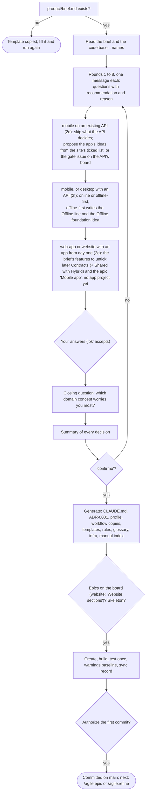

### /agile:idea
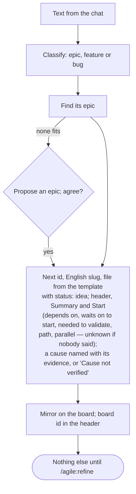

### /agile:discuss
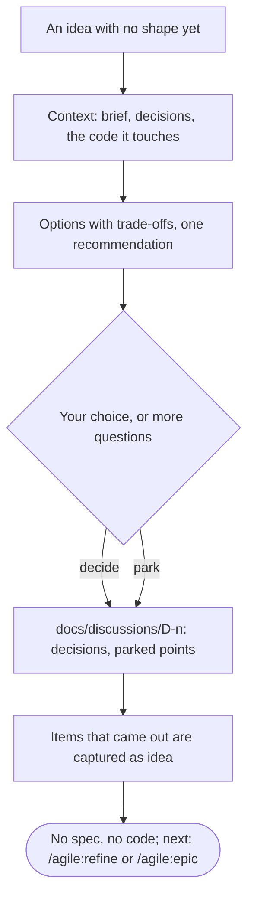

### /agile:epic
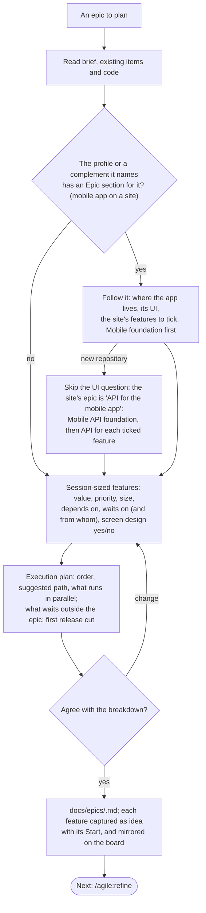

### /agile:refine


### /agile:screen
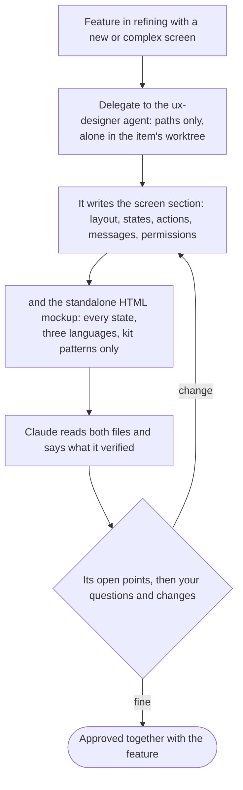

### /agile:build
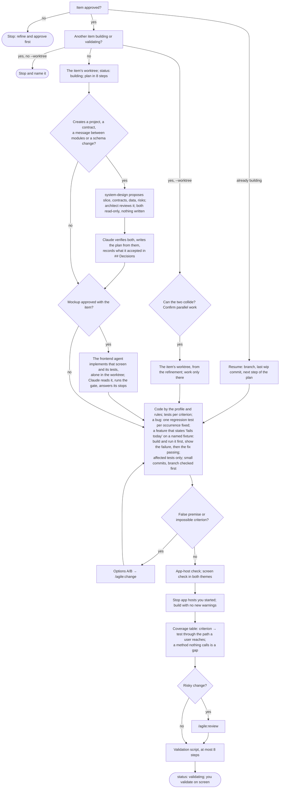

### /agile:review


### /agile:change


### /agile:ship
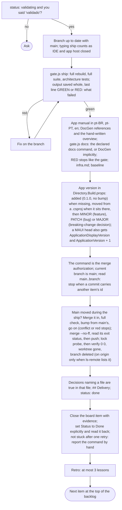

### /agile:retro
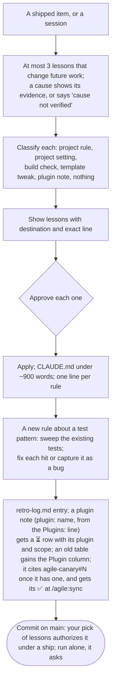

### /agile:pause


### /agile:status
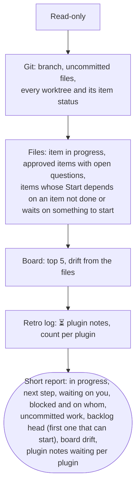

### /agile:sync
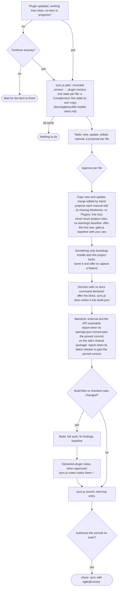

### /agile:identity
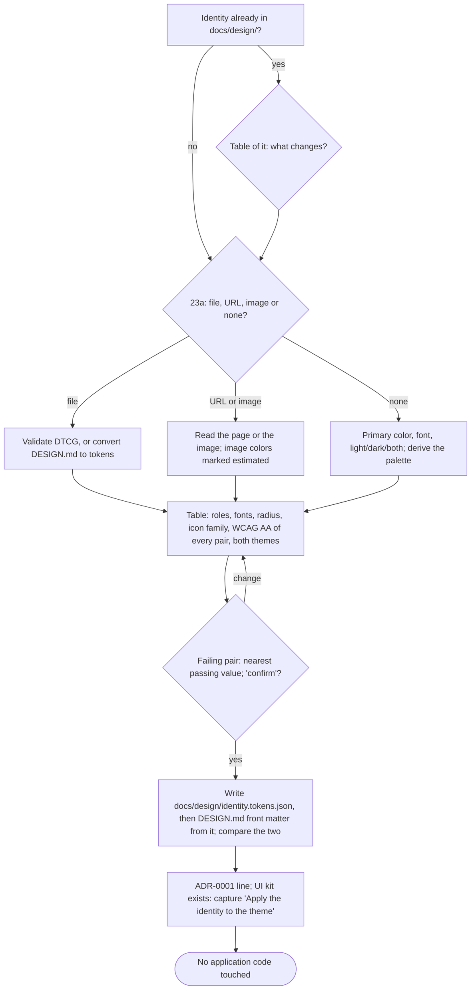

### /agile:autopilot
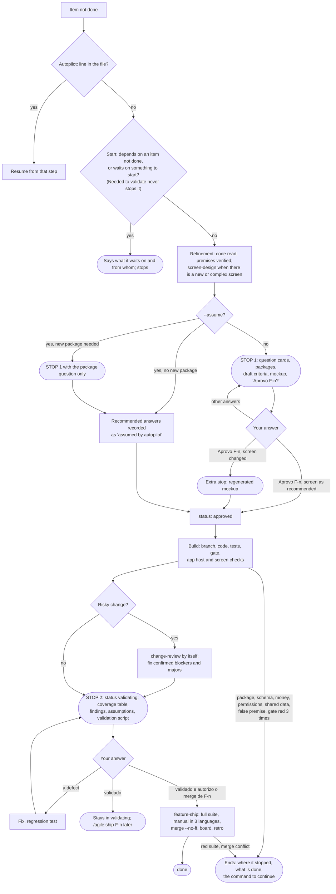

### /agile:version


### /agile:publish
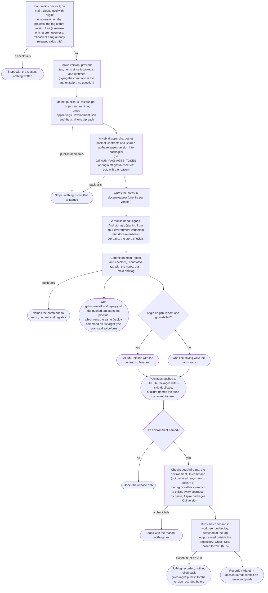
