# agile@canary — Manual (en)

> Version 0.0.31 (draft). Português: [pt-BR](workflow.pt-BR.md).

Contents
1. Concepts in two minutes
2. Roles
3. Setting up a project
4. Bootstrap quiz
5. Feature lifecycle
6. Changing your mind
7. The feature file
8. Definition of done
9. Quality gates
10. Board
11. Languages and the app manual
12. Architecture profiles
13. Sessions and pauses
14. Worked examples
15. Quick reference
16. Command flows

---

## 1. Concepts in two minutes

- **The chat is where ideas mature.** You and Claude talk about epics, features and use cases until they are clear. Nothing is coded while a feature is still being discussed.
- **The disk is the source of truth.** Every decision that matters ends up in a file with a `status:` header. The chat can be lost; the files cannot.
- **One feature at a time.** Only one feature is in `building` or `validating` at any moment.
- **Three human gates.** A feature is **approved** before code, **validated on screen** before merge, and **merged** only with your go-ahead.
- **Simple code.** The architecture profile chosen at bootstrap decides how much structure a module gets. CRUD stays a thin vertical slice.
- **Fast feedback.** Hooks build and test only what changed. The full suite runs once, when shipping.

## 2. Roles

| You (product owner) | Claude (engineer) |
|---|---|
| Write the product brief | Runs the bootstrap quiz and records the decisions |
| Propose epics and features in the chat | Registers them on the board, unrefined |
| Answer refinement questions and approve features | Asks **all** questions in one round, each with a recommendation, after checking the code |
| Validate each feature on screen | Implements, tests and hands over a validation script |
| Authorize merges | Merges, updates the board and the app manual, runs the retro |

Subagents are the exception: a fresh-context reviewer for risky changes, or parallel work that does not touch the same files. There is no chain of roles per feature.

**Models.** The model is chosen per activity, on purpose: the independent review runs on the strongest model, code searches on the smallest, bulk mechanical work that the tests verify on a mid model, and the main session on the model you pick. The `reviewer` agent declares its default model; your project overrides it in the "Models" section of `CLAUDE.md` (quiz question 34), never by editing the plugin.

## 3. Setting up a project

1. Install the plugin:
   ```
   /plugin marketplace add D:\dev\agile-canary
   /plugin install agile@canary
   ```
2. Create an empty repository and write `product/brief.md` using the brief template: problem, users, main capabilities, constraints, what is out of scope.
3. Run `/agile:bootstrap`.

## 4. Bootstrap quiz

`/agile:bootstrap` reads `product/brief.md` and asks questions in **rounds by topic**. For every question Claude gives a recommendation based on the brief and challenges answers that conflict with it. Decisions are made together; nothing is assumed.

| Round | Topics |
|---|---|
| 1. Shape | Type of app (web, mobile, API), architecture profile, deployment target |
| 2. Data | Database, multi-tenancy, soft delete, auditing |
| 3. Access | Authentication, RBAC, entitlements/plans (usage limits, trials, time-bound grants, promo codes), admin back office |
| 4. Integration | Messaging (none, in-process, broker), external services, file storage |
| 5. Experience | UI stack, languages (default pt-BR, pt-PT, en), accessibility, icon family, how an item is edited, UI kit and gallery |
| 6. Operations | Observability, hosting, CI, board (GitHub or Azure), environments |
| 7. Quality | Test budget per level, coverage expectations, architecture tests, models per activity |
| 8. Documentation | Technical docs generated from the code (entity diagrams, data dictionary, route map, module diagram) and a hand-written architecture overview |

When the brief names an existing code base to reuse and you give Claude access, it reads that code (never edits it) and uses what it finds as reasons. After round 8 comes one **closing question** — "which domain concept worries you most, or did the quiz not touch?" — because the core vocabulary of a domain (a taxonomy, an entitlement model, a scoring rule) rarely fits a fixed question list. What it raises is decided like any quiz question and recorded in ADR-0001.

Outputs, all in English:
- `CLAUDE.md` — short (≤ 60 lines), pointing to one profile.
- `docs/decisions/ADR-0001-foundation.md` — every quiz decision with its reason.
- `docs/agile/profile.md` — copy of the chosen architecture profile.
- `docs/agile/workflow.md` and `docs/agile/workflow.pt-BR.md` — this workflow in both languages, and `docs/agile/templates/` — the templates, copied into the project.
- `docs/glossary.md` — business terms and their English identifiers, and the technical terms Claude uses in reports and reviews (the review severities, for example) with the pt-BR word it uses when talking to you. A new technical term gets a row the first time it appears.
- `docs/infra.md` — how to run locally, which environments really exist (`provisioned` or `planned`), expected secrets (names only), release steps and measured build and test times. Updated on ship when any of it changes.
- Solution skeleton for the profile, with i18n and the test projects in place.
- `docs/architecture/` — when round 8 chose any document: `tools/<App>.DocGen` generates entity diagrams and a data dictionary per module (from the EF model), a route map per area (from the OpenAPI document) and a module diagram (from project references), all Mermaid; `/agile:ship` regenerates them and `--check` fails when they are stale. Optionally a one-page hand-written overview (C4 context and containers).
- The first epics on the board, if the brief already names them.

## 5. Feature lifecycle

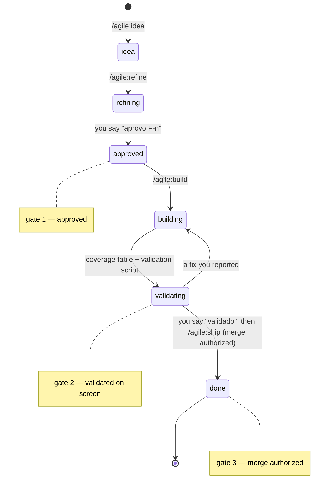

| Status | What happens | Who moves it |
|---|---|---|
| `idea` | Captured from the chat with `/agile:idea`. Title and 2-3 lines. | Claude |
| `refining` | `/agile:refine`: Claude reads the related code, then asks every open question in one round, as quiz cards grouped by topic (rules, permissions, states, screens, data, packages, scope) with the recommended option first; in a terminal the same questions come as a numbered list. The round includes the new packages the item needs, for the code **and for the tests**, so your yes is given once and not in the middle of the build. You answer; at most one follow-up round. The feature file is written. | Claude |
| `approved` | You approve the feature file after reading it. Open questions block approval. **Gate 1.** | You |
| `building` | `/agile:build`: branch, code, tests for what changed. Before the coverage table Claude opens the screen through the app host: tests do not see how the component library renders its states (an active link with no contrast, a link that is not a link). Keyboard checks stay in your validation script. Claude never changes state (sign-ups, counted requests, data) in an app host it did not start: it asks first, or uses data no one else uses and says which. Only one feature can be here. | Claude |
| `validating` | Claude hands over a validation script (≤ 8 steps). You try it on screen. A step that needs a terminal gives the command for Git Bash and for PowerShell 7, with the expected output and how to repeat it, and Claude has already run both. **Gate 2.** | You |
| `done` | `/agile:ship`: full test suite, merge after your go-ahead (**Gate 3**), board updated, app manual updated, retro. | Claude |

Small fixes found during validation are done right away, without leaving `validating`.

Before handing over the validation script, Claude shows a **criterion → test** table: every acceptance criterion points to its tests, or is explicitly left to the validation script. The test must go through the path a user reaches (page, endpoint, the handler that calls the code): a method written for a criterion that nothing in the app calls is a gap, even when its own test passes.

### Optional steps

| Command | When | Result |
|---|---|---|
| `/agile:discuss` | An idea with several possible directions, or doubts only you can answer | `docs/discussions/D-<n>-<slug>.md` (options, decisions, parked points) and the items captured as `idea` |
| `/agile:epic` | A new epic to plan | `docs/epics/<slug>.md` with prioritized, session-sized features, each captured as `idea` |
| `/agile:screen` | A feature in `refining` with a new or complex screen | Detailed screen section in the feature file and an HTML mockup (every state, three languages), approved together with the feature |
| `/agile:review` | A risky change (authentication, permissions, tenant isolation, data, contracts, money, or more than ~400 lines), before validation | Findings by severity from a read-only reviewer with fresh context; confirmed blockers are fixed before you validate |

## 6. Changing your mind

- **Before approval:** change anything. It is just conversation.
- **During build:** `/agile:change` adds a **change note** to the feature file (what changed, why, which acceptance criteria are affected). You re-approve only those criteria. Work continues.
- **After ship:** it is a new feature or a bug, captured with `/agile:idea`.
- **Wrong premise found** (for example, "the screen already has this field" and it does not): Claude stops and asks before coding around it.

## 7. The feature file

`docs/features/F-<number>-<slug>.md`, one per feature, created from `docs/agile/templates/feature.md`. Bugs use a shorter file, `docs/bugs/B-<number>-<slug>.md` (template `bug.md`): what happens, expected, confirmed cause (with every duplicate of a business rule), fix (which occurrences now, which deferred), one regression test per occurrence fixed and validation script.

Epics live in `docs/epics/<slug>.md` (features table, order, first release cut) and discussions in `docs/discussions/D-<n>-<slug>.md`. Screen mockups go to `docs/features/mockups/`.

Main sections of the feature file:

```markdown
---
feature: F-<number>
status: refining | approved | building | validating | done
board: <work item id>
---
# <Feature name>

## Goal
## Users and use cases
## Business rules
## Screens and API
## Acceptance criteria
## Decisions (date — decision — reason)
## Out of scope
## Open questions
## Change notes
## Validation script
```

## 8. Definition of done

- [ ] Acceptance criteria met and covered by tests.
- [ ] Build with no new warnings; affected tests green.
- [ ] Every UI string localized in pt-BR, pt-PT and en.
- [ ] Validated on screen by you.
- [ ] Full test suite green before merge.
- [ ] Generated technical docs up to date (`DocGen --check`), when the project has them.
- [ ] App manual updated in the three languages.
- [ ] Board updated; the feature file reflects what was decided.

## 9. Quality gates

Hooks run outside the model. They are Node scripts (no bash) and do nothing in a repository without a .NET project.

| When | What happens |
|---|---|
| **Session start** | Shows the branch, the item in progress, the backlog head, approved files with open questions, and uncommitted work in **every** worktree. |
| **Every commit** | A guard refuses a `git commit` on the main branch in two cases: an item branch (`feature/F-<n>`, `bug/B-<n>`) is unmerged and checked out nowhere — the sign that an IDE switched the branch behind the session — or the commit carries an item file that is not `done` (refining, approved, building, validating), which belongs on the item branch. Claude tells you and switches back; if the commit really belongs on the main branch, you say so and Claude repeats it ending with the comment `# agile:main-ok`. |
| **Every edit** | Nothing is built. The edited file is only remembered, under the git root it belongs to — so an edit inside a worktree is gated in that worktree, not in the folder where the session started. |
| **End of turn** (only if code changed) | Builds the changed projects and runs only the test projects that reference them, directly or indirectly. It never runs the whole suite. |
| **Ship** | `gate.js ship`: full rebuild, full suite, architecture tests. |

Details:
- **New warnings only.** Warnings are compared with `.claude/agile/warnings-baseline.json`, a committed file. Existing warnings do not fail the gate; a new one does, listed with file, line and message. The baseline is rewritten only by a green ship (or by `gate.js baseline`, with your yes).
- **The verdict is the last line.** Every report ends with `agile gate GREEN` or `agile gate RED: <what failed>` (the new warnings, the failing tests, the blocked build). Claude saves the whole output to a file and quotes from it, never filtering it with `grep`, `head` or `tail`: a filtered view once hid the only list of new warnings.
- **Wide changes.** If a change reaches more than 6 test projects, only the ones that reference it directly run; the rest waits for ship (`AGILE_GATE_MAX_TESTS`). A change to `.props`, `.targets` or the solution builds the whole solution and leaves the tests for ship.
- **Solution lookup.** The solution is searched at the git root and one folder down (`repo/App.slnx`, `src/App.sln`).
- **Locked build output.** A running app host, preview or debugger keeps the DLLs open. The gate then reports "build blocked" and names the process instead of a plain build failure; Claude stops whatever it started before the turn ends, and asks you to close yours.
- **Hung tests.** A test that runs for more than 120 seconds (`AGILE_GATE_HANG_TIMEOUT`) counts as hung: the run fails with its name instead of blocking the turn for minutes.
- **No loops.** After 3 red gates in a row the turn ends and you see the failure; the pending check stays for the next turn.
- **Known limit.** Only edits made with the editing tools are tracked. Changes made by a shell command (`dotnet format`, a merge) are caught at ship.
- `AGILE_HOOKS=off` disables the hooks for a session.

## 10. Board

`CLAUDE.md` has a `Board:` line: GitHub Issues + Projects (`gh`), Azure Boards (`az boards`), or none (then `docs/agile/backlog.md` is used). Mapping: epic → feature. No tasks per role. The feature file keeps the board id; the merge closes the work item.

## 11. Languages and the app manual

- Code, docs, commits and identifiers are in English.
- The app ships in **pt-BR, pt-PT and en** from day one: no hardcoded UI strings, one resource file per module per language, `IStringLocalizer`. Adding a language means adding resource files only.
- The **app manual** lives in `docs/manual/<locale>/` (pt-BR, pt-PT, en) and is updated when each feature ships.
- Only the conversation between you and Claude is in Portuguese.

## 12. Architecture profiles

The quiz picks one profile; `CLAUDE.md` points to it.

| Profile | When |
|---|---|
| `modular-monolith` | One deployable, several business modules with clear boundaries |
| `monolith` | One deployable, one business area |
| `web-app` | Mostly screens over simple data; thin API or server-side UI |
| `microservices` | Independent deployables owned separately; only with a real reason |
| `mobile` | Native or MAUI client, with its own API profile |

Each profile defines the folder layout, where business rules live, the test strategy and its time budget, and the architecture tests. The profile files are in `profiles/` in the plugin; bootstrap copies the chosen one to `docs/agile/profile.md`.

What every profile shares:
- **Simple code.** CRUD is a thin vertical slice (endpoint or page → `DbContext`): no repository, no mediator, no mapping library. A rule lives in its entity, or in the feature handler when it needs data. Structure is added on the second use.
- **One project per module.** In `modular-monolith` a module is one project plus a `Contracts` project. A module with a rich domain can use the Clean Architecture variant (five projects: Domain, Application, Infrastructure, Api, Contracts); Claude suggests it with a reason, you decide per module, and an ADR records it.
- **Time budget.** Unit < 30 s, integration < 2 min per test project, full suite < 5 min (smaller for `web-app` and `monolith`, < 10 min for `microservices`). **One PostgreSQL container per test project**, never one per test class.
- **Architecture tests** guard the boundaries and the English vocabulary in every assembly, and every rule of absence is paired with a rule of presence, so an empty assembly fails. A layout test keeps every project in the folder its profile assigns.

**Folder layout per profile.** Bootstrap creates it, and every project a feature adds later goes into the folder its kind has here; the solution folders mirror the disk folders, and a layout test fails when a project lands elsewhere. `<App>` is your app's name.

`modular-monolith` — hosts, technical building blocks and business modules in separate groups:
```
src/
├── Hosts/
│   ├── <App>.AppHost/                local orchestration (Aspire)
│   ├── <App>.ServiceDefaults/        telemetry, health, resilience
│   ├── <App>.Api/                    host only: composition, auth, OpenAPI
│   └── <App>.Web/                    Blazor UI, typed clients to the API
├── BuildingBlocks/
│   ├── <App>.SharedKernel/           Entity, TenantEntity, Result/Error, AppJson
│   └── <App>.<Block>/                Persistence, Email, Storage, Ai — by the first feature that needs it
└── Modules/
    └── <Module>/
        ├── <App>.<Module>/           one project per module (or five with Clean Architecture)
        │   ├── Features/<Feature>/   vertical slices
        │   ├── Domain/               entities with rules
        │   ├── Data/                 DbContext, own schema, migrations
        │   └── Resources/            .resx in en, pt-BR, pt-PT
        └── <App>.<Module>.Contracts/ what other modules may see
tests/
├── Hosts/<App>.Web.Tests/            bUnit
├── BuildingBlocks/<App>.<Block>.Tests/
├── Modules/<Module>/<App>.<Module>.Tests/
├── <App>.ArchitectureTests/          boundaries, vocabulary, layout
└── <App>.Testing/                    shared test helpers
```

`monolith` — one deployable with the business code inside it:
```
src/
├── <App>.AppHost/                    optional
├── <App>.Api/                        host + business code
│   ├── Features/<Feature>/
│   ├── Domain/
│   ├── Data/                         one DbContext, migrations
│   ├── Contracts/                    records shared with the UI
│   ├── Common/                       Result/Error, AppJson, helpers
│   └── Resources/
└── <App>.Web/                        Blazor UI, typed clients to the API
tests/
├── <App>.Tests/                      unit + integration
└── <App>.Web.Tests/                  bUnit
```

`web-app` — one Blazor project is the whole app:
```
src/
└── <App>.Web/                        the only deployable
    ├── Pages/<Area>/                 page + code-behind
    ├── Components/                   shared UI components
    ├── Features/<Feature>/           only when an operation has rules
    ├── Domain/
    ├── Data/                         one DbContext, migrations
    ├── Api/                          endpoints only for external clients
    ├── Common/                       Result/Error, AppJson, helpers
    └── Resources/
tests/
└── <App>.Tests/                      unit + integration + bUnit
```

`microservices` — one solution, one folder per service, each a small monolith:
```
src/
├── <App>.AppHost/                    every service, broker, databases
├── <App>.ServiceDefaults/
├── <App>.Gateway/                    routing and auth at the edge (YARP)
├── <App>.Web/                        Blazor UI, calls the gateway only
├── BuildingBlocks/
│   └── <App>.Messaging/              outbox, inbox, broker setup
└── Services/
    └── <Service>/
        ├── <App>.<Service>/          Features/, Domain/, Data/ (own database)
        └── <App>.<Service>.Contracts/ records and integration events
tests/
├── <App>.<Service>.Tests/            unit + integration + contract
├── <App>.Web.Tests/                  bUnit
├── <App>.ArchitectureTests/
└── <App>.SystemTests/                a few end-to-end flows
```

`mobile` — a testable core, a thin MAUI head, and the backend under its own profile:
```
src/
├── <App>.Api/                        backend, per its own profile
├── <App>.Contracts/                  records and error codes shared with the app
├── <App>.Mobile.Core/                plain library: everything testable
│   ├── Features/<Feature>/           view models, feature services
│   ├── Api/                          typed clients, AppJson
│   ├── Storage/                      local cache, offline queue
│   └── Resources/
└── <App>.Mobile/                     MAUI head: XAML pages, shell, platform code
tests/
├── <App>.Mobile.Core.Tests/          view models, services, offline queue
└── <App>.Tests/                      backend tests, per its profile
```

Shared rules live in `rules/core/` and are copied to `.claude/rules/agile/` at bootstrap: `workflow`, `naming`, `git`, `definition-of-done` and `output-style` are always loaded; `i18n` and `api-contracts` load only when Claude works on code files, `ui` only on screen files (`.razor`, `.xaml`), and `build-config` only on project and build files. One rule per line, at most 30 lines per file. Core rules are generic: they hold for every profile. Anything that depends on a profile, a stack or a UI library lives in the profile file, in `templates/dotnet/` or in a rule scoped by file type, and the plugin applies it to every profile it concerns.

**Rules the build checks.** Bootstrap copies `templates/dotnet/` to the solution root, in every profile: `Directory.Build.props` (shared settings, code style enforced in the build), `Directory.Packages.props` (every package version in one place), `.editorconfig` (the owner's rules: naming, braces on every block, pattern matching, expression-bodied members, formatting), `BannedSymbols.txt` (forbidden APIs such as `new JsonSerializerOptions`, `DateTime.Now`, `Thread.Sleep`) and `global.json`. A broken rule becomes a build warning, and the gate fails on new warnings — so the rule holds even when nobody remembers to read it. `TreatWarningsAsErrors` stays off. When a retro lesson can be checked by the build, it goes there first.

**Stack lessons.** A lesson from a real item that depends on the stack goes to the rule scoped to those files or to the profiles it concerns, never to an always-loaded rule. Examples from the first app: `api-contracts` says a custom middleware resolves an optional dependency inside the branch that needs it (an `InvokeAsync` parameter is resolved on every request) and that a client asks the API for the user's claims instead of decoding its access token (it may be encrypted); `build-config` says a version-dependent investigation reads the version resolved in `obj/project.assets.json`, not the pinned one; the profiles with an Aspire AppHost say code reaches Redis, PostgreSQL or a broker through the Aspire client integration, because local resources run with TLS by default, and that the generated `ServiceDefaults` turns off retries for POST (a retried POST replays single-use tokens); the profiles with a Blazor UI say that, with Interactive Server, state that changes during a session lives in a server-side store keyed by an id in the cookie, because a circuit cannot rewrite the cookie; and the test strategy of the profiles says a bUnit test waits for what an async click handler does (`WaitForAssertion`), and a test host created per test class clears its Npgsql pool on dispose, or the test database runs out of connections; and, with Interactive Server, data from the first request that a circuit needs (the visitor's address, a header) is read in `App` and passed to the interactive root, because a circuit has no `HttpContext`. `api-contracts` also says an anonymous endpoint that must give the same answer on every path runs every input check before the lookup that tells the paths apart.

**One behavior on every screen.** The `ui` rule keeps screens from drifting apart: a pattern is defined once, in a UI kit shown on a dev-only gallery page, and pages use the kit instead of raw library components. One icon family behind semantic names (`AppIcons.Edit`), one way to edit an item (row actions in the last column; dialog for simple entities, own page for complex ones; a name link only opens a read-only detail page), the same hover and focus everywhere, one confirmation dialog for destructive actions, the same feedback, list states, form layout and action vocabulary. Architecture tests forbid raw icons and raw tables outside the kit, and the kit comes before the first screen. The project records its choices (icon family, declared exceptions) in its own rules.

**Keeping a project up to date.** Bootstrap copies plugin files into the project (rules, templates, this workflow, the profile, the build files), so a plugin update does not reach them by itself. Update the plugin (`claude plugin marketplace update canary`, `claude plugin update agile@canary`, new session), then run `/agile:sync` in the project. Claude shows a table of what changed and copies only what you approve: a copy you never edited is replaced; a file you edited (usually the profile) is merged by hand, keeping your sections; build files (`Directory.Build.props`, `.editorconfig`, `global.json`...) are never copied over — each difference is proposed as an edit; your own rules (`project.md`, `*-project.md`) and `CLAUDE.md` are never touched. If build files or checked rules changed, Claude builds, runs the full suite and refreshes the warnings baseline. The version and what was copied are recorded in `.claude/agile/sync.json`. Run it between features, not in the middle of one.

`output-style` sets how Claude talks to you: in pt-BR, answer first, step reports of at most 10 lines, details in the file instead of the chat, one recommendation with its reason, no narration of the work, "not verified" said in those words, and bad news first. Long answers only when a gate failed, a question needs context, or you ask.

## 13. Sessions and pauses

- Start: Claude checks the branch, the board and the feature in progress before doing anything.
- Resume: `/agile:build <id>` on the item that is `building` continues from the last `wip` commit.
- Pause mid-feature: `/agile:pause`, or just say you are stopping. Claude commits on the feature branch with a `wip(F-<n>):` prefix and writes a note (where we stopped, what is next, who decides); nothing stays only on disk. Closing the session without a pause is fine too: the next session commits the leftover work as `wip` first.
- End: a short note (where we stopped, what is next, who decides).
- Before merging from a worktree: close any IDE or app host running from that folder.

**Two items in parallel.** The default is one item at a time. When you really want a second one running — a long feature in one session and a bug in another — type `/agile:build <id> --worktree`. The flag is your request for parallel work; Claude never creates a worktree by itself. It first tells you whether the two items can collide (same module schema, same screen, same contract) and recommends sequence when they do. Then it creates the branch in a separate folder outside the repository (`Worktrees:` in `CLAUDE.md`, default `<repository parent>/wt/<repository>/<type>-<n>`, kept short because of Windows path limits) and works only there: one writer per worktree. The item status lives in that worktree until the merge, and `/agile:status` and the session start read every worktree. Only one app host runs at a time (the ports collide); ignored local files are not carried over. On ship, the full check runs in the worktree and the merge in the main checkout; after the merge the worktree and the branch are removed, never with `--force` without asking, and the other item in progress is brought up to date. Recommended limit: two items — you validate each one on screen, and that is the real bottleneck.

## 14. Worked examples

All examples use a fictional app, **ExamPrep**: a platform where curators build a bank of exam questions and students practice with them. `>` marks what you type; `Claude:` marks the reply (shortened). In real sessions the chat is in Portuguese; it is shown in English here.

### 14.1 Bootstrapping a new app

**Before:** an empty repository with `product/brief.md`:

```markdown
# ExamPrep
Problem: candidates study with scattered PDFs of past exams.
Users: curators (build the question bank), students (practice).
Capabilities: exam boards and exams, question bank (8 question types), practice tests, progress reports.
Constraints: Brazil and Portugal; web first; one developer.
Out of scope (v1): payments, mobile app.
```

```
> /agile:bootstrap
```

```
Claude: I read product/brief.md. Round 1 of 7 — Shape.

1. Type of app → Recommendation: web app with an API (brief says "web first").
2. Architecture profile → Recommendation: modular-monolith.
   Reason: 4 business areas (catalog, question bank, practice, reports) with clear
   boundaries, but one developer — one deployable keeps operations simple.
3. Deployment target → Recommendation: containers, local with .NET Aspire, Azure later.

Answer each one ("ok" accepts the recommendation) or tell me what to change.
```

```
> 1 ok. 2 ok. 3 ok, but no Azure decision yet.
```

```
Claude: Recorded: deployment target = containers + Aspire; cloud provider deferred.

Round 2 of 7 — Data.
4. Database → Recommendation: PostgreSQL.
5. Multi-tenancy → Question: will schools or prep courses have private question banks?
   The brief does not say. If yes, tenant isolation must exist from day one.
...
```

After round 7, Claude asks the closing question, settles what it raises, shows a summary of every decision and asks for confirmation. Then it creates:

```
CLAUDE.md                                  52 lines, points to the profile
docs/decisions/ADR-0001-foundation.md      every decision, with its reason
docs/agile/profile.md                      modular-monolith profile
src/ExamPrep.AppHost, src/ExamPrep.Api, src/ExamPrep.Web, src/Modules/...
tests/...                                  unit + integration (shared Postgres container)
Resources/*.pt-BR.resx, *.pt-PT.resx, *.en.resx
docs/manual/{pt-BR,pt-PT,en}/index.md
```

and the epics from the brief on the board: *Catalog*, *Question bank*, *Practice tests*, *Progress reports*.

### 14.2 A feature from idea to done

**Idea.** During a chat about the catalog:

```
> Curators need to register exam boards (name and acronym). Register it.
```

```
> /agile:idea "Exam board registration: name and acronym, list and edit"
```

```
Claude: Created feature F-3 "Exam board registration" (board #12) under epic "Catalog".
Status: idea. Nothing else is done until we refine it.
```

**Refinement.** When it is this feature's turn:

```
> /agile:refine F-3
```

```
Claude: I checked the code: the Catalog module exists but has no entities yet.
The user and role model from bootstrap has Curator and Admin.
```

The questions come as quiz cards, one per topic, the recommended option first. In the desktop app you click; in a terminal the same questions arrive as a numbered list you answer with "ok" or a letter. The first card, "Rules":

```
[Rules]
1. Is the acronym unique?
   ● Yes, case-insensitive (Recommended) — "FGV" and "fgv" are the same board
   ○ Yes, case-sensitive
   ○ No
2. Can an exam board be deleted?
   ● Deactivate only (Recommended) — exams will reference it
   ○ Hard delete
3. Maximum lengths?
   ● Name 120, acronym 20 (Recommended)
   ○ Other (type them)
```

Then "Permissions" and "Screens":

```
[Permissions]
1. Who can edit?
   ● Curator and Admin (Recommended) — curators own the catalog
   ○ Admin only
[Screens]
1. Is the list paged or searchable?
   ● Search by name/acronym, 20 per page (Recommended)
   ○ Plain list, no search
```

```
> Rules: all recommended. Permissions: Admin only. Screens: recommended.
```

Claude writes `docs/features/F-3-exam-board-registration.md`:

```markdown
---
feature: F-3
status: refining
board: 12
---
# Exam board registration

## Goal
Let admins keep the list of exam boards used by exams and questions.

## Users and use cases
- UC1 Admin registers an exam board (name, acronym).
- UC2 Admin edits an exam board.
- UC3 Admin deactivates / reactivates an exam board.
- UC4 Admin and curators search the list.

## Business rules
- BR1 Acronym is unique, case-insensitive.
- BR2 Deactivated boards cannot be chosen for new exams but keep existing links.
- BR3 Name ≤ 120, acronym ≤ 20 characters.

## Screens and API
- /catalog/exam-boards (list, search, 20 per page)
- /catalog/exam-boards/new and /{id}/edit
- GET/POST/PUT /api/v1/catalog/exam-boards; POST .../{id}/deactivate|reactivate

## Acceptance criteria
- AC1 Given a new name and acronym, when saved, then the board appears in the list.
- AC2 Given an existing acronym in another case, when saved, then error `exam_board.acronym_taken`.
- AC3 Given a curator, when opening the new/edit screens, then access is denied.
- AC4 All texts appear in pt-BR, pt-PT and en.

## Decisions
- 2026-09-20 — Admin only edits (not curators) — owner decision.

## Out of scope
- Import from a file.

## Open questions
- (none)
```

```
Claude: F-3 is ready for approval. Read the file; reply "approve F-3" or tell me what to change.
> approve F-3
```

Status becomes `approved` (**Gate 1**).

**Build.**

```
> /agile:build F-3
```

```
Claude: No other feature is in progress. Branch feature/F-3 created. Status: building.
...
Done:
- ExamBoard entity + configuration + migration AddExamBoards
- Endpoints with error codes exam_board.acronym_taken / exam_board.not_found
- Pages List / Form, texts in 3 resource files
- 14 tests (Catalog.Tests 3.1 s, Web.Tests 1.8 s) — green

Criterion → test:
| AC1 list        | ExamBoardsPage_Open_ShowsActiveBoards                        |
| AC3 unique      | CreateExamBoard_DuplicateAcronym_Returns409                  |
| AC5 deactivate  | ExamBoardsPage_Deactivate_ShowsInactive                      |
| AC7 languages   | validation script, step 7                                    |
AC5 was first a gap: ExamBoard.Deactivate had a passing test, but no page or
endpoint called it. Added the endpoint and the button, then the page test above.

Validation script (F-3):
1. Start the AppHost and sign in as admin.
2. Menu Catalog → Exam boards: empty list.
3. New: "Fundação Getulio Vargas" / "FGV" → saved, appears in the list.
4. New: "Other" / "fgv" → message "Acronym already in use".
5. Edit FGV, change the name → list shows the new name.
6. Deactivate FGV → status "Inactive"; reactivate it.
7. Switch language to pt-PT and en → texts change.
8. Sign in as curator → New/Edit are not available.
Status: validating.
```

When a step needs a terminal (a limit, an endpoint with no screen yet), it comes for both shells, already run by Claude:

```
4. Six sign-up attempts in a row from the same address: the 6th is refused.
   Git Bash:     for i in 1 2 3 4 5 6; do curl -sk -o /dev/null -w "%{http_code}\n" -X POST https://localhost:7101/api/v1/auth/sign-up -H "Content-Type: application/json" -d '{}'; done
   PowerShell 7: 1..6 | % { (Invoke-WebRequest -Method Post https://localhost:7101/api/v1/auth/sign-up -ContentType application/json -Body '{}' -SkipCertificateCheck -SkipHttpErrorCheck).StatusCode }
   Expected: 400 five times, then 429. To repeat: wait one minute.
```

**Validation** (**Gate 2**):

```
> Step 4 shows the message, but it is in English even in pt-BR.
Claude: A resource key was missing in the pt-BR file. Fixed; test added for AC4. Try step 4 again.
> ok, validated.
```

**Ship** (**Gate 3**):

```
> /agile:ship F-3
```

```
Claude: Full suite: 212 tests green (2 min 10 s). Architecture tests green.
Ready to merge feature/F-3 into main. Authorize?
> yes
Claude: Merged. Board #12 closed. Manual updated: "Exam boards" page in pt-BR, pt-PT, en.
Retro: one lesson — "check every language file when adding a message". Add it as a rule?
> yes
Claude: Rule added to core/i18n. Status: done.
```

### 14.3 Changing your mind during build

While F-7 "Question registration" is in `building`:

```
> I want the "year" field to be optional for questions without an exam.
> /agile:change F-7
```

```
Claude: Change note added to F-7:
- What: Year becomes optional when no exam is linked.
- Why: authored questions have no exam year.
- Affected: BR4 (year required) and AC5. Other criteria unchanged.
Re-approve BR4 and AC5 as rewritten below? (the rest of the work continues)
> approve
```

The build continues from where it was. Nothing is redone.

### 14.4 A wrong premise found during build

```
Claude: Stopping F-9 "Edit question exam". The feature assumes the edit screen already
lets users change the subject, but it has no subject, board or year fields, and the
update API does not accept them. Options:
A. Add subject/board/year editing to F-9 (bigger, but the feature works end to end).
B. Keep F-9 to exam link only; register a new feature for the missing fields.
Recommendation: A, because rule BR3 ("choose a covered subject") is impossible without it.
> A
Claude: Change note added; scope and criteria updated for your approval.
```

### 14.5 A bug after ship

```
> The exam board list does not find "FGV" when I search "fgv".
> /agile:idea "Bug: exam board search is case-sensitive"
Claude: Created bug B-2 (board #31), linked to F-3.
> /agile:refine B-2
Claude: Cause confirmed in the query (plain equality). One question: should search also
ignore accents ("Fundacao" finds "Fundação")? Recommendation: yes.
> yes
```

The bug follows the same lifecycle, with one short file: cause, expected behavior, a test that reproduces it, and the validation script.

When the cause is a business rule, refinement also searches the whole solution for the same rule implemented again elsewhere (common in apps that grew without a shared rules layer), writes every occurrence under `## Cause` before asking anything, and asks which ones to fix now and which to record as debt:

```
> /agile:refine B-4
Claude: Cause confirmed: Enrollment/CpfValidator.cs:41 skips the second check digit.
The same check is implemented again in two other places (not callers of the validator):
  - Import/StudentCsvReader.cs:88 (own copy, same defect)
  - Web/Pages/Enroll.razor.cs:132 (own copy, correct)
All three are listed under ## Cause in docs/bugs/B-4-cpf-check-digit.md.
[card: Business rules]
  Which occurrences does B-4 fix?
  ● All three: the reader and the page call CpfValidator (Recommended)
    Only the validator and the reader; the page copy stays as recorded debt
    Only the validator
> (picks the first)
Claude: B-4 approved. The build adds one regression test per occurrence fixed.
```

### 14.6 Pausing and resuming

You stop whenever you want, in your own words or with the command; both do the same thing. In the middle of F-7:

```
> /agile:pause
Claude: Paused. Commit "wip(F-7): question form without type editor" on feature/F-7 (local, not pushed).
Next: type editor for T1-T3. Decision pending with you: none. Nothing running.
```

"Vamos parar por hoje" or "continuo amanhã" does exactly the same. If you just close the session, nothing is lost either: the next session starts by showing the uncommitted work, and Claude commits it as `wip` before anything else, with your OK.

Next session:

```
> /agile:status
```

```
Claude:
In progress: F-7 Question registration — building (branch feature/F-7, 1 wip commit)
Next step: type editor for T1-T3
Open questions: none
Backlog head: F-8 Question review queue (idea), B-3 Search accents (idea)
```

To continue, run the build again on the same item; Claude resumes instead of starting over:

```
> /agile:build F-7
Claude: Resuming F-7 from wip commit "question form without type editor" on feature/F-7.
Next: type editor for T1-T3 (step 4 of the plan). Continuing.
```

### 14.7 From a loose idea to an epic

```
> I'm thinking about practice tests that adapt to the student's level. Not sure how.
> /agile:discuss "adaptive practice tests"
```

```
Claude: What we know: the brief lists practice tests; questions have no difficulty field yet.
Options:
A — Fixed tests chosen by the curator (S). Simple; no adaptation.
B — Difficulty levels on questions + tests that pick by level (M). Needs difficulty data.
C — Adaptive engine that adjusts during the test (L). Needs history and tuning.
Recommendation: B now, C later — B creates the difficulty data C will need.
Questions:
1. Who sets the difficulty? → Recommendation: curator, with 3 levels.
```

```
> B, 3 levels, curator sets it. Park C.
Claude: D-1 recorded (decided; C parked). Captured F-12 "Question difficulty" and
F-13 "Practice test by level". They belong to a new epic "Practice tests" — plan it now?
> /agile:epic "Practice tests"
```

```
Claude:
| Id   | Feature                 | Priority | Size | Depends on | Screen design |
| F-12 | Question difficulty     | Must     | S    | -          | no            |
| F-13 | Practice test by level  | Must     | M    | F-12       | yes           |
| F-14 | Practice test results   | Must     | M    | F-13       | yes           |
| F-15 | Retry wrong answers     | Should   | S    | F-14       | no            |
Order: F-12, F-13, F-14, F-15. First release cut: F-12 to F-14.
1. Is F-15 in the first release? → Recommendation: no.
> ok
Claude: docs/epics/practice-tests.md agreed. F-14 and F-15 captured. Next: /agile:refine F-12.
```

### 14.8 Screen design and review

During the refinement of F-13:

```
> /agile:screen F-13
Claude: Mockup sent: docs/features/mockups/F-13-practice-test-by-level.html
States: loading, no questions for the level, ready, answering, time over, finished, error.
Decisions: one question per page (mobile-friendly); timer visible only when the test has a limit.
1. Can the student go back to a previous question? → Recommendation: yes, until finishing.
> yes
> approve F-13
```

At the end of the build of F-14 (it writes results and changes the students' data):

```
Claude: This change touches student data. Running /agile:review before validation.
| Severity | Finding                                   | Verdict   | Action               |
| blocker  | Results endpoint does not check the owner | confirmed | fixed + test         |
| minor    | Duplicate mapping in ResultsPage          | confirmed | fixed                |
| major    | "Score can be negative"                   | rejected  | BR2 allows penalties |
Criterion → test: AC1-AC6 covered; AC7 (language switch) in the validation script.
Status: validating. Validation script: ...
```

### 14.9 Two items in parallel

F-6 is a long build in one session. A bug appears and the owner wants it fixed meanwhile, in another session:

```
> /agile:build B-2 --worktree
Claude: F-6 is building in this checkout (feature/F-6). B-2 touches Identity/Login only;
F-6 touches Catalog. No shared schema or screen: they can run in parallel.
Worktree: D:\dev\wt\examprep\bug-2 (outside the repository). Create it?
> yes
Claude: Created bug/B-2 in D:\dev\wt\examprep\bug-2, status building (on that branch).
Only one app host at a time: stop the one from the main checkout before I open the screen here.
```

At the start of any session, the status shows both:

```
[agile] branch feature/F-6
In progress: F-6 Practice test by level — building (docs/features/F-6-...)
In progress in a worktree: B-2 — building [bug/B-2] D:/dev/wt/examprep/bug-2
```

Shipping the bug: the full check runs in the worktree, the merge in the main checkout.

```
> /agile:ship B-2
Claude: Close any IDE or app host running from D:\dev\wt\examprep\bug-2, then say "closed".
> closed
Claude: Full suite green in the worktree (212 tests, 1 min 58 s). Ready to merge bug/B-2 into main. Authorize?
> yes
Claude: Merged. Worktree removed, branch deleted, 0 0 against origin/main. F-6 is now 1 commit behind main:
bringing it up to date before its next test run.
```

### 14.10 Updating the plugin and the project

A lesson for the plugin starts in a project's retro: it becomes a ⏳ row under "Plugin notes — status" in `docs/agile/retro-log.md`. From the plugin's session:

```
> vamos ajustar o plugin com as recomendações em retro-log.md
Claude: 2 open notes (F-8). Done in 0.0.29: bUnit waits (4 profiles), Npgsql pool (5 profiles),
manuals en/pt-BR. Rows marked ✅ in retro-log.md (not committed).
1. Push the plugin?  2. Update the installed plugin?  3. Commit in the project?
> pode fazer o push, atualizar o plugin e o commit no simulab
```

Each of the three is asked for separately, and so is the project's push. The project gets the new files only through `/agile:sync`, between features.

The plugin moved from 0.0.10 to 0.0.13. First the plugin itself (terminal, then a new session):

```
claude plugin marketplace update canary
claude plugin update agile@canary
```

Then, in the project, between features:

```
> /agile:sync
Claude: agile@canary 0.0.10 → 0.0.13.
| File                                   | State  | Proposal                                              |
| .claude/rules/agile/git.md             | update | copy: branch check before every commit, guard hook    |
| docs/agile/workflow.md                 | update | copy: manual 0.0.13                                   |
| docs/agile/profile.md                  | edited | merge: two new test lines; your Simulab section stays |
| .editorconfig                          | manual | one line differs: CA1716 = none. Add it?              |
Nothing else changed. Your project.md, ui-project.md and CLAUDE.md are not touched.
> ok
Claude: Copied 2, merged 1 (no conflicts), .editorconfig edited. Build 0 warnings; 252 tests green (9 s).
Recorded 0.0.13 in .claude/agile/sync.json. Commit "chore: sync with agile@canary 0.0.13" on main. Authorize?
```

From 0.0.23 the template carries the final `.editorconfig`. In a project that still has the basic one, the `.editorconfig` row lists the new groups of rules (braces, pattern matching, expression-bodied members, formatting) and Claude proposes them one group at a time; code that breaks an approved rule shows up as warnings in the build that follows the sync.

### 14.11 When a gate says no

**A running app locks the build.** Claude opened the screen to check it and forgot the app host:

```
[agile gate] build blocked: ExamPrep.slnx
the build output is locked by a running process (ExamPrep.Web (18344)): stop the app host, preview or
debugger started from this folder, then build again.
Claude: My app host was still running. Stopped it; building again... green.
```

**A new warning at ship.** The list and the verdict come last, so they survive any view of the output:

```
new warnings (fix them, or accept with `node gate.js baseline` after the owner agrees):
src/ExamPrep.Web/Pages/Results.razor.cs|RS0030 (0 -> 1)
  src/ExamPrep.Web/Pages/Results.razor.cs(42,19): RS0030 The symbol 'DateTime.Now' is banned in this project: ...
agile gate RED: 1 new warning(s): RS0030 in src/ExamPrep.Web/Pages/Results.razor.cs
Claude: Replaced DateTime.Now with the injected TimeProvider; ship again... agile gate GREEN.
```

**A test hangs.** Instead of blocking the turn for minutes:

```
[agile gate] a test hung (more than 120 s) or the test host crashed: tests/ExamPrep.Web.Tests
not finished: ExamPrep.Web.Tests.Ui.ConfirmDialogTests.Confirm_ReturnsTrue
Claude: The test awaited a dialog result inside InvokeAsync. Fixed with the shared test context; 14 tests green (2 s).
```

**A commit on the wrong branch.** The IDE switched the branch to main while F-6 was being built:

```
Claude: git commit -m "feat(F-6): add level filter"
[agile guard] This commit would land on `main`, but `feature/F-6` is not merged and is checked out nowhere.
The branch was probably switched outside this session (an IDE?). Run `git branch --show-current` ...
Claude: The checkout is on main; feature/F-6 is where this belongs. I am switching back to feature/F-6
and committing there. Nothing landed on main.
```

The same guard refuses a refinement or build commit that would put an item file on main:

```
Claude: git commit -m "docs(F-8): refine and approve"
[agile guard] This commit would land on `main` and carries `docs/features/F-8-question-review-queue.md` (approved).
An item that is not done is committed on its own branch ...
Claude: Creating feature/F-8 from main and committing there.
```

When a commit really belongs on main while an item is open (a retro note, for instance), Claude asks, and with your yes repeats the command ending with `# agile:main-ok`. A retro commit carries only rules, `CLAUDE.md`, templates and the retro log; a lesson that needs code becomes an item, so the code goes through the gate on its own branch.

### 14.12 The closing question of the quiz

After round 7, before the summary:

```
Claude: Closing question, no recommendation: which domain concept worries you most, or did the quiz not touch?
> The subject taxonomy. Every exam board names subjects differently and some group two of them.
Claude: Facts from the code you gave me: three fixed levels, questions point to the lowest one, no aliases.
Options: A) keep three levels; B) two canonical levels + the notice's own subjects mapped to them + aliases.
Recommendation: B — the notice keeps its vocabulary, analytics compare across exams.
> B
Claude: Recorded in ADR-0001 under "After the quiz"; brief capability 2 updated. Now the summary...
```

## 15. Quick reference

You only type the commands below. Each one loads a skill with the full procedure (for example, `/agile:bootstrap` loads `bootstrap-quiz`); the skills are hidden from the `/` menu and Claude loads them.

| Command | Use |
|---|---|
| `/agile:bootstrap` | Quiz from the brief → `CLAUDE.md`, ADR, profile, skeleton |
| `/agile:discuss "<idea>"` | Explore an idea: options, decisions, items captured |
| `/agile:epic "<name>"` | Break an epic into prioritized features |
| `/agile:idea "<text>"` | Capture an epic, feature or bug, unrefined |
| `/agile:refine <feature>` | Refinement round → feature file for approval |
| `/agile:screen <feature>` | Screen details and HTML mockup during refinement |
| `/agile:build <feature> [--worktree]` | Implement an approved feature (one at a time; `--worktree` for a second one in parallel) |
| `/agile:review <feature>` | Fresh-context review of a risky change |
| `/agile:change <feature>` | Record a change of mind during build |
| `/agile:ship <feature>` | Full suite, merge, board, app manual |
| `/agile:retro` | Turn lessons into rules or skills |
| `/agile:pause [note]` | Stop for now: wip commit on the item branch and a note of where we stopped |
| `/agile:status` | Feature in progress, backlog head, open questions |
| `/agile:sync` | After a plugin update: refresh the project's copies of rules, templates, workflow and profile |

## 16. Command flows

One diagram per command: what you do, what Claude does, and where it stops to ask you. Rectangles are Claude's steps, diamonds are your decisions, rounded boxes are the result.

### /agile:bootstrap


### /agile:idea
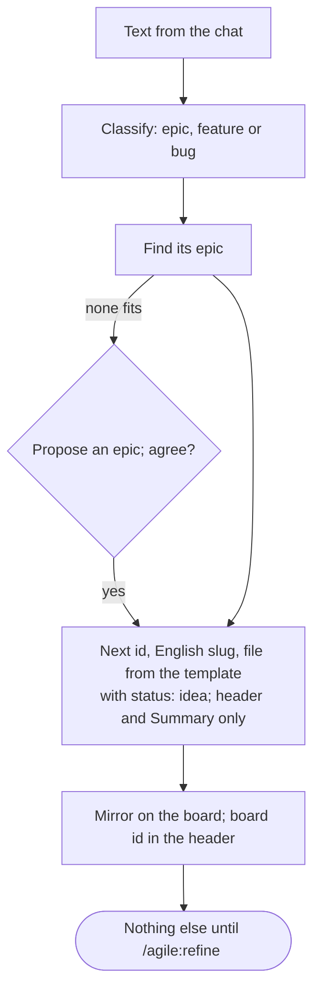

### /agile:discuss


### /agile:epic
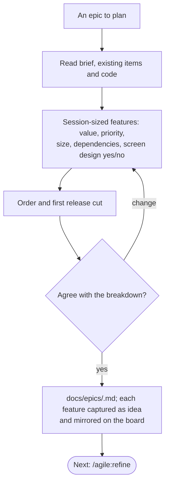

### /agile:refine
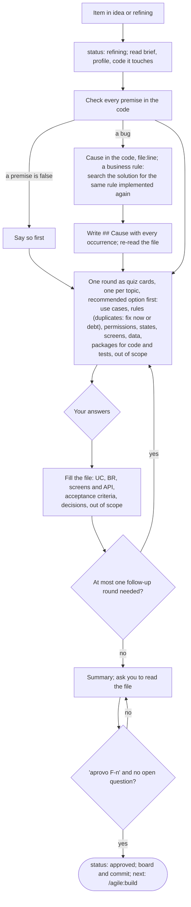

### /agile:screen
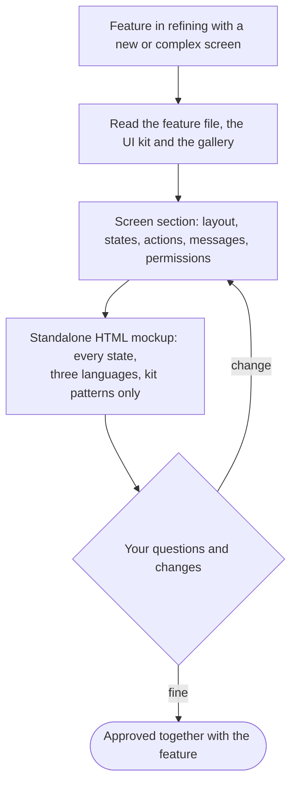

### /agile:build
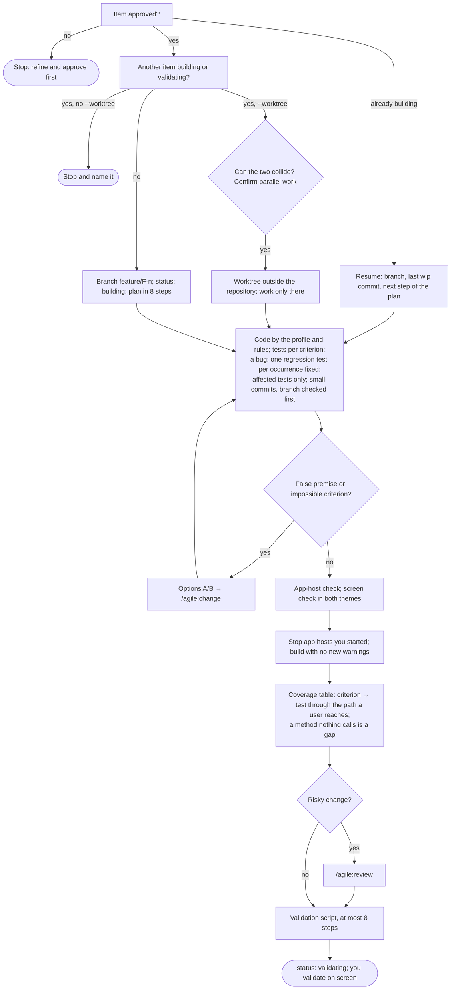

### /agile:review
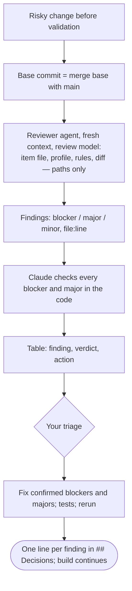

### /agile:change


### /agile:ship
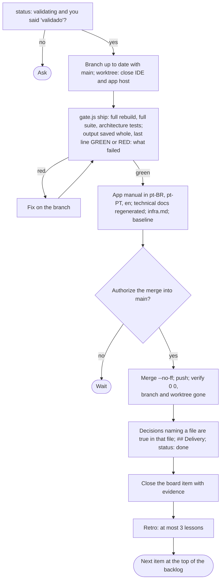

### /agile:retro
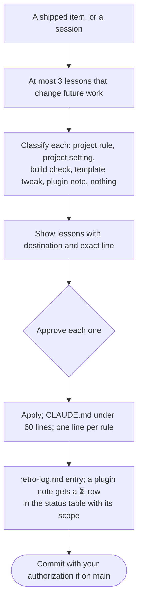

### /agile:pause
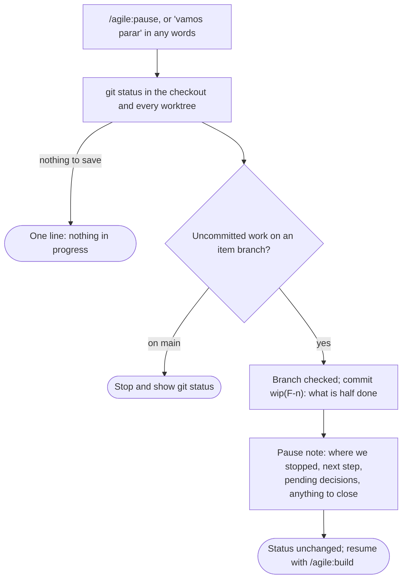

### /agile:status
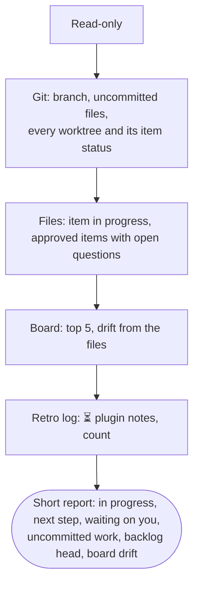

### /agile:sync
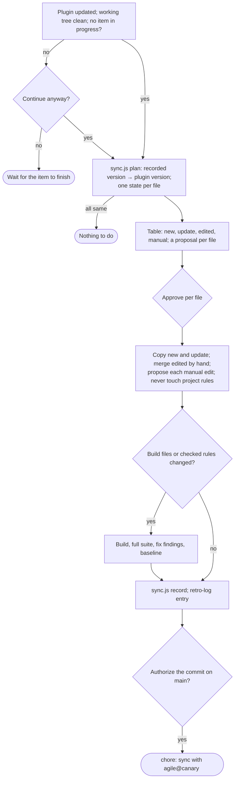
