# agile@canary — Manual (en)

> Version 0.0.78 (draft). Português: [pt-BR](workflow.pt-BR.md).

Contents
1. Concepts in two minutes
2. Roles
3. Setting up a project
4. Bootstrap quiz
5. Feature lifecycle
6. Changing your mind
7. The feature file
8. Definition of done
9. Quality gates
10. Board
11. Languages and the app manual
12. Architecture profiles
13. Sessions and pauses
14. Worked examples
15. Quick reference
16. Command flows

---

## 1. Concepts in two minutes

- **The chat is where ideas mature.** You and Claude talk about epics, features and use cases until they are clear. Nothing is coded while a feature is still being discussed.
- **The disk is the source of truth.** Every decision that matters ends up in a file with a `status:` header. The chat can be lost; the files cannot.
- **One feature at a time.** Only one feature is in `building` or `validating` at any moment.
- **Three human gates.** A feature is **approved** before code, **validated on screen** before merge, and **merged** only with your go-ahead.
- **Simple code.** The architecture profile chosen at bootstrap decides how much structure a module gets. CRUD stays a thin vertical slice.
- **Fast feedback.** Hooks build and test only what changed. The full suite runs once, when shipping.

## 2. Roles

| You (product owner) | Claude (engineer) |
|---|---|
| Write the product brief | Runs the bootstrap quiz and records the decisions |
| Propose epics and features in the chat | Registers them on the board, unrefined |
| Answer refinement questions and approve features | Asks **all** questions in one round, each with a recommendation, after checking the code |
| Validate each feature on screen | Implements, tests and hands over a validation script |
| Authorize merges | Merges, updates the board and the app manual, runs the retro |

Subagents are the exception: a fresh-context reviewer for risky changes, two read-only passes before the code of a heavier item (`system-design` proposes the slice, the contracts and the data; `architect` reviews that proposal), two producing roles for screens (`ux-designer` designs one, `frontend` implements the mockup you approved), or parallel work that does not touch the same files. They are named jobs, not a chain of roles per feature, and none of them talks to you: the conversation is always with Claude, which reads what an agent wrote or proposed before following it. One writer at a time in a folder, and the two passes write nothing at all.

**Models.** The model is chosen per activity, on purpose: the independent review, the design and architecture passes and the screen design run on the strongest model, code searches on the smallest, screen implementation and bulk mechanical work that the tests verify on a mid model, and the main session on the model you pick. Each agent (`reviewer`, `system-design`, `architect`, `ux-designer`, `frontend`) declares its default model; your project overrides it in the "Models" section of `CLAUDE.md` (quiz question 34), never by editing the plugin.

## 3. Setting up a project

1. Install the plugin:
   ```
   /plugin marketplace add D:\dev\agile-canary
   /plugin install agile@canary
   ```
2. Create an empty repository and write `product/brief.md` using the brief template: problem, users, main capabilities, constraints, what is out of scope.
3. Run `/agile:bootstrap`.

## 4. Bootstrap quiz

`/agile:bootstrap` reads `product/brief.md` and asks questions in **rounds by topic**. For every question Claude gives a recommendation based on the brief and challenges answers that conflict with it. Decisions are made together; nothing is assumed.

Before anything is written, Claude checks that the skill it loaded and the installed plugin are the same version. When they differ it says so and copies from the installed one: otherwise the project records where its copies came from incorrectly, and the next `/agile:sync` compares against the wrong text.

| Round | Topics |
|---|---|
| 1. Shape | Type of app (web, mobile, API), architecture profile, deployment target |
| 2. Data | Database (the house engine when there is an existing system next door), multi-tenancy, deletion, auditing, personal data and retention |
| 3. Access | Authentication, RBAC, the identity bridge to a neighbouring system's users, entitlements/plans (usage limits, trials, time-bound grants, promo codes), admin back office |
| 4. Integration | Messaging (none, in-process, broker), external services, file storage, and — when a feature calls a model — the LLM provider and where it runs, its cost ceiling and how it is faked in tests |
| 5. Experience | UI stack, languages (default pt-BR, pt-PT, en), accessibility, icon family, how an item is edited, UI kit and gallery — or, for a conversational UI, the language it answers in, how a proposal is corrected and a states gallery |
| 6. Operations | Observability, hosting, CI, board (GitHub or Azure), environments, the house conventions when the code lives beside an existing system, and — always — where the item worktrees live (`D:\wt\<repository>`, or `C:\` without a D: drive) |
| 7. Quality | Test budget per level, coverage expectations, architecture tests, models per activity, and evals when a feature calls a model |
| 8. Documentation | Technical docs generated from the code (entity diagrams, data dictionary, route map, module diagram, and a tool catalogue when the app exposes tools to a model), the system prompt as a versioned file, and a hand-written architecture overview |

When a feature calls a model, the quiz treats it as a system with its own decisions, not as a library: which provider and where it runs (a self-hosted one is the only place the data never leaves), a cost ceiling per user and a global breaker, a scripted fake so everything around the model stays testable, the system prompt as a versioned file, and a generated tool catalogue saying what each tool reaches and with whose permission. Example 14.14 shows the round.

When the brief names an existing code base to reuse and you give Claude access, it reads that code (never edits it) and uses what it finds as reasons. After round 8 comes one **closing question** — "which domain concept worries you most, or did the quiz not touch?" — because the core vocabulary of a domain (a taxonomy, an entitlement model, a scoring rule) rarely fits a fixed question list. What it raises is decided like any quiz question and recorded in ADR-0001.

Outputs, all in English:
- `CLAUDE.md` — short (≤ 60 lines), pointing to one profile.
- `docs/decisions/ADR-0001-foundation.md` — every quiz decision with its reason.
- `docs/agile/profile.md` — copy of the chosen architecture profile.
- `docs/agile/workflow.md` and `docs/agile/workflow.pt-BR.md` — this workflow in both languages, and `docs/agile/templates/` — the templates, copied into the project.
- `docs/glossary.md` — business terms and their English identifiers, and the technical terms Claude uses in reports and reviews (the review severities, for example) with the pt-BR word it uses when talking to you. A new technical term gets a row the first time it appears.
- `docs/infra.md` — how to run locally, which environments really exist (`provisioned` or `planned`), expected secrets (names only), release steps and measured build and test times. Updated on ship when any of it changes.
- Solution skeleton for the profile, with i18n and the test projects in place.
- `docs/architecture/` — when round 8 chose any document: `tools/<App>.DocGen` generates, per module, a DBML schema read in a dbdiagram viewer (`entities: "mermaid"` in `docgen.json` gives an ER diagram instead, which renders on the board but grows unreadable past a dozen tables) and a data dictionary (from the EF model), a route map per area (from the OpenAPI document that the `/openapi/v1.json` integration test writes to `docs/api/`) and a module diagram (from project references, in Mermaid); the generator references the app's own EF Core provider (question 5: PostgreSQL, SQL Server or SQLite) and calls it by reflection, so it documents the real column types and default schema (`public`, `dbo`, or none on SQLite) even for a `DbContext` with no design-time factory; a context with a factory is built through it instead, so the names follow the database (snake_case, for example) — the output is the same either way; when round 8 also chose the tool catalogue (question 37), `tools.md` lists every tool the app offers to a model — the description the model receives, the input schema, what it reaches, the permissions it requires, whether it writes and whether it asks first — and `--check` fails when a tool has no description, no permissions or no reaches, or when two tools would reach the model under one name. Bootstrap declares the generator as the project's **docs command** in `.claude/agile/build.json` (`{ "docs": { "command": "dotnet run --project tools/<App>.DocGen", "check": "… -- --check", "paths": ["docs/architecture/"] } }`), so from 0.0.72 `/agile:ship` regenerates and checks them through the one generic step (section 9, "A declared docs command") instead of a step of its own; `--check` fails when they are stale. A project that got DocGen before 0.0.72 declares nothing, and the ship still runs it: the gate finds the single `tools/*.DocGen` and runs it as an **implicit** docs command, saying `implicit DocGen docs command: declare it with /agile:sync` — so no window leaves the code map stale, and `/agile:sync` offers the block once. Optionally a one-page hand-written overview (C4 context and containers), which the generator never touches: only files carrying its `Do not edit` marker are rewritten or deleted; a module or external system a feature adds is written there by hand at ship.
- The first epics on the board, if the brief already names them.

## 5. Feature lifecycle

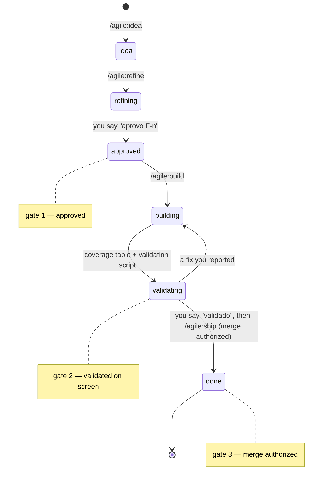

| Status | What happens | Who moves it |
|---|---|---|
| `idea` | Captured from the chat with `/agile:idea`. Title, 2-3 lines and how it starts (`## Start`): what it depends on, what it waits on and from whom, the suggested path, what can run beside it. What nobody said is written as unknown. A cause it names comes with its evidence (the command and the output line that shows it); without one, `## Start` says `Cause not verified: measure it at /agile:refine`, with the symptom seen. | Claude |
| `refining` | `/agile:refine` (an answer that turns something into a later item becomes an idea through the same procedure as `/agile:idea`: template, board, next number): before anything is written, Claude creates the item's branch and its own worktree — a folder outside the repository whose full path it tells you — and everything this item produces (the feature file, the cause of a bug, the mockup) is written there, on its branch; an item file not yet committed is moved in and no longer exists where it was created. No checkout is switched, so a session sitting in another item's folder can no longer leave this item's documents on that item's branch. Then Claude reads the related code and checks in today's code every premise about how something already behaves (an earlier item's file is not proof: a later bug may have moved it), every premise about how a library stores or protects data in the library's source or docs, a query-performance premise with `EXPLAIN` on the test container, and a premise a library's docs and source both leave open by reproducing it in a scratch project against a test container (source read raw, never summarized) — a premise that nothing uses a feature is checked by its effect, not by the callers of one helper. A bug whose cause lives only in an unmerged item's branch says so in `## Cause` and waits for that merge before branching. Then Claude asks every open question in one round, as quiz cards grouped by topic (rules, permissions, states, screens, data, packages, scope) with the recommended option first; in a terminal the same questions come as a numbered list. The round includes the new packages the item needs, for the code **and for the tests**, with versions checked against the registry at that moment, so your yes is given once and not in the middle of the build. You answer; at most one follow-up round. An item whose output is visual (a diagram, a generated page) is prototyped and seen at real size in the viewer it is meant for before you approve it. An authentication or account-linking item gets the independent review (`/agile:review`) on this file, before you approve it. A new or complex screen is designed by the `ux-designer` agent (`/agile:screen`), which never talks to you: Claude reads what it wrote and asks its open points as its own. The feature file is committed on the item's branch, in its worktree. | Claude |
| `approved` | You approve the feature file after reading it. Open questions block approval. **Gate 1.** | You |
| `building` | `/agile:build`: it continues in the worktree the refinement created — code and tests for what changed. When the item creates a project, an API contract, a message between modules or a schema change, two read-only passes run before the plan: `system-design` proposes the slice, the contracts, the data and the risks, and `architect` reviews that proposal against the profile and the checks your project really has. They write nothing; Claude verifies both against the files, writes the plan from them and records in `## Decisions` what it accepted and dropped. A thin CRUD skips both. When the item has a mockup you approved, the screen and its tests are written by the `frontend` agent, alone in that worktree; Claude then reads every file it names, runs the gate and quotes the real counts, and answers its stops or brings you the ones that are decisions (a pattern the kit lacks, a contract that does not exist). Domain, API and migrations stay with Claude. Before copying an existing pattern, Claude checks whether an open item exists to remove it and, if so, lets you choose between following it now or recording the copy as debt. Before the coverage table Claude opens the screen through the app host: tests do not see how the component library renders its states (an active link with no contrast, a link that is not a link). Keyboard checks stay in your validation script. Claude never changes state (sign-ups, counted requests, data) in an app host it did not start: it asks first, or uses data no one else uses and says which. A screen behind sign-in is not checked by Claude, whose rules forbid typing passwords: it says so, checks what needs no account (the route, the 401, the redirect) and puts the signed-in flow in your validation script. Only one feature can be here. | Claude |
| `validating` | Claude hands over a validation script (≤ 8 steps). You try it on screen. A step that needs a terminal gives the command for Git Bash and for PowerShell 7, with the expected output and how to repeat it, and Claude has already run both. **Gate 2.** | You |
| `done` | `/agile:ship`: full test suite, merge after your go-ahead (**Gate 3**), board updated, app manual updated, retro. | Claude |

Small fixes found during validation are done right away, without leaving `validating`.

Before handing over the validation script, Claude shows a **criterion → test** table: every acceptance criterion points to its tests, or is explicitly left to the validation script. The test must go through the path a user reaches (page, endpoint, the handler that calls the code): a method written for a criterion that nothing in the app calls is a gap, even when its own test passes. When an effect leaves the request (an email or an event moves to a queue), every test that asserted it is re-read: "nothing was sent" passes for free once nothing is sent right away. A flaky test is reproduced in a loop (clean build before each run) and its fix proven by the same loop, N green in a row; a test of generated output counts each section, exactly once.

### The same path in one run: `/agile:autopilot`

`/agile:autopilot <id>` runs this whole path, from `idea` to `done`, and stops for you **exactly twice**. The three gates are all still there: the first stop is gate 1, the second stop holds gates 2 and 3, and you choose whether to pass them in one message.

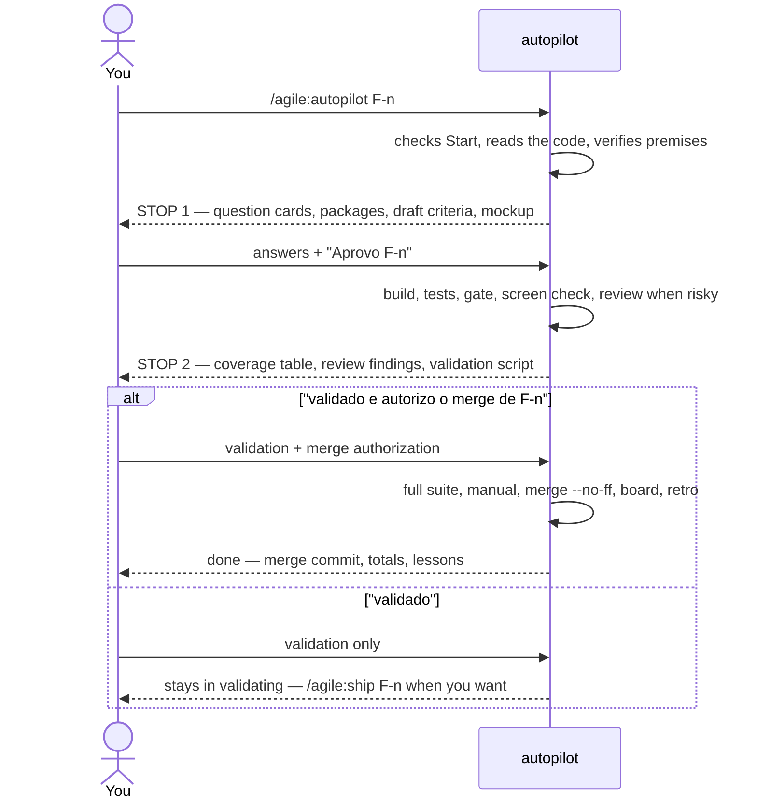

| Stop | What you get | How you answer | What follows |
|---|---|---|---|
| 1 — questions | Every open question as cards (recommended option first), the new packages with license and version, the **draft acceptance criteria** written from the recommended options, and for an item with a new or complex screen the **HTML mockup** built from the same options. The last card: "Approve F-n with these answers and criteria?" | Pick the answers and "Aprovo F-n". Any other answer is a follow-up round, never an approval. | The item file is filled with your answers and set to `approved`; the build starts in the same run. If a screen answer differs from the recommendation, the mockup is regenerated and the run stops once more for the screen only. |
| 2 — validation | Files, tests with real numbers, the criterion → test table, the reviewer's findings (it runs by itself when the change is risky: authentication, permissions, data, contracts, money, more than ~400 lines), what `--assume` assumed, the validation script. | "validado e autorizo o merge de F-n" — or "validado" alone — or the defect you found. | With the merge named: full suite, app manual in three languages, `merge --no-ff`, board, retro, `done`, without asking again. "validado" alone: the item stays in `validating` until `/agile:ship F-n`. A defect: fixed, then stop 2 again. |

`--assume` skips stop 1: every question gets its recommended option, recorded in `## Decisions` as `assumed by autopilot` with its reason, and the flag counts as your approval for that item. It never assumes a new package — when the item needs one, stop 1 happens with that question only. The mockup, when there is one, is then shown at stop 2.

Some decisions stay yours even inside a run. The run **ends** — nothing is reverted — and says where it stopped, what is done, what is left and the command to continue, when it meets: a package you did not approve at stop 1, a schema change not in the file, money, permissions, shared data, credentials, a screen behind sign-in, another module's contract, a false premise or an impossible criterion, a gate red three times, a blocker it cannot fix inside the item, a red suite at ship, or a merge conflict.

The run keeps an `Autopilot:` line in the item file (`refined`, `stop 1`, `approved`, `built`, `reviewed`, `stop 2`, `shipping`). `/agile:autopilot F-n` resumes from that line, so a new session or a summarized context loses nothing.

### Optional steps

| Command | When | Result |
|---|---|---|
| `/agile:discuss` | An idea with several possible directions, or doubts only you can answer | `docs/discussions/D-<n>-<slug>.md` (options, decisions, parked points) and the items captured as `idea` |
| `/agile:epic` | A new epic to plan | `docs/epics/<slug>.md` with prioritized, session-sized features, what each depends on and waits on, an execution plan (order, suggested path, what runs in parallel) and what waits outside the epic; each feature captured as `idea` |
| `/agile:screen` | A feature in `refining` with a new or complex screen | The `ux-designer` agent writes the detailed screen section in the feature file and an HTML mockup (every state, three languages; a new colour only after its contrast is computed on every surface, in both themes), alone in the item's worktree; Claude reads both, asks the agent's open points with its own questions, and you approve the screen together with the feature. In the build, the `frontend` agent implements that approved mockup and the tests of that screen |
| `/agile:review` | A risky change (authentication, permissions, tenant isolation, data, contracts, money, or more than ~400 lines), before validation | Findings by severity from a read-only reviewer with fresh context; confirmed blockers are fixed before you validate |

## 6. Changing your mind

- **Before approval:** change anything. It is just conversation.
- **During build:** `/agile:change` adds a **change note** to the feature file (what changed, why, which acceptance criteria are affected). You re-approve only those criteria. Work continues.
- **After ship:** it is a new feature or a bug, captured with `/agile:idea`.
- **Wrong premise found** (for example, "the screen already has this field" and it does not): Claude stops and asks before coding around it.

## 7. The feature file

`docs/features/F-<number>-<slug>.md`, one per feature, created from `docs/agile/templates/feature.md`. Bugs use a shorter file, `docs/bugs/B-<number>-<slug>.md` (template `bug.md`): what happens, expected, confirmed cause (with every duplicate of a business rule), fix (which occurrences now, which deferred), one regression test per occurrence fixed and validation script.

Epics live in `docs/epics/<slug>.md` (features table, order, first release cut) and discussions in `docs/discussions/D-<n>-<slug>.md`. Screen mockups go to `docs/features/mockups/`.

A rule that protects a minimum ("never leave the last manager without a replacement") is written as a before-and-after — "there was at least one before and none after" — so it does not also block a case where the hole already existed.

Main sections of the feature file:

```markdown
---
feature: F-<number>
status: refining | approved | building | validating | done
board: <work item id>
---
# <Feature name>

## Goal
## Users and use cases
## Business rules
## Screens and API
## Acceptance criteria
## Decisions (date — decision — reason)
## Out of scope
## Open questions
## Change notes
## Validation script
```

## 8. Definition of done

- [ ] Acceptance criteria met and covered by tests.
- [ ] Build with no new warnings; affected tests green.
- [ ] Every UI string localized in pt-BR, pt-PT and en.
- [ ] Validated on screen by you.
- [ ] Full test suite green before merge.
- [ ] Generated technical docs up to date — the docs command and its check, `gate.js docs` (DocGen, declared or implicit), when the project has them.
- [ ] App manual updated in the three languages.
- [ ] Board updated; the feature file reflects what was decided.

## 9. Quality gates

Hooks run outside the model. They are Node scripts (no bash) and do nothing in a repository without a .NET project.

| When | What happens |
|---|---|
| **Session start** | Shows the branch, the item in progress, the backlog head, approved files with open questions, and uncommitted work in **every** worktree. |
| **Every commit** | A guard refuses a `git commit` on the main branch in two cases: an item branch (`feature/F-<n>`, `bug/B-<n>`) is unmerged and checked out nowhere — the sign that an IDE switched the branch behind the session — or the commit carries an item file that is not `done` (refining, approved, building, validating), which belongs on the item branch. Claude tells you and switches back; if the commit really belongs on the main branch, you say so and Claude repeats it ending with the comment `# agile:main-ok`. |
| **Every shell command** | A second guard warns before a Bash or PowerShell command writes a repository file through the command's own text instead of the Write and Edit tools — a heredoc, `echo`/`printf`, a PowerShell `Set-Content`/`Out-File`/`Add-Content`, a Python `open(..., 'w'/'a')`, a `node -e`/`.js` write whose literal carries a backslash, an escaped quote or an embedded newline, or a `sed -i` on a tracked file — or edits a GitHub issue or PR with an inline `--body`/`-b` instead of a whole one from a file. It exits 2 naming the rule and the file or command; a path outside the repository (temp, the session's scratchpad) and the plugin's own generated files (`warnings-baseline.json`, `.claude/agile/sync.json`, `scripts/delivered.json`, `.claude/agile/sync-base/**`) are silent. With your yes, Claude repeats the command ending with the comment `# agile:literal-ok`. |
| **Every edit** | Nothing is built. The edited file is only remembered, under the git root it belongs to — so an edit inside a worktree is gated in that worktree, not in the folder where the session started. |
| **End of turn** (only if code changed) | Rebuilds the changed projects (`--no-incremental`) and runs only the test projects that reference them, directly or indirectly. It never runs the whole suite. |
| **Ship** | `gate.js ship`: full rebuild, full suite, architecture tests; then no tracked file may be left changed (a generated file the run rewrote is committed with the item), and the evals run when the project has them (a pass-rate drop fails the ship). After the app manual, `gate.js docs` runs the docs command the repository declares — or, with nothing declared, the single `tools/*.DocGen` it finds (below). |

Details:
- **New warnings only.** Warnings are compared with `.claude/agile/warnings-baseline.json`, a committed file. Existing warnings do not fail the gate; a new one does, listed with file, line and message. The baseline is rewritten only by a green ship (or by `gate.js baseline`, with your yes).
- **The verdict is the last line.** Every report ends with `agile gate GREEN`, `agile gate RED: <what failed>` (the new warnings, the failing tests, the blocked build) or `agile gate SKIPPED: <why>` (nothing was edited, no solution, not a git repository — when no solution is found, it says to name one as `solution` in `.claude/agile/build.json`), or `agile gate OFF: <why>` in a repository whose `build.json` says `engine: none`. As a hook, a turn with no code change stays silent. Run by hand, `stop` cannot see the hook's marks (they belong to the session), so it asks git which code files changed since the main branch — committed, uncommitted and new — builds and tests those, and always prints its verdict. It never reads standard input: only the Stop hook, called as `gate.js stop --hook`, reads the hook event. Before 0.0.68 a stop by hand waited forever on a standard input left open, as in Claude's Bash tool. Claude saves the whole output to a file and quotes from it, never filtering it with `grep`, `head` or `tail`: a filtered view once hid the only list of new warnings.
- **Wide changes.** If a change reaches more than 6 test projects, only the ones that reference it directly run; the rest waits for ship (`AGILE_GATE_MAX_TESTS`). A change to `.props`, `.targets` or the solution builds the whole solution and leaves the tests for ship.
- **Solution lookup.** The solution is searched at the git root and one folder down (`repo/App.slnx`, `src/App.sln`).
- **The solution's SDK.** Every `dotnet` call runs from the solution's folder (the git root when there is none), so the `global.json` beside the solution chooses the SDK and the test runner, exactly as it does for someone building in that folder. Every report opens with `sdk <version> (<folder>)`; `sdk unknown` means `dotnet --version` failed there (a pinned SDK that is not installed), and the build failure that follows says why. The baseline records the SDK it was taken with (`"#sdk"`). When a later build uses another one, the report adds `baseline taken with <a>, this build used <b>: warning counts may differ; ...`. That line is information, not a failure: retaking the baseline is your call. With the Microsoft.Testing.Platform runner, the report quotes its totals (`Test run summary`, `total`, `failed`, `succeeded`, `skipped`).
- **An adopted repository.** A code base that existed before the workflow (its `CLAUDE.md` says `Profile: adopted`, written by hand or by another plugin, such as legacy-lens's adoption) records how it is really built in `.claude/agile/build.json`: `engine` (`dotnet`, `msbuild` or `none`), `solution` (a path from the root), `scope` (the projects worth building when the whole solution is not), `testCommand`, `notes` and, under `msbuild`, the optional `msbuildPath` and `restoreCommand`. The gate reads `solution`, so a solution deep in the tree is still built, and `engine: none` turns it off with the reason in `notes`; `scope` is for people and is not read. The engine is trimmed and case does not matter, and a value outside the three is RED (`agile gate RED: unknown engine "MSBuild2" in .claude/agile/build.json (legal: dotnet, msbuild, none)`) instead of quietly behaving like `dotnet` — which is how `msbuild` went unhonored until 0.0.69. `/agile:sync` refreshes rules, templates and the workflow of such a repository but leaves its profile alone: there is no plugin profile to refresh it from.
- **`engine: msbuild`.** For a solution the .NET SDK cannot build — typically an old project type whose targets only Visual Studio ships, such as an ASP.NET web application importing `$(VSToolsPath)\WebApplications\Microsoft.WebApplication.targets`, where `dotnet build` stops with `error MSB4019`. The gate then drives MSBuild.exe instead of the `dotnet` CLI; the warning parser, the baseline, the locked-output hint and the RED/GREEN verdict are the same. What differs:
  - **Finding MSBuild:** `msbuildPath` from `build.json` (absolute, or from the repository root) when the file is there, then `msbuild` on the PATH (a Developer Command Prompt puts it there), then `vswhere.exe` at its fixed location under `Program Files (x86)`, which ships with every Visual Studio install. A declared `msbuildPath` that exists is used as it is: the gate never falls through to a different MSBuild than the one you named. When none works, `agile gate RED: MSBuild not found`, listing every place it looked. `vswhere` is Windows-only, so off Windows there are two places, not three.
  - **The report head** is `msbuild 18.10.1.42706 (.)` instead of `sdk <version> (<folder>)`, and the baseline keeps it in the same `#sdk` key as `msbuild 18.10.1.42706`. A `dotnet` baseline still stores the bare SDK version, so no baseline written before 0.0.69 has to be retaken.
  - **Restore**, on `ship` and `baseline` only: the build carries `-restore`, unless `restoreCommand` is declared, in which case that runs first instead — `msbuild -restore` does nothing for `packages.config`, which is what a legacy repository usually has. A `restoreCommand` that fails is `agile gate RED: restore failed (<command>)`, and nothing is built.
  - **Tests** are the `testCommand`, run whole through the shell, at `ship` only: `dotnet test` cannot reach a .NET Framework test assembly, and the gate's test-project detection does not recognise a `packages.config` MSTest or NUnit project. The turn gate builds the affected projects and says `tests skipped: engine msbuild runs the whole suite at ship`; `baseline` never ran tests. With no `testCommand`, the ship says `tests skipped: no testCommand in .claude/agile/build.json` and the build alone decides the verdict — a missing suite is debt the adoption recorded, not a gate nobody can clear. A `testCommand` that fails is RED; one that runs longer than 1800 seconds (`AGILE_TESTCMD_TIMEOUT`) is RED as a timeout.
  - Since 0.0.69 `testCommand` is **executed**, not just documentation: it has to run unattended, never opening an IDE or waiting for a key.
- **A declared docs command.** `build.json` may also carry `"docs": { "command": "...", "check": "...", "paths": ["docs/legacy/inventory"] }`, written by whoever prepared the repository (legacy-lens's adoption declares its inventory map there), so a living code map is refreshed with every item. At ship, after the app manual, `gate.js docs` runs `command` and then `check` (optional) through the shell, from the root of the item's worktree, whatever the `engine`. `command` and `paths` are required. It ends with `agile docs GREEN: <n> file(s) changed under <paths>`, and those files go into the item's docs commit. `agile docs SKIPPED: no docs command declared` means there is no `docs` block and no DocGen either, and the ship goes on as before. `agile docs RED: <what failed>` stops the ship like a red gate: a command or check that failed, is not installed, or ran longer than 600 seconds (`AGILE_DOCS_TIMEOUT`), a field that is missing, or a file changed outside `paths`. Such a file is listed and never committed.
- **The implicit DocGen command** (0.0.72). A project with DocGen has a docs command whether it declared one or not. With no `docs` block, `gate.js docs` looks for `tools/*.DocGen` folders holding a project file: exactly one is run as if it were declared — `dotnet run --project tools/<App>.DocGen`, then `-- --check`, with `paths: ["docs/architecture/"]` — and the run prints `implicit DocGen docs command: declare it with /agile:sync (tools/<App>.DocGen)` just before the verdict. That closes the window between a project getting DocGen and declaring it: before 0.0.72 the ship ran DocGen in a step of its own, and a project with the block ran it twice. **Several** `tools/*.DocGen` and nothing declared is RED naming them (`declare which one in .claude/agile/build.json`): running the wrong one would leave the other stale in silence. A declared `docs` always wins, and DocGen is not run behind it. `/agile:sync` offers the block as a plan row (section "Updating the plugin", example 14.10); until then every ship repeats the line.
- **Locked build output.** A running app host, preview or debugger keeps the DLLs open. The gate then reports "build blocked" and names the process instead of a plain build failure; Claude stops whatever it started before the turn ends, and asks you to close yours.
- **Honest counts.** An incremental build skips the compile of a project that did not change, and MSBuild does not repeat the warnings of a skipped compile. So every gate build is a `--no-incremental` rebuild of what it measures, at the turn as at ship. Before 0.0.67, a new warning found in one turn disappeared in the next, and the gate went GREEN with nothing fixed. The rebuild costs a few seconds per turn: it was measured at +0.6 s and +2.2 s on two small solutions, and each `built` line shows it. Claude quotes a warning count only from the gate or a `--no-incremental` build, and builds again after `git stash` or a branch switch before running tests: `--no-build` would run the other tree's binaries.
- **Hung tests.** A test that runs for more than 120 seconds (`AGILE_GATE_HANG_TIMEOUT`) counts as hung: the run fails with its name instead of blocking the turn for minutes.
- **No loops.** After 3 red gates in a row the turn ends and you see the failure; the pending check stays for the next turn.
- **Known limit.** Only edits made with the editing tools are tracked. Changes made by a shell command (`dotnet format`, a merge) are caught at ship.
- `AGILE_HOOKS=off` disables the hooks for a session.
- `AGILE_TESTCMD_TIMEOUT` (1800 s) caps the `testCommand` of an `engine: msbuild` repository, as `AGILE_DOCS_TIMEOUT` caps the docs command.

## 10. Board

`CLAUDE.md` has a `Board:` line: GitHub Issues + Projects (`gh`), Azure Boards (`az boards`), or none (then `docs/agile/backlog.md` is used). Mapping: epic → feature. No tasks per role. The feature file keeps the board id; the merge closes the work item.

Closing the issue is not trusted alone: at ship, after closing, Claude also sets the board's Status field to Done explicitly and reads it back, because a project's own automation for that can miss (seen once, cause unknown). A read-back that still shows something else is retried once, then reported with the exact command to fix it by hand; the ship does not stop or undo the merge over it — the file already says `done`. An item not yet on the project board is added first. Azure Boards gets the same read-back on `System.State`.

An issue body is only ever replaced whole. `gh issue edit --body` replaces the entire body with what it is given, so a partial text there silently deletes the rest of the item (it happened in legacy-lens B-1). Claude writes the full item text to a file, sends it with `gh issue edit <id> --body-file <file>`, and reads the body back to compare. An Azure Boards description is likewise always sent whole, from a file.

## 11. Languages and the app manual

- Code, docs, commits and identifiers are in English.
- The app ships in **pt-BR, pt-PT and en** from day one: no hardcoded UI strings, one resource file per module per language, `IStringLocalizer`. Adding a language means adding resource files only.
- The **app manual** lives in `docs/manual/<locale>/` (pt-BR, pt-PT, en) and is updated when each feature ships.
- Only the conversation between you and Claude is in Portuguese.

## 12. Architecture profiles

The quiz picks one profile; `CLAUDE.md` points to it.

| Profile | When |
|---|---|
| `modular-monolith` | One deployable, several business modules with clear boundaries |
| `monolith` | One deployable, one business area |
| `web-app` | Mostly screens over simple data; thin API or server-side UI |
| `microservices` | Independent deployables owned separately; only with a real reason |
| `mobile` | Native or MAUI client, with its own API profile |

Each profile defines the folder layout, where business rules live, the test strategy and its time budget, and the architecture tests. The profile files are in `profiles/` in the plugin; bootstrap copies the chosen one to `docs/agile/profile.md`.

What every profile shares:
- **Simple code.** CRUD is a thin vertical slice (endpoint or page → `DbContext`): no repository, no mediator, no mapping library. A rule lives in its entity, or in the feature handler when it needs data. Structure is added on the second use.
- **One project per module.** In `modular-monolith` a module is one project plus a `Contracts` project. A module with a rich domain can use the Clean Architecture variant (five projects: Domain, Application, Infrastructure, Api, Contracts); Claude suggests it with a reason, you decide per module, and an ADR records it.
- **Time budget.** Unit < 30 s, integration < 2 min per test project, full suite < 5 min (smaller for `web-app` and `monolith`, < 10 min for `microservices`). **One PostgreSQL container per test project**, never one per test class.
- **Architecture tests** guard the boundaries and the English vocabulary in every assembly, and every rule of absence is paired with a rule of presence, so an empty assembly fails. A layout test keeps every project in the folder its profile assigns.

**Folder layout per profile.** Bootstrap creates it, and every project a feature adds later goes into the folder its kind has here; the solution folders mirror the disk folders, and a layout test fails when a project lands elsewhere. `<App>` is your app's name.

`modular-monolith` — hosts, technical building blocks and business modules in separate groups:
```
src/
├── Hosts/
│   ├── <App>.AppHost/                local orchestration (Aspire)
│   ├── <App>.ServiceDefaults/        telemetry, health, resilience
│   ├── <App>.Api/                    host only: composition, auth, OpenAPI
│   └── <App>.Web/                    Blazor UI, typed clients to the API
├── BuildingBlocks/
│   ├── <App>.SharedKernel/           Entity, TenantEntity, Result/Error, AppJson
│   └── <App>.<Block>/                Persistence, Email, Storage, Ai — by the first feature that needs it
└── Modules/
    └── <Module>/
        ├── <App>.<Module>/           one project per module (or five with Clean Architecture)
        │   ├── Features/<Feature>/   vertical slices
        │   ├── Domain/               entities with rules
        │   ├── Data/                 DbContext, own schema, migrations
        │   └── Resources/            .resx in en, pt-BR, pt-PT
        └── <App>.<Module>.Contracts/ what other modules may see
tests/
├── Hosts/<App>.Web.Tests/            bUnit
├── BuildingBlocks/<App>.<Block>.Tests/
├── Modules/<Module>/<App>.<Module>.Tests/
├── <App>.ArchitectureTests/          boundaries, vocabulary, layout
└── <App>.Testing/                    shared test helpers
```

`monolith` — one deployable with the business code inside it:
```
src/
├── <App>.AppHost/                    optional
├── <App>.Api/                        host + business code
│   ├── Features/<Feature>/
│   ├── Domain/
│   ├── Data/                         one DbContext, migrations
│   ├── Contracts/                    records shared with the UI
│   ├── Common/                       Result/Error, AppJson, helpers
│   └── Resources/
└── <App>.Web/                        Blazor UI, typed clients to the API
tests/
├── <App>.Tests/                      unit + integration
└── <App>.Web.Tests/                  bUnit
```

`web-app` — one Blazor project is the whole app:
```
src/
└── <App>.Web/                        the only deployable
    ├── Pages/<Area>/                 page + code-behind
    ├── Components/                   shared UI components
    ├── Features/<Feature>/           only when an operation has rules
    ├── Domain/
    ├── Data/                         one DbContext, migrations
    ├── Api/                          endpoints only for external clients
    ├── Common/                       Result/Error, AppJson, helpers
    └── Resources/
tests/
└── <App>.Tests/                      unit + integration + bUnit
```

`microservices` — one solution, one folder per service, each a small monolith:
```
src/
├── <App>.AppHost/                    every service, broker, databases
├── <App>.ServiceDefaults/
├── <App>.Gateway/                    routing and auth at the edge (YARP)
├── <App>.Web/                        Blazor UI, calls the gateway only
├── BuildingBlocks/
│   └── <App>.Messaging/              outbox, inbox, broker setup
└── Services/
    └── <Service>/
        ├── <App>.<Service>/          Features/, Domain/, Data/ (own database)
        └── <App>.<Service>.Contracts/ records and integration events
tests/
├── <App>.<Service>.Tests/            unit + integration + contract
├── <App>.Web.Tests/                  bUnit
├── <App>.ArchitectureTests/
└── <App>.SystemTests/                a few end-to-end flows
```

`mobile` — a testable core, a thin MAUI head, and the backend under its own profile:
```
src/
├── <App>.Api/                        backend, per its own profile
├── <App>.Contracts/                  records and error codes shared with the app
├── <App>.Mobile.Core/                plain library: everything testable
│   ├── Features/<Feature>/           view models, feature services
│   ├── Api/                          typed clients, AppJson
│   ├── Storage/                      local cache, offline queue
│   └── Resources/
└── <App>.Mobile/                     MAUI head: XAML pages, shell, platform code
tests/
├── <App>.Mobile.Core.Tests/          view models, services, offline queue
└── <App>.Tests/                      backend tests, per its profile
```

Shared rules live in `rules/core/` and are copied to `.claude/rules/agile/` at bootstrap: `workflow`, `naming`, `git`, `definition-of-done` and `output-style` are always loaded; `i18n` and `api-contracts` load only when Claude works on code files, `ui` only on screen files (`.razor`, `.xaml`), and `build-config` only on project and build files. One rule per line, at most 30 lines per file. Core rules are generic: they hold for every profile. Anything that depends on a profile, a stack or a UI library lives in the profile file, in `templates/dotnet/` or in a rule scoped by file type, and the plugin applies it to every profile it concerns.

**Rules the build checks.** Bootstrap copies `templates/dotnet/` to the solution root, in every profile: `Directory.Build.props` (shared settings, code style enforced in the build), `Directory.Packages.props` (every package version in one place), `.editorconfig` (the owner's rules: naming, braces on every block, pattern matching, expression-bodied members, formatting), `BannedSymbols.txt` (forbidden APIs such as `new JsonSerializerOptions`, `DateTime.Now`, `Thread.Sleep`) and `global.json`. A broken rule becomes a build warning, and the gate fails on new warnings — so the rule holds even when nobody remembers to read it. `TreatWarningsAsErrors` stays off. When a retro lesson can be checked by the build, it goes there first.

**Stack lessons.** A lesson from a real item that depends on the stack goes to the rule scoped to those files or to the profiles it concerns, never to an always-loaded rule. Examples from the first app: `api-contracts` says a custom middleware resolves an optional dependency inside the branch that needs it (an `InvokeAsync` parameter is resolved on every request) and that a client asks the API for the user's claims instead of decoding its access token (it may be encrypted); `build-config` says a version-dependent investigation reads the version resolved in `obj/project.assets.json`, not the pinned one; the profiles with an Aspire AppHost say code reaches Redis, PostgreSQL or a broker through the Aspire client integration, because local resources run with TLS by default, and that the generated `ServiceDefaults` turns off retries for POST (a retried POST replays single-use tokens); the profiles with a Blazor UI say that, with Interactive Server, state that changes during a session lives in a server-side store keyed by an id in the cookie, because a circuit cannot rewrite the cookie; and the test strategy of the profiles says a bUnit test waits for what an async click handler does (`WaitForAssertion`), and a test host created per test class clears its Npgsql pool on dispose, or the test database runs out of connections; and, with Interactive Server, data from the first request that a circuit needs (the visitor's address, a header) is read in `App` and passed to the interactive root, because a circuit has no `HttpContext`; the profiles with bUnit also say every new page and dialog gets a test that renders it, because a Razor attribute mistake compiles (a string parameter without `@` is literal text); the profiles with EF Core say the delete that closes a unit of work goes outside the `try` that handles its failure, because a failed save keeps the entry `Deleted`; with ASP.NET Core Identity, only the last step of a multi-step sign-in clears the failure count; and in `modular-monolith` a row a request must not lose (a queued job, an outbox message) is written by the same save as the data that justifies it. `api-contracts` also says an anonymous endpoint that must give the same answer on every path runs every input check before the lookup that tells the paths apart. The profiles with a Blazor UI also say a page that peeks a single-use ticket (an invite, a confirmation link) in `OnInitialized` sees it twice — prerender runs before the interactive circuit — so it reads the ticket there but spends it only on success, and a ticket that must not be replayed is bound to the browser with an HttpOnly cookie, never carried by the URL alone; and, for a project with the technical-docs generator, the data dictionary shows the `WHERE` clause of a partial index next to it. The test strategy of every profile also says the SDK template still generates xUnit 2.x, where `TestContext.Current.CancellationToken` does not exist: that member is v3, and adopting v3 is a decision that gets pinned and written down.

**One behavior on every screen.** The `ui` rule keeps screens from drifting apart: a pattern is defined once, in a UI kit shown on a dev-only gallery page, and pages use the kit instead of raw library components. One icon family behind semantic names (`AppIcons.Edit`), one way to edit an item (row actions in the last column; dialog for simple entities, own page for complex ones; a name link only opens a read-only detail page), the same hover and focus everywhere, one confirmation dialog for destructive actions, the same feedback, list states, form layout and action vocabulary. Architecture tests forbid raw icons and raw tables outside the kit, and the kit comes before the first screen. A kit parameter whose right value depends on what the page means (autocomplete, a destructive action's wording) is required, so a page that forgets it does not build. A colour or contrast problem is checked in both themes and on every surface the component sits on, computed from the theme and then measured on screen, and a test over the theme tokens keeps every colour pair honest, including the ones no screen has rendered yet. The project records its choices (icon family, declared exceptions) in its own rules.

Claude writes every file (code, tests, docs) with its editing tools, never through the text of a script: escapes such as `\t` or `\b` turn into control characters, and a test can pass while checking nothing.

**Keeping a project up to date.** Bootstrap copies plugin files into the project (rules, templates, this workflow, the profile, the build files), so a plugin update does not reach them by itself. Update the plugin (`claude plugin marketplace update canary`, `claude plugin update agile@canary`, new session), then run `/agile:sync` in the project. Claude shows a table of what changed and copies only what you approve: a copy you never edited is replaced; a file you edited (usually the profile) is merged by hand, keeping your sections; build files (`Directory.Build.props`, `.editorconfig`, `global.json`...) are never copied over — each difference is proposed as an edit; your own rules (`project.md`, `*-project.md`) are never touched, and `CLAUDE.md` only gets what you approve: a section the template gained, or a `Worktrees:` line when it has none (the bootstrap recommendation, `D:\wt\<repository>` or `C:\`; existing worktrees keep their names). If build files or checked rules changed, Claude builds, runs the full suite and refreshes the warnings baseline. A project with no warnings baseline at all (an adopted repository, an old bootstrap) gets a row offering to take the first one: a full rebuild, run only with your yes, committed with the sync. A ⏳ plugin note in the retro log that cites an `agile-canary#N` the plugin has delivered gets a row too: with your yes, `sync.js notes` marks it ✅ with the version and merge commit. The project's own session is the only one that writes those marks; the plugin session never writes in your repository. The version and what was copied are recorded in `.claude/agile/sync.json`. Run it between features, not in the middle of one. `/agile:version` shows the plugin version running in the session next to the project's, and says whether a sync or a plugin update is the next step. The sync also names what only `/agile:bootstrap` installs and your project does not have — a tool of its own, such as the technical-docs generator — and offers to capture a feature for it; it never installs it behind your back.

`output-style` sets how Claude talks to you: in pt-BR, answer first, step reports of at most 10 lines, details in the file instead of the chat, one recommendation with its reason, no narration of the work, "not verified" said in those words, and bad news first. Long answers only when a gate failed, a question needs context, or you ask.

## 13. Sessions and pauses

- Start: Claude checks the branch, the board and the feature in progress before doing anything.
- Resume: `/agile:build <id>` on the item that is `building` continues from the last `wip` commit.
- Pause mid-feature: `/agile:pause`, or just say you are stopping. Claude commits on the feature branch with a `wip(F-<n>):` prefix and writes a note (where we stopped, what is next, who decides); nothing stays only on disk. Closing the session without a pause is fine too: the next session commits the leftover work as `wip` first.
- End: a short note (where we stopped, what is next, who decides).
- Before merging from a worktree: Claude asks, as a blocking question, whether you have closed any IDE or app host running from that folder — a removal that fails halfway unregisters the worktree and leaves the folder on disk, worse than not removing it. On .NET it also runs `dotnet build-server shutdown` first, since a build server holds a lock the IDE closing does not release.

**One folder per item.** Every item gets its own worktree — a separate folder outside the repository (the root is the `Worktrees:` line of `CLAUDE.md`, asked at bootstrap — recommended `D:\wt\<repository>`, or `C:\wt\<repository>` without a D: drive; without the line, `<repository parent>/wt/<repository>/`, and `/agile:sync` offers the line. The folder is `f-<n>-<desc>` or `b-<n>-<desc>`, `<desc>` being up to 20 characters of the slug, cut at a hyphen: `f-3-exam-board`. Kept short because of Windows path limits; a worktree created before this keeps its `<type>-<n>` name until the merge) — created by `/agile:refine` before it writes anything and used until the merge. That is what keeps an item's documents on its own branch: a session working in another item's folder used to write the feature file and the mockup there, and they ended up on an unrelated branch. The build reuses that folder and never makes a second one.

**Two items in parallel.** The default is still one item at a time in `building`. When you really want a second one running — a long feature in one session and a bug in another — type `/agile:build <id> --worktree`. The flag is your request for parallel work: it lifts the one-at-a-time limit (and, for an item approved before this existed, creates the missing folder). Claude first tells you whether the two items can collide (same module schema, same screen, same contract) and recommends sequence when they do. One writer per worktree. The item status lives in that worktree until the merge, and `/agile:status` and the session start read every worktree. Only one app host runs at a time (the ports collide); ignored local files are not carried over. Previewing the app host from a worktree points the launch configuration at its absolute path temporarily, restored to the main checkout's path once the preview ends. On ship, the full check runs in the worktree and the merge in the main checkout; after the merge the worktree and the branch are removed, never with `--force` without asking, and the other item in progress is brought up to date. Recommended limit: two items — you validate each one on screen, and that is the real bottleneck.

## 14. Worked examples

All examples use a fictional app, **ExamPrep**: a platform where curators build a bank of exam questions and students practice with them. `>` marks what you type; `Claude:` marks the reply (shortened). In real sessions the chat is in Portuguese; it is shown in English here.

### 14.1 Bootstrapping a new app

**Before:** an empty repository with `product/brief.md`:

```markdown
# ExamPrep
Problem: candidates study with scattered PDFs of past exams.
Users: curators (build the question bank), students (practice).
Capabilities: exam boards and exams, question bank (8 question types), practice tests, progress reports.
Constraints: Brazil and Portugal; web first; one developer.
Out of scope (v1): payments, mobile app.
```

```
> /agile:bootstrap
```

```
Claude: I read product/brief.md. Round 1 of 7 — Shape.

1. Type of app → Recommendation: web app with an API (brief says "web first").
2. Architecture profile → Recommendation: modular-monolith.
   Reason: 4 business areas (catalog, question bank, practice, reports) with clear
   boundaries, but one developer — one deployable keeps operations simple.
3. Deployment target → Recommendation: containers, local with .NET Aspire, Azure later.

Answer each one ("ok" accepts the recommendation) or tell me what to change.
```

```
> 1 ok. 2 ok. 3 ok, but no Azure decision yet.
```

```
Claude: Recorded: deployment target = containers + Aspire; cloud provider deferred.

Round 2 of 7 — Data.
4. Database → Recommendation: PostgreSQL.
5. Multi-tenancy → Question: will schools or prep courses have private question banks?
   The brief does not say. If yes, tenant isolation must exist from day one.
...
```

Round 6 always carries one question the brief cannot answer — where the item folders live:

```
Claude: 28c. Worktree root → Recommendation: D:\wt\examprep (this machine has a D: drive;
    without one it would be C:\wt\examprep). Outside the repository; each item gets a
    folder such as f-3-exam-board — the id and at most 20 characters of its slug.
> ok
```

After round 7, Claude asks the closing question, settles what it raises, shows a summary of every decision and asks for confirmation. Then it creates:

```
CLAUDE.md                                  52 lines, points to the profile
docs/decisions/ADR-0001-foundation.md      every decision, with its reason
docs/agile/profile.md                      modular-monolith profile
src/ExamPrep.AppHost, src/ExamPrep.Api, src/ExamPrep.Web, src/Modules/...
tests/...                                  unit + integration (shared Postgres container)
Resources/*.pt-BR.resx, *.pt-PT.resx, *.en.resx
docs/manual/{pt-BR,pt-PT,en}/index.md
```

and the epics from the brief on the board: *Catalog*, *Question bank*, *Practice tests*, *Progress reports*.

### 14.2 A feature from idea to done

**Idea.** During a chat about the catalog:

```
> Curators need to register exam boards (name and acronym). Register it.
```

```
> /agile:idea "Exam board registration: name and acronym, list and edit"
```

```
Claude: Created feature F-3 "Exam board registration" (board #12) under epic "Catalog".
Status: idea. Nothing else is done until we refine it.
```

**Refinement.** When it is this feature's turn:

```
> /agile:refine F-3
```

```
Claude: Folder for this item: D:/wt/examprep/f-3-exam-board [feature/F-3] — created now,
outside the repository; the file moved in and everything about F-3 is written there.
I checked the code: the Catalog module exists but has no entities yet.
The user and role model from bootstrap has Curator and Admin.
```

The questions come as quiz cards, one per topic, the recommended option first. In the desktop app you click; in a terminal the same questions arrive as a numbered list you answer with "ok" or a letter. The first card, "Rules":

```
[Rules]
1. Is the acronym unique?
   ● Yes, case-insensitive (Recommended) — "FGV" and "fgv" are the same board
   ○ Yes, case-sensitive
   ○ No
2. Can an exam board be deleted?
   ● Deactivate only (Recommended) — exams will reference it
   ○ Hard delete
3. Maximum lengths?
   ● Name 120, acronym 20 (Recommended)
   ○ Other (type them)
```

Then "Permissions" and "Screens":

```
[Permissions]
1. Who can edit?
   ● Curator and Admin (Recommended) — curators own the catalog
   ○ Admin only
[Screens]
1. Is the list paged or searchable?
   ● Search by name/acronym, 20 per page (Recommended)
   ○ Plain list, no search
```

```
> Rules: all recommended. Permissions: Admin only. Screens: recommended.
```

Claude writes `docs/features/F-3-exam-board-registration.md`:

```markdown
---
feature: F-3
status: refining
board: 12
---
# Exam board registration

## Goal
Let admins keep the list of exam boards used by exams and questions.

## Users and use cases
- UC1 Admin registers an exam board (name, acronym).
- UC2 Admin edits an exam board.
- UC3 Admin deactivates / reactivates an exam board.
- UC4 Admin and curators search the list.

## Business rules
- BR1 Acronym is unique, case-insensitive.
- BR2 Deactivated boards cannot be chosen for new exams but keep existing links.
- BR3 Name ≤ 120, acronym ≤ 20 characters.

## Screens and API
- /catalog/exam-boards (list, search, 20 per page)
- /catalog/exam-boards/new and /{id}/edit
- GET/POST/PUT /api/v1/catalog/exam-boards; POST .../{id}/deactivate|reactivate

## Acceptance criteria
- AC1 Given a new name and acronym, when saved, then the board appears in the list.
- AC2 Given an existing acronym in another case, when saved, then error `exam_board.acronym_taken`.
- AC3 Given a curator, when opening the new/edit screens, then access is denied.
- AC4 All texts appear in pt-BR, pt-PT and en.

## Decisions
- 2026-09-20 — Admin only edits (not curators) — owner decision.

## Out of scope
- Import from a file.

## Open questions
- (none)
```

```
Claude: F-3 is ready for approval. Read the file; reply "approve F-3" or tell me what to change.
> approve F-3
```

Status becomes `approved` (**Gate 1**).

**Build.**

```
> /agile:build F-3
```

```
Claude: No other feature is in progress. Branch feature/F-3 created. Status: building.
...
Done:
- ExamBoard entity + configuration + migration AddExamBoards
- Endpoints with error codes exam_board.acronym_taken / exam_board.not_found
- Pages List / Form, texts in 3 resource files
- 14 tests (Catalog.Tests 3.1 s, Web.Tests 1.8 s) — green

Criterion → test:
| AC1 list        | ExamBoardsPage_Open_ShowsActiveBoards                        |
| AC3 unique      | CreateExamBoard_DuplicateAcronym_Returns409                  |
| AC5 deactivate  | ExamBoardsPage_Deactivate_ShowsInactive                      |
| AC7 languages   | validation script, step 7                                    |
AC5 was first a gap: ExamBoard.Deactivate had a passing test, but no page or
endpoint called it. Added the endpoint and the button, then the page test above.

Validation script (F-3):
1. Start the AppHost and sign in as admin.
2. Menu Catalog → Exam boards: empty list.
3. New: "Fundação Getulio Vargas" / "FGV" → saved, appears in the list.
4. New: "Other" / "fgv" → message "Acronym already in use".
5. Edit FGV, change the name → list shows the new name.
6. Deactivate FGV → status "Inactive"; reactivate it.
7. Switch language to pt-PT and en → texts change.
8. Sign in as curator → New/Edit are not available.
Status: validating.
```

When a step needs a terminal (a limit, an endpoint with no screen yet), it comes for both shells, already run by Claude:

```
4. Six sign-up attempts in a row from the same address: the 6th is refused.
   Git Bash:     for i in 1 2 3 4 5 6; do curl -sk -o /dev/null -w "%{http_code}\n" -X POST https://localhost:7101/api/v1/auth/sign-up -H "Content-Type: application/json" -d '{}'; done
   PowerShell 7: 1..6 | % { (Invoke-WebRequest -Method Post https://localhost:7101/api/v1/auth/sign-up -ContentType application/json -Body '{}' -SkipCertificateCheck -SkipHttpErrorCheck).StatusCode }
   Expected: 400 five times, then 429. To repeat: wait one minute.
```

**Validation** (**Gate 2**):

```
> Step 4 shows the message, but it is in English even in pt-BR.
Claude: A resource key was missing in the pt-BR file. Fixed; test added for AC4. Try step 4 again.
> ok, validated.
```

**Ship** (**Gate 3**):

```
> /agile:ship F-3
```

```
Claude: Full suite: 212 tests green (2 min 10 s). Architecture tests green.
The run rewrote docs/api/ExamPrep.Api.json (a new route): committed with F-3.
Ready to merge feature/F-3 into main. Authorize?
> yes
Claude: Merged. Board #12 closed, Status Done (read back). Manual updated: "Exam boards" page in pt-BR, pt-PT, en.
Retro: one lesson — "check every language file when adding a message". Add it as a rule?
> yes
Claude: Rule added to core/i18n. Status: done.
```

When the Status write does not stick — a permission error, or a board with no Done option under that field — the close line names the problem and the exact command instead of silently moving on:

```
Claude: Merged. Board #12 closed; Status is still "In Progress" after one retry —
set it by hand: gh project item-edit --id PVTI_xxx --field-id PVTF_xxx --project-id PVT_xxx --single-select-option-id <done>.
Manual updated: "Exam boards" page in pt-BR, pt-PT, en.
```

### 14.3 Changing your mind during build

While F-7 "Question registration" is in `building`:

```
> I want the "year" field to be optional for questions without an exam.
> /agile:change F-7
```

```
Claude: Change note added to F-7:
- What: Year becomes optional when no exam is linked.
- Why: authored questions have no exam year.
- Affected: BR4 (year required) and AC5. Other criteria unchanged.
Re-approve BR4 and AC5 as rewritten below? (the rest of the work continues)
> approve
```

The build continues from where it was. Nothing is redone.

### 14.4 A wrong premise found during build

```
Claude: Stopping F-9 "Edit question exam". The feature assumes the edit screen already
lets users change the subject, but it has no subject, board or year fields, and the
update API does not accept them. Options:
A. Add subject/board/year editing to F-9 (bigger, but the feature works end to end).
B. Keep F-9 to exam link only; register a new feature for the missing fields.
Recommendation: A, because rule BR3 ("choose a covered subject") is impossible without it.
> A
Claude: Change note added; scope and criteria updated for your approval.
```

### 14.5 A bug after ship

```
> The exam board list does not find "FGV" when I search "fgv".
> /agile:idea "Bug: exam board search is case-sensitive"
Claude: Created bug B-2 (board #31), linked to F-3.
> /agile:refine B-2
Claude: Cause confirmed in the query (plain equality). One question: should search also
ignore accents ("Fundacao" finds "Fundação")? Recommendation: yes.
> yes
```

The bug follows the same lifecycle, with one short file: cause, expected behavior, a test that reproduces it, and the validation script.

When the cause is a business rule, refinement also searches the whole solution for the same rule implemented again elsewhere (common in apps that grew without a shared rules layer), writes every occurrence under `## Cause` before asking anything, and asks which ones to fix now and which to record as debt:

```
> /agile:refine B-4
Claude: Cause confirmed: Enrollment/CpfValidator.cs:41 skips the second check digit.
The same check is implemented again in two other places (not callers of the validator):
  - Import/StudentCsvReader.cs:88 (own copy, same defect)
  - Web/Pages/Enroll.razor.cs:132 (own copy, correct)
All three are listed under ## Cause in docs/bugs/B-4-cpf-check-digit.md.
[card: Business rules]
  Which occurrences does B-4 fix?
  ● All three: the reader and the page call CpfValidator (Recommended)
    Only the validator and the reader; the page copy stays as recorded debt
    Only the validator
> (picks the first)
Claude: B-4 approved. The build adds one regression test per occurrence fixed.
```

### 14.6 Pausing and resuming

You stop whenever you want, in your own words or with the command; both do the same thing. In the middle of F-7:

```
> /agile:pause
Claude: Paused. Commit "wip(F-7): question form without type editor" on feature/F-7 (local, not pushed).
Next: type editor for T1-T3. Decision pending with you: none. Nothing running.
```

"Vamos parar por hoje" or "continuo amanhã" does exactly the same. If you just close the session, nothing is lost either: the next session starts by showing the uncommitted work, and Claude commits it as `wip` before anything else, with your OK.

Next session:

```
> /agile:status
```

```
Claude:
In progress: F-7 Question registration — building (branch feature/F-7, 1 wip commit)
Next step: type editor for T1-T3
Open questions: none
Backlog head: F-8 Question review queue (idea), B-3 Search accents (idea)
```

To continue, run the build again on the same item; Claude resumes instead of starting over:

```
> /agile:build F-7
Claude: Resuming F-7 from wip commit "question form without type editor" on feature/F-7.
Next: type editor for T1-T3 (step 4 of the plan). Continuing.
```

### 14.7 From a loose idea to an epic

```
> I'm thinking about practice tests that adapt to the student's level. Not sure how.
> /agile:discuss "adaptive practice tests"
```

```
Claude: What we know: the brief lists practice tests; questions have no difficulty field yet.
Options:
A — Fixed tests chosen by the curator (S). Simple; no adaptation.
B — Difficulty levels on questions + tests that pick by level (M). Needs difficulty data.
C — Adaptive engine that adjusts during the test (L). Needs history and tuning.
Recommendation: B now, C later — B creates the difficulty data C will need.
Questions:
1. Who sets the difficulty? → Recommendation: curator, with 3 levels.
```

```
> B, 3 levels, curator sets it. Park C.
Claude: D-1 recorded (decided; C parked). Captured F-12 "Question difficulty" and
F-13 "Practice test by level". They belong to a new epic "Practice tests" — plan it now?
> /agile:epic "Practice tests"
```

```
Claude:
| Id   | Feature                 | Priority | Size | Depends on | Waits on                       | Screen design |
| F-12 | Question difficulty     | Must     | S    | -          | -                              | no            |
| F-13 | Practice test by level  | Must     | M    | F-12       | -                              | yes           |
| F-14 | Practice test results   | Must     | M    | F-13       | score rules from the curator   | yes           |
| F-15 | Retry wrong answers     | Should   | S    | F-14       | -                              | no            |
Execution plan:
1. F-12 — first: the others need the difficulty data — /agile:autopilot F-12 (small and clear)
2. F-13 — /agile:refine with /agile:screen, then /agile:build — beside it: nothing
3. F-14 — /agile:refine once the curator sends the score rules — beside it: F-15 in a worktree
4. F-15 — /agile:refine → /agile:build
Waiting outside the epic: score rules for F-14, from the curator; you ask.
First release cut: F-12 to F-14.
1. Is F-15 in the first release? → Recommendation: no.
> ok
Claude: docs/epics/practice-tests.md agreed. F-14 and F-15 captured, each with its Start.
Next: /agile:refine F-12 (waits on nothing).
```

Later, `/agile:status` shows the wait until it is cleared:

```
Blocked: F-14 — waits on the score rules, from the curator | F-15 — depends on F-14 (idea)
Backlog head: F-12 (done), F-13 (approved) — can start, F-14 (idea), F-15 (idea)
```

### 14.8 Screen design and review

During the refinement of F-13:

```
> /agile:screen F-13
Claude: Design delegated to the ux-designer agent, alone in the item's worktree.
It wrote the screen section and the mockup; I read both files before showing them:
7 states, every text in the three languages, only kit patterns,
new colour 4.8:1 on the card and 5.1:1 on the page.
Mockup sent: docs/features/mockups/F-13-practice-test-by-level.html
Decisions: one question per page (mobile-friendly); timer visible only when the test has a limit.
Its open point — 1. Can the student go back to a previous question? → Recommendation: yes, until finishing.
> yes
> approve F-13
```

The agent never talks to you. It designs; Claude reads the two files it wrote, asks its open points as its own questions and collects your approval. In the build of the same feature a second agent, `frontend`, implements that approved mockup and the tests of that screen, alone in the worktree; Claude then reads what it wrote, runs the gate and quotes the real counts. Domain, API and migrations stay with Claude, and a feature with no approved mockup is built exactly as before, with no agent. Both models are yours, in the "Models" section of `CLAUDE.md`.

At the end of the build of F-14 (it writes results and changes the students' data):

```
Claude: This change touches student data. Running /agile:review before validation.
| Severity | Finding                                   | Verdict   | Action               |
| blocker  | Results endpoint does not check the owner | confirmed | fixed + test         |
| minor    | Duplicate mapping in ResultsPage          | confirmed | fixed                |
| major    | "Score can be negative"                   | rejected  | BR2 allows penalties |
Criterion → test: AC1-AC6 covered; AC7 (language switch) in the validation script.
Status: validating. Validation script: ...
```

### 14.9 Two items in parallel

F-6 is a long build in one session. A bug appears and the owner wants it fixed meanwhile, in another session:

```
> /agile:build B-2 --worktree
Claude: F-6 is building in its own worktree (feature/F-6). B-2 touches Identity/Login only;
F-6 touches Catalog. No shared schema or screen: they can run in parallel.
B-2 already has the worktree from its refinement: D:\wt\examprep\b-2-exam-board-search. Continue there?
> yes
Claude: B-2 in D:\wt\examprep\b-2-exam-board-search, status building (on that branch).
Only one app host at a time: stop the one from the main checkout before I open the screen here.
```

At the start of any session, the status shows both:

```
[agile] branch feature/F-6
In progress: F-6 Practice test by level — building (docs/features/F-6-...)
In progress in a worktree: B-2 — building [bug/B-2] D:/wt/examprep/b-2-exam-board-search
```

Shipping the bug: the full check runs in the worktree, the merge in the main checkout.

```
> /agile:ship B-2
Claude: Before I remove the worktree: have you closed any IDE or app host running from
D:\wt\examprep\b-2-exam-board-search? A removal that fails halfway leaves the folder on disk. Say "closed" once done.
> closed
Claude: Shutting down the .NET build server, then running the full suite in the worktree.
Full suite green (212 tests, 1 min 58 s). Ready to merge bug/B-2 into main. Authorize?
> yes
Claude: Merged. Worktree removed, branch deleted, 0 0 against origin/main.
remote branch: never pushed, nothing to delete.
F-6 is now 1 commit behind main: bringing it up to date before its next test run.
```

The item branch lives only on your machine unless someone pushed it, so there is usually nothing to delete on the remote. Claude asks the remote first (`git ls-remote --exit-code --heads origin bug/B-2`) and runs `git push origin --delete` only when the branch is there; before 0.0.71 the ship tried it every time and ended with `error: unable to delete 'bug/B-2': remote ref does not exist`.

### 14.10 Updating the plugin and the project

A lesson for a plugin starts in a project's retro. The project's `CLAUDE.md` lists the plugins it uses on its `Plugins:` line: bootstrap writes `Plugins: agile`, and another plugin's adoption appends its own short name (`Plugins: agile, lens`). Each plugin note names its plugin next to its scope, and becomes a ⏳ row under "Plugin notes — status" in `docs/agile/retro-log.md`, with a Plugin column. In a project that uses both:

```
Claude: Lessons of F-12:
1. Plugin note → plugin: lens [generic] — the entry-point map missed a call made through a
   generic repository base class (Orders/OrderService.cs:88).
2. Project rule → project.md: "A new endpoint gets its authorization test in the same commit."
Approve?
> aprovo as duas
Claude: Retro log: ⏳ row for lens added. The legacy-lens session takes it in; agile leaves it alone.
```

A lesson that names a cause shows how the cause was measured, or says it was not. An item captured from it carries the same line:

```
Claude: Lessons of F-6:
1. Plugin note → plugin: agile [stack: dotnet] — the gate built with the 11.0 preview, not the SDK the
   solution pins. Evidence: `dotnet build adapters/dotnet/Lens.DotNet.slnx -getProperty:NETCoreSdkVersion`
   gives 11.0.100-rc.1 from the root and 10.0.401 from adapters/dotnet.
2. New item → "Clear the 911 baseline warnings": cause not verified (seen: 911 warnings accepted since
   the adoption). Its Start says "Cause not verified: measure it at /agile:refine".
Approve?
```

With no `Plugins:` line, or only `agile` on it, every note is `plugin: agile` and nothing is asked. An older table with no Plugin column gets the column, and `agile` in every row, from the next retro that writes to it. `/agile:status` counts the waiting notes per plugin ("Plugin notes waiting: 2 agile, 1 lens"). The agile plugin session takes in only `agile` rows, and it never writes in the project's repository (since 0.0.68). It comments on the issue it delivered and lists that issue in the plugin's `scripts/delivered.json`. The project's own session marks the note ✅ at its next `/agile:sync`. From the plugin's session:

```
> vamos ajustar o plugin com as recomendações em retro-log.md
Claude: 2 open notes (F-8), agile-canary#31 and #32. Done in 0.0.29: bUnit waits (4 profiles),
Npgsql pool (5 profiles), manuals en/pt-BR. Both issues closed with a comment and listed as delivered.
1. Push the plugin?  2. Update the installed plugin?
> pode fazer o push e atualizar o plugin
```

Each is asked for separately. The project gets the new files, and its ✅ marks, only through `/agile:sync`, between features, run by its own session.

The plugin moved from 0.0.10 to 0.0.13. First the plugin itself (terminal, then a new session):

```
claude plugin marketplace update canary
claude plugin update agile@canary
```

In a new session, `/agile:version` says where you stand:

```
> /agile:version
Claude: agile@canary 0.0.13 in this session. Project copies: 0.0.10.
Next step: /agile:sync, between features.
```

Then, in the project, between features:

```
> /agile:sync
Claude: agile@canary 0.0.10 → 0.0.13.
| File                                   | State  | Proposal                                              |
| .claude/rules/agile/git.md             | update | copy: branch check before every commit, guard hook    |
| docs/agile/workflow.md                 | update | copy: manual 0.0.13                                   |
| docs/agile/profile.md                  | edited | merge: two new test lines; your Simulab section stays |
| .editorconfig                          | manual | one line differs: CA1716 = none. Add it?              |
| CLAUDE.md                              | manual | no Worktrees: line. Add "Worktrees: D:\wt\examprep"?  |
| CLAUDE.md                              | manual | no Plugins: line. Add "Plugins: agile"?               |
Nothing else changed. Your project.md and ui-project.md are not touched; existing worktrees keep their names.
> ok
Claude: Copied 2, merged 1 (no conflicts), .editorconfig edited. Build 0 warnings; 252 tests green (9 s).
The plugin also ships DocGen (technical docs from the code, since 0.0.21), which bootstrap installs and this project does not have. Capture it as a feature?
Recorded 0.0.13 in .claude/agile/sync.json. Commit "chore: sync with agile@canary 0.0.13" on main. Authorize?
```

A project with no warnings baseline, such as a legacy repository just adopted by legacy-lens, is offered one, because until the file exists the gate calls no warning new:

```
> /agile:sync
Claude: agile@canary 0.0.64 → 0.0.65.
| File                                   | State   | Proposal                                                    |
| .claude/rules/agile/git.md             | update  | copy: one line about item worktrees                         |
| warnings baseline                      | missing | take it now (full rebuild of src/Billing.sln, may take minutes) |
> ok
Claude: Copied 1. Baseline: built src/Billing.sln (212 s), 1,847 entries, agile gate GREEN.
From the next item on, only the warnings it adds are new. Commit "chore: sync with agile@canary 0.0.65"
(with the baseline) on main. Authorize?
```

If that build fails, or no solution is found, Claude quotes the gate's RED or SKIPPED line, writes no baseline, finishes the rest of the sync, and records in the retro log that the baseline is still missing. A solution that only MSBuild can build fails there, because the gate runs `dotnet build` (#20).

A ⏳ plugin note that cites an issue the new version delivered gets its ✅ from the same sync. A note with no `agile-canary#N`, or one citing an issue still open, stays ⏳:

```
> /agile:sync
Claude: agile@canary 0.0.66 → 0.0.68.
| File                                   | State     | Proposal                                          |
| docs/agile/workflow.md                 | update    | copy: manual 0.0.68                               |
| plugin notes delivered                 | 2 lines   | mark ✅: agile-canary#19 (0.0.66), row and note    |
> ok
Claude: Copied 1. Notes: marked line 10 (row) and line 47 (note), agile@canary 0.0.66 (`6270ad6`).
Commit "chore: sync with agile@canary 0.0.68" (with the retro log) on main. Authorize?
```

A project that has DocGen but never declared it as its docs command gets the block offered once (0.0.72). The ship before this sync already ran DocGen, as the implicit command, and said so:

```
> /agile:sync
Claude: agile@canary 0.0.71 → 0.0.72.
| File / item                             | State     | Proposal                                          |
| docs/agile/workflow.md                  | update    | copy: manual 0.0.72                               |
| docs command                            | missing   | declare DocGen: dotnet run --project tools/Hutch.DocGen (check with -- --check, paths docs/architecture/) |
> ok
Claude: Copied 1. Declared the docs command: updated .claude/agile/build.json
(docs.command = dotnet run --project tools/Hutch.DocGen). From the next ship, gate.js docs runs it
as a declared command and the "implicit DocGen" line is gone.
Commit "chore: sync with agile@canary 0.0.72" (with build.json) on main. Authorize?
```

A project that already declares another docs command gets one line instead — `docs already declared: lens-map --out docs/legacy/inventory` — and nothing changes: combining two commands is done by hand. Two `tools/*.DocGen` folders are named as well, because `gate.js docs` is RED until you declare one yourself.

From 0.0.23 the template carries the final `.editorconfig`. In a project that still has the basic one, the `.editorconfig` row lists the new groups of rules (braces, pattern matching, expression-bodied members, formatting) and Claude proposes them one group at a time; code that breaks an approved rule shows up as warnings in the build that follows the sync.

### 14.11 When a gate says no

**A running app locks the build.** Claude opened the screen to check it and forgot the app host:

```
[agile gate] build blocked: ExamPrep.slnx
the build output is locked by a running process (ExamPrep.Web (18344)): stop the app host, preview or
debugger started from this folder, then build again.
Claude: My app host was still running. Stopped it; building again... green.
```

**A new warning at ship.** The list and the verdict come last, so they survive any view of the output:

```
new warnings (fix them, or accept with `node gate.js baseline` after the owner agrees):
src/ExamPrep.Web/Pages/Results.razor.cs|RS0030 (0 -> 1)
  src/ExamPrep.Web/Pages/Results.razor.cs(42,19): RS0030 The symbol 'DateTime.Now' is banned in this project: ...
agile gate RED: 1 new warning(s): RS0030 in src/ExamPrep.Web/Pages/Results.razor.cs
Claude: Replaced DateTime.Now with the injected TimeProvider; ship again... agile gate GREEN.
```

**A baseline taken with another SDK.** The solution lives in `src/` with its own `global.json`, and the baseline was taken before the gate built from that folder:

```
sdk 10.0.401 (src)
baseline taken with SDK 11.0.100-rc.1.26425.128, this build used 10.0.401: warning counts may differ; retake it with gate.js baseline after the owner agrees
built src/ExamPrep.Web/ExamPrep.Web.csproj (6 s)
agile gate GREEN
Claude: The baseline came from the 11.0 preview, which the repository root picked. It accepts warnings
this SDK does not raise, so a new one could hide behind them. Retake it now (full rebuild, a few minutes)?
```

**A test hangs.** Instead of blocking the turn for minutes:

```
[agile gate] a test hung (more than 120 s) or the test host crashed: tests/ExamPrep.Web.Tests
not finished: ExamPrep.Web.Tests.Ui.ConfirmDialogTests.Confirm_ReturnsTrue
Claude: The test awaited a dialog result inside InvokeAsync. Fixed with the shared test context; 14 tests green (2 s).
```

**A commit on the wrong branch.** The IDE switched the branch to main while F-6 was being built:

```
Claude: git commit -m "feat(F-6): add level filter"
[agile guard] This commit would land on `main`, but `feature/F-6` is not merged and is checked out nowhere.
The branch was probably switched outside this session (an IDE?). Run `git branch --show-current` ...
Claude: The checkout is on main; feature/F-6 is where this belongs. I am switching back to feature/F-6
and committing there. Nothing landed on main.
```

The same guard refuses a refinement or build commit that would put an item file on main:

```
Claude: git commit -m "docs(F-8): refine and approve"
[agile guard] This commit would land on `main` and carries `docs/features/F-8-question-review-queue.md` (approved).
An item that is not done is committed on its own branch ...
Claude: Creating feature/F-8 from main and committing there.
```

When a commit really belongs on main while an item is open (a retro note, for instance), Claude asks, and with your yes repeats the command ending with `# agile:main-ok`. A retro commit carries only rules, `CLAUDE.md`, templates and the retro log; a lesson that needs code becomes an item, so the code goes through the gate on its own branch.

**The docs command touched a file it does not own.** In an adopted repository whose `.claude/agile/build.json` declares a code map, the ship step `gate.js docs` runs it after the green full check:

```
ran docs.command (48 s): lens-map --out docs/legacy/inventory
changed outside docs.paths (not committed):
  src/Billing/Billing.csproj
agile docs RED: 1 file(s) changed outside docs/legacy/inventory: src/Billing/Billing.csproj
Claude: The map command rewrote a project file, which is outside docs.paths. I did not commit it and
restored it with git restore. This belongs to the tool that writes the command (legacy-lens), so I
logged it as a plugin note in the retro log. Merge on hold: ship it without the map this time, or wait?
```

A green run lists the files it changed under `docs.paths`, and they go into the `docs(F-<n>)` commit with the manual:

```
ran docs.command (47 s): lens-map --out docs/legacy/inventory
ran docs.check (3 s): lens-map --check
to commit with the item:
  docs/legacy/inventory/entry-points.md
agile docs GREEN: 1 file(s) changed under docs/legacy/inventory
```

**The docs command nobody declared** (0.0.72). A project that got DocGen before the block existed. The ship regenerates the code map anyway, and says who declares it:

```
ran docs.command (11 s): dotnet run --project tools/Hutch.DocGen
ran docs.check (4 s): dotnet run --project tools/Hutch.DocGen -- --check
to commit with the item:
  docs/architecture/modules.md
implicit DocGen docs command: declare it with /agile:sync (tools/Hutch.DocGen)
agile docs GREEN: 1 file(s) changed under docs/architecture/
Claude: The code map was regenerated and committed with the manual. This project runs DocGen without
declaring it: run /agile:sync between features and I will write the block into build.json once.
```

Two `tools/*.DocGen` folders and nothing declared is RED instead, because either choice would leave the other stale without saying so:

```
agile docs RED: 2 DocGen tools and no docs in .claude/agile/build.json: tools/Hutch.DocGen,
tools/Hutch.Legacy.DocGen — declare which one in .claude/agile/build.json
```

**A repository only MSBuild can build.** An adopted repository whose solution holds an ASP.NET web application. Before 0.0.69 every gate here failed on `dotnet build`, even with `engine: msbuild` in `build.json`:

```
sdk 10.0.401 (.)
build failed: App.sln
src\Web\Web.csproj(19,3): error MSB4019: The imported project "...\sdk\11.0.100\Microsoft\VisualStudio\v18.0\WebApplications\Microsoft.WebApplication.targets" was not found.
agile gate RED: build failed (App.sln)
```

From 0.0.69 the same repository builds. A turn that touched one project:

```
agile gate (by hand): 1 code file(s) changed since the main branch
msbuild 18.10.1.42706 (.)
built src/Lib/Lib.csproj (0 s)
tests skipped: engine msbuild runs the whole suite at ship
agile gate GREEN
```

The ship restores, rebuilds the solution and runs the declared suite:

```
msbuild 18.10.1.42706 (.)
restored (12 s): nuget restore App.sln
built App.sln (58 s)
tested (214 s): vstest.console.exe tests\**\bin\Debug\*.Tests.dll
  Total tests: 312. Passed: 312. Failed: 0.
warnings baseline: 41 entries -> .claude/agile/warnings-baseline.json
agile gate GREEN
```

Two failures worth recognising. A typo in the engine, which used to pass silently as `dotnet`:

```
agile gate RED: unknown engine "MSBuild2" in .claude/agile/build.json (legal: dotnet, msbuild, none)
```

And a machine with no Visual Studio, which says where it looked instead of blaming the solution:

```
MSBuild not found (engine msbuild in .claude/agile/build.json): tried no msbuildPath in .claude/agile/build.json, msbuild on the PATH, vswhere at C:\Program Files (x86)\Microsoft Visual Studio\Installer\vswhere.exe
agile gate RED: MSBuild not found
```

Claude: This machine has no Visual Studio, so the gate cannot build this repository. Install the Build Tools, run from a Developer Command Prompt, or name the MSBuild you want as `msbuildPath` in `build.json`. Which?

**A blocked heredoc write, and its bypass.** Claude tries to patch the roadmap through a shell heredoc instead of the Edit tool:

```
Claude: cat > docs/ROADMAP.md <<'EOF'
...
EOF
[agile literal-guard] This command would write `docs/ROADMAP.md` through the command's own text.
rules/core/workflow.md: "Write files (code, tests, docs) with the Write and Edit tools, never through
a script's string literals": escapes turn into control characters or stray text, and a test can compile
and pass while matching nothing.
If this write really has to happen this way, ask the owner; with a yes, repeat the command ending with
the comment  # agile:literal-ok
Claude: Using the Edit tool instead of a heredoc for docs/ROADMAP.md.
```

A `sed -i` on a tracked file is caught the same way; when the owner really wants the shell form (a one-off rewrite across many lines a script drives), the bypass repeats the exact command with the comment:

```
Owner: yes, go ahead
Claude: sed -i 's/0\.0\.74/0.0.75/' docs/ROADMAP.md  # agile:literal-ok
```

### 14.12 The closing question of the quiz

After round 7, before the summary:

```
Claude: Closing question, no recommendation: which domain concept worries you most, or did the quiz not touch?
> The subject taxonomy. Every exam board names subjects differently and some group two of them.
Claude: Facts from the code you gave me: three fixed levels, questions point to the lowest one, no aliases.
Options: A) keep three levels; B) two canonical levels + the notice's own subjects mapped to them + aliases.
Recommendation: B — the notice keeps its vocabulary, analytics compare across exams.
> B
Claude: Recorded in ADR-0001 under "After the quiz"; brief capability 2 updated. Now the summary...
```

### 14.13 One item in a single run

`/agile:autopilot` takes one item from idea to done with two stops (section 5): the question round, where your
answers approve the item, and the validation script, where you can validate and authorize the merge in one message.
The examples below use the ExamPrep app from 14.1.

#### 14.13.1 An item with a screen, from idea to done

F-17 adds filters to the question bank screen. It is an `idea` with an empty `## Start`.

```
> /agile:autopilot F-17
Claude: F-17 (idea) — two stops: questions now, validation script later. Reading the question bank code.
What exists: /questions lists 25 per page, no filters; Question has Discipline, Difficulty, ExamBoard; the
permission questions.view already guards the page. No premise failed.

Draft acceptance criteria (from the recommended options below; your answers can change them):
  AC1 Given questions of three disciplines, when I filter by one, then only its questions are listed.
  AC2 Given filters by discipline and difficulty, when both are set, then both apply (AND).
  AC3 Given a filtered list, when I reload the page, then the filters stay (kept in the URL).
  AC4 Given no question matches, when I filter, then the empty state "No question matches these filters" shows.
  AC5 The texts exist in pt-BR, pt-PT and en.
Mockup: docs/features/mockups/F-17-question-bank-filters.html (states: loading, ready, empty, error; 3 languages)

[card — Rules]       Several filters combine as: AND (Recommended) | OR
[card — Screens]     Filters sit: in a bar above the list (Recommended) | in a side panel
                     Filters kept after reload: in the URL (Recommended) | no
[card — Packages]    New packages: none needed (Recommended)
[card — Approval]    Approve F-17 with these answers and criteria? Aprovo F-17 (Recommended) | Change something
```

You open the mockup, prefer a side panel, and answer:

```
> Rules: AND. Screens: side panel; URL yes. Packages: none. Aprovo F-17.
Claude: Your screen answer differs from the recommendation (side panel), so the mockup changed:
docs/features/mockups/F-17-question-bank-filters.html — the panel closes on narrow screens. The rest is recorded
in ## Decisions and the criteria stand. This extra stop is for the screen only: does the panel look right?
> sim
Claude: F-17 approved (Autopilot: approved). Building on feature/F-17.
```

The run goes on alone: branch, code, affected tests, gate, the screen opened through the app host in both themes.
The change touches no permission, schema or shared data, so no review is needed. Then stop 2:

```
Claude: STOP 2 — F-17 is in validating (Autopilot: stop 2).
  8 files; 12 tests green (2.9 s); gate GREEN, 0 new warnings.
  Criterion → test: AC1 QuestionBankFilterTests.Filter_ByDiscipline_ListsOnlyIt; AC2 ...BothFilters_ApplyAnd;
  AC3 ...Reload_KeepsFiltersFromUrl; AC4 ...NoMatch_ShowsEmptyState; AC5 missing-key test + step 6.
  Validation script: docs/features/F-17-question-bank-filters.md#validation-script (6 steps).
  Answer "validado e autorizo o merge de F-17" to ship it now, or "validado" to stop here.
> validado e autorizo o merge de F-17
Claude: Shipping F-17 (Autopilot: shipping). Full suite 214 tests green (41 s); manual updated in pt-BR, pt-PT
and en (question-bank.md); merged --no-ff as 3f9c2e1, pushed; main...origin/main 0 0; branch removed.
Board #31 closed, Status Done (read back). F-17 done. Retro: 1 lesson proposed — keep or drop?
```

Your "validado e autorizo o merge" was the ship's merge authorization: it is not asked again.

#### 14.13.2 Validated, merge later

The same stop 2 for F-19, answered with "validado" only:

```
> validado
Claude: F-19 validated and kept in validating; nothing merged. When you want it on main: /agile:ship F-19.
```

"ok", "pode seguir" or "validado" never authorize a merge. Only a message that names the merge does.

#### 14.13.3 A defect at stop 2

```
> passo 4 falhou: o filtro some quando troco de página
Claude: Reproduced: the page link drops the query string (QuestionList.razor:88). Fixed; added
Paging_KeepsFilters (seen red before the fix). 13 tests green (3.0 s), gate GREEN.
STOP 2 again — repeat steps 4 to 6 of the script.
```

#### 14.13.4 `--assume`, and the package it never assumes

```
> /agile:autopilot F-18 --assume
Claude: F-18 (idea) — --assume: stop 1 skipped with my recommendations, except what only you decide.
F-18 exports the question bank to PDF and needs a new package. That question is yours:
[card — Packages]  QuestPDF <latest> (Community licence) (Recommended) |
                   PdfSharpCore <latest> (MIT) | no PDF — CSV only
> QuestPDF
Claude: Recorded. 5 answers assumed (in ## Decisions as "assumed by autopilot"). F-18 approved. Building.
...
Claude: STOP 2 — F-18 in validating. Assumed: A4 portrait; one question per block; answers on a last page;
admin and editor only (permission questions.export). Any of them wrong: tell me, it becomes a change note.
Mockup of the export page (you did not see it at stop 1): docs/features/mockups/F-18-question-export.html
```

#### 14.13.5 A risky change: the review runs by itself

F-20 lets an editor archive questions (permissions and data). Before stop 2 the run calls the fresh-context
reviewer without being asked, fixes what it confirms, and shows everything:

```
Claude: STOP 2 — F-20 in validating. Review (change-review): 1 major confirmed and fixed — the archive endpoint
checked questions.edit instead of questions.archive (ArchiveQuestion.cs:21), test added; 1 minor accepted —
the archived list has no page size limit (recorded in ## Decisions). Validation script: 7 steps.
```

#### 14.13.6 An owner-reserved stop, and resuming the next day

```
Claude: STOP (owner) — F-21 needs a column the file does not mention: questions.archived_at (schema change).
Done: approved, 5 of 9 files, tests green. Left: the migration and 2 criteria.
Options: A) add archived_at by /agile:change F-21 (Recommended — the archive rule needs the date);
B) keep a flag without the date. Then /agile:autopilot F-21 continues.
> A
(the change note is recorded; you close the session)
```

The next day, in a new session:

```
> /agile:autopilot F-21
Claude: F-21 resumes from its file (Autopilot: approved, build in progress; change note 1 applied). Adding the migration...
```

The run never reverts work at a stop, and it never merges, pushes or sets `done` without the merge named by you.

### 14.14 A quiz for an app that calls a model

ExamPrep's brief gains a capability: "a tutor explains a wrong answer to the student". Round 4 of the quiz now has three more questions, and round 2 one:

```
Claude: Round 2 — Data.
9b. Personal data and retention → Recommendation: stored, with a retention period.
    The tutor sees the student's answers. Answers kept 2 years; tutor conversations
    30 days, deleted by a job (a soft-delete flag still holds the text). May they
    leave the network? That decides question 17b.

Round 4 — Integration.
17b. LLM provider → Recommendation: IChatClient, provider by configuration, hosted.
     Answers carry no names; if 9b says they may not leave the network, self-hosted.
17c. Cost ceiling → Recommendation: per-student cap + global breaker. Every message
     costs money and a free plan exists (question 13): without a cap nothing stops it.
17d. Model in tests → Recommendation: a scripted fake IChatClient. Validation,
     permissions and limits stay fast and deterministic; the real model is not in the suite.
```

```
> 9b ok, they may leave. 17b ok. 17c ok, 50 messages a day. 17d ok.
```

Round 7 adds question 30b:

```
Claude: 30b. Evals → Recommendation: a test level of their own. 40 wrong answers with
    the explanation a teacher would accept, scored against the real model at ship and
    on demand, never in the turn gate. Baseline pass rate committed; a drop fails the
    ship. Ceiling: US$ 2 per run.
> ok
```

Round 8 then asks question 38 — the system prompt as a versioned file, reviewed like code — and, if the tutor gets tools, question 37 for the tool catalogue.

With the catalogue chosen, bootstrap copies `ModelToolAttribute.cs` into the project that owns the tools. A tool is then a method that says what the code alone cannot:

```csharp
[ModelTool(Permissions = ["EXAM_READ"], Reaches = ["Catalog.ExamService.GetAnswer"])]
[Description("Gets the official answer and rationale for a question.")]
public Task<Answer> GetOfficialAnswerAsync([Description("The question id.")] Guid questionId)
```

At the next ship, `docs/architecture/tools.md` gains a row per tool and a section with its input schema. When a tool is added without saying who may call it, the ship stops:

```
> /agile:ship F-30
Claude: Full check GREEN (212 tests). Technical docs:

tool catalogue: 2 problem(s)
  ExamPrep.Ai.TutorTools.ExplainAsync: no Permissions. Name them, or say the tool is
  open with a value of its own (for example ["authenticated"]).
  ExamPrep.Ai.TutorTools.ResetProgressAsync: no Reaches. Name the systems and
  operations it reaches.

Two tools are missing declarations, so I did not regenerate the catalogue. ExplainAsync
reads a question and the student's answer: EXAM_READ, or "authenticated" if any signed-in
student may use it? ResetProgressAsync writes — which service does it reach?
```

The owner answers, the code changes, and the ship goes on. A tool that writes without asking the user first is allowed, and shows as `⚠ no` in the summary table: the policy is the app's, the visibility is the catalogue's.

### 14.15 The two passes before the code

F-21 adds an endpoint other modules consume and one new table, so the build runs both read-only passes before planning:

```
> /agile:build F-21
Claude: This item creates a contract and a table, so the two passes ran before the plan.
system-design proposed: Catalog.Api takes POST /api/v1/exams (error codes exam.duplicate,
exam.invalid-board), the ExamPublished message owned by Catalog, and the Exams table with a
unique index on (BoardId, Year). Risk: 312 rows already duplicate that pair.
architect (blocker): the unique index over existing duplicates fails the migration → clean the
rows in the same migration, or add the index after the cleanup item. Keep as proposed: the slice
and the contract. Checks this project really has: tests/Architecture, no layout test.
I checked both against the code: the 312 rows are real (verified with a count), the message has no
consumer yet. Accepted the blocker, dropped the second index nothing queries — both in ## Decisions.
Plan (6 steps): 1. migration with cleanup, 2. Exam entity, ...
```

Nothing was written by the two agents: they read and proposed, Claude checked, decided, and only then started. An item with none of those four triggers — a thin CRUD, a text change — skips both passes entirely.

### 14.16 A feature reproduces its premise before the fix

F-11's Summary states the transcript export crashes today on any exam with more than 2,000 students. The build follows the fixture-reproduction rule before writing the fix, the same way a bug shows its regression test failing first:

```
> /agile:build F-11
Claude: Reproducing the premise first. Built ExamStub with 2,500 students and ran the
transcript export: System.OutOfMemoryException at TranscriptExporter.cs:41 (loads every
row into memory before writing). Confirmed — the fixture reproduces the stated failure.
Applying the fix: streaming the rows instead of buffering them.
Claude: Same fixture, same 2,500-student exam, export now completes: 2,500 rows written,
1.8s. The fix is proven against the failure it claims to solve.
```

A feature with no "fails today" premise — a new capability, not a claim that something breaks — skips this step entirely: one test per acceptance criterion, as before.

## 15. Quick reference

You only type the commands below. Each one loads a skill with the full procedure (for example, `/agile:bootstrap` loads `bootstrap-quiz`); the skills are hidden from the `/` menu and Claude loads them.

| Command | Use |
|---|---|
| `/agile:bootstrap` | Quiz from the brief → `CLAUDE.md`, ADR, profile, skeleton |
| `/agile:discuss "<idea>"` | Explore an idea: options, decisions, items captured |
| `/agile:epic "<name>"` | Break an epic into prioritized features |
| `/agile:idea "<text>"` | Capture an epic, feature or bug, unrefined |
| `/agile:refine <feature>` | Creates the item's branch and worktree, then the refinement round → feature file for approval |
| `/agile:screen <feature>` | Screen details and HTML mockup during refinement, by the `ux-designer` agent |
| `/agile:build <feature> [--worktree]` | Implement an approved feature in the worktree the refinement created (one at a time; `--worktree` for a second one in parallel) |
| `/agile:review <feature>` | Fresh-context review of a risky change |
| `/agile:change <feature>` | Record a change of mind during build |
| `/agile:ship <feature>` | Full suite, merge, board, app manual, and the declared docs command |
| `/agile:retro` | Turn lessons into rules or skills |
| `/agile:pause [note]` | Stop for now: wip commit on the item branch and a note of where we stopped |
| `/agile:status` | Feature in progress, backlog head, open questions, what is blocked and on whom |
| `/agile:sync` | After a plugin update: refresh the project's copies of rules, templates, workflow and profile |
| `/agile:autopilot <feature> [--assume] [--worktree]` | One item from idea to done in a single run with two stops: the questions (your answers approve it) and the validation script ("validado e autorizo o merge de F-n" ships it; "validado" alone stops at validating). `--assume` skips the questions except new packages |
| `/agile:version` | Plugin version running in this session, the version the project's copies came from, and the next step when they differ |

## 16. Command flows

One diagram per command: what you do, what Claude does, and where it stops to ask you. Rectangles are Claude's steps, diamonds are your decisions, rounded boxes are the result.

### /agile:bootstrap
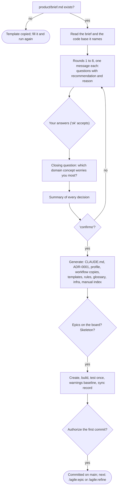

### /agile:idea
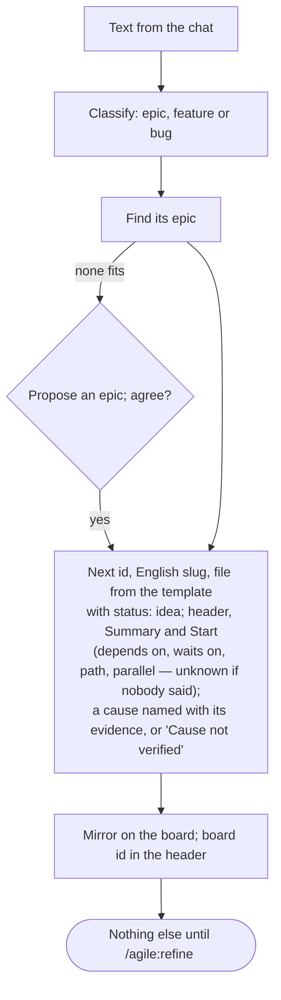

### /agile:discuss


### /agile:epic
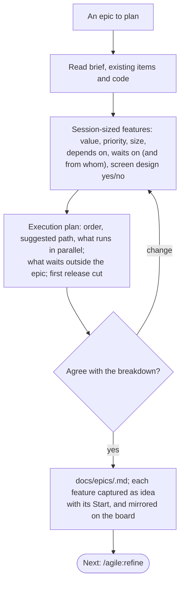

### /agile:refine
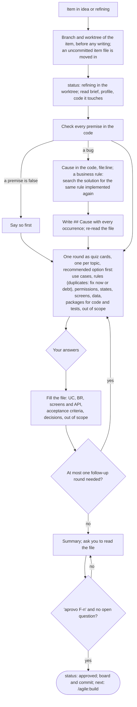

### /agile:screen


### /agile:build


### /agile:review


### /agile:change
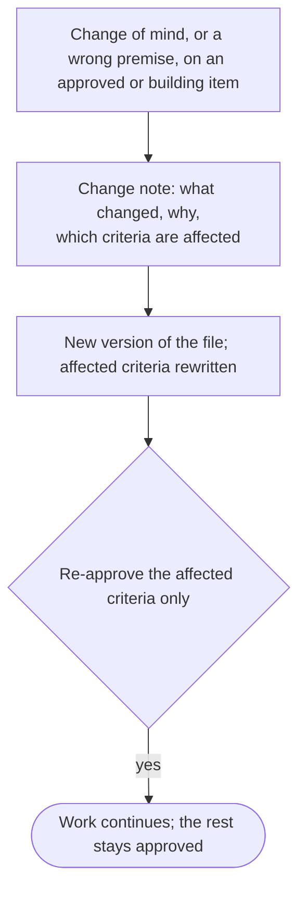

### /agile:ship
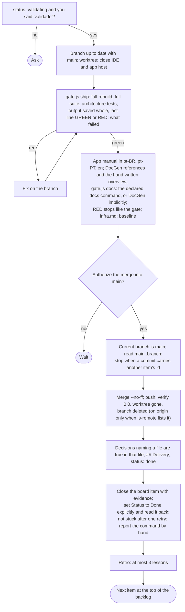

### /agile:retro
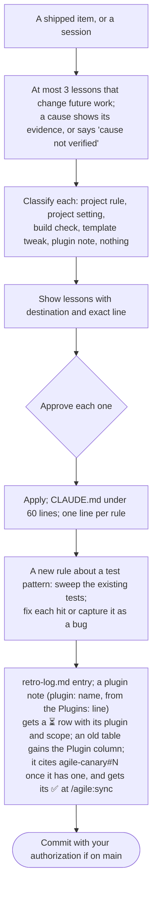

### /agile:pause


### /agile:status
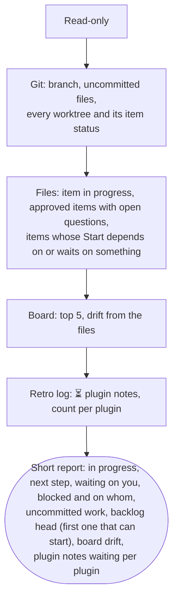

### /agile:sync
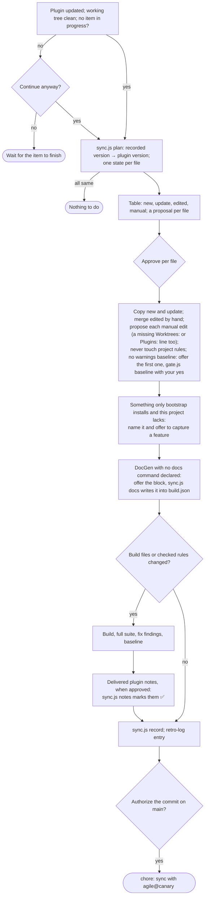

### /agile:autopilot
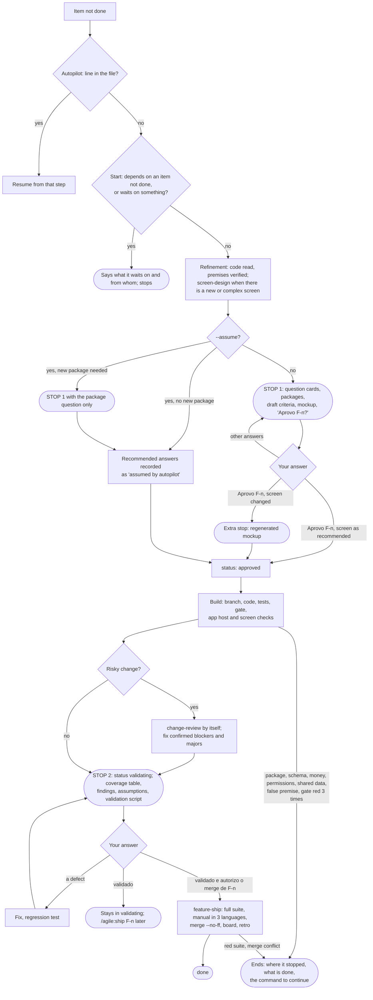

### /agile:version
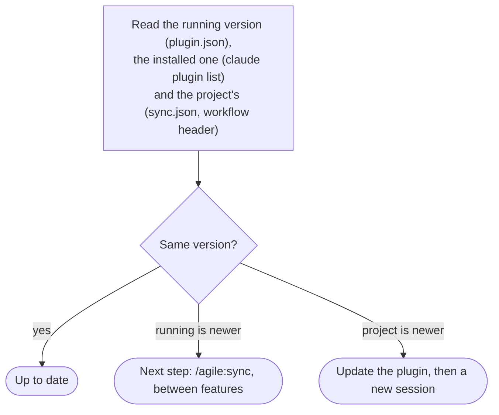
