# agile@canary — Manual (pt-BR)

> Versão 0.46.0 (rascunho). English: [en](workflow.md).

Sumário
1. Conceitos em dois minutos
2. Papéis
3. Preparando um projeto
4. Quiz do bootstrap
5. Ciclo de vida de uma feature
6. Mudando de ideia
7. O arquivo da feature
8. Definição de pronto
9. Gates de qualidade
10. Board
11. Idiomas e o manual da app
12. Perfis de arquitetura
13. Sessões e pausas
14. Exemplos de workflow
15. Referência rápida
16. Fluxo de cada comando
17. Glossário

---

## 1. Conceitos em dois minutos

- **A conversa é onde as ideias amadurecem.** Você e o Claude conversam sobre épicos, features e casos de uso até ficarem claros. Nada é codificado enquanto a feature ainda está em discussão.
- **O disco é a fonte da verdade.** Toda decisão que importa termina num arquivo com cabeçalho `status:`. A conversa pode se perder; os arquivos, não.
- **Uma feature por vez.** Só uma feature fica em `building` ou `validating` a cada momento; um item `blocked` não ocupa vaga.
- **Três portões humanos.** A feature é **aprovada** antes do código, **validada na tela** antes do merge e **mergeada** só com o seu OK.
- **Código simples.** O perfil de arquitetura escolhido no bootstrap decide quanta estrutura cada módulo recebe. CRUD continua sendo uma fatia vertical fina.
- **Retorno rápido.** Os hooks compilam e testam só o que mudou. A suíte completa roda uma vez, no ship.

## 2. Papéis

| Você (dono do produto) | Claude (engenheiro) |
|---|---|
| Escreve o brief do produto | Conduz o quiz do bootstrap e registra as decisões |
| Propõe épicos e features na conversa | Registra no board, sem refinamento |
| Responde às perguntas de refinamento e aprova as features | Faz **todas** as perguntas numa rodada, cada uma com recomendação, depois de conferir o código |
| Valida cada feature na tela | Implementa, testa e entrega um roteiro de validação |
| Autoriza os merges (digitar `/agile:ship <id>` é a autorização; com `Merge: pr` você mesmo faz o merge do pull request) | Faz o merge, remove a branch e a worktree, atualiza o board e o manual da app, conduz a retro |

Subagentes são exceção: um revisor com contexto limpo para mudanças arriscadas, duas passagens somente leitura antes do código de um item mais pesado (`system-design` propõe o corte, os contratos e os dados; `architect` revisa essa proposta), dois papéis que produzem telas (`ux-designer` desenha, `frontend` implementa o mockup que você aprovou), ou trabalho paralelo que não mexe nos mesmos arquivos. São funções com nome, não uma cadeia de papéis por feature, e nenhuma delas fala com você: a conversa é sempre com o Claude, que lê o que o agente escreveu ou propôs antes de seguir. Um escritor por vez em cada pasta, e as duas passagens não escrevem nada. Todo agente trabalha na worktree do item: o pedido do Claude entrega a worktree como caminho absoluto, todos os outros caminhos absolutos dentro dela, e a lista `Other items in progress: <id> → <caminho da worktree>` tirada do `git worktree list`; o agente passa a worktree como pasta de toda busca, lê o status de outro item só na worktree daquele item (ou diz que é desconhecido), e o `reviewer` lê ali também o código em volta do diff. Uma busca que ficou no checkout principal já relatou como inexistentes tipos commitados na branch do item; agora um hook a recusa (seção 9).

**Modelos.** O modelo é escolhido por atividade, de propósito: a revisão independente, as passagens de desenho e arquitetura e o desenho de tela rodam no modelo mais forte, as buscas no código no menor, a implementação da tela e o trabalho mecânico em volume que os testes conferem num modelo intermediário, e a sessão principal no modelo que você escolher. Cada agente (`reviewer`, `system-design`, `architect`, `ux-designer`, `frontend`) declara o seu modelo padrão; o seu projeto troca esse modelo na seção "Models" do `CLAUDE.md` (pergunta 34 do quiz), nunca editando o plugin.

## 3. Preparando um projeto

1. Instale o plugin:
   ```
   /plugin marketplace add <path to your agile-canary clone>
   /plugin install agile@canary
   ```
2. Crie um repositório vazio e escreva `product/brief.md` com o template de brief: problema, usuários, capacidades principais, restrições e o que fica fora do escopo.
3. Rode `/agile:bootstrap`.

## 4. Quiz do bootstrap

O `/agile:bootstrap` lê o `product/brief.md` e faz perguntas em **rodadas por tema**. Para cada pergunta, o Claude traz uma recomendação baseada no brief e questiona respostas que conflitem com ele. As decisões são tomadas juntos; nada é presumido.

Antes de escrever qualquer coisa, o Claude confere se a skill que carregou e o plugin instalado são a mesma versão. Quando diferem, ele avisa e copia da versão instalada: senão o projeto registra errado de onde vieram suas cópias, e o `/agile:sync` seguinte compara com o texto errado.

| Rodada | Temas |
|---|---|
| 1. Forma | Tipo de app (web, mobile, desktop, API), perfil de arquitetura, a tecnologia desktop (WinUI 3, Avalonia ou MAUI) e como um cliente desktop chega aos dados, **onde mora o backend de um app mobile** (pergunta 2d), as **seções de um site** (pergunta 2c, perfil `website`), **um app mobile desde o início ao lado de um site** (pergunta 2e), **online ou offline-first para um app mobile** (pergunta 2f), **um backoffice web para a equipe de um app mobile** (pergunta 2g), onde vai rodar |
| 2. Dados | Banco (o motor da casa quando há um sistema existente ao lado), multi-tenancy, apagamento, auditoria, dados pessoais e retenção |
| 3. Acesso | Autenticação (no `web-api`, pergunta 10a: como os consumidores da API se autenticam), RBAC, a ponte de identidade para os usuários de um sistema vizinho, entitlements/planos (limites de uso, trials, concessões por prazo, códigos promocionais), back office administrativo |
| 4. Integração | Mensageria (nenhuma, em processo, broker), serviços externos, armazenamento de arquivos e — quando alguma feature chama um modelo — o provedor do LLM e onde ele roda, o teto de custo e como ele é falsificado nos testes |
| 5. Experiência | Stack de UI, idiomas (padrão pt-BR, pt-PT e en), acessibilidade, a **identidade visual** (23a: um arquivo, um site, uma imagem ou três perguntas básicas), a biblioteca do design system, família de ícones, como um item é editado — ou, numa UI de conversa, em que língua ela responde, como uma proposta é corrigida e uma galeria de estados. O kit de UI e a galeria deixaram de ser pergunta: todo app com telas ganha um, construído a partir da identidade. O perfil `web-api` não tem telas: pula a stack de UI, a troca de idioma (21), a acessibilidade (22) e tudo sobre identidade visual e UI, e a pergunta 20 vale só para o texto que a API envia a pessoas |
| 6. Operação | Observabilidade, hospedagem, CI, board (GitHub ou Azure), ambientes, a conta de nuvem do cliente de cada um que não é local (pergunta 25a) e, para um Azure, a receita dele e, para `aca`, o teto mensal (pergunta 25b), para um ambiente compose de um app com AppHost se o deploy usa ou não o Aspire (pergunta 25c), para um app desktop de onde as cópias instaladas se atualizam (pergunta 26b) e, com uma pasta de rede, se cada merge vai para os testadores como beta (pergunta 26c), as convenções da casa quando o código vive ao lado de um sistema existente e — sempre — onde ficam as worktrees dos itens (`D:\wt\<repositório>`, ou `C:\` sem drive D:) |
| 7. Qualidade | Tempo máximo de teste por nível, expectativa de cobertura, testes de arquitetura, modelos por atividade, e evals quando alguma feature chama um modelo (qual modelo roda os casos, com ou sem o braço sem plugin) |
| 8. Documentação | Documentação técnica gerada do código (diagramas de entidades, dicionário de dados, mapa de rotas, diagrama de módulos e um catálogo de tools quando o app expõe ferramentas a um modelo), o prompt de sistema como arquivo versionado, e uma visão geral da arquitetura escrita à mão |

Quando alguma feature chama um modelo, o quiz trata isso como um sistema com decisões próprias, não como uma biblioteca: qual provedor e onde ele roda (um modelo local é o único lugar de onde os dados não saem), um teto de custo por usuário e um disjuntor global, um fake roteirizado para que tudo em volta do modelo continue testável, o prompt de sistema como arquivo versionado, e um catálogo de tools gerado dizendo o que cada uma alcança e com que permissão. O exemplo 14.14 mostra a rodada.

Para um site público (perfil `website`), a pergunta 2c vem logo depois do perfil: o Claude mostra o catálogo de 26 seções como uma lista numerada no chat, em dois grupos, **lançamento** (sobre mim, depoimentos, FAQ, cadastro de e-mail, produtos, contato e WhatsApp) e **depois** (serviços, portfólio, blog, galeria, busca, newsletter, PWA e o resto), todas marcadas. Você responde "ok" ou os números a desmarcar; desmarcar uma seção de que outra precisa (o cadastro de e-mail enquanto os materiais para download ficam) é dito uma vez, e a sua resposta vale. A base não está na lista, porque o site sempre tem: área de conteúdo, home, SEO básico, páginas 404 e de erro, política de privacidade e consentimento de cookies. Depois do quiz o board tem um épico "Website sections": a base primeiro, depois lançamento, depois o resto, uma ideia de feature por seção. Uma loja online nunca é seção: vira um épico próprio. No `website`, a pergunta 9b é sempre feita (cadastros são dados pessoais), a 12 e a 14 são fixas (papéis `Admin` e `Editor`, área admin no mesmo app), e o e-mail (19) não pode ser "nenhum" com a seção de cadastro ou de contato. O exemplo 14.23 mostra a pergunta.

Para uma app que é só uma API (perfil `web-api`), responder "só API" na pergunta 1 faz a pergunta 2 recomendar `web-api`. A pergunta 10a então pergunta, no lugar da 10, como os consumidores da API se autenticam, de múltipla escolha: **Identity bearer** (os usuários entram na própria API; o padrão para os clientes do próprio dono), um **IdP externo** (usuários e client credentials para clientes máquina; a API só valida o token) e **API key** (só clientes máquina, nunca um navegador ou app mobile, cujo código é público). Cada resposta gera só os esquemas, endpoints e políticas de que precisa, e a pergunta 11 (login social, MFA) só é feita com Identity bearer. O Claude não faz a 14 (não há back office), a 21 e a 22 (não há telas), nem as de identidade visual e UI, e a pergunta 29 não tem nível de UI. O exemplo 14.28 mostra a pergunta.

Para um app mobile (perfil `mobile`), a pergunta 2d pergunta onde mora o backend: **nesta solução** (o comportamento de hoje: `monolith` por padrão) ou **uma API existente em outro repositório** — um `web-app`, `website` ou `web-api` do agile (o repositório dele), ou qualquer API que publique um documento OpenAPI (a URL); a pergunta 1 oferece "mobile sobre uma API existente" para isso. Com a resposta externa o app é um repositório próprio, e o Claude pula o que a API já decide — a pergunta 3, a rodada de dados inteira, a 12, a 13 e a 14 —, lista essas em "Já está claro" e transforma a pergunta 10 em "o login da API", lido da API. O `CLAUDE.md` ganha a linha ``- Backend: external — <API name>, <repository or URL>; contract in `docs/api/backend-openapi.json`.`` e o ADR-0001 diz isso. Quando a API é um site do agile cujo `CLAUDE.md` nomeia o pacote `<App>.Shared`, as telas são MAUI Blazor Hybrid: o Claude lê isso do site, não pergunta de novo, e acrescenta ``- Shared screens: package `<App>.Shared` from the site's GitHub Packages feed``; senão são XAML. O exemplo 14.30 mostra o quiz e o que o bootstrap propõe; o exemplo 14.33 mostra com Hybrid.

Para um app mobile, a pergunta 2f vem depois da 2d, com qualquer resposta de backend: **online · offline-first**. A recomendação vem do brief: o app trabalha em campo, com conectividade ruim ou nenhuma, ou o brief diz "offline" ou "sem internet" → offline-first; senão online, que mantém o comportamento de hoje (uma funcionalidade ainda pode pedir offline na sua refinação). Offline-first cobre leitura e escrita: o `CLAUDE.md` ganha `- Offline: first` sob `Profile:`, o ADR-0001 uma linha, e a proposta do quadro ganha "Offline foundation" (o armazenamento local, a fila de escritas, o enviador, a interface de conectividade e o banner `OfflineStatus`) logo depois do kit de UI e da primeira funcionalidade; daí em diante todo arquivo de funcionalidade tem uma seção `## Offline`. Com uma API existente, o Claude lê o documento fixado: uma API agile cujas operações de escrita não têm o cabeçalho `Idempotency-Key` ganha uma proposta de issue "Idempotent writes for <App>" no quadro dela (com o seu sim; o Claude nunca escreve naquele repositório) e "Offline foundation" espera por ela; qualquer outra API que não declare isso deixa o app offline só para leitura, e o ADR-0001 diz isso. Voltar de offline-first para online não é oferecido; um projeto online liga o offline depois com uma ideia "Offline foundation". Exemplo 14.39.

Para um app mobile cujo backend está nesta solução, a pergunta 2g vem depois da 2f: **um backoffice web para a equipe: não · sim**. A recomendação vem do brief: ele cita pessoas que gerenciam os dados do app (equipe, back office, painel administrativo, "painel", "gestão", operadores) → sim; senão não. Sim escreve `- Backoffice: staff` sob `Profile:` no `CLAUDE.md`, não escreve `- Backoffice: none`, os dois acrescentam uma linha ao ADR-0001, e o sim põe "Backoffice foundation" no quadro logo depois do kit de UI; o esqueleto não muda. Com o backend em outro repositório (`Backend: external`) a 2g não é feita: o backoffice mora junto dos dados, no repositório da API, e o ADR-0001 diz isso. Um projeto `mobile` em andamento sem nenhuma das duas linhas recebe "Staff backoffice" do `/agile:sync` como capacidade que falta, com o item a capturar; `- Backoffice: none` encerra o aviso. O "Backoffice foundation" já inclui o registro de auditoria do que a equipe altera (sem pergunta extra; ele escreve `- Backoffice audit: on`); um projeto em andamento com `- Backoffice: staff` e sem linha `- Backoffice audit:` recebe "Staff audit log" do `/agile:sync` do mesmo jeito, e `- Backoffice audit: none` encerra esse aviso. Exemplos 14.54 e 14.63.

Para um app desktop, a pergunta 2f vem depois da 2a2 quando a 2a2 escolheu uma API, com a mesma recomendação e as mesmas escritas (a linha `- Offline: first`, uma linha no ADR-0001, "Offline foundation" depois do UI kit e da primeira feature). Com acesso direto ao banco ela não é feita, e o ADR-0001 diz que offline-first precisa de uma API (um armazenamento SQLite já é local). Exemplo 14.43.

Para um site que precisa de um app mobile desde o primeiro dia, a pergunta 2 pesa antes a forma do brief: quando a API é a principal consumidora ou há várias áreas de negócio, ela recomenda `mobile` (sobre `monolith`, ou `modular-monolith`); quando o produto é um site com telas sobre dados simples, ou um site público, ela recomenda `web-app` ou `website` e vem a pergunta 2e, logo depois da 2 (depois da 2c no `website`): **um app mobile desde o início: não · sim, MAUI Blazor Hybrid · sim, MAUI XAML**. A recomendação vem do brief: nenhum app citado → não; um app citado → Hybrid, para que as telas do site já nasçam onde o app vai reaproveitá-las. O app mora neste repositório e nesta solução; um app em repositório próprio continua começando pelo bootstrap dele (pergunta 2d). Com sim, o Claude lista as funcionalidades do brief numeradas na mesma mensagem, agrupadas como o brief agrupa e todas marcadas (nunca uma seção pública de um `website`); você responde "ok" ou os números para desmarcar. O bootstrap então acrescenta `<App>.Contracts` e, com Hybrid, `<App>.Shared` (uma Razor Class Library cujos componentes não têm `@page` nem render mode, com textos em todos os idiomas do app), os dois cobertos pelos testes de arquitetura e de layout; ele **não** acrescenta os projetos do app, a linha `Complement:` nem um segundo `<Version>`: isso vem com o primeiro item do épico, então o `/agile:sync` nunca pede a versão do app antes de o app existir. A proposta do quadro ganha um épico "Mobile app" (`docs/epics/mobile-app.md`, com a lista que você aprovou escrita inteira) cujas ideias são "Mobile foundation" primeiro e depois um "<X> on mobile" por funcionalidade marcada; a ideia do próprio site para cada funcionalidade marcada diz que a tela dela é um componente no `Shared` (Hybrid) e a regra ou consulta uma classe em `Features/`, e com Hybrid o kit de UI também mora no `Shared`. O ADR-0001 registra a resposta. "Não" deixa o bootstrap exatamente como era. Exemplo 14.34.

A pergunta 28d, **como um item é integrado: direct · pr**, é feita na rodada 6 só quando o código está hospedado no `github.com` (em qualquer outro lugar é `direct`, sem perguntar); `direct` é o recomendado. `direct` é como o workflow sempre funcionou: o `/agile:ship` faz o merge na branch principal. `pr` serve a um projeto cuja branch principal é protegida ou cujo dono quer ler o diff e fazer o merge no GitHub de qualquer dispositivo: o `/agile:ship` envia a branch do item e abre um pull request, você faz o merge no GitHub, e um segundo `/agile:ship` fecha o item (veja `/agile:ship` na seção 16). A resposta é a linha `- Merge: direct | pr` do `CLAUDE.md` do projeto; um projeto sem essa linha é `direct`.

Quando a pergunta 3 é "containers + Aspire" e o esqueleto tem um AppHost, a pergunta 3a vem logo depois: **serviços locais fixos: sim · não**, com sim recomendado. Sem isso o container do banco ganha uma porta nova no host a cada `aspire run`, a conexão que você salvou no DataGrip ou no pgAdmin deixa de funcionar, e a senha que o Aspire gera é uma que ninguém conhece. Sim vale para todo container que o AppHost declara (hoje o banco): a porta padrão da imagem (PostgreSQL 5432, SQL Server 1433, ou a próxima livre quando a porta já está em uso nesta máquina, o que o Claude confere antes; você aceita ou digita outra), um parâmetro de senha `<recurso>-password` que o bootstrap gera e guarda nos user secrets do AppHost (o valor nunca é impresso no chat nem escrito em arquivo do repositório) e `WithDataVolume()`, para que os dados sobrevivam a um reinício. Com mais de uma API na solução, o Claude propõe também um começo livre (como 5100) e cada API recebe a porta seguinte, na ordem da solução, com o `https` nessa porta + 1000. A resposta vira `- Local services: fixed` (ou `none`) sob `Profile:` no `CLAUDE.md`, e um sim também escreve `## Local services` no `docs/infra.md`: porta de cada serviço, a chave dos user secrets da senha e o volume, nunca um valor, e como zerar o volume (a imagem só aplica a senha quando cria os dados; trocar a senha exige remover o volume, e os dados dele se perdem). Você lê a senha com `dotnet user-secrets`, e um clone em outra máquina define a sua. Um worktree roda nas mesmas portas fixas mas com volume próprio, então um app host por vez. Os ambientes publicados não mudam: nada disso roda em modo publish. Um projeto criado antes disso recebe do `/agile:sync` a proposta de um item "Fixed local services" enquanto tiver um AppHost e nenhuma das linhas `- Local services:`; `none` recusa, e um AppHost que já fixa tudo só precisa que `- Local services: fixed` seja escrita. Exemplo 14.81.

Quando o brief cita uma base de código existente para reaproveitar e você dá acesso a ela, o Claude lê esse código (nunca edita) e usa o que encontra como motivo das recomendações. Depois da rodada 8 vem uma **pergunta de fechamento** — "qual conceito do domínio mais preocupa você, ou o quiz não tocou?" — porque o vocabulário central de um domínio (uma taxonomia, um modelo de entitlement, uma regra de pontuação) raramente cabe numa lista fixa de perguntas. O que ela levantar é decidido como qualquer pergunta do quiz e registrado na ADR-0001.

Saídas, todas em inglês:
- `CLAUDE.md` — curto (abaixo de ~900 palavras, sem nenhum comentário do modelo), apontando para um perfil.
- `docs/decisions/ADR-0001-foundation.md` — cada decisão do quiz, com o motivo.
- `docs/agile/profile.md` — cópia do perfil de arquitetura escolhido.
- `docs/agile/workflow.md` e `docs/agile/workflow.pt-BR.md` — este workflow nos dois idiomas, `docs/agile/workflow-examples.md` e `docs/agile/workflow-examples.pt-BR.md` — os exemplos dele (seção 14, um arquivo à parte desde a 0.39.0), e `docs/agile/templates/` — os templates, copiados para o projeto.
- `docs/glossary.md` — termos de negócio e os identificadores em inglês, e os termos técnicos que o Claude usa em relatórios e revisões (as severidades da revisão, por exemplo) com a palavra em pt-BR que ele usa ao falar com você. As duas tabelas terminam numa coluna `Meaning (pt-BR)`, o significado escrito em português: o único texto de um projeto que não é inglês. Termo técnico é o que você pode não conhecer: nome de produto ou serviço (Bicep, ACR), sigla, protocolo, padrão, biblioteca; termo de negócio, palavra comum, identificador, caminho ou comando não é. A skill que escreve um documento acrescenta as linhas que faltam no mesmo passo e no mesmo commit: `/agile:bootstrap` para o ADR-0001 e o `docs/infra.md`, `/agile:ship` para as mudanças do item em `docs/` (fora de `docs/manual/`), `/agile:publish` para as notas de release. Cada um desses documentos (infra, ADRs, arquivos de item, discussões, épicos, notas de release) tem, logo abaixo do título, a linha `Technical terms: [glossary](../glossary.md)`; o manual da app para o usuário final não tem. Um projeto anterior a isso recebe a coluna, as linhas que faltam e as linhas de link propostas pelo `/agile:sync`, escritas só com o seu OK. Exemplo 14.45.
- `docs/infra.md` — como rodar localmente, quais ambientes existem de fato (`provisioned` ou `planned`), os segredos esperados (só os nomes), para cada ambiente o comando que o implanta, a URL de checagem e a versão implantada lá (escrita só pelo `/agile:publish`), para um app desktop a fonte de atualização dos apps instalados, os passos de release e os tempos medidos de build e testes. Atualizado no ship quando algo disso muda.
- `.github/workflows/deploy.yml` e `.github/scripts/agile-deploy.js` — só quando o `origin` está no github.com e um ambiente que não é `local` declara um comando de deploy: o pipeline que implanta uma tag `v<Version>` enviada, por esse mesmo comando (veja "O pipeline de deploy" abaixo).
- Esqueleto da solução conforme o perfil, já com i18n e os projetos de teste.
- `docs/design/identity.tokens.json` e `docs/design/DESIGN.md` — a identidade visual do app (pergunta 23a), para todo app com telas. Os tokens seguem o formato de Design Tokens do W3C (DTCG 2025.10) e são a fonte dos valores: cores por papel em claro e escuro, tipografia, raio dos cantos, e a família de ícones, a origem (arquivo, URL, imagem ou derivada) e a data em `$extensions.agile`. O `DESIGN.md` (o formato de arquivo de design do Google) tem os mesmos valores no front matter YAML, gerado a partir dos tokens, seguido da sua prosa sobre o porquê e o onde; regerar mantém a prosa. Você pode dar um arquivo (tokens ou um `DESIGN.md`), a URL de um site, uma imagem (um logo, uma prancha de marca) ou nada: três perguntas (cor primária, fonte, claro, escuro ou os dois) derivam uma identidade completa. Uma URL ou uma imagem é lida pelo Claude, que mostra uma tabela antes de escrever qualquer coisa: cores por papel (as de uma imagem vão marcadas como estimadas), fontes, raio, família de ícones, e o contraste WCAG 2.2 AA de cada par frente/fundo nos dois temas; um par que falha traz a razão e o valor mais próximo que passa, e você decide. Nada é guardado antes de você dizer "confirmo". O plugin nunca escreve o tema do app: quem escreve é o item do kit de UI, a partir desses tokens, e um teste do perfil compara os dois. Os mockups de tela tiram cores, fontes e raio desse mesmo arquivo.
- `docs/architecture/` — quando a rodada 8 escolheu algum documento: o `tools/<App>.DocGen` gera, por módulo, um schema DBML lido num visualizador dbdiagram (`entities: "mermaid"` no `docgen.json` dá um diagrama ER, que renderiza no board mas fica ilegível a partir de uma dúzia de tabelas) e um dicionário de dados (do modelo EF), mapa de rotas por área (do documento OpenAPI que o teste de integração de `/openapi/v1.json` grava em `docs/api/`) e diagrama de módulos (das referências entre projetos, em Mermaid); o gerador referencia o provedor EF Core do próprio app (pergunta 5: PostgreSQL, SQL Server ou SQLite) e o chama por reflexão, então documenta os tipos de coluna reais e o schema padrão (`public`, `dbo`, ou nenhum no SQLite) mesmo para um `DbContext` sem fábrica de design-time; um contexto com fábrica é montado por ela em vez disso, então os nomes seguem o banco (snake_case, por exemplo) — a saída é a mesma nos dois casos; quando a rodada 8 também escolheu o catálogo de ferramentas (pergunta 37), o `tools.md` lista cada ferramenta que o app oferece a um modelo — a descrição que o modelo recebe, o schema de entrada, o que ela alcança, as permissões que exige, se escreve e se pergunta antes — e o `--check` reprova quando uma ferramenta está sem descrição, sem permissões ou sem alcances, ou quando duas chegariam ao modelo com o mesmo nome. O bootstrap declara o gerador como o **comando de docs** do projeto no `.claude/agile/build.json` (`{ "docs": { "command": "dotnet run --project tools/<App>.DocGen", "check": "… -- --check", "paths": ["docs/architecture/"] } }`), então a partir da 0.0.72 o `/agile:ship` regenera e confere por aquele único passo genérico (seção 9, "Um comando de docs declarado") em vez de um passo próprio; o `--check` reprova quando estão desatualizados. Um projeto que ganhou o DocGen antes da 0.0.72 não declara nada, e o ship ainda o roda: o gate acha o único `tools/*.DocGen` e o roda como comando de docs **implícito**, dizendo `implicit DocGen docs command: declare it with /agile:sync` — assim nenhuma janela deixa o mapa do código desatualizado, e o `/agile:sync` oferece o bloco uma vez. Opcionalmente uma visão geral de uma página escrita à mão (C4 contexto e containers), na qual o gerador nunca mexe: só arquivos que carregam a marca `Do not edit` dele são reescritos ou apagados; um módulo ou sistema externo que uma feature adiciona é escrito ali à mão no ship.
- Os primeiros épicos no board, se o brief já os citar.

## 5. Ciclo de vida de uma feature

```mermaid
stateDiagram-v2
    [*] --> idea: /agile:idea
    idea --> refining: /agile:refine
    refining --> approved: você diz "aprovo F-n"
    idea --> cancelled: duplicata, escolhida no card de itens parecidos
    refining --> cancelled: duplicata, escolhida no card de itens parecidos
    cancelled --> [*]
    building --> blocked: /agile:change F-n --block "motivo" (também a partir de refining, approved, validating)
    blocked --> building: /agile:change F-n --unblock (volta ao status que deixou)
    approved --> building: /agile:build
    building --> validating: tabela de cobertura + roteiro de validação
    validating --> building: um ajuste que você reportou
    validating --> done: você diz "validado", depois /agile:ship (digitar autoriza o merge, ou com Merge pr o pull request que você mescla)
    done --> [*]
    note right of approved: gate 1 — aprovada
    note right of validating: gate 2 — validada na tela
    note right of done: gate 3 — /agile:ship digitado = merge autorizado
```

| Status | O que acontece | Quem muda |
|---|---|---|
| `idea` | Registrada a partir da conversa com `/agile:idea`. Título, 2 ou 3 linhas e como ela começa (`## Start`): do que depende, pelo que espera para começar, o que só a validação precisa (nunca bloqueia) e de quem, o caminho sugerido, o que pode rodar ao lado. O que ninguém disse fica escrito como desconhecido. Uma causa citada vem com a evidência (o comando e a linha da saída que a mostra); sem ela, o `## Start` diz `Cause not verified: measure it at /agile:refine`, com o sintoma visto. Um item levantado por uma lição de retro ou pelo achado de outro item diz no resumo o que aquele item já corrigiu e o que falta, para que uma refinação depois nunca leia uma lacuna fechada como aberta. Para uma feature ou bug, antes de criar qualquer coisa o Claude pergunta onde ela mora: uma pergunta com o épico que ele sugere primeiro (um épico aberto cujo objetivo serve, com o motivo), depois "Novo épico" e "Sem épico"; um épico novo só é criado depois do seu sim, no board e como `docs/epics/<slug>.md` (status `draft`). O `/agile:epic` e um texto que já é um épico não perguntam nada. | Claude |
| `refining` | `/agile:refine` (uma resposta que transforma algo num item para depois vira ideia pelo mesmo procedimento do `/agile:idea`: template, board, próximo número; uma resposta que junta o escopo de um item aberto já existente a este, em vez disso, primeiro confere aquele item — `git worktree list` procurando a pasta dele e o arquivo ou issue dele para o `status`. Qualquer status além de `idea` em qualquer lugar bloqueia a junção automática: o Claude nomeia o status e o caminho da worktree do outro item e você decide, juntar mesmo assim (registrado em `## Decisions` com o motivo) ou descartar a junção e deixar o outro item intocado. Ainda `idea` em todo lugar, sem worktree: a junção acontece como antes, sem pergunta nova): antes de escrever qualquer coisa, o Claude cria a branch do item e a worktree dele — uma pasta fora do repositório, cujo caminho completo ele te diz — e tudo o que este item produz (o arquivo da feature, a causa de um bug, o mockup) é escrito ali, na branch dele; um arquivo de item ainda não commitado é movido para lá e deixa de existir onde foi criado. Nenhum checkout é trocado, então uma sessão que está na pasta de outro item não consegue mais deixar os documentos deste na branch daquele. Depois o Claude lê o código relacionado, confere no código de hoje cada premissa sobre como algo já funciona (o arquivo de um item antigo não é prova: um bug posterior pode ter mudado aquilo), confere no código ou na documentação da biblioteca cada premissa sobre como ela guarda ou protege dados, uma premissa de performance de consulta com `EXPLAIN` no test container, e uma premissa que a documentação e o código da biblioteca deixam em aberto reproduzindo-a num projeto descartável contra um test container (fonte lido cru, nunca resumido) — uma premissa de que nada usa um recurso é conferida pelo efeito, não pelas chamadas de um helper. Antes que um critério ou as telas e a API dependam deles, confere também no código um ponto de encaixe de uma biblioteca (um relógio, um hook, um callback) na versão que a sua solution de fato resolve (o Identity 10.0.12 não tem `TimeProvider`), qual host é dono dos dados de uma tela e como o host que a mostra chega a eles (UI e API costumam ser hosts diferentes), cada rota contra o prefixo que os endpoints do módulo já usam, e cada coluna, entidade ou palavra de rota nova contra o `docs/glossary.md` (uma palavra já definida para outra coisa ganha outro nome). Um bug cuja causa só existe na branch de um item sem merge diz isso em `## Cause` e espera esse merge antes de criar a própria branch. Depois o Claude faz todas as perguntas abertas numa rodada, como cartões de quiz agrupados por tema (regras, permissões, estados, telas, dados, pacotes, escopo) com a opção recomendada primeiro — o tema de regras pergunta, para uma tabela que dois atores de negócio dividiriam, qual ator é dono de quais linhas e qual deles uma tela e um endpoint oferecem; num terminal as mesmas perguntas vêm como lista numerada. A rodada inclui os pacotes novos de que o item precisa, para o código **e para os testes**, com as versões conferidas no registro naquele momento, para que o seu sim seja dado uma vez e não no meio do build. Você responde; no máximo mais uma rodada. Uma lista que você aprovou ou editou no chat (um catálogo, um conjunto de opções, escolhas numeradas) é escrita inteira na seção `## Approved list` do item, na ordem aprovada e com as suas edições aplicadas, e o arquivo nunca diz "a lista mostrada na refinação"; antes de pedir a sua aprovação o Claude relê o arquivo atrás de frases que mandam o leitor para o chat e cola a lista onde achar uma. Um item cuja saída é visual (um diagrama, uma página gerada) é prototipado e visto em tamanho real no visualizador de destino antes de você aprovar. Um item de autenticação ou de vínculo de contas recebe a revisão independente (`/agile:review`) neste arquivo, antes da sua aprovação. Uma tela nova ou complexa é desenhada pelo agente `ux-designer` (`/agile:screen`), que nunca fala com você: o Claude lê o que ele escreveu e faz como suas as perguntas abertas dele. O arquivo da feature é commitado na branch do item, dentro da worktree dele. | Claude |
| `approved` | Você aprova o arquivo da feature depois de lê-lo. Perguntas em aberto impedem a aprovação. **Portão 1.** | Você |
| `building` | `/agile:build`: primeiro acha a worktree do item pela branch e diz `Worktree of <id>: <caminho> [<branch>]` (`(created now)` quando um item antigo não tinha); o status e a checagem de árvore limpa são lidos ali, nunca no checkout principal, e continua nessa worktree — código e testes do que mudou. Antes de marcar `building` ele lê o `## Start` do item: um arquivo citado em "Waits on (to start)" que não existe, um item em "Depends on" que não está `done`, ou uma afirmação do arquivo sobre outro item que não estava `done` na refinação e que o código de hoje desmente para o build ali — o status fica `approved`, nada é escrito, e o Claude nomeia cada falha e quem resolve; uma premissa falsa aponta `/agile:change <id>`. "Needed to validate" nunca para o build, e um build retomado pula essa checagem (exemplo 14.87). Quando o item cria um projeto, um contrato de API, uma mensagem entre módulos ou muda o schema, duas passagens somente leitura rodam antes do plano: o `system-design` propõe o corte, os contratos, os dados e os riscos, e o `architect` revisa essa proposta contra o perfil e as conferências que o seu projeto realmente tem. Elas não escrevem nada; o Claude confere as duas nos arquivos, escreve o plano a partir delas e registra em `## Decisions` o que aceitou e o que descartou. Um CRUD fino não passa por nenhuma das duas. Quando o item tem um mockup que você aprovou, a tela e os testes dela são escritos pelo agente `frontend`, sozinho nessa worktree e em primeiro plano, para o gate do Stop nunca compilar arquivos que ele ainda está escrevendo. O plano lista o que a tela remove; o Claude remove antes da chamada (primeiro os testes de cada tipo removido, depois os arquivos e o que aponta para eles: usings, imports, registros), porque o agente não apaga arquivo e nunca deixa um toco. O agente adapta helpers, contextos e fixtures de teste à vontade, e muda a asserção de um teste existente só sob um critério aprovado que ele nomeia. Ele abre o relatório com `Nothing here was built or run.` e lista os testes existentes que afirmam o que ele mudou, as remoções que precisa do Claude e as suposições que não pôde verificar. Depois o Claude roda a suíte inteira (o modo `ship` do gate) antes de ler os arquivos dele e cita os números reais, lê cada arquivo que ele citou, conserta as falhas ele mesmo numa rodada planejada e roda a suíte de novo; o agente não é chamado outra vez. O Claude responde as paradas dele ou te traz as que são decisão (um padrão que falta no kit, um contrato que não existe). O relatório do build fecha o repasse num bloco só (exemplo 14.76). Domínio, API e migrações continuam com o Claude. Antes de copiar um padrão já existente, o Claude confere se há um item aberto para removê-lo e, se houver, deixa você escolher entre seguir o padrão agora ou registrar a cópia como dívida. Antes da tabela de cobertura o Claude abre a tela pelo app host, iniciado a partir da worktree do item num shell em segundo plano e aberto na pré-visualização pela URL (nenhuma configuração de execução é editada), e o para antes de terminar a vez dele. Quando os dados são do próprio item (um volume de dados do AppHost sem nome, ou a chave de banco do seu próprio projeto ajustada para a worktree) ele não pergunta nada; dados compartilhados com o checkout principal ou com outra worktree precisam do seu sim, uma vez por item, registrado em `## Decisions`. Os testes não enxergam como a biblioteca de componentes desenha os seus estados (um link ativo sem contraste, um link que não é link). O Claude lê a página como texto; um screenshot é só para conferência visual e nunca com um diálogo aberto (um screenshot que estoura o tempo pode derrubar o circuito do Blazor Server, e o diálogo junto). Uma afirmação de acessibilidade que a seção de tela marca `unverified (gallery DOM)` é conferida na marcação renderizada e corrigida. As conferências por teclado ficam no seu roteiro de validação, exceto numa tela cujo framework consegue enviar a tecla num teste (bUnit, o teste headless do Avalonia): ali o critério de teclado é um teste, e só o que depende do popup real fica no roteiro. Num item `desktop` o painel do navegador não dirige o app, então, numa sessão Windows, o Claude abre a janela real e a lê pelo UI Automation, pode acionar um controle por essa árvore e captura só o retângulo da própria janela; ele nunca envia mouse ou tecla sintéticos (cairiam na sua IDE) nem captura por coordenada de tela (exemplo 14.88). Fora do Windows a tela vai para o seu roteiro de validação e o relatório diz isso. O Claude nunca muda estado (cadastros, requisições contadas, dados) num app host que ele não abriu: pergunta antes, ou usa dados que ninguém mais usa e diz quais. Uma tela atrás de login não é conferida pelo Claude, cujas regras proíbem digitar senha: ele diz isso, confere o que não pede conta (a rota, o 401, o redirecionamento) e põe o fluxo logado no seu roteiro de validação. Só uma feature pode estar aqui. | Claude |
| `validating` | O Claude entrega um roteiro de validação (até 8 passos). Você testa na tela. Um passo que precisa de terminal traz o comando para Git Bash e para PowerShell 7, com a saída esperada e como repetir, e o Claude já rodou os dois. O passo de partida diz em que dados o app roda: o volume próprio (um volume de dados do AppHost sem nome: nada a ajustar), a chave do seu próprio projeto com `<banco>_f<n>` (`_b<n>` para um bug) nos dois shells, ou um aviso claro de que o banco local é compartilhado e a migração do item cai nele (exemplo 14.82). Um passo que pede para você mudar código nomeia o arquivo, onde vão as linhas e a falha exata a esperar, e um passo que compila manda parar o app host antes (um host rodando trava o `bin/`: `MSB3027`). Um passo que uma correção deixou errado se corrige com `/agile:script <id> <o que mudou>`, sem nota de mudança. **Portão 2.** | Você |
| `done` | `/agile:ship`: suíte completa, `## Criterion → test` conferida (uma linha `pending` ou um teste não encontrado o interrompe), versão da app incrementada, merge — digitar o comando é o seu OK (**Portão 3**), board e manual da app atualizados, retro. | Claude |
| `cancelled` | Uma saída, não uma etapa: só a partir de `idea` ou `refining`, só como duplicata, escolhida no card que o `/agile:refine` mostra ao achar um item parecido (abaixo). O arquivo fica com `status: cancelled` e a linha `Duplicate of <id> (<data>): <onde a melhoria foi parar>`, então o número nunca é reaproveitado; o status da sessão e o início do backlog o ignoram. No GitHub o issue é fechado como duplicata do outro e o item do projeto é arquivado (nunca Done: isso mostraria trabalho não entregue como entregue); no Azure Boards o estado é `Removed`; sem board a linha de `docs/agile/backlog.md` é riscada. | Você, no card |
| `blocked` | Um status lateral, não uma etapa: algo fora do trabalho trava o item (uma decisão, outro item, um fornecedor, uma checagem sua). `/agile:change <id> --block "<motivo>"` o define a partir de `refining`, `approved`, `building` ou `validating`, nunca de `idea`, `done`, `cancelled` ou `blocked`. Pede o motivo e quem destrava (`unknown` não é aceito em nenhum dos dois; o Claude pergunta a parte que falta e não muda nada). O arquivo diz `status: blocked` e, logo abaixo, `Blocked (<data>): <o que trava> — unblocked by <quem> — returns to <status>`; o `## Decisions` ganha uma linha. O item mantém a worktree e a branch, não ocupa vaga de WIP, e nada é commitado, mesclado ou trocado (com a árvore suja o Claude diz que o `/agile:pause` faz o commit `wip`). `/agile:build`, `/agile:ship`, `/agile:refine`, `/agile:autopilot` e `/agile:screen` param nele depois da linha do item, dizem o motivo e imprimem `/agile:change <id> --unblock`; nada é aprovado enquanto está bloqueado. `--unblock` devolve o item ao status de `returns to`, remove a linha e a marca do board e grava no `## Decisions` a linha do par; de volta a `building` ou `validating` é recusado enquanto outro item estiver em um deles naquele checkout (ele o nomeia; `--unblock --worktree` é o seu OK para trabalho em paralelo). No board entra o label (ou tag no Azure) `blocked` e o campo Status fica como está; sem board, a linha em `docs/agile/backlog.md` ganha `blocked: <motivo>`. O `/agile:status` e o início da sessão mostram uma linha `Blocked:` por item bloqueado (id, título, motivo, quem destrava, para onde volta); a linha que vem do `## Start` agora se chama `Waits on:`. | Você, com `/agile:change` |

**A linha do item.** `/agile:refine`, `/agile:build`, `/agile:ship`, `/agile:change`, `/agile:review`, `/agile:autopilot`, `/agile:screen`, `/agile:script` e `/agile:pause` começam nomeando o item em que atuam: `F-12 — Export the monthly report as CSV [idea]` (id, título, status), antes de qualquer checagem e antes de criar ou mudar qualquer coisa; assim um id errado aparece na hora, mesmo que uma checagem pare o comando em seguida. O título e o status vêm do arquivo do item (a cópia da worktree quando há uma), nunca do board, então funciona com `Board: none`; um id sem arquivo imprime `F-99 — no item file found` e o comando segue com a própria regra para item inexistente. É escrita uma vez por execução: o `/agile:autopilot` imprime no início, não de novo a cada fase, e o `/agile:build` mantém a linha `Worktree of ...` logo abaixo. O `/agile:pause` imprime uma linha por item que commita. `/agile:status` e `/agile:idea` não precisam: um lista todos os itens com o status, o outro termina com o id e o título do item novo.

**O id de um ticket como id do item.** Um bug ou uma feature que vem de um ticket externo (Jira, TFS, uma issue do GitHub de outro repositório) pode usar o id do ticket no lugar de `F-<n>` / `B-<n>`, para que o ticket do cliente e o trabalho entregue tenham um nome só: `/agile:idea bug --ticket PRJ-123 "Erro ao salvar"` cria `docs/bugs/PRJ-123-crash-on-save.md` (cabeçalho `bug: PRJ-123`), e daí em diante a branch é `bug/PRJ-123`, a worktree `b-prj-123-<desc>`, os commits `fix(PRJ-123): ...` e a linha do item `PRJ-123 — Erro ao salvar [idea]`. O id é uma chave de dois ou mais caracteres (primeiro uma letra, depois letras, dígitos ou `_`), um hífen e o número do ticket; `--url <URL>` acrescenta ao arquivo uma linha opcional `ticket-url:`. Uma chave de uma letra (`B-12`) é sempre um id interno e um número puro (`4521`) é recusado: escreva `TFS-4521` ou `GH-12`. O id é único: se qualquer item, em qualquer status, ou qualquer branch já o usa, o registro é recusado e cita esse item; trabalho novo no mesmo ticket é `/agile:change`. `--ticket` é recusado em épico e em discussão, e nunca é adivinhado a partir de um ticket citado no texto. Os itens sem `--ticket` mantêm `F-<n>` / `B-<n>` e a numeração; um id de ticket não consome número, e nada é renomeado nem migrado. Ler o ticket no tracker não faz parte disto (o legacy-lens faz).

**Itens parecidos.** Antes de o `/agile:idea` pegar um número, e antes de o `/agile:refine` criar uma branch, o Claude lê todos os itens (`docs/features`, `docs/bugs`, o arquivo do item em cada worktree, onde um item em andamento guarda o status atual, e o board, abertos e fechados, `done` e `cancelled` incluídos) e julga quais cobrem o mesmo assunto com outras palavras. Nunca por regra de palavras-chave. Sem candidato, diz `No similar item (<N> items read).` e segue. Com candidatos (no máximo 3, um motivo cada) faz um card, a ação recomendada primeiro. Para melhorar o item existente: um `idea` ganha `Added <data>: <texto>` no resumo; um item `refining` recebe o texto como pergunta aberta na própria worktree (o Claude diz o caminho); um item `approved`, `building` ou `validating` não é tocado e o Claude imprime `/agile:change <id>` com o texto para você digitar; um item `done` é informado como `Already delivered in <id>`, e você não cria nada ou cria o novo item com uma linha ligando o `done`. No `/agile:refine` o card tem três ações: levar a melhoria ao outro item e cancelar este (um refinamento retomado também perde a worktree e a branch), manter os dois (uma linha em `## Decisions`) ou absorver o outro neste (a checagem de status e worktree da seção 14.18). `/agile:epic` e `/agile:discuss` buscam uma vez para a lista toda e mostram todas as colisões em um card; `/agile:autopilot --assume` termina com a pergunta, pois duplicata é decisão sua.

Pequenas correções encontradas na validação são feitas na hora, sem sair de `validating`.

Antes de entregar o roteiro de validação, o Claude mantém no arquivo da feature a seção **`## Criterion → test`**, depois de `## Acceptance criteria`: uma tabela de duas colunas, escrita quando o build começa com todas as linhas `pending`; a linha é preenchida no mesmo commit que traz o seu teste. Cada critério de aceite aponta para os seus testes, ou para `validation step <n>` quando só se confere na tela (o passo está no roteiro de validação); no fim, nenhuma linha fica `pending`. Como vive no arquivo, uma compactação, uma pausa ou uma sessão nova ainda sabe quais critérios não têm teste, e o `/agile:ship` a confere (14.83). Um bug não tem essa seção: o `## Regression test` faz esse papel. O teste precisa passar pelo caminho que o usuário usa (página, endpoint, o handler que chama o código): um método escrito para um critério que nada na app chama é uma lacuna, mesmo que o seu próprio teste passe. Um critério sobre uma regra que o banco garante (ordem, comparação, unicidade, uma constraint) é testado contra o provedor real, nunca só contra um dublê em memória que reimplementa a regra e concorda consigo mesmo; o teste de uma regra do tipo "ninguém além de X pode fazer Y" tem uma fixture infratora para cada jeito de quebrá-la (um campo guardado, uma chamada encadeada, um cast inline), cada uma vista falhando. Quando um efeito sai da requisição (um e-mail ou um evento passa a ir por fila), todo teste que o conferia é relido: "nada foi enviado" passa de graça quando nada é enviado na hora. Um teste instável é reproduzido num laço (build limpo antes de cada rodada) e a correção é provada pelo mesmo laço, N verdes seguidos; um teste de saída gerada conta cada seção, exatamente uma vez.

### O mesmo caminho numa execução só: `/agile:autopilot`

O `/agile:autopilot <id>` percorre esse caminho inteiro, de `idea` a `done`, e para para você **exatamente duas vezes**. Os três portões continuam lá: a primeira parada é o portão 1, a segunda reúne os portões 2 e 3, e você escolhe se passa pelos dois numa mensagem só.

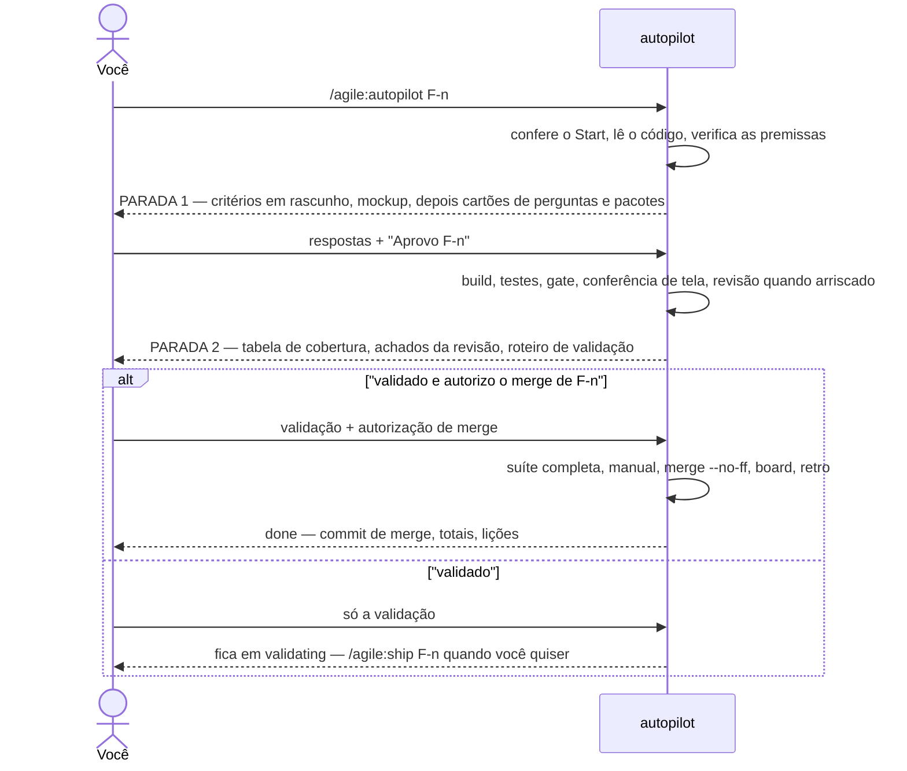

| Parada | O que você recebe | Como você responde | O que vem depois |
|---|---|---|---|
| 1 — perguntas | Todas as perguntas em aberto como cartões (a opção recomendada primeiro), os pacotes novos com licença e versão, os **critérios de aceite em rascunho** escritos a partir das opções recomendadas e, para um item com tela nova ou complexa, o **mockup HTML** feito com as mesmas opções. Os critérios e o mockup vêm primeiro e os cartões por último, porque um texto escrito depois de uma rodada de cartões só chega a você depois que você respondeu. O último cartão: "Aprovar F-n com estas respostas e critérios?" | Escolha as respostas e "Aprovo F-n". Qualquer outra resposta é uma rodada de acompanhamento, nunca uma aprovação. | O arquivo do item é preenchido com as suas respostas e vai para `approved`; o build começa na mesma execução. Se uma resposta de tela difere da recomendação, o mockup é refeito e a execução para mais uma vez, só para a tela. |
| 2 — validação | Arquivos, testes com números reais, a seção `## Criterion → test`, os achados do revisor (ele roda sozinho quando a mudança é arriscada: autenticação, permissões, dados, contratos, dinheiro, mais de ~400 linhas), o que o `--assume` assumiu, o roteiro de validação. | "validado e autorizo o merge de F-n" — ou só "validado" — ou o defeito que você achou. | Com o merge nomeado: suíte completa, manual da app nos três idiomas, `merge --no-ff`, board, retro, `done`, sem perguntar de novo. Só "validado": o item fica em `validating` até o `/agile:ship F-n`. Um defeito: corrigido, e a parada 2 de novo. |

O `--assume` pula a parada 1: cada pergunta recebe a opção recomendada, registrada em `## Decisions` como `assumed by autopilot` com o motivo, e a flag vale como a sua aprovação daquele item. Ele nunca assume um pacote novo — quando o item precisa de um, a parada 1 acontece só com essa pergunta. O mockup, quando houver, aparece então na parada 2.

Algumas decisões continuam suas mesmo dentro de uma execução. A execução **termina** — nada é desfeito — e diz onde parou, o que está pronto, o que falta e o comando para continuar, quando encontra: um pacote que você não aprovou na parada 1, uma mudança de schema fora do arquivo, dinheiro, permissões, dados compartilhados, credenciais, uma tela atrás de login, o contrato de outro módulo, uma premissa falsa ou um critério impossível, o gate vermelho três vezes, um bloqueador que não dá para corrigir dentro do item, a suíte vermelha no ship ou um conflito de merge.

A execução mantém uma linha `Autopilot:` no arquivo do item (`refined`, `stop 1`, `approved`, `built`, `reviewed`, `stop 2`, `shipping`). O `/agile:autopilot F-n` retoma dessa linha, então uma sessão nova ou um contexto resumido não perde nada.

### Etapas opcionais

| Comando | Quando | Resultado |
|---|---|---|
| `/agile:discuss` | Uma ideia com vários caminhos possíveis, ou dúvidas que só você responde | `docs/discussions/D-<n>-<slug>.md` (opções, decisões, pontos adiados) e os itens registrados como `idea` |
| `/agile:epic` | Um épico novo para planejar | `docs/epics/<slug>.md` com features priorizadas, cada uma cabendo numa sessão, do que cada uma depende e pelo que espera, um plano de execução (ordem, caminho sugerido, o que roda em paralelo) e o que o épico espera de fora; cada feature registrada como `idea`. Num `web-app`/`website`, um épico de app mobile segue o complemento `mobile-client` (seção 12) |
| `/agile:screen` | Uma feature em `refining` com tela nova ou complexa | O agente `ux-designer` escreve a seção de tela detalhada no arquivo da feature e um mockup HTML (todos os estados, três idiomas; uma cor nova só depois de calcular o contraste dela em toda superfície, nos dois temas), sozinho na worktree do item; o Claude lê os dois, te envia o mockup como arquivo (nunca por um servidor), faz como suas as perguntas abertas do agente, e você aprova a tela junto com a feature. No build, o agente `frontend` implementa esse mockup aprovado e os testes daquela tela. As cores, fontes e raio do mockup vêm de `docs/design/identity.tokens.json`; num projeto sem esse arquivo, os pontos em aberto do agente avisam e o mockup usa os padrões da biblioteca. O que um componente da biblioteca anuncia (um papel, um estado `aria-*`) não é tirado da documentação dele: o agente marca `unverified (gallery DOM)`, o Claude confere na marcação renderizada da galeria de desenvolvimento e corrige a seção, e sem galeria ainda quem confere é o build |
| `/agile:review` | Uma mudança arriscada (autenticação, permissões, isolamento por tenant, dados, contratos, dinheiro, ou mais de ~400 linhas), antes da validação | Achados por gravidade de um revisor só de leitura e com contexto limpo; os bloqueadores confirmados são corrigidos antes de você validar |
| `/agile:publish` | Depois de um ou mais ships, quando você quer a versão do app que está na `main` como um release | Um pacote `dotnet publish` do(s) projeto(s) publicável(is) do perfil em `artifacts/publish/v<Versão>/`, com um `.zip` cada (um head mobile: um `.aab` Android assinado; o site de um app Hybrid: também os dois pacotes NuGet dele), as notas em `docs/releases/v<Versão>.md` (e `v<Versão>-store.md`, o checklist das lojas, para um head mobile), uma tag anotada `v<Versão>`, as duas enviadas ao remoto e um GitHub Release com as notas. Digitar o comando é a autorização. Com um ambiente nomeado (`/agile:publish production [v<x.y.z>]`), ele depois implanta esse release pelo comando que o `docs/infra.md` declara para o ambiente (veja "Fazendo deploy" abaixo); `/agile:publish <ambiente> --park` e `--resume` estacionam e trazem de volta um ambiente Azure Container Apps (veja "Estacionando um ambiente Azure Container Apps"). `/agile:publish --beta` só refaz o beta da `main` de um app desktop quando o passo beta do ship falhou (veja "Atualizações do desktop") |

**Publicando um release: `/agile:publish`.** Um ship sobe o `<Version>` do app e faz o merge; não gera nada que você possa entregar a alguém. O `/agile:publish` transforma a versão que já está na `main` em um release. Ele roda no checkout principal e para sem mudar nada, a menos que a branch principal seja a que o `CLAUDE.md` nomeia (uma linha `- Main branch: `<nome>`` ou a linha do bootstrap, ``merging to `<nome>` ``; nenhuma, ou duas diferentes, é uma parada que diz qual linha acrescentar) e ela esteja limpa, em dia com o `origin` e a tag `v<Versão>` não exista nem aqui nem lá. O Claude mostra o plano uma vez (versão, tag anterior, os itens que entraram desde ela, os projetos e os runtimes) e segue: digitar o comando é a autorização para o commit das notas, a tag, o push e o GitHub Release. Ele não roda os testes de novo (o ship rodou a suíte completa sobre o que a `main` tem); um erro de compilação ainda derruba o `dotnet publish` em Release (ou o `dotnet pack`), e então nada é commitado nem marcado. O site de um app Hybrid em repositório próprio também empacota os dois projetos empacotáveis dele, `<App>.Contracts` e `<App>.Shared`, nessa mesma versão e os envia ao feed GitHub Packages dele depois da tag (`--skip-duplicate`, então repetir é seguro), lendo o token de `GITHUB_PACKAGES_TOKEN`; sem o token, ou com um `origin` fora do github.com, os pacotes ficam de fora com esse motivo e o site é publicado do mesmo jeito.

O que é empacotado segue o perfil: `web-app` e `website` → `<App>.Web`; `monolith`, `modular-monolith` e `web-api` → `<App>.Api`; `desktop` → o head, self-contained, uma vez por runtime do `<RuntimeIdentifiers>` dele (senão o desta máquina), mais o `<App>.Api` quando houver (com uma fonte de atualização declarada no `docs/infra.md`, os runtimes Windows do head, e o `linux-x64` de um head Avalonia como AppImage, são empacotados pelo Velopack em vez de zipados: veja "Atualizações do desktop", abaixo); `mobile` → `<App>.Api` mais o head Mobile como um `.aab` Android assinado, e um web app com o complemento `mobile-client` → `<App>.Web` mais o mesmo `.aab` (veja "Publicação nas lojas" abaixo); `microservices` não é suportado. Todos os projetos de um release têm o mesmo `<Version>`. O pacote tira o `appsettings.Development.json` e o arquivo `.xml` de documentação do próprio projeto e mantém os `.pdb`. Um head WinUI 3 sem `<EnableMsixTooling>true</EnableMsixTooling>` barra o plano: publicaria um exe que fecha ao abrir. Um runtime linux ou macOS zipado no Windows perde o bit de execução, e o relatório manda dar `chmod +x`. As notas trazem uma linha por merge na `main` desde a tag `v*` anterior (`Feature F-3: …`, `Bug B-2: …`, outras branches em "Other"), em inglês; a tag leva o mesmo texto. Se o push ou o GitHub Release falhar depois da tag, o Claude diz o comando exato para repetir e nunca apaga a tag nem o commit.

**Fazendo deploy: `/agile:publish <ambiente> [v<x.y.z>]`.** Com um ambiente nomeado, o release é seguido do deploy dele, pelo comando que o `docs/infra.md` declara para aquele ambiente: a tabela de ambientes tem três colunas a mais, `Deploy command` (`not declared` quando não há), `Check URL` (opcional) e `Version (deployed on)`, que só o `/agile:publish` escreve. Digitar o comando também é a autorização para esse deploy. Antes de rodar, o Claude mostra o ambiente, a versão que está lá agora, a versão a implantar, o comando e os nomes (nunca os valores) dos segredos que ele precisa, e segue. Três formas: uma versão nova (`/agile:publish staging` sem tag ainda) faz antes o release acima, e um release que falha não implanta nada; uma **promoção** (`/agile:publish production` quando `v<Versão>` já está marcada) implanta aquela tag, sem pacote, notas nem tag novos; um **rollback** (`/agile:publish production v0.3.0`) implanta uma tag mais antiga, sem pergunta extra. Sem ambiente nomeado, o Claude lista os ambientes com as versões registradas e pergunta qual, ou "nenhum" (só o release). Um ambiente cujo comando é `not declared` não implanta nada: o Claude diz onde declará-lo, e uma versão nova é liberada do mesmo jeito.

Todo deploy roda num worktree fixo, `<raiz dos worktrees>/deploy`, solto (detached) na tag (criado na primeira vez, movido depois com um `git checkout` em detached); por isso o seu checkout principal nunca é trocado, e uma ferramenta que usa o caminho da pasta como chave (o Aspire dá ao projeto compose um nome derivado dele) substitui o app que está rodando em vez de abrir um segundo. O comando recebe `AGILE_ENVIRONMENT`, `AGILE_VERSION`, `AGILE_TAG` e `AGILE_ARTIFACTS` (a pasta do pacote daquela versão, refeita a partir da tag quando falta e o comando não é a receita do Aspire); a saída dele é salva inteira fora do repositório, com o valor de cada segredo apagado, e o código de saída decide o sucesso. O comando roda no shell padrão da máquina (cmd.exe no Windows, então `%AGILE_TAG%`; /bin/sh nos demais, `$AGILE_TAG`) e tem limite de 30 minutos (`AGILE_DEPLOY_TIMEOUT`, em segundos, muda o valor; passado o limite a árvore inteira de processos que o comando iniciou é encerrada, não só o shell, a parada diz `<ambiente> may be half deployed, check it before running again`, e nada é registrado nem desfeito; exemplo 14.85); dois deploys nunca rodam ao mesmo tempo (um arquivo de trava ao lado do worktree de deploy), e um que encontra arquivos rastreados alterados nesse worktree para antes de rodar. Um segredo listado em `## Expected secrets` com "environment variable" e este ambiente só tem o nome conferido: a variável precisa estar definida no shell que iniciou o Claude (na receita do Aspire é `Parameters__<nome>`), senão o publish para antes de rodar qualquer coisa. Com um `Check URL`, depois da saída 0 a URL é consultada até responder HTTP 200, por no máximo 60 segundos; sem 200, o deploy falhou. No sucesso, a célula `Version (deployed on)` do ambiente vira `v<x.y.z> (AAAA-MM-DD)`, commitada na `main` (`docs(release): v<x.y.z> deployed to <ambiente>`) e enviada. Numa falha nada é registrado e **nada é revertido sozinho**: o relatório cita o fim da saída e dá o comando exato que reimplanta a versão registrada antes (`/agile:publish production v0.3.0`). O plugin nunca apaga imagens antigas (ele conta as tags `aspire-deploy-*` e nomeia os comandos) e nunca derruba o ambiente compose junto com os volumes, o que apagaria o volume com as chaves de Data Protection do app e, com ele, todas as sessões abertas. O `/agile:sync` lista como capacidade ausente um projeto cujo `docs/infra.md` não tem a coluna `Deploy command` e oferece capturar um item; ele nunca escreve esse arquivo.

**O pipeline de deploy (GitHub Actions).** Um projeto cujo `origin` está no github.com e cujo `docs/infra.md` declara um comando de deploy para um ambiente que não é `local` ganha `.github/workflows/deploy.yml` e o script `.github/scripts/agile-deploy.js`, escritos pelo `/agile:bootstrap` (pelo gerador de pipeline do sync.js). Fazer push da tag `v<Version>` (o que o `/agile:publish` faz) implanta no primeiro ambiente que não é `local` nem produção, `staging` na tabela usual, ou em produção quando não há outro; o nome é escrito uma só vez, como literal, quando o arquivo é gerado. Produção é promovida por uma execução manual (Actions, Deploy, "Run workflow": `environment` e uma `tag` que já existe, então o rollback é a mesma execução com a tag antiga) ou localmente por `/agile:publish production`. O que a execução implanta é o **mesmo `Deploy command` da mesma linha** que o comando local roda, lido do `docs/infra.md` quando a execução começa e nunca copiado para o workflow, então os dois não se afastam: edite a tabela, não o YAML. O job declara `environment: <nome>`, então os segredos ficam no environment do GitHub com esse nome e você pode pôr revisores obrigatórios lá (o plugin nunca cria environment, revisor nem segredo, e nunca lê um valor); ele faz checkout da tag com o histórico, instala o SDK .NET do `global.json` e, para um comando de receita, o CLI do Aspire (a segunda receita, abaixo), define `AGILE_ENVIRONMENT`, `AGILE_VERSION`, `AGILE_TAG` e `AGILE_ARTIFACTS` (reconstruído da tag quando o comando o usa) e consulta a `Check URL` até dar 200, por até 60 segundos. Todo segredo que `## Expected secrets` lista com "environment variable" para um ambiente que não é `local` é repassado de `secrets.<nome>`; um sem valor para a execução **antes** do comando, dizendo o nome (valores nunca são impressos, e um valor na saída do comando é substituído por `***`). Execuções do mesmo ambiente nunca se sobrepõem, e o workflow tem permissão `contents` só de leitura e usa apenas `actions/checkout` e `actions/setup-dotnet`. Um comando ou checagem que falha derruba a execução, nada é revertido, e o resumo da execução diz o rollback; um sucesso imprime `v<x.y.z> deployed to <ambiente>` e **não faz commit**: `Version (deployed on)` continua sendo escrita só por um `/agile:publish` local. Antes de um `/agile:publish <ambiente>` local que vai enviar a tag, o Claude avisa que o pipeline também a implanta no destino dele (e, quando é o mesmo ambiente, que os dois rodam ao mesmo tempo e não são serializados: a concorrência do workflow só enfileira as execuções dele); digitar o comando continua sendo a autorização. O arquivo é seu depois de escrito: acrescente um passo antes de "Deploy" para qualquer ferramenta que o comando precise além do SDK e do que o runner Ubuntu tem (lá o comando roda em `/bin/sh`, então formas como `%AGILE_TAG%` não funcionam). O `/agile:sync` nunca o escreve: um projeto com comando declarado e sem workflow recebe "Deploy pipeline" como capacidade ausente e a oferta de capturar um item, e um que já o tem vê um template mais novo, ou um segredo novo na tabela, como diferença `manual` para mesclar à mão. Só GitHub Actions é suportado. Exemplo 14.36.

**Implantar na conta de nuvem do cliente (`## Cloud accounts`, #66).** O repositório, o board, a tag, o GitHub Release e o feed de pacotes ficam no seu GitHub; só o deploy vai para a conta do cliente para quem o projeto é feito. O `docs/infra.md` tem uma seção `## Cloud accounts` com uma linha por ambiente que não é local: `Environment | Client | Cloud | Tenant | Subscription or account | Resource group | Region`. `Cloud` é `azure`, `aws`, `gcp`, `other` ou `none` (um host sem conta de nuvem, como a receita compose na sua própria máquina). Os ids não são segredos e ficam escritos ali; um segredo nunca fica. Um ambiente que declara comando de deploy e não tem linha faz o `/agile:publish` (e o `--plan`) parar antes de qualquer coisa rodar, dizendo a linha a acrescentar; duas linhas para o mesmo ambiente também param. A pergunta 25a do quiz escreve as linhas no bootstrap (cliente e nuvem; os ids podem ficar em branco até o cliente fornecê-los, e o publish para até lá), e o `/agile:sync` oferece a seção a um projeto que não a tem, uma linha em branco por ambiente não local, sem nunca inventar um id.

Para `azure`, Tenant e Subscription precisam ser GUIDs (um nome de domínio como `contoso.onmicrosoft.com` é recusado). O plugin guarda um login do `az` por assinatura em `<sua pasta pessoal>/.agile/azure/<tenant>/<subscription>`, fora de todo repositório: dois clientes, ou o staging e a produção de um cliente, nunca dividem uma assinatura ativa, e o seu login padrão do `az` nunca é tocado. Antes do comando de deploy, e já no `--plan` (então um login faltando para antes de a tag ser enviada), ele consulta `az account show` nessa pasta e compara `tenantId` e `id` com a linha, sem diferenciar maiúsculas (o `homeTenantId` de um convidado nunca é comparado). Sem login na pasta: para e mostra o login de uma vez, `AZURE_CONFIG_DIR="<pasta>" az login --tenant <tenant>` para o Git Bash e uma forma de PowerShell que não fica definida. Com login, mas outra assinatura ativa: o plugin mesmo roda `az account set` nessa pasta e confere de novo. O login não enxerga a assinatura, ou enxerga outro tenant: para mostrando a conta declarada e a ativa (nomes e ids) e pede que você obtenha acesso com o cliente ou corrija a linha. Aí o comando roda com toda variável herdada `AZURE_*`, `ARM_*` e `Azure__*` removida (o plano lista os nomes, nunca um valor) e com `AZURE_CONFIG_DIR`, `AZURE_EXTENSION_DIR`, `Azure__TenantId`, `Azure__SubscriptionId`, `Azure__CredentialSource=AzureCli` e, quando a linha as preenche, `Azure__ResourceGroup` e `Azure__Location`: o que o `aspire deploy` lê, então a conta é a da linha e nada mais na máquina escolhe outra (medido: o `AzureCliCredential` do .NET respeita o `AZURE_CONFIG_DIR`, e uma variável de ambiente vence um valor guardado nos user secrets do AppHost). `aws` e `gcp` são conferidos do mesmo jeito (próximo parágrafo); `other` aparece no plano e na saída como "not checked by the plugin"; o `--plan` e o `deploy --list` mostram cliente, nuvem e conta de cada ambiente.

O que pedir ao administrador do cliente (o comentário da seção em `templates/infra.md` diz o mesmo): para a sua máquina, você como convidado no tenant dele com o papel `Contributor` na assinatura, mais `Role Based Access Control Administrator` limitado aos papéis de que as identidades gerenciadas do app precisam quando o deploy cria atribuições de papel (um deploy Aspire no Azure cria; num ambiente `aca` sempre cria, então o par é obrigatório, exemplo 14.55); para o pipeline, um registro de aplicativo no tenant dele com os mesmos papéis e uma credencial federada para `repo:<dono>/<repo>:environment:<ambiente>`. Com uma linha `azure`, o `deploy.yml` gerado também faz login com `azure/login@v3` por OIDC, a partir das variáveis do ambiente do GitHub `AZURE_CLIENT_ID`, `AZURE_TENANT_ID` e `AZURE_SUBSCRIPTION_ID` (variáveis, não segredos; o passo é pulado quando `AZURE_TENANT_ID` está vazio, então uma execução para outro ambiente não é afetada), as permissões do job são `contents: read` e `id-token: write`, o `docs/infra.md` é lido do commit que tem o workflow (então um rollback para uma tag anterior à seção é conferido contra a linha de hoje), e o `agile-deploy.js` para antes do comando quando o login não bate com a linha. Essa conferência pega um erro de configuração; não é a fronteira de segurança: uma execução manual pode partir de qualquer branch e recebe o mesmo sujeito federado, então dê a todo ambiente Azure do GitHub uma regra de proteção de implantação, "Selected branches and tags" só com o padrão de tag `v*`, e revisores obrigatórios na produção. O `/agile:sync` oferece o passo, as permissões e a linha do sparse-checkout junto com o novo `agile-deploy.js` a um projeto cujo workflow não os tem, e relata "login step without the check" para um workflow que faz login com um script antigo; o workflow continua seu, nunca é sobrescrito. Exemplo 14.47.

**Linhas AWS e Google Cloud (#68).** A mesma conferência, uma pasta de login por conta e o mesmo ambiente limpo, para as duas nuvens que antes só apareciam no plano. Uma linha `aws` tem `Subscription or account` = o id de 12 dígitos da conta (o `aws sts get-caller-identity` imprime) e uma `Region` (um código de região como `us-east-1`); uma linha `gcp` tem o id do projeto (de 6 a 30 caracteres: letras minúsculas, dígitos e hífens, começando por letra; não o nome do projeto nem o número dele; o `gcloud projects list` imprime). Um valor ausente ou malformado para com o nome da célula e a forma esperada, antes de qualquer CLI ser chamada. `Tenant` e `Resource group` não são usados nessas nuvens: um valor ali é informado como ignorado, nunca é uma parada. Os logins ficam em `<sua pasta pessoal>/.agile/aws/<conta>/` (o `AWS_CONFIG_FILE` e o `AWS_SHARED_CREDENTIALS_FILE` apontam para lá) e em `<sua pasta pessoal>/.agile/gcp/<projeto>/` (`CLOUDSDK_CONFIG`), então os logins AWS e Google Cloud da sua própria máquina nunca são tocados. Antes do comando de deploy, e já no `--plan`, o plugin roda `aws sts get-caller-identity` (o `Account` dele tem de ser o da linha) ou `gcloud projects describe <projeto>` (o `projectId` dele tem de ser o da linha) nesse ambiente, e de novo logo antes do comando; uma conferência que falha não roda nada. Sem login na pasta (ou com a sessão SSO da AWS expirada): para e imprime o login de uma vez, para o Git Bash e uma forma de PowerShell que não fica definida: `AWS_CONFIG_FILE="<pasta>/config" AWS_SHARED_CREDENTIALS_FILE="<pasta>/credentials" aws configure sso` (depois `aws sso login` com as mesmas duas variáveis quando a sessão expirar, ou `aws configure` para chaves de acesso), e no Google Cloud `CLOUDSDK_CONFIG="<pasta>" gcloud auth login` e depois `gcloud auth application-default login` com a mesma variável (um comando de deploy que usa um SDK do Google lê esse segundo login, que o `gcloud auth login` não faz; a conferência lê só o primeiro). Outra conta AWS: nomeia as duas contas e o ARN de quem chamou. Uma identidade do Google Cloud que não consegue ler o projeto: nomeia a conta ativa e diz que ela precisa de `resourcemanager.projects.get` (Browser, Viewer, Editor ou Owner têm). Então o comando roda com toda variável `AWS_*` herdada removida e `AWS_CONFIG_FILE`, `AWS_SHARED_CREDENTIALS_FILE`, `AWS_REGION` e `AWS_DEFAULT_REGION` definidas a partir da linha (a pasta usa o perfil padrão, então nenhum nome de perfil é necessário) ou, no Google Cloud, toda `CLOUDSDK_*`, `GOOGLE_APPLICATION_CREDENTIALS`, `GOOGLE_CLOUD_PROJECT`, `GCLOUD_PROJECT` e `GCP_PROJECT` herdadas removidas e `CLOUDSDK_CONFIG`, `CLOUDSDK_CORE_PROJECT` e `GOOGLE_CLOUD_PROJECT` definidas (o projeto ativo é escolhido por essa variável, nada é escrito na configuração da pasta, então o `--plan` continua só leitura); o plano lista os nomes removidos, nunca um valor, e o objeto `cloud` do JSON dele tem `loginFolder`, `removedVariables` e `check`, como no Azure. Para o pipeline, uma linha `aws` faz o `deploy.yml` gerado entrar com `aws-actions/configure-aws-credentials@v6` por OIDC (`role-to-assume` da variável `AWS_ROLE_ARN` do ambiente do GitHub, `aws-region` de `AWS_REGION`), e uma linha `gcp` com `google-github-actions/auth@v3` (`workload_identity_provider` de `GCP_WORKLOAD_IDENTITY_PROVIDER`, `service_account` de `GCP_SERVICE_ACCOUNT`, `project_id` o projeto da linha, ou a variável `GCP_PROJECT_ID` quando a tabela nomeia mais de um projeto) e `google-github-actions/setup-gcloud@v3`: variáveis, nunca secrets, cada passo pulado quando a variável dele está vazia, com a mesma permissão `id-token: write` e a mesma leitura do `docs/infra.md`. O `agile-deploy.js` roda a mesma conferência contra esse login (só compara, sem pasta de login) e para antes do comando quando não bate; o resumo da execução nomeia a conta ou o projeto conferido. Como no Azure, essa conferência pega uma configuração errada; a regra de proteção de cada ambiente do GitHub é a fronteira. O que pedir ao administrador do cliente: na AWS, um papel IAM que confie no provedor OIDC do GitHub para `repo:<dono>/<repo>:environment:<ambiente>` (o ARN dele é o `AWS_ROLE_ARN`); no Google Cloud, um Workload Identity pool e provedor e uma service account com `resourcemanager.projects.get` no projeto, além do que o comando de deploy precisar. O plugin não cria nada disso. O `/agile:sync` oferece o passo de login de cada uma dessas nuvens, com o novo `agile-deploy.js`, a um projeto cujo workflow não o tem, como faz com o Azure, e o workflow continua seu, nunca é sobrescrito. Exemplo 14.56.

O plugin traz três receitas; a terceira, sem Aspire, fecha esta seção. A primeira é a de "contêineres + Aspire" (todo perfil que pode ter um AppHost: `monolith`, `modular-monolith`, `web-api`, `microservices`, `web-app`, `website`; a seção "Deploy recipe" do perfil tem as linhas exatas): o comando de deploy é:

```powershell
aspire deploy --apphost src/<App>.AppHost/<App>.AppHost.csproj -e <Ambiente> -o artifacts/deploy/<ambiente> --clear-cache --non-interactive --nologo
```

```bash
aspire deploy --apphost src/<App>.AppHost/<App>.AppHost.csproj -e <Ambiente> -o artifacts/deploy/<ambiente> --clear-cache --non-interactive --nologo
```

Ele gera a imagem do contêiner e sobe o ambiente compose com o `docker compose` para aquele ambiente. O AppHost declara um ambiente compose por nome de ambiente e fixa cada porta externa a partir do `appsettings.<Ambiente>.json` dele (staging e produção rodam lado a lado, em `5081` e `5080`, por exemplo); cada recurso de projeto define `ASPNETCORE_ENVIRONMENT`, publica só o endpoint `http` e guarda as chaves de Data Protection num volume nomeado por ambiente, então um redeploy mantém cookies e tokens antifalsificação válidos. O CLI do Aspire e todos os pacotes Aspire do AppHost são a última versão estável e têm o mesmo número (conferido antes de o comando rodar; uma diferença para com as duas versões). Um projeto `mobile` não tem AppHost: o `<App>.Api` dele só é implantado por um comando que você declara, e o `.aab` nunca é implantado. O Docker precisa estar rodando na máquina que implanta. Outro destino (um servidor por SSH, outra nuvem) é um comando que você declara na mesma coluna; a pipeline do GitHub Actions é o #51.

**A senha do banco de um ambiente compose (`dbpassword`, #153).** Um banco que roda como contêiner (`AddPostgres("postgres")`, `AddSqlServer("sql")`) recebe a senha de um parâmetro secreto chamado `dbpassword`, declarado só no modo publish: o `aspire run` local continua com a senha que o Aspire guarda nos user secrets do AppHost e não pergunta nada. Sem ele, o Aspire gerava uma senha nova a cada `aspire deploy` enquanto o banco mantinha a do momento em que seus dados foram criados: a partir do segundo deploy o contêiner era recriado com a senha nova e o app falhava com `password authentication failed` (medido no Aspire 13.6.1, com e sem volume de dados nomeado). O bootstrap lista `Parameters__dbpassword` em `## Expected secrets` do `docs/infra.md` para todo ambiente compose, como variável de ambiente (e no ambiente do GitHub de mesmo nome, para o pipeline), e um deploy sem ela para antes de tocar em qualquer contêiner. O valor é seu: aleatório, com pelo menos 22 letras e dígitos (um `$` ou uma aspa quebra o `.env` que o compose lê), guardado onde a tabela diz; o Claude e o plugin nunca o leem, mostram ou escrevem. Uma forma de gerar um:

```powershell
$b = New-Object byte[] 16; [System.Security.Cryptography.RandomNumberGenerator]::Create().GetBytes($b); -join ($b | ForEach-Object { $_.ToString('x2') })
```

```bash
openssl rand -hex 16
```

A imagem aplica a senha só quando o banco é criado, então um valor novo não chega a um banco que já existe. Para trocá-la, mude a senha dentro do banco primeiro (`ALTER USER`, `ALTER LOGIN` no SQL Server, entrando com a antiga) e depois o secret. Um ambiente implantado antes disso mantém a senha do primeiro deploy: use essa como valor se ainda a tiver; senão o volume do banco precisa ser apagado e os dados se perdem (o socket do próprio contêiner também pede a senha, então não há entrada por dentro). O `/agile:sync` avisa um projeto nesse estado com a linha "Database password" (exemplo 14.77); ele não altera nada.

**A segunda receita: Azure Container Apps (`Deploy:Target`, #67).** Para um ambiente que roda no Azure do cliente, o mesmo comando `aspire deploy` provisiona o Azure Container Apps em vez de um ambiente compose (a seção "Deploy recipe (Azure Container Apps + Aspire)" do perfil tem as linhas exatas, medidas no Aspire 13.6.0). O AppHost, escrito uma vez no bootstrap com as duas formas num único `Program.cs`, lê `Deploy:Target` do próprio `appsettings.<Ambiente>.json`: `compose` (o padrão) ou `aca`, então o staging pode ficar na sua máquina enquanto a produção vai para a assinatura do cliente, e uma execução local ou um ambiente `compose` nunca precisa de login no Azure. A pergunta 25b do quiz pergunta isso uma vez para cada ambiente cuja nuvem é `azure` (recomendado: `aca`). Um ambiente `aca` precisa de Resource group e Region na linha dele em `## Cloud accounts`: `/agile:publish <ambiente>` (e `--plan`) e a pipeline param sem eles, com `staging: Deploy:Target is aca, but its ## Cloud accounts row leaves Resource group and Region blank; fill them (Azure__ResourceGroup, Azure__Location) — nothing ran` (uma linha que não é `azure` para do mesmo jeito), e o `--plan` mostra `Target: aca (Azure Container Apps), resource group <rg>, region <região>`; a conferência roda de novo na tag, então um rollback para uma tag cujo AppHost diz `aca` é conferido contra a linha de hoje. **O orçamento mensal (#77).** `## Cloud accounts` tem uma coluna `Monthly budget` depois de Region: um número inteiro, o teto do gasto de um mês na moeda da cobrança da assinatura, ou `none`. Um ambiente `aca` precisa dizer uma coisa ou outra (a pergunta 25b do quiz pergunta): uma célula em branco, ou uma tabela sem a coluna, para o `/agile:publish` (e o `--plan`) e a pipeline antes do comando de deploy com `staging: Deploy:Target is aca, but its ## Cloud accounts row has no Monthly budget; write a whole number (the ceiling in the subscription's billing currency) or none — nothing ran` (uma tabela sem a coluna diz `has no Monthly budget column; add it after Region and write a whole number ...`), e `80 USD`, `0`, `-5` ou `80.5` param com `staging: Monthly budget "80 USD" is not a whole number or none — nothing ran`; preenchida em qualquer outro ambiente (compose, aws, gcp, other, none) a célula só é relatada como ignorada. O `--plan` mostra `Budget: 80 per month on <rg> (billing currency of the subscription), alerts at 80 % and 100 % actual and 100 % forecast to Owner and Contributor` ou `Budget: none (declared)`. Depois do comando de deploy, qualquer que seja o código de saída, desde que o resource group exista (um deploy que falhou no meio pode tê-lo criado), o plugin escreve o orçamento `agile-monthly-ceiling` nesse grupo com `az rest`, nunca pelo AppHost: o Azure recusa mudar a data de início de um orçamento e recusa uma data de início anterior ao mês atual, então um orçamento declarado no AppHost falharia um mês depois de criado. A primeira escrita o começa no primeiro dia do mês atual e todas as seguintes mantêm essa data e mudam só o valor; subir o teto é digitar o número novo e publicar de novo (a pipeline faz o mesmo numa tag enviada, com o login do workflow). O Azure manda e-mail para Owner e Contributor do resource group, sem nenhum endereço escrito no repositório, quando o gasto chega a 80 % ou 100 % do teto ou a previsão chega a 100 %; o alerta só avisa, nada é parado nem reduzido, e os dados de custo do Azure chegam 8 a 24 horas atrasados, então nunca é instantâneo. O resultado diz `Budget agile-monthly-ceiling on <rg>: created, 80 USD per month from 2026-10-01` (ou `updated, ... (from 2026-10-01, unchanged)`); uma escrita que falha encerra a execução como `deploy ok; budget not written: <motivo do Azure>` com saída diferente de zero, o deploy e a release continuam valendo, e o alerta que falta nunca passa em silêncio. `none` não escreve nem apaga nada: um orçamento que sobrou de um teto anterior é nomeado pelo plano (`a budget agile-monthly-ceiling still exists on <rg>; delete it by hand if the environment should have none`). Exemplo 14.58. O que ela cria: um ambiente Container Apps com o próprio Azure Container Registry (Basic, o único registro que ele aceita) e um workspace do Log Analytics, sem o dashboard do Aspire; um PostgreSQL gerenciado (`Standard_B1ms`, 32 GB) ou um banco Azure SQL serverless com a oferta gratuita e pausa automática, ambos só com login Entra ID, então nenhuma senha de banco existe na nuvem (o app acessa o PostgreSQL por `Aspire.Azure.Npgsql.EntityFrameworkCore.PostgreSQL`, e a identidade gerenciada de cada app vira administradora do servidor, então as migrations rodam); um container app por projeto web ou API, escalando de 0 a 1 réplicas (1 para o host que roda trabalho em segundo plano) e com `ASPNETCORE_FORWARDEDHEADERS_ENABLED`, para responder em https atrás do ingress; e uma conta de armazenamento (`Standard_LRS`) cujo blob guarda as chaves do Data Protection, então um redeploy mantém todas as sessões. Um segredo continua sendo um parâmetro do Aspire (`Parameters__<nome>`) e vira segredo do container app, sem Key Vault. O endereço é gerado no primeiro deploy: você escreve URL e Check URL do `docs/infra.md` à mão, a partir da saída do comando (ou, para o domínio próprio do cliente, escreva-o como a URL: veja "Um domínio próprio" abaixo). A pipeline roda o mesmo comando depois de instalar o `Aspire.Cli` na versão do `Aspire.AppHost.Sdk` do AppHost que o comando nomeia (registra `Aspire CLI 13.6.0 installed (from Aspire.AppHost.Sdk of src/App.AppHost/App.AppHost.csproj)` e para com o motivo quando a versão não pode ser lida ou a instalação falha; a receita compose também ganha o CLI). O administrador do cliente concede Contributor e Role Based Access Control Administrator na assinatura, porque a receita sempre cria atribuições de papel. Apagar um ambiente é apagar o resource group dele e depois o orçamento, os dois à mão, na assinatura do cliente (o orçamento sobrevive ao grupo, medido). O comando do orçamento é:

```powershell
az rest --method delete --url "/subscriptions/<subscription>/resourceGroups/<group>/providers/Microsoft.Consumption/budgets/agile-monthly-ceiling?api-version=2023-11-01"
```

```bash
az rest --method delete --url "/subscriptions/<subscription>/resourceGroups/<group>/providers/Microsoft.Consumption/budgets/agile-monthly-ceiling?api-version=2023-11-01"
```

Nenhum comando do plugin faz nenhum dos dois (estacionar um ambiente, `--park`, é outra coisa: para o banco e os apps e não apaga nada), e o aviso sobre derrubar um ambiente compose junto com os volumes não se aplica. Custo, preço de tabela do Brasil Sul tirado do ADR do primeiro app que usou a receita (uma estimativa, não uma medição): PostgreSQL cerca de US$ 33 por mês, o registro cerca de US$ 5, Log Analytics por GB ingerido; o custo medido de um dia de validação em `eastus2` fica registrado no item (#67). Um projeto existente recebe o perfil pelo `/agile:sync`; a sessão dele muda o AppHost dele, nunca o plugin. Exemplo 14.55.

**Estacionando um ambiente Azure Container Apps (`--park` e `--resume`, #75).** Um staging que ninguém usa entre as janelas de teste continua custando: o servidor PostgreSQL gerenciado (cerca de 12,4 por mês) e um host de trabalho em segundo plano que roda com mínimo de 1 réplica (cerca de 11,8 antes da franquia gratuita mensal). `/agile:publish <ambiente> --park` para os dois e `/agile:publish <ambiente> --resume` os traz de volta; valem para qualquer ambiente cujo AppHost diz `Deploy:Target` `aca`, qualquer que seja o nome, sob demanda, da sua máquina e com o mesmo login por assinatura de um deploy. Cada um mostra o plano antes (as linhas que o `--plan` imprime, uma por recurso: `api: minimum 1 -> 0`, `postgres-xyz: Ready -> Stopped (mark agile-parked)`) e pede o seu sim num cartão de pergunta; qualquer outra resposta não roda nada. O park põe cada container app em mínimo 0, guardando o mínimo antigo na tag `agile-min-replicas` do app, e para o servidor PostgreSQL do grupo de recursos do ambiente depois de marcá-lo `agile-parked=<data UTC>`, os apps primeiro, para que um host de trabalho nunca rode sem o banco; projetos web e API já dormem no mínimo 0, então na prática só muda um host de trabalho. O resume inicia o servidor (cerca de 3 a 4 minutos; a parada leva cerca de 5), tira a marca, devolve a cada app o seu mínimo e, quando a Check URL do ambiente está preenchida, consulta-a como depois de um deploy. O registro de imagens, o workspace do Log Analytics, a conta de armazenamento e o disco do banco continuam custando: medido em 2026-10-06 em `eastus2`, um ambiente estacionado custa cerca de 8,7 por mês em USD mais o que o Log Analytics ingere. Um banco Azure SQL já pausa sozinho e não tem parada, então o `--park` só diz isso. O Azure inicia sozinho um servidor PostgreSQL parado depois de 7 dias, então o `--park` termina com a data desse início (`PostgreSQL <server> stopped; Azure starts it by itself on <date> unless it is resumed first`); o servidor mantém a marca, então rodar `--park` de novo estaciona de novo. Um deploy de um ambiente estacionado, pelo `/agile:publish` ou pelo pipeline, inicia o banco primeiro (`staging was parked: PostgreSQL postgres-xyz started (3 min 27 s) before the deploy`) e tira a marca, porque o Azure recusa mudar um servidor parado e o deploy terminaria pela metade; os apps recebem então os mínimos do AppHost pelo próprio deploy (o `--plan` diz `staging is parked: the deploy starts PostgreSQL <server> first (about 3 to 4 min)` e não inicia nada). Um container app ou um servidor que o Azure ainda responde como ocupado é tentado de novo a cada 15 segundos por 5 minutos; depois disso a execução para nomeando o recurso e o que já tinha mudado, e toda execução pode ser repetida com segurança. Exemplo 14.59.

**Lendo quanto um ambiente já custou no mês (`--cost`, #99).** `/agile:publish <ambiente> --cost` pergunta ao Azure Cost Management, com o mesmo login por assinatura de um deploy, quanto o resource group do ambiente custou desde o primeiro dia do mês UTC, e imprime uma linha: `staging (aca, rg-acme-staging): Spend this month: 42.10 BRL of 80 (52 %) — figures from Azure Cost Management lag 8 to 24 hours`. A moeda é a de cobrança da assinatura, como o Azure responde; `of 80` é o Monthly budget da linha (com `none` a linha diz `(no ceiling declared)`) e a porcentagem é arredondada para baixo. É uma leitura só: não há sim a dar e nada é escrito (nenhuma tag, nenhum arquivo, nenhum commit). Vale para qualquer ambiente cujo AppHost diz `Deploy:Target` `aca`; outro é recusado (`staging is not an aca environment (Deploy:Target is compose) — nothing ran`). O Azure documenta que os valores atrasam de 8 a 24 horas em relação ao gasto, então um grupo criado hoje lê `0.00` e a linha diz isso toda vez. O plano de um ambiente `aca` mostra a mesma leitura como `Spend:` depois de `Budget:`; quando ela não pode ser lida a linha diz `Spend: not read (<motivo>)` e o plano segue, porque um limite de taxa não deve bloquear uma release. O serviço aceita só algumas consultas por minuto: uma resposta 429 é repetida três vezes, depois o comando para com `Azure Cost Management is rate-limited; try again in a minute`. Um login ou um papel que não pode ler custo recebe a mensagem do próprio Azure. Um deploy, o pipeline e o `/agile:status` nunca a leem. Exemplo 14.60.

**Provando que o backup do banco funciona (`--restore-drill`, #100).** Um backup que ninguém restaurou é uma esperança. `/agile:publish <ambiente> --restore-drill` pega o backup automático que o servidor PostgreSQL Flexible da receita já mantém (7 dias por padrão) e o restaura, para o momento presente, num servidor descartável à parte, chamado `<servidor>-drill-<aammddhhmm>`; confere que ele sobe como o mesmo servidor (versão, SKU, armazenamento e cada banco da aplicação); lê os dados nele com o `psql` quando você o tem no PATH; apaga o servidor, sempre, passando ou falhando; e imprime uma linha final: `Restore drill staging: PASSED (restored in 7 min 12 s, data read)`, `Restore drill staging: PASSED, data not read (psql not found on PATH)` (nada foi lido, e ela diz) ou `Restore drill staging: FAILED: <motivo>; the backup is not proven`. Vale para um ambiente `aca` cujo servidor PostgreSQL está Ready, sob demanda, da sua máquina com o mesmo login por assinatura de um deploy; um estacionado é recusado (`postgres-xyz is Stopped: run /agile:publish staging --resume first`, porque um servidor parado não faz backups novos), e o Azure SQL ainda não é coberto (`restore drill covers PostgreSQL only; Azure SQL is #104`). Ele mostra o plano primeiro (o servidor, o tamanho, a retenção do backup e o primeiro ponto de restauração, o servidor descartável que criaria e que é cobrado por hora até ser removido) e depois pede o seu sim num cartão de pergunta: digitar o comando não é o sim, porque ele cria um recurso cobrado; qualquer outra resposta não roda nada. A restauração leva de alguns minutos a algumas horas (medido em 2026-10-07 num `Standard_B1ms` vazio de 32 GB em `eastus2`: 6 min 39 s no drill, 7 min 12 s numa restauração do `az` que espera, e cerca de um minuto para apagar o servidor; uma restauração leva junto os administradores Entra e os ajustes de login da origem, e só começa uns 40 s depois de o comando ser aceito, o que o drill espera); o comando desiste depois de 60 minutos (`AGILE_DRILL_WAIT_MS` muda isso), remove o servidor e diz que o backup não está provado. A leitura dos dados entra com um token Entra de curta duração do seu próprio login, que vai para o `psql` e para lugar nenhum mais (nunca é impresso, registrado nem escrito), libera o IP desta máquina (um endereço IPv4 perguntado ao api.ipify.org; `AGILE_PUBLIC_IP` o substitui) no firewall do servidor descartável e faz de você administrador Entra dele; o servidor de origem, o firewall dele, as tags e os apps só são lidos, nunca escritos. Para cada banco da aplicação ele imprime as tabelas com a contagem exata de linhas: uma tabela de linhas é evidência, não veredito, então uma tabela vazia mostra `0 rows` e ainda passa, e uma tabela que leva mais de 30 s fica `not counted`. Se uma execução cair e deixar um servidor `-drill-` para trás, o próximo plano o lista e a execução o remove primeiro; um delete que falha é a linha mais alta do relatório, com o comando `az` exato para você rodar, e o código de saída não é zero. Um deploy, o pipeline, o `/agile:status` e o estacionamento agendado nunca rodam um drill. **Restaurar não é recuperar.** Uma restauração nunca sobrescreve o servidor: ela cria um novo, na mesma região, e não copia as regras de firewall, os parâmetros do servidor, os logins nem as permissões de nível de banco. No dia em que o backup for preciso, restaure num servidor novo, aponte a conexão do app para ele e recrie essas coisas. Exemplo 14.69.

**Estacionando por agenda (`## Schedule`, #102).** Ninguém precisa digitar `--park` no fim de uma janela: a tabela `## Schedule` do `docs/infra.md` (Environment, Action, When, Timezone) diz quando o pipeline estaciona, retoma ou re-estaciona um ambiente `aca`. Action é `park`, `resume` ou `re-park`; When é um cron de cinco campos cujo minuto e hora são números (`0 20 * * 1-5` é 20:00 nos dias úteis); Timezone é um nome IANA como `America/Sao_Paulo` (em branco é UTC). O `re-park` é a guarda contra o início do Azure no 7º dia: para de novo um servidor PostgreSQL que está `Ready` e ainda carrega a marca `agile-parked`, e deixa em paz um que você retomou de propósito (o resume tira a marca). O `sync.js schedule` do plugin mostra o que a tabela gera e se o `.github/workflows/park.yml` confere; o `sync.js schedule write` escreve o `park.yml` (substituindo-o: a tabela é a fonte, então edite a tabela e escreva de novo, nunca o arquivo) e o `.github/scripts/agile-park.js`, e precisa antes do pipeline de deploy (`sync.js pipeline write`); o exemplo 14.73 traz os comandos. O `/agile:sync` lista a agenda como capacidade que falta quando a tabela tem linhas e o projeto não tem `park.yml`, ou quando deixam de conferir. A execução faz login como o pipeline de deploy e confere o login com a linha do ambiente em `## Cloud accounts`; não pergunta nada: a linha na `main` é o seu sim, a execução imprime o plano e depois faz. O GitHub dispara um workflow agendado só no branch padrão, então acrescente `main` aos branches de implantação de cada environment do GitHub agendado (a regra de tag `v*` continua); um ambiente chamado `production` nunca é agendado, porque os revisores obrigatórios dele segurariam a execução. Uma execução espera um deploy do mesmo ambiente (divide o grupo de concorrência do deploy; o GitHub guarda uma execução pendente por grupo, então uma execução mais nova cancela a pendente, que pode ser um deploy), leva cerca de 10 minutos de tempo de Actions (duas execuções por dia útil dão cerca de 220 minutos por mês num repositório privado), pode ser atrasada pelo GitHub sob carga e, num repositório público, para depois de 60 dias sem atividade. Uma execução que falha fica vermelha e a notificação do próprio GitHub é o único alerta. Medido em 2026-10-07 num repositório de teste privado: a chave `timezone:` é aceita e `TZ=...` na frente de um cron não, dois workflows com o mesmo grupo de concorrência entram em fila um atrás do outro, e o runner precisa da extensão `containerapp` do az, que o job instala fora do `AZURE_EXTENSION_DIR`. Exemplo 14.73.

**Um domínio próprio no app (#76).** Um ambiente `aca` responde no domínio do próprio cliente, com certificado gerenciado gratuito e sem nenhum passo no portal do Azure, quando a URL do ambiente em `## Environments` do `docs/infra.md` é esse domínio (`https://app.client.com` ou `https://client.com`); uma URL em branco, um endereço IP ou o endereço gerado `...azurecontainerapps.io` significa que não há domínio próprio, e o deploy roda exatamente como antes. Antes do comando, `/agile:publish <ambiente>` (o pipeline faz o mesmo com o login dele) lê do Azure o que o domínio precisa (o código de verificação do app, o endereço gerado, o IP estático do ambiente) e resolve os registros de DNS do cliente no DNS público. Um subdomínio precisa de `CNAME app` apontando direto para o endereço gerado (um proxy no meio, como a nuvem laranja do Cloudflare, bloqueia a emissão e a renovação) e de `TXT asuid.app` com o código; um domínio apex (`client.com`; quem decide é o registro SOA da própria zona, então `client.com.br` também é apex, nunca um subdomínio de `com.br`) precisa de `A @` apontando para o IP estático do ambiente e de `TXT asuid`; um registro CAA na raiz, quando existe, precisa permitir `digicert.com`. Com um registro faltando ou errado, o deploy roda sem o domínio e lista cada um com o valor que ele deveria ter e o que foi encontrado; você manda a lista ao cliente, que cria os registros no provedor de DNS dele, e o próximo deploy segue em frente. No primeiro deploy a lista vem depois do comando, porque os valores só existem quando o app existe. Com os registros certos, o comando recebe o domínio (`Deploy__CustomDomain`, que o AppHost lê do jeito que lê `Deploy:Target`: um valor passado como parâmetro do Aspire seria guardado pelo Aspire e voltaria em toda execução seguinte, medido), e em seguida o plugin manda o Azure emitir o certificado gerenciado com um nome fixo (`mc-` e o host com hifens), espera até 10 minutos e o vincula; todo deploy seguinte encontra o certificado e mantém o vínculo. O resultado diz `Domain app.client.com: added, certificate mc-app-client-com issued in 94 s and bound; https://app.client.com is live.` ou `Domain app.client.com: certificate mc-app-client-com kept.`. Um certificado ainda pendente no fim da espera encerra a execução como `deploy ok; certificate pending: the next deploy binds it` (saída 0: nada está errado, o Azure continua tentando), e um que o Azure recusa como `deploy ok; domain not bound: <motivo>` com saída diferente de zero (o deploy não é desfeito). O `--plan` nomeia o passo que o deploy vai dar. Quando o Check URL está no domínio e o domínio ainda não está vinculado, o endereço gerado com o mesmo caminho é consultado no lugar, e a execução avisa. O endereço gerado continua respondendo, e redirecionar dele é assunto do app. O app precisa continuar acessível enquanto o Azure emite e renova o certificado: estacionar (mínimo 0) mantém o endereço respondendo, mas a ação de parar do próprio Azure quebraria a renovação. Quando o plugin não consegue ler o estado do domínio (o DNS público não responde, o `az` falha ou não tem a extensão `containerapp`, o host não tem zona de DNS, um certificado com esse nome é de outro host), a execução para antes do comando com o motivo, porque um deploy sem o domínio tiraria do app um domínio que está no ar; deixe a URL do ambiente em branco para fazer o deploy sem ele. Um AppHost escrito antes desta funcionalidade não tem o código do domínio: o passo avisa, nomeia a seção da profile de onde copiá-lo, e o deploy roda sem o domínio. Um certificado que falhou antes (os registros estavam errados quando o Azure tentou) é apagado e criado de novo pelo próximo deploy que encontra os registros certos, e o `--plan` diz `recreates`. Um domínio por ambiente, no único container app público (nenhum ou dois com ingress externo param o passo do domínio, nomeando-os); o plugin não cria os registros de DNS. Exemplo 14.64.

**A terceira receita: contêineres sem Aspire (#151).** Alguns apps são desenvolvidos com o Aspire pelos logs, métricas e traces e mesmo assim querem que o servidor rode só as imagens do próprio app e um arquivo compose guardado no repositório. A receita é escolhida por ambiente, pelo comando de deploy, como as outras duas (não há flag em `/agile:publish`), e só para um host que roda Docker: Azure Container Apps sem Aspire não é uma receita. A seção "Deploy recipe (containers without Aspire)" do perfil tem as linhas exatas, medidas no .NET SDK 10.0.401 e no Docker 29.8.2. O comando de deploy é uma linha que funciona no cmd.exe e num shell Unix, com `-t:` como chave (no Git Bash `/t:` é reescrito como caminho), e depois o compose do repositório:

```powershell
dotnet publish src/<App>.Web/<App>.Web.csproj -c Release -t:PublishContainer && docker compose -f deploy/compose.yaml --env-file deploy/<environment>.env up -d --wait
```

```bash
dotnet publish src/<App>.Web/<App>.Web.csproj -c Release -t:PublishContainer && docker compose -f deploy/compose.yaml --env-file deploy/<environment>.env up -d --wait
```

Cada projeto publicável define `ContainerRepository` e `ContainerImageTag` (`$(Version)`) no `.csproj`, para que a imagem leve a versão da release (o SDK marcaria `latest`). Um `deploy/compose.yaml` serve todos os ambientes: o nome dele inclui o ambiente, então staging e produção no mesmo host nunca se substituem, e cada um tem o próprio volume do banco e o próprio volume das chaves. O `deploy/<environment>.env` vai no repositório e guarda só o que não é segredo: `ASPNETCORE_ENVIRONMENT` e `HOST_PORT`, a porta da URL do ambiente. **A senha do banco é um segredo fixo**: `DB_PASSWORD` fica em `## Expected secrets` como variável de ambiente e é a mesma a cada deploy (aleatória, 22 ou mais letras e dígitos, gerada e guardada por você, nunca escrita em arquivo); `/agile:publish` para antes de rodar qualquer coisa quando ela não está definida, e o compose recusa sozinho quando você o roda à mão. Os logs vão para o console (leia com `docker compose logs`) e nenhum endpoint de OpenTelemetry é definido: o projeto que quiser exportar define `OTEL_EXPORTER_OTLP_ENDPOINT` em `deploy/<environment>.env`. O AppHost não é tocado e continua sendo a ferramenta local (`aspire run`). Um ambiente que já rodou a receita compose do Aspire começa em volumes novos ao trocar: os dados e as sessões abertas não passam, e movê-los é à mão. O `down` do compose com a opção de volumes nunca é executado.

## 6. Mudando de ideia

- **Antes da aprovação:** mude o que quiser. É só conversa.
- **Durante o build:** o `/agile:change` acrescenta uma **nota de mudança** ao arquivo da feature (o que mudou, por quê e quais critérios de aceite são afetados). Você reaprova só esses critérios, as linhas deles em `## Criterion → test` voltam a `pending` (um critério novo ganha linha, um removido perde a sua) e o trabalho continua.
- **Travado por algo fora do trabalho:** `/agile:change <id> --block "<motivo>"` põe o item em `blocked` e `--unblock` o devolve ao status que deixou (14.67).
- **Depois do ship:** é uma feature nova ou um bug, registrado com `/agile:idea`.
- **Premissa errada descoberta** (por exemplo, "a tela já tem esse campo" e não tem): o Claude para e pergunta antes de contornar o problema no código.

## 7. O arquivo da feature

`docs/features/F-<número>-<slug>.md`, um por feature, criado a partir de `docs/agile/templates/feature.md`. Bugs usam um arquivo mais curto, `docs/bugs/B-<número>-<slug>.md` (template `bug.md`): o que acontece, o esperado, a causa confirmada (com cada duplicata de uma regra de negócio), a correção (quais ocorrências agora, quais adiadas), um teste de regressão por ocorrência corrigida e o roteiro de validação.

Épicos ficam em `docs/epics/<slug>.md` (tabela de features, ordem, corte da primeira versão) e discussões em `docs/discussions/D-<n>-<slug>.md`. Mockups de tela vão para `docs/features/mockups/`.

Uma regra que protege um mínimo ("nunca deixar o último gestor sem substituto") é escrita como um antes e depois — "havia pelo menos um antes e nenhum depois" — para não barrar também o caso em que o buraco já existia.

Seções principais do arquivo da feature:

```markdown
---
feature: F-<número>
status: refining | approved | building | validating | blocked | done
board: <id do work item>
---
# <Nome da feature>

## Goal
## Users and use cases
## Business rules
## Screens and API
## Acceptance criteria
## Criterion → test (escrita pelo /agile:build)
## Decisions (date — decision — reason)
## Out of scope
## Open questions
## Change notes
## Validation script
```

`## Approved list` é uma seção opcional, depois de `## Screens and API`: só existe quando você aprovou uma lista no chat (26 seções de um site, cinco formatos de exportação, dez códigos de erro). Ela guarda todos os elementos, numerados, um por linha, na ordem aprovada e com as suas edições aplicadas; critérios e decisões apontam para ela pelo nome. O build e qualquer leitor posterior tiram a lista do arquivo, nunca do chat da refinação.

O arquivo é escrito em inglês, como todo o projeto.

## 8. Definição de pronto

- [ ] Critérios de aceite atendidos e cobertos por testes.
- [ ] Build sem avisos novos; testes afetados verdes.
- [ ] Todo texto de tela traduzido em pt-BR, pt-PT e en.
- [ ] Validado na tela por você.
- [ ] Suíte completa verde antes do merge.
- [ ] Documentação técnica gerada em dia — o comando de docs e seu check, `gate.js docs` (DocGen, declarado ou implícito), quando o projeto a tem.
- [ ] Manual da app atualizado nos idiomas do perfil (três por padrão; `web-api`: pt-BR e en).
- [ ] Board atualizado; o arquivo da feature reflete o que foi decidido.

## 9. Gates de qualidade

Os hooks rodam fora do modelo. São scripts Node (sem bash) e não fazem nada em um repositório sem projeto .NET.

| Quando | O que acontece |
|---|---|
| **Início da sessão** | Mostra a branch, o item em andamento, o topo do backlog, os arquivos aprovados com perguntas em aberto e o trabalho sem commit em **todas** as worktrees, e uma linha `Waiting on PR:` para cada item `Merge: pr` cujo pull request está aberto ou mergeado e ainda não foi fechado. Quando a sessão volta de uma compactação ou de um resume, acrescenta o bloco de retomada abaixo. |
| **Compactação** (`/compact`, ou automática quando o contexto enche) | `status.js compact` imprime o bloco de retomada, e o Claude Code o junta ao que o resumo tem de manter: para cada item em `building` ou `validating`, o id, o título, o status, a branch e a worktree, a última nota `## Paused` e o próximo passo (da nota, senão do status), mais uma quarta linha, `Criteria with no test: AC2, AC4 (2 of 5)`, lida do arquivo do item (`none (5)` quando toda linha está preenchida, `no section` para um bug ou um item feito antes da seção existir). Sem item em andamento, não imprime nada. |
| **A cada commit** | Uma guarda recusa um `git commit` na branch principal em dois casos: uma branch de item (`feature/F-<n>`, `bug/B-<n>`, ou o mesmo com um id de ticket) está sem merge e não está aberta em nenhum lugar — o sinal de que uma IDE trocou a branch por trás da sessão — ou o commit carrega o arquivo de um item que não está `done` (refining, approved, building, validating), que pertence à branch do item. O Claude avisa você e volta para a branch certa; se o commit for mesmo da branch principal, você confirma e o Claude repete o comando terminando com o comentário `# agile:main-ok`. |
| **A cada comando de shell** | Uma segunda guarda avisa antes que um comando Bash ou PowerShell escreva um arquivo do repositório pelo texto do próprio comando em vez das ferramentas Write e Edit — um heredoc, `echo`/`printf`, um `Set-Content`/`Out-File`/`Add-Content` do PowerShell, um `open(..., 'w'/'a')` do Python, uma escrita inline em Node ou `.js` cujo literal traz uma barra invertida, uma aspa escapada ou uma quebra de linha embutida, ou um `sed -i` num arquivo versionado — ou edite uma issue ou PR do GitHub com um `--body`/`-b` inline em vez de um corpo inteiro a partir de um arquivo. Termina com código 2, nomeando a regra e o arquivo ou comando. Um arquivo é julgado pelo repositório onde ele cai, não pela pasta onde a sessão está: um arquivo em outra worktree do projeto (o arquivo de um item, editado a partir do checkout principal) ou em outro projeto agile é guardado do mesmo jeito; um caminho em nenhum repositório ou num sem `docs/agile` (temp, o scratchpad da sessão, uma biblioteca) e os arquivos gerados do próprio plugin (`warnings-baseline.json`, `.claude/agile/sync.json`, `scripts/delivered.json`, `.claude/agile/sync-base/**`) ficam em silêncio. Com o seu sim, o Claude repete o comando terminando com o comentário `# agile:literal-ok`. |
| **A cada commit, push e texto de board** | Uma guarda de segredos recusa um comando Bash ou PowerShell que levaria um segredo para fora da sessão: as linhas preparadas (staged) e a mensagem do `git commit` (e as linhas modificadas com `-a`), as linhas dos commits que o `git push` enviaria (os que o upstream não tem, ou, sem upstream, os que o `origin/<branch principal>` não tem; com nenhum dos dois, nada é lido) e o corpo de `gh issue` e `gh pr` `create`, `edit` e `comment`, `gh release create` e `edit`, e `az boards work-item create` e `update`, escrito inline ou num arquivo (`--body-file`, `-F`, `--notes-file`, `@arquivo`). Ela procura uma senha escrita como literal (numa connection string, como `"Password": "..."`, como atribuição a um texto entre aspas, ou numa linha de variável de ambiente — `var password = request.Password;` é código, não segredo), uma chave de API ou client secret com valor entre aspas, uma chave privada, uma `AccountKey` de storage do Azure, uma chave de acesso da AWS, um JSON web token, uma URL com `usuario:senha@` e os tokens de prefixo fixo (GitHub, Google, Slack, Anthropic). Termina com código 2 nomeando a superfície (`the commit`, `the commit message`, `the branch being pushed`, `the body of gh issue create`), o arquivo e a linha e o tipo de segredo; o valor nunca é impresso. Um marcador de lugar passa (`<password>`, `${DB_PASSWORD}`, `{0}`, `%VAR%`, `***`, `changeme`); dado falso de teste passa com o texto `agile:allow-secret` na própria linha, que fica no código para o revisor ver. Um segredo que já está num commit não enviado bloqueia o push, e a mensagem diz que reescrever esse commit precisa do seu sim (nada sofre force-push). Um diff ou arquivo acima de 4 MB, um repositório sem `docs/agile`, um comando que ela não consegue ler e qualquer dúvida deixam a chamada passar. Com o seu sim, o Claude repete o comando terminando com o comentário `# agile:secret-ok`. É uma checagem barata na porta, não a auditoria: o scan antes do ship (gitleaks, semgrep) lê o projeto inteiro e o histórico. |
| **A cada ferramenta de arquivo de um agente do plugin** | Uma terceira guarda recusa um Read, Glob, Grep, Write, Edit, MultiEdit ou NotebookEdit feito de dentro de um dos agentes do plugin (`frontend`, `ux-designer`, `system-design`, `architect`, `reviewer`) quando o alvo — o arquivo, ou a pasta de uma busca; uma busca sem pasta roda na pasta da sessão — está no checkout principal do seu projeto enquanto existe uma worktree de item (`feature/F-<n>`, `bug/B-<n>`). Termina com código 2 nomeando as worktrees de item e mandando o agente repetir a chamada com uma delas como caminho. O Claude Code chama esses agentes de `agile:<nome>` (medido); as chamadas do próprio Claude, os agentes embutidos (Explore, general-purpose), um agente do próprio projeto com o mesmo nome sem prefixo, um alvo dentro de uma worktree ou fora do repositório, um projeto sem worktree de item e um repositório sem `docs/agile/` nunca são recusados, e qualquer dúvida deixa a chamada passar. O único desvio, com o seu sim, é reiniciar o Claude Code com `AGILE_HOOKS=off`, o que desliga todos os hooks do agile (a guarda de commit e o gate também). |
| **Início de um subagente Explore ou Plan** | Os agentes embutidos Explore e Plan não carregam o seu `CLAUDE.md` nem as regras (medido; o general-purpose e os agentes do plugin carregam os dois). `status.js subagent` entrega a cada um, antes do primeiro passo, um resumo de menos de 150 palavras: as worktrees de item (id, status, caminho e branch, no máximo 5 pelo número do item, depois `and <k> more: git worktree list`; `No item worktree: the main checkout holds the current code.` quando não há nenhuma), os arquivos do projeto a ler para design, layout ou convenções (`CLAUDE.md`, `docs/agile/profile.md`, `.claude/rules/agile/`, `docs/glossary.md`), nomes em inglês tirados do glossário, nenhum código de produção antes de um item aprovado, e que um subagente nunca faz commit, push nem merge. O resumo é em inglês, como tudo o que o plugin escreve para o Claude. Qualquer outro tipo de agente, um repositório sem `docs/agile/` e `AGILE_HOOKS=off` não recebem nada; o hook nunca bloqueia um subagente e, na dúvida, não imprime nada. Você não vê nada no chat. |
| **A cada edição** | Nada é compilado. O arquivo editado só é anotado, sob a raiz git a que pertence — assim, uma edição dentro de uma worktree é verificada naquela worktree, e não na pasta onde a sessão começou. |
| **Fim do turno** (só se houve mudança de código, ou de um documento que um teste cita) | Recompila os projetos alterados (`--no-incremental`) e roda só os projetos de teste que os referenciam, direta ou indiretamente. Nunca roda a suíte inteira. |
| **Ship** | `gate.js ship`: rebuild completo, suíte completa e testes de arquitetura; depois nenhum arquivo versionado pode ficar alterado (um arquivo gerado que a execução reescreveu é commitado com o item), e as evals rodam quando o projeto as tem: `evals/compare.js` compara o resultado com a base e o código de saída dele é o veredito (uma queda ou um caso ausente reprova o ship; uma execução parcial, ou de outro modelo ou outra ablação que a da base, é "não medida" e o interrompe). Depois do manual da app, `gate.js docs` roda o comando de docs que o repositório declara — ou, sem nada declarado, o único `tools/*.DocGen` que encontrar (abaixo). Antes do commit de docs o Claude lê o diff do item em `docs/` (fora de `docs/manual/`) e acrescenta uma linha de glossário, na branch do item, para cada termo técnico novo sem linha; o relatório diz `Glossário: N linhas acrescentadas: <termos>` ou `Glossário: nada faltando`. |

Detalhes:
- **Só avisos novos.** Os avisos são comparados com `.claude/agile/warnings-baseline.json`, um arquivo versionado. Avisos que já existiam não reprovam o gate; um aviso novo, sim, listado com arquivo, linha e mensagem. A baseline só é reescrita por um ship verde (ou por `gate.js baseline`, com o seu sim).
- **O veredito é a última linha.** Todo relatório termina com `agile gate GREEN`, `agile gate RED: <o que falhou>` (os avisos novos, os testes que falharam, o build bloqueado) ou `agile gate SKIPPED: <por quê>` (nada foi editado, não há solução, não é um repositório git — quando não acha a solução, diz para nomeá-la como `solution` no `.claude/agile/build.json`), ou `agile gate OFF: <por quê>` num repositório cujo `build.json` diz `engine: none`. Como hook, um turno sem mudança de código fica em silêncio. Rodado à mão, o `stop` não enxerga as marcações do hook (elas pertencem à sessão), então pergunta ao git quais arquivos de código mudaram desde a branch principal que o `CLAUDE.md` nomeia (`develop`, se é o que ele diz; tenta também `origin/<nome>`, e diz `main branch `main` assumed: CLAUDE.md names none` quando nada é nomeado, ou `the main branch `<nome>` named in CLAUDE.md is not in git` antes de voltar ao último commit) — commitados, não commitados e novos —, compila e testa esses, e sempre imprime o veredito. Ele nunca lê a entrada padrão: só o hook de Stop, chamado como `gate.js stop --hook`, lê o evento do hook. Antes da 0.0.68, um stop à mão esperava para sempre por uma entrada padrão deixada aberta, como no Bash tool do Claude. O Claude grava a saída inteira num arquivo e cita dali, sem nunca filtrá-la com `grep`, `head` ou `tail`: uma vez, uma saída filtrada escondeu a única lista de avisos novos.
- **Mudanças amplas.** Se uma mudança alcança mais de 6 projetos de teste, rodam só os que a referenciam diretamente; o resto fica para o ship (`AGILE_GATE_MAX_TESTS`). Uma mudança em `.props`, `.targets` ou na solução compila a solução inteira e deixa os testes para o ship.
- **Busca da solução.** A solução é procurada na raiz git e uma pasta abaixo (`repo/App.slnx`, `src/App.sln`).
- **O que o gate de turno enxerga.** Um arquivo de código é `.cs`, `.vb`, `.fs`, `.fsi`, `.razor`, `.cshtml`, `.xaml`, `.resx`, um arquivo de projeto (`.csproj`, `.vbproj`, `.fsproj`) ou um arquivo de build (`.props`, `.targets`, `.sln`, `.slnx`); uma edição em qualquer outra coisa não é anotada e não dispara build, exceto um documento: a edição de um `.md` é anotada, e os projetos de teste cujos fontes `.cs`, `.vb` ou `.fs` citam o nome do arquivo (`glossary.md` num teste que lê `docs/glossary.md`) são compilados e rodados (0.31.0). Nenhum teste o cita: nada roda, o hook fica em silêncio e uma rodada à mão diz `agile gate SKIPPED: no code or cited document changed since ...`. O projeto dono de um arquivo é o `.csproj`, `.vbproj` ou `.fsproj` mais próximo acima dele, e o grafo de projetos tem todos esses sob a raiz, então um projeto de teste C# que referencia uma biblioteca VB.NET roda quando um `.vb` muda. Um projeto de teste é aquele cujo arquivo traz `Microsoft.NET.Test.Sdk`, `Sdk="MSTest.Sdk` (com ou sem versão), o metapacote `MSTest` que o `dotnet new mstest` referencia (0.31.0), `<IsTestProject>true` ou `xunit`, qualquer que seja a linguagem. Até a 0.0.90 uma edição em `.vb` ou `.fs` era invisível para o gate de turno (SKIPPED, enquanto o `ship` compilava e testava a solução inteira), e um projeto em `MSTest.Sdk` era compilado mas nunca testado. O DocGen continua sendo procurado como uma pasta `tools/*.DocGen` com um `.csproj`: ele é o template C# do plugin. `.sqlproj` e `.fsx` não são código para o gate.
- **O SDK da solução.** Toda chamada ao `dotnet` roda a partir da pasta da solução (a raiz git quando não há solução), então o `global.json` ao lado da solução escolhe o SDK e o runner de testes, exatamente como para quem compila naquela pasta. Todo relatório abre com `sdk <versão> (<pasta>)`; `sdk unknown` quer dizer que pedir a versão ao `dotnet` falhou ali (um SDK fixado que não está instalado), e a falha de build que vem em seguida diz o porquê. O baseline registra o SDK com que foi tirado (`"#sdk"`). Quando um build posterior usa outro, o relatório acrescenta `baseline taken with <a>, this build used <b>: warning counts may differ; ...`. Essa linha é informação, não falha: tirar o baseline de novo é decisão sua. Com o runner Microsoft.Testing.Platform, o relatório cita os totais dele (`Test run summary`, `total`, `failed`, `succeeded`, `skipped`), e o gate passa uma solução ao `dotnet test` com `--solution` e um projeto de testes com `--project` (o SDK 10.0.1xx recusa uma solução depois de `--project`).
- **Um repositório adotado.** Uma base de código que existia antes do workflow (o `CLAUDE.md` dela diz `Profile: adopted`, escrito à mão ou por outro plugin, como a adoção do legacy-lens) registra como ela é compilada de verdade em `.claude/agile/build.json`: `engine` (`dotnet`, `msbuild` ou `none`), `solution` (caminho a partir da raiz), `scope` (os projetos que vale compilar quando a solução inteira não dá), `testCommand`, `notes` e, sob `msbuild`, os opcionais `msbuildPath` e `restoreCommand`. O gate lê `solution`, então uma solução funda na árvore ainda é compilada, e `engine: none` o desliga com o motivo em `notes`; `scope` é para pessoas e não é lido. O engine é lido sem espaços nas pontas e sem diferenciar maiúsculas, e um valor fora dos três é RED (`agile gate RED: unknown engine "MSBuild2" in .claude/agile/build.json (legal: dotnet, msbuild, none)`) em vez de se comportar calado como `dotnet` — que foi justamente como o `msbuild` ficou sem ser honrado até a 0.0.69. O `/agile:sync` atualiza regras, templates e o workflow de um repositório assim, mas não toca no perfil dele: não há perfil do plugin de onde atualizá-lo.
- **`engine: msbuild`.** Para uma solução que o SDK do .NET não compila — tipicamente um tipo de projeto antigo cujos targets só o Visual Studio traz, como uma aplicação web ASP.NET que importa `$(VSToolsPath)\WebApplications\Microsoft.WebApplication.targets`, onde o `dotnet build` para com `error MSB4019`. O gate então usa o MSBuild.exe no lugar da CLI do `dotnet`; o parser de avisos, o baseline, a dica de saída travada e o veredito RED/GREEN são os mesmos. O que muda:
  - **Achar o MSBuild:** `msbuildPath` do `build.json` (absoluto, ou a partir da raiz do repositório) quando o arquivo está lá, depois `msbuild` no PATH (um Developer Command Prompt o coloca lá), depois o `vswhere.exe` no caminho fixo dele sob `Program Files (x86)`, que vem com toda instalação do Visual Studio. Um `msbuildPath` declarado que existe é usado como está: o gate nunca cai para um MSBuild diferente do que você nomeou. Quando nenhum funciona, `agile gate RED: MSBuild not found`, listando cada lugar onde procurou. O `vswhere` só existe no Windows, então fora dele são dois lugares, não três.
  - **A abertura do relatório** é `msbuild 18.10.1.42706 (.)` em vez de `sdk <versão> (<pasta>)`, e o baseline guarda isso na mesma chave `#sdk`, como `msbuild 18.10.1.42706`. Um baseline de `dotnet` continua guardando a versão do SDK pura, então nenhum baseline escrito antes da 0.0.69 precisa ser refeito.
  - **Restore**, só no `ship` e no `baseline`: o build leva `-restore`, a não ser que `restoreCommand` esteja declarado, e aí é ele que roda antes — `msbuild -restore` não faz nada por `packages.config`, que é o que um repositório legado costuma ter. Um `restoreCommand` que falha é `agile gate RED: restore failed (<comando>)`, e nada é compilado.
  - **Testes** são o `testCommand`, a suíte inteira pelo shell, só no `ship`: o `dotnet test` não alcança um assembly de teste .NET Framework, e a detecção de projeto de teste do gate não reconhece um projeto MSTest ou NUnit com `packages.config`. O gate de turno compila os projetos afetados e diz `tests skipped: engine msbuild runs the whole suite at ship`; o `baseline` nunca rodou testes. Sem `testCommand`, o ship diz `tests skipped: no testCommand in .claude/agile/build.json` e só o build decide o veredito — falta de suíte é dívida que a adoção registrou, não um gate que ninguém consegue apagar. Um `testCommand` que falha é RED; um que passa de 1800 segundos (`AGILE_TESTCMD_TIMEOUT`) é RED por timeout.
  - Desde a 0.0.69 o `testCommand` é **executado**, não só documentação: ele precisa rodar sozinho, sem abrir IDE nem esperar tecla.
- **Um comando de docs declarado.** O `build.json` também pode trazer `"docs": { "command": "...", "check": "...", "paths": ["docs/legacy/inventory"] }`, escrito por quem preparou o repositório (a adoção do legacy-lens declara ali o mapa de inventário dele), para que um mapa vivo do código seja atualizado a cada item. No ship, depois do manual da app, `gate.js docs` roda `command` e depois `check` (opcional) pelo shell, a partir da raiz da worktree do item, qualquer que seja o `engine`. `command` e `paths` são obrigatórios. Termina com `agile docs GREEN: <n> file(s) changed under <paths>`, e esses arquivos entram no commit de docs do item. `agile docs SKIPPED: no docs command declared` quer dizer que não há bloco `docs` nem DocGen, e o ship segue como antes. `agile docs RED: <o que falhou>` para o ship como um gate vermelho: um comando ou check que falhou, não está instalado ou passou de 600 segundos (`AGILE_DOCS_TIMEOUT`), um campo que falta, ou um arquivo alterado fora de `paths`. Um arquivo assim é listado e nunca commitado.
- **O comando implícito do DocGen** (0.0.72). Um projeto com DocGen tem um comando de docs, declare ele um ou não. Sem bloco `docs`, o `gate.js docs` procura pastas `tools/*.DocGen` que tenham um arquivo de projeto: exatamente uma é rodada como se estivesse declarada — `dotnet run` no projeto `tools/<App>.DocGen`, depois de novo com `--check`, com `paths: ["docs/architecture/"]` — e a execução imprime `implicit DocGen docs command: declare it with /agile:sync (tools/<App>.DocGen)` logo antes do veredito. Isso fecha a janela entre o projeto ganhar o DocGen e declará-lo: antes da 0.0.72 o ship rodava o DocGen num passo próprio, e um projeto com o bloco o rodava duas vezes. **Várias** `tools/*.DocGen` e nada declarado é RED nomeando todas (`declare which one in .claude/agile/build.json`): rodar a errada deixaria a outra desatualizada em silêncio. Um `docs` declarado sempre ganha, e o DocGen não é rodado por trás dele. O `/agile:sync` oferece o bloco como linha do plano (seção "Atualizando o plugin", exemplo 14.10); até lá todo ship repete a linha.
- **O scan de segurança** (`scan.js`, #83). O fim do build (passo 17b, antes do script de validação) e o ship (passo 4d, depois do gate) o rodam; nada roda no gate do turno nem em hook. Três ferramentas, cada uma na sua linha: o relatório de vulnerabilidades do SDK `dotnet` (`list package`, com as opções de vulneráveis e transitivos, lido do JSON, porque sai com 0 mesmo com vulnerabilidade, e enxerga o que o baseline de avisos deixa passar em silêncio), `gitleaks v8.30.1` sobre os arquivos e o histórico do git com `--redact` e `semgrep 1.179.0` com `p/csharp`; as duas últimas rodam pelo Docker (imagens fixadas, nunca `latest`, o código montado em `/src` porque a imagem do semgrep aborta sem isso). gitleaks e semgrep leem uma cópia do que o git rastreia ou não ignora, então um `appsettings.local.json` local ou o `bin/` nunca é achado, e um worktree é escaneado a partir de um clone (dentro de um worktree o gitleaks responde "no leaks" depois de ler 0 commits). Cada achado é triado por severidade em `docs/security/findings.md`, versionado, uma linha por achado (id, severidade, ferramenta, regra, onde, status, motivo, quem, data) e nunca um valor de segredo; os relatórios brutos ficam em `.claude/agile/scan/raw/`, ignorada pelo git. O id é um hash de ferramenta, regra, arquivo e linha: um achado cuja linha muda vira uma linha nova em aberto, nunca um segundo achado escondido atrás de um aceito. A severidade é a da própria ferramenta: achado do gitleaks é critical, um advisory do NuGet mantém o nível (Moderate vira medium), um achado do semgrep usa `metadata.impact` e, sem ele, `severity` (ERROR high, WARNING medium). O veredito é a última linha: `agile scan GREEN`; `agile scan BLOCKED: <n> critical, <m> high open` (saída 1: critical ou high para o ship como um gate vermelho, medium e low só aparecem na lista); `agile scan PARTIAL: <ferramentas> did not run (<motivo>)` (saída 2: Docker ausente ou parado, imagem ausente, sem fonte do NuGet, histórico do gitleaks que leu 0 commits, semgrep com erro em todo arquivo, um `scan.tools` vazio ou com erro de digitação; você decide se segue); `agile scan SKIPPED: no .NET solution` (saída 0; gitleaks e semgrep ainda rodam). O plano diz cada imagem e o tamanho (77 MB e 1,56 GB) e a primeira baixada pede um sim seu; `scan.tools` no `build.json` (padrão: as três) desliga uma ferramenta, e `gitleaks off by build.json` não é PARTIAL. Uma linha mantém o status entre as execuções; uma linha em aberto que as ferramentas deixam de reportar vira `fixed` e volta a aberta se o achado voltar; uma linha já triada volta a aberta se a severidade subir. Você tria com o Claude, um achado por vez (sem motivo, nada muda; falso positivo exige um motivo concreto), nunca um baseline automático. Um segredo achado só no histórico do git fica aberto até você dizer que a credencial foi trocada. Um achado que bloqueia é corrigido como um bug: um teste que falha, a correção, um novo scan sem ele e a suíte verde, e então o agente `reviewer` confere o diff; no máximo duas tentativas, depois o Claude pergunta a você. Um fixture com um segredo falso usa o próprio comentário `gitleaks:allow` ou o `.gitleaksignore`, visíveis no diff. Exemplo 14.72.
- **Saída de build travada.** Um app host, preview ou depurador rodando mantém as DLLs abertas, e outro build da mesma pasta também (o compilador então diz `CS2012`, `MSB3021`, `MSB3026`, `MSB3027` ou `MSB3061`). O gate espera 15 segundos (`AGILE_GATE_LOCK_RETRY_SECS`) e compila aquele projeto mais uma vez; o relatório diz `after one retry on a locked output` quando bastou (um relatório vermelho que vem depois guarda a linha `<projeto> was built again after a locked output (15 s)`). Ainda travado, ele informa "build blocked" e nomeia as duas causas — outro build ou teste nesta pasta (uma IDE, um terminal, outra sessão) ou um app host, preview ou depurador iniciado dela — em vez de uma falha de build genérica. O Claude encerra o que ele mesmo iniciou antes do fim do turno e pede que você feche o seu.
- **Um gate por vez em cada pasta** (0.31.0). Uma rodada que compila (`stop`, `ship`, `baseline`) pega uma trava da raiz do git, um arquivinho (`agile-gate.lock`) na pasta git da raiz, então cada worktree tem a sua e um hook e um comando de shell enxergam o mesmo arquivo; ele guarda o modo e o processo. Só um turno que de fato compila pega a trava. O hook Stop nunca espera por ela: com a raiz ocupada ele diz `agile gate deferred: ship (pid 4812) holds <raiz> since <hora>; if that pid is not a gate run, delete <o arquivo da trava>; the marked files build on the next turn`, sai com 0, mantém as marcas e não conta nem vermelho nem verde (quando outra raiz do mesmo turno está vermelha, a adiada aparece listada embaixo). `ship`, `baseline` e `stop` à mão esperam até 120 segundos (`AGILE_GATE_LOCK_WAIT`) e depois terminam em `agile gate RED: gate busy: <quem segura>`. Uma trava cujo processo acabou, ou com mais de duas horas, é assumida (um hook morto deixa o arquivo para trás, por isso a mensagem o nomeia); um arquivo de trava que ninguém consegue ler ainda conta como ocupado enquanto tem poucos segundos, e uma trava que o gate não consegue criar nunca impede uma rodada. Antes disso, um ship em segundo plano e o hook Stop compilavam as mesmas pastas `obj/` e duas de três rodadas falhavam com `CS2012`.
- **A saída inteira de um RED** (0.31.0). Um build, restore ou rodada de testes vermelho guarda a saída bruta em `<temp>/agile-canary/gate-logs/<data>-<hora>-<modo>.log` (os 20 mais novos ficam) e o veredito a nomeia: `agile gate RED: tests failed (App.slnx): Fails1, Fails2 — full output: <caminho>`. O relatório continua mostrando as últimas 25 linhas; o arquivo tem a mensagem e o stack de todo teste que falhou. Uma pasta onde não se consegue escrever é dita (`the full output could not be saved: ...`) e o veredito continua como antes.
- **Não é deste item** (0.31.0). Quando a saída nomeia as assemblies de teste que falharam e todas são projetos de teste que não alcançam nenhum dos projetos que a branch mudou desde a branch principal, o relatório acrescenta, antes do veredito, `every failing test is in tests/Other.Tests/Other.Tests.csproj, which reaches none of the projects this branch changed (src/Lib/Lib.csproj): probably not this item's; run it on the main branch to confirm`. Ele não diz nada quando não consegue saber, porque um silêncio errado custa menos do que culpar outro item por uma falha que o item causou: há um arquivo global (`.props`, `.targets`, a solução) no diff, nada mudou, uma assembly não é um projeto do grafo, um documento alterado é citado por um projeto que falhou, ou um arquivo de dados (json, sql, uma fixture) mudou num projeto que falhou ou em nenhum projeto.
- **No ship e no build** (0.31.0). O ship roda `gate.js ship` em primeiro plano, nunca em segundo; o merge exige um `agile gate GREEN` impresso por uma rodada de `gate.js ship` deste ship, depois do último commit que mudou código, nunca um citado da sessão que construiu; quando um projeto de teste lê a versão (cita `Directory.Build.props` ou `Version`), o ship roda `gate.js ship` de novo depois do aumento de versão e antes de commitá-lo, porque um teste assim fica vermelho no primeiro aumento. O build lê o `git status` antes de cada commit e adiciona os arquivos por nome, nunca a árvore inteira de uma vez.
- **Sem SDK do .NET.** Sem `dotnet` no PATH o relatório diz `the .NET SDK was not found on the PATH (...)` e o veredito `agile gate RED: .NET SDK not found`, em vez de `build failed`.
- **Contagens honestas.** Um build incremental pula a compilação de um projeto que não mudou, e o MSBuild não repete os avisos de uma compilação pulada. Por isso todo build do gate é uma recompilação `--no-incremental` do que ele mede, no turno e no ship. Antes da 0.0.67, um aviso novo encontrado num turno sumia no seguinte, e o gate ficava GREEN sem nada corrigido. A recompilação custa alguns segundos por turno: foi medida em +0,6 s e +2,2 s em duas soluções pequenas, e cada linha `built` mostra esse tempo. O Claude só cita uma contagem de avisos da saída do gate ou de um build com `--no-incremental`, e compila de novo depois de um `git stash` ou de trocar de branch antes de rodar os testes: o `--no-build` rodaria os binários da outra árvore.
- **Testes pendurados.** Um teste que roda por mais de 120 segundos (`AGILE_GATE_HANG_TIMEOUT`) conta como pendurado: a execução falha com o nome dele, em vez de travar o turno por minutos.
- **Sem loops.** Depois de 3 gates vermelhos seguidos, o turno termina e você vê a falha; a verificação pendente fica para o próximo turno.
- **Limite conhecido.** Só as edições feitas com as ferramentas de edição são rastreadas. Mudanças feitas por comando de shell (`dotnet format`, um merge) são pegas no ship.
- `AGILE_HOOKS=off` desliga os hooks em uma sessão.
- `AGILE_TESTCMD_TIMEOUT` (1800 s) limita o `testCommand` de um repositório com `engine: msbuild`, como o `AGILE_DOCS_TIMEOUT` limita o comando de docs.
- **Um comando que passa do limite é encerrado inteiro** (0.37.0, #150). O comando e o check de docs, o `restoreCommand` e o `testCommand` rodam dentro de um pequeno auxiliar (`scripts/run-limited.js`) que trata o prazo enquanto o shell ainda está vivo e encerra todo processo que o comando começou (`taskkill /T` no Windows; no Linux e no macOS o comando roda no seu próprio grupo de processos e o grupo é morto). Antes, só o shell morria: a ferramenta de build que ele tinha iniciado continuava rodando, segurava a pasta, e a remoção do worktree no ship falhava. Um `restoreCommand` que passa do limite agora diz `restore ran longer than 1800 s (AGILE_TESTCMD_TIMEOUT)` em vez de `restore failed`. Se a árvore não pôde ser encerrada, o veredito é o mesmo RED e uma linha é acrescentada: `a process the command started may still be running`.
- `AGILE_GATE_LOCK_WAIT` (120 s) é quanto `ship`, `baseline` e `stop` à mão esperam por outra rodada da mesma pasta; `AGILE_GATE_LOCK_RETRY_SECS` (15 s) é a pausa antes de um build travado ser tentado mais uma vez.

## 10. Board

O `CLAUDE.md` tem uma linha `Board:`: GitHub Issues + Projects (`gh`), Azure Boards (`az boards`) ou nenhum (nesse caso, usa `docs/agile/backlog.md`). Mapeamento: épico → feature. Sem Tasks por papel. O arquivo da feature guarda o id do board, e o merge fecha o work item.

Fechar o issue sozinho não é confiável: no ship, depois de fechar, o Claude também define o campo Status do board como Done de forma explícita e lê de volta, porque a automação do projeto para isso pode falhar (visto uma vez, causa desconhecida). Uma leitura que ainda mostra outra coisa é tentada mais uma vez e depois reportada com o comando exato para corrigir à mão; o ship não para nem desfaz o merge por causa disso — o arquivo já diz `done`. Um item que ainda não está no board do projeto é adicionado primeiro. O Azure Boards recebe a mesma leitura de volta em `System.State`.

Uma duplicata cancelada no `/agile:refine` não é apagada nem vai para Done: o GitHub fecha o issue com `gh issue close`, citando o outro issue como o original, e arquiva o item do projeto, o Azure Boards define `Removed` com um comentário que cita o outro item, e sem board a linha do backlog é riscada com `cancelled, duplicate of <id>`.

O corpo de um issue só é substituído inteiro. `gh issue edit` com um corpo inline troca o corpo todo pelo que recebe, então um texto parcial ali apaga em silêncio o resto do item (aconteceu no B-1 do legacy-lens). O Claude grava o texto completo do item num arquivo, envia com o comando abaixo e lê o corpo de volta para comparar:

```powershell
gh issue edit <id> --body-file <arquivo>
```

```bash
gh issue edit <id> --body-file <arquivo>
```

Uma descrição no Azure Boards também vai sempre inteira, de um arquivo.

Um board do GitHub Projects sem a opção "Ready" não recebe mais só um aviso: na primeira vez que o `/agile:refine` espelha um item `refining` ou `approved`, o Claude cria a opção — logo depois da que hoje está em primeiro lugar (normalmente "Backlog"/"Todo"), para o fluxo ficar Backlog → Ready → In Progress → Done. O GitHub só permite substituir a lista inteira de opções do campo Status, nunca acrescentar uma; e substituir a lista dá um id novo para cada opção, o que zera em silêncio o Status de todos os outros itens do board — foi assim que 30 itens perderam o status à mão uma vez (2026-09-27). O Claude evita isso lendo primeiro o Status atual de cada item **pelo nome**, substituindo a lista, e depois reaplicando cada nome capturado ao seu id novo; um item que não tinha Status continua sem. Qualquer outra opção que falte — o próprio "Ready" quando é o `/agile:build` ou o `/agile:ship` que espelham, ou uma opção de done ausente — continua só sendo reportada, nunca inventada.

## 11. Idiomas e o manual da app

- Código, documentação, commits e identificadores em inglês.
- A app sai em **pt-BR, pt-PT e en** desde o primeiro dia: nenhum texto de tela fixo no código, um arquivo de recursos por módulo e por idioma, e `IStringLocalizer`. Acrescentar um idioma é só acrescentar arquivos de recursos.
- O **manual da app** fica em `docs/manual/<idioma>/` e é atualizado no ship de cada feature, nos idiomas que o perfil nomeia: pt-BR, pt-PT e en por padrão, pt-BR e en no `web-api`.
- O `web-api` não tem telas: as respostas levam só códigos, e os arquivos de recursos nos três idiomas (`Resources/`) aparecem com a primeira feature que envia texto a pessoas, como um e-mail. As linhas sobre texto de tela, troca de idioma e mockups não valem para ele.
- Só a conversa entre você e o Claude é em português.

## 12. Perfis de arquitetura

O quiz escolhe um perfil, e o `CLAUDE.md` aponta para ele.

| Perfil | Quando usar |
|---|---|
| `modular-monolith` | Um único deploy, com vários módulos de negócio e fronteiras claras |
| `monolith` | Um único deploy, com uma só área de negócio |
| `web-app` | Principalmente telas sobre dados simples; API fina ou UI no servidor |
| `website` | Um site público para visitantes (buscadores, conteúdo editado pelo dono) que pode virar app: `web-app` mais uma camada pública |
| `web-api` | Uma app que é só uma API para os clientes do próprio dono (mobile, uma SPA em outros repositórios) e, quando o bootstrap manda, clientes máquina: `monolith` sem `Web`, mais autenticação de consumidores, limite de uso por consumidor e um contrato publicado |
| `microservices` | Deploys independentes, com donos separados; só com motivo real |
| `mobile` | Cliente nativo ou MAUI, com o seu próprio perfil de API, ou sobre uma API existente em outro repositório (`Backend: external`) |
| `desktop` | Cliente XAML standalone na máquina do usuário (WinUI 3, Avalonia 12 ou .NET MAUI), atrás de uma API ou chegando direto ao banco |

Cada perfil define o layout de pastas, onde ficam as regras de negócio, a estratégia de testes com o tempo máximo e os testes de arquitetura. Os arquivos de perfil ficam em `profiles/` no plugin; o bootstrap copia o escolhido para `docs/agile/profile.md`.

O que todos os perfis têm em comum:
- **Código simples.** CRUD é uma fatia vertical fina (endpoint ou página → `DbContext`): sem repository, sem mediator, sem biblioteca de mapeamento. A regra fica na entidade, ou no handler da feature quando precisa de dados. Estrutura só entra no segundo uso.
- **Um projeto por módulo.** No `modular-monolith`, um módulo é um projeto mais um projeto `Contracts`. Um módulo com domínio rico pode usar a variante Clean Architecture (cinco projetos: Domain, Application, Infrastructure, Api, Contracts); o Claude sugere com o motivo, você decide por módulo, e uma ADR registra.
- **Tempo máximo.** Unitários < 30 s, integração < 2 min por projeto de teste, suíte completa < 5 min (menos em `web-app` e `monolith`, < 10 min em `microservices`). **Um container PostgreSQL por projeto de teste**, nunca um por classe de teste.
- **Testes de arquitetura** protegem as fronteiras e o vocabulário em inglês em todos os assemblies, e toda regra de ausência vem com uma regra de presença, para que um assembly vazio reprove. Um teste de layout mantém cada projeto na pasta que o perfil lhe dá.

**Estrutura de pastas por perfil.** O bootstrap cria a estrutura, e todo projeto que uma feature acrescenta depois nasce na pasta que o tipo dele tem aqui; as pastas da solução espelham as pastas do disco, e um teste de layout reprova quando um projeto cai em outro lugar. `<App>` é o nome do seu app.

`modular-monolith` — hosts, blocos técnicos e módulos de negócio em grupos separados:
```
src/
├── Hosts/
│   ├── <App>.AppHost/                orquestração local (Aspire)
│   ├── <App>.ServiceDefaults/        telemetria, health, resiliência
│   ├── <App>.Api/                    só host: composição, auth, OpenAPI
│   └── <App>.Web/                    UI Blazor, clientes tipados para a API
├── BuildingBlocks/
│   ├── <App>.SharedKernel/           Entity, TenantEntity, Result/Error, AppJson
│   └── <App>.<Block>/                Persistence, Email, Storage, Ai — pela primeira feature que precisar
└── Modules/
    └── <Module>/
        ├── <App>.<Module>/           um projeto por módulo (ou cinco com Clean Architecture)
        │   ├── Features/<Feature>/   fatias verticais
        │   ├── Domain/               entidades com regras
        │   ├── Data/                 DbContext, schema próprio, migrations
        │   └── Resources/            .resx em en, pt-BR, pt-PT
        └── <App>.<Module>.Contracts/ o que os outros módulos podem ver
tests/
├── Hosts/<App>.Web.Tests/            bUnit
├── BuildingBlocks/<App>.<Block>.Tests/
├── Modules/<Module>/<App>.<Module>.Tests/
├── <App>.ArchitectureTests/          fronteiras, vocabulário, layout
└── <App>.Testing/                    auxiliares de teste compartilhados
```

`monolith` — um deployable com o código de negócio dentro dele:
```
src/
├── <App>.AppHost/                    opcional
├── <App>.Api/                        host + código de negócio
│   ├── Features/<Feature>/
│   ├── Domain/
│   ├── Data/                         um DbContext, migrations
│   ├── Contracts/                    records compartilhados com a UI
│   ├── Common/                       Result/Error, AppJson, auxiliares
│   └── Resources/
└── <App>.Web/                        UI Blazor, clientes tipados para a API
tests/
├── <App>.Tests/                      unitários + integração
└── <App>.Web.Tests/                  bUnit
```

`web-api` — `monolith` sem `Web`: um deployável que é só uma API, e o contrato dela:
```
src/
├── <App>.AppHost/                    opcional
└── <App>.Api/                        o único deployável
    ├── Features/<Feature>/
    ├── Domain/
    ├── Data/                         um DbContext, migrations
    ├── Contracts/                    records para os consumidores da API
    ├── Auth/                         seletor de esquema, claims do consumidor, handler de API key: o que a pergunta 10a pede
    ├── Common/                       Result/Error, AppJson, o auxiliar que lê quem chama
    └── Resources/                    só quando uma feature envia texto a pessoas
tests/
└── <App>.Tests/                      unitários + integração, os testes HTTP da fundação
docs/api/openapi.json                 o contrato, escrito pelos testes de integração
```
O bootstrap gera uma fundação provada numa solução de teste (21 testes HTTP, depois rodada à mão lendo cada status code). Todo handler acrescenta as mesmas duas claims, `consumer_kind` (`user` ou `client`) e `consumer_id`, e o código lê quem chama só por elas. Um endpoint novo aceita só usuários: clientes máquina entram onde uma feature nomeia a política `Clients`, e um endpoint anônimo precisa estar numa lista que um teste de arquitetura confere. O limite de uso responde 429 com `Retry-After` e um código, por usuário ou cliente e por IP quando anônimo, com um limite mais estrito no login e outro separado no refresh. O CORS é uma lista de origens da configuração e nunca permite `X-Api-Key`. `/health` é público, `/health/ready` só responde em hosts internos, e nenhum dos dois está no contrato. OpenAPI e Scalar não são servidos em Production: os consumidores leem o `docs/api/openapi.json` versionado, que os testes HTTP de cada feature reescrevem. Os problemas que o próprio framework escreve (um 404, um 405, um corpo malformado) também levam um `code`. A resposta Identity bearer dura 1 hora de acesso e 14 dias de refresh; uma troca do security stamp barra o próximo refresh, mas um token de acesso já emitido vive até expirar, e o `docs/infra.md` diz isso, com onde fica o key ring (uma pasta secreta compartilhada por todas as instâncias). Os pacotes são aprovados com o perfil; `Microsoft.AspNetCore.Authentication.JwtBearer` só quando o IdP externo é escolhido. Uma segunda área de negócio significa um ADR e `modular-monolith` sem `Web`.

`web-app` — um projeto Blazor é o app inteiro:
```
src/
└── <App>.Web/                        o único deployable
    ├── Pages/<Area>/                 página + code-behind
    ├── Components/                   componentes de UI compartilhados
    ├── Features/<Feature>/           só quando uma operação tem regras
    ├── Domain/
    ├── Data/                         um DbContext, migrations
    ├── Api/                          endpoints só para clientes externos
    ├── Common/                       Result/Error, AppJson, auxiliares
    └── Resources/
tests/
└── <App>.Tests/                      unitários + integração + bUnit
```

`website` — o layout do `web-app`, mais as páginas públicas, a área de conteúdo e as ilhas:
```
src/
└── <App>.Web/                        o único deployable
    ├── Pages/<Area>/                 página + code-behind
    ├── Pages/Public/                 páginas públicas, estáticas, /{culture}/...
    ├── Pages/Content/                área de conteúdo: Editor e Admin
    ├── Pages/Admin/                  usuários, cadastros de e-mail, configurações
    ├── Components/Islands/           interativo só onde algo muda ao vivo
    └── ...                           o resto como no web-app
tests/
└── <App>.Tests/                      unitários + integração + bUnit + testes HTTP das páginas públicas
```
As páginas públicas são renderizadas no servidor sem circuito (sem `@rendermode`): é o que os buscadores leem, e um visitante anônimo não segura uma conexão aberta no servidor. Um formulário (o cadastro de e-mail, o contato) é um post de formulário comum. Todo endereço público começa pelo idioma, com slugs em inglês (`/pt-BR/about`, `/en/about`), e `/` leva o visitante ao idioma do navegador. Cada página tem título, descrição, endereço canônico e `hreflang`; o `/sitemap.xml` é montado a partir das próprias páginas, então uma página nova não fica de fora. Um texto sem tradução aparece no idioma padrão. A área de conteúdo tem dois papéis fixos: `Editor` muda conteúdo, `Admin` também vê usuários, cadastros e configurações. Não há cache de página: com o modo interativo da área de conteúdo ligado, o ASP.NET Core marca toda página como não cacheável (medido, #36); por isso quem fica em cache é o conteúdo lido do banco, e salvar limpa esse cache. Os cadastros de e-mail ficam numa tabela do próprio app, com link de confirmação e link de descadastro que não pede login (LGPD). Quando funções com login começam a compartilhar regras, o perfil manda migrar para `monolith`, como no `web-app`.

`microservices` — uma solução, uma pasta por serviço, cada um um monolito pequeno:
```
src/
├── <App>.AppHost/                    todos os serviços, broker, bancos
├── <App>.ServiceDefaults/
├── <App>.Gateway/                    roteamento e auth na borda (YARP)
├── <App>.Web/                        UI Blazor, chama só o gateway
├── BuildingBlocks/
│   └── <App>.Messaging/              outbox, inbox, configuração do broker
└── Services/
    └── <Service>/
        ├── <App>.<Service>/          Features/, Domain/, Data/ (banco próprio)
        └── <App>.<Service>.Contracts/ records e eventos de integração
tests/
├── <App>.<Service>.Tests/            unitários + integração + contrato
├── <App>.Web.Tests/                  bUnit
├── <App>.ArchitectureTests/
└── <App>.SystemTests/                alguns fluxos ponta a ponta
```

`mobile` — um núcleo testável, uma cabeça MAUI fina e o backend no perfil dele:
```
src/
├── <App>.Api/                        backend, pelo perfil dele
├── <App>.Contracts/                  records e códigos de erro compartilhados com o app
├── <App>.Mobile.Core/                biblioteca simples: tudo que é testável
│   ├── Features/<Feature>/           view models, serviços de feature
│   ├── Api/                          clientes tipados, AppJson
│   ├── Storage/                      cache local, fila offline
│   └── Resources/
└── <App>.Mobile/                     cabeça MAUI: páginas XAML, shell, código de plataforma
tests/
├── <App>.Mobile.Core.Tests/          view models, serviços, fila offline
└── <App>.Tests/                      testes do backend, pelo perfil dele
```

**`mobile` sobre uma API existente (`Backend: external`).** O app é um repositório próprio e a API dele é outro sistema. Não há projeto `Api`: o `Directory.Build.props` do próprio app leva a única `<Version>` (semeada em `0.1.0`), e o `/agile:ship` incrementa só ela. O `<App>.Contracts` guarda records escritos à mão, e uma cópia fixada do documento OpenAPI da API fica em `docs/api/backend-openapi.json` (uma API do agile: o `docs/api/openapi.json` versionado dela, num commit nomeado; outra API: a URL), com o `docs/api/backend.md` dizendo de onde veio. Um teste lê esse documento e falha quando um record, uma rota, o cabeçalho `X-App-Version` ou a resposta `426` deixam de bater com ele (um gerador foi avaliado e não adotado: os clientes tipados continuam sobre um só `HttpClient`); atualizar a cópia é um passo explícito do item que precisa disso, e o `/agile:sync` só avisa quando a API passou do commit fixado. O app entra no `login` da API, põe o token e a versão dele (`X-App-Version`) em toda chamada, renova uma vez no `401` (chamadas simultâneas dividem uma só renovação) e, num `426` `app.update_required`, mostra "atualização obrigatória" sem tentar renovar. As telas são XAML, ou MAUI Blazor Hybrid quando o site compartilha os componentes dele como pacote (próximo parágrafo). Os testes usam um `HttpMessageHandler` de mentira; os endpoints da API são testados no repositório da API, e cada roteiro de validação tem uma execução no aparelho contra a instância de desenvolvimento da API (`10.0.2.2` a partir do emulador Android).
```
src/
├── <App>.Contracts/                  records e códigos de erro escritos à mão, conferidos contra o documento fixado
├── <App>.Mobile.Core/                view models, clientes tipados, handler de token e versão
└── <App>.Mobile/                     cabeça MAUI: páginas XAML, shell, código de plataforma
tests/
└── <App>.Mobile.Core.Tests/          view models, o teste de contrato, clientes sobre um handler de mentira
docs/api/
├── backend-openapi.json              cópia fixada do documento da API
└── backend.md                        de onde veio, quando, qual versão da API
```
O lado da API é trabalho da sessão da própria API. Para um site do agile, um épico "API for the mobile app" (abaixo) o planeja; para um `web-api` do agile ou qualquer outra API, **o portão de atualização obrigatória** é uma linha do perfil dela: o app manda `X-App-Version`, um middleware responde `426` com o código `app.update_required` quando a versão está abaixo de um mínimo configurado ou não é uma versão (`2.0` é igual a `2.0.0`; sem cabeçalho passa; um mínimo vazio desliga o portão, um malformado derruba a app na partida), ele roda antes da autenticação, e o documento OpenAPI declara o cabeçalho e o `426` em toda operação de `/api/v1`. É um portão de compatibilidade, não um controle de segurança.

**Hybrid entre repositórios (o pacote do site).** O site mantém seus componentes compartilhados em `<App>.Shared` (uma Razor Class Library) e seus records em `<App>.Contracts`; são os únicos projetos com `<IsPackable>true</IsPackable>`, e o `/agile:publish` empacota os dois na `<Version>` do site e os envia ao feed GitHub Packages do dono do `origin` (privado; o token é o personal access token clássico na variável de ambiente `GITHUB_PACKAGES_TOKEN`, nunca escrito em lugar nenhum). O app não tem `<App>.Contracts` próprio: o `Mobile.Core` referencia o pacote `<App>.Shared`, que traz os records do site, e implementa as interfaces de dados dos componentes sobre `HttpClient`; o head hospeda cada componente numa página própria (rota, `[Authorize]`, sem render mode) e monta o `AuthenticationStateProvider` a partir de `GET /api/v1/auth/me`. Um `nuget.config` na raiz lista o nuget.org e o feed do site com um `packageSourceMapping` (`<App>.*` no feed, `*` no nuget.org; sem ele uma máquina com source mapping ligado nunca olha o feed) e o `Directory.Packages.props` fixa a versão exata do `<App>.Shared`, do mesmo release do site que o documento OpenAPI fixado. Passar para um pacote mais novo é um passo do item do app que precisa de um componente mais novo, commitado com o documento renovado; o `/agile:sync` só avisa quando o último release do site passou da versão fixada. Uma quebra do site nos parâmetros de um componente ou numa interface de dados é um release MAJOR. Os textos vêm de `<App>.Shared/Resources/` em pt-BR, pt-PT e en, e o head define a cultura a partir do aparelho.

**O complemento `mobile-client`.** Um `web-app` ou `website` em funcionamento pode ganhar um app mobile sem trocar de perfil. O `mobile-client` não é um perfil próprio: ele soma a metade cliente do `mobile` ao perfil do site, e o projeto o registra com uma linha abaixo de `Profile:` no `CLAUDE.md` (``- Complement: `mobile-client` — see `docs/agile/profile-mobile-client.md`.``). Você o inicia com `/agile:epic` (exemplo 14.24): o Claude pergunta onde o app mora (no próprio repositório e na solução do site, recomendado, ou num repositório novo — abaixo) e as telas dele (MAUI Blazor Hybrid, recomendado, reaproveita os componentes Razor do site; MAUI XAML dá o visual nativo), e depois lista as funcionalidades do site — os itens `done` e as áreas em `Pages/` — para você marcar; o `Pages/Public/` de um `website` nunca é oferecido. O épico começa com "Mobile foundation" (os projetos abaixo, o login do app com token bearer nos próprios `/api/v1/auth/login` e `/api/v1/auth/refresh` do site, a versão do app) e segue com um "<X> on mobile" por funcionalidade marcada, com um "API for <X>" antes quando a lógica da funcionalidade ainda está numa página usada por várias páginas ou tem uma regra. Uma só fonte da verdade: a regra mora numa classe em `Features/`, usada em processo pelo site e pelo endpoint que o app chama. Uma tela compartilhada é um componente sem `@page` e sem render mode, hospedado por uma página de cada lado. O app é online por padrão; offline vem por funcionalidade. Um cliente mobile sozinho não leva o site para `monolith`.

**O app num repositório novo.** Responder "um repositório novo" ainda faz a pergunta das telas (Hybrid recomendado; num repositório novo ele funciona pelo pacote `<App>.Shared` acima) e segue com a lista para marcar, mas o épico do site é "API for the mobile app" (exemplos 14.30 e 14.33): "Mobile API foundation" primeiro — o login do app no site, o portão de atualização obrigatória, um documento OpenAPI (`Microsoft.AspNetCore.OpenApi`, só as rotas de `/api/v1`, não servido em Produção, escrito em `docs/api/openapi.json` e versionado a cada mudança da API) e, com Hybrid, os `Contracts` e `Shared` empacotáveis — e depois um item por funcionalidade marcada, sempre, porque o app não consegue extrair a lógica de uma página entre repositórios: "API for <X>" com XAML, "API and shared screen for <X>" com Hybrid (o componente vai para o `Shared` e os endpoints dele saem no mesmo release que o app fixa). A lista marcada vai para o épico como você marcou, e o épico termina dizendo o próximo passo: um repositório novo cujo `product/brief.md` cite este, e então o `/agile:bootstrap` lá, que lê a lista. O site registra ``- Complement: `mobile-client` — app in its own repository: <repository>; see `docs/agile/profile-mobile-client.md`.`` (com Hybrid: ``... <repository>; shared screens in the `<App>.Shared` package; see ...``); a versão dele fica só no `<App>.Web.csproj`, e os pacotes a carregam. O Claude não escreve no repositório do app, e a sessão do app não escreve no do site.

**Nascido com o site.** Um `web-app` ou `website` que passou pelo bootstrap com sim na pergunta 2e já tem o épico "Mobile app", o `<App>.Contracts` e, com Hybrid, o `<App>.Shared` com o kit de UI e as telas das funcionalidades marcadas. O `/agile:epic` não cria o épico de novo: diz isso e nomeia a próxima ideia. O "Mobile foundation" ali não cria nem `Contracts` nem `Shared` e não move nenhum componente; ele espera o kit de UI (Hybrid) e o login do site. Todo o resto é como num site em funcionamento: o complemento copiado para `docs/agile/profile-mobile-client.md`, a linha `Complement:`, o ADR, o `Mobile.Core` e o `Mobile`, o login bearer, a cabeça começando na versão atual do site com `ApplicationVersion` 1, o key ring. Cada "<X> on mobile" acrescenta o endpoint `/api/v1/` sobre a classe que já está em `Features/`, a implementação HTTP no `Mobile.Core` e a página hospedeira (ou a página XAML); nenhum "API for <X>" é sugerido, porque nenhuma funcionalidade marcada guarda a lógica numa página. O `Shared` lê os textos por `IStringLocalizer`, que uma Razor Class Library só ganha com o pacote `Microsoft.Extensions.Localization.Abstractions`.
```
src/
├── <App>.Web/                        o site; Api/ ganha os endpoints do app
├── <App>.Contracts/                  records e códigos de erro compartilhados com o app
├── <App>.Shared/                     só Hybrid: componentes compartilhados, interfaces de dados, textos
├── <App>.Mobile.Core/                biblioteca simples: implementações HTTP, handler do token
└── <App>.Mobile/                     cabeça MAUI: páginas host ou páginas XAML, login, código de plataforma
tests/
├── <App>.Tests/                      testes do site, mais bUnit dos componentes compartilhados
└── <App>.Mobile.Core.Tests/          o app contra o site em memória, com token bearer
```

**Notificações push** (`mobile`, e um site com o complemento `mobile-client`; só quando o briefing ou um item pede). Um provedor: Firebase Cloud Messaging para Android e iOS (ele repassa ao APNs), enviado pela API com `FirebaseAdmin` atrás de uma interface `IPushSender`. O cadastro é da API: `PUT /api/v1/devices/{installationId}` com o token do dispositivo, a plataforma, a cultura e a versão do app, e `DELETE` ao sair, os dois só com bearer (`401` anônimo, `400` com `devices.invalid-token` para token vazio, `204` nos demais); um dispositivo pertence a um usuário e um token que o provedor diz não estar mais registrado é apagado. O push carrega um código e ids, nunca texto: o app monta o texto pelos recursos dele, na cultura do dispositivo. O lado do app é uma interface em `Mobile.Core` implementada na cabeça com `Plugin.Firebase.CloudMessaging`; o pedido de permissão vem depois do login. Os testes não precisam de aparelho nem de conta Firebase (remetente e cadastro falsos); a entrega real é um passo do roteiro de validação. A chave de serviço é um segredo fora do repositório. A publicação nas lojas é o `/agile:publish`, abaixo. Exemplo 14.31.

**Offline-first** (`mobile`, e um site com o complemento `mobile-client` quando a parte (c) do épico disse offline-first; a pergunta é a 2f). Um arquivo SQLite por usuário logado (`sqlite-net-pcl`; `sqlite-net-sqlcipher` no lugar quando o brief marca os dados como sensíveis), fora do backup do Android e apagado ao sair. A leitura mostra o cache primeiro, com a hora em que foi buscado, e atualiza quando há rede sem tocar numa linha que tem escritas pendentes. Salvar grava no cache e numa fila; a fila é enviada uma escrita por vez, em ordem, cada uma com `Idempotency-Key` e, para atualizar ou apagar, `If-Match`, na abertura do app, quando a rede volta, depois de salvar e no puxar-para-atualizar. Um erro de rede mantém a escrita e tenta de novo depois; um `401` passa pela renovação; um `426` para a fila ("atualização necessária"); um `409` (outra pessoa mudou o registro) leva a escrita para a lista de conflitos, onde o usuário reenvia a dele sobre a versão atual ou descarta, e só as escritas seguintes naquele registro esperam. Sair com mudanças não enviadas pergunta: enviar agora ou descartar. No Android a fila também é enviada com o app fechado: um pedido único do WorkManager com a restrição "rede conectada", agendado quando a fila deixa de estar vazia e quando o app sai do primeiro plano, atrás de `IBackgroundSync` no `Mobile.Core` (sem efeito nas outras heads; o iOS é outro item). Uma execução em segundo plano nunca desconecta o usuário nem apaga uma escrita; ela registra "entre de novo" (`401` cuja renovação falha) ou "atualização necessária" (`426`) para a próxima abertura, divide um bloqueio com o envio em primeiro plano, e quem força a parada do app espera até a próxima abertura. Nada é mostrado com o app fechado. Um conflito sobre uma atualização também oferece **Mesclar** (Exemplo 14.42): cada escrita pendente guarda a `base`, o registro como estava antes da sua primeira edição, e a tela compara três versões por campo. Um campo que só você ou só a outra pessoa mudou é mantido sem perguntar; um campo mudado nos dois lados para valores diferentes é uma escolha (uma lista é uma escolha, inteira); nada vem pré-selecionado e "Enviar mesclado" espera todas as escolhas. Ele troca as escritas pendentes do registro por uma atualização sobre a versão atual; um `404`, `400`, `422`, um conflito sobre uma exclusão e um registro cujo `## Offline` desliga a mesclagem mantêm "Enviar a minha de novo" e "Descartar". Rodado numa app de teste: 13 testes do Core passaram. Exemplo 14.41. Um componente do kit, `OfflineStatus`, mostra o banner, a contagem de pendentes e a lista de conflitos em toda tela. Os testes rodam num arquivo SQLite de verdade com uma conectividade falsa; a execução no aparelho (modo avião ligado, dois salvamentos, rede ligada) é um passo do roteiro de validação. O lado da API é **Offline writes (the API)**, o mesmo texto em `web-api`, `mobile`, `mobile-client` e `desktop`: uma escrita com `Idempotency-Key` é gravada na mesma transação da escrita e repetida (não executada de novo) quando a chave volta, `422` quando a chave volta com outro corpo; uma entidade escrita offline carrega uma versão (`xmin` no PostgreSQL), e seu update e delete exigem `If-Match` (`428` sem ele, `409` com o registro atual quando está velho). As chaves ficam 30 dias. Os dois blocos foram executados numa API de teste e num app de teste no emulador Android.

**Backoffice da equipe** (`mobile` com `- Backoffice: staff`; a pergunta é a 2g, exemplo 14.54). O app é o produto e as pessoas que gerenciam os dados que ele mostra ganham páginas web para isso, servidas pelo próprio host da API sob `/backoffice` (Blazor Server; num monólito modular cada módulo traz as suas páginas), nunca no `<App>.Web` do perfil de backend, então o que o `/agile:publish` empacota não muda. Há uma Identity para as duas populações e duas portas: o token bearer do app abre só `/api/v1/`, e o cookie próprio do backoffice abre só `/backoffice` (um cookie na API responde `401`, um token bearer numa página do backoffice vai para o login). As contas da equipe pertencem ao backoffice: o login do app as recusa (`auth.staff_account`) e nunca entrega cookie, então um membro da equipe usa o app com outra conta. Quem entra: só contas com papel de equipe, `Admin` ou `Staff` (a pergunta 12 decide papéis fixos ou permissões), e um endereço desconhecido, um usuário do app, uma senha errada e uma conta bloqueada recebem o mesmo "falha no login". O `Admin` também precisa cadastrar um app autenticador (TOTP) e guarda 10 códigos de recuperação de uso único: até lá nenhuma página de dados abre para ele. O primeiro `Admin` vem de `Backoffice:FirstAdminEmail` (user-secrets ou ambiente, nunca commitado): o app envia por e-mail um link de uso único para definir a senha, reenviado a cada inicialização até que uma exista; daí em diante um `Admin` convida os outros pela página da equipe, reenvia um convite pendente, redefine o autenticador de outro membro quando um celular se perde e remove um membro da equipe, o que encerra o cookie dele na próxima checagem e a página aberta em até um minuto. Não há cadastro aberto. Com vários clientes (tenants) a equipe vê todos, só pelas classes de funcionalidade do próprio backoffice, cada uma testada; a API do app continua filtrada. As telas usam um kit MudBlazor feito dos tokens de identidade do app, com textos em todos os idiomas do app. Um projeto sem o backoffice o adiciona depois com o item "Backoffice foundation", que o `/agile:sync` propõe até existir `- Backoffice: staff` ou `none`; o plugin entrega o texto e o aviso, e o código é desse item. Com um provedor de identidade externo o login é decidido na refinação desse item.

**Registro de auditoria do backoffice** (`mobile` com `- Backoffice: staff`, sempre ligado; `- Backoffice audit: on | none` no `CLAUDE.md` diz ao `/agile:sync` em que pé o projeto está; exemplo 14.63). A equipe vê os dados de todos os clientes, então cada criação, alteração e exclusão feita pelo backoffice deixa uma linha: quem (o membro da equipe), quando (UTC), qual entidade e id, e os campos que mudaram, valor antigo e novo. A linha é gravada na mesma transação do dado, então uma falha ao gravar a auditoria desfaz a mudança. Um campo marcado como sensível aparece como `***` dos dois lados (a linha diz que mudou, nunca o que tinha). Quatro ações da equipe são registradas pelo nome, nunca comparando as contas, para que nenhum hash de senha, chave do autenticador ou código de recuperação chegue ao registro: convidar, reenviar o convite, redefinir um autenticador, remover um membro. Logins, acessos negados e escritas de usuários do app por `/api/v1/` não entram neste registro (a resposta de auditoria do quiz, pergunta 9, é o rastro dos usuários do app). Um `Admin` com o segundo fator lê as linhas em `/backoffice/audit`: mais novas primeiro, 25 por página, filtradas por membro, entidade e período, e cada linha abre nos campos antigo → novo; o `Staff` recebe "negado". Uma rotina apaga as linhas mais antigas que `Backoffice:AuditRetentionDays` (730 por padrão; a pergunta 9b decide o número). O registro é só de acréscimo para o app, mas quem tem acesso direto ao banco por SQL, ou um caminho de código com `ExecuteUpdate`/`ExecuteDelete`, não é barrado: só um gatilho no banco ou permissões revogadas barrariam, e isso não é construído aqui (a resposta futura é uma cadeia de hash sobre as linhas, agile-canary#106). O plugin entrega o texto, o aviso do `/agile:sync` e a linha do quiz; o código é do item do próprio projeto. O texto foi reconstruído a partir dele mesmo por um engenheiro de contexto novo, num monólito e num monólito modular, e as lacunas de cada reconstrução voltaram para o texto.

**Publicação nas lojas** (`mobile`, e um site com o complemento `mobile-client`). O `/agile:publish` também gera o `<App>.Mobile` como um Android App Bundle, um `dotnet publish` em Release para o target framework android dele, com a assinatura como propriedades do MSBuild, e copia só o arquivo assinado para `artifacts/publish/v<Versão>/<App>.Mobile/<ApplicationId>-Signed.aab`. A assinatura vem de quatro variáveis de ambiente, nunca de um arquivo no repositório: `ANDROID_SIGNING_KEYSTORE` (um caminho absoluto fora dele), `ANDROID_SIGNING_ALIAS`, `ANDROID_SIGNING_STORE_PASS`, `ANDROID_SIGNING_KEY_PASS`; as senhas chegam ao MSBuild como referências `env:`, então nenhuma linha de comando nem log guarda uma, e o `docs/infra.md` nomeia as variáveis e onde o keystore fica, nunca os valores. A chave é uma **chave de upload** sob o Play App Signing (o Google guarda a chave de assinatura do app; uma chave de upload perdida é redefinida pelo suporte do Play, então guarde uma cópia fora da máquina). O head Mobile fica de fora, com o motivo, e o lado do servidor é publicado mesmo assim quando: uma variável não está definida, o keystore está dentro do repositório ou não existe, o `ApplicationId` ainda começa com o `com.companyname.` do template (o Play torna o id permanente no primeiro upload) ou falta o workload Android do MAUI. Nunca é gerado sem assinatura. Uma falha no build Android para todo o passo de empacotar antes de qualquer commit ou tag. Com um head mobile, o commit do release também leva o `docs/releases/v<Versão>-store.md`: o caminho do `.aab` e os dois números de versão, os passos do Play Console (faixa de teste, depois promover), os passos só da primeira publicação (criar o app, ficha da loja, URL da política de privacidade, formulário Data safety a partir da pergunta 9b do quiz, classificação de conteúdo) e os passos do iOS para um Mac, marcados como não executados pelo plugin. O plugin não envia nada a nenhuma loja e não gera nada iOS. O Play recusa um `versionCode` que já viu: o ship aumenta o `ApplicationVersion` a cada release, e o checklist avisa. O template de `.gitignore` ignora `*.keystore`, `*.jks`, `*.p12`, `*.p8` e `*.mobileprovision`; um projeto cujo arquivo não os tem recebe um aviso do plano, nunca uma edição. Primeira publicação sem keystore: o Claude dá o comando `keytool -genkeypair` para você rodar no seu terminal (ele pede as senhas lá) e lista as variáveis a definir. Exemplo 14.32.

`desktop` — o mesmo formato do `mobile`, com a API opcional. O quiz pergunta a tecnologia (Avalonia quando há mais de um sistema operacional, WinUI 3 só para Windows com o visual nativo, MAUI quando há mobile no mesmo produto) e, com PostgreSQL ou SQL Server, se o cliente passa por uma API ou vai direto ao banco (direto só para app de um usuário ou rede fechada: a credencial fica então em cada máquina). O app roda standalone (um `dotnet publish` autocontido, que o `/agile:publish` roda uma vez por runtime; um head WinUI 3 precisa de `<EnableMsixTooling>true</EnableMsixTooling>`, senão o exe publicado fecha ao abrir); com uma fonte de atualização declarada, o app instalado se atualiza sozinho ("Atualizações do desktop", abaixo). Com uma API ele também pode ser offline-first (pergunta 2f, abaixo). O Stop gate nunca compila a cabeça; só o Avalonia tem testes de tela automatizados (`Avalonia.Headless`), WinUI 3 e MAUI passam pelo roteiro de validação, depois da conferência da janela real pelo UI Automation numa sessão Windows (a seção "Screen check of a real window" do perfil, exemplo 14.88):
```
src/
├── <App>.Api/                        só com API, pelo perfil dela
├── <App>.Contracts/                  só com API
├── <App>.Desktop.Core/               biblioteca simples: tudo que é testável
│   ├── Features/<Feature>/           view models, serviços de feature
│   ├── Api/                          com API: clientes tipados, AppJson
│   ├── Data/                         só acesso direto: DbContext, ou o armazenamento SQLite
│   ├── Platform/                     interfaces que a cabeça implementa
│   └── Resources/
└── <App>.Desktop/                    a cabeça: views XAML, shell, código de plataforma
tests/
├── <App>.Desktop.Core.Tests/         view models, serviços
├── <App>.Desktop.Tests/              só Avalonia: testes de tela headless
└── <App>.Tests/                      testes do backend, só com API
```

**Atualizações do desktop** (`desktop`; a fonte é a pergunta 26b do quiz, uma linha do `docs/infra.md`). O atualizador é o Velopack, para os três heads no Windows e para um head Avalonia no Linux (abaixo), um canal estável e um canal beta opcional (só Windows), sem assinatura a menos que o `docs/infra.md` declare a assinatura de código (abaixo). O `docs/infra.md` diz `Update source:` uma pasta de rede compartilhada, uma URL https, um repositório público do GitHub (abaixo) ou `not declared` (então o app continua sendo um zip). O app lê isso de `Updates:Source` no `appsettings.json`; rodando pela IDE ou por uma pasta de publish ele não checa nada. Ao abrir, o app consulta a fonte em segundo plano e baixa o que é novo (só a parte que mudou, um delta, quando existe); depois pergunta "Atualizar agora / Depois". "Atualizar agora" reinicia na versão nova; "Depois" aplica quando o app é fechado; um app encerrado à força depois do download aplica na próxima abertura. Uma checagem que falha vai para o log e não aparece para ninguém. Com uma API, um `426` abre "Atualização necessária" só com "Atualizar agora". O `/agile:publish` empacota cada runtime Windows com o `vpk` (Setup.exe, um zip portátil, o pacote completo, o delta, o índice do feed), envia o feed para a pasta de rede depois da tag e, para uma URL https, lista os arquivos para copiar à mão; o GitHub Release leva o Setup.exe e o zip portátil. A primeira release diz: instale uma vez com o Setup.exe (uma cópia zipada não se atualiza) e o SmartScreen avisa porque o instalador não é assinado ("Mais informações", depois "Executar assim mesmo"). O bootstrap escreve o atualizador quando a fonte é declarada; um projeto antigo é avisado pelo `/agile:sync` ("Desktop updates") e captura um item. Um head empacotado para mais de um runtime Windows põe cada um no seu canal (`win-x64`, `win-arm64`), para que um feed não sobrescreva o outro; com um runtime só, o canal continua o padrão do Velopack e as cópias instaladas não são afetadas. Exemplo 14.44.

**Atualizações do desktop a partir de um repositório público do GitHub** (`desktop`; `- Update source: https://github.com/<owner>/<repo>`, pergunta 26b do quiz). Os apps instalados leem os releases de um repositório **público**, sem token: o do próprio app quando o código é público, ou um repositório separado que guarda só os releases enquanto o código continua privado. Um repositório privado nunca é a fonte: ler os arquivos de release dele exige a permissão que também lê o código, e esse token ficaria em cada cópia instalada. O `/agile:publish` confere primeiro, antes de construir ou taguear qualquer coisa, que o `gh` está instalado, logado e enxerga o repositório como público; um privado, interno ou inexistente o barra. Ele baixa o release anterior desse repositório para o delta, cria o GitHub Release lá só com as notas (mesmo quando o seu código mora em outro lugar, como o Azure DevOps: o repositório do código fica com a própria tag) e anexa o Setup.exe, o zip portátil, os pacotes e o índice do feed com `vpk upload github`, usando o seu próprio login do `gh`, que nunca aparece. Um upload que falha deixa o release e a tag; o relatório lista os arquivos já anexados, uma linha `gh release delete-asset` para cada um e o upload de novo. Os apps instalados enxergam um release até um minuto depois de anexado. Sem token o GitHub permite 60 consultas por hora por endereço IP (uma por abertura do app), então muitos usuários atrás de um mesmo endereço usam a pasta de rede ou a fonte https. Um runtime Windows por head, e sem canal beta. Uma fonte que virou privada responde `404`: o app abre normalmente e registra no log. O bootstrap escreve o head com um `GithubSource` quando a linha começa com `https://github.com/`. Exemplo 14.53.

**Canal beta** (`desktop` com pasta de rede; pergunta 26c do quiz, feita só depois de uma pasta de rede). O `docs/infra.md` diz `- Beta channel: every merge` ou `off` (sem a linha é off). Com `every merge`, todo `/agile:ship` termina empacotando a `main` como `<Version>-beta` (`0.5.1-beta`) no canal beta do Velopack e mandando para a pasta de rede: sem tag, sem GitHub Release, sem notas. Um testador roda uma vez o `<App>-beta-Setup.exe` da pasta; dali em diante aquele PC pega cada beta novo, por delta, e nunca um release estável, nem um mais novo. A instalação beta substitui a estável naquele PC (um canal por PC); rodar o `<App>-win-Setup.exe` estável o leva de volta ao estável. Quem usa o estável nunca vê um beta. A pasta guarda os cinco betas mais novos (cada um tem 50-120 MB); um testador que ficou fora mais de cinco merges baixa o pacote inteiro uma vez. Um beta que já está na pasta não é mandado de novo. Um beta que falhou (pasta fora do ar, erro do `vpk`) nunca desfaz o merge: o relatório do ship mostra o erro e o comando para refazer, `/agile:publish --beta`. Uma fonte https ou um repositório do GitHub recusa o beta (o plugin não manda nada para a primeira; os apps não leem pré-releases da segunda), e o passo só roda no Windows. Com API, um beta informa `0.5.1` no `X-App-Version`, e o portão de atualização forçada o trata como esse número. Um projeto mais antigo com pasta de rede fica sabendo pelo `/agile:sync` ("Desktop updates, beta channel") e acrescenta a linha ele mesmo: o app não muda. Exemplo 14.50.

**Atualizações do desktop no Linux** (`desktop` com um head Avalonia que lista `linux-x64`). O `/agile:publish`, ainda na sua máquina Windows, empacota o `linux-x64` como `<App>.AppImage` com o `vpk` para o alvo `[linux]`, no canal `linux` do Velopack, ao lado do feed do Windows na mesma pasta de rede; o GitHub Release também leva o AppImage. O app Linux lê a própria linha, `- Update source (linux): <o caminho da pasta de rede como o Linux a monta, ou https://...>`, que o `/agile:publish` escreve no `appsettings.json` do pacote Linux: um nome de pasta de rede do Windows não significa nada no Linux. Sem essa linha, uma fonte https serve os dois; uma pasta de rede barra a publicação com a linha exata a acrescentar. O head precisa de um ícone PNG em `Assets/app-icon.png` (o AppImage exige um; a fundação faz a partir da identidade visual); sem ele a publicação para e diz o caminho. Quem usa Linux põe o AppImage em `~/Applications`, roda `chmod +x` e abre; daí em diante ele se atualiza com as mesmas janelas e o mesmo comportamento de "Depois" e de encerramento à força do Windows. A primeira atualização baixa o pacote completo; as seguintes, só o que mudou. A máquina precisa do `libfuse3`, e o Avalonia precisa do `libice6` e do `libsm6` (uma distribuição desktop tem; um Ubuntu mínimo do WSL não tem). A primeira release com AppImage diz tudo isso nas notas. O `linux-arm64` continua zip; WinUI 3 e MAUI não têm Linux; o macOS é um item posterior (só empacota num Mac); não há beta no Linux. O bootstrap não pergunta nada novo. Exemplo 14.51.

**Assinatura de código** (`desktop`; uma seção do `docs/infra.md`, sem pergunta no quiz). Sem assinatura, o Windows chama o publicador do instalador de "Editor desconhecido", o Smart App Control do Windows 11 pode bloqueá-lo, e a reputação no SmartScreen recomeça do zero a cada release. A seção `## Code signing` diz `- Code signing:` `artifact-signing` (o Artifact Signing da Microsoft: empresas nos EUA, Canadá, UE e Reino Unido, pessoas físicas nos EUA e Canadá), `signtool` (um certificado de uma autoridade certificadora, num token ou num HSM na nuvem), `template` (o comando de assinatura do próprio fornecedor) ou `none` (sem a linha é `none`: sem assinatura, como antes). Cada modo lê uma variável de ambiente do shell de onde você publica: `VPK_AZURE_TRUSTED_SIGN_FILE` (o caminho do `metadata.json` do Artifact Signing, fora do repositório), `VPK_SIGN_PARAMS` (os parâmetros do signtool, o certificado por `/sha1 <thumbprint>`, nunca `/p` com senha, nem o PIN de um token no `/kc`) ou `VPK_SIGN_TEMPLATE` (o comando, com `{{file}}`). O valor nunca é escrito no `docs/infra.md` nem mostrado no chat. O `vpk pack` assina o Setup.exe, os arquivos do app e o `Update.exe`; o `/agile:publish` entrega a ele só a variável declarada (uma variável que ficou no seu shell para outro projeto, ou para um projeto que diz `none`, não assina nada aqui), depois confere o Setup.exe, o `.exe` do app e o `Update.exe` com a própria checagem de assinatura do Windows e diz o publicador no relatório. Ele para antes de qualquer commit ou tag quando a variável não está definida, contém `/p`, o `metadata.json` não existe ou está dentro do repositório, a máquina não é Windows, ou um arquivo não está assinado de forma válida: um modo declarado nunca é publicado sem assinatura. O `artifact-signing` também precisa de `- Signing account: <tenant id>/<subscription id>`, cujo login do `az` fica na mesma pasta por conta que a de um deploy (`~/.agile/azure/<tenant>/<subscription>`, seção 5, `## Cloud accounts`): o publicador é o do projeto, a sua empresa para os seus apps, a do cliente para o app de um cliente. Um beta é assinado do mesmo jeito. Um app sem fonte de atualização (um zip simples) também é assinado, nos zips do Windows: o plugin empacota a pasta publicada com o `vpk` só para assinar os arquivos, guarda os arquivos assinados e confere todo `.exe` e `.dll` do zip (não só o principal), porque um `.dll` sem assinatura ao lado de um `.exe` assinado é o que o Smart App Control bloqueia. Isso exige o `vpk` como ferramenta local do projeto, que um projeto assim ainda não tem: a publicação para, pergunta "instalar o vpk 1.2.161?" e, com o seu sim, instala, faz o commit e o push do manifesto de ferramentas antes de seguir. O passo `release` confere de novo o `.exe` principal de cada zip assinado, e os zips de outros sistemas e o AppImage nunca são assinados. O zip em si continua em `artifacts/publish/<tag>/` para você enviar. Assinar não cala o SmartScreen de imediato: a janela mostra o seu nome, mas ainda pode dizer "aplicativo não reconhecido" por algumas semanas e centenas de instalações (Microsoft: certificados EV inclusive), por isso a primeira release assinada por um publicador avisa isso nas notas. Exemplos 14.52 e 14.57.

**Offline-first no desktop** (`desktop` com uma API; a pergunta é a 2f). O mesmo desenho do mobile, em `Desktop.Core/Storage/`: um arquivo SQLite por usuário logado em `LocalApplicationData` (nunca a pasta de roaming; `sqlite-net-pcl`, ou `sqlite-net-sqlcipher` com a chave no armazenamento protegido do sistema operacional quando o brief marca os dados como sensíveis), apagado no logout, sem exclusão de backup porque o desktop não tem um como o do Android. A leitura, a fila, o `Idempotency-Key`, o `If-Match`, a lista de conflitos, a mesclagem campo a campo e a pergunta do logout são as linhas do mobile palavra por palavra. O que muda é o head: o `IConnectivity` é implementado com `Connectivity.Current` no MAUI e com o `NetworkChange` da BCL no WinUI 3 e no Avalonia; como "há rede" não significa que a API responde, um envio que falha marca a API como inalcançável até a próxima mudança de conectividade ou a próxima requisição bem-sucedida, e o comando Atualizar (F5) sempre tenta; a fila não é enviada com o app fechado (sem ícone de bandeja nem serviço: instaladores e serviços estão fora do perfil). Rodado num app Avalonia de rascunho em um container Linux com a rede cortada e restaurada: 19 testes do Core verdes, `NetworkAvailabilityChanged` disparado nos dois sentidos, dois salvamentos enviados uma vez cada e em ordem, e uma API parada com a rede de pé limpa pelo Atualizar. Os heads WinUI 3 e MAUI são medidos na sua máquina, no roteiro de validação da primeira "Offline foundation". O lado da API é o mesmo bloco **Offline writes (the API)**, agora palavra por palavra em quatro perfis.

**Versão da app.** A app tem uma só versão `SemVer`: uma única propriedade `<Version>` no `Directory.Build.props` ao lado do arquivo da solução. Todo projeto a herda, então toda DLL, bibliotecas incluídas, informa o release e o commit de onde saiu (`0.4.0+3f2a9c1…`), e nenhum `.csproj` leva `<Version>`. O `/agile:publish` empacota o(s) projeto(s) deployável(is) do perfil: `<App>.Api` (`monolith`, `modular-monolith`, `web-api`), `<App>.Web` (`web-app`, `website`), `<App>.Api` e `<App>.Mobile` (`mobile`; só `<App>.Mobile` com `Backend: external`), `<App>.Desktop` (`desktop`), `<App>.Web` e `<App>.Mobile` (o complemento `mobile-client`). O bootstrap semeia `0.1.0`. Cada `/agile:ship` olha para ela primeiro e não pergunta nada: sem versão em lugar nenhum, acrescenta `0.1.0` e não incrementa (esse item sai como `0.1.0`); com ela em um ou mais `.csproj` (o formato anterior à 0.0.104), move para o `Directory.Build.props`, tira de todo projeto (a maior vence quando diferem) e então incrementa; com ela já lá, só incrementa. O incremento é MINOR numa feature (PATCH volta a 0), PATCH num bug, ou MAJOR quando as `## Decisions` do item registram uma mudança que quebra compatibilidade (MINOR e PATCH voltam a 0), e o relatório do ship diz qual dos três casos rodou. No `mobile`, na cabeça do `mobile-client` e numa cabeça MAUI do `desktop`, o mesmo ship também ajusta o `ApplicationDisplayVersion` da cabeça para esse mesmo texto e incrementa o seu `ApplicationVersion` — o inteiro sempre crescente que a loja exige — em 1, um contador que nunca volta a zero. O `/agile:sync` só informa o estado ("o próximo `/agile:ship` acrescenta" ou "move") e nunca a escreve. É um número para a app inteira, não um por projeto: trocar uma DLL isolada deixaria uma máquina com uma mistura que o gate nunca testou; baixar só o que mudou é trabalho de um atualizador com pacotes delta (#58). Com o app num repositório próprio (`Backend: external`, ou um app Hybrid), a solução dele tem o seu `Directory.Build.props` e o seu número. O `microservices` fica fora do escopo: uma versão só não mapeia bem para serviços implantados de forma independente.

As regras comuns ficam em `rules/core/` e são copiadas para `.claude/rules/agile/` no bootstrap: `workflow`, `naming`, `git`, `definition-of-done` e `output-style` são sempre carregadas; `i18n` e `api-contracts` só são carregadas quando o Claude trabalha em arquivos de código, `ui` só em arquivos de tela (`.razor`, `.xaml`), e `build-config` só em arquivos de projeto e de build. Uma regra por linha, no máximo 30 linhas por arquivo. As regras core são genéricas: valem para todos os perfis. O que depende de um perfil, de uma stack ou de uma biblioteca de UI fica no arquivo do perfil, em `templates/dotnet/` ou numa regra limitada por tipo de arquivo, e o plugin aplica isso a todos os perfis a que diz respeito.

**Regras que o build confere.** O bootstrap copia `templates/dotnet/` para a raiz da solução, em todos os perfis: `Directory.Build.props` (configurações comuns, estilo de código cobrado no build, `NeutralLanguage` `en` para o conjunto de recursos neutro, e `net10.0`, a versão LTS; `net11.0` é a troca de uma linha quando o projeto escolher), `Directory.Packages.props` (todas as versões de pacote em um só lugar), `.editorconfig` (as regras do dono: nomes, chaves em todo bloco, pattern matching, membros com corpo de expressão, formatação), `BannedSymbols.txt` (APIs proibidas, como `new JsonSerializerOptions`, `DateTime.Now`, `Thread.Sleep`) e `global.json`. Uma regra quebrada vira aviso de build, e o gate reprova avisos novos — assim a regra vale mesmo quando ninguém lembra de ler. O `TreatWarningsAsErrors` fica desligado. Quando uma lição de retro pode ser conferida pelo build, ela vai para lá primeiro.

**Lições da stack.** Uma lição de um item real que depende da stack vai para a regra restrita àqueles arquivos ou para os perfis a que diz respeito, nunca para uma regra sempre carregada. Exemplos da primeira app: a `api-contracts` diz que um middleware próprio resolve uma dependência opcional dentro do ramo que precisa dela (um parâmetro do `InvokeAsync` é resolvido em toda requisição) e que um cliente pede à API os claims do usuário em vez de decodificar o seu access token (ele pode ser criptografado); a `build-config` diz que uma investigação que depende de versão lê a versão resolvida em `obj/project.assets.json`, não a fixada; os perfis com AppHost do Aspire dizem que o código chega a Redis, PostgreSQL ou a um broker pela integração de cliente do Aspire, porque os recursos locais rodam com TLS por padrão, e que o `ServiceDefaults` gerado desliga as novas tentativas de POST (um POST repetido reusa tokens de uso único); os perfis com UI Blazor dizem que, no Interactive Server, estado que muda durante a sessão fica num store no servidor, com a chave num id do cookie, porque um circuito não consegue reescrever o cookie; e a estratégia de testes dos perfis diz que um teste bUnit espera o que um handler assíncrono de clique faz (`WaitForAssertion`), e que um host de teste criado por classe de teste limpa o pool do Npgsql ao ser descartado, senão o banco de teste fica sem conexões; e, no Interactive Server, um dado da primeira requisição que o circuito vai precisar (o endereço do visitante, um cabeçalho) é lido no `App` e passado ao componente raiz interativo, porque o circuito não tem `HttpContext`; os perfis com bUnit também dizem que toda página e diálogo novo ganha um teste que o renderiza, porque um erro de atributo Razor compila (um parâmetro string sem `@` vira texto literal); os perfis com EF Core dizem que o delete que fecha uma unidade de trabalho fica fora do `try` que trata a falha dela, porque um save que falhou mantém a entrada como `Deleted`; com ASP.NET Core Identity, só o último passo de um login em vários passos zera a contagem de falhas; e no `modular-monolith` uma linha que a requisição não pode perder (um job na fila, uma mensagem de outbox) é gravada pelo mesmo save dos dados que a justificam. A `api-contracts` também diz que um endpoint anônimo que precisa dar a mesma resposta em todos os caminhos faz todas as conferências de entrada antes da consulta que diferencia esses caminhos. Os perfis com UI Blazor também dizem que uma página que espia um ticket de uso único (um convite, um link de confirmação) no `OnInitialized` o vê duas vezes — o prerender roda antes do circuito interativo — então lê o ticket ali mas só o consome no sucesso, e um ticket que não pode ser reaproveitado fica preso ao navegador por um cookie HttpOnly, nunca só pela URL; e, num projeto com o gerador de documentação técnica, o dicionário de dados mostra a cláusula `WHERE` de um índice parcial ao lado dele. A estratégia de testes de todo perfil também diz que o template do SDK ainda gera xUnit 2.x, onde `TestContext.Current.CancellationToken` não existe: esse membro é da v3, e adotar a v3 é uma decisão que fica fixada e escrita.

**Um comportamento só em todas as telas.** A regra `ui` impede que as telas se afastem umas das outras: um padrão é definido uma vez, num kit de UI mostrado numa página de galeria só de desenvolvimento, e as páginas usam o kit em vez dos componentes crus da biblioteca. Uma família de ícones atrás de nomes semânticos (`AppIcons.Edit`), um jeito só de editar um item (ações de linha na última coluna; diálogo para entidades simples, página própria para as complexas; o link no nome só abre uma página de detalhe para leitura), o mesmo hover e o mesmo foco em todo lugar, um diálogo único de confirmação para ações destrutivas, e o mesmo feedback, estados de lista, layout de formulário e vocabulário de ações. Testes de arquitetura proíbem ícones e tabelas crus fora do kit, e o kit vem antes da primeira tela. Um parâmetro do kit cujo valor certo depende do que a página significa (autocomplete, o texto de uma ação destrutiva) é obrigatório, então uma página que o esquece não compila. Um problema de cor ou contraste é conferido nos dois temas e em toda superfície onde o componente aparece, calculado pelo tema e depois medido na tela, e um teste sobre os tokens do tema mantém honesto todo par de cores, inclusive os que nenhuma tela mostrou ainda. O projeto registra as suas escolhas (família de ícones, exceções declaradas) nas suas próprias regras.

O Claude escreve todo arquivo (código, testes, docs) com as suas ferramentas de edição, nunca pelo texto de um script: escapes como `\t` ou `\b` viram caracteres de controle, e um teste pode passar sem conferir nada.

**Mantendo um projeto atualizado.** O bootstrap copia arquivos do plugin para dentro do projeto (regras, templates, este workflow, o perfil, os arquivos de build), então uma atualização do plugin não chega a eles sozinha. Atualize o plugin num terminal e abra uma sessão nova:

```powershell
claude plugin marketplace update canary
claude plugin update agile@canary
```

```bash
claude plugin marketplace update canary
claude plugin update agile@canary
```

Depois rode `/agile:sync` no projeto. O Claude mostra uma tabela do que mudou e só copia o que você aprovar: uma cópia que você nunca editou é substituída; um arquivo que você editou (normalmente o perfil) é mesclado à mão, mantendo as suas seções; os arquivos de build (`Directory.Build.props`, `.editorconfig`, `global.json`...) nunca são copiados por cima — cada diferença é proposta como uma edição; as suas regras próprias (`project.md`, `*-project.md`) nunca são tocadas, e o `CLAUDE.md` só recebe o que você aprovar: uma seção que o template ganhou, ou uma linha `Worktrees:` quando ele não tem (a recomendação do bootstrap, `D:\wt\<repositório>` ou `C:\`; as worktrees que já existem mantêm o nome). Se arquivos de build ou regras conferidas pelo build mudaram, o Claude compila, roda a suíte completa e refaz a baseline de avisos. Um projeto sem nenhuma baseline de avisos (um repositório adotado, um bootstrap antigo) ganha uma linha oferecendo tirar a primeira: um rebuild completo, feito só com o seu sim, commitado com o sync. Uma nota de plugin ⏳ no retro log que cita um `agile-canary#N` já entregue pelo plugin também ganha uma linha: com o seu sim, `sync.js notes` a marca com ✅, a versão e o commit do merge. Como as notas quase nunca citam a issue, o plugin também guarda um mapa do texto de uma nota para a issue que a entregou (`scripts/delivered-notes.json`, a partir da 0.29.2): uma nota ⏳ `agile` cujo texto está no mapa ganha a mesma linha e a mesma marca, e a linha diz se a nota foi citada ou mapeada. Quando você editou um arquivo que o sync também copia (um manual, um perfil), o merge é `sync.js merge <caminho>`, que mantém os links do manual apontando para os seus dois manuais locais. O sync nunca propõe um `<Version>` para o `Directory.Build.props` (a versão é sua e do `/agile:ship`) e não oferece o catálogo de tools do DocGen a um projeto cujo `docgen.json` diz `"tools": false`. Exemplo 14.75. Só a própria sessão do projeto escreve essas marcas; a sessão do plugin nunca escreve no seu repositório. A versão e o que foi copiado ficam registrados em `.claude/agile/sync.json`. Rode entre features, não no meio de uma. O `/agile:version` mostra a versão do plugin em uso na sessão ao lado da versão do projeto, e diz se o próximo passo é um sync ou uma atualização do plugin. O sync também aponta o que só o `/agile:bootstrap` instala e o seu projeto não tem — uma ferramenta própria, como o gerador de documentação técnica — e oferece registrar uma feature para isso; ele nunca instala nada disso por conta. Um projeto com telas e sem `docs/design/identity.tokens.json` recebe o mesmo tipo de aviso (a partir da 0.0.86): o sync não escreve nada, porque a identidade é um arquivo do seu projeto e não uma cópia do plugin, e sugere o `/agile:identity`. Um ambiente compose da receita com Aspire cujo AppHost declara um contêiner de banco sem argumento de senha recebe a linha "Database password" (a partir da 0.30.1): ela nomeia o arquivo, a edição e o que fazer com um ambiente já implantado, e oferece capturar um bug; o sync nunca edita o AppHost (exemplo 14.77). Toda execução mostra também uma linha com o tamanho do que é carregado em toda sessão (a partir da 0.0.103): as palavras do `CLAUDE.md` (limite ~900) e a estimativa do sempre carregado, `CLAUDE.md` mais toda regra sem `paths:`, em tokens (palavras × 1,3, orçamento ~4,5k). Quando um dos dois passa, a linha diz qual e aponta as duas maiores seções do `CLAUDE.md` como onde enxugar. Nada bloqueia por tamanho e o sync não escreve nada: você enxuga, ou o retro propõe isso antes de acrescentar uma linha. Exemplo 14.37. A partir da 0.1.0 o plugin numera as versões pelo que mudou: uma feature sobe o número do meio, uma correção o último (antes da 1.0; a 1.0.0 é decisão do dono).

A `output-style` define como o Claude fala com você: em pt-BR, com a resposta primeiro, relatórios de passo com no máximo 10 linhas, detalhes no arquivo e não no chat, uma recomendação com o motivo, sem narrar o trabalho, "não verificado" dito com essas palavras e a má notícia primeiro. Respostas longas só quando um gate falhou, quando uma pergunta precisa de contexto ou quando você pedir. Toda pergunta para você, de qualquer comando, vem separada do relatório: um cartão quando a sessão tem a ferramenta de perguntas, senão um bloco citado marcado com `❓` com as opções, a recomendação e o motivo; o relatório fica fora dele e o bloco é a última coisa da mensagem (exemplo 14.65). Toda pergunta, dúvida ou questionamento traz uma recomendação e o motivo, num comando ou na conversa livre. Quando você responde com outra opção, o Claude a avalia contra a recomendada depois da rodada: 3 a 5 critérios (esforço agora, custo ao longo do tempo, risco, reversibilidade, aderência ao brief e às decisões), nota de 0 a 10 para cada opção, um motivo por linha e a média no fim. Sua resposta vale; só uma diferença de 2,0 ou mais pergunta uma vez se você mantém ou troca, e a escolha vira uma linha em `## Decisions` (exemplo 14.70). Um comando que você deve rodar ou copiar, numa mensagem ou num documento, vem em dois blocos de código, PowerShell primeiro e Git Bash depois, com valores inventados ou `<placeholder>` e nunca um id, caminho ou conta reais seus (exemplo 14.71).

## 13. Sessões e pausas

- **Início:** o Claude confere a branch, o board e a feature em andamento antes de qualquer ação.
- **Retomada:** `/agile:build <id>` no item que está em `building` continua a partir do último commit `wip`.
- **Pausa no meio da feature:** `/agile:pause`, ou só diga que vai parar. O Claude escreve a nota (onde paramos, o que vem a seguir, quem decide, o que ainda está rodando) no chat e como `## Paused` no arquivo do item, substituindo a anterior, e depois faz o commit na branch da feature com o prefixo `wip(F-<n>):`; nada fica só no disco. A nota fica até a próxima pausa substituí-la; a data diz a idade dela. Fechar a sessão sem pausar também não perde nada: a sessão seguinte commita o que sobrou como `wip` antes de tudo.
- **Compactação:** quando a conversa é compactada, o item em andamento, a branch, a worktree, a nota `## Paused` e o próximo passo ficam no resumo, e a sessão que continua os mostra de novo (seção 9, exemplo 14.68). A tabela critério → teste não fica: ela vive no chat (o #118 a guardaria no item).
- **Fim:** uma nota curta (onde paramos, o que vem a seguir, quem decide).
- **Antes de remover uma worktree no ship:** o Claude não pergunta mais se você fechou a IDE ou o app host — digitar `/agile:ship` conta como fechado. A partir da 0.30.2 a remoção é um script só, `scripts/worktree.js remove <caminho>`, e nada mais remove uma worktree (também um item abandonado e um refinamento cancelado como duplicata). Num único processo ele roda `dotnet build-server shutdown` (só quando a worktree rastreia um `.sln`, `.slnx` ou `.csproj`), depois a sonda de lock (a pasta renomeada para `<pasta>.probe` e de volta), depois `git worktree remove` (nunca `--force`) e `git worktree prune`. Um passo que falha encerra a execução antes do próximo começar, então uma remoção não roda mais sobre uma pasta presa (antes, o Claude juntava a sonda e a remoção com `;` e uma sonda que falhava ainda desregistrava a worktree e deixava a pasta no disco). Quando um arquivo está preso, o script para com `HELD` e uma mensagem que diz o que achou: os processos cuja linha de comando tem o caminho da pasta, o que o `handle.exe` (Sysinternals) lista quando está no seu `PATH` e você já aceitou a licença dele nesta máquina (o script nunca aceita por você) e uma pasta `.vs` ("o Visual Studio pode estar segurando"). Um programa que só tem a pasta como diretório de trabalho aparece apenas por handle aberto; sem o `handle.exe`, a mensagem diz que nenhum responsável foi achado e nomeia a ferramenta. O Claude pede que você feche o responsável e roda o mesmo comando de novo. Uma pasta que o git não lista mais mas que continua no disco (uma remoção anterior que falhou no meio) é órfã: o script lista o que há dentro, não apaga nada, e o Claude pergunta um sim por pasta antes de rodar de novo com `--orphan`. Exemplo 14.78.

**Uma pasta por item.** Cada item ganha a própria worktree — uma pasta separada, fora do repositório (a raiz é a linha `Worktrees:` do `CLAUDE.md`, perguntada no bootstrap — recomendação `D:\wt\<repositório>`, ou `C:\wt\<repositório>` sem drive D:; sem a linha, `<pasta pai do repositório>/wt/<repositório>/`, e o `/agile:sync` propõe a linha. A pasta é `f-<n>-<desc>` ou `b-<n>-<desc>`, com `<desc>` = até 20 caracteres do slug, cortado num hífen: `f-3-exam-board`. Curta por causa do limite de caminho do Windows; uma worktree criada antes mantém o nome `<tipo>-<n>` até o merge) — criada pelo `/agile:refine` antes de ele escrever qualquer coisa e usada até o merge. É isso que mantém os documentos de um item na branch dele: uma sessão trabalhando na pasta de outro item escrevia ali o arquivo da feature e o mockup, e eles acabavam numa branch que não era a deles. O build reaproveita essa pasta e nunca cria uma segunda.

**Dois itens em paralelo.** O padrão continua sendo um item por vez em `building`. Quando você quiser mesmo um segundo item andando — uma feature longa numa sessão e um bug em outra — digite `/agile:build <id> --worktree`. A flag é o seu pedido de trabalho em paralelo: ela libera o limite de um por vez (e, para um item aprovado antes desta mudança, cria a pasta que falta). Antes, o Claude diz se os dois itens podem colidir (mesmo schema de módulo, mesma tela, mesmo contrato) e recomenda fazer em sequência quando colidem. Um escritor por worktree. O status do item fica nessa worktree até o merge, e o `/agile:status` e o início de sessão leem todas as worktrees. Só um app host roda por vez (as portas colidem); arquivos locais ignorados pelo git não vêm junto. O app host de uma worktree é iniciado a partir dela num shell em segundo plano e aberto na pré-visualização pela URL; nenhuma configuração de execução aponta para uma worktree. O que um passo inicia dentro de uma worktree (um app host, um servidor, um watcher) é parado por esse mesmo passo, para nada segurar a pasta no ship; um mockup é mostrado a você como arquivo, nunca por um servidor. No ship, a checagem completa roda na worktree e o merge no checkout principal; depois do merge a worktree e a branch são removidas, nunca com `--force` sem perguntar, e o outro item em andamento é atualizado com a branch principal. Limite recomendado: dois itens — você valida cada um na tela, e esse é o gargalo de verdade.

## 14. Exemplos de workflow

Os exemplos de workflow têm um arquivo próprio, [o arquivo de exemplos](workflow-examples.pt-BR.md). Eles são numerados 14.1, 14.2, … e todo "exemplo 14.n" deste manual é o de mesmo número lá.

## 15. Referência rápida

Você só digita os comandos abaixo. Cada um carrega uma skill com o procedimento completo (por exemplo, `/agile:bootstrap` carrega a `bootstrap-quiz`); as skills ficam ocultas do menu `/` e é o Claude quem as carrega.

| Comando | Uso |
|---|---|
| `/agile:bootstrap` | Quiz a partir do brief (um app mobile também faz a 2g, um backoffice da equipe; um app com Aspire faz a 3a, portas e senhas locais fixas) → `CLAUDE.md`, ADR, perfil e esqueleto |
| `/agile:discuss "<ideia>"` | Explora uma ideia: opções, decisões, itens registrados |
| `/agile:epic "<nome>"` | Quebra um épico em features priorizadas |
| `/agile:idea "<texto>" [--ticket <id> [--url <URL>]]` | Registra um épico, feature ou bug, sem refinamento, depois de procurar um item parecido (melhorá-lo em vez disso, ou registrar mesmo assim); `--ticket` (feature ou bug) faz o id de um ticket externo ser o id do item |
| `/agile:refine <feature>` | Procura um item parecido (levar e cancelar este, manter os dois, ou absorver), depois cria a branch e a worktree do item e faz a rodada de refinamento → arquivo da feature para aprovação |
| `/agile:screen <feature>` | Detalhe de tela e mockup HTML durante o refinamento, pelo agente `ux-designer` |
| `/agile:build <feature> [--worktree]` | Acha a worktree do item pela branch e implementa ali uma feature aprovada (uma por vez; `--worktree` para uma segunda em paralelo) |
| `/agile:review <feature>` | Revisão com contexto limpo de uma mudança arriscada |
| `/agile:change <feature> [texto \| --block "<motivo>" \| --unblock [--worktree]]` | Registra uma mudança de ideia durante o build; ou põe o item em `blocked` (motivo e quem destrava) e o traz de volta |
| `/agile:script <feature> [o que mudou]` | Refaz o roteiro de validação de um item `building` ou `validating`: só os passos que o seu texto atinge, ou o roteiro inteiro sem texto; arquivo, commit e corpo do issue, sem nota de mudança |
| `/agile:ship <feature>` | Suíte completa, versão da app (acrescentada ou movida para o `Directory.Build.props` quando falta, e incrementada), merge (digitar é a autorização; com `- Merge: pr` ele abre um pull request que você mescla, e uma segunda execução fecha o item), branch e worktree removidas, board, manual da app e o comando de docs declarado; um app desktop com `- Beta channel: every merge`: a `main` mandada para a pasta de rede como `<Version>-beta` |
| `/agile:retro` | Transforma lições em regras ou skills |
| `/agile:pause [nota]` | Parar por agora: commit wip na branch do item e uma nota de onde paramos |
| `/agile:status` | Feature em andamento, topo do backlog, perguntas em aberto, o que está bloqueado e por quem |
| `/agile:identity` | Registra a identidade visual do app (um arquivo, um site, uma imagem ou três perguntas) em `docs/design/`, ou revisa a que já existe |
| `/agile:sync` | Depois de atualizar o plugin: renova as cópias de regras, templates, workflow (o manual e seus exemplos) e perfil dentro do projeto; avisa das capacidades que o projeto não tem, como o "Staff backoffice" e o "Staff audit log" de um projeto `mobile`; um projeto com mais de 2 versões menores de atraso é avisado disso e vê essas capacidades e as notas entregues agrupadas pela série menor em que chegaram (os arquivos continuam uma tabela por estado, nada os data), e o sync continua indo direto para a versão atual |
| `/agile:autopilot <feature> [--assume] [--worktree]` | Um item da ideia até done numa execução com duas paradas: as perguntas (as suas respostas o aprovam) e o roteiro de validação ("validado e autorizo o merge de F-n" entrega; só "validado" para em validating). `--assume` pula as perguntas, menos pacotes novos |
| `/agile:version` | Versão do plugin em uso nesta sessão, a versão de onde vieram as cópias do projeto, e o próximo passo quando diferem |
| `/agile:publish <ambiente> --park` | Um ambiente `aca` que ninguém usa por um tempo: mostra o plano, pede um sim, põe cada container app em mínimo 0 e para o servidor PostgreSQL (marcado `agile-parked`); o Azure inicia o servidor sozinho depois de 7 dias, `--park` de novo o estaciona de novo |
| `/agile:publish <ambiente> --resume` | O mesmo ambiente, de volta ao uso: mostra o plano, pede um sim, inicia o servidor, tira a marca, devolve a cada app o seu mínimo e consulta a Check URL; um deploy de um ambiente estacionado inicia o banco primeiro, sozinho |
| `/agile:publish <ambiente> --cost` | O gasto de um ambiente `aca` desde o primeiro dia do mês, pelo Azure Cost Management: uma linha com o valor, a moeda da assinatura e a fatia do teto da linha (os valores atrasam de 8 a 24 horas). Uma leitura: sem sim, nada escrito; o `--plan` mostra o mesmo como `Spend:` depois de `Budget:` |
| `/agile:publish <ambiente> --restore-drill` | O backup PostgreSQL de um ambiente `aca`, provado: mostra o plano, pede um sim, restaura o backup num servidor descartável por alguns minutos, confere (e lê os dados com o `psql` quando você o tem) e apaga; a linha final é `PASSED`, `PASSED, data not read` ou `FAILED; the backup is not proven`. O servidor descartável é cobrado por hora até ser removido; um ambiente estacionado é recusado (`--resume` primeiro); o `--plan` só mostra o plano |
| `sync.js schedule [write]` (o script do plugin, rodado na raiz do projeto) | A tabela `## Schedule` do `docs/infra.md` gerada em `.github/workflows/park.yml`: sem `write`, o que ela gera e se o arquivo confere; com ele, escreve o `park.yml` e o `.github/scripts/agile-park.js` para que um ambiente `aca` seja estacionado, retomado e re-estacionado nesses horários, sem sim (a linha é o sim) |
| `sync.js merge <path>` (o script do plugin, rodado na raiz do projeto) | Imprime o merge de três vias de um arquivo que você editou (a sua cópia, a cópia base do último sync, o texto do plugin como o sync o copiaria, com os links do manual) e não escreve nada; saída 1 quer dizer marcas de conflito a resolver, mantendo as suas seções. O `/agile:sync` o roda, você raramente vai rodar |
| `/agile:publish --beta` | Só o beta da `main` de um app desktop (`<Version>-beta` para a pasta de rede; sem tag, sem Release): refaz o passo beta que falhou num ship |
| `/agile:publish [<ambiente> [v<x.y.z>]]` | A versão do app que está na `main` como release: pacote e zip por projeto publicável (um head desktop com fonte de atualização: pacotes e feed do Velopack, um AppImage para o `linux-x64` de um head Avalonia, anexados ao release de um repositório público do GitHub quando essa é a fonte; o site de um app Hybrid: também os dois pacotes NuGet dele), notas, tag anotada, push e GitHub Release; com um ambiente, também o deploy dele pelo comando que o `docs/infra.md` declara (`v<x.y.z>`: rollback para essa tag); a tag que ele envia também inicia o pipeline de deploy quando o projeto tem um; o deploy cai na conta de nuvem do cliente que a linha de `## Cloud accounts` declara (um login Azure, AWS ou Google Cloud é conferido antes). Digitar é a autorização |

### Quando usar cada comando

| Comando | Use quando | Exemplo na seção 14 |
|---|---|---|
| `/agile:bootstrap` | Um app novo com `product/brief.md` preenchido e sem `CLAUDE.md` do agile ainda; `/agile:bootstrap <rodada>` para retomar um quiz que você parou | 14.1, 14.40, 14.54, 14.55 |
| `/agile:discuss` | Você tem uma ideia sem forma e quer opções antes de decidir qualquer coisa | 14.7 |
| `/agile:epic` | Um épico é grande demais para uma sessão e você quer quebrá-lo em features | 14.7 |
| `/agile:idea` | Você pensou em algo no meio do trabalho e quer no quadro sem parar | 14.2, 14.5, 14.48, 14.91 |
| `/agile:refine` | Um item é uma ideia e você está pronto para responder às perguntas dele e aprová-lo | 14.2, 14.16 |
| `/agile:screen` | A feature tem uma tela nova ou complexa; formulários e listas simples não precisam | 14.8, 14.40 |
| `/agile:build` | O item está aprovado; `--worktree` só quando um segundo item precisa rodar enquanto outro está em build | 14.2, 14.9, 14.46, 14.82, 14.87 |
| `/agile:review` | Uma mudança é arriscada (dados, dinheiro, permissões) e você quer olhos sem contexto antes de validar | 14.8 |
| `/agile:change` | Você mudou de ideia num item aprovado ou em build; um item done ganha um item novo; algo fora do trabalho trava o item (`--block`) | 14.3, 14.40, 14.67 |
| `/agile:script` | Um passo do roteiro de validação está errado ou velho depois de uma correção; um texto que muda um critério vai para o `/agile:change` | 14.62 |
| `/agile:ship` | Você validou o item e autoriza o merge (`Merge: pr`: o pull request, e de novo para fechar depois que você fez o merge) | 14.2, 14.21, 14.89 |
| `/agile:retro` | Depois de um ship ou no fim de uma sessão, para guardar no máximo 3 lições como regras; com um id de item ou `session` para escolher a fonte | 14.37, 14.40 |
| `/agile:pause` | Você vai parar por agora; nada fica só no disco | 14.6, 14.40 |
| `/agile:status` | No começo de uma sessão, ou para ver o que está bloqueado e por quem | 14.6, 14.20 |
| `/agile:sync` | Depois de atualizar o plugin, antes do próximo item | 14.10, 14.54, 14.86, 14.92 |
| `/agile:identity` | O app tem telas e nenhuma identidade visual registrada, ou você quer revisar a que existe | 14.22 |
| `/agile:autopilot` | Um item pequeno e bem entendido que você quer numa execução com duas paradas; `--assume` quando as recomendações servem para você | 14.13 |
| `/agile:version` | Você quer saber qual versão do plugin esta sessão usa e se as cópias do projeto estão atrasadas | 14.10 |
| `/agile:publish` | A `main` tem uma versão que você quer empacotar como release; com um ambiente, também implantada; com `v<x.y.z>`, um rollback; com `--beta`, um beta desktop que o ship não conseguiu mandar | 14.29, 14.35, 14.44, 14.50, 14.51, 14.55, 14.59, 14.60, 14.64, 14.85 |

## 16. Fluxo de cada comando

Um diagrama por comando: o que você faz, o que o Claude faz e onde ele para para perguntar. Retângulos são passos do Claude, losangos são decisões suas, caixas arredondadas são o resultado.

### /agile:bootstrap


### /agile:idea
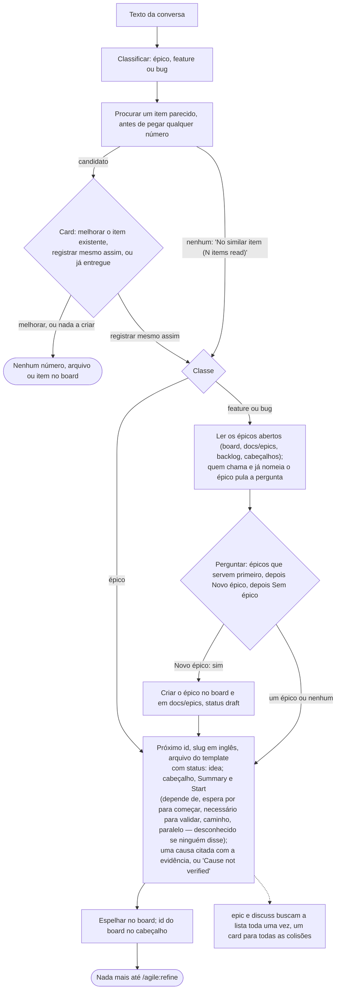

Com `--ticket <id>` o id é conferido antes de pegar qualquer número ou escrever qualquer arquivo: formato errado, épico ou discussão, ou um id já usado por um item (qualquer status, qualquer worktree) ou por uma branch é recusado e não escreve nada; fora isso o id substitui o próximo `F-<n>` / `B-<n>` (seção 5, "O id de um ticket como id do item").

### /agile:discuss


### /agile:epic
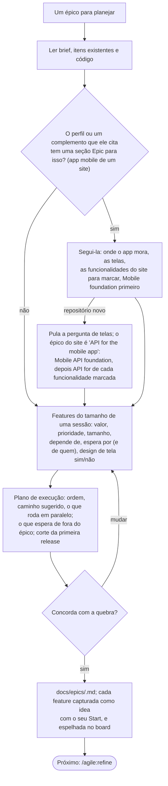

### /agile:refine
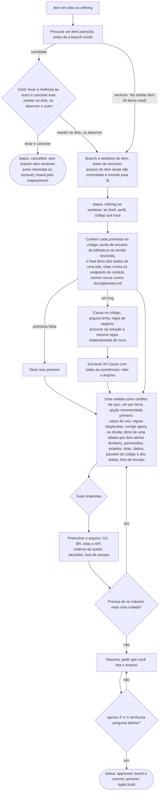

### /agile:screen
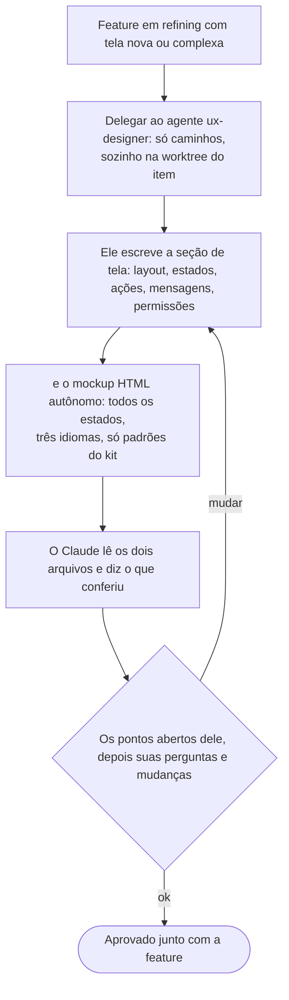

### /agile:build
```mermaid
flowchart TD
    A0["Achar a worktree do item pela branch (refs/heads/branch no git worktree list --porcelain);<br/>nenhuma: criar, branch sem -b quando já existe; dizer: Worktree of id: caminho [branch]"] --> A["Item aprovado, lido nessa worktree?"]
    A -->|já em building| A2["Retomar: branch, último commit wip, próximo passo do plano"]
    A2 --> D
    A -->|não| A1(["Parar: refinar e aprovar antes"])
    A -->|sim| B["Outro item em building ou validating?"]
    B -->|sim, sem --worktree| B1(["Parar e dizer qual"])
    B -->|sim, com --worktree| B2{"Os dois podem colidir? Confirmar o paralelo"}
    B2 -->|sim| S{"Start: todo arquivo de Waits on existe, todo item de Depends on está done,<br/>toda premissa sobre outro item é verdadeira no código de hoje?"}
    B -->|não| S
    S -->|uma checagem falha| S1(["Para: status igual, nada escrito; cada falha e quem resolve;<br/>premissa falsa: /agile:change id"])
    S -->|sim, com --worktree| C2["A worktree do item, criada no refinamento; trabalhar só lá"]
    S -->|sim| C["A worktree do item; status: building; plano em 8 passos"]
    C2 --> D
    C --> P0{"Cria projeto, contrato,<br/>mensagem entre módulos ou mudança de schema?"}
    P0 -->|sim| P1["system-design propõe corte, contratos, dados, riscos;<br/>architect revisa; as duas somente leitura, nada escrito"]
    P1 --> P2["O Claude confere as duas, escreve o plano a partir delas,<br/>registra o que aceitou em ## Decisions"]
    P2 --> C3
    P0 -->|não| C3{"Mockup aprovado junto com o item?"}
    C3 -->|sim| C4["O agente frontend implementa aquela tela e os testes dela,<br/>em primeiro plano e sozinho na worktree, depois de o Claude remover o que o plano lista;<br/>o Claude roda a suíte inteira, lê, conserta numa rodada, responde as paradas dele"]
    C4 --> D
    C3 -->|não| D["Código pelo perfil e pelas regras; testes por critério;<br/>um bug: um teste de regressão por ocorrência corrigida;<br/>uma feature que diz 'falha hoje' numa fixture nomeada:<br/>construir e rodar a fixture antes, mostrar a falha, depois o fix passando;<br/>só testes afetados; commits pequenos, branch conferida antes"]
    D --> E{"Premissa falsa ou critério impossível?"}
    E -->|sim| E1["Opções A/B → /agile:change"]
    E1 --> D
    E -->|não| F["Conferência pelo app host; tela nos dois temas"]
    F --> G["Encerrar app hosts que abriu; build sem avisos novos"]
    G --> H["Tabela de cobertura: critério → teste pelo caminho que o usuário usa;<br/>um método que nada chama é lacuna"]
    H --> I{"Mudança arriscada?"}
    I -->|sim| I1["/agile:review"]
    I1 --> J
    I -->|não| J["Roteiro de validação, no máximo 8 passos"]
    J --> K(["status: validating; você valida na tela"])
```

### /agile:review


### /agile:change
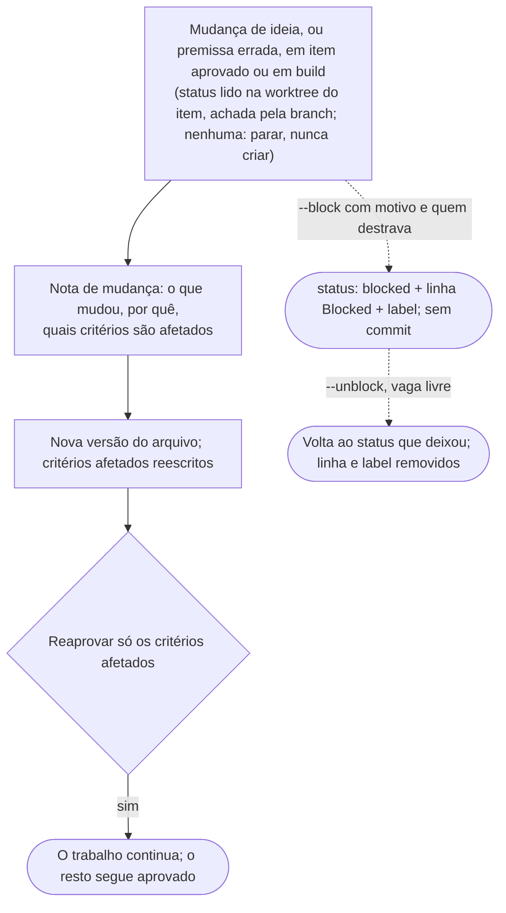

### /agile:script
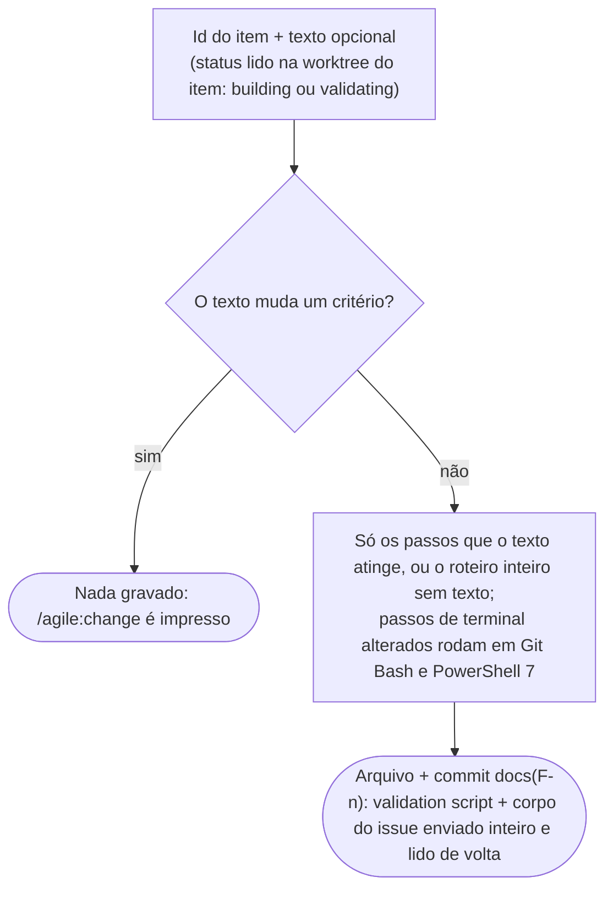

### /agile:ship


**`- Merge: pr` (#132).** O diagrama acima é o `direct`. Com `pr`, o primeiro `/agile:ship <id>` roda as mesmas verificações, o manual, os docs e o incremento de versão (e ainda precisa do seu "validado") e, em vez de fazer o merge: confere que o `origin` está no `github.com` e que o repositório aceita merge commit (senão para antes de enviar), escreve `## Delivery` e `status: done` na branch do item, envia a branch e abre um pull request cujo corpo traz o resumo, o roteiro de validação como checklist sem marcas, "Validated by the owner on <data> (chat)", a tabela critério → teste, as últimas linhas do gate, do scan e dos docs e `Closes #<n>`. Ele grava `PR: #<n> (<url>)` no arquivo do item, envia de novo e para com `PR #<n> open: merge it on GitHub when you are ready`. Digitar ship autorizou o PR, nunca o merge: esse clique é seu, de qualquer dispositivo. O item não ocupa vaga de WIP enquanto o PR espera (a branch dele diz `done` com uma linha `PR:`), então você pode começar o próximo; o início da sessão e o `/agile:status` mostram `Waiting on PR: F-n #<n> open | MERGED, close not run | closed without a merge | state unknown` (perguntado ao `gh` com limite de 5 s).

O segundo `/agile:ship <id>` (o arquivo tem uma linha `PR:`) pula as verificações e lê o PR: **mergeado** → o fechamento (um pull só fast-forward no checkout principal, `0 0` contra o remoto, o commit de merge não vazio, a branch remota apagada só se ainda existir, a worktree removida pelo `scripts/worktree.js`, o board fechado com Status Done lido de volta, a retro; nada é commitado na main, porque `done` e `## Delivery` vieram com o PR; com `Board: none` a linha do `backlog.md` é um commit de docs na main, que uma main protegida pode recusar); **aberto e limpo** → nada, ele diz para você fazer o merge; **aberto mas atrás ou em conflito** (o GitHub diz "atrás" só quando a regra da branch exige uma branch em dia; fora isso uma branch atrás da main sem conflito está limpa e você pode mesclar, e um conflito, como nos lugares da versão depois que outro item foi entregue, aparece como "dirty") → a atualização: a main entra na branch, o gate roda de novo, a versão é incrementada de novo a partir da da main e a branch é enviada, com o mesmo PR; **bloqueado pelo repositório** (uma revisão ou um check exigido) → ele diz o que o GitHub pede; **fechado sem merge** → o item volta para `validating` e a linha `PR:` é removida; `gh` inacessível → ele para, nada muda. O GitHub nunca deixa o autor aprovar o próprio PR: uma regra que exige aprovação precisa de bypass de admin, de uma segunda conta ou de um bot como autor. Azure Repos e esperar o CI para fazer o merge sozinho são itens futuros (#157, #156).

### /agile:retro
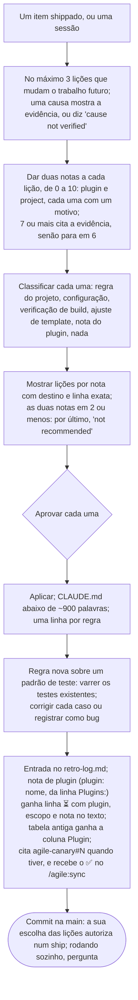

### /agile:pause
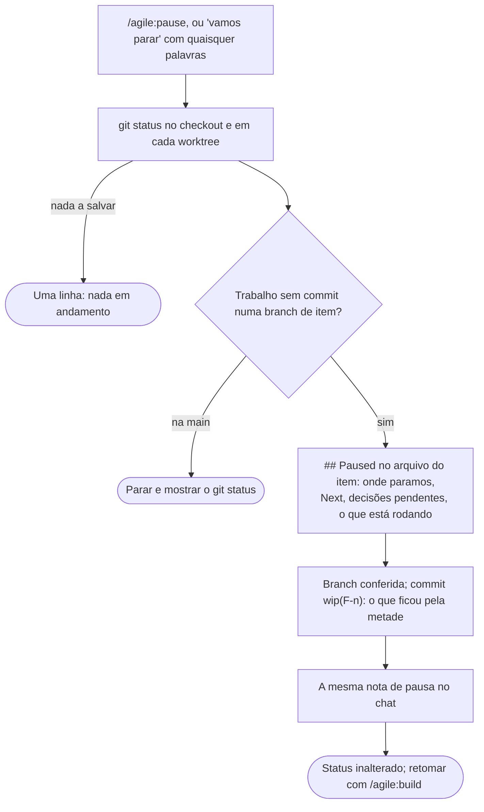

### /agile:status


### /agile:sync
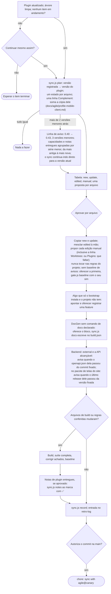

### /agile:identity
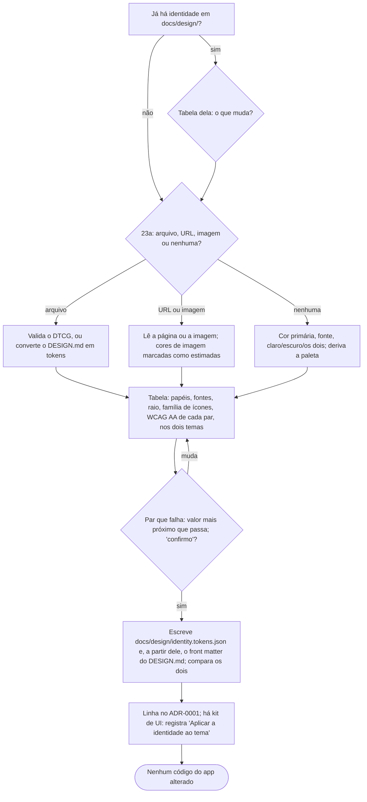

### /agile:autopilot
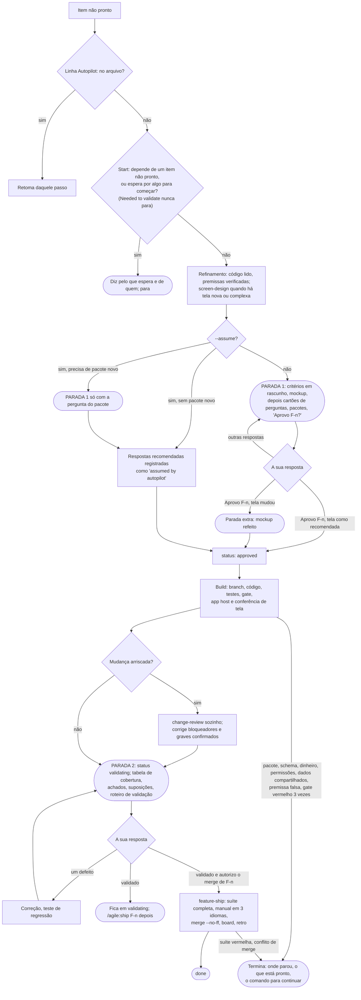

### /agile:version


### /agile:publish
```mermaid
flowchart TD
    A["Plano: checkout principal, na main, limpo, em dia com o origin;<br/>uma só versão nos projetos; a tag dessa versão livre (só num release: uma promoção ou um rollback de uma tag já liberada pula isto)"] -->|"uma conferência falha"| A1(["Para com o motivo, nada escrito"])
    A -->|ok| B["Mostra versão, tag anterior, itens desde ela, projetos e runtimes<br/>(digitar o comando é a autorização: sem pergunta)"]
    B --> C["dotnet publish -c Release por projeto e runtime;<br/>tira o appsettings.Development.json e o .xml; um zip cada"]
    C -->|"publish ou zip falha"| C1(["Para: nada commitado nem marcado"])
    C --> C2["O site de um app Hybrid: dotnet pack de Contracts e Shared na versão do release, em packages/<br/>(sem GITHUB_PACKAGES_TOKEN ou com origin fora do github.com: ficam de fora, com o motivo)"]
    C2 -->|"o pack falha"| C1
    C2 --> D["Escreve as notas em docs/releases/ (um arquivo por versão, com o link do glossário sob o título)"]
    D --> D2["Um head mobile: .aab Android assinado (assinatura em quatro variáveis de ambiente)<br/>e docs/releases/v<Versão>-store.md, o checklist das lojas"]
    D2 --> E["Commit na main (notas, checklist, linhas de glossário que as notas pediram), tag anotada com as notas, push da main e da tag"]
    E -->|"o push falha"| E1(["Diz o comando para repetir; commit e tag ficam"])
    E --> E2(["Com .github/workflows/deploy.yml: a tag enviada inicia o pipeline,<br/>que roda o mesmo Deploy command no destino dele (o plano avisou antes)"])
    E --> F{"origin no github.com e gh instalado?"}
    F -->|sim| G(["GitHub Release com as notas, sem binários"])
    F -->|não| H(["Uma linha dizendo por quê; a tag fica"])
    G --> I(["Pacotes enviados ao GitHub Packages com --skip-duplicate;<br/>uma falha diz o comando de push para repetir"])
    H --> I
    I --> J{"Um ambiente nomeado?"}
    J -->|não| J0(["Pronto: só o release"])
    J -->|sim| K["Confere o docs/infra.md: o ambiente, o comando dele (not declared: diz como declarar),<br/>a tag (um rollback precisa que ela exista), cada segredo definido (só o nome), pacotes Aspire = versão do CLI"]
    K -->|"uma conferência falha"| K1(["Para com o motivo, nada rodou"])
    K --> L["Roda o comando em raiz dos worktrees/deploy, solto na tag;<br/>saída salva fora do repositório; Check URL consultada até dar 200 (60 s)"]
    L -->|"saída diferente de 0, ou sem 200"| L1(["Nada registrado, nada revertido;<br/>dá o /agile:publish da versão registrada antes"])
    L --> M(["Registra v<x.y.z> (data) no docs/infra.md: commit na main e push"])
```

## 17. Glossário

Os termos técnicos que este manual usa, com a palavra em pt-BR que o Claude usa ao falar com você. Um projeto recebe este manual como `docs/agile/workflow.pt-BR.md`, então os significados ficam a um clique do texto; os termos do próprio projeto ficam no `docs/glossary.md` dele.

| Termo | Palavra em pt-BR | Significado |
|---|---|---|
| ADR (architecture decision record) | ADR (registro de decisão de arquitetura) | Um arquivo curto que registra uma decisão cara de reverter, com o motivo; o ADR-0001 guarda todas as respostas do quiz. |
| worktree | worktree (cópia de trabalho) | Uma segunda pasta do mesmo repositório, em sua própria branch, para que dois itens nunca dividam arquivos. |
| merge base | base do merge | O commit em que a branch do item saiu da principal; a revisão compara a partir dele. |
| gate | gate (portão) | Uma verificação automática que precisa passar antes de o trabalho seguir: build, testes, nenhum aviso novo. |
| warnings baseline | baseline de avisos | Os avisos de build aceitos até agora; o gate só falha nos novos. |
| acceptance criterion (AC) | critério de aceite | Uma frase Dado/Quando/Então que um teste comprova. |
| profile | perfil | A arquitetura escolhida no bootstrap (monolith, web-app, mobile...), copiada para `docs/agile/profile.md`. |
| Mermaid | Mermaid | Um formato de texto para diagramas que o board e o editor desenham. |
| OpenAPI | OpenAPI | Um documento JSON que descreve cada endpoint de uma API; testes e ferramentas o leem. |
| DocGen | DocGen | A ferramenta do próprio projeto que gera o `docs/architecture/` a partir do código. |
| DbContext | DbContext (contexto do banco) | A classe do Entity Framework que mapeia tabelas para código em um módulo. |
| .NET Aspire (app host) | .NET Aspire (host da app) | A ferramenta da Microsoft que sobe a app e seus serviços (banco, captador de e-mail) juntos no trabalho local. |
| MAUI | MAUI | O framework da Microsoft para um app móvel ou desktop em várias plataformas. |
| Blazor Hybrid | Blazor Híbrido | Telas web escritas uma vez e exibidas dentro de um app MAUI. |
| Velopack | Velopack | A ferramenta que empacota um app desktop e deixa as cópias instaladas se atualizarem sozinhas. |
| SmartScreen | SmartScreen | O aviso do Windows para um instalador sem assinatura de código, ou assinado mas ainda baixado por pouca gente ("aplicativo não reconhecido", com o nome do publicador). |
| code signing | assinatura de código | A assinatura de um certificado no instalador e nos arquivos do app: o Windows mostra o nome do publicador em vez de "Editor desconhecido", e a reputação do nome passa de uma release para a seguinte. |
| beta channel | canal beta | Uma segunda linha de atualizações de um app desktop, alimentada por cada merge, que só os PCs instalados pelo Setup.exe beta seguem. |
| AppImage | AppImage | Um app Linux num arquivo só: com `chmod +x`, roda sem instalar nada, e o Velopack o atualiza no lugar. |
| WSL (WSLg) | WSL (WSLg) | O Linux rodando dentro do Windows; o WSLg mostra as janelas dele na área de trabalho do Windows. |
| SemVer | versionamento semântico | O número de versão `MAJOR.MINOR.PATCH`: uma quebra de compatibilidade, uma feature, uma correção. |
| DTCG | DTCG (tokens de design) | O formato W3C para tokens de design, usado na identidade visual da app. |
| WCAG | WCAG | As diretrizes de acessibilidade; AA é o nível de contraste contra o qual a identidade é conferida. |
| CI pipeline | pipeline de CI | Um job que roda no servidor quando algo é enviado, como o deploy de uma tag. |
