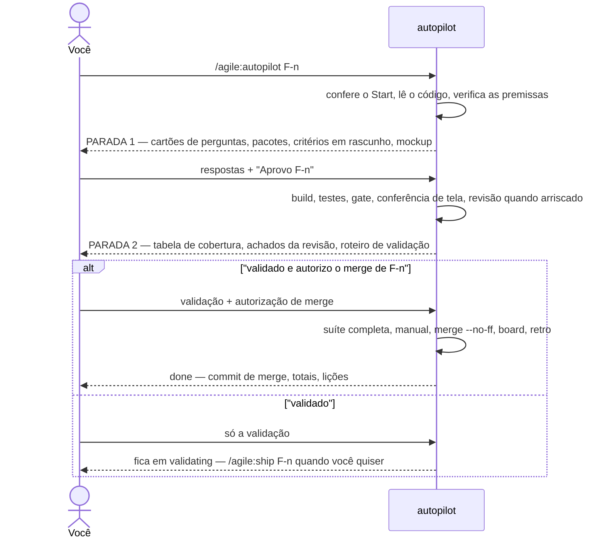
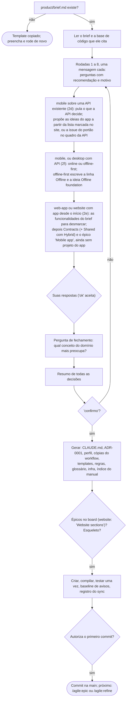
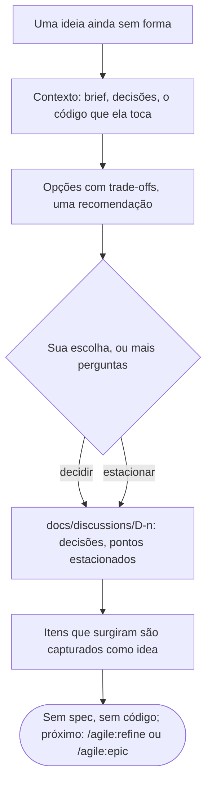
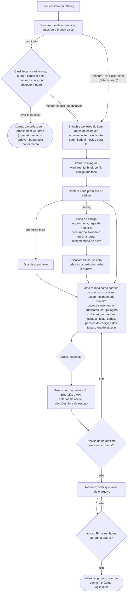
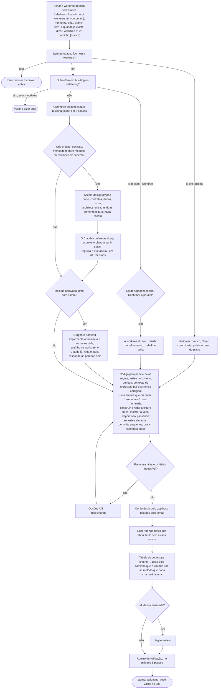
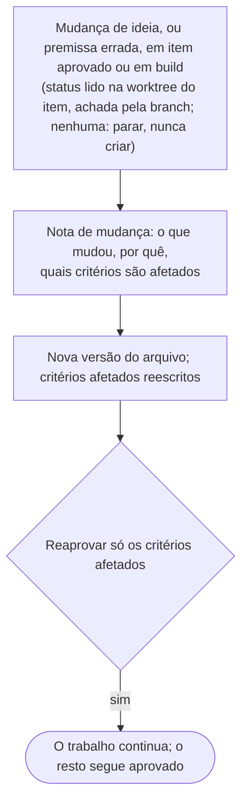
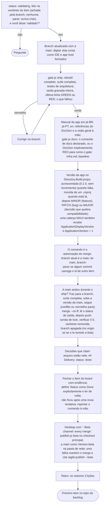
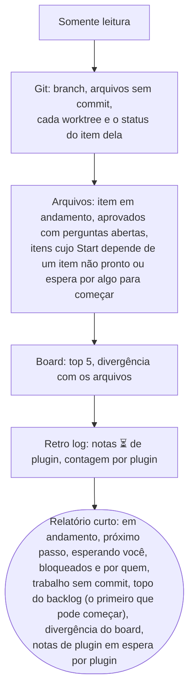
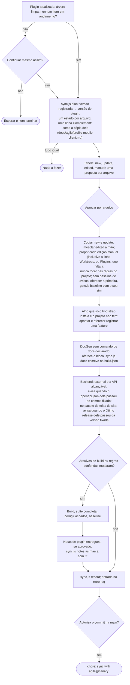
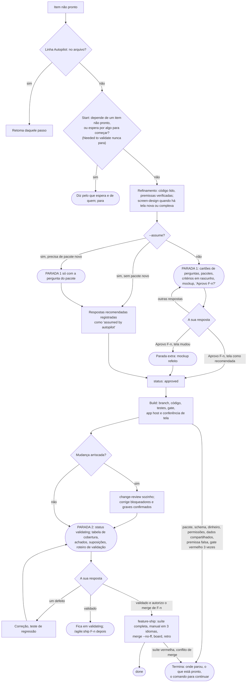

# agile@canary — Manual (pt-BR)

> Versão 0.21.0 (rascunho). English: [en](workflow.md).

Sumário
1. Conceitos em dois minutos
2. Papéis
3. Preparando um projeto
4. Quiz do bootstrap
5. Ciclo de vida de uma feature
6. Mudando de ideia
7. O arquivo da feature
8. Definição de pronto
9. Gates de qualidade
10. Board
11. Idiomas e o manual da app
12. Perfis de arquitetura
13. Sessões e pausas
14. Exemplos de workflow
15. Referência rápida
16. Fluxo de cada comando
17. Glossário

---

## 1. Conceitos em dois minutos

- **A conversa é onde as ideias amadurecem.** Você e o Claude conversam sobre épicos, features e casos de uso até ficarem claros. Nada é codificado enquanto a feature ainda está em discussão.
- **O disco é a fonte da verdade.** Toda decisão que importa termina num arquivo com cabeçalho `status:`. A conversa pode se perder; os arquivos, não.
- **Uma feature por vez.** Só uma feature fica em `building` ou `validating` a cada momento.
- **Três portões humanos.** A feature é **aprovada** antes do código, **validada na tela** antes do merge e **mergeada** só com o seu OK.
- **Código simples.** O perfil de arquitetura escolhido no bootstrap decide quanta estrutura cada módulo recebe. CRUD continua sendo uma fatia vertical fina.
- **Retorno rápido.** Os hooks compilam e testam só o que mudou. A suíte completa roda uma vez, no ship.

## 2. Papéis

| Você (dono do produto) | Claude (engenheiro) |
|---|---|
| Escreve o brief do produto | Conduz o quiz do bootstrap e registra as decisões |
| Propõe épicos e features na conversa | Registra no board, sem refinamento |
| Responde às perguntas de refinamento e aprova as features | Faz **todas** as perguntas numa rodada, cada uma com recomendação, depois de conferir o código |
| Valida cada feature na tela | Implementa, testa e entrega um roteiro de validação |
| Autoriza os merges (digitar `/agile:ship <id>` é a autorização) | Faz o merge, remove a branch e a worktree, atualiza o board e o manual da app, conduz a retro |

Subagentes são exceção: um revisor com contexto limpo para mudanças arriscadas, duas passagens somente leitura antes do código de um item mais pesado (`system-design` propõe o corte, os contratos e os dados; `architect` revisa essa proposta), dois papéis que produzem telas (`ux-designer` desenha, `frontend` implementa o mockup que você aprovou), ou trabalho paralelo que não mexe nos mesmos arquivos. São funções com nome, não uma cadeia de papéis por feature, e nenhuma delas fala com você: a conversa é sempre com o Claude, que lê o que o agente escreveu ou propôs antes de seguir. Um escritor por vez em cada pasta, e as duas passagens não escrevem nada.

**Modelos.** O modelo é escolhido por atividade, de propósito: a revisão independente, as passagens de desenho e arquitetura e o desenho de tela rodam no modelo mais forte, as buscas no código no menor, a implementação da tela e o trabalho mecânico em volume que os testes conferem num modelo intermediário, e a sessão principal no modelo que você escolher. Cada agente (`reviewer`, `system-design`, `architect`, `ux-designer`, `frontend`) declara o seu modelo padrão; o seu projeto troca esse modelo na seção "Models" do `CLAUDE.md` (pergunta 34 do quiz), nunca editando o plugin.

## 3. Preparando um projeto

1. Instale o plugin:
   ```
   /plugin marketplace add D:\dev\agile-canary
   /plugin install agile@canary
   ```
2. Crie um repositório vazio e escreva `product/brief.md` com o template de brief: problema, usuários, capacidades principais, restrições e o que fica fora do escopo.
3. Rode `/agile:bootstrap`.

## 4. Quiz do bootstrap

O `/agile:bootstrap` lê o `product/brief.md` e faz perguntas em **rodadas por tema**. Para cada pergunta, o Claude traz uma recomendação baseada no brief e questiona respostas que conflitem com ele. As decisões são tomadas juntos; nada é presumido.

Antes de escrever qualquer coisa, o Claude confere se a skill que carregou e o plugin instalado são a mesma versão. Quando diferem, ele avisa e copia da versão instalada: senão o projeto registra errado de onde vieram suas cópias, e o `/agile:sync` seguinte compara com o texto errado.

| Rodada | Temas |
|---|---|
| 1. Forma | Tipo de app (web, mobile, desktop, API), perfil de arquitetura, a tecnologia desktop (WinUI 3, Avalonia ou MAUI) e como um cliente desktop chega aos dados, **onde mora o backend de um app mobile** (pergunta 2d), as **seções de um site** (pergunta 2c, perfil `website`), **um app mobile desde o início ao lado de um site** (pergunta 2e), **online ou offline-first para um app mobile** (pergunta 2f), **um backoffice web para a equipe de um app mobile** (pergunta 2g), onde vai rodar |
| 2. Dados | Banco (o motor da casa quando há um sistema existente ao lado), multi-tenancy, apagamento, auditoria, dados pessoais e retenção |
| 3. Acesso | Autenticação (no `web-api`, pergunta 10a: como os consumidores da API se autenticam), RBAC, a ponte de identidade para os usuários de um sistema vizinho, entitlements/planos (limites de uso, trials, concessões por prazo, códigos promocionais), back office administrativo |
| 4. Integração | Mensageria (nenhuma, em processo, broker), serviços externos, armazenamento de arquivos e — quando alguma feature chama um modelo — o provedor do LLM e onde ele roda, o teto de custo e como ele é falsificado nos testes |
| 5. Experiência | Stack de UI, idiomas (padrão pt-BR, pt-PT e en), acessibilidade, a **identidade visual** (23a: um arquivo, um site, uma imagem ou três perguntas básicas), a biblioteca do design system, família de ícones, como um item é editado — ou, numa UI de conversa, em que língua ela responde, como uma proposta é corrigida e uma galeria de estados. O kit de UI e a galeria deixaram de ser pergunta: todo app com telas ganha um, construído a partir da identidade. O perfil `web-api` não tem telas: pula a stack de UI, a troca de idioma (21), a acessibilidade (22) e tudo sobre identidade visual e UI, e a pergunta 20 vale só para o texto que a API envia a pessoas |
| 6. Operação | Observabilidade, hospedagem, CI, board (GitHub ou Azure), ambientes, a conta de nuvem do cliente de cada um que não é local (pergunta 25a) e, para um Azure, a receita dele e, para `aca`, o teto mensal (pergunta 25b), para um app desktop de onde as cópias instaladas se atualizam (pergunta 26b) e, com uma pasta de rede, se cada merge vai para os testadores como beta (pergunta 26c), as convenções da casa quando o código vive ao lado de um sistema existente e — sempre — onde ficam as worktrees dos itens (`D:\wt\<repositório>`, ou `C:\` sem drive D:) |
| 7. Qualidade | Tempo máximo de teste por nível, expectativa de cobertura, testes de arquitetura, modelos por atividade, e evals quando alguma feature chama um modelo (qual modelo roda os casos, com ou sem o braço sem plugin) |
| 8. Documentação | Documentação técnica gerada do código (diagramas de entidades, dicionário de dados, mapa de rotas, diagrama de módulos e um catálogo de tools quando o app expõe ferramentas a um modelo), o prompt de sistema como arquivo versionado, e uma visão geral da arquitetura escrita à mão |

Quando alguma feature chama um modelo, o quiz trata isso como um sistema com decisões próprias, não como uma biblioteca: qual provedor e onde ele roda (um modelo local é o único lugar de onde os dados não saem), um teto de custo por usuário e um disjuntor global, um fake roteirizado para que tudo em volta do modelo continue testável, o prompt de sistema como arquivo versionado, e um catálogo de tools gerado dizendo o que cada uma alcança e com que permissão. O exemplo 14.14 mostra a rodada.

Para um site público (perfil `website`), a pergunta 2c vem logo depois do perfil: o Claude mostra o catálogo de 26 seções como uma lista numerada no chat, em dois grupos, **lançamento** (sobre mim, depoimentos, FAQ, cadastro de e-mail, produtos, contato e WhatsApp) e **depois** (serviços, portfólio, blog, galeria, busca, newsletter, PWA e o resto), todas marcadas. Você responde "ok" ou os números a desmarcar; desmarcar uma seção de que outra precisa (o cadastro de e-mail enquanto os materiais para download ficam) é dito uma vez, e a sua resposta vale. A base não está na lista, porque o site sempre tem: área de conteúdo, home, SEO básico, páginas 404 e de erro, política de privacidade e consentimento de cookies. Depois do quiz o board tem um épico "Website sections": a base primeiro, depois lançamento, depois o resto, uma ideia de feature por seção. Uma loja online nunca é seção: vira um épico próprio. No `website`, a pergunta 9b é sempre feita (cadastros são dados pessoais), a 12 e a 14 são fixas (papéis `Admin` e `Editor`, área admin no mesmo app), e o e-mail (19) não pode ser "nenhum" com a seção de cadastro ou de contato. O exemplo 14.23 mostra a pergunta.

Para uma app que é só uma API (perfil `web-api`), responder "só API" na pergunta 1 faz a pergunta 2 recomendar `web-api`. A pergunta 10a então pergunta, no lugar da 10, como os consumidores da API se autenticam, de múltipla escolha: **Identity bearer** (os usuários entram na própria API; o padrão para os clientes do próprio dono), um **IdP externo** (usuários e client credentials para clientes máquina; a API só valida o token) e **API key** (só clientes máquina, nunca um navegador ou app mobile, cujo código é público). Cada resposta gera só os esquemas, endpoints e políticas de que precisa, e a pergunta 11 (login social, MFA) só é feita com Identity bearer. O Claude não faz a 14 (não há back office), a 21 e a 22 (não há telas), nem as de identidade visual e UI, e a pergunta 29 não tem nível de UI. O exemplo 14.28 mostra a pergunta.

Para um app mobile (perfil `mobile`), a pergunta 2d pergunta onde mora o backend: **nesta solução** (o comportamento de hoje: `monolith` por padrão) ou **uma API existente em outro repositório** — um `web-app`, `website` ou `web-api` do agile (o repositório dele), ou qualquer API que publique um documento OpenAPI (a URL); a pergunta 1 oferece "mobile sobre uma API existente" para isso. Com a resposta externa o app é um repositório próprio, e o Claude pula o que a API já decide — a pergunta 3, a rodada de dados inteira, a 12, a 13 e a 14 —, lista essas em "Já está claro" e transforma a pergunta 10 em "o login da API", lido da API. O `CLAUDE.md` ganha a linha ``- Backend: external — <API name>, <repository or URL>; contract in `docs/api/backend-openapi.json`.`` e o ADR-0001 diz isso. Quando a API é um site do agile cujo `CLAUDE.md` nomeia o pacote `<App>.Shared`, as telas são MAUI Blazor Hybrid: o Claude lê isso do site, não pergunta de novo, e acrescenta ``- Shared screens: package `<App>.Shared` from the site's GitHub Packages feed``; senão são XAML. O exemplo 14.30 mostra o quiz e o que o bootstrap propõe; o exemplo 14.33 mostra com Hybrid.

Para um app mobile, a pergunta 2f vem depois da 2d, com qualquer resposta de backend: **online · offline-first**. A recomendação vem do brief: o app trabalha em campo, com conectividade ruim ou nenhuma, ou o brief diz "offline" ou "sem internet" → offline-first; senão online, que mantém o comportamento de hoje (uma funcionalidade ainda pode pedir offline na sua refinação). Offline-first cobre leitura e escrita: o `CLAUDE.md` ganha `- Offline: first` sob `Profile:`, o ADR-0001 uma linha, e a proposta do quadro ganha "Offline foundation" (o armazenamento local, a fila de escritas, o enviador, a interface de conectividade e o banner `OfflineStatus`) logo depois do kit de UI e da primeira funcionalidade; daí em diante todo arquivo de funcionalidade tem uma seção `## Offline`. Com uma API existente, o Claude lê o documento fixado: uma API agile cujas operações de escrita não têm o cabeçalho `Idempotency-Key` ganha uma proposta de issue "Idempotent writes for <App>" no quadro dela (com o seu sim; o Claude nunca escreve naquele repositório) e "Offline foundation" espera por ela; qualquer outra API que não declare isso deixa o app offline só para leitura, e o ADR-0001 diz isso. Voltar de offline-first para online não é oferecido; um projeto online liga o offline depois com uma ideia "Offline foundation". Exemplo 14.39.

Para um app mobile cujo backend está nesta solução, a pergunta 2g vem depois da 2f: **um backoffice web para a equipe: não · sim**. A recomendação vem do brief: ele cita pessoas que gerenciam os dados do app (equipe, back office, painel administrativo, "painel", "gestão", operadores) → sim; senão não. Sim escreve `- Backoffice: staff` sob `Profile:` no `CLAUDE.md`, não escreve `- Backoffice: none`, os dois acrescentam uma linha ao ADR-0001, e o sim põe "Backoffice foundation" no quadro logo depois do kit de UI; o esqueleto não muda. Com o backend em outro repositório (`Backend: external`) a 2g não é feita: o backoffice mora junto dos dados, no repositório da API, e o ADR-0001 diz isso. Um projeto `mobile` em andamento sem nenhuma das duas linhas recebe "Staff backoffice" do `/agile:sync` como capacidade que falta, com o item a capturar; `- Backoffice: none` encerra o aviso. O "Backoffice foundation" já inclui o registro de auditoria do que a equipe altera (sem pergunta extra; ele escreve `- Backoffice audit: on`); um projeto em andamento com `- Backoffice: staff` e sem linha `- Backoffice audit:` recebe "Staff audit log" do `/agile:sync` do mesmo jeito, e `- Backoffice audit: none` encerra esse aviso. Exemplos 14.54 e 14.63.

Para um app desktop, a pergunta 2f vem depois da 2a2 quando a 2a2 escolheu uma API, com a mesma recomendação e as mesmas escritas (a linha `- Offline: first`, uma linha no ADR-0001, "Offline foundation" depois do UI kit e da primeira feature). Com acesso direto ao banco ela não é feita, e o ADR-0001 diz que offline-first precisa de uma API (um armazenamento SQLite já é local). Exemplo 14.43.

Para um site que precisa de um app mobile desde o primeiro dia, a pergunta 2 pesa antes a forma do brief: quando a API é a principal consumidora ou há várias áreas de negócio, ela recomenda `mobile` (sobre `monolith`, ou `modular-monolith`); quando o produto é um site com telas sobre dados simples, ou um site público, ela recomenda `web-app` ou `website` e vem a pergunta 2e, logo depois da 2 (depois da 2c no `website`): **um app mobile desde o início: não · sim, MAUI Blazor Hybrid · sim, MAUI XAML**. A recomendação vem do brief: nenhum app citado → não; um app citado → Hybrid, para que as telas do site já nasçam onde o app vai reaproveitá-las. O app mora neste repositório e nesta solução; um app em repositório próprio continua começando pelo bootstrap dele (pergunta 2d). Com sim, o Claude lista as funcionalidades do brief numeradas na mesma mensagem, agrupadas como o brief agrupa e todas marcadas (nunca uma seção pública de um `website`); você responde "ok" ou os números para desmarcar. O bootstrap então acrescenta `<App>.Contracts` e, com Hybrid, `<App>.Shared` (uma Razor Class Library cujos componentes não têm `@page` nem render mode, com textos em todos os idiomas do app), os dois cobertos pelos testes de arquitetura e de layout; ele **não** acrescenta os projetos do app, a linha `Complement:` nem um segundo `<Version>`: isso vem com o primeiro item do épico, então o `/agile:sync` nunca pede a versão do app antes de o app existir. A proposta do quadro ganha um épico "Mobile app" (`docs/epics/mobile-app.md`, com a lista que você aprovou escrita inteira) cujas ideias são "Mobile foundation" primeiro e depois um "<X> on mobile" por funcionalidade marcada; a ideia do próprio site para cada funcionalidade marcada diz que a tela dela é um componente no `Shared` (Hybrid) e a regra ou consulta uma classe em `Features/`, e com Hybrid o kit de UI também mora no `Shared`. O ADR-0001 registra a resposta. "Não" deixa o bootstrap exatamente como era. Exemplo 14.34.

Quando o brief cita uma base de código existente para reaproveitar e você dá acesso a ela, o Claude lê esse código (nunca edita) e usa o que encontra como motivo das recomendações. Depois da rodada 8 vem uma **pergunta de fechamento** — "qual conceito do domínio mais preocupa você, ou o quiz não tocou?" — porque o vocabulário central de um domínio (uma taxonomia, um modelo de entitlement, uma regra de pontuação) raramente cabe numa lista fixa de perguntas. O que ela levantar é decidido como qualquer pergunta do quiz e registrado na ADR-0001.

Saídas, todas em inglês:
- `CLAUDE.md` — curto (abaixo de ~900 palavras, sem nenhum comentário do modelo), apontando para um perfil.
- `docs/decisions/ADR-0001-foundation.md` — cada decisão do quiz, com o motivo.
- `docs/agile/profile.md` — cópia do perfil de arquitetura escolhido.
- `docs/agile/workflow.md` e `docs/agile/workflow.pt-BR.md` — este workflow nos dois idiomas, e `docs/agile/templates/` — os templates, copiados para o projeto.
- `docs/glossary.md` — termos de negócio e os identificadores em inglês, e os termos técnicos que o Claude usa em relatórios e revisões (as severidades da revisão, por exemplo) com a palavra em pt-BR que ele usa ao falar com você. As duas tabelas terminam numa coluna `Meaning (pt-BR)`, o significado escrito em português: o único texto de um projeto que não é inglês. Termo técnico é o que você pode não conhecer: nome de produto ou serviço (Bicep, ACR), sigla, protocolo, padrão, biblioteca; termo de negócio, palavra comum, identificador, caminho ou comando não é. A skill que escreve um documento acrescenta as linhas que faltam no mesmo passo e no mesmo commit: `/agile:bootstrap` para o ADR-0001 e o `docs/infra.md`, `/agile:ship` para as mudanças do item em `docs/` (fora de `docs/manual/`), `/agile:publish` para as notas de release. Cada um desses documentos (infra, ADRs, arquivos de item, discussões, épicos, notas de release) tem, logo abaixo do título, a linha `Technical terms: [glossary](../glossary.md)`; o manual da app para o usuário final não tem. Um projeto anterior a isso recebe a coluna, as linhas que faltam e as linhas de link propostas pelo `/agile:sync`, escritas só com o seu OK. Exemplo 14.45.
- `docs/infra.md` — como rodar localmente, quais ambientes existem de fato (`provisioned` ou `planned`), os segredos esperados (só os nomes), para cada ambiente o comando que o implanta, a URL de checagem e a versão implantada lá (escrita só pelo `/agile:publish`), para um app desktop a fonte de atualização dos apps instalados, os passos de release e os tempos medidos de build e testes. Atualizado no ship quando algo disso muda.
- `.github/workflows/deploy.yml` e `.github/scripts/agile-deploy.js` — só quando o `origin` está no github.com e um ambiente que não é `local` declara um comando de deploy: o pipeline que implanta uma tag `v<Version>` enviada, por esse mesmo comando (veja "O pipeline de deploy" abaixo).
- Esqueleto da solução conforme o perfil, já com i18n e os projetos de teste.
- `docs/design/identity.tokens.json` e `docs/design/DESIGN.md` — a identidade visual do app (pergunta 23a), para todo app com telas. Os tokens seguem o formato de Design Tokens do W3C (DTCG 2025.10) e são a fonte dos valores: cores por papel em claro e escuro, tipografia, raio dos cantos, e a família de ícones, a origem (arquivo, URL, imagem ou derivada) e a data em `$extensions.agile`. O `DESIGN.md` (o formato de arquivo de design do Google) tem os mesmos valores no front matter YAML, gerado a partir dos tokens, seguido da sua prosa sobre o porquê e o onde; regerar mantém a prosa. Você pode dar um arquivo (tokens ou um `DESIGN.md`), a URL de um site, uma imagem (um logo, uma prancha de marca) ou nada: três perguntas (cor primária, fonte, claro, escuro ou os dois) derivam uma identidade completa. Uma URL ou uma imagem é lida pelo Claude, que mostra uma tabela antes de escrever qualquer coisa: cores por papel (as de uma imagem vão marcadas como estimadas), fontes, raio, família de ícones, e o contraste WCAG 2.2 AA de cada par frente/fundo nos dois temas; um par que falha traz a razão e o valor mais próximo que passa, e você decide. Nada é guardado antes de você dizer "confirmo". O plugin nunca escreve o tema do app: quem escreve é o item do kit de UI, a partir desses tokens, e um teste do perfil compara os dois. Os mockups de tela tiram cores, fontes e raio desse mesmo arquivo.
- `docs/architecture/` — quando a rodada 8 escolheu algum documento: o `tools/<App>.DocGen` gera, por módulo, um schema DBML lido num visualizador dbdiagram (`entities: "mermaid"` no `docgen.json` dá um diagrama ER, que renderiza no board mas fica ilegível a partir de uma dúzia de tabelas) e um dicionário de dados (do modelo EF), mapa de rotas por área (do documento OpenAPI que o teste de integração de `/openapi/v1.json` grava em `docs/api/`) e diagrama de módulos (das referências entre projetos, em Mermaid); o gerador referencia o provedor EF Core do próprio app (pergunta 5: PostgreSQL, SQL Server ou SQLite) e o chama por reflexão, então documenta os tipos de coluna reais e o schema padrão (`public`, `dbo`, ou nenhum no SQLite) mesmo para um `DbContext` sem fábrica de design-time; um contexto com fábrica é montado por ela em vez disso, então os nomes seguem o banco (snake_case, por exemplo) — a saída é a mesma nos dois casos; quando a rodada 8 também escolheu o catálogo de ferramentas (pergunta 37), o `tools.md` lista cada ferramenta que o app oferece a um modelo — a descrição que o modelo recebe, o schema de entrada, o que ela alcança, as permissões que exige, se escreve e se pergunta antes — e o `--check` reprova quando uma ferramenta está sem descrição, sem permissões ou sem alcances, ou quando duas chegariam ao modelo com o mesmo nome. O bootstrap declara o gerador como o **comando de docs** do projeto no `.claude/agile/build.json` (`{ "docs": { "command": "dotnet run --project tools/<App>.DocGen", "check": "… -- --check", "paths": ["docs/architecture/"] } }`), então a partir da 0.0.72 o `/agile:ship` regenera e confere por aquele único passo genérico (seção 9, "Um comando de docs declarado") em vez de um passo próprio; o `--check` reprova quando estão desatualizados. Um projeto que ganhou o DocGen antes da 0.0.72 não declara nada, e o ship ainda o roda: o gate acha o único `tools/*.DocGen` e o roda como comando de docs **implícito**, dizendo `implicit DocGen docs command: declare it with /agile:sync` — assim nenhuma janela deixa o mapa do código desatualizado, e o `/agile:sync` oferece o bloco uma vez. Opcionalmente uma visão geral de uma página escrita à mão (C4 contexto e containers), na qual o gerador nunca mexe: só arquivos que carregam a marca `Do not edit` dele são reescritos ou apagados; um módulo ou sistema externo que uma feature adiciona é escrito ali à mão no ship.
- Os primeiros épicos no board, se o brief já os citar.

## 5. Ciclo de vida de uma feature

```mermaid
stateDiagram-v2
    [*] --> idea: /agile:idea
    idea --> refining: /agile:refine
    refining --> approved: você diz "aprovo F-n"
    idea --> cancelled: duplicata, escolhida no card de itens parecidos
    refining --> cancelled: duplicata, escolhida no card de itens parecidos
    cancelled --> [*]
    approved --> building: /agile:build
    building --> validating: tabela de cobertura + roteiro de validação
    validating --> building: um ajuste que você reportou
    validating --> done: você diz "validado", depois /agile:ship (digitar autoriza o merge)
    done --> [*]
    note right of approved: gate 1 — aprovada
    note right of validating: gate 2 — validada na tela
    note right of done: gate 3 — /agile:ship digitado = merge autorizado
```

| Status | O que acontece | Quem muda |
|---|---|---|
| `idea` | Registrada a partir da conversa com `/agile:idea`. Título, 2 ou 3 linhas e como ela começa (`## Start`): do que depende, pelo que espera para começar, o que só a validação precisa (nunca bloqueia) e de quem, o caminho sugerido, o que pode rodar ao lado. O que ninguém disse fica escrito como desconhecido. Uma causa citada vem com a evidência (o comando e a linha da saída que a mostra); sem ela, o `## Start` diz `Cause not verified: measure it at /agile:refine`, com o sintoma visto. Para uma feature ou bug, antes de criar qualquer coisa o Claude pergunta onde ela mora: uma pergunta com o épico que ele sugere primeiro (um épico aberto cujo objetivo serve, com o motivo), depois "Novo épico" e "Sem épico"; um épico novo só é criado depois do seu sim, no board e como `docs/epics/<slug>.md` (status `draft`). O `/agile:epic` e um texto que já é um épico não perguntam nada. | Claude |
| `refining` | `/agile:refine` (uma resposta que transforma algo num item para depois vira ideia pelo mesmo procedimento do `/agile:idea`: template, board, próximo número; uma resposta que junta o escopo de um item aberto já existente a este, em vez disso, primeiro confere aquele item — `git worktree list` procurando a pasta dele e o arquivo ou issue dele para o `status`. Qualquer status além de `idea` em qualquer lugar bloqueia a junção automática: o Claude nomeia o status e o caminho da worktree do outro item e você decide, juntar mesmo assim (registrado em `## Decisions` com o motivo) ou descartar a junção e deixar o outro item intocado. Ainda `idea` em todo lugar, sem worktree: a junção acontece como antes, sem pergunta nova): antes de escrever qualquer coisa, o Claude cria a branch do item e a worktree dele — uma pasta fora do repositório, cujo caminho completo ele te diz — e tudo o que este item produz (o arquivo da feature, a causa de um bug, o mockup) é escrito ali, na branch dele; um arquivo de item ainda não commitado é movido para lá e deixa de existir onde foi criado. Nenhum checkout é trocado, então uma sessão que está na pasta de outro item não consegue mais deixar os documentos deste na branch daquele. Depois o Claude lê o código relacionado, confere no código de hoje cada premissa sobre como algo já funciona (o arquivo de um item antigo não é prova: um bug posterior pode ter mudado aquilo), confere no código ou na documentação da biblioteca cada premissa sobre como ela guarda ou protege dados, uma premissa de performance de consulta com `EXPLAIN` no test container, e uma premissa que a documentação e o código da biblioteca deixam em aberto reproduzindo-a num projeto descartável contra um test container (fonte lido cru, nunca resumido) — uma premissa de que nada usa um recurso é conferida pelo efeito, não pelas chamadas de um helper. Um bug cuja causa só existe na branch de um item sem merge diz isso em `## Cause` e espera esse merge antes de criar a própria branch. Depois o Claude faz todas as perguntas abertas numa rodada, como cartões de quiz agrupados por tema (regras, permissões, estados, telas, dados, pacotes, escopo) com a opção recomendada primeiro; num terminal as mesmas perguntas vêm como lista numerada. A rodada inclui os pacotes novos de que o item precisa, para o código **e para os testes**, com as versões conferidas no registro naquele momento, para que o seu sim seja dado uma vez e não no meio do build. Você responde; no máximo mais uma rodada. Uma lista que você aprovou ou editou no chat (um catálogo, um conjunto de opções, escolhas numeradas) é escrita inteira na seção `## Approved list` do item, na ordem aprovada e com as suas edições aplicadas, e o arquivo nunca diz "a lista mostrada na refinação"; antes de pedir a sua aprovação o Claude relê o arquivo atrás de frases que mandam o leitor para o chat e cola a lista onde achar uma. Um item cuja saída é visual (um diagrama, uma página gerada) é prototipado e visto em tamanho real no visualizador de destino antes de você aprovar. Um item de autenticação ou de vínculo de contas recebe a revisão independente (`/agile:review`) neste arquivo, antes da sua aprovação. Uma tela nova ou complexa é desenhada pelo agente `ux-designer` (`/agile:screen`), que nunca fala com você: o Claude lê o que ele escreveu e faz como suas as perguntas abertas dele. O arquivo da feature é commitado na branch do item, dentro da worktree dele. | Claude |
| `approved` | Você aprova o arquivo da feature depois de lê-lo. Perguntas em aberto impedem a aprovação. **Portão 1.** | Você |
| `building` | `/agile:build`: primeiro acha a worktree do item pela branch e diz `Worktree of <id>: <caminho> [<branch>]` (`(created now)` quando um item antigo não tinha); o status e a checagem de árvore limpa são lidos ali, nunca no checkout principal, e continua nessa worktree — código e testes do que mudou. Quando o item cria um projeto, um contrato de API, uma mensagem entre módulos ou muda o schema, duas passagens somente leitura rodam antes do plano: o `system-design` propõe o corte, os contratos, os dados e os riscos, e o `architect` revisa essa proposta contra o perfil e as conferências que o seu projeto realmente tem. Elas não escrevem nada; o Claude confere as duas nos arquivos, escreve o plano a partir delas e registra em `## Decisions` o que aceitou e o que descartou. Um CRUD fino não passa por nenhuma das duas. Quando o item tem um mockup que você aprovou, a tela e os testes dela são escritos pelo agente `frontend`, sozinho nessa worktree; depois o Claude lê cada arquivo que ele citou, roda o gate e cita os números reais, e responde as paradas dele ou te traz as que são decisão (um padrão que falta no kit, um contrato que não existe). Domínio, API e migrações continuam com o Claude. Antes de copiar um padrão já existente, o Claude confere se há um item aberto para removê-lo e, se houver, deixa você escolher entre seguir o padrão agora ou registrar a cópia como dívida. Antes da tabela de cobertura o Claude abre a tela pelo app host: os testes não enxergam como a biblioteca de componentes desenha os seus estados (um link ativo sem contraste, um link que não é link). As conferências por teclado ficam no seu roteiro de validação. O Claude nunca muda estado (cadastros, requisições contadas, dados) num app host que ele não abriu: pergunta antes, ou usa dados que ninguém mais usa e diz quais. Uma tela atrás de login não é conferida pelo Claude, cujas regras proíbem digitar senha: ele diz isso, confere o que não pede conta (a rota, o 401, o redirecionamento) e põe o fluxo logado no seu roteiro de validação. Só uma feature pode estar aqui. | Claude |
| `validating` | O Claude entrega um roteiro de validação (até 8 passos). Você testa na tela. Um passo que precisa de terminal traz o comando para Git Bash e para PowerShell 7, com a saída esperada e como repetir, e o Claude já rodou os dois. Um passo que uma correção deixou errado se corrige com `/agile:script <id> <o que mudou>`, sem nota de mudança. **Portão 2.** | Você |
| `done` | `/agile:ship`: suíte completa, versão da app incrementada, merge — digitar o comando é o seu OK (**Portão 3**), board e manual da app atualizados, retro. | Claude |
| `cancelled` | Uma saída, não uma etapa: só a partir de `idea` ou `refining`, só como duplicata, escolhida no card que o `/agile:refine` mostra ao achar um item parecido (abaixo). O arquivo fica com `status: cancelled` e a linha `Duplicate of <id> (<data>): <onde a melhoria foi parar>`, então o número nunca é reaproveitado; o status da sessão e o início do backlog o ignoram. No GitHub o issue é fechado como duplicata do outro e o item do projeto é arquivado (nunca Done: isso mostraria trabalho não entregue como entregue); no Azure Boards o estado é `Removed`; sem board a linha de `docs/agile/backlog.md` é riscada. | Você, no card |

**A linha do item.** `/agile:refine`, `/agile:build`, `/agile:ship`, `/agile:change`, `/agile:review`, `/agile:autopilot`, `/agile:screen`, `/agile:script` e `/agile:pause` começam nomeando o item em que atuam: `F-12 — Export the monthly report as CSV [idea]` (id, título, status), antes de qualquer checagem e antes de criar ou mudar qualquer coisa; assim um id errado aparece na hora, mesmo que uma checagem pare o comando em seguida. O título e o status vêm do arquivo do item (a cópia da worktree quando há uma), nunca do board, então funciona com `Board: none`; um id sem arquivo imprime `F-99 — no item file found` e o comando segue com a própria regra para item inexistente. É escrita uma vez por execução: o `/agile:autopilot` imprime no início, não de novo a cada fase, e o `/agile:build` mantém a linha `Worktree of ...` logo abaixo. O `/agile:pause` imprime uma linha por item que commita. `/agile:status` e `/agile:idea` não precisam: um lista todos os itens com o status, o outro termina com o id e o título do item novo.

**Itens parecidos.** Antes de o `/agile:idea` pegar um número, e antes de o `/agile:refine` criar uma branch, o Claude lê todos os itens (`docs/features`, `docs/bugs`, o arquivo do item em cada worktree, onde um item em andamento guarda o status atual, e o board, abertos e fechados, `done` e `cancelled` incluídos) e julga quais cobrem o mesmo assunto com outras palavras. Nunca por regra de palavras-chave. Sem candidato, diz `No similar item (<N> items read).` e segue. Com candidatos (no máximo 3, um motivo cada) faz um card, a ação recomendada primeiro. Para melhorar o item existente: um `idea` ganha `Added <data>: <texto>` no resumo; um item `refining` recebe o texto como pergunta aberta na própria worktree (o Claude diz o caminho); um item `approved`, `building` ou `validating` não é tocado e o Claude imprime `/agile:change <id>` com o texto para você digitar; um item `done` é informado como `Already delivered in <id>`, e você não cria nada ou cria o novo item com uma linha ligando o `done`. No `/agile:refine` o card tem três ações: levar a melhoria ao outro item e cancelar este (um refinamento retomado também perde a worktree e a branch), manter os dois (uma linha em `## Decisions`) ou absorver o outro neste (a checagem de status e worktree da seção 14.18). `/agile:epic` e `/agile:discuss` buscam uma vez para a lista toda e mostram todas as colisões em um card; `/agile:autopilot --assume` termina com a pergunta, pois duplicata é decisão sua.

Pequenas correções encontradas na validação são feitas na hora, sem sair de `validating`.

Antes de entregar o roteiro de validação, o Claude mostra uma tabela **critério → teste**: cada critério de aceite aponta para os seus testes, ou fica explicitamente para o roteiro de validação. O teste precisa passar pelo caminho que o usuário usa (página, endpoint, o handler que chama o código): um método escrito para um critério que nada na app chama é uma lacuna, mesmo que o seu próprio teste passe. Quando um efeito sai da requisição (um e-mail ou um evento passa a ir por fila), todo teste que o conferia é relido: "nada foi enviado" passa de graça quando nada é enviado na hora. Um teste instável é reproduzido num laço (build limpo antes de cada rodada) e a correção é provada pelo mesmo laço, N verdes seguidos; um teste de saída gerada conta cada seção, exatamente uma vez.

### O mesmo caminho numa execução só: `/agile:autopilot`

O `/agile:autopilot <id>` percorre esse caminho inteiro, de `idea` a `done`, e para para você **exatamente duas vezes**. Os três portões continuam lá: a primeira parada é o portão 1, a segunda reúne os portões 2 e 3, e você escolhe se passa pelos dois numa mensagem só.



| Parada | O que você recebe | Como você responde | O que vem depois |
|---|---|---|---|
| 1 — perguntas | Todas as perguntas em aberto como cartões (a opção recomendada primeiro), os pacotes novos com licença e versão, os **critérios de aceite em rascunho** escritos a partir das opções recomendadas e, para um item com tela nova ou complexa, o **mockup HTML** feito com as mesmas opções. O último cartão: "Aprovar F-n com estas respostas e critérios?" | Escolha as respostas e "Aprovo F-n". Qualquer outra resposta é uma rodada de acompanhamento, nunca uma aprovação. | O arquivo do item é preenchido com as suas respostas e vai para `approved`; o build começa na mesma execução. Se uma resposta de tela difere da recomendação, o mockup é refeito e a execução para mais uma vez, só para a tela. |
| 2 — validação | Arquivos, testes com números reais, a tabela critério → teste, os achados do revisor (ele roda sozinho quando a mudança é arriscada: autenticação, permissões, dados, contratos, dinheiro, mais de ~400 linhas), o que o `--assume` assumiu, o roteiro de validação. | "validado e autorizo o merge de F-n" — ou só "validado" — ou o defeito que você achou. | Com o merge nomeado: suíte completa, manual da app nos três idiomas, `merge --no-ff`, board, retro, `done`, sem perguntar de novo. Só "validado": o item fica em `validating` até o `/agile:ship F-n`. Um defeito: corrigido, e a parada 2 de novo. |

O `--assume` pula a parada 1: cada pergunta recebe a opção recomendada, registrada em `## Decisions` como `assumed by autopilot` com o motivo, e a flag vale como a sua aprovação daquele item. Ele nunca assume um pacote novo — quando o item precisa de um, a parada 1 acontece só com essa pergunta. O mockup, quando houver, aparece então na parada 2.

Algumas decisões continuam suas mesmo dentro de uma execução. A execução **termina** — nada é desfeito — e diz onde parou, o que está pronto, o que falta e o comando para continuar, quando encontra: um pacote que você não aprovou na parada 1, uma mudança de schema fora do arquivo, dinheiro, permissões, dados compartilhados, credenciais, uma tela atrás de login, o contrato de outro módulo, uma premissa falsa ou um critério impossível, o gate vermelho três vezes, um bloqueador que não dá para corrigir dentro do item, a suíte vermelha no ship ou um conflito de merge.

A execução mantém uma linha `Autopilot:` no arquivo do item (`refined`, `stop 1`, `approved`, `built`, `reviewed`, `stop 2`, `shipping`). O `/agile:autopilot F-n` retoma dessa linha, então uma sessão nova ou um contexto resumido não perde nada.

### Etapas opcionais

| Comando | Quando | Resultado |
|---|---|---|
| `/agile:discuss` | Uma ideia com vários caminhos possíveis, ou dúvidas que só você responde | `docs/discussions/D-<n>-<slug>.md` (opções, decisões, pontos adiados) e os itens registrados como `idea` |
| `/agile:epic` | Um épico novo para planejar | `docs/epics/<slug>.md` com features priorizadas, cada uma cabendo numa sessão, do que cada uma depende e pelo que espera, um plano de execução (ordem, caminho sugerido, o que roda em paralelo) e o que o épico espera de fora; cada feature registrada como `idea`. Num `web-app`/`website`, um épico de app mobile segue o complemento `mobile-client` (seção 12) |
| `/agile:screen` | Uma feature em `refining` com tela nova ou complexa | O agente `ux-designer` escreve a seção de tela detalhada no arquivo da feature e um mockup HTML (todos os estados, três idiomas; uma cor nova só depois de calcular o contraste dela em toda superfície, nos dois temas), sozinho na worktree do item; o Claude lê os dois, faz como suas as perguntas abertas do agente, e você aprova a tela junto com a feature. No build, o agente `frontend` implementa esse mockup aprovado e os testes daquela tela. As cores, fontes e raio do mockup vêm de `docs/design/identity.tokens.json`; num projeto sem esse arquivo, os pontos em aberto do agente avisam e o mockup usa os padrões da biblioteca |
| `/agile:review` | Uma mudança arriscada (autenticação, permissões, isolamento por tenant, dados, contratos, dinheiro, ou mais de ~400 linhas), antes da validação | Achados por gravidade de um revisor só de leitura e com contexto limpo; os bloqueadores confirmados são corrigidos antes de você validar |
| `/agile:publish` | Depois de um ou mais ships, quando você quer a versão do app que está na `main` como um release | Um pacote `dotnet publish` do(s) projeto(s) publicável(is) do perfil em `artifacts/publish/v<Versão>/`, com um `.zip` cada (um head mobile: um `.aab` Android assinado; o site de um app Hybrid: também os dois pacotes NuGet dele), as notas em `docs/releases/v<Versão>.md` (e `v<Versão>-store.md`, o checklist das lojas, para um head mobile), uma tag anotada `v<Versão>`, as duas enviadas ao remoto e um GitHub Release com as notas. Digitar o comando é a autorização. Com um ambiente nomeado (`/agile:publish production [v<x.y.z>]`), ele depois implanta esse release pelo comando que o `docs/infra.md` declara para o ambiente (veja "Fazendo deploy" abaixo); `/agile:publish <ambiente> --park` e `--resume` estacionam e trazem de volta um ambiente Azure Container Apps (veja "Estacionando um ambiente Azure Container Apps"). `/agile:publish --beta` só refaz o beta da `main` de um app desktop quando o passo beta do ship falhou (veja "Atualizações do desktop") |

**Publicando um release: `/agile:publish`.** Um ship sobe o `<Version>` do app e faz o merge; não gera nada que você possa entregar a alguém. O `/agile:publish` transforma a versão que já está na `main` em um release. Ele roda no checkout principal e para sem mudar nada, a menos que a `main` esteja limpa, em dia com o `origin` e a tag `v<Versão>` não exista nem aqui nem lá. O Claude mostra o plano uma vez (versão, tag anterior, os itens que entraram desde ela, os projetos e os runtimes) e segue: digitar o comando é a autorização para o commit das notas, a tag, o push e o GitHub Release. Ele não roda os testes de novo (o ship rodou a suíte completa sobre o que a `main` tem); um erro de compilação ainda derruba o `dotnet publish -c Release` (ou o `dotnet pack`), e então nada é commitado nem marcado. O site de um app Hybrid em repositório próprio também empacota os dois projetos empacotáveis dele, `<App>.Contracts` e `<App>.Shared`, nessa mesma versão e os envia ao feed GitHub Packages dele depois da tag (`--skip-duplicate`, então repetir é seguro), lendo o token de `GITHUB_PACKAGES_TOKEN`; sem o token, ou com um `origin` fora do github.com, os pacotes ficam de fora com esse motivo e o site é publicado do mesmo jeito.

O que é empacotado segue o perfil: `web-app` e `website` → `<App>.Web`; `monolith`, `modular-monolith` e `web-api` → `<App>.Api`; `desktop` → o head, self-contained, uma vez por runtime do `<RuntimeIdentifiers>` dele (senão o desta máquina), mais o `<App>.Api` quando houver (com uma fonte de atualização declarada no `docs/infra.md`, os runtimes Windows do head, e o `linux-x64` de um head Avalonia como AppImage, são empacotados pelo Velopack em vez de zipados: veja "Atualizações do desktop", abaixo); `mobile` → `<App>.Api` mais o head Mobile como um `.aab` Android assinado, e um web app com o complemento `mobile-client` → `<App>.Web` mais o mesmo `.aab` (veja "Publicação nas lojas" abaixo); `microservices` não é suportado. Todos os projetos de um release têm o mesmo `<Version>`. O pacote tira o `appsettings.Development.json` e o arquivo `.xml` de documentação do próprio projeto e mantém os `.pdb`. Um head WinUI 3 sem `<EnableMsixTooling>true</EnableMsixTooling>` barra o plano: publicaria um exe que fecha ao abrir. Um runtime linux ou macOS zipado no Windows perde o bit de execução, e o relatório manda dar `chmod +x`. As notas trazem uma linha por merge na `main` desde a tag `v*` anterior (`Feature F-3: …`, `Bug B-2: …`, outras branches em "Other"), em inglês; a tag leva o mesmo texto. Se o push ou o GitHub Release falhar depois da tag, o Claude diz o comando exato para repetir e nunca apaga a tag nem o commit.

**Fazendo deploy: `/agile:publish <ambiente> [v<x.y.z>]`.** Com um ambiente nomeado, o release é seguido do deploy dele, pelo comando que o `docs/infra.md` declara para aquele ambiente: a tabela de ambientes tem três colunas a mais, `Deploy command` (`not declared` quando não há), `Check URL` (opcional) e `Version (deployed on)`, que só o `/agile:publish` escreve. Digitar o comando também é a autorização para esse deploy. Antes de rodar, o Claude mostra o ambiente, a versão que está lá agora, a versão a implantar, o comando e os nomes (nunca os valores) dos segredos que ele precisa, e segue. Três formas: uma versão nova (`/agile:publish staging` sem tag ainda) faz antes o release acima, e um release que falha não implanta nada; uma **promoção** (`/agile:publish production` quando `v<Versão>` já está marcada) implanta aquela tag, sem pacote, notas nem tag novos; um **rollback** (`/agile:publish production v0.3.0`) implanta uma tag mais antiga, sem pergunta extra. Sem ambiente nomeado, o Claude lista os ambientes com as versões registradas e pergunta qual, ou "nenhum" (só o release). Um ambiente cujo comando é `not declared` não implanta nada: o Claude diz onde declará-lo, e uma versão nova é liberada do mesmo jeito.

Todo deploy roda num worktree fixo, `<raiz dos worktrees>/deploy`, solto (detached) na tag (criado na primeira vez, movido depois com `git checkout --detach`); por isso o seu checkout principal nunca é trocado, e uma ferramenta que usa o caminho da pasta como chave (o Aspire dá ao projeto compose um nome derivado dele) substitui o app que está rodando em vez de abrir um segundo. O comando recebe `AGILE_ENVIRONMENT`, `AGILE_VERSION`, `AGILE_TAG` e `AGILE_ARTIFACTS` (a pasta do pacote daquela versão, refeita a partir da tag quando falta e o comando não é a receita do Aspire); a saída dele é salva inteira fora do repositório, com o valor de cada segredo apagado, e o código de saída decide o sucesso. O comando roda no shell padrão da máquina (cmd.exe no Windows, então `%AGILE_TAG%`; /bin/sh nos demais, `$AGILE_TAG`) e tem limite de 30 minutos; dois deploys nunca rodam ao mesmo tempo (um arquivo de trava ao lado do worktree de deploy), e um que encontra arquivos rastreados alterados nesse worktree para antes de rodar. Um segredo listado em `## Expected secrets` com "environment variable" e este ambiente só tem o nome conferido: a variável precisa estar definida no shell que iniciou o Claude (na receita do Aspire é `Parameters__<nome>`), senão o publish para antes de rodar qualquer coisa. Com um `Check URL`, depois da saída 0 a URL é consultada até responder HTTP 200, por no máximo 60 segundos; sem 200, o deploy falhou. No sucesso, a célula `Version (deployed on)` do ambiente vira `v<x.y.z> (AAAA-MM-DD)`, commitada na `main` (`docs(release): v<x.y.z> deployed to <ambiente>`) e enviada. Numa falha nada é registrado e **nada é revertido sozinho**: o relatório cita o fim da saída e dá o comando exato que reimplanta a versão registrada antes (`/agile:publish production v0.3.0`). O plugin nunca apaga imagens antigas (ele conta as tags `aspire-deploy-*` e nomeia os comandos) e nunca roda `docker compose down -v`, que apagaria o volume com as chaves de Data Protection do app e, com ele, todas as sessões abertas. O `/agile:sync` lista como capacidade ausente um projeto cujo `docs/infra.md` não tem a coluna `Deploy command` e oferece capturar um item; ele nunca escreve esse arquivo.

**O pipeline de deploy (GitHub Actions).** Um projeto cujo `origin` está no github.com e cujo `docs/infra.md` declara um comando de deploy para um ambiente que não é `local` ganha `.github/workflows/deploy.yml` e o script `.github/scripts/agile-deploy.js`, escritos pelo `/agile:bootstrap` (`node sync.js pipeline write`). Fazer push da tag `v<Version>` (o que o `/agile:publish` faz) implanta no primeiro ambiente que não é `local` nem produção, `staging` na tabela usual, ou em produção quando não há outro; o nome é escrito uma só vez, como literal, quando o arquivo é gerado. Produção é promovida por uma execução manual (Actions, Deploy, "Run workflow": `environment` e uma `tag` que já existe, então o rollback é a mesma execução com a tag antiga) ou localmente por `/agile:publish production`. O que a execução implanta é o **mesmo `Deploy command` da mesma linha** que o comando local roda, lido do `docs/infra.md` quando a execução começa e nunca copiado para o workflow, então os dois não se afastam: edite a tabela, não o YAML. O job declara `environment: <nome>`, então os segredos ficam no environment do GitHub com esse nome e você pode pôr revisores obrigatórios lá (o plugin nunca cria environment, revisor nem segredo, e nunca lê um valor); ele faz checkout da tag com o histórico, instala o SDK .NET do `global.json` e, para um comando de receita, o CLI do Aspire (a segunda receita, abaixo), define `AGILE_ENVIRONMENT`, `AGILE_VERSION`, `AGILE_TAG` e `AGILE_ARTIFACTS` (reconstruído da tag quando o comando o usa) e consulta a `Check URL` até dar 200, por até 60 segundos. Todo segredo que `## Expected secrets` lista com "environment variable" para um ambiente que não é `local` é repassado de `secrets.<nome>`; um sem valor para a execução **antes** do comando, dizendo o nome (valores nunca são impressos, e um valor na saída do comando é substituído por `***`). Execuções do mesmo ambiente nunca se sobrepõem, e o workflow tem permissão `contents` só de leitura e usa apenas `actions/checkout` e `actions/setup-dotnet`. Um comando ou checagem que falha derruba a execução, nada é revertido, e o resumo da execução diz o rollback; um sucesso imprime `v<x.y.z> deployed to <ambiente>` e **não faz commit**: `Version (deployed on)` continua sendo escrita só por um `/agile:publish` local. Antes de um `/agile:publish <ambiente>` local que vai enviar a tag, o Claude avisa que o pipeline também a implanta no destino dele (e, quando é o mesmo ambiente, que os dois rodam ao mesmo tempo e não são serializados: a concorrência do workflow só enfileira as execuções dele); digitar o comando continua sendo a autorização. O arquivo é seu depois de escrito: acrescente um passo antes de "Deploy" para qualquer ferramenta que o comando precise além do SDK e do que o runner Ubuntu tem (lá o comando roda em `/bin/sh`, então formas como `%AGILE_TAG%` não funcionam). O `/agile:sync` nunca o escreve: um projeto com comando declarado e sem workflow recebe "Deploy pipeline" como capacidade ausente e a oferta de capturar um item, e um que já o tem vê um template mais novo, ou um segredo novo na tabela, como diferença `manual` para mesclar à mão. Só GitHub Actions é suportado. Exemplo 14.36.

**Implantar na conta de nuvem do cliente (`## Cloud accounts`, #66).** O repositório, o board, a tag, o GitHub Release e o feed de pacotes ficam no seu GitHub; só o deploy vai para a conta do cliente para quem o projeto é feito. O `docs/infra.md` tem uma seção `## Cloud accounts` com uma linha por ambiente que não é local: `Environment | Client | Cloud | Tenant | Subscription or account | Resource group | Region`. `Cloud` é `azure`, `aws`, `gcp`, `other` ou `none` (um host sem conta de nuvem, como a receita compose na sua própria máquina). Os ids não são segredos e ficam escritos ali; um segredo nunca fica. Um ambiente que declara comando de deploy e não tem linha faz o `/agile:publish` (e o `--plan`) parar antes de qualquer coisa rodar, dizendo a linha a acrescentar; duas linhas para o mesmo ambiente também param. A pergunta 25a do quiz escreve as linhas no bootstrap (cliente e nuvem; os ids podem ficar em branco até o cliente fornecê-los, e o publish para até lá), e o `/agile:sync` oferece a seção a um projeto que não a tem, uma linha em branco por ambiente não local, sem nunca inventar um id.

Para `azure`, Tenant e Subscription precisam ser GUIDs (um nome de domínio como `contoso.onmicrosoft.com` é recusado). O plugin guarda um login do `az` por assinatura em `<sua pasta pessoal>/.agile/azure/<tenant>/<subscription>`, fora de todo repositório: dois clientes, ou o staging e a produção de um cliente, nunca dividem uma assinatura ativa, e o seu login padrão do `az` nunca é tocado. Antes do comando de deploy, e já no `--plan` (então um login faltando para antes de a tag ser enviada), ele consulta `az account show` nessa pasta e compara `tenantId` e `id` com a linha, sem diferenciar maiúsculas (o `homeTenantId` de um convidado nunca é comparado). Sem login na pasta: para e mostra o login de uma vez, `AZURE_CONFIG_DIR="<pasta>" az login --tenant <tenant>` para o Git Bash e uma forma de PowerShell que não fica definida. Com login, mas outra assinatura ativa: o plugin mesmo roda `az account set` nessa pasta e confere de novo. O login não enxerga a assinatura, ou enxerga outro tenant: para mostrando a conta declarada e a ativa (nomes e ids) e pede que você obtenha acesso com o cliente ou corrija a linha. Aí o comando roda com toda variável herdada `AZURE_*`, `ARM_*` e `Azure__*` removida (o plano lista os nomes, nunca um valor) e com `AZURE_CONFIG_DIR`, `AZURE_EXTENSION_DIR`, `Azure__TenantId`, `Azure__SubscriptionId`, `Azure__CredentialSource=AzureCli` e, quando a linha as preenche, `Azure__ResourceGroup` e `Azure__Location`: o que o `aspire deploy` lê, então a conta é a da linha e nada mais na máquina escolhe outra (medido: o `AzureCliCredential` do .NET respeita o `AZURE_CONFIG_DIR`, e uma variável de ambiente vence um valor guardado nos user secrets do AppHost). `aws` e `gcp` são conferidos do mesmo jeito (próximo parágrafo); `other` aparece no plano e na saída como "not checked by the plugin"; o `--plan` e o `deploy --list` mostram cliente, nuvem e conta de cada ambiente.

O que pedir ao administrador do cliente (o comentário da seção em `templates/infra.md` diz o mesmo): para a sua máquina, você como convidado no tenant dele com o papel `Contributor` na assinatura, mais `Role Based Access Control Administrator` limitado aos papéis de que as identidades gerenciadas do app precisam quando o deploy cria atribuições de papel (um deploy Aspire no Azure cria; num ambiente `aca` sempre cria, então o par é obrigatório, exemplo 14.55); para o pipeline, um registro de aplicativo no tenant dele com os mesmos papéis e uma credencial federada para `repo:<dono>/<repo>:environment:<ambiente>`. Com uma linha `azure`, o `deploy.yml` gerado também faz login com `azure/login@v3` por OIDC, a partir das variáveis do ambiente do GitHub `AZURE_CLIENT_ID`, `AZURE_TENANT_ID` e `AZURE_SUBSCRIPTION_ID` (variáveis, não segredos; o passo é pulado quando `AZURE_TENANT_ID` está vazio, então uma execução para outro ambiente não é afetada), as permissões do job são `contents: read` e `id-token: write`, o `docs/infra.md` é lido do commit que tem o workflow (então um rollback para uma tag anterior à seção é conferido contra a linha de hoje), e o `agile-deploy.js` para antes do comando quando o login não bate com a linha. Essa conferência pega um erro de configuração; não é a fronteira de segurança: uma execução manual pode partir de qualquer branch e recebe o mesmo sujeito federado, então dê a todo ambiente Azure do GitHub uma regra de proteção de implantação, "Selected branches and tags" só com o padrão de tag `v*`, e revisores obrigatórios na produção. O `/agile:sync` oferece o passo, as permissões e a linha do sparse-checkout junto com o novo `agile-deploy.js` a um projeto cujo workflow não os tem, e relata "login step without the check" para um workflow que faz login com um script antigo; o workflow continua seu, nunca é sobrescrito. Exemplo 14.47.

**Linhas AWS e Google Cloud (#68).** A mesma conferência, uma pasta de login por conta e o mesmo ambiente limpo, para as duas nuvens que antes só apareciam no plano. Uma linha `aws` tem `Subscription or account` = o id de 12 dígitos da conta (o `aws sts get-caller-identity` imprime) e uma `Region` (um código de região como `us-east-1`); uma linha `gcp` tem o id do projeto (de 6 a 30 caracteres: letras minúsculas, dígitos e hífens, começando por letra; não o nome do projeto nem o número dele; o `gcloud projects list` imprime). Um valor ausente ou malformado para com o nome da célula e a forma esperada, antes de qualquer CLI ser chamada. `Tenant` e `Resource group` não são usados nessas nuvens: um valor ali é informado como ignorado, nunca é uma parada. Os logins ficam em `<sua pasta pessoal>/.agile/aws/<conta>/` (o `AWS_CONFIG_FILE` e o `AWS_SHARED_CREDENTIALS_FILE` apontam para lá) e em `<sua pasta pessoal>/.agile/gcp/<projeto>/` (`CLOUDSDK_CONFIG`), então os logins AWS e Google Cloud da sua própria máquina nunca são tocados. Antes do comando de deploy, e já no `--plan`, o plugin roda `aws sts get-caller-identity` (o `Account` dele tem de ser o da linha) ou `gcloud projects describe <projeto>` (o `projectId` dele tem de ser o da linha) nesse ambiente, e de novo logo antes do comando; uma conferência que falha não roda nada. Sem login na pasta (ou com a sessão SSO da AWS expirada): para e imprime o login de uma vez, para o Git Bash e uma forma de PowerShell que não fica definida: `AWS_CONFIG_FILE="<pasta>/config" AWS_SHARED_CREDENTIALS_FILE="<pasta>/credentials" aws configure sso` (depois `aws sso login` com as mesmas duas variáveis quando a sessão expirar, ou `aws configure` para chaves de acesso), e no Google Cloud `CLOUDSDK_CONFIG="<pasta>" gcloud auth login` e depois `gcloud auth application-default login` com a mesma variável (um comando de deploy que usa um SDK do Google lê esse segundo login, que o `gcloud auth login` não faz; a conferência lê só o primeiro). Outra conta AWS: nomeia as duas contas e o ARN de quem chamou. Uma identidade do Google Cloud que não consegue ler o projeto: nomeia a conta ativa e diz que ela precisa de `resourcemanager.projects.get` (Browser, Viewer, Editor ou Owner têm). Então o comando roda com toda variável `AWS_*` herdada removida e `AWS_CONFIG_FILE`, `AWS_SHARED_CREDENTIALS_FILE`, `AWS_REGION` e `AWS_DEFAULT_REGION` definidas a partir da linha (a pasta usa o perfil padrão, então nenhum nome de perfil é necessário) ou, no Google Cloud, toda `CLOUDSDK_*`, `GOOGLE_APPLICATION_CREDENTIALS`, `GOOGLE_CLOUD_PROJECT`, `GCLOUD_PROJECT` e `GCP_PROJECT` herdadas removidas e `CLOUDSDK_CONFIG`, `CLOUDSDK_CORE_PROJECT` e `GOOGLE_CLOUD_PROJECT` definidas (o projeto ativo é escolhido por essa variável, nada é escrito na configuração da pasta, então o `--plan` continua só leitura); o plano lista os nomes removidos, nunca um valor, e o objeto `cloud` do JSON dele tem `loginFolder`, `removedVariables` e `check`, como no Azure. Para o pipeline, uma linha `aws` faz o `deploy.yml` gerado entrar com `aws-actions/configure-aws-credentials@v6` por OIDC (`role-to-assume` da variável `AWS_ROLE_ARN` do ambiente do GitHub, `aws-region` de `AWS_REGION`), e uma linha `gcp` com `google-github-actions/auth@v3` (`workload_identity_provider` de `GCP_WORKLOAD_IDENTITY_PROVIDER`, `service_account` de `GCP_SERVICE_ACCOUNT`, `project_id` o projeto da linha, ou a variável `GCP_PROJECT_ID` quando a tabela nomeia mais de um projeto) e `google-github-actions/setup-gcloud@v3`: variáveis, nunca secrets, cada passo pulado quando a variável dele está vazia, com a mesma permissão `id-token: write` e a mesma leitura do `docs/infra.md`. O `agile-deploy.js` roda a mesma conferência contra esse login (só compara, sem pasta de login) e para antes do comando quando não bate; o resumo da execução nomeia a conta ou o projeto conferido. Como no Azure, essa conferência pega uma configuração errada; a regra de proteção de cada ambiente do GitHub é a fronteira. O que pedir ao administrador do cliente: na AWS, um papel IAM que confie no provedor OIDC do GitHub para `repo:<dono>/<repo>:environment:<ambiente>` (o ARN dele é o `AWS_ROLE_ARN`); no Google Cloud, um Workload Identity pool e provedor e uma service account com `resourcemanager.projects.get` no projeto, além do que o comando de deploy precisar. O plugin não cria nada disso. O `/agile:sync` oferece o passo de login de cada uma dessas nuvens, com o novo `agile-deploy.js`, a um projeto cujo workflow não o tem, como faz com o Azure, e o workflow continua seu, nunca é sobrescrito. Exemplo 14.56.

O plugin traz duas receitas. A primeira é a de "contêineres + Aspire" (todo perfil que pode ter um AppHost: `monolith`, `modular-monolith`, `web-api`, `microservices`, `web-app`, `website`; a seção "Deploy recipe" do perfil tem as linhas exatas): o comando de deploy é `aspire deploy --apphost src/<App>.AppHost/<App>.AppHost.csproj -e <Ambiente> -o artifacts/deploy/<ambiente> --clear-cache --non-interactive --nologo`, que gera a imagem do contêiner e roda `docker compose up -d` para aquele ambiente. O AppHost declara um ambiente compose por nome de ambiente e fixa cada porta externa a partir do `appsettings.<Ambiente>.json` dele (staging e produção rodam lado a lado, em `5081` e `5080`, por exemplo); cada recurso de projeto define `ASPNETCORE_ENVIRONMENT`, publica só o endpoint `http` e guarda as chaves de Data Protection num volume nomeado por ambiente, então um redeploy mantém cookies e tokens antifalsificação válidos. O CLI do Aspire e todos os pacotes Aspire do AppHost são a última versão estável e têm o mesmo número (conferido antes de o comando rodar; uma diferença para com as duas versões). Um projeto `mobile` não tem AppHost: o `<App>.Api` dele só é implantado por um comando que você declara, e o `.aab` nunca é implantado. O Docker precisa estar rodando na máquina que implanta. Outro destino (um servidor por SSH, outra nuvem) é um comando que você declara na mesma coluna; a pipeline do GitHub Actions é o #51.

**A segunda receita: Azure Container Apps (`Deploy:Target`, #67).** Para um ambiente que roda no Azure do cliente, o mesmo comando `aspire deploy` provisiona o Azure Container Apps em vez de um ambiente compose (a seção "Deploy recipe (Azure Container Apps + Aspire)" do perfil tem as linhas exatas, medidas no Aspire 13.6.0). O AppHost, escrito uma vez no bootstrap com as duas formas num único `Program.cs`, lê `Deploy:Target` do próprio `appsettings.<Ambiente>.json`: `compose` (o padrão) ou `aca`, então o staging pode ficar na sua máquina enquanto a produção vai para a assinatura do cliente, e uma execução local ou um ambiente `compose` nunca precisa de login no Azure. A pergunta 25b do quiz pergunta isso uma vez para cada ambiente cuja nuvem é `azure` (recomendado: `aca`). Um ambiente `aca` precisa de Resource group e Region na linha dele em `## Cloud accounts`: `/agile:publish <ambiente>` (e `--plan`) e a pipeline param sem eles, com `staging: Deploy:Target is aca, but its ## Cloud accounts row leaves Resource group and Region blank; fill them (Azure__ResourceGroup, Azure__Location) — nothing ran` (uma linha que não é `azure` para do mesmo jeito), e o `--plan` mostra `Target: aca (Azure Container Apps), resource group <rg>, region <região>`; a conferência roda de novo na tag, então um rollback para uma tag cujo AppHost diz `aca` é conferido contra a linha de hoje. **O orçamento mensal (#77).** `## Cloud accounts` tem uma coluna `Monthly budget` depois de Region: um número inteiro, o teto do gasto de um mês na moeda da cobrança da assinatura, ou `none`. Um ambiente `aca` precisa dizer uma coisa ou outra (a pergunta 25b do quiz pergunta): uma célula em branco, ou uma tabela sem a coluna, para o `/agile:publish` (e o `--plan`) e a pipeline antes do comando de deploy com `staging: Deploy:Target is aca, but its ## Cloud accounts row has no Monthly budget; write a whole number (the ceiling in the subscription's billing currency) or none — nothing ran` (uma tabela sem a coluna diz `has no Monthly budget column; add it after Region and write a whole number ...`), e `80 USD`, `0`, `-5` ou `80.5` param com `staging: Monthly budget "80 USD" is not a whole number or none — nothing ran`; preenchida em qualquer outro ambiente (compose, aws, gcp, other, none) a célula só é relatada como ignorada. O `--plan` mostra `Budget: 80 per month on <rg> (billing currency of the subscription), alerts at 80 % and 100 % actual and 100 % forecast to Owner and Contributor` ou `Budget: none (declared)`. Depois do comando de deploy, qualquer que seja o código de saída, desde que o resource group exista (um deploy que falhou no meio pode tê-lo criado), o plugin escreve o orçamento `agile-monthly-ceiling` nesse grupo com `az rest`, nunca pelo AppHost: o Azure recusa mudar a data de início de um orçamento e recusa uma data de início anterior ao mês atual, então um orçamento declarado no AppHost falharia um mês depois de criado. A primeira escrita o começa no primeiro dia do mês atual e todas as seguintes mantêm essa data e mudam só o valor; subir o teto é digitar o número novo e publicar de novo (a pipeline faz o mesmo numa tag enviada, com o login do workflow). O Azure manda e-mail para Owner e Contributor do resource group, sem nenhum endereço escrito no repositório, quando o gasto chega a 80 % ou 100 % do teto ou a previsão chega a 100 %; o alerta só avisa, nada é parado nem reduzido, e os dados de custo do Azure chegam 8 a 24 horas atrasados, então nunca é instantâneo. O resultado diz `Budget agile-monthly-ceiling on <rg>: created, 80 USD per month from 2026-10-01` (ou `updated, ... (from 2026-10-01, unchanged)`); uma escrita que falha encerra a execução como `deploy ok; budget not written: <motivo do Azure>` com saída diferente de zero, o deploy e a release continuam valendo, e o alerta que falta nunca passa em silêncio. `none` não escreve nem apaga nada: um orçamento que sobrou de um teto anterior é nomeado pelo plano (`a budget agile-monthly-ceiling still exists on <rg>; delete it by hand if the environment should have none`). Exemplo 14.58. O que ela cria: um ambiente Container Apps com o próprio Azure Container Registry (Basic, o único registro que ele aceita) e um workspace do Log Analytics, sem o dashboard do Aspire; um PostgreSQL gerenciado (`Standard_B1ms`, 32 GB) ou um banco Azure SQL serverless com a oferta gratuita e pausa automática, ambos só com login Entra ID, então nenhuma senha de banco existe na nuvem (o app acessa o PostgreSQL por `Aspire.Azure.Npgsql.EntityFrameworkCore.PostgreSQL`, e a identidade gerenciada de cada app vira administradora do servidor, então as migrations rodam); um container app por projeto web ou API, escalando de 0 a 1 réplicas (1 para o host que roda trabalho em segundo plano) e com `ASPNETCORE_FORWARDEDHEADERS_ENABLED`, para responder em https atrás do ingress; e uma conta de armazenamento (`Standard_LRS`) cujo blob guarda as chaves do Data Protection, então um redeploy mantém todas as sessões. Um segredo continua sendo um parâmetro do Aspire (`Parameters__<nome>`) e vira segredo do container app, sem Key Vault. O endereço é gerado no primeiro deploy: você escreve URL e Check URL do `docs/infra.md` à mão, a partir da saída do comando (ou, para o domínio próprio do cliente, escreva-o como a URL: veja "Um domínio próprio" abaixo). A pipeline roda o mesmo comando depois de instalar o `Aspire.Cli` na versão do `Aspire.AppHost.Sdk` do AppHost que o comando nomeia (registra `Aspire CLI 13.6.0 installed (from Aspire.AppHost.Sdk of src/App.AppHost/App.AppHost.csproj)` e para com o motivo quando a versão não pode ser lida ou a instalação falha; a receita compose também ganha o CLI). O administrador do cliente concede Contributor e Role Based Access Control Administrator na assinatura, porque a receita sempre cria atribuições de papel. Apagar um ambiente é apagar o resource group dele e depois o orçamento, os dois à mão, na assinatura do cliente (o orçamento sobrevive ao grupo, medido): `az rest --method delete --url "/subscriptions/<subscription>/resourceGroups/<group>/providers/Microsoft.Consumption/budgets/agile-monthly-ceiling?api-version=2023-11-01"`; nenhum comando do plugin faz nenhum dos dois (estacionar um ambiente, `--park`, é outra coisa: para o banco e os apps e não apaga nada), e o aviso do `docker compose down -v` não se aplica. Custo, preço de tabela do Brasil Sul tirado do ADR do primeiro app que usou a receita (uma estimativa, não uma medição): PostgreSQL cerca de US$ 33 por mês, o registro cerca de US$ 5, Log Analytics por GB ingerido; o custo medido de um dia de validação em `eastus2` fica registrado no item (#67). Um projeto existente recebe o perfil pelo `/agile:sync`; a sessão dele muda o AppHost dele, nunca o plugin. Exemplo 14.55.

**Estacionando um ambiente Azure Container Apps (`--park` e `--resume`, #75).** Um staging que ninguém usa entre as janelas de teste continua custando: o servidor PostgreSQL gerenciado (cerca de 12,4 por mês) e um host de trabalho em segundo plano que roda com mínimo de 1 réplica (cerca de 11,8 antes da franquia gratuita mensal). `/agile:publish <ambiente> --park` para os dois e `/agile:publish <ambiente> --resume` os traz de volta; valem para qualquer ambiente cujo AppHost diz `Deploy:Target` `aca`, qualquer que seja o nome, sob demanda, da sua máquina e com o mesmo login por assinatura de um deploy. Cada um mostra o plano antes (as linhas que o `--plan` imprime, uma por recurso: `api: minimum 1 -> 0`, `postgres-xyz: Ready -> Stopped (mark agile-parked)`) e pede o seu sim num cartão de pergunta; qualquer outra resposta não roda nada. O park põe cada container app em mínimo 0, guardando o mínimo antigo na tag `agile-min-replicas` do app, e para o servidor PostgreSQL do grupo de recursos do ambiente depois de marcá-lo `agile-parked=<data UTC>`, os apps primeiro, para que um host de trabalho nunca rode sem o banco; projetos web e API já dormem no mínimo 0, então na prática só muda um host de trabalho. O resume inicia o servidor (cerca de 3 a 4 minutos; a parada leva cerca de 5), tira a marca, devolve a cada app o seu mínimo e, quando a Check URL do ambiente está preenchida, consulta-a como depois de um deploy. O registro de imagens, o workspace do Log Analytics, a conta de armazenamento e o disco do banco continuam custando: medido em 2026-10-06 em `eastus2`, um ambiente estacionado custa cerca de 8,7 por mês em USD mais o que o Log Analytics ingere. Um banco Azure SQL já pausa sozinho e não tem parada, então o `--park` só diz isso. O Azure inicia sozinho um servidor PostgreSQL parado depois de 7 dias, então o `--park` termina com a data desse início (`PostgreSQL <server> stopped; Azure starts it by itself on <date> unless it is resumed first`); o servidor mantém a marca, então rodar `--park` de novo estaciona de novo. Um deploy de um ambiente estacionado, pelo `/agile:publish` ou pelo pipeline, inicia o banco primeiro (`staging was parked: PostgreSQL postgres-xyz started (3 min 27 s) before the deploy`) e tira a marca, porque o Azure recusa mudar um servidor parado e o deploy terminaria pela metade; os apps recebem então os mínimos do AppHost pelo próprio deploy (o `--plan` diz `staging is parked: the deploy starts PostgreSQL <server> first (about 3 to 4 min)` e não inicia nada). Um container app ou um servidor que o Azure ainda responde como ocupado é tentado de novo a cada 15 segundos por 5 minutos; depois disso a execução para nomeando o recurso e o que já tinha mudado, e toda execução pode ser repetida com segurança. Exemplo 14.59.

**Lendo quanto um ambiente já custou no mês (`--cost`, #99).** `/agile:publish <ambiente> --cost` pergunta ao Azure Cost Management, com o mesmo login por assinatura de um deploy, quanto o resource group do ambiente custou desde o primeiro dia do mês UTC, e imprime uma linha: `staging (aca, rg-acme-staging): Spend this month: 42.10 BRL of 80 (52 %) — figures from Azure Cost Management lag 8 to 24 hours`. A moeda é a de cobrança da assinatura, como o Azure responde; `of 80` é o Monthly budget da linha (com `none` a linha diz `(no ceiling declared)`) e a porcentagem é arredondada para baixo. É uma leitura só: não há sim a dar e nada é escrito (nenhuma tag, nenhum arquivo, nenhum commit). Vale para qualquer ambiente cujo AppHost diz `Deploy:Target` `aca`; outro é recusado (`staging is not an aca environment (Deploy:Target is compose) — nothing ran`). O Azure documenta que os valores atrasam de 8 a 24 horas em relação ao gasto, então um grupo criado hoje lê `0.00` e a linha diz isso toda vez. O plano de um ambiente `aca` mostra a mesma leitura como `Spend:` depois de `Budget:`; quando ela não pode ser lida a linha diz `Spend: not read (<motivo>)` e o plano segue, porque um limite de taxa não deve bloquear uma release. O serviço aceita só algumas consultas por minuto: uma resposta 429 é repetida três vezes, depois o comando para com `Azure Cost Management is rate-limited; try again in a minute`. Um login ou um papel que não pode ler custo recebe a mensagem do próprio Azure. Um deploy, o pipeline e o `/agile:status` nunca a leem. Exemplo 14.60.

**Um domínio próprio no app (#76).** Um ambiente `aca` responde no domínio do próprio cliente, com certificado gerenciado gratuito e sem nenhum passo no portal do Azure, quando a URL do ambiente em `## Environments` do `docs/infra.md` é esse domínio (`https://app.client.com` ou `https://client.com`); uma URL em branco, um endereço IP ou o endereço gerado `...azurecontainerapps.io` significa que não há domínio próprio, e o deploy roda exatamente como antes. Antes do comando, `/agile:publish <ambiente>` (o pipeline faz o mesmo com o login dele) lê do Azure o que o domínio precisa (o código de verificação do app, o endereço gerado, o IP estático do ambiente) e resolve os registros de DNS do cliente no DNS público. Um subdomínio precisa de `CNAME app` apontando direto para o endereço gerado (um proxy no meio, como a nuvem laranja do Cloudflare, bloqueia a emissão e a renovação) e de `TXT asuid.app` com o código; um domínio apex (`client.com`; quem decide é o registro SOA da própria zona, então `client.com.br` também é apex, nunca um subdomínio de `com.br`) precisa de `A @` apontando para o IP estático do ambiente e de `TXT asuid`; um registro CAA na raiz, quando existe, precisa permitir `digicert.com`. Com um registro faltando ou errado, o deploy roda sem o domínio e lista cada um com o valor que ele deveria ter e o que foi encontrado; você manda a lista ao cliente, que cria os registros no provedor de DNS dele, e o próximo deploy segue em frente. No primeiro deploy a lista vem depois do comando, porque os valores só existem quando o app existe. Com os registros certos, o comando recebe o domínio (`Deploy__CustomDomain`, que o AppHost lê do jeito que lê `Deploy:Target`: um valor passado como parâmetro do Aspire seria guardado pelo Aspire e voltaria em toda execução seguinte, medido), e em seguida o plugin manda o Azure emitir o certificado gerenciado com um nome fixo (`mc-` e o host com hifens), espera até 10 minutos e o vincula; todo deploy seguinte encontra o certificado e mantém o vínculo. O resultado diz `Domain app.client.com: added, certificate mc-app-client-com issued in 94 s and bound; https://app.client.com is live.` ou `Domain app.client.com: certificate mc-app-client-com kept.`. Um certificado ainda pendente no fim da espera encerra a execução como `deploy ok; certificate pending: the next deploy binds it` (saída 0: nada está errado, o Azure continua tentando), e um que o Azure recusa como `deploy ok; domain not bound: <motivo>` com saída diferente de zero (o deploy não é desfeito). O `--plan` nomeia o passo que o deploy vai dar. Quando o Check URL está no domínio e o domínio ainda não está vinculado, o endereço gerado com o mesmo caminho é consultado no lugar, e a execução avisa. O endereço gerado continua respondendo, e redirecionar dele é assunto do app. O app precisa continuar acessível enquanto o Azure emite e renova o certificado: estacionar (mínimo 0) mantém o endereço respondendo, mas a ação de parar do próprio Azure quebraria a renovação. Quando o plugin não consegue ler o estado do domínio (o DNS público não responde, o `az` falha ou não tem a extensão `containerapp`, o host não tem zona de DNS, um certificado com esse nome é de outro host), a execução para antes do comando com o motivo, porque um deploy sem o domínio tiraria do app um domínio que está no ar; deixe a URL do ambiente em branco para fazer o deploy sem ele. Um AppHost escrito antes desta funcionalidade não tem o código do domínio: o passo avisa, nomeia a seção da profile de onde copiá-lo, e o deploy roda sem o domínio. Um certificado que falhou antes (os registros estavam errados quando o Azure tentou) é apagado e criado de novo pelo próximo deploy que encontra os registros certos, e o `--plan` diz `recreates`. Um domínio por ambiente, no único container app público (nenhum ou dois com ingress externo param o passo do domínio, nomeando-os); o plugin não cria os registros de DNS. Exemplo 14.64.

## 6. Mudando de ideia

- **Antes da aprovação:** mude o que quiser. É só conversa.
- **Durante o build:** o `/agile:change` acrescenta uma **nota de mudança** ao arquivo da feature (o que mudou, por quê e quais critérios de aceite são afetados). Você reaprova só esses critérios, e o trabalho continua.
- **Depois do ship:** é uma feature nova ou um bug, registrado com `/agile:idea`.
- **Premissa errada descoberta** (por exemplo, "a tela já tem esse campo" e não tem): o Claude para e pergunta antes de contornar o problema no código.

## 7. O arquivo da feature

`docs/features/F-<número>-<slug>.md`, um por feature, criado a partir de `docs/agile/templates/feature.md`. Bugs usam um arquivo mais curto, `docs/bugs/B-<número>-<slug>.md` (template `bug.md`): o que acontece, o esperado, a causa confirmada (com cada duplicata de uma regra de negócio), a correção (quais ocorrências agora, quais adiadas), um teste de regressão por ocorrência corrigida e o roteiro de validação.

Épicos ficam em `docs/epics/<slug>.md` (tabela de features, ordem, corte da primeira versão) e discussões em `docs/discussions/D-<n>-<slug>.md`. Mockups de tela vão para `docs/features/mockups/`.

Uma regra que protege um mínimo ("nunca deixar o último gestor sem substituto") é escrita como um antes e depois — "havia pelo menos um antes e nenhum depois" — para não barrar também o caso em que o buraco já existia.

Seções principais do arquivo da feature:

```markdown
---
feature: F-<número>
status: refining | approved | building | validating | done
board: <id do work item>
---
# <Nome da feature>

## Goal
## Users and use cases
## Business rules
## Screens and API
## Acceptance criteria
## Decisions (date — decision — reason)
## Out of scope
## Open questions
## Change notes
## Validation script
```

`## Approved list` é uma seção opcional, depois de `## Screens and API`: só existe quando você aprovou uma lista no chat (26 seções de um site, cinco formatos de exportação, dez códigos de erro). Ela guarda todos os elementos, numerados, um por linha, na ordem aprovada e com as suas edições aplicadas; critérios e decisões apontam para ela pelo nome. O build e qualquer leitor posterior tiram a lista do arquivo, nunca do chat da refinação.

O arquivo é escrito em inglês, como todo o projeto.

## 8. Definição de pronto

- [ ] Critérios de aceite atendidos e cobertos por testes.
- [ ] Build sem avisos novos; testes afetados verdes.
- [ ] Todo texto de tela traduzido em pt-BR, pt-PT e en.
- [ ] Validado na tela por você.
- [ ] Suíte completa verde antes do merge.
- [ ] Documentação técnica gerada em dia — o comando de docs e seu check, `gate.js docs` (DocGen, declarado ou implícito), quando o projeto a tem.
- [ ] Manual da app atualizado nos idiomas do perfil (três por padrão; `web-api`: pt-BR e en).
- [ ] Board atualizado; o arquivo da feature reflete o que foi decidido.

## 9. Gates de qualidade

Os hooks rodam fora do modelo. São scripts Node (sem bash) e não fazem nada em um repositório sem projeto .NET.

| Quando | O que acontece |
|---|---|
| **Início da sessão** | Mostra a branch, o item em andamento, o topo do backlog, os arquivos aprovados com perguntas em aberto e o trabalho sem commit em **todas** as worktrees. |
| **A cada commit** | Uma guarda recusa um `git commit` na branch principal em dois casos: uma branch de item (`feature/F-<n>`, `bug/B-<n>`) está sem merge e não está aberta em nenhum lugar — o sinal de que uma IDE trocou a branch por trás da sessão — ou o commit carrega o arquivo de um item que não está `done` (refining, approved, building, validating), que pertence à branch do item. O Claude avisa você e volta para a branch certa; se o commit for mesmo da branch principal, você confirma e o Claude repete o comando terminando com o comentário `# agile:main-ok`. |
| **A cada comando de shell** | Uma segunda guarda avisa antes que um comando Bash ou PowerShell escreva um arquivo do repositório pelo texto do próprio comando em vez das ferramentas Write e Edit — um heredoc, `echo`/`printf`, um `Set-Content`/`Out-File`/`Add-Content` do PowerShell, um `open(..., 'w'/'a')` do Python, uma escrita `node -e`/`.js` cujo literal traz uma barra invertida, uma aspa escapada ou uma quebra de linha embutida, ou um `sed -i` num arquivo versionado — ou edite uma issue ou PR do GitHub com um `--body`/`-b` inline em vez de um corpo inteiro a partir de um arquivo. Termina com código 2, nomeando a regra e o arquivo ou comando; um caminho fora do repositório (temp, o scratchpad da sessão) e os arquivos gerados do próprio plugin (`warnings-baseline.json`, `.claude/agile/sync.json`, `scripts/delivered.json`, `.claude/agile/sync-base/**`) ficam em silêncio. Com o seu sim, o Claude repete o comando terminando com o comentário `# agile:literal-ok`. |
| **A cada edição** | Nada é compilado. O arquivo editado só é anotado, sob a raiz git a que pertence — assim, uma edição dentro de uma worktree é verificada naquela worktree, e não na pasta onde a sessão começou. |
| **Fim do turno** (só se houve mudança de código) | Recompila os projetos alterados (`--no-incremental`) e roda só os projetos de teste que os referenciam, direta ou indiretamente. Nunca roda a suíte inteira. |
| **Ship** | `gate.js ship`: rebuild completo, suíte completa e testes de arquitetura; depois nenhum arquivo versionado pode ficar alterado (um arquivo gerado que a execução reescreveu é commitado com o item), e as evals rodam quando o projeto as tem: `evals/compare.js` compara o resultado com a base e o código de saída dele é o veredito (uma queda ou um caso ausente reprova o ship; uma execução parcial, ou de outro modelo ou outra ablação que a da base, é "não medida" e o interrompe). Depois do manual da app, `gate.js docs` roda o comando de docs que o repositório declara — ou, sem nada declarado, o único `tools/*.DocGen` que encontrar (abaixo). Antes do commit de docs o Claude lê o diff do item em `docs/` (fora de `docs/manual/`) e acrescenta uma linha de glossário, na branch do item, para cada termo técnico novo sem linha; o relatório diz `Glossário: N linhas acrescentadas: <termos>` ou `Glossário: nada faltando`. |

Detalhes:
- **Só avisos novos.** Os avisos são comparados com `.claude/agile/warnings-baseline.json`, um arquivo versionado. Avisos que já existiam não reprovam o gate; um aviso novo, sim, listado com arquivo, linha e mensagem. A baseline só é reescrita por um ship verde (ou por `gate.js baseline`, com o seu sim).
- **O veredito é a última linha.** Todo relatório termina com `agile gate GREEN`, `agile gate RED: <o que falhou>` (os avisos novos, os testes que falharam, o build bloqueado) ou `agile gate SKIPPED: <por quê>` (nada foi editado, não há solução, não é um repositório git — quando não acha a solução, diz para nomeá-la como `solution` no `.claude/agile/build.json`), ou `agile gate OFF: <por quê>` num repositório cujo `build.json` diz `engine: none`. Como hook, um turno sem mudança de código fica em silêncio. Rodado à mão, o `stop` não enxerga as marcações do hook (elas pertencem à sessão), então pergunta ao git quais arquivos de código mudaram desde a main — commitados, não commitados e novos —, compila e testa esses, e sempre imprime o veredito. Ele nunca lê a entrada padrão: só o hook de Stop, chamado como `gate.js stop --hook`, lê o evento do hook. Antes da 0.0.68, um stop à mão esperava para sempre por uma entrada padrão deixada aberta, como no Bash tool do Claude. O Claude grava a saída inteira num arquivo e cita dali, sem nunca filtrá-la com `grep`, `head` ou `tail`: uma vez, uma saída filtrada escondeu a única lista de avisos novos.
- **Mudanças amplas.** Se uma mudança alcança mais de 6 projetos de teste, rodam só os que a referenciam diretamente; o resto fica para o ship (`AGILE_GATE_MAX_TESTS`). Uma mudança em `.props`, `.targets` ou na solução compila a solução inteira e deixa os testes para o ship.
- **Busca da solução.** A solução é procurada na raiz git e uma pasta abaixo (`repo/App.slnx`, `src/App.sln`).
- **O que o gate de turno enxerga.** Um arquivo de código é `.cs`, `.vb`, `.fs`, `.fsi`, `.razor`, `.cshtml`, `.xaml`, `.resx`, um arquivo de projeto (`.csproj`, `.vbproj`, `.fsproj`) ou um arquivo de build (`.props`, `.targets`, `.sln`, `.slnx`); uma edição em qualquer outra coisa não é anotada e não dispara build. O projeto dono de um arquivo é o `.csproj`, `.vbproj` ou `.fsproj` mais próximo acima dele, e o grafo de projetos tem todos esses sob a raiz, então um projeto de teste C# que referencia uma biblioteca VB.NET roda quando um `.vb` muda. Um projeto de teste é aquele cujo arquivo traz `Microsoft.NET.Test.Sdk`, `Sdk="MSTest.Sdk` (com ou sem versão), `<IsTestProject>true` ou `xunit`, qualquer que seja a linguagem. Até a 0.0.90 uma edição em `.vb` ou `.fs` era invisível para o gate de turno (SKIPPED, enquanto o `ship` compilava e testava a solução inteira), e um projeto em `MSTest.Sdk` era compilado mas nunca testado. O DocGen continua sendo procurado como uma pasta `tools/*.DocGen` com um `.csproj`: ele é o template C# do plugin. `.sqlproj` e `.fsx` não são código para o gate.
- **O SDK da solução.** Toda chamada ao `dotnet` roda a partir da pasta da solução (a raiz git quando não há solução), então o `global.json` ao lado da solução escolhe o SDK e o runner de testes, exatamente como para quem compila naquela pasta. Todo relatório abre com `sdk <versão> (<pasta>)`; `sdk unknown` quer dizer que `dotnet --version` falhou ali (um SDK fixado que não está instalado), e a falha de build que vem em seguida diz o porquê. O baseline registra o SDK com que foi tirado (`"#sdk"`). Quando um build posterior usa outro, o relatório acrescenta `baseline taken with <a>, this build used <b>: warning counts may differ; ...`. Essa linha é informação, não falha: tirar o baseline de novo é decisão sua. Com o runner Microsoft.Testing.Platform, o relatório cita os totais dele (`Test run summary`, `total`, `failed`, `succeeded`, `skipped`), e o gate passa uma solução ao `dotnet test` com `--solution` e um projeto de testes com `--project` (o SDK 10.0.1xx recusa uma solução depois de `--project`).
- **Um repositório adotado.** Uma base de código que existia antes do workflow (o `CLAUDE.md` dela diz `Profile: adopted`, escrito à mão ou por outro plugin, como a adoção do legacy-lens) registra como ela é compilada de verdade em `.claude/agile/build.json`: `engine` (`dotnet`, `msbuild` ou `none`), `solution` (caminho a partir da raiz), `scope` (os projetos que vale compilar quando a solução inteira não dá), `testCommand`, `notes` e, sob `msbuild`, os opcionais `msbuildPath` e `restoreCommand`. O gate lê `solution`, então uma solução funda na árvore ainda é compilada, e `engine: none` o desliga com o motivo em `notes`; `scope` é para pessoas e não é lido. O engine é lido sem espaços nas pontas e sem diferenciar maiúsculas, e um valor fora dos três é RED (`agile gate RED: unknown engine "MSBuild2" in .claude/agile/build.json (legal: dotnet, msbuild, none)`) em vez de se comportar calado como `dotnet` — que foi justamente como o `msbuild` ficou sem ser honrado até a 0.0.69. O `/agile:sync` atualiza regras, templates e o workflow de um repositório assim, mas não toca no perfil dele: não há perfil do plugin de onde atualizá-lo.
- **`engine: msbuild`.** Para uma solução que o SDK do .NET não compila — tipicamente um tipo de projeto antigo cujos targets só o Visual Studio traz, como uma aplicação web ASP.NET que importa `$(VSToolsPath)\WebApplications\Microsoft.WebApplication.targets`, onde o `dotnet build` para com `error MSB4019`. O gate então usa o MSBuild.exe no lugar da CLI do `dotnet`; o parser de avisos, o baseline, a dica de saída travada e o veredito RED/GREEN são os mesmos. O que muda:
  - **Achar o MSBuild:** `msbuildPath` do `build.json` (absoluto, ou a partir da raiz do repositório) quando o arquivo está lá, depois `msbuild` no PATH (um Developer Command Prompt o coloca lá), depois o `vswhere.exe` no caminho fixo dele sob `Program Files (x86)`, que vem com toda instalação do Visual Studio. Um `msbuildPath` declarado que existe é usado como está: o gate nunca cai para um MSBuild diferente do que você nomeou. Quando nenhum funciona, `agile gate RED: MSBuild not found`, listando cada lugar onde procurou. O `vswhere` só existe no Windows, então fora dele são dois lugares, não três.
  - **A abertura do relatório** é `msbuild 18.10.1.42706 (.)` em vez de `sdk <versão> (<pasta>)`, e o baseline guarda isso na mesma chave `#sdk`, como `msbuild 18.10.1.42706`. Um baseline de `dotnet` continua guardando a versão do SDK pura, então nenhum baseline escrito antes da 0.0.69 precisa ser refeito.
  - **Restore**, só no `ship` e no `baseline`: o build leva `-restore`, a não ser que `restoreCommand` esteja declarado, e aí é ele que roda antes — `msbuild -restore` não faz nada por `packages.config`, que é o que um repositório legado costuma ter. Um `restoreCommand` que falha é `agile gate RED: restore failed (<comando>)`, e nada é compilado.
  - **Testes** são o `testCommand`, a suíte inteira pelo shell, só no `ship`: o `dotnet test` não alcança um assembly de teste .NET Framework, e a detecção de projeto de teste do gate não reconhece um projeto MSTest ou NUnit com `packages.config`. O gate de turno compila os projetos afetados e diz `tests skipped: engine msbuild runs the whole suite at ship`; o `baseline` nunca rodou testes. Sem `testCommand`, o ship diz `tests skipped: no testCommand in .claude/agile/build.json` e só o build decide o veredito — falta de suíte é dívida que a adoção registrou, não um gate que ninguém consegue apagar. Um `testCommand` que falha é RED; um que passa de 1800 segundos (`AGILE_TESTCMD_TIMEOUT`) é RED por timeout.
  - Desde a 0.0.69 o `testCommand` é **executado**, não só documentação: ele precisa rodar sozinho, sem abrir IDE nem esperar tecla.
- **Um comando de docs declarado.** O `build.json` também pode trazer `"docs": { "command": "...", "check": "...", "paths": ["docs/legacy/inventory"] }`, escrito por quem preparou o repositório (a adoção do legacy-lens declara ali o mapa de inventário dele), para que um mapa vivo do código seja atualizado a cada item. No ship, depois do manual da app, `gate.js docs` roda `command` e depois `check` (opcional) pelo shell, a partir da raiz da worktree do item, qualquer que seja o `engine`. `command` e `paths` são obrigatórios. Termina com `agile docs GREEN: <n> file(s) changed under <paths>`, e esses arquivos entram no commit de docs do item. `agile docs SKIPPED: no docs command declared` quer dizer que não há bloco `docs` nem DocGen, e o ship segue como antes. `agile docs RED: <o que falhou>` para o ship como um gate vermelho: um comando ou check que falhou, não está instalado ou passou de 600 segundos (`AGILE_DOCS_TIMEOUT`), um campo que falta, ou um arquivo alterado fora de `paths`. Um arquivo assim é listado e nunca commitado.
- **O comando implícito do DocGen** (0.0.72). Um projeto com DocGen tem um comando de docs, declare ele um ou não. Sem bloco `docs`, o `gate.js docs` procura pastas `tools/*.DocGen` que tenham um arquivo de projeto: exatamente uma é rodada como se estivesse declarada — `dotnet run --project tools/<App>.DocGen`, depois `-- --check`, com `paths: ["docs/architecture/"]` — e a execução imprime `implicit DocGen docs command: declare it with /agile:sync (tools/<App>.DocGen)` logo antes do veredito. Isso fecha a janela entre o projeto ganhar o DocGen e declará-lo: antes da 0.0.72 o ship rodava o DocGen num passo próprio, e um projeto com o bloco o rodava duas vezes. **Várias** `tools/*.DocGen` e nada declarado é RED nomeando todas (`declare which one in .claude/agile/build.json`): rodar a errada deixaria a outra desatualizada em silêncio. Um `docs` declarado sempre ganha, e o DocGen não é rodado por trás dele. O `/agile:sync` oferece o bloco como linha do plano (seção "Atualizando o plugin", exemplo 14.10); até lá todo ship repete a linha.
- **Saída de build travada.** Um app host, preview ou depurador rodando mantém as DLLs abertas. O gate então informa "build blocked" e o nome do processo, em vez de uma falha de build genérica; o Claude encerra o que ele mesmo iniciou antes do fim do turno e pede que você feche o seu.
- **Contagens honestas.** Um build incremental pula a compilação de um projeto que não mudou, e o MSBuild não repete os avisos de uma compilação pulada. Por isso todo build do gate é uma recompilação `--no-incremental` do que ele mede, no turno e no ship. Antes da 0.0.67, um aviso novo encontrado num turno sumia no seguinte, e o gate ficava GREEN sem nada corrigido. A recompilação custa alguns segundos por turno: foi medida em +0,6 s e +2,2 s em duas soluções pequenas, e cada linha `built` mostra esse tempo. O Claude só cita uma contagem de avisos da saída do gate ou de um build com `--no-incremental`, e compila de novo depois de um `git stash` ou de trocar de branch antes de rodar os testes: o `--no-build` rodaria os binários da outra árvore.
- **Testes pendurados.** Um teste que roda por mais de 120 segundos (`AGILE_GATE_HANG_TIMEOUT`) conta como pendurado: a execução falha com o nome dele, em vez de travar o turno por minutos.
- **Sem loops.** Depois de 3 gates vermelhos seguidos, o turno termina e você vê a falha; a verificação pendente fica para o próximo turno.
- **Limite conhecido.** Só as edições feitas com as ferramentas de edição são rastreadas. Mudanças feitas por comando de shell (`dotnet format`, um merge) são pegas no ship.
- `AGILE_HOOKS=off` desliga os hooks em uma sessão.
- `AGILE_TESTCMD_TIMEOUT` (1800 s) limita o `testCommand` de um repositório com `engine: msbuild`, como o `AGILE_DOCS_TIMEOUT` limita o comando de docs.

## 10. Board

O `CLAUDE.md` tem uma linha `Board:`: GitHub Issues + Projects (`gh`), Azure Boards (`az boards`) ou nenhum (nesse caso, usa `docs/agile/backlog.md`). Mapeamento: épico → feature. Sem Tasks por papel. O arquivo da feature guarda o id do board, e o merge fecha o work item.

Fechar o issue sozinho não é confiável: no ship, depois de fechar, o Claude também define o campo Status do board como Done de forma explícita e lê de volta, porque a automação do projeto para isso pode falhar (visto uma vez, causa desconhecida). Uma leitura que ainda mostra outra coisa é tentada mais uma vez e depois reportada com o comando exato para corrigir à mão; o ship não para nem desfaz o merge por causa disso — o arquivo já diz `done`. Um item que ainda não está no board do projeto é adicionado primeiro. O Azure Boards recebe a mesma leitura de volta em `System.State`.

Uma duplicata cancelada no `/agile:refine` não é apagada nem vai para Done: o GitHub fecha o issue com `gh issue close <n> --duplicate-of <m>` e arquiva o item do projeto, o Azure Boards define `Removed` com um comentário que cita o outro item, e sem board a linha do backlog é riscada com `cancelled, duplicate of <id>`.

O corpo de um issue só é substituído inteiro. `gh issue edit --body` troca o corpo todo pelo que recebe, então um texto parcial ali apaga em silêncio o resto do item (aconteceu no B-1 do legacy-lens). O Claude grava o texto completo do item num arquivo, envia com `gh issue edit <id> --body-file <arquivo>` e lê o corpo de volta para comparar. Uma descrição no Azure Boards também vai sempre inteira, de um arquivo.

Um board do GitHub Projects sem a opção "Ready" não recebe mais só um aviso: na primeira vez que o `/agile:refine` espelha um item `refining` ou `approved`, o Claude cria a opção — logo depois da que hoje está em primeiro lugar (normalmente "Backlog"/"Todo"), para o fluxo ficar Backlog → Ready → In Progress → Done. O GitHub só permite substituir a lista inteira de opções do campo Status, nunca acrescentar uma; e substituir a lista dá um id novo para cada opção, o que zera em silêncio o Status de todos os outros itens do board — foi assim que 30 itens perderam o status à mão uma vez (2026-09-27). O Claude evita isso lendo primeiro o Status atual de cada item **pelo nome**, substituindo a lista, e depois reaplicando cada nome capturado ao seu id novo; um item que não tinha Status continua sem. Qualquer outra opção que falte — o próprio "Ready" quando é o `/agile:build` ou o `/agile:ship` que espelham, ou uma opção de done ausente — continua só sendo reportada, nunca inventada.

## 11. Idiomas e o manual da app

- Código, documentação, commits e identificadores em inglês.
- A app sai em **pt-BR, pt-PT e en** desde o primeiro dia: nenhum texto de tela fixo no código, um arquivo de recursos por módulo e por idioma, e `IStringLocalizer`. Acrescentar um idioma é só acrescentar arquivos de recursos.
- O **manual da app** fica em `docs/manual/<idioma>/` e é atualizado no ship de cada feature, nos idiomas que o perfil nomeia: pt-BR, pt-PT e en por padrão, pt-BR e en no `web-api`.
- O `web-api` não tem telas: as respostas levam só códigos, e os arquivos de recursos nos três idiomas (`Resources/`) aparecem com a primeira feature que envia texto a pessoas, como um e-mail. As linhas sobre texto de tela, troca de idioma e mockups não valem para ele.
- Só a conversa entre você e o Claude é em português.

## 12. Perfis de arquitetura

O quiz escolhe um perfil, e o `CLAUDE.md` aponta para ele.

| Perfil | Quando usar |
|---|---|
| `modular-monolith` | Um único deploy, com vários módulos de negócio e fronteiras claras |
| `monolith` | Um único deploy, com uma só área de negócio |
| `web-app` | Principalmente telas sobre dados simples; API fina ou UI no servidor |
| `website` | Um site público para visitantes (buscadores, conteúdo editado pelo dono) que pode virar app: `web-app` mais uma camada pública |
| `web-api` | Uma app que é só uma API para os clientes do próprio dono (mobile, uma SPA em outros repositórios) e, quando o bootstrap manda, clientes máquina: `monolith` sem `Web`, mais autenticação de consumidores, limite de uso por consumidor e um contrato publicado |
| `microservices` | Deploys independentes, com donos separados; só com motivo real |
| `mobile` | Cliente nativo ou MAUI, com o seu próprio perfil de API, ou sobre uma API existente em outro repositório (`Backend: external`) |
| `desktop` | Cliente XAML standalone na máquina do usuário (WinUI 3, Avalonia 12 ou .NET MAUI), atrás de uma API ou chegando direto ao banco |

Cada perfil define o layout de pastas, onde ficam as regras de negócio, a estratégia de testes com o tempo máximo e os testes de arquitetura. Os arquivos de perfil ficam em `profiles/` no plugin; o bootstrap copia o escolhido para `docs/agile/profile.md`.

O que todos os perfis têm em comum:
- **Código simples.** CRUD é uma fatia vertical fina (endpoint ou página → `DbContext`): sem repository, sem mediator, sem biblioteca de mapeamento. A regra fica na entidade, ou no handler da feature quando precisa de dados. Estrutura só entra no segundo uso.
- **Um projeto por módulo.** No `modular-monolith`, um módulo é um projeto mais um projeto `Contracts`. Um módulo com domínio rico pode usar a variante Clean Architecture (cinco projetos: Domain, Application, Infrastructure, Api, Contracts); o Claude sugere com o motivo, você decide por módulo, e uma ADR registra.
- **Tempo máximo.** Unitários < 30 s, integração < 2 min por projeto de teste, suíte completa < 5 min (menos em `web-app` e `monolith`, < 10 min em `microservices`). **Um container PostgreSQL por projeto de teste**, nunca um por classe de teste.
- **Testes de arquitetura** protegem as fronteiras e o vocabulário em inglês em todos os assemblies, e toda regra de ausência vem com uma regra de presença, para que um assembly vazio reprove. Um teste de layout mantém cada projeto na pasta que o perfil lhe dá.

**Estrutura de pastas por perfil.** O bootstrap cria a estrutura, e todo projeto que uma feature acrescenta depois nasce na pasta que o tipo dele tem aqui; as pastas da solução espelham as pastas do disco, e um teste de layout reprova quando um projeto cai em outro lugar. `<App>` é o nome do seu app.

`modular-monolith` — hosts, blocos técnicos e módulos de negócio em grupos separados:
```
src/
├── Hosts/
│   ├── <App>.AppHost/                orquestração local (Aspire)
│   ├── <App>.ServiceDefaults/        telemetria, health, resiliência
│   ├── <App>.Api/                    só host: composição, auth, OpenAPI
│   └── <App>.Web/                    UI Blazor, clientes tipados para a API
├── BuildingBlocks/
│   ├── <App>.SharedKernel/           Entity, TenantEntity, Result/Error, AppJson
│   └── <App>.<Block>/                Persistence, Email, Storage, Ai — pela primeira feature que precisar
└── Modules/
    └── <Module>/
        ├── <App>.<Module>/           um projeto por módulo (ou cinco com Clean Architecture)
        │   ├── Features/<Feature>/   fatias verticais
        │   ├── Domain/               entidades com regras
        │   ├── Data/                 DbContext, schema próprio, migrations
        │   └── Resources/            .resx em en, pt-BR, pt-PT
        └── <App>.<Module>.Contracts/ o que os outros módulos podem ver
tests/
├── Hosts/<App>.Web.Tests/            bUnit
├── BuildingBlocks/<App>.<Block>.Tests/
├── Modules/<Module>/<App>.<Module>.Tests/
├── <App>.ArchitectureTests/          fronteiras, vocabulário, layout
└── <App>.Testing/                    auxiliares de teste compartilhados
```

`monolith` — um deployable com o código de negócio dentro dele:
```
src/
├── <App>.AppHost/                    opcional
├── <App>.Api/                        host + código de negócio
│   ├── Features/<Feature>/
│   ├── Domain/
│   ├── Data/                         um DbContext, migrations
│   ├── Contracts/                    records compartilhados com a UI
│   ├── Common/                       Result/Error, AppJson, auxiliares
│   └── Resources/
└── <App>.Web/                        UI Blazor, clientes tipados para a API
tests/
├── <App>.Tests/                      unitários + integração
└── <App>.Web.Tests/                  bUnit
```

`web-api` — `monolith` sem `Web`: um deployável que é só uma API, e o contrato dela:
```
src/
├── <App>.AppHost/                    opcional
└── <App>.Api/                        o único deployável
    ├── Features/<Feature>/
    ├── Domain/
    ├── Data/                         um DbContext, migrations
    ├── Contracts/                    records para os consumidores da API
    ├── Auth/                         seletor de esquema, claims do consumidor, handler de API key: o que a pergunta 10a pede
    ├── Common/                       Result/Error, AppJson, o auxiliar que lê quem chama
    └── Resources/                    só quando uma feature envia texto a pessoas
tests/
└── <App>.Tests/                      unitários + integração, os testes HTTP da fundação
docs/api/openapi.json                 o contrato, escrito pelos testes de integração
```
O bootstrap gera uma fundação provada numa solução de teste (21 testes HTTP, depois rodada à mão lendo cada status code). Todo handler acrescenta as mesmas duas claims, `consumer_kind` (`user` ou `client`) e `consumer_id`, e o código lê quem chama só por elas. Um endpoint novo aceita só usuários: clientes máquina entram onde uma feature nomeia a política `Clients`, e um endpoint anônimo precisa estar numa lista que um teste de arquitetura confere. O limite de uso responde 429 com `Retry-After` e um código, por usuário ou cliente e por IP quando anônimo, com um limite mais estrito no login e outro separado no refresh. O CORS é uma lista de origens da configuração e nunca permite `X-Api-Key`. `/health` é público, `/health/ready` só responde em hosts internos, e nenhum dos dois está no contrato. OpenAPI e Scalar não são servidos em Production: os consumidores leem o `docs/api/openapi.json` versionado, que os testes HTTP de cada feature reescrevem. Os problemas que o próprio framework escreve (um 404, um 405, um corpo malformado) também levam um `code`. A resposta Identity bearer dura 1 hora de acesso e 14 dias de refresh; uma troca do security stamp barra o próximo refresh, mas um token de acesso já emitido vive até expirar, e o `docs/infra.md` diz isso, com onde fica o key ring (uma pasta secreta compartilhada por todas as instâncias). Os pacotes são aprovados com o perfil; `Microsoft.AspNetCore.Authentication.JwtBearer` só quando o IdP externo é escolhido. Uma segunda área de negócio significa um ADR e `modular-monolith` sem `Web`.

`web-app` — um projeto Blazor é o app inteiro:
```
src/
└── <App>.Web/                        o único deployable
    ├── Pages/<Area>/                 página + code-behind
    ├── Components/                   componentes de UI compartilhados
    ├── Features/<Feature>/           só quando uma operação tem regras
    ├── Domain/
    ├── Data/                         um DbContext, migrations
    ├── Api/                          endpoints só para clientes externos
    ├── Common/                       Result/Error, AppJson, auxiliares
    └── Resources/
tests/
└── <App>.Tests/                      unitários + integração + bUnit
```

`website` — o layout do `web-app`, mais as páginas públicas, a área de conteúdo e as ilhas:
```
src/
└── <App>.Web/                        o único deployable
    ├── Pages/<Area>/                 página + code-behind
    ├── Pages/Public/                 páginas públicas, estáticas, /{culture}/...
    ├── Pages/Content/                área de conteúdo: Editor e Admin
    ├── Pages/Admin/                  usuários, cadastros de e-mail, configurações
    ├── Components/Islands/           interativo só onde algo muda ao vivo
    └── ...                           o resto como no web-app
tests/
└── <App>.Tests/                      unitários + integração + bUnit + testes HTTP das páginas públicas
```
As páginas públicas são renderizadas no servidor sem circuito (sem `@rendermode`): é o que os buscadores leem, e um visitante anônimo não segura uma conexão aberta no servidor. Um formulário (o cadastro de e-mail, o contato) é um post de formulário comum. Todo endereço público começa pelo idioma, com slugs em inglês (`/pt-BR/about`, `/en/about`), e `/` leva o visitante ao idioma do navegador. Cada página tem título, descrição, endereço canônico e `hreflang`; o `/sitemap.xml` é montado a partir das próprias páginas, então uma página nova não fica de fora. Um texto sem tradução aparece no idioma padrão. A área de conteúdo tem dois papéis fixos: `Editor` muda conteúdo, `Admin` também vê usuários, cadastros e configurações. Não há cache de página: com o modo interativo da área de conteúdo ligado, o ASP.NET Core marca toda página como não cacheável (medido, #36); por isso quem fica em cache é o conteúdo lido do banco, e salvar limpa esse cache. Os cadastros de e-mail ficam numa tabela do próprio app, com link de confirmação e link de descadastro que não pede login (LGPD). Quando funções com login começam a compartilhar regras, o perfil manda migrar para `monolith`, como no `web-app`.

`microservices` — uma solução, uma pasta por serviço, cada um um monolito pequeno:
```
src/
├── <App>.AppHost/                    todos os serviços, broker, bancos
├── <App>.ServiceDefaults/
├── <App>.Gateway/                    roteamento e auth na borda (YARP)
├── <App>.Web/                        UI Blazor, chama só o gateway
├── BuildingBlocks/
│   └── <App>.Messaging/              outbox, inbox, configuração do broker
└── Services/
    └── <Service>/
        ├── <App>.<Service>/          Features/, Domain/, Data/ (banco próprio)
        └── <App>.<Service>.Contracts/ records e eventos de integração
tests/
├── <App>.<Service>.Tests/            unitários + integração + contrato
├── <App>.Web.Tests/                  bUnit
├── <App>.ArchitectureTests/
└── <App>.SystemTests/                alguns fluxos ponta a ponta
```

`mobile` — um núcleo testável, uma cabeça MAUI fina e o backend no perfil dele:
```
src/
├── <App>.Api/                        backend, pelo perfil dele
├── <App>.Contracts/                  records e códigos de erro compartilhados com o app
├── <App>.Mobile.Core/                biblioteca simples: tudo que é testável
│   ├── Features/<Feature>/           view models, serviços de feature
│   ├── Api/                          clientes tipados, AppJson
│   ├── Storage/                      cache local, fila offline
│   └── Resources/
└── <App>.Mobile/                     cabeça MAUI: páginas XAML, shell, código de plataforma
tests/
├── <App>.Mobile.Core.Tests/          view models, serviços, fila offline
└── <App>.Tests/                      testes do backend, pelo perfil dele
```

**`mobile` sobre uma API existente (`Backend: external`).** O app é um repositório próprio e a API dele é outro sistema. Não há projeto `Api`: o `Directory.Build.props` do próprio app leva a única `<Version>` (semeada em `0.1.0`), e o `/agile:ship` incrementa só ela. O `<App>.Contracts` guarda records escritos à mão, e uma cópia fixada do documento OpenAPI da API fica em `docs/api/backend-openapi.json` (uma API do agile: o `docs/api/openapi.json` versionado dela, num commit nomeado; outra API: a URL), com o `docs/api/backend.md` dizendo de onde veio. Um teste lê esse documento e falha quando um record, uma rota, o cabeçalho `X-App-Version` ou a resposta `426` deixam de bater com ele (um gerador foi avaliado e não adotado: os clientes tipados continuam sobre um só `HttpClient`); atualizar a cópia é um passo explícito do item que precisa disso, e o `/agile:sync` só avisa quando a API passou do commit fixado. O app entra no `login` da API, põe o token e a versão dele (`X-App-Version`) em toda chamada, renova uma vez no `401` (chamadas simultâneas dividem uma só renovação) e, num `426` `app.update_required`, mostra "atualização obrigatória" sem tentar renovar. As telas são XAML, ou MAUI Blazor Hybrid quando o site compartilha os componentes dele como pacote (próximo parágrafo). Os testes usam um `HttpMessageHandler` de mentira; os endpoints da API são testados no repositório da API, e cada roteiro de validação tem uma execução no aparelho contra a instância de desenvolvimento da API (`10.0.2.2` a partir do emulador Android).
```
src/
├── <App>.Contracts/                  records e códigos de erro escritos à mão, conferidos contra o documento fixado
├── <App>.Mobile.Core/                view models, clientes tipados, handler de token e versão
└── <App>.Mobile/                     cabeça MAUI: páginas XAML, shell, código de plataforma
tests/
└── <App>.Mobile.Core.Tests/          view models, o teste de contrato, clientes sobre um handler de mentira
docs/api/
├── backend-openapi.json              cópia fixada do documento da API
└── backend.md                        de onde veio, quando, qual versão da API
```
O lado da API é trabalho da sessão da própria API. Para um site do agile, um épico "API for the mobile app" (abaixo) o planeja; para um `web-api` do agile ou qualquer outra API, **o portão de atualização obrigatória** é uma linha do perfil dela: o app manda `X-App-Version`, um middleware responde `426` com o código `app.update_required` quando a versão está abaixo de um mínimo configurado ou não é uma versão (`2.0` é igual a `2.0.0`; sem cabeçalho passa; um mínimo vazio desliga o portão, um malformado derruba a app na partida), ele roda antes da autenticação, e o documento OpenAPI declara o cabeçalho e o `426` em toda operação de `/api/v1`. É um portão de compatibilidade, não um controle de segurança.

**Hybrid entre repositórios (o pacote do site).** O site mantém seus componentes compartilhados em `<App>.Shared` (uma Razor Class Library) e seus records em `<App>.Contracts`; são os únicos projetos com `<IsPackable>true</IsPackable>`, e o `/agile:publish` empacota os dois na `<Version>` do site e os envia ao feed GitHub Packages do dono do `origin` (privado; o token é o personal access token clássico na variável de ambiente `GITHUB_PACKAGES_TOKEN`, nunca escrito em lugar nenhum). O app não tem `<App>.Contracts` próprio: o `Mobile.Core` referencia o pacote `<App>.Shared`, que traz os records do site, e implementa as interfaces de dados dos componentes sobre `HttpClient`; o head hospeda cada componente numa página própria (rota, `[Authorize]`, sem render mode) e monta o `AuthenticationStateProvider` a partir de `GET /api/v1/auth/me`. Um `nuget.config` na raiz lista o nuget.org e o feed do site com um `packageSourceMapping` (`<App>.*` no feed, `*` no nuget.org; sem ele uma máquina com source mapping ligado nunca olha o feed) e o `Directory.Packages.props` fixa a versão exata do `<App>.Shared`, do mesmo release do site que o documento OpenAPI fixado. Passar para um pacote mais novo é um passo do item do app que precisa de um componente mais novo, commitado com o documento renovado; o `/agile:sync` só avisa quando o último release do site passou da versão fixada. Uma quebra do site nos parâmetros de um componente ou numa interface de dados é um release MAJOR. Os textos vêm de `<App>.Shared/Resources/` em pt-BR, pt-PT e en, e o head define a cultura a partir do aparelho.

**O complemento `mobile-client`.** Um `web-app` ou `website` em funcionamento pode ganhar um app mobile sem trocar de perfil. O `mobile-client` não é um perfil próprio: ele soma a metade cliente do `mobile` ao perfil do site, e o projeto o registra com uma linha abaixo de `Profile:` no `CLAUDE.md` (``- Complement: `mobile-client` — see `docs/agile/profile-mobile-client.md`.``). Você o inicia com `/agile:epic` (exemplo 14.24): o Claude pergunta onde o app mora (no próprio repositório e na solução do site, recomendado, ou num repositório novo — abaixo) e as telas dele (MAUI Blazor Hybrid, recomendado, reaproveita os componentes Razor do site; MAUI XAML dá o visual nativo), e depois lista as funcionalidades do site — os itens `done` e as áreas em `Pages/` — para você marcar; o `Pages/Public/` de um `website` nunca é oferecido. O épico começa com "Mobile foundation" (os projetos abaixo, o login do app com token bearer nos próprios `/api/v1/auth/login` e `/api/v1/auth/refresh` do site, a versão do app) e segue com um "<X> on mobile" por funcionalidade marcada, com um "API for <X>" antes quando a lógica da funcionalidade ainda está numa página usada por várias páginas ou tem uma regra. Uma só fonte da verdade: a regra mora numa classe em `Features/`, usada em processo pelo site e pelo endpoint que o app chama. Uma tela compartilhada é um componente sem `@page` e sem render mode, hospedado por uma página de cada lado. O app é online por padrão; offline vem por funcionalidade. Um cliente mobile sozinho não leva o site para `monolith`.

**O app num repositório novo.** Responder "um repositório novo" ainda faz a pergunta das telas (Hybrid recomendado; num repositório novo ele funciona pelo pacote `<App>.Shared` acima) e segue com a lista para marcar, mas o épico do site é "API for the mobile app" (exemplos 14.30 e 14.33): "Mobile API foundation" primeiro — o login do app no site, o portão de atualização obrigatória, um documento OpenAPI (`Microsoft.AspNetCore.OpenApi`, só as rotas de `/api/v1`, não servido em Produção, escrito em `docs/api/openapi.json` e versionado a cada mudança da API) e, com Hybrid, os `Contracts` e `Shared` empacotáveis — e depois um item por funcionalidade marcada, sempre, porque o app não consegue extrair a lógica de uma página entre repositórios: "API for <X>" com XAML, "API and shared screen for <X>" com Hybrid (o componente vai para o `Shared` e os endpoints dele saem no mesmo release que o app fixa). A lista marcada vai para o épico como você marcou, e o épico termina dizendo o próximo passo: um repositório novo cujo `product/brief.md` cite este, e então o `/agile:bootstrap` lá, que lê a lista. O site registra ``- Complement: `mobile-client` — app in its own repository: <repository>; see `docs/agile/profile-mobile-client.md`.`` (com Hybrid: ``... <repository>; shared screens in the `<App>.Shared` package; see ...``); a versão dele fica só no `<App>.Web.csproj`, e os pacotes a carregam. O Claude não escreve no repositório do app, e a sessão do app não escreve no do site.

**Nascido com o site.** Um `web-app` ou `website` que passou pelo bootstrap com sim na pergunta 2e já tem o épico "Mobile app", o `<App>.Contracts` e, com Hybrid, o `<App>.Shared` com o kit de UI e as telas das funcionalidades marcadas. O `/agile:epic` não cria o épico de novo: diz isso e nomeia a próxima ideia. O "Mobile foundation" ali não cria nem `Contracts` nem `Shared` e não move nenhum componente; ele espera o kit de UI (Hybrid) e o login do site. Todo o resto é como num site em funcionamento: o complemento copiado para `docs/agile/profile-mobile-client.md`, a linha `Complement:`, o ADR, o `Mobile.Core` e o `Mobile`, o login bearer, a cabeça começando na versão atual do site com `ApplicationVersion` 1, o key ring. Cada "<X> on mobile" acrescenta o endpoint `/api/v1/` sobre a classe que já está em `Features/`, a implementação HTTP no `Mobile.Core` e a página hospedeira (ou a página XAML); nenhum "API for <X>" é sugerido, porque nenhuma funcionalidade marcada guarda a lógica numa página. O `Shared` lê os textos por `IStringLocalizer`, que uma Razor Class Library só ganha com o pacote `Microsoft.Extensions.Localization.Abstractions`.
```
src/
├── <App>.Web/                        o site; Api/ ganha os endpoints do app
├── <App>.Contracts/                  records e códigos de erro compartilhados com o app
├── <App>.Shared/                     só Hybrid: componentes compartilhados, interfaces de dados, textos
├── <App>.Mobile.Core/                biblioteca simples: implementações HTTP, handler do token
└── <App>.Mobile/                     cabeça MAUI: páginas host ou páginas XAML, login, código de plataforma
tests/
├── <App>.Tests/                      testes do site, mais bUnit dos componentes compartilhados
└── <App>.Mobile.Core.Tests/          o app contra o site em memória, com token bearer
```

**Notificações push** (`mobile`, e um site com o complemento `mobile-client`; só quando o briefing ou um item pede). Um provedor: Firebase Cloud Messaging para Android e iOS (ele repassa ao APNs), enviado pela API com `FirebaseAdmin` atrás de uma interface `IPushSender`. O cadastro é da API: `PUT /api/v1/devices/{installationId}` com o token do dispositivo, a plataforma, a cultura e a versão do app, e `DELETE` ao sair, os dois só com bearer (`401` anônimo, `400` com `devices.invalid-token` para token vazio, `204` nos demais); um dispositivo pertence a um usuário e um token que o provedor diz não estar mais registrado é apagado. O push carrega um código e ids, nunca texto: o app monta o texto pelos recursos dele, na cultura do dispositivo. O lado do app é uma interface em `Mobile.Core` implementada na cabeça com `Plugin.Firebase.CloudMessaging`; o pedido de permissão vem depois do login. Os testes não precisam de aparelho nem de conta Firebase (remetente e cadastro falsos); a entrega real é um passo do roteiro de validação. A chave de serviço é um segredo fora do repositório. A publicação nas lojas é o `/agile:publish`, abaixo. Exemplo 14.31.

**Offline-first** (`mobile`, e um site com o complemento `mobile-client` quando a parte (c) do épico disse offline-first; a pergunta é a 2f). Um arquivo SQLite por usuário logado (`sqlite-net-pcl`; `sqlite-net-sqlcipher` no lugar quando o brief marca os dados como sensíveis), fora do backup do Android e apagado ao sair. A leitura mostra o cache primeiro, com a hora em que foi buscado, e atualiza quando há rede sem tocar numa linha que tem escritas pendentes. Salvar grava no cache e numa fila; a fila é enviada uma escrita por vez, em ordem, cada uma com `Idempotency-Key` e, para atualizar ou apagar, `If-Match`, na abertura do app, quando a rede volta, depois de salvar e no puxar-para-atualizar. Um erro de rede mantém a escrita e tenta de novo depois; um `401` passa pela renovação; um `426` para a fila ("atualização necessária"); um `409` (outra pessoa mudou o registro) leva a escrita para a lista de conflitos, onde o usuário reenvia a dele sobre a versão atual ou descarta, e só as escritas seguintes naquele registro esperam. Sair com mudanças não enviadas pergunta: enviar agora ou descartar. No Android a fila também é enviada com o app fechado: um pedido único do WorkManager com a restrição "rede conectada", agendado quando a fila deixa de estar vazia e quando o app sai do primeiro plano, atrás de `IBackgroundSync` no `Mobile.Core` (sem efeito nas outras heads; o iOS é outro item). Uma execução em segundo plano nunca desconecta o usuário nem apaga uma escrita; ela registra "entre de novo" (`401` cuja renovação falha) ou "atualização necessária" (`426`) para a próxima abertura, divide um bloqueio com o envio em primeiro plano, e quem força a parada do app espera até a próxima abertura. Nada é mostrado com o app fechado. Um conflito sobre uma atualização também oferece **Mesclar** (Exemplo 14.42): cada escrita pendente guarda a `base`, o registro como estava antes da sua primeira edição, e a tela compara três versões por campo. Um campo que só você ou só a outra pessoa mudou é mantido sem perguntar; um campo mudado nos dois lados para valores diferentes é uma escolha (uma lista é uma escolha, inteira); nada vem pré-selecionado e "Enviar mesclado" espera todas as escolhas. Ele troca as escritas pendentes do registro por uma atualização sobre a versão atual; um `404`, `400`, `422`, um conflito sobre uma exclusão e um registro cujo `## Offline` desliga a mesclagem mantêm "Enviar a minha de novo" e "Descartar". Rodado numa app de teste: 13 testes do Core passaram. Exemplo 14.41. Um componente do kit, `OfflineStatus`, mostra o banner, a contagem de pendentes e a lista de conflitos em toda tela. Os testes rodam num arquivo SQLite de verdade com uma conectividade falsa; a execução no aparelho (modo avião ligado, dois salvamentos, rede ligada) é um passo do roteiro de validação. O lado da API é **Offline writes (the API)**, o mesmo texto em `web-api`, `mobile`, `mobile-client` e `desktop`: uma escrita com `Idempotency-Key` é gravada na mesma transação da escrita e repetida (não executada de novo) quando a chave volta, `422` quando a chave volta com outro corpo; uma entidade escrita offline carrega uma versão (`xmin` no PostgreSQL), e seu update e delete exigem `If-Match` (`428` sem ele, `409` com o registro atual quando está velho). As chaves ficam 30 dias. Os dois blocos foram executados numa API de teste e num app de teste no emulador Android.

**Backoffice da equipe** (`mobile` com `- Backoffice: staff`; a pergunta é a 2g, exemplo 14.54). O app é o produto e as pessoas que gerenciam os dados que ele mostra ganham páginas web para isso, servidas pelo próprio host da API sob `/backoffice` (Blazor Server; num monólito modular cada módulo traz as suas páginas), nunca no `<App>.Web` do perfil de backend, então o que o `/agile:publish` empacota não muda. Há uma Identity para as duas populações e duas portas: o token bearer do app abre só `/api/v1/`, e o cookie próprio do backoffice abre só `/backoffice` (um cookie na API responde `401`, um token bearer numa página do backoffice vai para o login). As contas da equipe pertencem ao backoffice: o login do app as recusa (`auth.staff_account`) e nunca entrega cookie, então um membro da equipe usa o app com outra conta. Quem entra: só contas com papel de equipe, `Admin` ou `Staff` (a pergunta 12 decide papéis fixos ou permissões), e um endereço desconhecido, um usuário do app, uma senha errada e uma conta bloqueada recebem o mesmo "falha no login". O `Admin` também precisa cadastrar um app autenticador (TOTP) e guarda 10 códigos de recuperação de uso único: até lá nenhuma página de dados abre para ele. O primeiro `Admin` vem de `Backoffice:FirstAdminEmail` (user-secrets ou ambiente, nunca commitado): o app envia por e-mail um link de uso único para definir a senha, reenviado a cada inicialização até que uma exista; daí em diante um `Admin` convida os outros pela página da equipe, reenvia um convite pendente, redefine o autenticador de outro membro quando um celular se perde e remove um membro da equipe, o que encerra o cookie dele na próxima checagem e a página aberta em até um minuto. Não há cadastro aberto. Com vários clientes (tenants) a equipe vê todos, só pelas classes de funcionalidade do próprio backoffice, cada uma testada; a API do app continua filtrada. As telas usam um kit MudBlazor feito dos tokens de identidade do app, com textos em todos os idiomas do app. Um projeto sem o backoffice o adiciona depois com o item "Backoffice foundation", que o `/agile:sync` propõe até existir `- Backoffice: staff` ou `none`; o plugin entrega o texto e o aviso, e o código é desse item. Com um provedor de identidade externo o login é decidido na refinação desse item.

**Registro de auditoria do backoffice** (`mobile` com `- Backoffice: staff`, sempre ligado; `- Backoffice audit: on | none` no `CLAUDE.md` diz ao `/agile:sync` em que pé o projeto está; exemplo 14.63). A equipe vê os dados de todos os clientes, então cada criação, alteração e exclusão feita pelo backoffice deixa uma linha: quem (o membro da equipe), quando (UTC), qual entidade e id, e os campos que mudaram, valor antigo e novo. A linha é gravada na mesma transação do dado, então uma falha ao gravar a auditoria desfaz a mudança. Um campo marcado como sensível aparece como `***` dos dois lados (a linha diz que mudou, nunca o que tinha). Quatro ações da equipe são registradas pelo nome, nunca comparando as contas, para que nenhum hash de senha, chave do autenticador ou código de recuperação chegue ao registro: convidar, reenviar o convite, redefinir um autenticador, remover um membro. Logins, acessos negados e escritas de usuários do app por `/api/v1/` não entram neste registro (a resposta de auditoria do quiz, pergunta 9, é o rastro dos usuários do app). Um `Admin` com o segundo fator lê as linhas em `/backoffice/audit`: mais novas primeiro, 25 por página, filtradas por membro, entidade e período, e cada linha abre nos campos antigo → novo; o `Staff` recebe "negado". Uma rotina apaga as linhas mais antigas que `Backoffice:AuditRetentionDays` (730 por padrão; a pergunta 9b decide o número). O registro é só de acréscimo para o app, mas quem tem acesso direto ao banco por SQL, ou um caminho de código com `ExecuteUpdate`/`ExecuteDelete`, não é barrado: só um gatilho no banco ou permissões revogadas barrariam, e isso não é construído aqui (a resposta futura é uma cadeia de hash sobre as linhas, agile-canary#106). O plugin entrega o texto, o aviso do `/agile:sync` e a linha do quiz; o código é do item do próprio projeto. O texto foi reconstruído a partir dele mesmo por um engenheiro de contexto novo, num monólito e num monólito modular, e as lacunas de cada reconstrução voltaram para o texto.

**Publicação nas lojas** (`mobile`, e um site com o complemento `mobile-client`). O `/agile:publish` também gera o `<App>.Mobile` como um Android App Bundle, `dotnet publish -f <o target framework android dele> -c Release` com a assinatura como propriedades do MSBuild, e copia só o arquivo assinado para `artifacts/publish/v<Versão>/<App>.Mobile/<ApplicationId>-Signed.aab`. A assinatura vem de quatro variáveis de ambiente, nunca de um arquivo no repositório: `ANDROID_SIGNING_KEYSTORE` (um caminho absoluto fora dele), `ANDROID_SIGNING_ALIAS`, `ANDROID_SIGNING_STORE_PASS`, `ANDROID_SIGNING_KEY_PASS`; as senhas chegam ao MSBuild como referências `env:`, então nenhuma linha de comando nem log guarda uma, e o `docs/infra.md` nomeia as variáveis e onde o keystore fica, nunca os valores. A chave é uma **chave de upload** sob o Play App Signing (o Google guarda a chave de assinatura do app; uma chave de upload perdida é redefinida pelo suporte do Play, então guarde uma cópia fora da máquina). O head Mobile fica de fora, com o motivo, e o lado do servidor é publicado mesmo assim quando: uma variável não está definida, o keystore está dentro do repositório ou não existe, o `ApplicationId` ainda começa com o `com.companyname.` do template (o Play torna o id permanente no primeiro upload) ou falta o workload Android do MAUI. Nunca é gerado sem assinatura. Uma falha no build Android para todo o passo de empacotar antes de qualquer commit ou tag. Com um head mobile, o commit do release também leva o `docs/releases/v<Versão>-store.md`: o caminho do `.aab` e os dois números de versão, os passos do Play Console (faixa de teste, depois promover), os passos só da primeira publicação (criar o app, ficha da loja, URL da política de privacidade, formulário Data safety a partir da pergunta 9b do quiz, classificação de conteúdo) e os passos do iOS para um Mac, marcados como não executados pelo plugin. O plugin não envia nada a nenhuma loja e não gera nada iOS. O Play recusa um `versionCode` que já viu: o ship aumenta o `ApplicationVersion` a cada release, e o checklist avisa. O template de `.gitignore` ignora `*.keystore`, `*.jks`, `*.p12`, `*.p8` e `*.mobileprovision`; um projeto cujo arquivo não os tem recebe um aviso do plano, nunca uma edição. Primeira publicação sem keystore: o Claude dá o comando `keytool -genkeypair` para você rodar no seu terminal (ele pede as senhas lá) e lista as variáveis a definir. Exemplo 14.32.

`desktop` — o mesmo formato do `mobile`, com a API opcional. O quiz pergunta a tecnologia (Avalonia quando há mais de um sistema operacional, WinUI 3 só para Windows com o visual nativo, MAUI quando há mobile no mesmo produto) e, com PostgreSQL ou SQL Server, se o cliente passa por uma API ou vai direto ao banco (direto só para app de um usuário ou rede fechada: a credencial fica então em cada máquina). O app roda standalone (`dotnet publish --self-contained`, que o `/agile:publish` roda uma vez por runtime; um head WinUI 3 precisa de `<EnableMsixTooling>true</EnableMsixTooling>`, senão o exe publicado fecha ao abrir); com uma fonte de atualização declarada, o app instalado se atualiza sozinho ("Atualizações do desktop", abaixo). Com uma API ele também pode ser offline-first (pergunta 2f, abaixo). O Stop gate nunca compila a cabeça; só o Avalonia tem testes de tela automatizados (`Avalonia.Headless`), WinUI 3 e MAUI passam pelo roteiro de validação:
```
src/
├── <App>.Api/                        só com API, pelo perfil dela
├── <App>.Contracts/                  só com API
├── <App>.Desktop.Core/               biblioteca simples: tudo que é testável
│   ├── Features/<Feature>/           view models, serviços de feature
│   ├── Api/                          com API: clientes tipados, AppJson
│   ├── Data/                         só acesso direto: DbContext, ou o armazenamento SQLite
│   ├── Platform/                     interfaces que a cabeça implementa
│   └── Resources/
└── <App>.Desktop/                    a cabeça: views XAML, shell, código de plataforma
tests/
├── <App>.Desktop.Core.Tests/         view models, serviços
├── <App>.Desktop.Tests/              só Avalonia: testes de tela headless
└── <App>.Tests/                      testes do backend, só com API
```

**Atualizações do desktop** (`desktop`; a fonte é a pergunta 26b do quiz, uma linha do `docs/infra.md`). O atualizador é o Velopack, para os três heads no Windows e para um head Avalonia no Linux (abaixo), um canal estável e um canal beta opcional (só Windows), sem assinatura a menos que o `docs/infra.md` declare a assinatura de código (abaixo). O `docs/infra.md` diz `Update source:` uma pasta de rede compartilhada, uma URL https, um repositório público do GitHub (abaixo) ou `not declared` (então o app continua sendo um zip). O app lê isso de `Updates:Source` no `appsettings.json`; rodando pela IDE ou por uma pasta de publish ele não checa nada. Ao abrir, o app consulta a fonte em segundo plano e baixa o que é novo (só a parte que mudou, um delta, quando existe); depois pergunta "Atualizar agora / Depois". "Atualizar agora" reinicia na versão nova; "Depois" aplica quando o app é fechado; um app encerrado à força depois do download aplica na próxima abertura. Uma checagem que falha vai para o log e não aparece para ninguém. Com uma API, um `426` abre "Atualização necessária" só com "Atualizar agora". O `/agile:publish` empacota cada runtime Windows com o `vpk` (Setup.exe, um zip portátil, o pacote completo, o delta, o índice do feed), envia o feed para a pasta de rede depois da tag e, para uma URL https, lista os arquivos para copiar à mão; o GitHub Release leva o Setup.exe e o zip portátil. A primeira release diz: instale uma vez com o Setup.exe (uma cópia zipada não se atualiza) e o SmartScreen avisa porque o instalador não é assinado ("Mais informações", depois "Executar assim mesmo"). O bootstrap escreve o atualizador quando a fonte é declarada; um projeto antigo é avisado pelo `/agile:sync` ("Desktop updates") e captura um item. Um head empacotado para mais de um runtime Windows põe cada um no seu canal (`win-x64`, `win-arm64`), para que um feed não sobrescreva o outro; com um runtime só, o canal continua o padrão do Velopack e as cópias instaladas não são afetadas. Exemplo 14.44.

**Atualizações do desktop a partir de um repositório público do GitHub** (`desktop`; `- Update source: https://github.com/<owner>/<repo>`, pergunta 26b do quiz). Os apps instalados leem os releases de um repositório **público**, sem token: o do próprio app quando o código é público, ou um repositório separado que guarda só os releases enquanto o código continua privado. Um repositório privado nunca é a fonte: ler os arquivos de release dele exige a permissão que também lê o código, e esse token ficaria em cada cópia instalada. O `/agile:publish` confere primeiro, antes de construir ou taguear qualquer coisa, que o `gh` está instalado, logado e enxerga o repositório como público; um privado, interno ou inexistente o barra. Ele baixa o release anterior desse repositório para o delta, cria o GitHub Release lá só com as notas (mesmo quando o seu código mora em outro lugar, como o Azure DevOps: o repositório do código fica com a própria tag) e anexa o Setup.exe, o zip portátil, os pacotes e o índice do feed com `vpk upload github`, usando o seu próprio login do `gh`, que nunca aparece. Um upload que falha deixa o release e a tag; o relatório lista os arquivos já anexados, uma linha `gh release delete-asset` para cada um e o upload de novo. Os apps instalados enxergam um release até um minuto depois de anexado. Sem token o GitHub permite 60 consultas por hora por endereço IP (uma por abertura do app), então muitos usuários atrás de um mesmo endereço usam a pasta de rede ou a fonte https. Um runtime Windows por head, e sem canal beta. Uma fonte que virou privada responde `404`: o app abre normalmente e registra no log. O bootstrap escreve o head com um `GithubSource` quando a linha começa com `https://github.com/`. Exemplo 14.53.

**Canal beta** (`desktop` com pasta de rede; pergunta 26c do quiz, feita só depois de uma pasta de rede). O `docs/infra.md` diz `- Beta channel: every merge` ou `off` (sem a linha é off). Com `every merge`, todo `/agile:ship` termina empacotando a `main` como `<Version>-beta` (`0.5.1-beta`) no canal beta do Velopack e mandando para a pasta de rede: sem tag, sem GitHub Release, sem notas. Um testador roda uma vez o `<App>-beta-Setup.exe` da pasta; dali em diante aquele PC pega cada beta novo, por delta, e nunca um release estável, nem um mais novo. A instalação beta substitui a estável naquele PC (um canal por PC); rodar o `<App>-win-Setup.exe` estável o leva de volta ao estável. Quem usa o estável nunca vê um beta. A pasta guarda os cinco betas mais novos (cada um tem 50-120 MB); um testador que ficou fora mais de cinco merges baixa o pacote inteiro uma vez. Um beta que já está na pasta não é mandado de novo. Um beta que falhou (pasta fora do ar, erro do `vpk`) nunca desfaz o merge: o relatório do ship mostra o erro e o comando para refazer, `/agile:publish --beta`. Uma fonte https ou um repositório do GitHub recusa o beta (o plugin não manda nada para a primeira; os apps não leem pré-releases da segunda), e o passo só roda no Windows. Com API, um beta informa `0.5.1` no `X-App-Version`, e o portão de atualização forçada o trata como esse número. Um projeto mais antigo com pasta de rede fica sabendo pelo `/agile:sync` ("Desktop updates, beta channel") e acrescenta a linha ele mesmo: o app não muda. Exemplo 14.50.

**Atualizações do desktop no Linux** (`desktop` com um head Avalonia que lista `linux-x64`). O `/agile:publish`, ainda na sua máquina Windows, empacota o `linux-x64` como `<App>.AppImage` com `vpk "[linux]"`, no canal `linux` do Velopack, ao lado do feed do Windows na mesma pasta de rede; o GitHub Release também leva o AppImage. O app Linux lê a própria linha, `- Update source (linux): <o caminho da pasta de rede como o Linux a monta, ou https://...>`, que o `/agile:publish` escreve no `appsettings.json` do pacote Linux: um nome de pasta de rede do Windows não significa nada no Linux. Sem essa linha, uma fonte https serve os dois; uma pasta de rede barra a publicação com a linha exata a acrescentar. O head precisa de um ícone PNG em `Assets/app-icon.png` (o AppImage exige um; a fundação faz a partir da identidade visual); sem ele a publicação para e diz o caminho. Quem usa Linux põe o AppImage em `~/Applications`, roda `chmod +x` e abre; daí em diante ele se atualiza com as mesmas janelas e o mesmo comportamento de "Depois" e de encerramento à força do Windows. A primeira atualização baixa o pacote completo; as seguintes, só o que mudou. A máquina precisa do `libfuse3`, e o Avalonia precisa do `libice6` e do `libsm6` (uma distribuição desktop tem; um Ubuntu mínimo do WSL não tem). A primeira release com AppImage diz tudo isso nas notas. O `linux-arm64` continua zip; WinUI 3 e MAUI não têm Linux; o macOS é um item posterior (só empacota num Mac); não há beta no Linux. O bootstrap não pergunta nada novo. Exemplo 14.51.

**Assinatura de código** (`desktop`; uma seção do `docs/infra.md`, sem pergunta no quiz). Sem assinatura, o Windows chama o publicador do instalador de "Editor desconhecido", o Smart App Control do Windows 11 pode bloqueá-lo, e a reputação no SmartScreen recomeça do zero a cada release. A seção `## Code signing` diz `- Code signing:` `artifact-signing` (o Artifact Signing da Microsoft: empresas nos EUA, Canadá, UE e Reino Unido, pessoas físicas nos EUA e Canadá), `signtool` (um certificado de uma autoridade certificadora, num token ou num HSM na nuvem), `template` (o comando de assinatura do próprio fornecedor) ou `none` (sem a linha é `none`: sem assinatura, como antes). Cada modo lê uma variável de ambiente do shell de onde você publica: `VPK_AZURE_TRUSTED_SIGN_FILE` (o caminho do `metadata.json` do Artifact Signing, fora do repositório), `VPK_SIGN_PARAMS` (os parâmetros do signtool, o certificado por `/sha1 <thumbprint>`, nunca `/p` com senha, nem o PIN de um token no `/kc`) ou `VPK_SIGN_TEMPLATE` (o comando, com `{{file}}`). O valor nunca é escrito no `docs/infra.md` nem mostrado no chat. O `vpk pack` assina o Setup.exe, os arquivos do app e o `Update.exe`; o `/agile:publish` entrega a ele só a variável declarada (uma variável que ficou no seu shell para outro projeto, ou para um projeto que diz `none`, não assina nada aqui), depois confere o Setup.exe, o `.exe` do app e o `Update.exe` com a própria checagem de assinatura do Windows e diz o publicador no relatório. Ele para antes de qualquer commit ou tag quando a variável não está definida, contém `/p`, o `metadata.json` não existe ou está dentro do repositório, a máquina não é Windows, ou um arquivo não está assinado de forma válida: um modo declarado nunca é publicado sem assinatura. O `artifact-signing` também precisa de `- Signing account: <tenant id>/<subscription id>`, cujo login do `az` fica na mesma pasta por conta que a de um deploy (`~/.agile/azure/<tenant>/<subscription>`, seção 5, `## Cloud accounts`): o publicador é o do projeto, a sua empresa para os seus apps, a do cliente para o app de um cliente. Um beta é assinado do mesmo jeito. Um app sem fonte de atualização (um zip simples) também é assinado, nos zips do Windows: o plugin empacota a pasta publicada com o `vpk` só para assinar os arquivos, guarda os arquivos assinados e confere todo `.exe` e `.dll` do zip (não só o principal), porque um `.dll` sem assinatura ao lado de um `.exe` assinado é o que o Smart App Control bloqueia. Isso exige o `vpk` como ferramenta local do projeto, que um projeto assim ainda não tem: a publicação para, pergunta "instalar o vpk 1.2.161?" e, com o seu sim, instala, faz o commit e o push do manifesto de ferramentas antes de seguir. O passo `release` confere de novo o `.exe` principal de cada zip assinado, e os zips de outros sistemas e o AppImage nunca são assinados. O zip em si continua em `artifacts/publish/<tag>/` para você enviar. Assinar não cala o SmartScreen de imediato: a janela mostra o seu nome, mas ainda pode dizer "aplicativo não reconhecido" por algumas semanas e centenas de instalações (Microsoft: certificados EV inclusive), por isso a primeira release assinada por um publicador avisa isso nas notas. Exemplos 14.52 e 14.57.

**Offline-first no desktop** (`desktop` com uma API; a pergunta é a 2f). O mesmo desenho do mobile, em `Desktop.Core/Storage/`: um arquivo SQLite por usuário logado em `LocalApplicationData` (nunca a pasta de roaming; `sqlite-net-pcl`, ou `sqlite-net-sqlcipher` com a chave no armazenamento protegido do sistema operacional quando o brief marca os dados como sensíveis), apagado no logout, sem exclusão de backup porque o desktop não tem um como o do Android. A leitura, a fila, o `Idempotency-Key`, o `If-Match`, a lista de conflitos, a mesclagem campo a campo e a pergunta do logout são as linhas do mobile palavra por palavra. O que muda é o head: o `IConnectivity` é implementado com `Connectivity.Current` no MAUI e com o `NetworkChange` da BCL no WinUI 3 e no Avalonia; como "há rede" não significa que a API responde, um envio que falha marca a API como inalcançável até a próxima mudança de conectividade ou a próxima requisição bem-sucedida, e o comando Atualizar (F5) sempre tenta; a fila não é enviada com o app fechado (sem ícone de bandeja nem serviço: instaladores e serviços estão fora do perfil). Rodado num app Avalonia de rascunho em um container Linux com a rede cortada e restaurada: 19 testes do Core verdes, `NetworkAvailabilityChanged` disparado nos dois sentidos, dois salvamentos enviados uma vez cada e em ordem, e uma API parada com a rede de pé limpa pelo Atualizar. Os heads WinUI 3 e MAUI são medidos na sua máquina, no roteiro de validação da primeira "Offline foundation". O lado da API é o mesmo bloco **Offline writes (the API)**, agora palavra por palavra em quatro perfis.

**Versão da app.** A app tem uma só versão `SemVer`: uma única propriedade `<Version>` no `Directory.Build.props` ao lado do arquivo da solução. Todo projeto a herda, então toda DLL, bibliotecas incluídas, informa o release e o commit de onde saiu (`0.4.0+3f2a9c1…`), e nenhum `.csproj` leva `<Version>`. O `/agile:publish` empacota o(s) projeto(s) deployável(is) do perfil: `<App>.Api` (`monolith`, `modular-monolith`, `web-api`), `<App>.Web` (`web-app`, `website`), `<App>.Api` e `<App>.Mobile` (`mobile`; só `<App>.Mobile` com `Backend: external`), `<App>.Desktop` (`desktop`), `<App>.Web` e `<App>.Mobile` (o complemento `mobile-client`). O bootstrap semeia `0.1.0`. Cada `/agile:ship` olha para ela primeiro e não pergunta nada: sem versão em lugar nenhum, acrescenta `0.1.0` e não incrementa (esse item sai como `0.1.0`); com ela em um ou mais `.csproj` (o formato anterior à 0.0.104), move para o `Directory.Build.props`, tira de todo projeto (a maior vence quando diferem) e então incrementa; com ela já lá, só incrementa. O incremento é MINOR numa feature (PATCH volta a 0), PATCH num bug, ou MAJOR quando as `## Decisions` do item registram uma mudança que quebra compatibilidade (MINOR e PATCH voltam a 0), e o relatório do ship diz qual dos três casos rodou. No `mobile`, na cabeça do `mobile-client` e numa cabeça MAUI do `desktop`, o mesmo ship também ajusta o `ApplicationDisplayVersion` da cabeça para esse mesmo texto e incrementa o seu `ApplicationVersion` — o inteiro sempre crescente que a loja exige — em 1, um contador que nunca volta a zero. O `/agile:sync` só informa o estado ("o próximo `/agile:ship` acrescenta" ou "move") e nunca a escreve. É um número para a app inteira, não um por projeto: trocar uma DLL isolada deixaria uma máquina com uma mistura que o gate nunca testou; baixar só o que mudou é trabalho de um atualizador com pacotes delta (#58). Com o app num repositório próprio (`Backend: external`, ou um app Hybrid), a solução dele tem o seu `Directory.Build.props` e o seu número. O `microservices` fica fora do escopo: uma versão só não mapeia bem para serviços implantados de forma independente.

As regras comuns ficam em `rules/core/` e são copiadas para `.claude/rules/agile/` no bootstrap: `workflow`, `naming`, `git`, `definition-of-done` e `output-style` são sempre carregadas; `i18n` e `api-contracts` só são carregadas quando o Claude trabalha em arquivos de código, `ui` só em arquivos de tela (`.razor`, `.xaml`), e `build-config` só em arquivos de projeto e de build. Uma regra por linha, no máximo 30 linhas por arquivo. As regras core são genéricas: valem para todos os perfis. O que depende de um perfil, de uma stack ou de uma biblioteca de UI fica no arquivo do perfil, em `templates/dotnet/` ou numa regra limitada por tipo de arquivo, e o plugin aplica isso a todos os perfis a que diz respeito.

**Regras que o build confere.** O bootstrap copia `templates/dotnet/` para a raiz da solução, em todos os perfis: `Directory.Build.props` (configurações comuns, estilo de código cobrado no build), `Directory.Packages.props` (todas as versões de pacote em um só lugar), `.editorconfig` (as regras do dono: nomes, chaves em todo bloco, pattern matching, membros com corpo de expressão, formatação), `BannedSymbols.txt` (APIs proibidas, como `new JsonSerializerOptions`, `DateTime.Now`, `Thread.Sleep`) e `global.json`. Uma regra quebrada vira aviso de build, e o gate reprova avisos novos — assim a regra vale mesmo quando ninguém lembra de ler. O `TreatWarningsAsErrors` fica desligado. Quando uma lição de retro pode ser conferida pelo build, ela vai para lá primeiro.

**Lições da stack.** Uma lição de um item real que depende da stack vai para a regra restrita àqueles arquivos ou para os perfis a que diz respeito, nunca para uma regra sempre carregada. Exemplos da primeira app: a `api-contracts` diz que um middleware próprio resolve uma dependência opcional dentro do ramo que precisa dela (um parâmetro do `InvokeAsync` é resolvido em toda requisição) e que um cliente pede à API os claims do usuário em vez de decodificar o seu access token (ele pode ser criptografado); a `build-config` diz que uma investigação que depende de versão lê a versão resolvida em `obj/project.assets.json`, não a fixada; os perfis com AppHost do Aspire dizem que o código chega a Redis, PostgreSQL ou a um broker pela integração de cliente do Aspire, porque os recursos locais rodam com TLS por padrão, e que o `ServiceDefaults` gerado desliga as novas tentativas de POST (um POST repetido reusa tokens de uso único); os perfis com UI Blazor dizem que, no Interactive Server, estado que muda durante a sessão fica num store no servidor, com a chave num id do cookie, porque um circuito não consegue reescrever o cookie; e a estratégia de testes dos perfis diz que um teste bUnit espera o que um handler assíncrono de clique faz (`WaitForAssertion`), e que um host de teste criado por classe de teste limpa o pool do Npgsql ao ser descartado, senão o banco de teste fica sem conexões; e, no Interactive Server, um dado da primeira requisição que o circuito vai precisar (o endereço do visitante, um cabeçalho) é lido no `App` e passado ao componente raiz interativo, porque o circuito não tem `HttpContext`; os perfis com bUnit também dizem que toda página e diálogo novo ganha um teste que o renderiza, porque um erro de atributo Razor compila (um parâmetro string sem `@` vira texto literal); os perfis com EF Core dizem que o delete que fecha uma unidade de trabalho fica fora do `try` que trata a falha dela, porque um save que falhou mantém a entrada como `Deleted`; com ASP.NET Core Identity, só o último passo de um login em vários passos zera a contagem de falhas; e no `modular-monolith` uma linha que a requisição não pode perder (um job na fila, uma mensagem de outbox) é gravada pelo mesmo save dos dados que a justificam. A `api-contracts` também diz que um endpoint anônimo que precisa dar a mesma resposta em todos os caminhos faz todas as conferências de entrada antes da consulta que diferencia esses caminhos. Os perfis com UI Blazor também dizem que uma página que espia um ticket de uso único (um convite, um link de confirmação) no `OnInitialized` o vê duas vezes — o prerender roda antes do circuito interativo — então lê o ticket ali mas só o consome no sucesso, e um ticket que não pode ser reaproveitado fica preso ao navegador por um cookie HttpOnly, nunca só pela URL; e, num projeto com o gerador de documentação técnica, o dicionário de dados mostra a cláusula `WHERE` de um índice parcial ao lado dele. A estratégia de testes de todo perfil também diz que o template do SDK ainda gera xUnit 2.x, onde `TestContext.Current.CancellationToken` não existe: esse membro é da v3, e adotar a v3 é uma decisão que fica fixada e escrita.

**Um comportamento só em todas as telas.** A regra `ui` impede que as telas se afastem umas das outras: um padrão é definido uma vez, num kit de UI mostrado numa página de galeria só de desenvolvimento, e as páginas usam o kit em vez dos componentes crus da biblioteca. Uma família de ícones atrás de nomes semânticos (`AppIcons.Edit`), um jeito só de editar um item (ações de linha na última coluna; diálogo para entidades simples, página própria para as complexas; o link no nome só abre uma página de detalhe para leitura), o mesmo hover e o mesmo foco em todo lugar, um diálogo único de confirmação para ações destrutivas, e o mesmo feedback, estados de lista, layout de formulário e vocabulário de ações. Testes de arquitetura proíbem ícones e tabelas crus fora do kit, e o kit vem antes da primeira tela. Um parâmetro do kit cujo valor certo depende do que a página significa (autocomplete, o texto de uma ação destrutiva) é obrigatório, então uma página que o esquece não compila. Um problema de cor ou contraste é conferido nos dois temas e em toda superfície onde o componente aparece, calculado pelo tema e depois medido na tela, e um teste sobre os tokens do tema mantém honesto todo par de cores, inclusive os que nenhuma tela mostrou ainda. O projeto registra as suas escolhas (família de ícones, exceções declaradas) nas suas próprias regras.

O Claude escreve todo arquivo (código, testes, docs) com as suas ferramentas de edição, nunca pelo texto de um script: escapes como `\t` ou `\b` viram caracteres de controle, e um teste pode passar sem conferir nada.

**Mantendo um projeto atualizado.** O bootstrap copia arquivos do plugin para dentro do projeto (regras, templates, este workflow, o perfil, os arquivos de build), então uma atualização do plugin não chega a eles sozinha. Atualize o plugin (`claude plugin marketplace update canary`, `claude plugin update agile@canary`, sessão nova) e rode `/agile:sync` no projeto. O Claude mostra uma tabela do que mudou e só copia o que você aprovar: uma cópia que você nunca editou é substituída; um arquivo que você editou (normalmente o perfil) é mesclado à mão, mantendo as suas seções; os arquivos de build (`Directory.Build.props`, `.editorconfig`, `global.json`...) nunca são copiados por cima — cada diferença é proposta como uma edição; as suas regras próprias (`project.md`, `*-project.md`) nunca são tocadas, e o `CLAUDE.md` só recebe o que você aprovar: uma seção que o template ganhou, ou uma linha `Worktrees:` quando ele não tem (a recomendação do bootstrap, `D:\wt\<repositório>` ou `C:\`; as worktrees que já existem mantêm o nome). Se arquivos de build ou regras conferidas pelo build mudaram, o Claude compila, roda a suíte completa e refaz a baseline de avisos. Um projeto sem nenhuma baseline de avisos (um repositório adotado, um bootstrap antigo) ganha uma linha oferecendo tirar a primeira: um rebuild completo, feito só com o seu sim, commitado com o sync. Uma nota de plugin ⏳ no retro log que cita um `agile-canary#N` já entregue pelo plugin também ganha uma linha: com o seu sim, `sync.js notes` a marca com ✅, a versão e o commit do merge. Só a própria sessão do projeto escreve essas marcas; a sessão do plugin nunca escreve no seu repositório. A versão e o que foi copiado ficam registrados em `.claude/agile/sync.json`. Rode entre features, não no meio de uma. O `/agile:version` mostra a versão do plugin em uso na sessão ao lado da versão do projeto, e diz se o próximo passo é um sync ou uma atualização do plugin. O sync também aponta o que só o `/agile:bootstrap` instala e o seu projeto não tem — uma ferramenta própria, como o gerador de documentação técnica — e oferece registrar uma feature para isso; ele nunca instala nada disso por conta. Um projeto com telas e sem `docs/design/identity.tokens.json` recebe o mesmo tipo de aviso (a partir da 0.0.86): o sync não escreve nada, porque a identidade é um arquivo do seu projeto e não uma cópia do plugin, e sugere o `/agile:identity`. Toda execução mostra também uma linha com o tamanho do que é carregado em toda sessão (a partir da 0.0.103): as palavras do `CLAUDE.md` (limite ~900) e a estimativa do sempre carregado, `CLAUDE.md` mais toda regra sem `paths:`, em tokens (palavras × 1,3, orçamento ~4,5k). Quando um dos dois passa, a linha diz qual e aponta as duas maiores seções do `CLAUDE.md` como onde enxugar. Nada bloqueia por tamanho e o sync não escreve nada: você enxuga, ou o retro propõe isso antes de acrescentar uma linha. Exemplo 14.37. A partir da 0.1.0 o plugin numera as versões pelo que mudou: uma feature sobe o número do meio, uma correção o último (antes da 1.0; a 1.0.0 é decisão do dono).

A `output-style` define como o Claude fala com você: em pt-BR, com a resposta primeiro, relatórios de passo com no máximo 10 linhas, detalhes no arquivo e não no chat, uma recomendação com o motivo, sem narrar o trabalho, "não verificado" dito com essas palavras e a má notícia primeiro. Respostas longas só quando um gate falhou, quando uma pergunta precisa de contexto ou quando você pedir. Toda pergunta para você, de qualquer comando, vem separada do relatório: um cartão quando a sessão tem a ferramenta de perguntas, senão um bloco citado marcado com `❓` com as opções, a recomendação e o motivo; o relatório fica fora dele e o bloco é a última coisa da mensagem (exemplo 14.65).

## 13. Sessões e pausas

- **Início:** o Claude confere a branch, o board e a feature em andamento antes de qualquer ação.
- **Retomada:** `/agile:build <id>` no item que está em `building` continua a partir do último commit `wip`.
- **Pausa no meio da feature:** `/agile:pause`, ou só diga que vai parar. O Claude faz o commit na branch da feature com o prefixo `wip(F-<n>):` e escreve uma nota (onde paramos, o que vem a seguir, quem decide); nada fica só no disco. Fechar a sessão sem pausar também não perde nada: a sessão seguinte commita o que sobrou como `wip` antes de tudo.
- **Fim:** uma nota curta (onde paramos, o que vem a seguir, quem decide).
- **Antes de remover uma worktree no ship:** o Claude não pergunta mais se você fechou a IDE ou o app host — digitar `/agile:ship` conta como fechado. Ele roda `dotnet build-server shutdown` (.NET) e depois uma sonda de lock: renomeia a pasta para `<pasta>.probe` e de volta. Se um arquivo está preso, o rename falha, o Claude diz quem segura e pede que você feche, e tenta de novo; nada é removido pela metade (uma remoção que falha no meio desregistra a worktree e deixa a pasta no disco).

**Uma pasta por item.** Cada item ganha a própria worktree — uma pasta separada, fora do repositório (a raiz é a linha `Worktrees:` do `CLAUDE.md`, perguntada no bootstrap — recomendação `D:\wt\<repositório>`, ou `C:\wt\<repositório>` sem drive D:; sem a linha, `<pasta pai do repositório>/wt/<repositório>/`, e o `/agile:sync` propõe a linha. A pasta é `f-<n>-<desc>` ou `b-<n>-<desc>`, com `<desc>` = até 20 caracteres do slug, cortado num hífen: `f-3-exam-board`. Curta por causa do limite de caminho do Windows; uma worktree criada antes mantém o nome `<tipo>-<n>` até o merge) — criada pelo `/agile:refine` antes de ele escrever qualquer coisa e usada até o merge. É isso que mantém os documentos de um item na branch dele: uma sessão trabalhando na pasta de outro item escrevia ali o arquivo da feature e o mockup, e eles acabavam numa branch que não era a deles. O build reaproveita essa pasta e nunca cria uma segunda.

**Dois itens em paralelo.** O padrão continua sendo um item por vez em `building`. Quando você quiser mesmo um segundo item andando — uma feature longa numa sessão e um bug em outra — digite `/agile:build <id> --worktree`. A flag é o seu pedido de trabalho em paralelo: ela libera o limite de um por vez (e, para um item aprovado antes desta mudança, cria a pasta que falta). Antes, o Claude diz se os dois itens podem colidir (mesmo schema de módulo, mesma tela, mesmo contrato) e recomenda fazer em sequência quando colidem. Um escritor por worktree. O status do item fica nessa worktree até o merge, e o `/agile:status` e o início de sessão leem todas as worktrees. Só um app host roda por vez (as portas colidem); arquivos locais ignorados pelo git não vêm junto. Uma pré-visualização do app host a partir de uma worktree aponta a configuração de execução para o caminho absoluto dela temporariamente, restaurada para o caminho do checkout principal ao fim da pré-visualização. No ship, a checagem completa roda na worktree e o merge no checkout principal; depois do merge a worktree e a branch são removidas, nunca com `--force` sem perguntar, e o outro item em andamento é atualizado com a branch principal. Limite recomendado: dois itens — você valida cada um na tela, e esse é o gargalo de verdade.

## 14. Exemplos de workflow

Todos os exemplos usam um app fictício, o **ExamPrep**: uma plataforma em que curadores montam um banco de questões de concursos e alunos praticam com elas. `>` marca o que você digita; `Claude:` marca a resposta (resumida). Os diálogos estão em português, como na conversa real; os arquivos do projeto ficam em inglês.

### 14.1 Bootstrap de um app novo

**Antes:** um repositório vazio, com o `product/brief.md`:

```markdown
# ExamPrep
Problem: candidates study with scattered PDFs of past exams.
Users: curators (build the question bank), students (practice).
Capabilities: exam boards and exams, question bank (8 question types), practice tests, progress reports.
Constraints: Brazil and Portugal; web first; one developer.
Out of scope (v1): payments, mobile app.
```

```
> /agile:bootstrap
```

```
Claude: Li o product/brief.md. Rodada 1 de 7 — Forma.

1. Tipo de app → Recomendação: app web com API (o brief diz "web first").
2. Perfil de arquitetura → Recomendação: modular-monolith.
   Motivo: 4 áreas de negócio (catálogo, banco de questões, prática, relatórios) com
   fronteiras claras, mas um único desenvolvedor — um só deploy simplifica a operação.
3. Onde vai rodar → Recomendação: containers, local com .NET Aspire, Azure depois.

Responda cada uma ("ok" aceita a recomendação) ou diga o que mudar.
```

```
> 1 ok. 2 ok. 3 ok, mas sem decidir Azure ainda.
```

```
Claude: Registrado: onde vai rodar = containers + Aspire; provedor de nuvem adiado.

Rodada 2 de 7 — Dados.
4. Banco → Recomendação: PostgreSQL.
5. Multi-tenancy → Pergunta: escolas ou cursinhos terão bancos de questões privados?
   O brief não diz. Se sim, o isolamento por tenant precisa existir desde o primeiro dia.
...
```

A rodada 6 sempre traz uma pergunta que o brief não responde — onde ficam as pastas dos itens:

```
Claude: 28c. Raiz das worktrees → Recomendação: D:\wt\examprep (esta máquina tem drive D:;
    sem ele seria C:\wt\examprep). Fora do repositório; cada item ganha uma pasta como
    f-3-exam-board — o id e no máximo 20 caracteres do slug.
> ok
```

Depois da rodada 7, o Claude faz a pergunta de fechamento, resolve o que ela levantar, mostra um resumo de todas as decisões e pede confirmação. Então cria:

```
CLAUDE.md                                  52 linhas, aponta para o perfil
docs/decisions/ADR-0001-foundation.md      cada decisão, com o motivo
docs/agile/profile.md                      perfil modular-monolith
src/ExamPrep.AppHost, src/ExamPrep.Api, src/ExamPrep.Web, src/Modules/...
tests/...                                  unitários + integração (Postgres compartilhado)
Resources/*.pt-BR.resx, *.pt-PT.resx, *.en.resx
docs/manual/{pt-BR,pt-PT,en}/index.md
```

e os épicos do brief no board: *Catalog*, *Question bank*, *Practice tests*, *Progress reports*.

### 14.2 Uma feature da ideia ao fim

**Ideia.** Numa conversa sobre o catálogo:

```
> Os curadores precisam cadastrar bancas (nome e sigla). Registra isso.
```

```
> /agile:idea "Exam board registration: name and acronym, list and edit"
```

```
Claude: Épico para F-3 "Exam board registration"?
        1. Catalog (Recomendado) - o objetivo do épico é cadastrar o que o candidato pesquisa
        2. Content - conteúdo das provas
        3. Novo épico: "Exam boards" - cadastro e manutenção de bancas
        4. Sem épico
Você: 1
Claude: Criei a feature F-3 "Exam board registration" (board #12), no épico "Catalog".
Status: idea. Nada mais acontece até a refinarmos.
```

**Refinamento.** Quando chegar a vez desta feature:

```
> /agile:refine F-3
```

```
Claude: Pasta deste item: D:/wt/examprep/f-3-exam-board [feature/F-3] — criada agora,
fora do repositório; o arquivo foi movido para lá e tudo da F-3 é escrito ali.
Conferi o código: o módulo Catalog existe, mas ainda não tem entidades.
O modelo de usuários e papéis do bootstrap tem Curator e Admin.
```

Um item sobre evals é a exceção a "perguntar tudo de uma vez": o número de execuções por caso e o teto de custo só são propostos depois que o Claude roda um caso uma vez e cita quanto custou (exemplo 14.26).

As perguntas vêm como cartões de quiz, um por tema, com a opção recomendada primeiro. No app desktop você clica; sem a ferramenta de perguntas (um terminal, uma execução sem interface) cada pergunta chega como um bloco citado com o marcador `❓`, respondido com "ok" ou uma letra. O primeiro cartão, "Regras":

```
[Regras]
1. A sigla é única?
   ● Sim, sem diferenciar maiúsculas (Recomendado) — "FGV" e "fgv" são a mesma banca
   ○ Sim, diferenciando maiúsculas
   ○ Não
2. Uma banca pode ser excluída?
   ● Só desativada (Recomendado) — os concursos vão referenciá-la
   ○ Exclusão definitiva
3. Tamanho máximo?
   ● Nome 120, sigla 20 (Recomendado)
   ○ Outro (digite)
```

Depois "Permissões" e "Telas":

```
[Permissões]
1. Quem pode editar?
   ● Curator e Admin (Recomendado) — os curadores são donos do catálogo
   ○ Só Admin
[Telas]
1. A lista tem paginação ou busca?
   ● Busca por nome/sigla, 20 por página (Recomendado)
   ○ Lista simples, sem busca
```

```
> Regras: tudo recomendado. Permissões: só Admin. Telas: recomendado.
```

O Claude escreve `docs/features/F-3-exam-board-registration.md`:

```markdown
---
feature: F-3
status: refining
board: 12
---
# Exam board registration

## Goal
Let admins keep the list of exam boards used by exams and questions.

## Users and use cases
- UC1 Admin registers an exam board (name, acronym).
- UC2 Admin edits an exam board.
- UC3 Admin deactivates / reactivates an exam board.
- UC4 Admin and curators search the list.

## Business rules
- BR1 Acronym is unique, case-insensitive.
- BR2 Deactivated boards cannot be chosen for new exams but keep existing links.
- BR3 Name ≤ 120, acronym ≤ 20 characters.

## Screens and API
- /catalog/exam-boards (list, search, 20 per page)
- /catalog/exam-boards/new and /{id}/edit
- GET/POST/PUT /api/v1/catalog/exam-boards; POST .../{id}/deactivate|reactivate

## Acceptance criteria
- AC1 Given a new name and acronym, when saved, then the board appears in the list.
- AC2 Given an existing acronym in another case, when saved, then error `exam_board.acronym_taken`.
- AC3 Given a curator, when opening the new/edit screens, then access is denied.
- AC4 All texts appear in pt-BR, pt-PT and en.

## Decisions
- 2026-09-20 — Admin only edits (not curators) — owner decision.

## Out of scope
- Import from a file.

## Open questions
- (none)
```

```
Claude: A F-3 está pronta para aprovação. Leia o arquivo e responda "aprovo F-3" ou diga o que mudar.
> aprovo F-3
```

O status passa a `approved` (**Portão 1**).

**Build.**

```
> /agile:build F-3
```

```
Claude: Nenhuma outra feature em andamento. Branch feature/F-3 criada. Status: building.
...
Pronto:
- Entidade ExamBoard + configuração + migration AddExamBoards
- Endpoints com códigos de erro exam_board.acronym_taken / exam_board.not_found
- Telas List / Form, textos nos 3 arquivos de recursos
- 14 testes (Catalog.Tests 3,1 s, Web.Tests 1,8 s) — verdes

Critério → teste:
| AC1 lista       | ExamBoardsPage_Open_ShowsActiveBoards                        |
| AC3 única       | CreateExamBoard_DuplicateAcronym_Returns409                  |
| AC5 desativar   | ExamBoardsPage_Deactivate_ShowsInactive                      |
| AC7 idiomas     | roteiro de validação, passo 7                                |
A AC5 era uma lacuna: ExamBoard.Deactivate tinha um teste verde, mas nenhuma página
nem endpoint o chamava. Acrescentei o endpoint e o botão, depois o teste de página acima.

Roteiro de validação (F-3):
1. Suba o AppHost e entre como admin.
2. Menu Catalog → Exam boards: lista vazia.
3. Nova: "Fundação Getulio Vargas" / "FGV" → salva e aparece na lista.
4. Nova: "Outra" / "fgv" → mensagem "Sigla já em uso".
5. Edite a FGV e mude o nome → a lista mostra o nome novo.
6. Desative a FGV → status "Inativa"; reative.
7. Troque o idioma para pt-PT e en → os textos mudam.
8. Entre como curador → Nova/Editar não aparecem.
Status: validating.
```

Quando um passo precisa de terminal (um limite, um endpoint ainda sem tela), ele vem para os dois shells, já rodado pelo Claude:

```
4. Seis tentativas de cadastro seguidas do mesmo endereço: a 6ª é recusada.
   Git Bash:     for i in 1 2 3 4 5 6; do curl -sk -o /dev/null -w "%{http_code}\n" -X POST https://localhost:7101/api/v1/auth/sign-up -H "Content-Type: application/json" -d '{}'; done
   PowerShell 7: 1..6 | % { (Invoke-WebRequest -Method Post https://localhost:7101/api/v1/auth/sign-up -ContentType application/json -Body '{}' -SkipCertificateCheck -SkipHttpErrorCheck).StatusCode }
   Esperado: 400 cinco vezes, depois 429. Para repetir: espere um minuto.
```

**Validação** (**Portão 2**):

```
> O passo 4 mostra a mensagem, mas em inglês mesmo com pt-BR.
Claude: Faltava a chave no arquivo pt-BR. Corrigido, e acrescentei um teste para o AC4. Refaça o passo 4.
> ok, validado.
```

**Ship** (**Portão 3**):

```
> /agile:ship F-3
```

```
Claude: Suíte completa: 212 testes verdes (2 min 10 s). Testes de arquitetura verdes.
A execução reescreveu docs/api/ExamPrep.Api.json (uma rota nova): commitado com a F-3.
Merge de feature/F-3 em main feito (--no-ff), push feito; branch e worktree removidas. Board #12 fechado, Status Done (lido de volta). Manual atualizado: página "Exam boards" em pt-BR, pt-PT e en.
Retro: uma lição — "conferir todos os arquivos de idioma ao criar uma mensagem". Viro regra?
> sim
Claude: Regra acrescentada em core/i18n. Status: done.
```

Quando a escrita do Status não fixa — um erro de permissão, ou um board sem opção Done nesse campo — a linha de fechamento nomeia o problema e o comando exato, em vez de seguir em silêncio:

```
Claude: Mergeado. Board #12 fechado; Status ainda está "In Progress" depois de uma nova tentativa —
ajuste à mão: gh project item-edit --id PVTI_xxx --field-id PVTF_xxx --project-id PVT_xxx --single-select-option-id <done>.
Manual atualizado: página "Exam boards" em pt-BR, pt-PT e en.
```

### 14.3 Mudando de ideia durante o build

Com a F-7 "Question registration" em `building`:

```
> Quero que o campo "ano" seja opcional em questão sem concurso.
> /agile:change F-7
```

```
Claude: Nota de mudança acrescentada à F-7:
- O quê: Ano passa a ser opcional quando não há concurso vinculado.
- Por quê: questão autoral não tem ano de prova.
- Afeta: BR4 (ano obrigatório) e AC5. Os demais critérios não mudam.
Reaprova a BR4 e o AC5 como reescritos abaixo? (o resto do trabalho continua)
> aprovo
```

O build continua de onde estava. Nada é refeito.

### 14.4 Premissa errada descoberta no build

```
Claude: Parei a F-9 "Edit question exam". A feature pressupõe que a tela de edição já
permite trocar o assunto, mas ela não tem campos de assunto, banca nem ano, e a API de
atualização não os aceita. Opções:
A. Incluir a edição de assunto/banca/ano na F-9 (maior, mas funciona de ponta a ponta).
B. Deixar a F-9 só com o vínculo ao concurso e registrar uma feature nova para os campos.
Recomendação: A, porque a regra BR3 ("escolher um assunto coberto") é impossível sem isso.
> A
Claude: Nota de mudança acrescentada; escopo e critérios atualizados para sua aprovação.
```

### 14.5 Um bug depois do ship

```
> A lista de bancas não encontra "FGV" quando busco "fgv".
> /agile:idea "Bug: exam board search is case-sensitive"
Claude: Criei o bug B-2 (board #31), ligado à F-3.
> /agile:refine B-2
Claude: Causa confirmada na query (igualdade simples). Uma pergunta: a busca também deve
ignorar acentos ("Fundacao" encontra "Fundação")? Recomendação: sim.
> sim
```

O bug segue o mesmo ciclo, com um arquivo curto: causa, comportamento esperado, um teste que reproduz o problema e o roteiro de validação.

Quando a causa é uma regra de negócio, o refinamento também procura na solução inteira a mesma regra implementada de novo em outro lugar (comum em apps que cresceram sem uma camada de regras compartilhada), escreve todas as ocorrências em `## Cause` antes de perguntar qualquer coisa e pergunta quais corrigir agora e quais registrar como dívida:

```
> /agile:refine B-4
Claude: Causa confirmada: Enrollment/CpfValidator.cs:41 ignora o segundo dígito verificador.
A mesma conferência está implementada de novo em outros dois lugares (não são chamadas do validador):
  - Import/StudentCsvReader.cs:88 (cópia própria, mesmo defeito)
  - Web/Pages/Enroll.razor.cs:132 (cópia própria, correta)
As três estão em ## Cause, em docs/bugs/B-4-cpf-check-digit.md.
[cartão: Regras de negócio]
  Quais ocorrências o B-4 corrige?
  ● As três: o leitor e a página passam a chamar o CpfValidator (Recomendado)
    Só o validador e o leitor; a cópia da página fica como dívida registrada
    Só o validador
> (escolhe a primeira)
Claude: B-4 aprovado. O build acrescenta um teste de regressão por ocorrência corrigida.
```

### 14.6 Pausa e retomada

Você para quando quiser, com as suas palavras ou com o comando; os dois fazem a mesma coisa. No meio da F-7:

```
> /agile:pause
Claude: Pausado. Commit "wip(F-7): question form without type editor" em feature/F-7 (local, sem push).
Próximo passo: editor dos tipos T1-T3. Decisão pendente com você: nenhuma. Nada rodando.
```

"Vamos parar por hoje" ou "continuo amanhã" faz exatamente o mesmo. Se você só fechar a sessão, nada se perde: a sessão seguinte começa mostrando o trabalho sem commit, e o Claude o commita como `wip` antes de qualquer outra coisa, com o seu ok.

Na sessão seguinte:

```
> /agile:status
```

```
Claude:
Em andamento: F-7 Question registration — building (branch feature/F-7, 1 commit wip)
Próximo passo: editor dos tipos T1-T3
Perguntas em aberto: nenhuma
Topo do backlog: F-8 Question review queue (idea), B-3 Search accents (idea)
```

Para continuar, rode o build de novo no mesmo item; o Claude retoma em vez de recomeçar:

```
> /agile:build F-7
Claude: Retomando a F-7 a partir do commit wip "question form without type editor" em feature/F-7.
Próximo passo: editor dos tipos T1-T3 (passo 4 do plano). Continuando.
```

### 14.7 De uma ideia solta a um épico

```
> Estou pensando em simulados que se adaptam ao nível do aluno. Não sei bem como.
> /agile:discuss "adaptive practice tests"
```

```
Claude: O que já sabemos: o brief cita simulados; as questões ainda não têm dificuldade.
Opções:
A — Simulados fixos escolhidos pelo curador (P). Simples; sem adaptação.
B — Níveis de dificuldade nas questões + simulados que sorteiam por nível (M). Precisa dos níveis.
C — Motor adaptativo que ajusta durante a prova (G). Precisa de histórico e calibragem.
Recomendação: B agora, C depois — o B cria os dados de dificuldade que o C vai precisar.
Perguntas:
1. Quem define a dificuldade? → Recomendação: o curador, com 3 níveis.
```

```
> B, 3 níveis, o curador define. Adia o C.
Claude: D-1 registrada (decidida; C adiado). Registrei F-12 "Question difficulty" e
F-13 "Practice test by level". Elas pertencem a um épico novo, "Practice tests" — planejo agora?
> /agile:epic "Practice tests"
```

```
Claude:
| Id   | Feature                 | Prioridade | Tamanho | Depende de | Espera por                      | Design de tela |
| F-12 | Question difficulty     | Must       | P       | -          | -                               | não            |
| F-13 | Practice test by level  | Must       | M       | F-12       | -                               | sim            |
| F-14 | Practice test results   | Must       | M       | F-13       | regras de nota do curador       | sim            |
| F-15 | Retry wrong answers     | Should     | P       | F-14       | -                               | não            |
Plano de execução:
1. F-12 — primeiro: as outras precisam do dado de dificuldade — /agile:autopilot F-12 (pequena e clara)
2. F-13 — /agile:refine com /agile:screen, depois /agile:build — ao lado: nada
3. F-14 — /agile:refine quando o curador mandar as regras de nota — ao lado: F-15 num worktree
4. F-15 — /agile:refine → /agile:build
Esperando fora do épico: regras de nota para a F-14, do curador; quem pede é você.
Corte da primeira versão: F-12 a F-14.
1. A F-15 entra na primeira versão? → Recomendação: não.
> ok
Claude: docs/epics/practice-tests.md acordado. F-14 e F-15 registradas, cada uma com o seu Start.
Próximo: /agile:refine F-12 (não espera por nada).
```

Depois, o `/agile:status` mostra a espera até ela ser resolvida:

```
Bloqueados: F-14 — espera as regras de nota, do curador | F-15 — depende da F-14 (idea)
Topo do backlog: F-12 (done), F-13 (approved) — pode começar, F-14 (idea), F-15 (idea)
```

No arquivo, o tamanho é gravado como S / M / L, em inglês.

### 14.8 Design de tela e revisão

Durante o refinamento da F-13:

```
> /agile:screen F-13
Claude: Desenho delegado ao agente ux-designer, sozinho na worktree do item.
Ele escreveu a seção de tela e o mockup; eu li os dois arquivos antes de te mostrar:
7 estados, cada texto nos três idiomas, só padrões do kit,
cor nova com 4,8:1 no card e 5,1:1 na página.
Mockup enviado: docs/features/mockups/F-13-practice-test-by-level.html
Decisões: uma questão por página (bom no celular); cronômetro só quando o simulado tem limite.
Ponto aberto dele — 1. O aluno pode voltar a uma questão anterior? → Recomendação: sim, até concluir.
> sim
> aprovo F-13
```

O agente não fala com você. Ele desenha; o Claude lê os dois arquivos que ele escreveu, faz como suas as perguntas abertas dele e recolhe a sua aprovação. No build da mesma feature, um segundo agente, o `frontend`, implementa esse mockup aprovado e os testes daquela tela, sozinho na worktree; depois o Claude lê o que ele escreveu, roda o gate e cita os números reais. Domínio, API e migrações continuam com o Claude, e uma feature sem mockup aprovado é construída exatamente como antes, sem agente. Os dois modelos são sua escolha, na seção "Models" do `CLAUDE.md`.

No fim do build da F-14 (ela grava resultados e mexe nos dados dos alunos):

```
Claude: Esta mudança mexe em dados de alunos. Rodando /agile:review antes da validação.
| Gravidade  | Achado                                      | Veredito   | Ação                     |
| bloqueador | O endpoint de resultados não confere o dono | confirmado | corrigido + teste        |
| leve       | Mapeamento duplicado em ResultsPage         | confirmado | corrigido                |
| grave      | "A nota pode ficar negativa"                | rejeitado  | a BR2 permite penalidade |
Critério → teste: AC1 a AC6 cobertos; AC7 (troca de idioma) no roteiro de validação.
Status: validating. Roteiro de validação: ...
```

### 14.9 Dois itens em paralelo

A F-6 é um build longo numa sessão. Aparece um bug, e o dono quer corrigi-lo enquanto isso, em outra sessão:

```
> /agile:build B-2 --worktree
Claude: A F-6 está em build na worktree dela (feature/F-6). O B-2 mexe só em Identity/Login;
a F-6 mexe em Catalog. Sem schema nem tela em comum: podem andar em paralelo.
O B-2 já tem a worktree do refinamento: D:\wt\examprep\b-2-exam-board-search. Sigo nela?
> sim
Claude: B-2 em D:\wt\examprep\b-2-exam-board-search, status building (nessa branch).
Só um app host por vez: pare o do checkout principal antes de eu abrir a tela aqui.
```

No início de qualquer sessão, o status mostra os dois:

```
[agile] branch feature/F-6
In progress: F-6 Practice test by level — building (docs/features/F-6-...)
In progress in a worktree: B-2 — building [bug/B-2] D:/wt/examprep/b-2-exam-board-search
```

No ship do bug, a checagem completa roda na worktree e o merge no checkout principal:

```
> /agile:ship B-2
Claude: Desligando o build server do .NET, depois rodando a suíte completa na worktree.
Suíte completa verde (212 testes, 1 min 58 s). Merge de bug/B-2 em main feito. Sonda de lock em
D:\wt\examprep\b-2-exam-board-search passou. Worktree removida, branch apagada, 0 0 contra origin/main.
remote branch: never pushed, nothing to delete.
A F-6 ficou 1 commit atrás da main: vou atualizá-la antes da próxima rodada de testes.
```

A branch do item só existe na sua máquina, a menos que alguém tenha feito push dela, então normalmente não há nada a apagar no remoto. O Claude pergunta ao remoto antes (`git ls-remote --exit-code --heads origin bug/B-2`) e só roda `git push origin --delete` quando a branch está lá; antes da 0.0.71 o ship tentava sempre e terminava com `error: unable to delete 'bug/B-2': remote ref does not exist`.

### 14.10 Atualizando o plugin e o projeto

Uma lição para um plugin nasce na retro de um projeto. O `CLAUDE.md` do projeto lista os plugins que ele usa na linha `Plugins:`: o bootstrap escreve `Plugins: agile`, e a adoção de outro plugin acrescenta o nome curto dele (`Plugins: agile, lens`). Cada nota de plugin diz o plugin ao lado do escopo, e vira uma linha ⏳ em "Plugin notes — status" no `docs/agile/retro-log.md`, com uma coluna Plugin. Num projeto que usa os dois:

```
Claude: Lições do F-12:
1. Nota de plugin → plugin: lens [generic] — o mapa de pontos de entrada não viu uma chamada feita
   por uma classe base genérica de repositório (Orders/OrderService.cs:88).
2. Regra do projeto → project.md: "Um endpoint novo ganha o teste de autorização no mesmo commit."
Aprova?
> aprovo as duas
Claude: Retro log: linha ⏳ do lens acrescentada. A sessão do legacy-lens a recolhe; o agile não mexe nela.
```

Uma lição que cita uma causa mostra como a causa foi medida, ou diz que não foi. Um item capturado dela leva a mesma linha:

```
Claude: Lições do F-6:
1. Nota de plugin → plugin: agile [stack: dotnet] — o gate compilou com o preview 11.0, não com o SDK
   que a solução fixa. Evidência: `dotnet build adapters/dotnet/Lens.DotNet.slnx -getProperty:NETCoreSdkVersion`
   dá 11.0.100-rc.1 a partir da raiz e 10.0.401 a partir de adapters/dotnet.
2. Item novo → "Limpar os 911 avisos do baseline": causa não verificada (visto: 911 avisos aceitos desde
   a adoção). O Start dele diz "Cause not verified: measure it at /agile:refine".
Aprova?
```

Cada lição também vem com duas notas de 0 a 10 (Exemplo 14.66): `plugin`, quanto ela importa para o plugin e para todos os projetos que o usam, e `project`, quanto importa para este app. A escala é fixa (plugin: 0 um acaso único, 3-4 uma stack, 5-6 um perfil, 7-8 todos os perfis, 9-10 uma resposta errada silenciosa ou vista duas vezes; project: 0 nada muda, 5-6 voltaria a acontecer neste app em breve, 9-10 já causou um defeito), cada número tem um motivo de uma linha, e uma nota 7 ou mais cita a evidência; sem ela para em 6 e diz `no evidence yet`. As notas só ordenam e recomendam: o teto de 3 lições continua, quem decide é você, e uma lição com as duas notas em 2 ou menos aparece por último como `not recommended`, nunca some sem você ver. Uma nota de plugin leva as notas no próprio texto (`⏳ plugin: agile [generic] score 8/5 — ...`, plugin primeiro), então a tabela mantém as colunas e uma nota antiga simplesmente não tem nota.

Sem linha `Plugins:`, ou só com `agile`, toda nota é `plugin: agile` e nada é perguntado. Uma tabela antiga sem coluna Plugin ganha a coluna, com `agile` em todas as linhas, na próxima retro que escrever nela. O `/agile:status` conta as notas em espera por plugin ("Plugin notes waiting: 2 agile, 1 lens"). A sessão do plugin agile recolhe só as linhas `agile`, e nunca escreve no repositório do projeto (desde a 0.0.68). Ela comenta no issue que entregou e lista esse issue no `scripts/delivered.json` do plugin. A própria sessão do projeto marca a nota com ✅ no próximo `/agile:sync`. Na sessão do plugin:

```
> vamos ajustar o plugin com as recomendações em retro-log.md
Claude: 2 notas em aberto (F-8), agile-canary#31 e #32. Feito na 0.0.29: espera do bUnit (4 perfis),
pool do Npgsql (5 perfis), manuais en/pt-BR. Os dois issues fechados com comentário e listados como entregues.
1. Push do plugin?  2. Atualizar o plugin instalado?
> pode fazer o push e atualizar o plugin
```

Cada um é pedido separadamente. O projeto só recebe os arquivos novos, e as marcas ✅, pelo `/agile:sync`, entre features, rodado pela própria sessão dele.

O plugin passou de 0.0.10 para 0.0.13. Primeiro o plugin em si (terminal, depois uma sessão nova):

```
claude plugin marketplace update canary
claude plugin update agile@canary
```

Numa sessão nova, o `/agile:version` diz onde você está:

```
> /agile:version
Claude: agile@canary 0.0.13 nesta sessão. Cópias do projeto: 0.0.10.
Próximo passo: /agile:sync, entre features.
```

Depois, no projeto, entre features:

```
> /agile:sync
Claude: agile@canary 0.0.10 → 0.0.13.
| Arquivo                                | Estado | Proposta                                                   |
| .claude/rules/agile/git.md             | update | copiar: conferir a branch antes de cada commit, hook de guarda |
| docs/agile/workflow.md                 | update | copiar: manual 0.0.13                                      |
| docs/agile/profile.md                  | edited | mesclar: duas linhas novas de teste; a sua seção Simulab fica |
| .editorconfig                          | manual | uma linha difere: CA1716 = none. Acrescento?              |
| CLAUDE.md                              | manual | sem linha Worktrees:. Acrescento "Worktrees: D:\wt\examprep"? |
| CLAUDE.md                              | manual | sem linha Plugins:. Acrescento "Plugins: agile"?               |
Nada mais mudou. Seus project.md e ui-project.md não são tocados; as worktrees que já existem mantêm o nome.
> ok
Claude: Copiados 2, mesclado 1 (sem conflitos), .editorconfig editado. Build com 0 avisos; 252 testes verdes (9 s).
O plugin também traz o DocGen (documentação técnica gerada do código, desde a 0.0.21), que o bootstrap instala e este projeto não tem. Registro como feature?
Registrei 0.0.13 em .claude/agile/sync.json. Commit "chore: sync with agile@canary 0.0.13" na main. Autoriza?
```

Um projeto sem baseline de avisos, como um repositório legado que o legacy-lens acabou de adotar, recebe a oferta de uma, porque enquanto o arquivo não existe o gate não chama nenhum aviso de novo:

```
> /agile:sync
Claude: agile@canary 0.0.64 → 0.0.65.
| Arquivo                                | Estado  | Proposta                                                         |
| .claude/rules/agile/git.md             | update  | copiar: uma linha sobre as worktrees dos itens                   |
| baseline de avisos                     | missing | tirar agora (rebuild completo de src/Billing.sln, pode levar minutos) |
> ok
Claude: Copiado 1. Baseline: compilei src/Billing.sln (212 s), 1.847 entradas, agile gate GREEN.
A partir do próximo item, só os avisos que ele acrescentar são novos. Commit "chore: sync with agile@canary 0.0.65"
(com a baseline) na main. Autoriza?
```

Se esse build falhar, ou nenhuma solução for encontrada, o Claude cita a linha RED ou SKIPPED do gate, não grava baseline, termina o resto do sync e registra no retro log que a baseline continua faltando. Uma solução que só o MSBuild compila falha ali, porque o gate roda `dotnet build` (#20).

Uma nota de plugin ⏳ que cita um issue entregue pela versão nova recebe o ✅ no mesmo sync. Uma nota sem `agile-canary#N`, ou que cita um issue ainda aberto, continua ⏳:

```
> /agile:sync
Claude: agile@canary 0.0.66 → 0.0.68.
| Arquivo                                | Estado    | Proposta                                            |
| docs/agile/workflow.md                 | update    | copiar: manual 0.0.68                               |
| notas de plugin entregues              | 2 linhas  | marcar ✅: agile-canary#19 (0.0.66), linha e nota    |
> ok
Claude: Copiado 1. Notas: marquei a linha 10 (tabela) e a linha 47 (nota), agile@canary 0.0.66 (`6270ad6`).
Commit "chore: sync with agile@canary 0.0.68" (com o retro log) na main. Autoriza?
```

Um projeto que tem DocGen mas nunca o declarou como comando de docs recebe o bloco oferecido uma vez (0.0.72). O ship anterior a este sync já rodou o DocGen, como comando implícito, e avisou:

```
> /agile:sync
Claude: agile@canary 0.0.71 → 0.0.72.
| Arquivo / item                          | Estado    | Proposta                                          |
| docs/agile/workflow.md                  | update    | copiar: manual 0.0.72                             |
| comando de docs                         | ausente   | declarar o DocGen: dotnet run --project tools/Hutch.DocGen (check com -- --check, paths docs/architecture/) |
> ok
Claude: Copiei 1. Declarei o comando de docs: atualizei o .claude/agile/build.json
(docs.command = dotnet run --project tools/Hutch.DocGen). Do próximo ship em diante, o gate.js docs
roda como comando declarado e a linha "implicit DocGen" desaparece.
Commit "chore: sync with agile@canary 0.0.72" (com o build.json) na main. Autoriza?
```

Um projeto que já declara outro comando de docs recebe só uma linha — `docs already declared: lens-map --out docs/legacy/inventory` — e nada muda: juntar dois comandos é feito à mão. Duas pastas `tools/*.DocGen` também são nomeadas, porque o `gate.js docs` fica RED até você declarar uma.

A partir da 0.0.23 o template traz o `.editorconfig` definitivo. Num projeto que ainda tem o básico, a linha do `.editorconfig` lista os novos grupos de regras (chaves, pattern matching, membros com corpo de expressão, formatação) e o Claude propõe um grupo de cada vez; código que quebra uma regra aprovada aparece como aviso no build que vem depois do sync.

### 14.11 Quando um gate diz não

**Um app rodando trava o build.** O Claude abriu a tela para conferir e esqueceu o app host:

```
[agile gate] build blocked: ExamPrep.slnx
the build output is locked by a running process (ExamPrep.Web (18344)): stop the app host, preview or
debugger started from this folder, then build again.
Claude: Meu app host ainda estava rodando. Encerrei; compilando de novo... verde.
```

**Um aviso novo no ship.** A lista e o veredito vêm por último, então sobrevivem a qualquer forma de ver a saída:

```
new warnings (fix them, or accept with `node gate.js baseline` after the owner agrees):
src/ExamPrep.Web/Pages/Results.razor.cs|RS0030 (0 -> 1)
  src/ExamPrep.Web/Pages/Results.razor.cs(42,19): RS0030 The symbol 'DateTime.Now' is banned in this project: ...
agile gate RED: 1 new warning(s): RS0030 in src/ExamPrep.Web/Pages/Results.razor.cs
Claude: Troquei DateTime.Now pelo TimeProvider injetado; ship de novo... agile gate GREEN.
```

**Um baseline tirado com outro SDK.** A solução fica em `src/`, com seu próprio `global.json`, e o baseline foi tirado antes de o gate compilar a partir dessa pasta:

```
sdk 10.0.401 (src)
baseline taken with SDK 11.0.100-rc.1.26425.128, this build used 10.0.401: warning counts may differ; retake it with gate.js baseline after the owner agrees
built src/ExamPrep.Web/ExamPrep.Web.csproj (6 s)
agile gate GREEN
Claude: O baseline veio do preview 11.0, que a raiz do repositório escolhia. Ele aceita avisos que este
SDK não levanta, e um aviso novo pode se esconder atrás deles. Tiro de novo agora (build completo, alguns minutos)?
```

**Um teste pendura.** Em vez de travar o turno por minutos:

```
[agile gate] a test hung (more than 120 s) or the test host crashed: tests/ExamPrep.Web.Tests
not finished: ExamPrep.Web.Tests.Ui.ConfirmDialogTests.Confirm_ReturnsTrue
Claude: O teste esperava o resultado de um diálogo dentro de InvokeAsync. Corrigido com o contexto de teste
compartilhado; 14 testes verdes (2 s).
```

**Um commit na branch errada.** A IDE trocou a branch para main no meio do build da F-6:

```
Claude: git commit -m "feat(F-6): add level filter"
[agile guard] This commit would land on `main`, but `feature/F-6` is not merged and is checked out nowhere.
The branch was probably switched outside this session (an IDE?). Run `git branch --show-current` ...
Claude: O checkout está na main; o lugar disto é a feature/F-6. Voltando para a feature/F-6 e fazendo
o commit lá. Nada entrou na main.
```

A mesma guarda recusa um commit de refinamento ou de build que colocaria o arquivo de um item na main:

```
Claude: git commit -m "docs(F-8): refine and approve"
[agile guard] This commit would land on `main` and carries `docs/features/F-8-question-review-queue.md` (approved).
An item that is not done is committed on its own branch ...
Claude: Criando a feature/F-8 a partir da main e fazendo o commit lá.
```

Quando um commit é mesmo da main com um item aberto (uma nota de retro, por exemplo), o Claude pergunta, e com o seu sim repete o comando terminando com `# agile:main-ok`. Um commit de retro carrega só regras, `CLAUDE.md`, templates e o retro-log; uma lição que precisa de código vira item, para que o código passe pelo gate na branch dele.

**O comando de docs mexeu num arquivo que não é dele.** Num repositório adotado cujo `.claude/agile/build.json` declara um mapa do código, o passo `gate.js docs` do ship o roda depois da verificação completa verde:

```
ran docs.command (48 s): lens-map --out docs/legacy/inventory
changed outside docs.paths (not committed):
  src/Billing/Billing.csproj
agile docs RED: 1 file(s) changed outside docs/legacy/inventory: src/Billing/Billing.csproj
Claude: O comando do mapa reescreveu um arquivo de projeto, que está fora de docs.paths. Não commitei
e o restaurei com git restore. Isso é da ferramenta que escreve o comando (legacy-lens), então anotei
como nota de plugin no retro log. Merge em espera: faço o ship sem o mapa desta vez, ou esperamos?
```

Uma execução verde lista os arquivos que mudou dentro de `docs.paths`, e eles entram no commit `docs(F-<n>)` junto com o manual:

```
ran docs.command (47 s): lens-map --out docs/legacy/inventory
ran docs.check (3 s): lens-map --check
to commit with the item:
  docs/legacy/inventory/entry-points.md
agile docs GREEN: 1 file(s) changed under docs/legacy/inventory
```

**O comando de docs que ninguém declarou** (0.0.72). Um projeto que ganhou o DocGen antes do bloco existir. O ship regenera o mapa do código de todo jeito, e diz quem declara:

```
ran docs.command (11 s): dotnet run --project tools/Hutch.DocGen
ran docs.check (4 s): dotnet run --project tools/Hutch.DocGen -- --check
to commit with the item:
  docs/architecture/modules.md
implicit DocGen docs command: declare it with /agile:sync (tools/Hutch.DocGen)
agile docs GREEN: 1 file(s) changed under docs/architecture/
Claude: O mapa do código foi regenerado e commitado com o manual. Este projeto roda o DocGen sem
declará-lo: rode /agile:sync entre features e eu escrevo o bloco no build.json uma vez.
```

Duas pastas `tools/*.DocGen` e nada declarado é RED, porque qualquer escolha deixaria a outra desatualizada sem avisar:

```
agile docs RED: 2 DocGen tools and no docs in .claude/agile/build.json: tools/Hutch.DocGen,
tools/Hutch.Legacy.DocGen — declare which one in .claude/agile/build.json
```

**Um repositório que só o MSBuild compila.** Um repositório adotado cuja solução tem uma aplicação web ASP.NET. Antes da 0.0.69 todo gate ali falhava no `dotnet build`, mesmo com `engine: msbuild` no `build.json`:

```
sdk 10.0.401 (.)
build failed: App.sln
src\Web\Web.csproj(19,3): error MSB4019: The imported project "...\sdk\11.0.100\Microsoft\VisualStudio\v18.0\WebApplications\Microsoft.WebApplication.targets" was not found.
agile gate RED: build failed (App.sln)
```

Da 0.0.69 em diante o mesmo repositório compila. Um turno que mexeu em um projeto:

```
agile gate (by hand): 1 code file(s) changed since the main branch
msbuild 18.10.1.42706 (.)
built src/Lib/Lib.csproj (0 s)
tests skipped: engine msbuild runs the whole suite at ship
agile gate GREEN
```

O ship restaura, recompila a solução e roda a suíte declarada:

```
msbuild 18.10.1.42706 (.)
restored (12 s): nuget restore App.sln
built App.sln (58 s)
tested (214 s): vstest.console.exe tests\**\bin\Debug\*.Tests.dll
  Total tests: 312. Passed: 312. Failed: 0.
warnings baseline: 41 entries -> .claude/agile/warnings-baseline.json
agile gate GREEN
```

Duas falhas que vale reconhecer. Um typo no engine, que antes passava calado como `dotnet`:

```
agile gate RED: unknown engine "MSBuild2" in .claude/agile/build.json (legal: dotnet, msbuild, none)
```

E uma máquina sem Visual Studio, que diz onde procurou em vez de culpar a solução:

```
MSBuild not found (engine msbuild in .claude/agile/build.json): tried no msbuildPath in .claude/agile/build.json, msbuild on the PATH, vswhere at C:\Program Files (x86)\Microsoft Visual Studio\Installer\vswhere.exe
agile gate RED: MSBuild not found
```

Claude: Esta máquina não tem Visual Studio, então o gate não consegue compilar este repositório. Instale o Build Tools, rode de um Developer Command Prompt, ou nomeie o MSBuild que você quer como `msbuildPath` no `build.json`. Qual deles?

**Uma escrita por heredoc bloqueada, e o bypass.** O Claude tenta corrigir o roadmap por um heredoc de shell em vez da ferramenta Edit:

```
Claude: cat > docs/ROADMAP.md <<'EOF'
...
EOF
[agile literal-guard] This command would write `docs/ROADMAP.md` through the command's own text.
rules/core/workflow.md: "Write files (code, tests, docs) with the Write and Edit tools, never through
a script's string literals": escapes turn into control characters or stray text, and a test can compile
and pass while matching nothing.
If this write really has to happen this way, ask the owner; with a yes, repeat the command ending with
the comment  # agile:literal-ok
Claude: Usando a ferramenta Edit em vez de heredoc para docs/ROADMAP.md.
```

Um `sed -i` num arquivo versionado é pego da mesma forma; quando o dono realmente quer a forma de shell (uma reescrita pontual em muitas linhas, feita por um script), o bypass repete o comando exato com o comentário:

```
Owner: sim, pode
Claude: sed -i 's/0\.0\.74/0.0.75/' docs/ROADMAP.md  # agile:literal-ok
```

### 14.12 A pergunta de fechamento do quiz

Depois da rodada 7, antes do resumo:

```
Claude: Pergunta de fechamento, sem recomendação: qual conceito do domínio mais preocupa você, ou o quiz não tocou?
> A taxonomia de assuntos. Cada banca dá um nome à matéria e algumas agrupam duas.
Claude: Fatos do código que você me deu: três níveis fixos, questões apontam para o mais baixo, sem apelidos.
Opções: A) manter três níveis; B) dois níveis canônicos + as disciplinas do edital mapeadas para eles + apelidos.
Recomendação: B — o edital mantém o vocabulário dele, e a analytics compara entre provas.
> B
Claude: Registrado na ADR-0001 em "After the quiz"; capacidade 2 do brief atualizada. Agora o resumo...
```

### 14.13 Um item numa tacada só

O `/agile:autopilot` leva um item da ideia até `done` com duas paradas (seção 5): a rodada de perguntas, em que as
suas respostas aprovam o item, e o roteiro de validação, em que você pode validar e autorizar o merge numa mensagem só.
Os exemplos abaixo usam a app ExamPrep do 14.1.

#### 14.13.1 Um item com tela, da ideia ao done

A F-17 acrescenta filtros à tela do banco de questões. Ela está em `idea` com o `## Start` vazio.

```
> /agile:autopilot F-17
Claude: F-17 (idea) — duas paradas: perguntas agora, roteiro de validação depois. Lendo o código do banco de questões.
O que existe: /questions lista 25 por página, sem filtros; Question tem Discipline, Difficulty, ExamBoard; a
permissão questions.view já protege a página. Nenhuma premissa falhou.

Critérios de aceite em rascunho (feitos com as opções recomendadas abaixo; as suas respostas podem mudá-los):
  AC1 Dado questões de três disciplinas, quando filtro por uma, então só as questões dela aparecem.
  AC2 Dado filtro por disciplina e por dificuldade, quando os dois estão marcados, então os dois valem (E).
  AC3 Dada uma lista filtrada, quando recarrego a página, então os filtros continuam (guardados na URL).
  AC4 Dado que nenhuma questão atende, quando filtro, então aparece o estado vazio "Nenhuma questão atende a estes filtros".
  AC5 Os textos existem em pt-BR, pt-PT e en.
Mockup: docs/features/mockups/F-17-question-bank-filters.html (estados: carregando, pronto, vazio, erro; 3 idiomas)

[cartão — Regras]    Vários filtros se combinam com: E (Recomendado) | OU
[cartão — Telas]     Os filtros ficam: numa barra acima da lista (Recomendado) | num painel lateral
                     Filtros mantidos ao recarregar: na URL (Recomendado) | não
[cartão — Pacotes]   Pacotes novos: nenhum necessário (Recomendado)
[cartão — Aprovação] Aprovar F-17 com estas respostas e critérios? Aprovo F-17 (Recomendado) | Mudar algo
```

Você abre o mockup, prefere um painel lateral e responde:

```
> Regras: E. Telas: painel lateral; URL sim. Pacotes: nenhum. Aprovo F-17.
Claude: A sua resposta de tela difere da recomendação (painel lateral), então o mockup mudou:
docs/features/mockups/F-17-question-bank-filters.html — o painel se fecha em telas estreitas. O resto está
registrado em ## Decisions e os critérios continuam. Esta parada extra é só da tela: o painel ficou certo?
> sim
Claude: F-17 aprovada (Autopilot: approved). Construindo na feature/F-17.
```

A execução segue sozinha: branch, código, testes afetados, gate, a tela aberta pelo app host nos dois temas. A
mudança não toca permissão, schema nem dado compartilhado, então não precisa de revisão. Depois vem a parada 2:

```
Claude: PARADA 2 — a F-17 está em validating (Autopilot: stop 2).
  8 arquivos; 12 testes verdes (2,9 s); gate GREEN, 0 warnings novos.
  Critério → teste: AC1 QuestionBankFilterTests.Filter_ByDiscipline_ListsOnlyIt; AC2 ...BothFilters_ApplyAnd;
  AC3 ...Reload_KeepsFiltersFromUrl; AC4 ...NoMatch_ShowsEmptyState; AC5 teste de chaves faltando + passo 6.
  Roteiro de validação: docs/features/F-17-question-bank-filters.md#validation-script (6 passos).
  Responda "validado e autorizo o merge de F-17" para entregar agora, ou "validado" para parar aqui.
> validado e autorizo o merge de F-17
Claude: Entregando a F-17 (Autopilot: shipping). Suíte completa: 214 testes verdes (41 s); manual atualizado em
pt-BR, pt-PT e en (question-bank.md); merge --no-ff em 3f9c2e1, push feito; main...origin/main 0 0; branch
removida. Board #31 fechado, Status Done (lido de volta). F-17 done. Retro: 1 lição proposta — mantém ou descarta?
```

O seu "validado e autorizo o merge" foi a autorização de merge do ship.

#### 14.13.2 Validado, merge depois

A mesma parada 2 da F-19, respondida só com "validado":

```
> validado
Claude: F-19 validada e mantida em validating; nada foi para a main. Quando quiser: /agile:ship F-19.
```

"ok", "pode seguir" ou "validado" nunca autorizam merge. Só uma mensagem que nomeia o merge autoriza, ou digitar `/agile:ship F-19` depois.

#### 14.13.3 Um defeito na parada 2

```
> passo 4 falhou: o filtro some quando troco de página
Claude: Reproduzido: o link de página perde a query string (QuestionList.razor:88). Corrigido; acrescentei
Paging_KeepsFilters (visto vermelho antes da correção). 13 testes verdes (3,0 s), gate GREEN.
PARADA 2 de novo — repita os passos 4 a 6 do roteiro.
```

#### 14.13.4 `--assume`, e o pacote que ele nunca assume

```
> /agile:autopilot F-18 --assume
Claude: F-18 (idea) — --assume: parada 1 pulada com as minhas recomendações, menos o que só você decide.
A F-18 exporta o banco de questões em PDF e precisa de um pacote novo. Essa pergunta é sua:
[cartão — Pacotes]  QuestPDF <última> (licença Community) (Recomendado) |
                    PdfSharpCore <última> (MIT) | sem PDF — só CSV
> QuestPDF
Claude: Registrado. 5 respostas assumidas (em ## Decisions como "assumed by autopilot"). F-18 aprovada. Construindo.
...
Claude: PARADA 2 — F-18 em validating. Assumi: A4 retrato; uma questão por bloco; respostas numa última página;
só admin e editor (permissão questions.export). Se alguma estiver errada, me diga: vira uma nota de mudança.
Mockup da página de exportação (você não o viu na parada 1): docs/features/mockups/F-18-question-export.html
```

#### 14.13.5 Uma mudança arriscada: a revisão roda sozinha

A F-20 deixa um editor arquivar questões (permissões e dados). Antes da parada 2 a execução chama o revisor de
contexto limpo sem que você peça, corrige o que ele confirma e mostra tudo:

```
Claude: PARADA 2 — F-20 em validating. Revisão (change-review): 1 grave confirmado e corrigido — o endpoint de
arquivar conferia questions.edit em vez de questions.archive (ArchiveQuestion.cs:21), teste acrescentado; 1 menor
aceito — a lista de arquivadas não tem limite de página (registrado em ## Decisions). Roteiro de validação: 7 passos.
```

#### 14.13.6 Uma parada reservada ao dono, e a retomada no dia seguinte

```
Claude: PARADA (dono) — a F-21 precisa de uma coluna que o arquivo não cita: questions.archived_at (mudança de schema).
Pronto: aprovada, 5 de 9 arquivos, testes verdes. Falta: a migration e 2 critérios.
Opções: A) acrescentar archived_at pelo /agile:change F-21 (Recomendado — a regra de arquivamento precisa da data);
B) manter um flag sem a data. Depois, /agile:autopilot F-21 continua.
> A
(a nota de mudança é registrada; você fecha a sessão)
```

No dia seguinte, numa sessão nova:

```
> /agile:autopilot F-21
Claude: F-21 retomada do arquivo (Autopilot: approved, build em andamento; nota de mudança 1 aplicada). Acrescentando a migration...
```

A execução nunca desfaz trabalho numa parada, e nunca faz merge, push ou marca `done` sem o merge nomeado por você.

### 14.14 Um quiz para um app que chama um modelo

O brief do ExamPrep ganha uma capacidade: "um tutor explica ao aluno uma resposta errada". A rodada 4 do quiz agora tem mais três perguntas, e a rodada 2 mais uma:

```
Claude: Rodada 2 — Dados.
9b. Dados pessoais e retenção → Recomendação: guardados, com prazo de retenção.
    O tutor vê as respostas do aluno. Respostas guardadas 2 anos; conversas com o tutor
    30 dias, apagadas por um job (uma flag de soft delete ainda guarda o texto). Podem
    sair da rede? Isso decide a pergunta 17b.

Rodada 4 — Integração.
17b. Provedor do LLM → Recomendação: IChatClient, provedor por configuração, hospedado.
     As respostas não levam nomes; se a 9b disser que não podem sair da rede, local.
17c. Teto de custo → Recomendação: limite por aluno + disjuntor global. Cada mensagem
     custa dinheiro e existe um plano grátis (pergunta 13): sem limite, nada o para.
17d. Modelo nos testes → Recomendação: um IChatClient fake roteirizado. Validação,
     permissões e limites ficam rápidos e determinísticos; o modelo real fica fora da suíte.
```

```
> 9b ok, podem sair. 17b ok. 17c ok, 50 mensagens por dia. 17d ok.
```

A rodada 7 ganha a pergunta 30b:

```
Claude: 30b. Evals → Recomendação: um nível de teste próprio. 40 respostas erradas com
    a explicação que um professor aceitaria, pontuadas contra o modelo real no ship e
    sob demanda, nunca no gate do turno. Taxa de acerto de base commitada; uma queda
    reprova o ship. Qual modelo roda os casos? → Recomendação: o que o tutor chama em
    produção. O comando o fixa (--model) e roda com --ablation none: o padrão rodaria
    cada caso duas vezes. O teto é definido depois, após uma execução medida.
> ok
```

A rodada 8 então faz a pergunta 38 — o prompt de sistema como arquivo versionado, revisado como código — e, se o tutor ganhar tools, a pergunta 37, do catálogo de tools.

Com o catálogo escolhido, o bootstrap copia o `ModelToolAttribute.cs` para o projeto que têm as tools. Uma tool passa a ser um método que declara o que o código sozinho não diz:

```csharp
[ModelTool(Permissions = ["EXAM_READ"], Reaches = ["Catalog.ExamService.GetAnswer"])]
[Description("Gets the official answer and rationale for a question.")]
public Task<Answer> GetOfficialAnswerAsync([Description("The question id.")] Guid questionId)
```

No ship seguinte, o `docs/architecture/tools.md` ganha uma linha por tool e uma seção com o schema de entrada dela. Quando uma tool é adicionada sem dizer quem pode chamá-la, o ship para:

```
> /agile:ship F-30
Claude: Verificação completa GREEN (212 testes). Docs técnicos:

tool catalogue: 2 problem(s)
  ExamPrep.Ai.TutorTools.ExplainAsync: no Permissions. Name them, or say the tool is
  open with a value of its own (for example ["authenticated"]).
  ExamPrep.Ai.TutorTools.ResetProgressAsync: no Reaches. Name the systems and
  operations it reaches.

Duas tools estão sem declaração, então não regenerei o catálogo. A ExplainAsync lê uma
questão e a resposta do aluno: EXAM_READ, ou "authenticated" se qualquer aluno logado
pode usar? A ResetProgressAsync escreve — qual serviço ela alcança?
```

O dono responde, o código muda e o ship segue. Uma tool que escreve sem perguntar antes ao usuário é permitida, e aparece como `⚠ no` na tabela de resumo: a política é do app, a visibilidade é do catálogo.

### 14.15 As duas passagens antes do código

A F-21 cria um endpoint que outros módulos consomem e uma tabela nova, então o build roda as duas passagens somente leitura antes de planejar:

```
> /agile:build F-21
Claude: Este item cria contrato e tabela, então as duas passagens rodaram antes do plano.
system-design propôs: Catalog.Api recebe POST /api/v1/exams (códigos de erro exam.duplicate,
exam.invalid-board), a mensagem ExamPublished pertencente ao Catalog, e a tabela Exams com índice
único em (BoardId, Year). Risco: 312 linhas já duplicam esse par.
architect (bloqueador): o índice único sobre duplicatas existentes derruba a migração → limpar as
linhas na mesma migração, ou criar o índice depois do item de limpeza. Manter como proposto: o corte
e o contrato. Conferências que este projeto realmente tem: tests/Architecture, sem teste de layout.
Conferi as duas no código: as 312 linhas existem (contei), e a mensagem ainda não tem consumidor.
Aceitei o bloqueador e descartei o segundo índice, que nenhuma consulta usa — os dois em ## Decisions.
Plano (6 passos): 1. migração com limpeza, 2. entidade Exam, ...
```

Nada foi escrito pelos dois agentes: eles leram e propuseram, o Claude conferiu, decidiu e só então começou. Um item sem nenhum dos quatro gatilhos — um CRUD fino, uma mudança de texto — não passa por nenhuma das duas.

### 14.16 Uma feature reproduz a premissa antes do fix

O Summary da F-11 diz que a exportação de boletim quebra hoje em qualquer exame com mais de 2.000 alunos. O build segue a regra de reproduzir a fixture antes de escrever o fix, do mesmo jeito que um bug mostra o teste de regressão falhando primeiro:

```
> /agile:build F-11
Claude: Reproduzindo a premissa antes. Construí a ExamStub com 2.500 alunos e rodei a
exportação: System.OutOfMemoryException em TranscriptExporter.cs:41 (carrega toda linha
em memória antes de escrever). Confirmado — a fixture reproduz a falha declarada.
Aplicando o fix: streaming das linhas em vez de bufferizar tudo.
Claude: Mesma fixture, mesmo exame de 2.500 alunos, a exportação agora termina: 2.500
linhas escritas, 1,8s. O fix está provado contra a falha que ele diz resolver.
```

Uma feature sem premissa de "falha hoje" — uma capacidade nova, não uma alegação de que algo quebra — pula esse passo por completo: um teste por critério de aceitação, como antes.

### 14.17 Um board sem a opção "Ready" ainda

Um projeto bootstrapado antes de o board ter um estado distinto para Ready — o campo Status é só Backlog/In Progress/Done. A F-20 chega à aprovação e o primeiro espelho precisa de "Ready":

```
> /agile:refine F-20
...
Claude: aprovo F-20
Claude: F-20 aprovada. O campo Status do board não tinha a opção "Ready": criei logo
depois de "Backlog" (Backlog, Ready, In Progress, Done) e reapliquei o Status de todos
os outros itens pelo nome — nada mais no board se moveu. F-20 está agora em Ready.
Próximo: /agile:build F-20 (nada mais em building ou validating).
```

Um item seguinte no mesmo board só usa a opção que já está lá; o `/agile:build` e o `/agile:ship`, que nunca visam "Ready", continuam só reportando — nunca criando — qualquer opção que o espelho deles precise e não encontre.

### 14.18 Juntando um item aberto ao item em refinamento

Durante o refinamento da B-22, o dono propõe juntar o escopo da B-23 a ela, "já que mexem na mesma regra". O Claude confere a B-23 antes de juntar:

```
> Junta a B-23 nessa, é a mesma regra.
Claude: Conferindo a B-23 antes — git worktree list mostra D:/wt/examprep/b-23-ship-sets-status
[bug/B-23], e o arquivo dela começa com "Status: approved (owner, 2026-09-27; worktree ...)".
A B-23 já está approved na própria branch, não é só uma ideia: juntar ela aqui deixaria dois
itens corrigindo a mesma coisa. Junto a B-23 na B-22 mesmo assim, ou descarto a junção e
deixo a B-23 onde está?
> Descarta, entrega a B-23 sozinha.
Claude: A B-23 fica intocada e fora do escopo da B-22. Registrado em ## Decisions.
```

Uma proposta seguinte, de juntar a B-24 ("é só uma ideia, sem worktree ainda") na mesma rodada, não encontra nada além de `idea` em lugar nenhum, então a junção acontece sem pergunta:

```
> Junta a B-24 também, ainda é só ideia.
Claude: A B-24 não tem worktree e está idea em todo lugar — juntando ela na B-22 agora.
```

`epic-breakdown` e `discuss` não são afetadas: elas só capturam ideias novas, nunca absorvem o escopo de um item aberto já existente, então essa checagem roda só no `/agile:refine`.

### 14.19 Um app desktop no quiz

O brief descreve um app standalone para a recepção de uma clínica, Windows e macOS, vários usuários num PostgreSQL:

```
Claude: Pergunta 1, tipo de app. Recomendação: desktop (o brief diz "instalado nos PCs da recepção").
Pergunta 2, perfil. Recomendação: desktop.
> ok, ok
Claude: Pergunta 2a, tecnologia desktop. Windows e macOS, sem app mobile no brief.
Opções: A) Avalonia 12; B) WinUI 3 (só Windows: descartada pelo macOS); C) .NET MAUI.
Recomendação: A — uma base de código para os dois sistemas, sem controles de plataforma para conciliar.
> A
Claude: A pergunta 5 é PostgreSQL. Pergunta 2a2, como o cliente chega a ele.
Opções: A) por uma API; B) direto ao banco.
Recomendação: A — vários usuários dividem os dados, e B poria a credencial do banco em cada máquina.
> A
Claude: As perguntas 4 e 23 não são feitas em termos de MudBlazor aqui: a stack é XAML. Pergunta 23a, identidade visual: um arquivo,
um site, uma imagem ou três perguntas (veja 14.22). O kit de UI e a galeria deixaram de ser pergunta: estilos e
controles compartilhados com uma janela de galeria só de desenvolvimento, registrados como o primeiro item.
Pergunta 29: testes de view model, mais Avalonia.Headless para as telas; o gate compila Desktop.Core e a API, nunca a cabeça.
```

### 14.20 Pelo que um item espera para começar, e o que precisa para validar

O `## Start` de uma feature ou bug tem duas linhas: `Waits on (to start)` e `Needed to validate`. Só a primeira, junto com `Depends on`, pode impedir um começo. A F-21 precisa de uma exportação real da banca, mas só para ser validada:

```
## Start
- Depends on: nothing.
- Waits on (to start): nothing.
- Needed to validate: a real exam-board export (.csv) — from the curator.
```

```
> /agile:autopilot F-21
Claude: F-21 (idea) — dois stops: perguntas agora, roteiro de validação depois. Start: não depende de nada,
não espera por nada para começar. Precisa de uma exportação real para ser validada: peço no stop 2, não agora.
```

Antes, a linha única "Waits on" teria parado a execução aqui. No stop 2 o mesmo texto vem junto com o roteiro:

```
Claude: STOP 2 — F-21 está em validating (Autopilot: stop 2).
  Needed to validate: uma exportação real da banca (.csv), do curador — ainda não está no repositório.
  Roteiro de validação: docs/features/F-21-import-exam-board.md#validation-script (5 passos).
  Responda "validado e autorizo o merge de F-21" para entregar agora, ou "validado" para parar aqui.
```

Um item que espera por algo para começar (`Waits on (to start): a chave da API, do time de plataforma`) continua parando a execução, e o `/agile:status` continua listando como bloqueado. Um arquivo de item com a linha única antiga `Waits on:` é lido como "para começar", então nada já aberto muda sozinho.

### 14.21 Digitar ship é a autorização do merge

Você validou a F-35 e digita o comando. Não há pergunta "Autoriza?": o comando é a autorização, só para esse item.

```
> validado
> /agile:ship F-35
Claude: Suíte completa 231 testes verdes (2 min 4 s). A main andou (0.0.85, outra sessão): trazida para a branch,
suíte verde de novo, versão subida para 0.0.86. Merge de feature/F-35 em main feito (--no-ff), push feito; main...origin/main 0 0.
Sonda de lock em D:\wt\agile-canary\f-35-ship-authorizes: build server desligado, pasta renomeada para
f-35-ship-authorizes.probe e de volta. Worktree removida, branch apagada localmente (remoto: nunca enviada).
Board #35 fechado, Status Done (lido de volta). Retro: 1 lição proposta — qual você adota?
```

Quando algo ainda segura a pasta, a sonda para uma vez, antes de remover qualquer coisa:

```
Claude: Merge de feature/F-35 em main feito. Parei antes de remover a worktree: renomear
D:\wt\agile-canary\f-35-ship-authorizes falhou, um processo segura um arquivo nela (uma IDE ou um app host).
Feche e me avise; repito a sonda. Nada foi removido.
> fechado
Claude: Sonda passou. Worktree removida, branch apagada. 0 0 contra origin/main.
```

### 14.22 A identidade visual do app, a partir de um site

Rodada 5 do bootstrap do app web de uma clínica. A identidade é perguntada antes da biblioteca do design system, e o kit de UI deixou de ser pergunta:

```
Claude: Pergunta 23a, identidade visual. Opções: A) um arquivo (DTCG *.tokens.json ou DESIGN.md); B) a URL de um site;
C) uma imagem (logo, prancha de marca); D) nenhuma, três perguntas derivam uma.
Recomendação: B — o brief cita o site da clínica. Então a 23 é só a escolha da biblioteca: MudBlazor.
> B https://clinica-exemplo.example
Claude: Li a página e as folhas de estilo. Nada foi escrito ainda. Encontrei:
| Papel | Claro | Escuro (derivado) | Texto sobre ele | Claro | Escuro |
| primary | #0B6E6E | #4FD1C5 | on-primary #FFFFFF | 6.1:1 | sobre #0B2A2A: 8.2:1 |
| secondary | #F2A93B | #F2B85F | texto #1A1A1A | 8.7:1 | texto #101010: 10.7:1 |
| background | #FAFAF7 | #121614 | texto #1A1A1A | 16.6:1 | texto #ECEFEC: 15.8:1 |
| error | #D92D20 | #F97066 | on-error #FFFFFF | 4.8:1 | sobre #1A0B09: 6.9:1 |
Fontes: Inter (títulos e corpo). Raio: 8 px. Família de ícones: Outlined. Origem: URL, 2026-09-28.
Dois pares não passam no AA: o link #3AA8A8 sobre o fundo claro dá 2.7:1 (o mais próximo que passa: #1F7F7F, 4.6:1) e
o secondary como texto sobre branco dá 2.0:1 (use só como preenchimento). Troco a cor do link para #1F7F7F?
> sim, confirmo
Claude: Escrevi docs/design/identity.tokens.json e docs/design/DESIGN.md (front matter gerado dos tokens, relidos e
comparados: 4 cores x 2 temas, fontes, raio e família de ícones iguais). Linha no ADR-0001: origem URL, 2026-09-28.
Primeiro item registrado: "Kit de UI e galeria, construídos a partir da identidade". Os dois arquivos entram no primeiro commit.
```

Um app criado antes desta versão recebe a mesma pergunta depois:

```
> /agile:sync
Claude: Falta também (só o /agile:identity adiciona): Identidade visual. O projeto tem telas e não tem
docs/design/identity.tokens.json. Não escrevo nada aqui.
> /agile:identity
Claude: Nenhuma identidade registrada. Pergunta 23a: um arquivo, um site, uma imagem ou três perguntas?
> nenhuma
Claude: Cor primária, fonte, claro, escuro ou os dois? ... (deriva a paleta, mostra a tabela, espera o "confirmo")
Claude: Escrevi docs/design/ e a linha do ADR-0001. O projeto já tem um kit de UI, então registrei a ideia
"Aplicar a identidade ao tema". Nenhum código do app foi alterado.
```

Com uma identidade já registrada, o `/agile:identity` mostra ela como tabela (origem, data, cores, fontes, raio, família de ícones) e pergunta o que muda.

### 14.23 As seções de um site no quiz

O brief descreve o site de um consultório de nutrição: quem atende, o que os pacientes dizem, os planos vendidos, uma newsletter e "talvez uma loja online depois":

```
Claude: Pergunta 2, perfil. Recomendação: website — um site público achado pelos buscadores, textos que você
mesmo edita, e ele pode virar app (área do paciente) sem trocar de perfil.
> ok
Claude: Pergunta 2c, as seções do site. Todas marcadas; responda "ok" ou os números a desmarcar.
Sempre no site (fora da lista): área de conteúdo, home, SEO básico, páginas 404 e de erro, política de
privacidade e consentimento de cookies.
Lançamento: 1 Sobre mim · 2 Depoimentos · 3 FAQ · 4 Cadastro de e-mail · 5 Produtos · 6 Contato e WhatsApp
Depois:     7 Serviços e preços · 8 Portfólio · 9 Blog com RSS · 10 Comentários moderados · 11 Galeria
            12 Eventos / agendamento · 13 Busca · 14 Localização · 15 Equipe · 16 Logos de parceiros
            17 Materiais para download · 18 Envio de newsletter · 19 Banner / pop-up · 20 Página de lançamento
            21 Link na bio · 22 Kit de imprensa · 23 Carreiras · 24 Declaração de acessibilidade
            25 Painel de visitas · 26 Site instalável (PWA)
> desmarca 4, 15, 23
Claude: O 18 (envio de newsletter) precisa do 4 (cadastro de e-mail): sem o 4 não há para quem enviar.
Mantém o 4, ou desmarca o 18 também?
> mantém o 4
Claude: Selecionadas: 24 seções (o 4 fica; 15 e 23 saem). A loja online do brief não é seção: é uma função de
app com pagamento, então registro como uma ideia de épico própria.
...
Claude: Pergunta 19, e-mail. Você escolheu "nenhum", mas as seções 4 e 6 precisam enviar (o link de
confirmação, a mensagem de contato). Recomendação: SMTP.
> SMTP
...
Claude: Board: épico "Website sections" com 29 ideias — as 5 da base (área de conteúdo primeiro), as
6 de lançamento, depois as 18 restantes — e a ideia de épico "Loja online". Crio?
```

### 14.24 Um app mobile para um site em funcionamento

O site da nutricionista (14.23) tem uma área do paciente, e ela quer que os pacientes a usem pelo celular:

```
> /agile:epic "Patient app"
Claude: O perfil é website, e um app mobile para ele segue o complemento mobile-client. Duas perguntas:
(a) Onde o app mora? Recomendação: neste repositório e nesta solução — o app reaproveita o código do site
    e sai com a mesma versão. (A outra resposta, um repositório novo, é o exemplo 14.30.)
(b) Telas? Recomendação: MAUI Blazor Hybrid — os componentes da área do paciente são reaproveitados no app.
    Alternativa: MAUI XAML, visual nativo, cada tela escrita de novo.
Quais funcionalidades do site vão para o app? Marque pelos números:
Itens done: 1 F-31 Meal plan · 2 F-34 Appointments · 3 F-37 Progress chart
Áreas:      4 Pages/Messages
(As páginas públicas ficam no site e não são oferecidas.)
> a: este repositório, b: Hybrid; 1, 2 e 4
Claude: O Mobile foundation vem primeiro (os projetos do app, login com token no site, a versão 1.8.0 que o site
tem hoje). Depois:
- Meal plan on mobile — o plano é lido numa página só: esta feature o extrai.
- Appointments on mobile — a regra de agendamento (dois no mesmo horário, não) está em duas páginas.
  Sugiro "API for appointments" antes. Pode ser?
- Messages on mobile — a página lê direto, sem regra: esta feature a extrai.
> pode
Claude: Épico "Patient app": Mobile foundation, API for appointments, Meal plan on mobile, Appointments on mobile,
Messages on mobile. A lista que você marcou vai para o arquivo do épico como você marcou. Crio?
```

Se ela tivesse respondido "um repositório novo" em (a), o épico seria só a metade do site: exemplo 14.30.

### 14.25 Uma lista que você aprovou termina no arquivo

Ao refinar "Export a report", o Claude propõe os formatos na rodada de perguntas e o dono edita a lista:

```
Claude: Formatos de exportação, nesta ordem:
1 PDF · 2 XLSX · 3 CSV · 4 JSON · 5 XML
> Tira o XML e põe DOCX no fim.
Claude: Pronto: PDF, XLSX, CSV, JSON, DOCX.
```

O Claude escreve o arquivo. Antes de pedir a aprovação, relê e acha uma linha, nos critérios de aceitação: "o relatório exporta nos formatos mostrados na refinação". Ele cola a lista e faz o critério apontar para ela:

```
## Approved list
Export formats
1. PDF
2. XLSX
3. CSV
4. JSON
5. DOCX

## Acceptance criteria
- AC2 Given a finished report, when the owner picks any format of `## Approved list`, then the file downloads in that format.
```

O Claude relê de novo, não acha nenhuma linha que mande o leitor para o chat, e só então mostra o resumo e pede o "aprovo F-n". O build, aberto dias depois em outra sessão, lê os cinco formatos do arquivo.

### 14.26 Evals: o modelo é fixado, o teto é medido, o veredito é código

Bootstrap do tutor de provas, pergunta 30b. O Claude pergunta também o modelo e diz o que o comando vai carregar:

```
Claude: 30b. Qual modelo roda os casos? → Recomendação: o que o tutor chama em
    produção. A linha Evals do CLAUDE.md ganha --model, --ablation none (o padrão
    rodaria cada caso duas vezes, com e sem o plugin), --max-cost-usd e --json.
    A base registra o modelo e a ablação.
> ok
```

Depois, ao refinar "Pontuar as explicações do tutor", o Claude ainda não fixa o número de execuções. Roda um caso uma vez e cita:

```
Claude: claude plugin eval . --case wrong-answer-1 --runs 1 --ablation none --model <modelo de produção>
    → custo US$ 0.21. Seis casos × 3 execuções = US$ 3.78; com 30% de margem, teto US$ 5.
    Registrado em ## Decisions. Execuções por caso: 3? Teto: US$ 5?
> ok
```

No ship, o Claude roda a suíte com `--json`, depois o comparador, e cita a saída inteira:

```
$ node evals/compare.js result.json
ok       wrong-answer-1: 1 (baseline 1)
DROP     wrong-answer-2: 0.67 < baseline 1
cost US$ 3.61, model production-model, ablation none
evals RED            (exit 1)
```

O ship para. Se a execução tivesse usado outro modelo que o da base, a última linha seria `evals NOT MEASURED` (exit 2): nem queda, nem aprovação, e regravar a base (`--write`) precisa do seu sim.

### 14.27 Um repositório VB.NET: o gate de turno compila e testa uma mudança em `.vb`

Um repositório adotado escrito em VB.NET (`engine: dotnet`, projetos SDK-style): `src/VbLib`, `tests/VbLib.Tests` (MSTest com `Microsoft.NET.Test.Sdk`), `tests/Sdk.Tests` (um projeto VB em `MSTest.Sdk/3.6.4`), um `tests/CsApp.Tests` em C# que referencia `VbLib.vbproj`, e `src/FsLib` em F#. O Claude edita `Class1.vb`. Até a 0.0.90 o turno terminava em silêncio, e o `gate.js stop` à mão dizia:

```
agile gate SKIPPED: no code file changed since the main branch
```

Agora a mesma edição dá:

```
agile gate (by hand): 1 code file(s) changed since the main branch
sdk 8.0.131 (.)
built tests/CsApp.Tests/CsApp.Tests.csproj (4 s)
built tests/Sdk.Tests/Sdk.Tests.vbproj (3 s)
built tests/VbLib.Tests/VbLib.Tests.vbproj (2 s)
tested tests/CsApp.Tests/CsApp.Tests.csproj (2 s)
  Passed! - Failed: 0, Passed: 1, Skipped: 0, Total: 1, Duration: < 1 ms - CsApp.Tests.dll (net8.0)
tested tests/Sdk.Tests/Sdk.Tests.vbproj (1 s)
  Passed! - Failed: 0, Passed: 1, Skipped: 0, Total: 1, Duration: 156ms
tested tests/VbLib.Tests/VbLib.Tests.vbproj (2 s)
  Passed! - Failed: 0, Passed: 1, Skipped: 0, Total: 1, Duration: 36 ms - VbLib.Tests.dll (net8.0)
agile gate GREEN
```

O projeto de teste C# roda porque o grafo agora tem o `.vbproj` como nó; o `Sdk.Tests` roda porque `Sdk="MSTest.Sdk` conta como projeto de teste (um projeto C# em `MSTest.Sdk` é achado do mesmo jeito). Uma segunda variável local sem uso em `Class1.vb` é um aviso VB novo, RED a cada turno até ser corrigido:

```
new warnings (fix them, or accept with `node gate.js baseline` after the owner agrees):
src/VbLib/Class1.vb|BC42024 (1 -> 2)
  src/VbLib/Class1.vb(3,13): BC42024 Unused local variable: 'unused'.
  src/VbLib/Class1.vb(4,13): BC42024 Unused local variable: 'second'.
agile gate RED: 1 new warning(s): BC42024 in src/VbLib/Class1.vb
```

Uma asserção que falha em `Sdk.Tests` termina com `agile gate RED: tests failed (tests/Sdk.Tests/Sdk.Tests.vbproj)`. Uma mudança em `Library.fs` compila `src/FsLib/FsLib.fsproj` do mesmo jeito. Com `engine: msbuild` (um `.vbproj` antigo) o projeto afetado é recompilado com o MSBuild e o relatório diz `tests skipped: engine msbuild runs the whole suite at ship`, como faz para C#.

### 14.28 Uma app que é só uma API: a pergunta 10a

Bootstrap do "Rota", cujo brief diz que um app mobile e o sistema de um parceiro vão chamá-la e que ela não tem telas. Rodada 1:

```
Claude: 1. Tipo de app → Recomendação: só API. O brief não tem tela própria.
    2. Perfil de arquitetura → Recomendação: web-api (uma API para os seus clientes,
       sem telas). O monolith traria um projeto Blazor e o bUnit, que você não precisa.
    Já claro no brief: sem back office (14), sem telas (21, 22, 23a–23e).
> ok
```

Rodada 3, no lugar da pergunta 10:

```
Claude: 10a. Como os consumidores da API se autenticam? (pode marcar várias)
    · Identity bearer: os usuários entram na própria API
    · IdP externo: usuários e client credentials para clientes máquina
    · API key: só clientes máquina, nunca um navegador ou app mobile
    Recomendação: Identity bearer e API key. O app mobile faz o login dos usuários, e o
    sistema do parceiro é um cliente máquina que você controla; uma API key nunca vai
    para um app mobile, porque o código dele é público.
    11. Login social ou MFA na v1? → Recomendação: não (perguntada porque Identity bearer está ligado).
> ok
```

O esqueleto então tem o `Rota.Api` com login, refresh e `me`, o handler de API key e o seletor entre os dois, o `Rota.Tests` com os testes HTTP da fundação e sem o teste do template, o `docs/api/openapi.json` escrito pela primeira execução dos testes, e no `docs/infra.md` os prazos dos tokens (1 h, 14 dias) e onde fica o key ring. O primeiro endpoint que uma feature acrescenta aceita só usuários; o endpoint do parceiro nomeia a política `Clients`.

### 14.29 Publicando um release

O ExamPrep é um `web-app`; dois itens foram entregues desde o último release (`v0.1.0`), e a `main` tem `<Version>0.2.0</Version>` no `Directory.Build.props`. Você está no checkout principal.

```
> /agile:publish
Claude: Plano: v0.2.0, tag anterior v0.1.0, 2 itens desde ela.
  Feature F-3: question bank import
  Bug B-2: wrong total on the report
  Pacote: ExamPrep.Web (artifacts/publish/v0.2.0/ExamPrep.Web + ExamPrep.Web.zip).
  Seguindo: digitar o comando é a autorização para o commit das notas, a tag, o push e o GitHub Release.
Claude: ExamPrep.Web empacotado: 156 arquivos, zip de 4,7 MB; docs/releases/v0.2.0.md escrito.
Claude: Release v0.2.0: notas commitadas na main (docs(release): v0.2.0), tag anotada v0.2.0, main e tag enviadas, GitHub Release criado com as notas.
  Não empacotado: nada mais. Nenhum ambiente foi nomeado, então nada foi implantado (exemplo 14.35).
```

O mesmo comando um minuto depois para e não escreve nada, porque a tag agora existe:

```
> /agile:publish
Claude: Nada a publicar: a tag v0.2.0 já existe. O próximo release vem depois do próximo /agile:ship.
```

Um projeto com o complemento `mobile-client` e sem a assinatura configurada diz o que deixou de fora: `Não empacotado: ExamPrep.Mobile (a assinatura não está configurada: ANDROID_SIGNING_KEYSTORE, ... sem valor); só o ExamPrep.Web foi.` (exemplo 14.32). Um projeto desktop com `<RuntimeIdentifiers>win-x64;linux-x64</RuntimeIdentifiers>` ganha uma pasta e um zip por runtime, e o zip do linux vem com `feito no Windows: depois de descompactar, rode chmod +x no executável`. Se o `dotnet publish` falhar por erro de compilação, a execução termina com `nothing was committed or tagged` e a linha do erro, e a correção passa por um item. Se o push falhar depois da tag, o relatório diz `git push origin main` e `git push origin v0.2.0` para repetir; a tag fica.

### 14.30 Um app mobile em repositório próprio, sobre a API do site

A nutricionista (14.24) prefere o app num repositório só dele, com versão e release à parte do site. Primeiro, no repositório **do site**:

```
> /agile:epic "Patient app"
Claude: O perfil é website, e um app mobile para ele segue o complemento mobile-client.
(a) Onde o app mora? Recomendação: neste repositório (reaproveita o código e a versão do site).
    Ou um repositório novo, com versão própria.
Quais funcionalidades do site vão para o app? Marque pelos números:
Itens done: 1 F-31 Meal plan · 2 F-34 Appointments · 3 F-37 Progress chart
Áreas:      4 Pages/Messages
> a: um repositório novo; 1 e 2
Claude: Repositório novo significa telas MAUI XAML, então pulo essa pergunta. O épico do site é "API for the mobile app":
- Mobile API foundation — login do app, o portão de atualização obrigatória (versão mínima, resposta 426), o documento OpenAPI
- API for meal plan
- API for appointments
Meal plan e Appointments ficam em "Features taken to the app" como você marcou. Crio?
> ok
Claude: Próximo passo: crie um repositório novo cujo product/brief.md cite este (nutri-site) e rode /agile:bootstrap lá.
As ideias "<X> on mobile" do app são escritas lá, não aqui.
```

Depois, no repositório **do app**, com um brief que cita o site:

```
> /agile:bootstrap
Claude: Rodada 1. Pergunta 1: mobile sobre uma API existente. Pergunta 2: mobile. Pergunta 2d, onde mora o backend?
    · nesta solução · uma API existente em outro repositório (um site ou web-api seu, ou qualquer API com documento OpenAPI)
    Recomendação: uma API existente em outro repositório — o brief cita o nutri-site.
    Já está claro: 3 (hospedagem), a rodada de dados, 12, 13 e 14 — a API decide. A pergunta 10 é "o login da API": li no site, Identity bearer.
> ok
...
Claude: Quadro. O nutri-site tem o épico "API for the mobile app" com duas funcionalidades marcadas. Ideias propostas, nada escrito lá:
  1. Mobile foundation — login no login/refresh/me, o handler com X-App-Version, o documento fixado, o teste de contrato (espera o nutri-site#41 "Mobile API foundation")
  2. Meal plan on mobile (espera o nutri-site#42)
  3. Appointments on mobile (espera o nutri-site#43)
```

O `/agile:status` no app mostra as três como bloqueadas enquanto essas issues estiverem abertas no site, e como livres quando fecharem (a foundation também só quando o `docs/api/openapi.json` do site declara `X-App-Version`). Se a API fosse um `web-api` do agile ou de outra pessoa, as ideias saem do brief; quando essa API ainda não tem o portão, o Claude se oferece para abrir uma issue "Forced-update gate for <App>" no quadro dela, com o seu sim, e o "Mobile foundation" espera por ela. Depois do primeiro ship no repositório do app, só o `<App>.Mobile.csproj` vai de `0.1.0` para `0.2.0`.

### 14.31 Notificações push para um app mobile

O ExamPrep é um `website` com o complemento `mobile-client`. Você pede push numa feature, "Avisar quando um resultado ficar pronto", e o Claude refina contra o `docs/agile/profile-mobile-client.md`.

```
> /agile:refine F-9
Claude: O perfil descreve push (seção "Push notifications"). Duas decisões ficam com você:
  1. Provedor. Recomendação: Firebase Cloud Messaging com FirebaseAdmin 3.7.0 (Apache-2.0)
     para as duas plataformas; a cabeça do cliente soma Plugin.Firebase.CloudMessaging 4.0.1 (MIT).
  2. Cadastro de dispositivos. Recomendação: PUT/DELETE /api/v1/devices/{installationId} na classe
     Features/Devices do site, para a API saber a quem consegue chegar.
Você: ok
Claude: Os critérios cobrem 204 ao cadastrar, 401 anônimo, 400 devices.invalid-token, o dispositivo
  passando para o usuário que o cadastra, uma mensagem por dispositivo na cultura dele e o token
  não registrado apagado. Os testes usam um remetente falso; a entrega real é o passo 6 do roteiro
  de validação, que pede de você a chave de um projeto Firebase e um Android.
```

O gate continua verde sem aparelho e sem conta Firebase. Na validação o Claude entrega o roteiro: entrar no celular, aceitar o pedido de permissão, disparar o resultado, ver a notificação no idioma do celular, sair e disparar de novo para ver que nada chega.

### 14.32 Publicando um app mobile nas lojas

O ExamPrep é um `website` com o complemento `mobile-client`, na `0.2.0`, e esta é a primeira publicação nas lojas. As quatro variáveis de assinatura ainda não existem.

```
> /agile:publish
Claude: Plano: v0.2.0, tag anterior v0.1.0, 1 item desde ela.
  Pacote: ExamPrep.Web.
  Fica de fora: ExamPrep.Mobile: não publicado no Play Store, a assinatura não está configurada (ANDROID_SIGNING_KEYSTORE,
  ANDROID_SIGNING_ALIAS, ANDROID_SIGNING_STORE_PASS, ANDROID_SIGNING_KEY_PASS sem valor).
  Quer criar o keystore de upload agora? Diga onde ele deve ficar (um caminho absoluto fora do repositório).
Você: D:\keys\examprep-upload.keystore
Claude: Rode isto no seu terminal (ele pede as senhas lá, e eu nunca as vejo):
  keytool -genkeypair -keystore D:\keys\examprep-upload.keystore -alias upload -keyalg RSA -keysize 2048 -validity 10000
  Depois defina ANDROID_SIGNING_KEYSTORE (esse caminho), ANDROID_SIGNING_ALIAS (upload), ANDROID_SIGNING_STORE_PASS e
  ANDROID_SIGNING_KEY_PASS, nomeie as quatro no docs/infra.md e guarde uma cópia do keystore fora desta máquina:
  é a chave de upload, e o Play só a redefine pelo suporte.
```

Depois, com as variáveis definidas e o `ApplicationId` trocado do `com.companyname.exampreps` do template para `br.com.exampreps`:

```
> /agile:publish
Claude: Plano: v0.2.0 ... Pacote: ExamPrep.Web e ExamPrep.Mobile (android, aab).
Claude: Empacotados ExamPrep.Web (zip de 4,7 MB) e ExamPrep.Mobile: br.com.exampreps-Signed.aab, 31 MB, jarsigner: jar verified.
  docs/releases/v0.2.0.md e docs/releases/v0.2.0-store.md escritos.
Claude: Release v0.2.0: os dois arquivos commitados na main (docs(release): v0.2.0), tag, push, GitHub Release.
  Envie o .aab à mão: o plugin não envia nada. O docs/releases/v0.2.0-store.md lista os passos do Play Console
  (faixa de teste primeiro, depois promover), os da primeira publicação e, para um Mac, os do iOS.
```

Com o `ApplicationId` ainda `com.companyname.exampreps`, o mesmo comando deixa o head Mobile de fora (`o id é permanente depois do upload: troque antes`) e publica o site.

### 14.33 Um app Hybrid em repositório próprio, compartilhando os componentes do site por um pacote

O app do paciente da nutricionista (14.30) agora quer as telas do próprio site dentro do app. Primeiro, no repositório do **site**, a rodada do épico:

```
> /agile:epic "App do paciente"
Claude: ... (a) Onde o app mora? Recomendação: neste repositório. Ou num repositório novo, com versão própria.
(b) Telas? Recomendação: MAUI Blazor Hybrid — os componentes do site são reaproveitados no app; num repositório novo eles
    viajam como o pacote NutriSite.Shared. Ou MAUI XAML (visual nativo).
> a: um repositório novo, b: Hybrid; 1 e 2
Claude: O épico do site é "API for the mobile app":
- Mobile API foundation — login do app, o portão de atualização obrigatória, o documento OpenAPI, e NutriSite.Contracts e
  NutriSite.Shared como projetos empacotáveis (a linha Complement vai nomear o pacote; o docs/infra.md nomeia GITHUB_PACKAGES_TOKEN)
- API and shared screen for meal plan
- API and shared screen for appointments
```

Quando o site é publicado:

```
> /agile:publish
Claude: Plano: v0.4.0, tag anterior v0.3.0, 3 itens desde ela.
  Pacote: NutriSite.Web; NutriSite.Contracts (nuget 0.4.0); NutriSite.Shared (nuget 0.4.0).
Claude: Empacotei o NutriSite.Web (zip de 6,1 MB); packages/NutriSite.Contracts.0.4.0.nupkg e packages/NutriSite.Shared.0.4.0.nupkg
  (o Shared leva staticwebassets/ e depende do NutriSite.Contracts 0.4.0).
Claude: Release v0.4.0: notas commitadas, tag, push, GitHub Release; os dois pacotes enviados para
  https://nuget.pkg.github.com/<dono>/index.json com --skip-duplicate.
```

Com `GITHUB_PACKAGES_TOKEN` sem valor, o mesmo comando diz `Fica de fora: NutriSite.Contracts, NutriSite.Shared: não publicados como pacotes NuGet, GITHUB_PACKAGES_TOKEN não está definido` e publica o site. Se o envio dos pacotes falhar depois da tag, o relatório diz o comando `dotnet nuget push ... --skip-duplicate` para repetir, sem o token.

Depois, no repositório do **app**, com um brief que cita o site:

```
> /agile:bootstrap
Claude: Rodada 1 ... Pergunta 2d, onde mora o backend? Recomendação: uma API existente — o brief cita o nutri-site.
    Já está claro: as telas são MAUI Blazor Hybrid — o CLAUDE.md do nutri-site diz que as telas compartilhadas estão no pacote NutriSite.Shared.
> ok
...
Claude: Esqueleto: NutriApp.Mobile.Core (referencia o pacote NutriSite.Shared), NutriApp.Mobile (head com BlazorWebView),
  um nuget.config com o nuget.org e o feed do site (source mapping: NutriSite.* no feed, * no nuget.org; o token como
  %GITHUB_PACKAGES_TOKEN%), Directory.Packages.props fixando o NutriSite.Shared 0.4.0, docs/api/backend.md com o release v0.4.0.
  Sem projeto NutriApp.Contracts: os records vêm no pacote. O CLAUDE.md ganha "- Shared screens: package NutriSite.Shared ...".
```

Mais tarde, o `/agile:sync` no app, depois que o site lançou a `v0.5.0`:

```
Claude: Arquivos do plugin: todos iguais. O site tem o release v0.5.0, adiante do NutriSite.Shared 0.4.0 fixado; passar o pin e
  renovar o docs/api/backend-openapi.json a partir desse release é um item deste app. Nada foi escrito.
```

### 14.34 Um site novo que nasce com o app mobile

O brief de uma fisioterapeuta pede um site onde os pacientes veem os planos de exercício e marcam sessões, e "um app para os pacientes, desde o começo":

```
> /agile:bootstrap
Claude: Rodada 1.
2. Perfil de arquitetura — Recomendação: web-app. Motivo: telas sobre dados simples (planos, sessões), uma área de negócio,
   e o app mostra parte do site. mobile sobre monolith caberia se uma API fosse a principal consumidora; não é.
2e. Um app mobile desde o início? não · sim, MAUI Blazor Hybrid · sim, MAUI XAML
   Recomendação: sim, Hybrid. Motivo: o brief cita um app para os pacientes; com Hybrid as telas do site já nascem no
   PhysioSite.Shared e o app as reaproveita. Ele mora neste repositório e nesta solução.
   Quais funcionalidades do brief vão para o app? Todas marcadas; responda "ok" ou os números para desmarcar.
   Área do paciente: 1 Plano de exercícios · 2 Marcação de sessões · 3 Mensagens
   Administração:    4 Prontuários · 5 Configuração da agenda
> ok, desmarca 4 e 5
Claude: Vão para o app: 1 Plano de exercícios, 2 Marcação de sessões, 3 Mensagens.
...
Claude: Proposta para o quadro:
- UI kit and gallery, built from the identity — o kit no PhysioSite.Shared, a página da galeria no PhysioSite.Web
- Épico "Patient area": Exercise plan, Session booking, Messages — cada tela um componente no Shared hospedado por uma
  página no Web, a regra ou consulta em Features/ atrás de uma interface no Shared
- Épico "Back office": Patient records, Schedule settings
- Épico "Mobile app" (docs/epics/mobile-app.md, as três funcionalidades em "Features taken to the app"):
  Mobile foundation (depois do kit de UI e do login), Exercise plan on mobile, Session booking on mobile, Messages on mobile
  — cada "on mobile" depois do Mobile foundation e do item correspondente do site
Crio?
> ok
Claude: Esqueleto: PhysioSite.Web, PhysioSite.Contracts, PhysioSite.Shared (Razor Class Library, textos em
  pt-BR, pt-PT e en), PhysioSite.Tests com os testes de arquitetura e de layout. Ainda sem projeto do app e sem linha
  Complement: o Mobile foundation traz isso. Crio?
```

Meses depois, o `/agile:refine` do "Mobile foundation" lê o "Born with the site" do complemento: `Contracts` e `Shared` já estão lá, então o item acrescenta `PhysioSite.Mobile.Core` e `PhysioSite.Mobile`, o login do app, a linha `Complement:` e a cabeça na versão atual do site.

### 14.35 Fazendo deploy de um release

O ExamPrep (14.29) é um `web-app` com um AppHost na receita. O `docs/infra.md` dele tem staging (`http://localhost:5081`) e produção (`http://localhost:5080`) com o comando de deploy e uma Check URL, e `Parameters__apikey` em `## Expected secrets` como variável de ambiente dos dois. A `main` tem `<Version>0.2.0</Version>` e ainda não há tag. Antes de iniciar o Claude você definiu `Parameters__apikey` no seu próprio terminal; o valor nunca é digitado no chat.

```
> /agile:publish staging
Claude: Plano: release v0.2.0 (anterior v0.1.0, 2 itens), depois deploy dele em staging.
  Em staging agora: nada registrado.
  Comando: aspire deploy --apphost src/ExamPrep.AppHost/ExamPrep.AppHost.csproj -e Staging
           -o artifacts/deploy/staging --clear-cache --non-interactive --nologo
  Segredos, só os nomes: Parameters__apikey (definida).
  Seguindo: digitar o comando é a autorização. O deploy gera a imagem: leva cerca de um minuto.
Claude: Release v0.2.0 feito: notas commitadas, tag e main enviadas, GitHub Release criado.
Claude: v0.2.0 implantada em staging em 43 s. http://localhost:5081/health respondeu 200 após 0,1 s.
  O docs/infra.md diz "v0.2.0 (2026-10-02)" para staging: commit 7172abd, enviado.
  Saída salva em C:\Users\voce\AppData\Local\Temp\agile-deploy\staging-v0.2.0-....log.
  Sobrou 1 tag de imagem aspire-deploy-* (docker image ls --filter "reference=*:aspire-deploy-*"); aqui as antigas nunca são apagadas.
```

Você confere o staging e então:

```
> /agile:publish production
Claude: Plano: promoção. A v0.2.0 já está marcada: sem pacote, notas nem tag novos.
  Em produção agora: nada registrado. A implantar: v0.2.0. Segredos, só os nomes: Parameters__apikey (definida).
Claude: v0.2.0 implantada em produção em 18 s; http://localhost:5080/health respondeu 200. docs/infra.md atualizado (commit enviado).
  O staging não foi tocado: dois projetos compose rodam lado a lado.
```

Uma versão posterior, a 0.3.0, vai para produção e sai errada. O rollback precisa da tag e de nenhuma pergunta:

```
> /agile:publish production v0.2.0
Claude: Plano: rollback. Em produção agora: v0.3.0. A implantar: v0.2.0 (a tag existe). Segredos: Parameters__apikey (definida).
Claude: v0.2.0 implantada em produção em 17 s; /health respondeu 200. O docs/infra.md diz "v0.2.0 (2026-10-02)".
  Um projeto de produção está rodando (substituído, não duplicado); o seu checkout principal continuou na main.
```

Uma versão quebrada falha e diz como voltar; o segredo é conferido primeiro:

```
> /agile:publish staging v0.3.1
Claude: O comando de deploy saiu com 0, mas http://localhost:5081/health nunca respondeu 200 em 60 s (último: HTTP 503).
  Nada foi registrado e nada foi revertido. Fim da saída: ...
  Para voltar à versão registrada antes: /agile:publish staging v0.3.0

> /agile:publish production
Claude: A variável de ambiente Parameters__apikey não está definida: defina-a fora deste chat (o valor nunca é lido,
  mostrado nem pedido) e rode o comando de novo. Nada rodou.
```

Um erro de compilação na tag termina do mesmo jeito (`the deploy command exited 6`, as últimas linhas do build, a versão que estava no ar ainda respondendo). Sem ambiente, o `/agile:publish` depois de um ship lista: `local (not declared) · staging v0.3.0 · production v0.2.0`, e pergunta qual ou "nenhum" (só o release). Um ambiente cujo comando diz `not declared` não implanta nada: `Claude: production não declara comando de deploy: escreva-o na célula "Deploy command" da linha production do docs/infra.md.`

### 14.36 Uma tag enviada se implanta sozinha

O ExamPrep (14.35) tem `staging` e `production` declarados no `docs/infra.md`, `Parameters__apikey` como variável de ambiente dos dois e um `origin` no GitHub. Ele foi iniciado antes de o pipeline existir, então, depois de uma atualização do plugin, o `/agile:sync` avisa e não escreve nada:

```
> /agile:sync
Claude: Deploy pipeline (desde a 0.0.102) está ausente: um workflow do GitHub Actions que implanta uma tag v<Version>
  enviada pelo Deploy command do docs/infra.md. O sync nunca o instala; capturo um item para isso? (s/n)
> s
```

O item roda `node sync.js pipeline write` e mostra o que escreveu; o relatório antes dele mostra as escolhas que ele fez a partir da tabela:

```
wrote .github/workflows/deploy.yml (tag deploys to staging; secrets: Parameters__apikey) and .github/scripts/agile-deploy.js
```

Você adiciona `Parameters__apikey` aos environments `staging` e `production` do GitHub (Settings, Environments) e um revisor obrigatório em `production`. Daí em diante, um release local avisa antes de rodar:

```
> /agile:publish staging
Claude: Plano: release v0.3.0 (anterior v0.2.0, 2 itens), depois deploy dele em staging.
  O pipeline (.github/workflows/deploy.yml) também implanta a v0.3.0 em staging quando o release enviar a tag:
  os dois rodam o mesmo comando no mesmo ambiente ao mesmo tempo e não são serializados (o grupo de concorrência do pipeline só enfileira as execuções dele).
  ...
```

O push da tag inicia a execução. O resumo dela, para a tag:

```
## Deployed

v0.3.0 deployed to staging

It took 43 s.
Record it: the Version (deployed on) cell of staging in docs/infra.md is written only by a local /agile:publish.
Check: http://staging.examprep.example/health answered 200 in 0.4 s.
```

Produção é uma execução manual (Actions, Deploy, Run workflow: `environment` = `production`, `tag` = `v0.3.0`), que espera o revisor que você pôs. Um segredo que nunca foi adicionado para a execução antes do comando, e só o nome dele é impresso:

```
the secret Parameters__apikey is not set for the GitHub environment production: add it to the environment's secrets,
make sure .github/workflows/deploy.yml passes it (secrets.<name>), then run again; the command did not run
```

Uma versão que implanta mas nunca responde derruba a execução e diz como voltar; o rollback é a mesma execução manual com a tag antiga, ou `/agile:publish production v0.2.0` na sua máquina:

```
the deploy command exited 0 but http://staging.examprep.example/health never answered 200 in 60 s (last: HTTP 503)

Nothing was rolled back. To go back: /agile:publish staging v<the version recorded for staging in docs/infra.md> locally, or run this workflow by hand with that tag.
```

(As mensagens do pipeline ficam em inglês: são o log de uma execução do GitHub, não o chat.) Quando a tabela listar mais um segredo, o próximo `/agile:sync` mostra o `.github/workflows/deploy.yml` como diferença `manual` (a linha nova `secrets.<nome>`) e você mescla à mão.

### 14.37 O tamanho do que é sempre carregado

O `CLAUDE.md` do Simulab tem 553 palavras. No próximo `/agile:sync` a tabela tem uma linha a mais, seja qual for o resto:

```
| Arquivo / verificação | Estado | Ação |
| Tamanho do CLAUDE.md | 553 palavras (limite ~900); sempre carregado ~3,6k tokens (orçamento ~4,5k) | nenhuma |
```

Meses depois os retros engordaram `## Project-specific rules` e `## Models`; a linha agora marca:

```
| Tamanho do CLAUDE.md | 941 palavras (limite ~900); sempre carregado ~4,6k tokens (orçamento ~4,5k) | acima do limite e do orçamento: enxugue "Project-specific rules" ou "Models" |
```

O sync não pergunta nem escreve nada aqui. No próximo `/agile:retro`, antes de acrescentar uma linha ao `CLAUDE.md`, o Claude propõe mover uma primeiro:

```
Claude: o CLAUDE.md está com 941 palavras (limite ~900). Antes de acrescentar esta linha, mover "Use the shared JSON options" para .claude/rules/agile/project.md? (s/n)
```

Você decide; se disser não, a linha entra do mesmo jeito: nada bloqueia por tamanho.

### 14.38 A versão da app passa para o Directory.Build.props

O AndreaLisboa é um `website` do bootstrap anterior à 0.0.104: o `<Version>0.4.0</Version>` está no `AndreaLisboa.Web.csproj`, e o `AndreaLisboa.Core.dll` informa `1.0.0` porque nenhuma biblioteca leva número. Você atualiza o plugin, reinicia, roda `/agile:sync` (ele informa o estado e não oferece nada: `<Version> is on AndreaLisboa.Web.csproj (0.4.0): the next /agile:ship moves it to Directory.Build.props`) e, uma feature depois, digita `/agile:ship F-12`. O relatório do ship ganha duas linhas, e nenhuma pergunta veio antes:

```
app version: moved 0.4.0 from AndreaLisboa.Web.csproj to Directory.Build.props (highest wins: 0.4.0)
app version: 0.4.0 -> 0.5.0 in Directory.Build.props (feature)
```

A mudança é um commit próprio na branch do item, antes do merge. Dali em diante toda DLL da app informa `0.5.0+<commit>`: as propriedades do arquivo `AndreaLisboa.Core.dll`, em qualquer máquina, dizem o release e o commit de onde ele veio. Um projeto sem versão em lugar nenhum (o Simulab) lê `app version: added 0.1.0 to Directory.Build.props (no bump: this item ships as 0.1.0)`, e o `/agile:publish` lê o número do mesmo arquivo.

### 14.39 Offline-first desde o primeiro dia

O brief do FieldCheck diz que os inspetores preenchem checklists em subsolos e fábricas "sem sinal", e o app usa a API existente do repositório `ops-api` da empresa, um `web-api` do agile:

```
> /agile:bootstrap
Claude: Rodada 1. Pergunta 1: mobile numa API existente. Pergunta 2: mobile. Pergunta 2d, onde mora o backend?
   Recomendação: uma API existente. Motivo: o brief cita o ops-api.
2f. Online ou offline-first? online · offline-first
   Recomendação: offline-first. Motivo: o brief diz que os inspetores trabalham "sem sinal".
   O docs/api/openapi.json do ops-api não tem o cabeçalho Idempotency-Key nas operações de escrita: proponho a issue
   "Idempotent writes for FieldCheck" no quadro do ops-api, e "Offline foundation" espera por ela. Nunca escrevo naquele repositório.
> ok, cria a issue
Claude: Resumo: o CLAUDE.md ganha "- Offline: first", o ADR-0001 uma linha. Quadro: UI kit e galeria, Mobile foundation,
   Offline foundation (depois dos dois; espera ops-api#31), depois as funcionalidades.
```

Semanas depois, o `/agile:refine` de "Checklist no mobile" faz a rodada extra que o perfil exige, `## Offline`: quais checklists ficam no cache (os atribuídos ao inspetor), quais escritas entram na fila (respostas e notas; o envio de foto é uma escrita à parte) e quem ganha num conflito — o padrão (o servidor recusa a escrita velha e o usuário escolhe), a menos que você diga outra coisa. O arquivo da funcionalidade leva as suas respostas, e cada critério de aceite sobre salvar tem o seu gêmeo offline.


### 14.40 Os argumentos opcionais: retomar um quiz, uma tela pelo nome, uma mudança numa linha, uma nota de pausa, uma retro de um item

Cinco comandos aceitam um argumento que você pode deixar de fora. Cada exemplo abaixo é o mesmo comando que você já conhece, com o argumento escrito.

Retomar um quiz que você parou (`/agile:bootstrap [rodada]`). As respostas das rodadas já feitas estão em `docs/decisions/.quiz-draft.md`, então nada é perguntado de novo:

```
> /agile:bootstrap 4
Claude: Retomando da rodada 4. As rodadas 1 a 3 estão em docs/decisions/.quiz-draft.md (mobile, offline-first, PostgreSQL).
   Rodada 4. Pergunta 9: ...
```

Desenhar uma tela de uma feature que tem várias (`/agile:screen F-12 "Resumo do checkout"`). O nome diz ao Claude qual tela mandar para o `ux-designer`:

```
> /agile:screen F-12 "Resumo do checkout"
Claude: F-12 está em refinamento. Desenhando só "Resumo do checkout" com o ux-designer; "Carrinho" segue uma tela existente, então só a cito no arquivo.
```

Dizer a mudança na mesma linha (`/agile:change F-12 "o desconto é por item, não por pedido"`). O Claude ainda mostra os ids afetados e espera o seu "aprovo" antes de escrever a nota de mudança:

```
> /agile:change F-12 "o desconto é por item, não por pedido"
Claude: F-12 está em build. Afetados: BR-2 (desconto por pedido → por item), AC-3, AC-5; não afetados: UC-1, AC-1. Código já escrito: DiscountCalculator.cs e 2 testes a ajustar. Aprova?
> aprovo
Claude: Nota de mudança v2 escrita, F-12 continua em build; retomando no passo 4 do plano.
```

Deixar um recado para a próxima sessão (`/agile:pause "esperando a chave do sandbox de pagamento"`). A nota entra na mensagem de pausa, junto do commit wip e do próximo passo:

```
> /agile:pause "esperando a chave do sandbox de pagamento"
Claude: wip(F-12): desconto por item, testes do AC-3 pela metade (4e1f2a9). Próximo: terminar o AC-3, depois a tela.
   Pendente com você: a chave do sandbox de pagamento. Nada rodando.
```

Transformar as lições de um item, ou da sessão inteira, em regras (`/agile:retro F-12` ou `/agile:retro session`). Com o id de um item o Claude lê as notas de mudança, as decisões e as correções de validação dele; com `session` lê o que deu errado ou foi corrigido neste chat. No máximo 3 lições nos dois casos, cada uma com uma nota de plugin e uma de projeto, de 0 a 10 (Exemplo 14.66):

```
> /agile:retro session
Claude: 2 lições desta sessão, cada uma com as notas, o destino e a linha exata. Aprova?
```

### 14.41 A fila offline é enviada com o app fechado

A "Offline foundation" do FieldCheck está sendo construída (Exemplo 14.39). Nada extra é perguntado: o envio em segundo plano faz parte desse item, então os critérios de aceite já o carregam, e o roteiro de validação ganha uma passada para ele:

```
> /agile:build #12
Claude: ... IBackgroundSync (Schedule, Cancel) no Mobile.Core; a head Android o implementa com WorkManager
   (Xamarin.AndroidX.Work.Runtime 2.11.2.1, MIT AND Apache-2.0, só na head). Testes do Core com um IBackgroundSync falso: 14 passaram.
   Roteiro de validação, passo 6 (emulador): modo avião ligado, salve dois checklists, deslize o app para fora dos recentes,
   rede ligada. Sem abrir o app, a API recebe os dois, uma vez cada, em ordem. Abra o app: 0 pendentes.
   Passo 7: um checklist que outra pessoa mudou nesse meio tempo termina na lista de conflitos na próxima abertura; o outro foi enviado.
   Passo 8: Configurações, Forçar parada, rede ligada: nada é enviado até você abrir o app, e então a fila sai de uma vez.
```

Com o app fechado nada é mostrado: nem notificação nem permissão. Uma sessão expirada ou uma atualização obrigatória espera a próxima abertura, onde o banner diz "entre de novo" ou "atualização necessária"; uma execução em segundo plano nunca desconecta o usuário nem apaga uma escrita pendente. O iOS é outro item (agile-canary#55).

### 14.42 Um conflito é mesclado campo a campo

O FieldCheck é offline-first (Exemplos 14.39 e 14.41). Dois inspetores mudaram o mesmo checklist, um deles sem sinal. Nada é perguntado no refinamento: a mesclagem faz parte da "Offline foundation" para todo registro, e uma feature a desliga para um registro na sua seção `## Offline`, com o motivo (um valor em dinheiro, onde misturar campos está errado).

```
[Celular da inspetora Ana, sinal de volta] Lista de conflitos: "O checklist 12 foi alterado por outra pessoa"
   [Mesclar]  [Enviar a minha de novo]  [Descartar]
> Mesclar
   3 campos foram alterados nos dois lados — escolha um para cada
   Telefone   alterado nos dois   ( ) Seu 555-0101   ( ) Atual 555-0199
   Notas      alterado nos dois   ( ) Seu "porta consertada"   ( ) Atual "porta trocada"
   Contatos   lista inteira       ( ) Seu (3 pessoas)   ( ) Atual (4 pessoas)
   E-mail     só o seu mudou      ana@field.test
   Cidade     só o deles mudou    Porto
   [Cancelar]   [Enviar mesclado] (desabilitado até as três escolhas)
> escolhe Telefone: Seu, Notas: Atual, Contatos: Atual → Enviar mesclado
Claude (relatório do build): testes do Core: 13 passaram (cada linha da regra por campo, uma lista como uma escolha,
   "Enviar mesclado" desabilitado, uma atualização restante no registro com a versão atual, outros registros intactos,
   uma mesclagem velha volta para a lista).
   Roteiro de validação, passo 7 (emulador): dois usuários mudam um registro, o offline mescla, a API guarda os valores mesclados uma vez;
   passo 8: uma segunda mesclagem velha volta o registro para a lista.
```

"Cancelar" deixa o conflito como estava. Um conflito sobre uma exclusão, um `404`, um `400` ou um `422` não tem o que mesclar e mantém as duas ações antigas.

### 14.43 Um app desktop que funciona sem rede

O brief descreve um app desktop de vendas externas para Windows e macOS: os representantes precificam orçamentos no cliente, quase sempre sem conexão, e sincronizam depois. A pergunta 2a2 acabou de escolher uma API.

```
Claude: Pergunta 2f, online ou offline-first? online · offline-first
   Recomendação: offline-first. Motivo: o brief diz que os orçamentos são precificados "no cliente, quase sempre sem conexão".
> ok
Claude: Resumo: o CLAUDE.md ganha "- Offline: first" em Profile:, o ADR-0001 uma linha. Board: UI kit e galeria,
   a primeira feature, Offline foundation (depois das duas), depois as features. A fila não é enviada com o app fechado:
   isso está fora do perfil (sem ícone de bandeja nem serviço).
```

Com o mesmo brief, mas um app de um só usuário numa rede fechada que vai direto ao PostgreSQL, a 2f não é feita e o ADR-0001 diz: "Offline-first precisa de uma API; um armazenamento SQLite já é local."

Depois, o `/agile:refine` de "Lista de orçamentos" pergunta a seção `## Offline`: quais orçamentos ficam no cache (os abertos do representante), quais escritas entram na fila (edições de preço, anotações) e quem vence um conflito. O roteiro de validação da "Offline foundation" tem dois passos que só você executa, um por head escolhido: com o adaptador de rede desligado, salve duas vezes; o banner mostra "2 pendentes"; ligue o adaptador e a contagem esvazia em ordem, e a API guarda cada alteração uma vez.

### 14.44 Um app desktop que se atualiza sozinho

O app da recepção (Avalonia, Windows) é montado no bootstrap com uma pasta de rede da empresa. Na rodada 6:

```
Claude: Pergunta 26b, fonte de atualização? pasta de rede · URL https · repositório público do GitHub · não declarada
   Recomendação: pasta de rede. Motivo: o brief diz que os PCs ficam na rede da clínica.
> pasta de rede, o servidor de arquivos da clínica, pasta updates/recepcao
Claude: o docs/infra.md ganha "## Desktop updates" com a linha Update source; o head ganha o Velopack,
   o IAppUpdater com um fake para os testes, o Main que roda o Velopack primeiro e os dois diálogos em pt-BR, pt-PT e en.
```

O `/agile:publish` na 1.0.0 e, depois, na 1.1.0:

```
> /agile:publish
Claude: v1.1.0, App.Desktop (velopack, win-x64 -> a pasta de rede).
   Empacotado: App-win-Setup.exe 47 MB, App-1.1.0-full.nupkg 39 MB, App-1.1.0-delta.nupkg 62 KB
   (delta feito a partir da 1.0.0, baixada da pasta de rede). Tag v1.1.0, feed enviado para a pasta.
```

Num PC com a 1.0.0 instalada, o app abre normalmente; um instante depois aparece uma janela pequena:

```
Atualização disponível
A versão 1.1.0 está disponível.        [ Atualizar agora ]  [ Depois ]
```

"Atualizar agora" reinicia o app na 1.1.0. "Depois" deixa a recepcionista continuar trabalhando; a atualização é aplicada quando o app é fechado, mesmo fora do expediente. Na primeira release as notas dizem também: "Instale uma vez com o App-win-Setup.exe" e que o SmartScreen do Windows avisa porque o instalador não é assinado. Um PC que não alcança a pasta de rede segue com a versão que tem.

### 14.45 O glossário sob cada documento

O `docs/infra.md` do app da recepção diz "Bicep" e "ACR", e o glossário não tem linha para nenhum dos dois. No ship, o diff do item em `docs/` é lido:

```
> /agile:ship F-12
Claude: Suíte completa, 214 testes verdes (41 s). Glossário: 2 linhas acrescentadas: Bicep, ACR
   (o diff do docs/infra.md cita os dois; as linhas estão na branch, com o significado em pt-BR). Merge feito.
```

O `docs/glossary.md` agora tem, em "Technical terms":

```
| Bicep | Bicep | Azure's language for describing infrastructure as code. | A linguagem do Azure para descrever infraestrutura como código. |
| ACR | ACR (registro de contêineres) | Azure Container Registry, where the app's container images are kept. | Azure Container Registry, onde ficam guardadas as imagens de contêiner da app. |
```

Um ship cujo diff não traz termo novo diz `Glossário: nada faltando`. O `docs/infra.md` mostra, logo abaixo do título, `Technical terms: [glossary](glossary.md)`; um ADR ou um arquivo de item mostra `../glossary.md`.

Num projeto anterior à 0.0.111, o `/agile:sync`:

```
> /agile:sync
Claude: glossário, 3 propostas:
   1. a coluna "Meaning (pt-BR)" nas duas tabelas, escrita para as 36 linhas existentes;
   2. 3 linhas para termos sem nenhuma: Bicep, Azure Container Apps, Azure Key Vault (docs/infra.md, ADR-0001);
   3. a linha do glossário sob o título do docs/infra.md e de outros 14 documentos.
   Nada é escrito antes do seu OK.
```

### 14.46 O build acha a worktree do item primeiro

Você refinou o B-65 até `approved`; o arquivo dele vive só na worktree. Uma sessão nova está no checkout principal, que tem arquivos não commitados próprios, e você digita:

```
> /agile:build B-65
Claude: Worktree of B-65: D:\wt\examprep\b-65-search-index [bug/B-65]
   status: approved (lido ali; o checkout principal não tem cópia). Essa worktree está limpa;
   os arquivos não commitados do checkout principal não são assunto do build. Construindo.
```

Um item aprovado antes de existirem worktrees, ou cuja worktree foi removida, não tem nenhuma; a branch ainda pode existir:

```
> /agile:build B-12
Claude: Worktree of B-12: D:\wt\examprep\b-12-export-csv [bug/B-12] (created now)
   (a branch bug/B-12 já existia, então a worktree foi adicionada nela, sem -b).
```

O `/agile:ship` e o `/agile:change` leem o status na mesma worktree. Sem ela, param e dizem a branch que procuraram (`bug/B-12`); nunca criam uma.

### 14.47 Um deploy que cai no Azure do cliente, nunca em outro

O repositório e o board do Simulab são seus; o staging dele pertence ao cliente Acme, no tenant Azure deles. Na rodada 6 do bootstrap:

```
Claude: Pergunta 25a, conta de nuvem do staging? o nome do cliente e azure · aws · gcp · other · none
        Recomendado: azure (a pergunta 3 diz Azure Container Apps).
Você: Acme, azure. Ainda não tenho os ids.
Claude: o docs/infra.md ganha, em "## Cloud accounts":
        | staging | Acme | azure | | | | |
        Os ids ficam em branco até a Acme fornecê-los; o /agile:publish para até lá.
```

O administrador da Acme convida você como convidado e dá o papel Contributor na assinatura; você escreve os dois ids na linha. O primeiro publish para no login, antes de a tag ser enviada:

```
> /agile:publish staging
Claude: staging is in Acme's Azure (tenant 11111111-1111-4111-8111-111111111111, subscription
        22222222-2222-4222-8222-222222222222): no login in C:/Users/voce/.agile/azure/11111111-.../22222222-...;
        nothing ran. Log in once, in Git Bash:
        AZURE_CONFIG_DIR="C:/Users/voce/.agile/azure/11111111-.../22222222-..." az login --tenant 11111111-...
        No PowerShell (não fica definida):
        & { $env:AZURE_CONFIG_DIR = 'C:\Users\voce\.agile\azure\11111111-...\22222222-...'; az login --tenant 11111111-...; Remove-Item Env:AZURE_CONFIG_DIR }
```

Você roda uma das duas linhas no seu próprio terminal e digita o comando de novo. O plano agora mostra a conta e o que foi limpo:

```
Claude: staging: v0.4.0 (release, depois deploy) · cliente Acme · azure · pasta de login .agile/azure/1111.../2222...
        removidas do ambiente: AZURE_CLIENT_SECRET, ARM_SUBSCRIPTION_ID (só nomes; os valores da linha entram no lugar)
```

O seu login padrão do `az` (a assinatura de outro cliente) não é tocado. Se o login não enxergasse a assinatura da Acme, a parada diria a declarada e a encontrada: `... but the login in <pasta> is Basic subscription 2fae... (tenant ...) and cannot see it: ask the client for access to that subscription, or correct the row; nothing ran`. Quando o projeto tem o pipeline de deploy, o `/agile:sync` oferece o passo `azure/login` ao workflow dele, o administrador da Acme cria a credencial federada e você define `AZURE_CLIENT_ID`, `AZURE_TENANT_ID` e `AZURE_SUBSCRIPTION_ID` como variáveis do ambiente `staging` do GitHub, com uma regra de proteção que só aceita tags `v*`.

### 14.48 Onde um item novo mora: a pergunta do épico

Dois épicos estão abertos, "Catalog" e "Content", e o que você digita a seguir cabe no primeiro. Nada é criado antes da sua resposta:

```
> /agile:idea "Exam board registration: name and acronym, list and edit"
```

```
Claude: Épico para F-3 "Exam board registration"?
        (também serve: "Admin" - cadastros de apoio; escolha por Outro)
        1. Catalog (Recomendado) - o objetivo do épico é cadastrar o que o candidato pesquisa
        2. Content - conteúdo das provas
        3. Novo épico: "Exam boards" - cadastro e manutenção de bancas
        4. Sem épico
```

Com um texto que não cabe em nenhum épico, "Novo épico" vem primeiro, como recomendação. Responder isso cria o épico e, depois, a feature debaixo dele:

```
> /agile:idea "Reports on candidate retention"
Claude: Épico para F-4 "Reports on candidate retention"?
        1. Novo épico: "Retention" - entender por que candidatos param de praticar (Recomendado)
        2. Sem épico
Você: 1
Claude: Criei o épico "Retention" (board #14, docs/epics/retention.md, draft) e a feature F-4 (board #15) debaixo dele.
```

"Sem épico" não cria épico e a saída diz `epic: none`. O `/agile:epic` nunca pergunta: ele já sabe o épico. No `/agile:refine F-3`, uma resposta fora do escopo que vira ideia nova lista "Catalog" primeiro, o épico do item em refinamento.

### 14.49 Uma duplicata achada antes de registrar, e outra cancelada no refinamento

O ExamPrep tem a F-12 "Exam board search" em `idea` e a F-15 "Search by acronym" em `refining` na própria worktree. Você digita:

```
> /agile:idea "buscar bancas por sigla"
Claude: 2 itens parecidos (14 itens lidos):
  1. F-12 Exam board search (idea) — a mesma busca, a sigla é só mais um campo.
  2. F-15 Search by acronym (refining, só na worktree) — o mesmo assunto com outras palavras.
  Recomendo: melhorar a F-12. [Melhorar a F-12 | Melhorar a F-15 | Registrar mesmo assim]
> Melhorar a F-12
Claude: o Summary da F-12 agora termina com "Added 2026-10-04: search also by board acronym".
Nenhum número foi pego e nada foi criado no board.
```

Se você tivesse escolhido a F-15, o Claude teria colocado o texto em `## Open questions` de `D:/wt/examprep/f-15-search-by-acronym/docs/features/F-15-search-by-acronym.md`, dizendo esse caminho. Para uma F-12 `approved` não escreveria nada e imprimiria `/agile:change F-12 "search also by board acronym"` para você digitar. Em outro momento nada se parece:

```
> /agile:idea "exportar os resultados das provas para planilha"
Claude: No similar item (14 items read).
F-16 Export results, épico Results, board #31, status idea. Nada mais acontece até /agile:refine F-16.
```

Depois você refina um item registrado à mão antes desta checagem existir:

```
> /agile:refine F-14
Claude: 1 item parecido (15 itens lidos):
  1. F-12 Exam board search (idea) — a F-14 pede a mesma busca por sigla.
  Recomendo: levar a melhoria à F-12 e cancelar a F-14.
  [Levar e cancelar a F-14 | Manter os dois | Absorver a F-12 na F-14]
> Levar e cancelar a F-14
Claude: o Summary da F-12 agora tem "Added 2026-10-04: ...". A F-14 está `cancelled` ("Duplicate of F-12
(2026-10-04): the Summary of F-12"); issue #29 fechado como duplicata do #27 e arquivado do projeto.
Nenhuma branch ou worktree foi criada. O próximo /agile:idea pega a F-17.
```

### 14.50 Cada merge chega aos testadores como beta

O app da recepção do 14.44 tem duas recepcionistas que testam cada mudança antes da clínica recebê-la. O `docs/infra.md` dele ganha uma linha em `## Desktop updates` (um projeto novo responde "every merge" na pergunta 26c):

```
- Update source: \\fs01\updates\reception
- Beta channel: every merge
```

Cada testadora roda uma vez o `Reception-beta-Setup.exe` da pasta de rede (ele substitui a instalação estável naquele PC). O ship da F-21 termina com uma linha a mais:

```
> /agile:ship F-21
Claude: ... merge feito (a1b2c3d), board #21 Done (lido de volta).
   Beta: 0.5.1-beta mandado para \\fs01\updates\reception (delta de 72 KB a partir do 0.5.0-beta);
   as testadoras instalam o Reception-beta-Setup.exe de lá.
```

No próximo início, os PCs das testadoras mostram "Version 0.5.1-beta is available."; os PCs da clínica, no estável, não veem nada. Quando a versão sai com `/agile:publish`, a clínica pega a 0.5.1; as testadoras continuam no beta e pegam a 0.5.2-beta depois do próximo ship.

Uma semana depois, o servidor de arquivos está fora do ar durante um ship:

```
> /agile:ship F-22
Claude: ... merge feito (d4e5f6a), board #22 Done (lido de volta).
   Beta: não mandado. vpk upload of 0.5.2-beta (beta) to \\fs01\updates\reception failed:
   "The network path was not found." O merge fica. Quando a pasta voltar: /agile:publish --beta
> /agile:publish --beta
Claude: Beta: 0.5.2-beta mandado para \\fs01\updates\reception (delta de 70 KB a partir do 0.5.1-beta).
```

Rodar de novo diz "0.5.2-beta is already on the share: nothing was packed or sent". Uma testadora que quer voltar ao estável roda o `Reception-win-Setup.exe`.

### 14.51 O mesmo app se atualiza no Linux

O novo balcão da clínica roda Ubuntu. O app da recepção do 14.44 é Avalonia, então o head passa a listar mais um runtime: `<RuntimeIdentifiers>win-x64;linux-x64</RuntimeIdentifiers>`. O primeiro `/agile:publish` depois disso para antes de construir qualquer coisa:

```
> /agile:publish
Claude: Não publicado. Reception.Desktop: a fonte de atualização é a pasta de rede \\fs01\updates\reception,
   que as máquinas Linux não leem por esse nome: acrescente
   `- Update source (linux): <the path where Linux mounts it, or https://...>` em `## Desktop updates`.
```

Os PCs Linux montam o servidor de arquivos em `/mnt/updates`, então o `docs/infra.md` ganha uma linha (num item na branch principal, como qualquer mudança):

```
- Update source: \\fs01\updates\reception
- Update source (linux): /mnt/updates/reception
```

Publicando de novo, ainda do PC Windows:

```
> /agile:publish
Claude: v1.3.0, Reception.Desktop (velopack, win-x64, linux-x64 -> \\fs01\updates\reception;
   o Linux lê /mnt/updates/reception).
   win-x64: delta de 74 KB feito a partir da 1.2.0. linux-x64: Reception.AppImage 49 MB, primeira release no canal linux
   nesta fonte: sem delta. Tag v1.3.0; os dois feeds enviados para a pasta; o GitHub Release leva o AppImage.
```

As notas da v1.3.0 terminam com as linhas de instalação no Linux: baixe o `Reception.AppImage`, ponha em `~/Applications`, `chmod +x`, abra; uma cópia de um zip antigo não se atualiza; a primeira atualização baixa o pacote completo, as seguintes só o que mudou. Da 1.4.0 em diante, o balcão Ubuntu vê a mesma janela "A versão 1.4.0 está disponível." que os PCs Windows, no idioma da sessão (`LANG`), e "Depois" aplica quando o app é fechado.

### 14.52 O instalador leva o nome da clínica

O app da recepção do 14.44 pergunta em todo PC novo "Deseja permitir que este aplicativo de um editor desconhecido...?". A empresa da clínica, em Portugal, abre uma conta do Microsoft Artifact Signing com um perfil de certificado de confiança pública, e o dono grava o `metadata.json` dela em `C:\signing\clinic\metadata.json`, fora do repositório. O `docs/infra.md` ganha, por um item como qualquer mudança:

```
## Code signing (a desktop app only)
- Code signing: artifact-signing
- Signing account: 0f3c.../7a1d...
```

A primeira publicação depois do merge para antes de construir qualquer coisa:

```
> /agile:publish
Claude: Não publicado. Code signing is artifact-signing in docs/infra.md but VPK_AZURE_TRUSTED_SIGN_FILE
   is not set: set it in the shell that runs /agile:publish (its value is never written in docs/infra.md).
   Um modo declarado nunca é publicado sem assinatura; nada foi construído.
```

O dono define a variável no próprio terminal (`$env:VPK_AZURE_TRUSTED_SIGN_FILE = 'C:\signing\clinic\metadata.json'`), reabre a sessão a partir dele e faz login uma vez na conta de assinatura, com a linha que a parada seguinte dá (`AZURE_CONFIG_DIR="C:/Users/dono/.agile/azure/0f3c.../7a1d..." az login --tenant 0f3c...`). Então:

```
> /agile:publish
Claude: v1.5.0, Reception.Desktop (velopack, win-x64 -> \\fs01\updates\reception, signed: artifact-signing;
   login em C:/Users/dono/.agile/azure/0f3c.../7a1d...).
   win-x64: delta de 81 KB a partir da 1.4.0. Assinado por Clinica Sorriso, Lda: Reception-win-Setup.exe,
   Reception.Desktop.exe e Update.exe conferidos, Valid. Tag v1.5.0; feed enviado para a pasta de rede.
```

As notas da v1.5.0 dizem (em inglês, como toda linha que o `publish.js` escreve nas notas): "The installer is signed by Clinica Sorriso, Lda. During the first weeks Windows may still show "unrecognized app" with that name: click "More info", then "Run anyway"." Os PCs instalados se atualizam para a 1.5.0 pelo delta de sempre e não percebem nada; a janela de download de um PC novo mostra o nome da clínica. As notas da v1.6.0 não repetem a linha. Se o perfil do certificado tivesse expirado, a publicação teria parado com `Reception-win-Setup.exe is not validly signed (status ...)`, antes das notas e da tag.

### 14.53 Os instaladores ficam públicos, o código continua privado

O app da recepção da clínica (14.44) passa do servidor de arquivos: uma segunda clínica, em outra cidade, não tem acesso a ele. O código mora no repositório privado do Azure DevOps da empresa, então o dono cria um repositório **público** vazio no GitHub, `clinica-sorriso/reception-releases`, só para guardar os releases, e muda uma linha do `docs/infra.md` (um item, como qualquer mudança):

```
- Update source: https://github.com/clinica-sorriso/reception-releases
```

O head lê a fonte com um `GithubSource` quando a linha começa com `https://github.com/`. O próximo `/agile:publish` confere o repositório primeiro:

```
> /agile:publish
Claude: Não publicado. Reception.Desktop: a fonte de atualização é https://github.com/clinica-sorriso/reception-releases,
   um repositório PRIVATE: um repositório privado exigiria um token dentro de cada app instalado, e esse token
   lê o código: use um repositório público, uma pasta de rede ou uma fonte https; nada foi construído.
```

O dono tinha criado o repositório privado por engano; depois de torná-lo público:

```
> /agile:publish
Claude: v2.1.0, Reception.Desktop (velopack, win-x64 -> GitHub Releases de clinica-sorriso/reception-releases).
   win-x64: delta de 64 KB feito a partir da 2.0.0 (baixada do repositório, sem token). Tag v2.1.0 no repositório do código.
   GitHub Release v2.1.0 criado em clinica-sorriso/reception-releases com as notas; Setup.exe, o zip portátil,
   os pacotes e o índice do feed anexados. Os apps instalados enxergam até 60 s depois do upload (cache da API do GitHub).
```

Um dia depois, o upload de um release é cortado no meio por uma conexão que caiu:

```
> /agile:publish
Claude: v2.2.0 tagueada e enviada. vpk upload to clinica-sorriso/reception-releases failed (win-x64): connection reset;
   o release v2.2.0 fica com Reception-2.2.0-full.nupkg, e os apps instalados não veem atualização até que o
   releases.win.json seja anexado (o vpk o envia por último). Para refazer:
   gh release delete-asset v2.2.0 Reception-2.2.0-full.nupkg --repo clinica-sorriso/reception-releases --yes
   dotnet vpk upload github --repoUrl https://github.com/clinica-sorriso/reception-releases --token "$(gh auth token)" --merge --tag v2.2.0 -o artifacts/publish/v2.2.0/velopack/win-x64
```

O token da última linha é o seu próprio login do `gh`, lido quando o comando roda; ele nunca aparece no chat. Os PCs da segunda clínica se atualizam por delta assim que o release está completo; um PC que abre o app mais de 60 vezes por hora atrás de um mesmo endereço do escritório vê uma checagem falhar no log e tenta de novo na próxima abertura.

### 14.54 A equipe gerencia os dados que o app mostra

O brief do FieldCheck (um app `mobile` sobre `monolith`, com a API na mesma solução) diz: "nossa equipe cadastra os checklists e vê as visitas de todos os inspetores". Logo depois da 2f:

```
Claude: Pergunta 2g, um backoffice web para a equipe? não · sim
   Recomendação: sim. Motivo: o brief cita "nossa equipe", que "cadastra os checklists e vê as visitas de todos os inspetores".
> ok
Claude: Resumo: o CLAUDE.md ganha "- Backoffice: staff" em Profile:, o ADR-0001 uma linha (uma área Blazor Server sob
   /backoffice no host da API, uma Identity, equipe por papel, app autenticador para o Admin, a equipe vê todos os clientes).
   Board: UI kit e galeria, a primeira feature, Backoffice foundation (depois do UI kit), depois as features.
   Sem mudança no esqueleto: o backoffice é construído pelo seu próprio item.
```

Com o mesmo brief, mas a API em outro repositório (`Backend: external`), a 2g não é feita e o ADR-0001 diz: "O backoffice mora junto dos dados, no repositório da API."

Mais tarde o "Backoffice foundation" é construído e validado. O roteiro de validação tem os passos que só você faz: o app sobe com `Backoffice:FirstAdminEmail` definido; o link do log define a senha do primeiro Admin; o Admin entra, lê o QR code, guarda os 10 códigos de recuperação e chega às páginas de dados; convida um colega como `Staff`; o colega entra e não consegue abrir a página da equipe; o Admin remove o colega e, em até um minuto, a página aberta do colega diz que ele não tem mais permissão.

Um projeto bootstrapado antes da 0.9.0 vê a capacidade no próximo sync:

```
> /agile:sync
Claude: Capacidade que falta: Staff backoffice (desde 0.9.0): uma área web para a equipe sob /backoffice no host da API,
   uma Identity, equipe por papel. Item a capturar: "Backoffice foundation", que constrói "Staff backoffice" de
   profiles/mobile.md e escreve "- Backoffice: staff" no CLAUDE.md com uma linha de ADR. Nada foi escrito.
   Capturo? Para recusar de vez, ponha "- Backoffice: none" em Profile: no CLAUDE.md e o aviso para.
```

### 14.55 Um deploy que cai no Azure Container Apps

A produção da Acme roda no Azure Container Apps, o staging dela fica na sua própria máquina. Na rodada 6 do bootstrap, depois da conta de nuvem de cada ambiente:

```
Claude: Pergunta 25b, receita da produção (nuvem azure)? aca · compose
        Recomendado: aca (banco gerenciado, nenhum host para atualizar, escala a zero).
Você: aca. O staging continua compose.
Claude: Teto mensal da produção (um número inteiro, o limite de um mês na moeda da cobrança da assinatura, ou none)?
Você: 80.
Claude: O AppHost é escrito a partir de "Deploy recipe (Azure Container Apps + Aspire)" do perfil: as duas formas num Program.cs.
        src/App.AppHost/appsettings.Production.json recebe { "Deploy": { "Target": "aca" } } e nenhum HostPort; o do staging tem o HostPort.
        docs/infra.md: URL e Check URL da produção ficam em branco (o endereço é gerado no primeiro deploy), e
        "## Cloud accounts" ganha | production | Acme | azure | | | | | 80 |: Tenant, Subscription, Resource group e Region
        são obrigatórios antes do primeiro deploy. O administrador da Acme concede Contributor e Role Based Access
        Control Administrator na assinatura.
```

A Acme te passa os dois ids e você os escreve, mas esquece as duas últimas colunas. O comando para antes de rodar qualquer coisa, dizendo o que está em branco:

```
> /agile:publish production
Claude: production: Deploy:Target is aca, but its ## Cloud accounts row leaves Resource group and Region blank; fill them (Azure__ResourceGroup, Azure__Location) — nothing ran
```

Você escreve `rg-acme-prod` e `brazilsouth` na linha e digita o comando de novo. O plano agora diz onde vai cair:

```
> /agile:publish production
Claude: production: v0.5.0 (release, then deploy) · client Acme · azure · login folder .agile/azure/1111.../2222...
        Target: aca (Azure Container Apps), resource group rg-acme-prod, region brazilsouth
        Budget: 80 per month on rg-acme-prod (billing currency of the subscription), alerts at 80 % and 100 % actual and 100 % forecast to Owner and Contributor
```

O primeiro deploy cria o conteúdo do resource group e imprime o endereço do app; você o escreve em URL e Check URL da linha da produção. O deploy seguinte, `v0.5.1`, mantém todo mundo logado, porque as chaves do Data Protection ficam num blob. Quando a tag `v0.5.1` é enviada, o log da pipeline começa com `Aspire CLI 13.6.0 installed (from Aspire.AppHost.Sdk of src/App.AppHost/App.AppHost.csproj)` antes do comando. Um projeto feito no bootstrap antes da 0.10.0 recebe a nova seção do perfil no próximo `/agile:sync`; a sessão dele muda o AppHost para as duas formas. O plugin nunca o edita.

### 14.56 Um deploy que cai na conta AWS do cliente, nunca em outra

O staging da Acme está na conta AWS dela, `123456789012`, região `us-east-1`; a sua própria máquina está logada na AWS de outro cliente. Você escreve as linhas com o id da conta do staging errado e, na produção, que está no Google Cloud, digita o nome do projeto em vez do id:

```
| staging | Acme | aws | | 1234 | | us-east-1 |
| production | Acme | gcp | | Acme Shop | | |

> /agile:publish staging --plan
Claude: the Subscription or account of staging in `## Cloud accounts` is "1234": an AWS row needs the 12-digit account id
        (aws sts get-caller-identity prints it); nothing ran
        (o /agile:publish production --plan para do mesmo jeito: ... of production ... is "Acme Shop": a GCP row needs the project id,
        not its name or number (gcloud projects list prints it); nothing ran)
```

Nenhuma CLI foi chamada. Você corrige o id (`123456789012`) e roda de novo; o plano para no login, antes de o tag ser enviado:

```
> /agile:publish staging --plan
Claude: staging is in Acme's AWS account 123456789012 (us-east-1): no login in C:/Users/you/.agile/aws/123456789012;
        nothing ran. Log in once, in Git Bash:
        AWS_CONFIG_FILE="C:/Users/you/.agile/aws/123456789012/config" AWS_SHARED_CREDENTIALS_FILE="C:/Users/you/.agile/aws/123456789012/credentials" aws configure sso
        (then `aws sso login` with the same two variables when the session expires; `aws configure` instead for access keys)
        No PowerShell (não fica definido):
        & { $env:AWS_CONFIG_FILE = 'C:\Users\you\.agile\aws\123456789012\config'; $env:AWS_SHARED_CREDENTIALS_FILE = 'C:\Users\you\.agile\aws\123456789012\credentials'; aws configure sso; Remove-Item Env:AWS_CONFIG_FILE, Env:AWS_SHARED_CREDENTIALS_FILE }
```

Você roda uma linha no seu próprio terminal, entrando com a conta que a Acme te deu, e digita o comando de novo:

```
Claude: staging: v0.4.0 (release, then deploy) · client Acme · aws · login folder .agile/aws/123456789012 · check ok
        removed from the environment: AWS_PROFILE, AWS_ACCESS_KEY_ID (names only; the row's AWS_CONFIG_FILE, AWS_SHARED_CREDENTIALS_FILE and AWS_REGION are set instead)
```

Se você tivesse entrado na conta errada nessa pasta, a parada nomearia as duas: `staging is declared in Acme's AWS account 123456789012, but the login in <pasta> is account 210987654321 (arn:aws:iam::210987654321:user/you): log in to the right account in that folder, or correct the row; nothing ran`. O login AWS da sua própria máquina (a conta de outro cliente) não é tocado. Na produção, com o id do projeto já certo, a parada por falta de login lista os dois logins do Google Cloud (`gcloud auth login` e `gcloud auth application-default login`, cada um com `CLOUDSDK_CONFIG` apontando para `.agile/gcp/<projeto>`), e uma identidade que não consegue ler o projeto é nomeada com a permissão que lhe falta: `... but you@acme.example in <pasta> cannot read it (needs resourcemanager.projects.get: Browser, Viewer, Editor or Owner): ask the client for access, or correct the row; nothing ran`. Com o pipeline, o `/agile:sync` mostra o passo `configure-aws-credentials` (ou `google-github-actions/auth`) para o workflow, o administrador da Acme cria o papel IAM, e você define `AWS_ROLE_ARN` e `AWS_REGION` como variáveis do ambiente `staging` do GitHub, com uma regra de proteção que só permite tags `v*`.

### 14.57 O zip também leva o nome da empresa

Um estúdio pequeno envia a sua ferramenta de estoque, `Stock.Desktop`, como um zip para poucos clientes; não há fonte de atualização, então não há instalador. Os PCs dos clientes dizem "Editor desconhecido". O estúdio compra um certificado de assinatura de código num token e, por um item como qualquer mudança, o `docs/infra.md` ganha:

```
## Code signing (a desktop app only)
- Code signing: signtool
```

Com `VPK_SIGN_PARAMS` definida no terminal do próprio dono (`/fd SHA256 /tr <a URL de carimbo de tempo da CA> /td SHA256 /sha1 <thumbprint>`), a primeira publicação para, porque o projeto não tem o `vpk`:

```
> /agile:publish
Claude: Not published. Code signing is signtool and Stock.Desktop is packed as a zip, which vpk signs, but this project
   has no vpk local tool in its tool manifest (.config/dotnet-tools.json or dotnet-tools.json): run `dotnet new tool-manifest` then
   `dotnet tool install vpk --version 1.2.161` (/agile:publish asks first and commits the manifest); nothing was built.
   Instalo o vpk 1.2.161 neste projeto? Ele cria o manifesto de ferramentas (dotnet-tools.json), que eu commito e envio na main.
> sim
Claude: Instalado, commitado (build(release): vpk local tool for code signing) e enviado. Plano de novo:
   v1.2.0, Stock.Desktop (zip, win-x64, signed: signtool); linux-x64 packed as zips, which are not signed (Windows only).
   Stock.Desktop-win-x64.zip: 41 files, every .exe and .dll Valid, signed by Stock Studio Ltd. Tagged v1.2.0.
```

As notas da v1.2.0 dizem: "The app is signed by Stock Studio Ltd. During the first weeks Windows may still show "unrecognized app" with that name: click "More info", then "Run anyway"." As notas da v1.3.0 não repetem a linha. O zip fica em `artifacts/publish/v1.2.0/`; quem envia é o dono. Se uma biblioteca tivesse ficado sem assinatura (o perfil do certificado expirou no meio, por exemplo), a publicação teria parado com `Stock.Core.dll is not validly signed (status NotSigned)` (até cinco arquivos nomeados), antes das notas e do tag; e um zip empacotado antes de o modo ser declarado é recusado no `release`, com o `.exe` principal nomeado.

### 14.58 Um teto para o mês, e um e-mail antes da fatura

A produção da Acme roda no Azure Container Apps e foi feita no bootstrap antes de existir o teto mensal; depois da atualização você acrescentou a coluna `Monthly budget` em `## Cloud accounts`, mas deixou a célula da produção em branco (sem a coluna a parada diria `has no Monthly budget column; add it after Region and ...`). O próximo publish para antes de rodar qualquer coisa:

```
> /agile:publish production
Claude: production: Deploy:Target is aca, but its ## Cloud accounts row has no Monthly budget; write a whole number (the ceiling in the subscription's billing currency) or none — nothing ran
```

Você escreve `80 USD` na célula. O teto é um número, e a moeda é a da própria assinatura, então para de novo, nomeando a célula e o valor:

```
> /agile:publish production
Claude: production: Monthly budget "80 USD" is not a whole number or none — nothing ran
```

Você escreve `80` e digita o comando de novo. O plano acrescenta a linha depois de `Target:`:

```
> /agile:publish production
Claude: production: v0.5.0 (release, then deploy) · client Acme · azure · login folder .agile/azure/1111.../2222...
        Target: aca (Azure Container Apps), resource group rg-acme-prod, region brazilsouth
        Budget: 80 per month on rg-acme-prod (billing currency of the subscription), alerts at 80 % and 100 % actual and 100 % forecast to Owner and Contributor
```

Depois do comando de deploy o relatório diz o que foi escrito: `Budget agile-monthly-ceiling on rg-acme-prod: created, 80 USD per month from 2026-10-01`. O administrador da Acme (Owner) e você (Contributor, convidado no tenant deles) passam a receber o e-mail do Azure quando o gasto do mês chega a 80 % ou 100 % de 80 USD, ou quando a previsão diz que vai passar de 100 %. Nada é parado quando ele dispara; decidir o que fazer é seu. Em novembro o teto sobe para 120: você muda a célula e publica de novo, e o relatório diz `updated, 120 USD per month (from 2026-10-01, unchanged)`, porque o Azure guarda a data de início de um orçamento.

Quando o Azure recusa a escrita, o deploy e a release continuam valendo e a execução diz isso depois deles, com saída diferente de zero:

```
Claude: deploy ok; budget not written: Start date of budgets cannot be updated. Please delete and create a new budget.
```

Quando a produção não precisa mais de alerta você escreve `none`: nada é escrito nem apagado, e o plano nomeia o orçamento que continua lá: `a budget agile-monthly-ceiling still exists on rg-acme-prod; delete it by hand if the environment should have none`. Quando o ambiente acaba de vez, você apaga o resource group dele e depois o orçamento, porque o orçamento sobrevive ao grupo: `az rest --method delete --url "/subscriptions/<subscription>/resourceGroups/<group>/providers/Microsoft.Consumption/budgets/agile-monthly-ceiling?api-version=2023-11-01"`.

### 14.59 Estacionando o staging entre as janelas de teste

O staging da Acme roda no Azure Container Apps, com um servidor PostgreSQL e um host de trabalho que envia e-mail (mínimo de 1 réplica). A janela de teste acabou na sexta, então você o estaciona. O Claude mostra o que mudaria e pergunta:

```
> /agile:publish staging --park
Claude: staging (rg-acme-staging):
        api: minimum 1 -> 0
        web: already 0
        postgres-xyz: Ready -> Stopped (mark agile-parked)
        Park staging now? (yes runs these changes)
Você: sim
Claude: Leva cerca de 5 minutos (a parada do servidor é a parte lenta).
        staging (rg-acme-staging): api minimum 1 -> 0; web already 0; postgres-xyz stopped (5 min 7 s). Azure starts postgres-xyz by itself on 2026-10-13 unless it is resumed first.
```

O registro de imagens, o workspace de logs e o armazenamento continuam custando, cerca de 8,7 por mês em USD mais o que o Log Analytics ingere; a computação do banco e o host de trabalho, cerca de 24 por mês juntos, param. Qualquer resposta que não seja sim e nada roda.

Na terça a próxima versão vai para o staging ainda estacionado. Você digita o comando de sempre; o plano diz o que acontece primeiro, e o deploy faz:

```
> /agile:publish staging
Claude: staging: v0.6.0 (release, then deploy) · client Acme · azure · login folder .agile/azure/1111.../2222...
        Target: aca (Azure Container Apps), resource group rg-acme-staging, region brazilsouth
        staging is parked: the deploy starts PostgreSQL postgres-xyz first (about 3 to 4 min)
        ...
Claude: staging was parked: PostgreSQL postgres-xyz started (3 min 27 s) before the deploy
        v0.6.0 deployed to staging ...
```

Implantar sobre um servidor parado teria falhado pela metade (o Azure recusa mudar um servidor PostgreSQL parado), então o início vem primeiro e a marca é tirada; os apps recebem os mínimos do AppHost pelo deploy. O pipeline faz o mesmo quando uma tag enviada o dispara. Você nunca digita um sim para isso: digitar `/agile:publish` já era a autorização, e o plano avisou.

Duas semanas depois você estaciona de novo e volta a ele para uma demonstração. O Azure tinha iniciado o servidor sozinho depois de 7 dias; a marca `agile-parked` continuava lá, então o segundo park o para outra vez. Para a demonstração:

```
> /agile:publish staging --resume
Claude: staging (rg-acme-staging):
        postgres-xyz: Stopped -> Ready (mark agile-parked removed)
        api: minimum 0 -> 1
        web: left at 0 (no agile-min-replicas tag)
        Resume staging now? (yes runs these changes)
Você: sim
Claude: staging: postgres-xyz started (3 min 27 s), mark removed; api minimum 0 -> 1; web left at 0 (no agile-min-replicas tag); Check URL https://staging.acme.example/health answered 200 in 12 s.
```

O `web` fica em 0 porque nunca foi mudado: só um app que o park mudou carrega a tag que o resume lê. Quando o Azure responde que um app ou o servidor está ocupado, o comando espera e tenta de novo por 5 minutos, depois para com `api: (ContainerAppOperationInProgress) ... (still busy after 5 min 0 s); already changed: nothing`; rodar de novo é seguro. Outro ambiente (um `compose`, ou uma linha AWS ou Google Cloud) para com `staging: --park works only on an aca environment (Deploy:Target is compose); nothing ran`.

### 14.60 Quanto o staging já gastou neste mês?

O staging da Acme tem um teto de 80 por mês na linha de `## Cloud accounts`, e o Azure manda um e-mail aos 80 % e aos 100 %. No décimo dia você não quer esperar o e-mail; quer o número:

```
> /agile:publish staging --cost
Claude: staging (aca, rg-acme-staging): Spend this month: 42.10 BRL of 80 (52 %) — figures from Azure Cost Management lag 8 to 24 hours
```

A moeda é a que o Azure usa para cobrar a assinatura, nunca presumida pelo plugin; 52 % é 42,10 de 80, arredondado para baixo. Os valores atrasam de 8 a 24 horas, então o que você gastou hoje cedo ainda não entrou, e um grupo publicado hoje lê `0.00`. Nada foi escrito: nenhuma tag, nenhum arquivo, nenhum commit. O próximo deploy mostra a mesma leitura no plano, depois da linha do orçamento:

```
> /agile:publish staging
Claude: staging: v0.6.0 (release, then deploy) · client Acme · azure · login folder .agile/azure/1111.../2222...
        Target: aca (Azure Container Apps), resource group rg-acme-staging, region brazilsouth
        Budget: 80 per month on rg-acme-staging (billing currency of the subscription), alerts at 80 % and 100 % actual and 100 % forecast to Owner and Contributor
        Spend: 42.10 BRL of 80 (52 %) — figures from Azure Cost Management lag 8 to 24 hours
        ...
```

O Azure Cost Management responde só a algumas consultas por minuto. Se você perguntar de novo logo em seguida, o comando espera e tenta até mais três vezes, e depois diz o que houve em vez de falhar em silêncio:

```
> /agile:publish staging --cost
Claude: staging: Azure Cost Management is rate-limited; try again in a minute
```

Num plano a mesma falha nunca para a release: a linha lê `Spend: not read (Azure Cost Management is rate-limited; try again in a minute)` e o deploy segue. Um ambiente `compose`, uma linha de AWS ou de Google Cloud, ou uma linha `aca` com Resource group em branco é recusado antes de qualquer pergunta ao Azure (`staging is not an aca environment (Deploy:Target is compose) — nothing ran`).

### 14.61 Em que item eu estou?

Você digita `/agile:refine F-12`, pensando na exportação em CSV. A primeira linha que o Claude escreve mostra o que esse id é, antes de qualquer outra checagem:

```
> /agile:refine F-12
Claude: F-12 — Export the monthly report as CSV [idea]
        No similar item (14 items read).
        Worktree of F-12: D:\wt\app\f-12-export-the-monthly [feature/F-12] (created now)
```

Se você queria outro item, a linha é a chance de parar antes de existir branch e worktree. Depois da aprovação, o build começa do mesmo jeito, e a linha agora vem da cópia do arquivo na worktree:

```
> /agile:build F-12
Claude: F-12 — Export the monthly report as CSV [approved]
        Worktree of F-12: D:\wt\app\f-12-export-the-monthly [feature/F-12]
```

Um id sem arquivo avisa, e o comando segue com a própria regra para item inexistente:

```
> /agile:refine F-999
Claude: F-999 — no item file found
        There is no item F-999. Nothing was created.
```

Digitar `/agile:ship F-13` para um item ainda `building` imprime `F-13 — Import the exam list [building]` acima da parada por status errado. O `/agile:autopilot F-14` imprime a linha uma vez no início, e a refinação, o build e o ship que ele executa não repetem.

### 14.62 Um passo do roteiro de validação ficou errado

O F-12 está `validating`. No passo 3 você descobre que o comando precisa de uma flag que o roteiro não deu. O Claude corrige o código, mas o roteiro ainda traz o comando antigo. Você digita o que mudou:

```
> /agile:script F-12 step 3 now needs --no-build
Claude: F-12 — Export the monthly report as CSV [validating]
        Step 3 changed: both forms run (Git Bash and PowerShell 7), the output quoted is the real one.
        Steps 1, 2, 4, 5 are unchanged. Commit: docs(F-12): validation script. The issue body was sent whole and read back: same.
        You repeat the script from step 3.
```

O arquivo ganhou o texto novo da seção e um commit na branch do item. Não há nota de mudança, nem `version` nova, nem reaprovação, e o status continua `validating`. Sem texto depois do id (`/agile:script F-12`), o roteiro inteiro é refeito a partir dos critérios e do diff da branch.

Se o seu texto muda de verdade o que um critério diz, nada é gravado:

```
> /agile:script F-12 export only the last 3 months
Claude: F-12 — Export the monthly report as CSV [validating]
        That changes AC2 ("the file holds every month of the year"), not only how it is checked.
        Nothing written. Type: /agile:change F-12 export only the last 3 months
```

Um item `approved` ou `done` para na hora, com uma linha dizendo por quê: o roteiro é escrito no build, e um item done nunca é reaberto.

### 14.63 Quem mudou aquele produto?

O app mobile da Acme tem backoffice da equipe desde a 0.9.0 e nenhuma auditoria. No próximo sync depois da atualização do plugin:

```
> /agile:sync
Claude: Capacidade que falta: Staff audit log (desde 0.18.0): quem mudou o quê no backoffice, na mesma transação,
   lido em /backoffice/audit. Item a capturar: "Backoffice audit", que constrói "Audit log" de "Staff backoffice" em
   profiles/mobile.md e escreve "- Backoffice audit: on" no CLAUDE.md. Nada foi escrito.
   Capturo? Para recusar de vez, ponha "- Backoffice audit: none" em Profile: no CLAUDE.md e o aviso para.
```

Um projeto novo não precisa disso: com `- Backoffice: staff` no bootstrap, a ideia "Backoffice foundation" que ele captura já inclui o registro de auditoria, sem pergunta extra.

Com o item construído, um membro da equipe altera o preço de um produto em `/backoffice/products`, e um membro com o papel `Admin` abre `/backoffice/audit`:

```
hora (UTC)        membro            ação     entidade  id   mudanças
2026-10-12 14:03  ana@acme.test     update   Product   41   Price: 19.90 → 24.90
2026-10-12 13:58  ana@acme.test     update   Product   41   ContactEmail: *** → ***
2026-10-12 09:10  rui@acme.test     invite             maya@acme.test
```

A segunda linha diz que o e-mail do fornecedor mudou e nunca qual era. A terceira é uma ação da equipe, registrada pelo nome com o alvo. Um membro com o papel `Staff` que abra a mesma página recebe "negado".

### 14.64 Colocando o staging no domínio do cliente

A Acme quer o staging em `https://staging.acme.com.br`. Você escreve isso como a URL da linha `staging` do `docs/infra.md` e faz o deploy como sempre. O DNS ainda não está pronto, então o deploy roda sem o domínio e diz o que pedir:

```
> /agile:publish staging
Claude: staging: v0.6.1 (deploy) · client Acme · azure · login folder .agile/azure/1111.../2222...
        Domain staging.acme.com.br: not bound yet; the client creates these records at their DNS provider, then deploy again:
          CNAME staging → web.happyfield-1a2b3c4d.brazilsouth.azurecontainerapps.io (found: nothing)
          TXT asuid.staging → 8F3C...D210 (found: nothing)
        v0.6.1 deployed to staging; https://web.happyfield-1a2b3c4d.brazilsouth.azurecontainerapps.io/health answered 200 in 9 s.
```

O app continua respondendo no endereço gerado. Você manda as duas linhas ao administrador da Acme; o `CNAME` precisa apontar direto para esse endereço (um proxy como a nuvem laranja do Cloudflare no meio bloquearia o certificado), e se a zona tem um registro CAA ele precisa permitir `digicert.com`. No dia seguinte os registros existem; o próximo deploy os encontra, adiciona o domínio, manda o Azure emitir o certificado e o vincula, sem nenhum passo no portal:

```
> /agile:publish staging --plan
Claude: ...
        Domain staging.acme.com.br: the deploy adds it, creates certificate mc-staging-acme-com-br (validation CNAME) and binds it
> /agile:publish staging
Claude: Domain staging.acme.com.br: added, certificate mc-staging-acme-com-br issued in 94 s and bound; https://staging.acme.com.br is live.
        v0.6.2 deployed to staging; https://staging.acme.com.br/health answered 200 in 3 s.
```

Todo deploy seguinte, seu ou do pipeline, diz `Domain staging.acme.com.br: certificate mc-staging-acme-com-br kept.` e nada mais muda. Se o Azure não tivesse terminado de emitir em 10 minutos, a execução terminaria com `deploy ok; certificate pending: the next deploy binds it` (saída 0), e o próximo deploy o vincularia. Um registro que a Acme mude depois (um proxy posto na frente, por exemplo) faz o próximo deploy listar esse registro com o que foi encontrado, e o domínio fica como estava: o plugin nunca desfaz um deploy.


### 14.65 Uma pergunta que não passa despercebida

Você roda o build do F-12 numa execução sem interface, onde não há a ferramenta de perguntas. O relatório vem primeiro, em texto simples; a pergunta é a última coisa da mensagem, num bloco só dela:

```
> /agile:build F-12
Claude: F-12 — Export the student list [approved]
        Worktree of F-12: D:\dev\wt\school\f-12-export-student-list [feature/F-12]
        Built: 3 files, 4 tests green (11 s). Stopped before the last step.

        > ❓ **Pergunta**
        > A exportação precisa de um pacote novo (CsvHelper 33.0.1, licença MS-PL). Posso adicionar?
        > a) Sim, adicionar o CsvHelper
        > b) Não, escrever o CSV à mão
        >
        > **Recomendação:** a) sim. **Motivo:** trata aspas e vírgulas dentro do campo, que o CSV à mão erraria.
```

Você responde "a" e o build continua. Onde a sessão tem a ferramenta de perguntas, a mesma pergunta é um cartão e o relatório acima dela é o mesmo. Duas perguntas na mesma mensagem são dois blocos, `**Pergunta 1**` e `**Pergunta 2**`; uma pergunta sem base no brief nem no código diz `**Sem recomendação:**` e o porquê.

### 14.66 Uma lição vem com nota

No fim do ship do F-12 a retro propõe três lições. Cada uma tem duas notas, `plugin` e `project`, com o motivo de cada número, e vêm ordenadas pela maior nota:

```
> /agile:ship F-12
Claude: ... Retro: 3 lições, por importância.
1. Nota de plugin → plugin: agile [generic] — nota plugin 8 / projeto 5
   plugin 8: um `grep` na saída do gate escondeu os avisos novos no F-12 e no F-9 (dois casos);
   projeto 5: voltaria a acontecer nos próximos itens deste app.
   Linha: ⏳ plugin: agile [generic] score 8/5 — save the whole gate output, never filter it.
2. Regra do projeto → .claude/rules/agile/project.md — nota plugin 1 / projeto 6
   plugin 1: hábito só deste app; projeto 6: três dos próximos cinco itens criam um endpoint.
   Linha: "Um endpoint novo ganha o teste de autorização no mesmo commit."
3. Ajuste de template → not recommended — nota plugin 2 / projeto 1
   plugin 2: a redação de um projeto só; projeto 1: custou um minuto.
Aprova?
> aprovo 1 e 2
Claude: Retro log: entrada com as três lições e suas notas; a linha ⏳ da lição 1 entra em
   "Plugin notes — status" com a nota na coluna Note (as mesmas cinco colunas). Lição 3 de fora.
```

A nota de plugin da lição 1 é 8 porque cita dois casos. Só com o do F-12 e sem um segundo caso ela pararia em 6 e diria `no evidence yet`: um palpite não vira 8. As notas recomendam e nunca decidem: você aprovou a 1 e a 2, e uma lição `not recommended` aparece, nunca fica escondida, então você ainda pode escolhê-la. A sessão do plugin agile lê a nota ao recolher as notas, e nada mais a lê.

## 15. Referência rápida

Você só digita os comandos abaixo. Cada um carrega uma skill com o procedimento completo (por exemplo, `/agile:bootstrap` carrega a `bootstrap-quiz`); as skills ficam ocultas do menu `/` e é o Claude quem as carrega.

| Comando | Uso |
|---|---|
| `/agile:bootstrap` | Quiz a partir do brief (um app mobile também faz a 2g, um backoffice da equipe) → `CLAUDE.md`, ADR, perfil e esqueleto |
| `/agile:discuss "<ideia>"` | Explora uma ideia: opções, decisões, itens registrados |
| `/agile:epic "<nome>"` | Quebra um épico em features priorizadas |
| `/agile:idea "<texto>"` | Registra um épico, feature ou bug, sem refinamento, depois de procurar um item parecido (melhorá-lo em vez disso, ou registrar mesmo assim) |
| `/agile:refine <feature>` | Procura um item parecido (levar e cancelar este, manter os dois, ou absorver), depois cria a branch e a worktree do item e faz a rodada de refinamento → arquivo da feature para aprovação |
| `/agile:screen <feature>` | Detalhe de tela e mockup HTML durante o refinamento, pelo agente `ux-designer` |
| `/agile:build <feature> [--worktree]` | Acha a worktree do item pela branch e implementa ali uma feature aprovada (uma por vez; `--worktree` para uma segunda em paralelo) |
| `/agile:review <feature>` | Revisão com contexto limpo de uma mudança arriscada |
| `/agile:change <feature>` | Registra uma mudança de ideia durante o build |
| `/agile:script <feature> [o que mudou]` | Refaz o roteiro de validação de um item `building` ou `validating`: só os passos que o seu texto atinge, ou o roteiro inteiro sem texto; arquivo, commit e corpo do issue, sem nota de mudança |
| `/agile:ship <feature>` | Suíte completa, versão da app (acrescentada ou movida para o `Directory.Build.props` quando falta, e incrementada), merge (digitar é a autorização), branch e worktree removidas, board, manual da app e o comando de docs declarado; um app desktop com `- Beta channel: every merge`: a `main` mandada para a pasta de rede como `<Version>-beta` |
| `/agile:retro` | Transforma lições em regras ou skills |
| `/agile:pause [nota]` | Parar por agora: commit wip na branch do item e uma nota de onde paramos |
| `/agile:status` | Feature em andamento, topo do backlog, perguntas em aberto, o que está bloqueado e por quem |
| `/agile:identity` | Registra a identidade visual do app (um arquivo, um site, uma imagem ou três perguntas) em `docs/design/`, ou revisa a que já existe |
| `/agile:sync` | Depois de atualizar o plugin: renova as cópias de regras, templates, workflow e perfil dentro do projeto; avisa das capacidades que o projeto não tem, como o "Staff backoffice" e o "Staff audit log" de um projeto `mobile` |
| `/agile:autopilot <feature> [--assume] [--worktree]` | Um item da ideia até done numa execução com duas paradas: as perguntas (as suas respostas o aprovam) e o roteiro de validação ("validado e autorizo o merge de F-n" entrega; só "validado" para em validating). `--assume` pula as perguntas, menos pacotes novos |
| `/agile:version` | Versão do plugin em uso nesta sessão, a versão de onde vieram as cópias do projeto, e o próximo passo quando diferem |
| `/agile:publish <ambiente> --park` | Um ambiente `aca` que ninguém usa por um tempo: mostra o plano, pede um sim, põe cada container app em mínimo 0 e para o servidor PostgreSQL (marcado `agile-parked`); o Azure inicia o servidor sozinho depois de 7 dias, `--park` de novo o estaciona de novo |
| `/agile:publish <ambiente> --resume` | O mesmo ambiente, de volta ao uso: mostra o plano, pede um sim, inicia o servidor, tira a marca, devolve a cada app o seu mínimo e consulta a Check URL; um deploy de um ambiente estacionado inicia o banco primeiro, sozinho |
| `/agile:publish <ambiente> --cost` | O gasto de um ambiente `aca` desde o primeiro dia do mês, pelo Azure Cost Management: uma linha com o valor, a moeda da assinatura e a fatia do teto da linha (os valores atrasam de 8 a 24 horas). Uma leitura: sem sim, nada escrito; o `--plan` mostra o mesmo como `Spend:` depois de `Budget:` |
| `/agile:publish --beta` | Só o beta da `main` de um app desktop (`<Version>-beta` para a pasta de rede; sem tag, sem Release): refaz o passo beta que falhou num ship |
| `/agile:publish [<ambiente> [v<x.y.z>]]` | A versão do app que está na `main` como release: pacote e zip por projeto publicável (um head desktop com fonte de atualização: pacotes e feed do Velopack, um AppImage para o `linux-x64` de um head Avalonia, anexados ao release de um repositório público do GitHub quando essa é a fonte; o site de um app Hybrid: também os dois pacotes NuGet dele), notas, tag anotada, push e GitHub Release; com um ambiente, também o deploy dele pelo comando que o `docs/infra.md` declara (`v<x.y.z>`: rollback para essa tag); a tag que ele envia também inicia o pipeline de deploy quando o projeto tem um; o deploy cai na conta de nuvem do cliente que a linha de `## Cloud accounts` declara (um login Azure, AWS ou Google Cloud é conferido antes). Digitar é a autorização |

### Quando usar cada comando

| Comando | Use quando | Exemplo na seção 14 |
|---|---|---|
| `/agile:bootstrap` | Um app novo com `product/brief.md` preenchido e sem `CLAUDE.md` do agile ainda; `/agile:bootstrap <rodada>` para retomar um quiz que você parou | 14.1, 14.40, 14.54, 14.55 |
| `/agile:discuss` | Você tem uma ideia sem forma e quer opções antes de decidir qualquer coisa | 14.7 |
| `/agile:epic` | Um épico é grande demais para uma sessão e você quer quebrá-lo em features | 14.7 |
| `/agile:idea` | Você pensou em algo no meio do trabalho e quer no quadro sem parar | 14.2, 14.5, 14.48 |
| `/agile:refine` | Um item é uma ideia e você está pronto para responder às perguntas dele e aprová-lo | 14.2, 14.16 |
| `/agile:screen` | A feature tem uma tela nova ou complexa; formulários e listas simples não precisam | 14.8, 14.40 |
| `/agile:build` | O item está aprovado; `--worktree` só quando um segundo item precisa rodar enquanto outro está em build | 14.2, 14.9, 14.46 |
| `/agile:review` | Uma mudança é arriscada (dados, dinheiro, permissões) e você quer olhos sem contexto antes de validar | 14.8 |
| `/agile:change` | Você mudou de ideia num item aprovado ou em build; um item done ganha um item novo | 14.3, 14.40 |
| `/agile:script` | Um passo do roteiro de validação está errado ou velho depois de uma correção; um texto que muda um critério vai para o `/agile:change` | 14.62 |
| `/agile:ship` | Você validou o item e autoriza o merge | 14.2, 14.21 |
| `/agile:retro` | Depois de um ship ou no fim de uma sessão, para guardar no máximo 3 lições como regras; com um id de item ou `session` para escolher a fonte | 14.37, 14.40 |
| `/agile:pause` | Você vai parar por agora; nada fica só no disco | 14.6, 14.40 |
| `/agile:status` | No começo de uma sessão, ou para ver o que está bloqueado e por quem | 14.6, 14.20 |
| `/agile:sync` | Depois de atualizar o plugin, antes do próximo item | 14.10, 14.54 |
| `/agile:identity` | O app tem telas e nenhuma identidade visual registrada, ou você quer revisar a que existe | 14.22 |
| `/agile:autopilot` | Um item pequeno e bem entendido que você quer numa execução com duas paradas; `--assume` quando as recomendações servem para você | 14.13 |
| `/agile:version` | Você quer saber qual versão do plugin esta sessão usa e se as cópias do projeto estão atrasadas | 14.10 |
| `/agile:publish` | A `main` tem uma versão que você quer empacotar como release; com um ambiente, também implantada; com `v<x.y.z>`, um rollback; com `--beta`, um beta desktop que o ship não conseguiu mandar | 14.29, 14.35, 14.44, 14.50, 14.51, 14.55, 14.59, 14.60, 14.64 |

## 16. Fluxo de cada comando

Um diagrama por comando: o que você faz, o que o Claude faz e onde ele para para perguntar. Retângulos são passos do Claude, losangos são decisões suas, caixas arredondadas são o resultado.

### /agile:bootstrap


### /agile:idea


### /agile:discuss


### /agile:epic


### /agile:refine


### /agile:screen


### /agile:build


### /agile:review


### /agile:change


### /agile:script


### /agile:ship


### /agile:retro


### /agile:pause


### /agile:status


### /agile:sync


### /agile:identity


### /agile:autopilot


### /agile:version


### /agile:publish
```mermaid
flowchart TD
    A["Plano: checkout principal, na main, limpo, em dia com o origin;<br/>uma só versão nos projetos; a tag dessa versão livre (só num release: uma promoção ou um rollback de uma tag já liberada pula isto)"] -->|"uma conferência falha"| A1(["Para com o motivo, nada escrito"])
    A -->|ok| B["Mostra versão, tag anterior, itens desde ela, projetos e runtimes<br/>(digitar o comando é a autorização: sem pergunta)"]
    B --> C["dotnet publish -c Release por projeto e runtime;<br/>tira o appsettings.Development.json e o .xml; um zip cada"]
    C -->|"publish ou zip falha"| C1(["Para: nada commitado nem marcado"])
    C --> C2["O site de um app Hybrid: dotnet pack de Contracts e Shared na versão do release, em packages/<br/>(sem GITHUB_PACKAGES_TOKEN ou com origin fora do github.com: ficam de fora, com o motivo)"]
    C2 -->|"o pack falha"| C1
    C2 --> D["Escreve as notas em docs/releases/ (um arquivo por versão, com o link do glossário sob o título)"]
    D --> D2["Um head mobile: .aab Android assinado (assinatura em quatro variáveis de ambiente)<br/>e docs/releases/v<Versão>-store.md, o checklist das lojas"]
    D2 --> E["Commit na main (notas, checklist, linhas de glossário que as notas pediram), tag anotada com as notas, push da main e da tag"]
    E -->|"o push falha"| E1(["Diz o comando para repetir; commit e tag ficam"])
    E --> E2(["Com .github/workflows/deploy.yml: a tag enviada inicia o pipeline,<br/>que roda o mesmo Deploy command no destino dele (o plano avisou antes)"])
    E --> F{"origin no github.com e gh instalado?"}
    F -->|sim| G(["GitHub Release com as notas, sem binários"])
    F -->|não| H(["Uma linha dizendo por quê; a tag fica"])
    G --> I(["Pacotes enviados ao GitHub Packages com --skip-duplicate;<br/>uma falha diz o comando de push para repetir"])
    H --> I
    I --> J{"Um ambiente nomeado?"}
    J -->|não| J0(["Pronto: só o release"])
    J -->|sim| K["Confere o docs/infra.md: o ambiente, o comando dele (not declared: diz como declarar),<br/>a tag (um rollback precisa que ela exista), cada segredo definido (só o nome), pacotes Aspire = versão do CLI"]
    K -->|"uma conferência falha"| K1(["Para com o motivo, nada rodou"])
    K --> L["Roda o comando em raiz dos worktrees/deploy, solto na tag;<br/>saída salva fora do repositório; Check URL consultada até dar 200 (60 s)"]
    L -->|"saída diferente de 0, ou sem 200"| L1(["Nada registrado, nada revertido;<br/>dá o /agile:publish da versão registrada antes"])
    L --> M(["Registra v<x.y.z> (data) no docs/infra.md: commit na main e push"])
```

## 17. Glossário

Os termos técnicos que este manual usa, com a palavra em pt-BR que o Claude usa ao falar com você. Um projeto recebe este manual como `docs/agile/workflow.pt-BR.md`, então os significados ficam a um clique do texto; os termos do próprio projeto ficam no `docs/glossary.md` dele.

| Termo | Palavra em pt-BR | Significado |
|---|---|---|
| ADR (architecture decision record) | ADR (registro de decisão de arquitetura) | Um arquivo curto que registra uma decisão cara de reverter, com o motivo; o ADR-0001 guarda todas as respostas do quiz. |
| worktree | worktree (cópia de trabalho) | Uma segunda pasta do mesmo repositório, em sua própria branch, para que dois itens nunca dividam arquivos. |
| merge base | base do merge | O commit em que a branch do item saiu da principal; a revisão compara a partir dele. |
| gate | gate (portão) | Uma verificação automática que precisa passar antes de o trabalho seguir: build, testes, nenhum aviso novo. |
| warnings baseline | baseline de avisos | Os avisos de build aceitos até agora; o gate só falha nos novos. |
| acceptance criterion (AC) | critério de aceite | Uma frase Dado/Quando/Então que um teste comprova. |
| profile | perfil | A arquitetura escolhida no bootstrap (monolith, web-app, mobile...), copiada para `docs/agile/profile.md`. |
| Mermaid | Mermaid | Um formato de texto para diagramas que o board e o editor desenham. |
| OpenAPI | OpenAPI | Um documento JSON que descreve cada endpoint de uma API; testes e ferramentas o leem. |
| DocGen | DocGen | A ferramenta do próprio projeto que gera o `docs/architecture/` a partir do código. |
| DbContext | DbContext (contexto do banco) | A classe do Entity Framework que mapeia tabelas para código em um módulo. |
| .NET Aspire (app host) | .NET Aspire (host da app) | A ferramenta da Microsoft que sobe a app e seus serviços (banco, captador de e-mail) juntos no trabalho local. |
| MAUI | MAUI | O framework da Microsoft para um app móvel ou desktop em várias plataformas. |
| Blazor Hybrid | Blazor Híbrido | Telas web escritas uma vez e exibidas dentro de um app MAUI. |
| Velopack | Velopack | A ferramenta que empacota um app desktop e deixa as cópias instaladas se atualizarem sozinhas. |
| SmartScreen | SmartScreen | O aviso do Windows para um instalador sem assinatura de código, ou assinado mas ainda baixado por pouca gente ("aplicativo não reconhecido", com o nome do publicador). |
| code signing | assinatura de código | A assinatura de um certificado no instalador e nos arquivos do app: o Windows mostra o nome do publicador em vez de "Editor desconhecido", e a reputação do nome passa de uma release para a seguinte. |
| beta channel | canal beta | Uma segunda linha de atualizações de um app desktop, alimentada por cada merge, que só os PCs instalados pelo Setup.exe beta seguem. |
| AppImage | AppImage | Um app Linux num arquivo só: com `chmod +x`, roda sem instalar nada, e o Velopack o atualiza no lugar. |
| WSL (WSLg) | WSL (WSLg) | O Linux rodando dentro do Windows; o WSLg mostra as janelas dele na área de trabalho do Windows. |
| SemVer | versionamento semântico | O número de versão `MAJOR.MINOR.PATCH`: uma quebra de compatibilidade, uma feature, uma correção. |
| DTCG | DTCG (tokens de design) | O formato W3C para tokens de design, usado na identidade visual da app. |
| WCAG | WCAG | As diretrizes de acessibilidade; AA é o nível de contraste contra o qual a identidade é conferida. |
| CI pipeline | pipeline de CI | Um job que roda no servidor quando algo é enviado, como o deploy de uma tag. |
