# agile@canary — Manual (pt-BR)

> Versão 0.0.63 (rascunho). English: [en](workflow.md).

Sumário
1. Conceitos em dois minutos
2. Papéis
3. Preparando um projeto
4. Quiz do bootstrap
5. Ciclo de vida de uma feature
6. Mudando de ideia
7. O arquivo da feature
8. Definição de pronto
9. Gates de qualidade
10. Board
11. Idiomas e o manual da app
12. Perfis de arquitetura
13. Sessões e pausas
14. Exemplos de workflow
15. Referência rápida
16. Fluxo de cada comando

---

## 1. Conceitos em dois minutos

- **A conversa é onde as ideias amadurecem.** Você e o Claude conversam sobre épicos, features e casos de uso até ficarem claros. Nada é codificado enquanto a feature ainda está em discussão.
- **O disco é a fonte da verdade.** Toda decisão que importa termina num arquivo com cabeçalho `status:`. A conversa pode se perder; os arquivos, não.
- **Uma feature por vez.** Só uma feature fica em `building` ou `validating` a cada momento.
- **Três portões humanos.** A feature é **aprovada** antes do código, **validada na tela** antes do merge e **mergeada** só com o seu OK.
- **Código simples.** O perfil de arquitetura escolhido no bootstrap decide quanta estrutura cada módulo recebe. CRUD continua sendo uma fatia vertical fina.
- **Retorno rápido.** Os hooks compilam e testam só o que mudou. A suíte completa roda uma vez, no ship.

## 2. Papéis

| Você (dono do produto) | Claude (engenheiro) |
|---|---|
| Escreve o brief do produto | Conduz o quiz do bootstrap e registra as decisões |
| Propõe épicos e features na conversa | Registra no board, sem refinamento |
| Responde às perguntas de refinamento e aprova as features | Faz **todas** as perguntas numa rodada, cada uma com recomendação, depois de conferir o código |
| Valida cada feature na tela | Implementa, testa e entrega um roteiro de validação |
| Autoriza os merges | Faz o merge, atualiza o board e o manual da app, conduz a retro |

Subagentes são exceção: um revisor com contexto limpo para mudanças arriscadas, duas passagens somente leitura antes do código de um item mais pesado (`system-design` propõe o corte, os contratos e os dados; `architect` revisa essa proposta), dois papéis que produzem telas (`ux-designer` desenha, `frontend` implementa o mockup que você aprovou), ou trabalho paralelo que não mexe nos mesmos arquivos. São funções com nome, não uma cadeia de papéis por feature, e nenhuma delas fala com você: a conversa é sempre com o Claude, que lê o que o agente escreveu ou propôs antes de seguir. Um escritor por vez em cada pasta, e as duas passagens não escrevem nada.

**Modelos.** O modelo é escolhido por atividade, de propósito: a revisão independente, as passagens de desenho e arquitetura e o desenho de tela rodam no modelo mais forte, as buscas no código no menor, a implementação da tela e o trabalho mecânico em volume que os testes conferem num modelo intermediário, e a sessão principal no modelo que você escolher. Cada agente (`reviewer`, `system-design`, `architect`, `ux-designer`, `frontend`) declara o seu modelo padrão; o seu projeto troca esse modelo na seção "Models" do `CLAUDE.md` (pergunta 34 do quiz), nunca editando o plugin.

## 3. Preparando um projeto

1. Instale o plugin:
   ```
   /plugin marketplace add D:\dev\agile-canary
   /plugin install agile@canary
   ```
2. Crie um repositório vazio e escreva `product/brief.md` com o template de brief: problema, usuários, capacidades principais, restrições e o que fica fora do escopo.
3. Rode `/agile:bootstrap`.

## 4. Quiz do bootstrap

O `/agile:bootstrap` lê o `product/brief.md` e faz perguntas em **rodadas por tema**. Para cada pergunta, o Claude traz uma recomendação baseada no brief e questiona respostas que conflitem com ele. As decisões são tomadas juntos; nada é presumido.

Antes de escrever qualquer coisa, o Claude confere se a skill que carregou e o plugin instalado são a mesma versão. Quando diferem, ele avisa e copia da versão instalada: senão o projeto registra errado de onde vieram suas cópias, e o `/agile:sync` seguinte compara com o texto errado.

| Rodada | Temas |
|---|---|
| 1. Forma | Tipo de app (web, mobile, API), perfil de arquitetura, onde vai rodar |
| 2. Dados | Banco (o motor da casa quando há um sistema existente ao lado), multi-tenancy, apagamento, auditoria, dados pessoais e retenção |
| 3. Acesso | Autenticação, RBAC, a ponte de identidade para os usuários de um sistema vizinho, entitlements/planos (limites de uso, trials, concessões por prazo, códigos promocionais), back office administrativo |
| 4. Integração | Mensageria (nenhuma, em processo, broker), serviços externos, armazenamento de arquivos e — quando alguma feature chama um modelo — o provedor do LLM e onde ele roda, o teto de custo e como ele é falsificado nos testes |
| 5. Experiência | Stack de UI, idiomas (padrão pt-BR, pt-PT e en), acessibilidade, família de ícones, como um item é editado, kit de UI e galeria — ou, numa UI de conversa, em que língua ela responde, como uma proposta é corrigida e uma galeria de estados |
| 6. Operação | Observabilidade, hospedagem, CI, board (GitHub ou Azure), ambientes, as convenções da casa quando o código vive ao lado de um sistema existente e — sempre — onde ficam as worktrees dos itens (`D:\wt\<repositório>`, ou `C:\` sem drive D:) |
| 7. Qualidade | Tempo máximo de teste por nível, expectativa de cobertura, testes de arquitetura, modelos por atividade, e evals quando alguma feature chama um modelo |
| 8. Documentação | Documentação técnica gerada do código (diagramas de entidades, dicionário de dados, mapa de rotas, diagrama de módulos e um catálogo de tools quando o app expõe ferramentas a um modelo), o prompt de sistema como arquivo versionado, e uma visão geral da arquitetura escrita à mão |

Quando alguma feature chama um modelo, o quiz trata isso como um sistema com decisões próprias, não como uma biblioteca: qual provedor e onde ele roda (um modelo local é o único lugar de onde os dados não saem), um teto de custo por usuário e um disjuntor global, um fake roteirizado para que tudo em volta do modelo continue testável, o prompt de sistema como arquivo versionado, e um catálogo de tools gerado dizendo o que cada uma alcança e com que permissão. O exemplo 14.14 mostra a rodada.

Quando o brief cita uma base de código existente para reaproveitar e você dá acesso a ela, o Claude lê esse código (nunca edita) e usa o que encontra como motivo das recomendações. Depois da rodada 8 vem uma **pergunta de fechamento** — "qual conceito do domínio mais preocupa você, ou o quiz não tocou?" — porque o vocabulário central de um domínio (uma taxonomia, um modelo de entitlement, uma regra de pontuação) raramente cabe numa lista fixa de perguntas. O que ela levantar é decidido como qualquer pergunta do quiz e registrado na ADR-0001.

Saídas, todas em inglês:
- `CLAUDE.md` — curto (até 60 linhas), apontando para um perfil.
- `docs/decisions/ADR-0001-foundation.md` — cada decisão do quiz, com o motivo.
- `docs/agile/profile.md` — cópia do perfil de arquitetura escolhido.
- `docs/agile/workflow.md` e `docs/agile/workflow.pt-BR.md` — este workflow nos dois idiomas, e `docs/agile/templates/` — os templates, copiados para o projeto.
- `docs/glossary.md` — termos de negócio e os identificadores em inglês, e os termos técnicos que o Claude usa em relatórios e revisões (as severidades da revisão, por exemplo) com a palavra em pt-BR que ele usa ao falar com você. Um termo técnico novo ganha uma linha na primeira vez que aparece.
- `docs/infra.md` — como rodar localmente, quais ambientes existem de fato (`provisioned` ou `planned`), os segredos esperados (só os nomes), os passos de release e os tempos medidos de build e testes. Atualizado no ship quando algo disso muda.
- Esqueleto da solução conforme o perfil, já com i18n e os projetos de teste.
- `docs/architecture/` — quando a rodada 8 escolheu algum documento: o `tools/<App>.DocGen` gera, por módulo, um schema DBML lido num visualizador dbdiagram (`entities: "mermaid"` no `docgen.json` dá um diagrama ER, que renderiza no board mas fica ilegível a partir de uma dúzia de tabelas) e um dicionário de dados (do modelo EF), mapa de rotas por área (do documento OpenAPI que o teste de integração de `/openapi/v1.json` grava em `docs/api/`) e diagrama de módulos (das referências entre projetos, em Mermaid); um contexto com fábrica de design-time é montado por ela, então os nomes seguem o banco (snake_case, por exemplo); o `/agile:ship` regenera e o `--check` reprova quando estão desatualizados. Opcionalmente uma visão geral de uma página escrita à mão (C4 contexto e containers).
- Os primeiros épicos no board, se o brief já os citar.

## 5. Ciclo de vida de uma feature

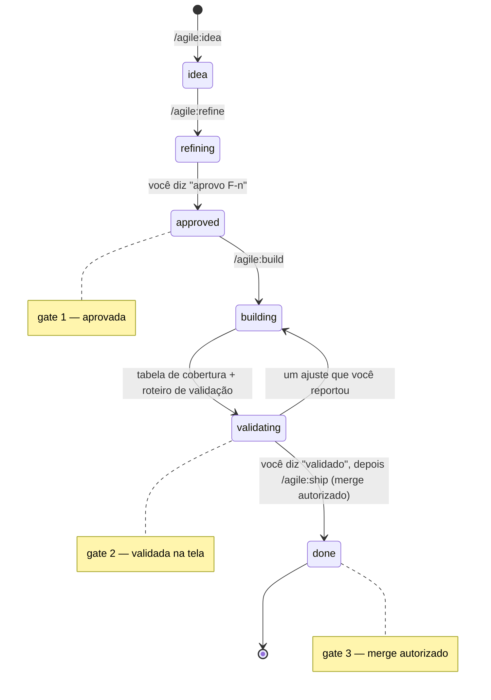

| Status | O que acontece | Quem muda |
|---|---|---|
| `idea` | Registrada a partir da conversa com `/agile:idea`. Título, 2 ou 3 linhas e como ela começa (`## Start`): do que depende, pelo que espera e de quem, o caminho sugerido, o que pode rodar ao lado. O que ninguém disse fica escrito como desconhecido. | Claude |
| `refining` | `/agile:refine` (uma resposta que transforma algo num item para depois vira ideia pelo mesmo procedimento do `/agile:idea`: template, board, próximo número): antes de escrever qualquer coisa, o Claude cria a branch do item e a worktree dele — uma pasta fora do repositório, cujo caminho completo ele te diz — e tudo o que este item produz (o arquivo da feature, a causa de um bug, o mockup) é escrito ali, na branch dele; um arquivo de item ainda não commitado é movido para lá e deixa de existir onde foi criado. Nenhum checkout é trocado, então uma sessão que está na pasta de outro item não consegue mais deixar os documentos deste na branch daquele. Depois o Claude lê o código relacionado, confere no código de hoje cada premissa sobre como algo já funciona (o arquivo de um item antigo não é prova: um bug posterior pode ter mudado aquilo), confere no código ou na documentação da biblioteca cada premissa sobre como ela guarda ou protege dados, uma premissa de performance de consulta com `EXPLAIN` no test container, e uma premissa que a documentação e o código da biblioteca deixam em aberto reproduzindo-a num projeto descartável contra um test container (fonte lido cru, nunca resumido) — uma premissa de que nada usa um recurso é conferida pelo efeito, não pelas chamadas de um helper. Um bug cuja causa só existe na branch de um item sem merge diz isso em `## Cause` e espera esse merge antes de criar a própria branch. Depois o Claude faz todas as perguntas abertas numa rodada, como cartões de quiz agrupados por tema (regras, permissões, estados, telas, dados, pacotes, escopo) com a opção recomendada primeiro; num terminal as mesmas perguntas vêm como lista numerada. A rodada inclui os pacotes novos de que o item precisa, para o código **e para os testes**, com as versões conferidas no registro naquele momento, para que o seu sim seja dado uma vez e não no meio do build. Você responde; no máximo mais uma rodada. Um item cuja saída é visual (um diagrama, uma página gerada) é prototipado e visto em tamanho real no visualizador de destino antes de você aprovar. Um item de autenticação ou de vínculo de contas recebe a revisão independente (`/agile:review`) neste arquivo, antes da sua aprovação. Uma tela nova ou complexa é desenhada pelo agente `ux-designer` (`/agile:screen`), que nunca fala com você: o Claude lê o que ele escreveu e faz como suas as perguntas abertas dele. O arquivo da feature é commitado na branch do item, dentro da worktree dele. | Claude |
| `approved` | Você aprova o arquivo da feature depois de lê-lo. Perguntas em aberto impedem a aprovação. **Portão 1.** | Você |
| `building` | `/agile:build`: continua na worktree criada no refinamento — código e testes do que mudou. Quando o item cria um projeto, um contrato de API, uma mensagem entre módulos ou muda o schema, duas passagens somente leitura rodam antes do plano: o `system-design` propõe o corte, os contratos, os dados e os riscos, e o `architect` revisa essa proposta contra o perfil e as conferências que o seu projeto realmente tem. Elas não escrevem nada; o Claude confere as duas nos arquivos, escreve o plano a partir delas e registra em `## Decisions` o que aceitou e o que descartou. Um CRUD fino não passa por nenhuma das duas. Quando o item tem um mockup que você aprovou, a tela e os testes dela são escritos pelo agente `frontend`, sozinho nessa worktree; depois o Claude lê cada arquivo que ele citou, roda o gate e cita os números reais, e responde as paradas dele ou te traz as que são decisão (um padrão que falta no kit, um contrato que não existe). Domínio, API e migrações continuam com o Claude. Antes de copiar um padrão já existente, o Claude confere se há um item aberto para removê-lo e, se houver, deixa você escolher entre seguir o padrão agora ou registrar a cópia como dívida. Antes da tabela de cobertura o Claude abre a tela pelo app host: os testes não enxergam como a biblioteca de componentes desenha os seus estados (um link ativo sem contraste, um link que não é link). As conferências por teclado ficam no seu roteiro de validação. O Claude nunca muda estado (cadastros, requisições contadas, dados) num app host que ele não abriu: pergunta antes, ou usa dados que ninguém mais usa e diz quais. Uma tela atrás de login não é conferida pelo Claude, cujas regras proíbem digitar senha: ele diz isso, confere o que não pede conta (a rota, o 401, o redirecionamento) e põe o fluxo logado no seu roteiro de validação. Só uma feature pode estar aqui. | Claude |
| `validating` | O Claude entrega um roteiro de validação (até 8 passos). Você testa na tela. Um passo que precisa de terminal traz o comando para Git Bash e para PowerShell 7, com a saída esperada e como repetir, e o Claude já rodou os dois. **Portão 2.** | Você |
| `done` | `/agile:ship`: suíte completa, merge com o seu OK (**Portão 3**), board e manual da app atualizados, retro. | Claude |

Pequenas correções encontradas na validação são feitas na hora, sem sair de `validating`.

Antes de entregar o roteiro de validação, o Claude mostra uma tabela **critério → teste**: cada critério de aceite aponta para os seus testes, ou fica explicitamente para o roteiro de validação. O teste precisa passar pelo caminho que o usuário usa (página, endpoint, o handler que chama o código): um método escrito para um critério que nada na app chama é uma lacuna, mesmo que o seu próprio teste passe. Quando um efeito sai da requisição (um e-mail ou um evento passa a ir por fila), todo teste que o conferia é relido: "nada foi enviado" passa de graça quando nada é enviado na hora. Um teste instável é reproduzido num laço (build limpo antes de cada rodada) e a correção é provada pelo mesmo laço, N verdes seguidos; um teste de saída gerada conta cada seção, exatamente uma vez.

### O mesmo caminho numa execução só: `/agile:autopilot`

O `/agile:autopilot <id>` percorre esse caminho inteiro, de `idea` a `done`, e para para você **exatamente duas vezes**. Os três portões continuam lá: a primeira parada é o portão 1, a segunda reúne os portões 2 e 3, e você escolhe se passa pelos dois numa mensagem só.

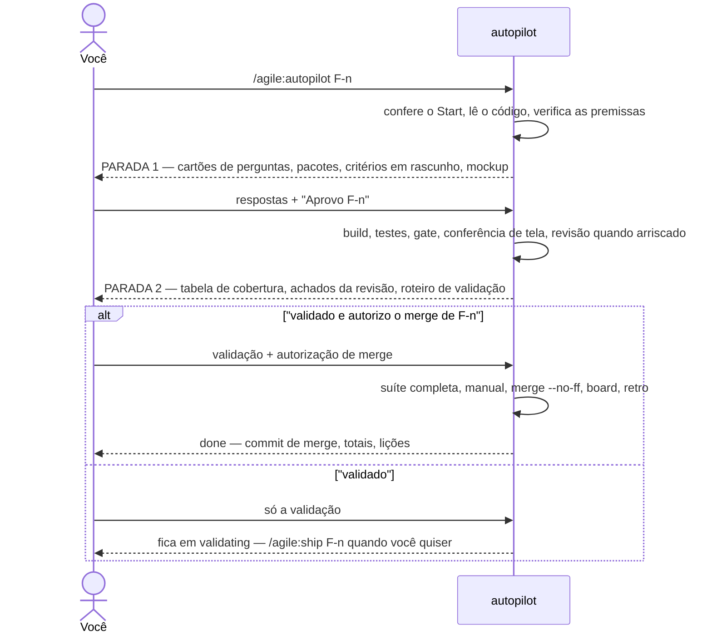

| Parada | O que você recebe | Como você responde | O que vem depois |
|---|---|---|---|
| 1 — perguntas | Todas as perguntas em aberto como cartões (a opção recomendada primeiro), os pacotes novos com licença e versão, os **critérios de aceite em rascunho** escritos a partir das opções recomendadas e, para um item com tela nova ou complexa, o **mockup HTML** feito com as mesmas opções. O último cartão: "Aprovar F-n com estas respostas e critérios?" | Escolha as respostas e "Aprovo F-n". Qualquer outra resposta é uma rodada de acompanhamento, nunca uma aprovação. | O arquivo do item é preenchido com as suas respostas e vai para `approved`; o build começa na mesma execução. Se uma resposta de tela difere da recomendação, o mockup é refeito e a execução para mais uma vez, só para a tela. |
| 2 — validação | Arquivos, testes com números reais, a tabela critério → teste, os achados do revisor (ele roda sozinho quando a mudança é arriscada: autenticação, permissões, dados, contratos, dinheiro, mais de ~400 linhas), o que o `--assume` assumiu, o roteiro de validação. | "validado e autorizo o merge de F-n" — ou só "validado" — ou o defeito que você achou. | Com o merge nomeado: suíte completa, manual da app nos três idiomas, `merge --no-ff`, board, retro, `done`, sem perguntar de novo. Só "validado": o item fica em `validating` até o `/agile:ship F-n`. Um defeito: corrigido, e a parada 2 de novo. |

O `--assume` pula a parada 1: cada pergunta recebe a opção recomendada, registrada em `## Decisions` como `assumed by autopilot` com o motivo, e a flag vale como a sua aprovação daquele item. Ele nunca assume um pacote novo — quando o item precisa de um, a parada 1 acontece só com essa pergunta. O mockup, quando houver, aparece então na parada 2.

Algumas decisões continuam suas mesmo dentro de uma execução. A execução **termina** — nada é desfeito — e diz onde parou, o que está pronto, o que falta e o comando para continuar, quando encontra: um pacote que você não aprovou na parada 1, uma mudança de schema fora do arquivo, dinheiro, permissões, dados compartilhados, credenciais, uma tela atrás de login, o contrato de outro módulo, uma premissa falsa ou um critério impossível, o gate vermelho três vezes, um bloqueador que não dá para corrigir dentro do item, a suíte vermelha no ship ou um conflito de merge.

A execução mantém uma linha `Autopilot:` no arquivo do item (`refined`, `stop 1`, `approved`, `built`, `reviewed`, `stop 2`, `shipping`). O `/agile:autopilot F-n` retoma dessa linha, então uma sessão nova ou um contexto resumido não perde nada.

### Etapas opcionais

| Comando | Quando | Resultado |
|---|---|---|
| `/agile:discuss` | Uma ideia com vários caminhos possíveis, ou dúvidas que só você responde | `docs/discussions/D-<n>-<slug>.md` (opções, decisões, pontos adiados) e os itens registrados como `idea` |
| `/agile:epic` | Um épico novo para planejar | `docs/epics/<slug>.md` com features priorizadas, cada uma cabendo numa sessão, do que cada uma depende e pelo que espera, um plano de execução (ordem, caminho sugerido, o que roda em paralelo) e o que o épico espera de fora; cada feature registrada como `idea` |
| `/agile:screen` | Uma feature em `refining` com tela nova ou complexa | O agente `ux-designer` escreve a seção de tela detalhada no arquivo da feature e um mockup HTML (todos os estados, três idiomas; uma cor nova só depois de calcular o contraste dela em toda superfície, nos dois temas), sozinho na worktree do item; o Claude lê os dois, faz como suas as perguntas abertas do agente, e você aprova a tela junto com a feature. No build, o agente `frontend` implementa esse mockup aprovado e os testes daquela tela |
| `/agile:review` | Uma mudança arriscada (autenticação, permissões, isolamento por tenant, dados, contratos, dinheiro, ou mais de ~400 linhas), antes da validação | Achados por gravidade de um revisor só de leitura e com contexto limpo; os bloqueadores confirmados são corrigidos antes de você validar |

## 6. Mudando de ideia

- **Antes da aprovação:** mude o que quiser. É só conversa.
- **Durante o build:** o `/agile:change` acrescenta uma **nota de mudança** ao arquivo da feature (o que mudou, por quê e quais critérios de aceite são afetados). Você reaprova só esses critérios, e o trabalho continua.
- **Depois do ship:** é uma feature nova ou um bug, registrado com `/agile:idea`.
- **Premissa errada descoberta** (por exemplo, "a tela já tem esse campo" e não tem): o Claude para e pergunta antes de contornar o problema no código.

## 7. O arquivo da feature

`docs/features/F-<número>-<slug>.md`, um por feature, criado a partir de `docs/agile/templates/feature.md`. Bugs usam um arquivo mais curto, `docs/bugs/B-<número>-<slug>.md` (template `bug.md`): o que acontece, o esperado, a causa confirmada (com cada duplicata de uma regra de negócio), a correção (quais ocorrências agora, quais adiadas), um teste de regressão por ocorrência corrigida e o roteiro de validação.

Épicos ficam em `docs/epics/<slug>.md` (tabela de features, ordem, corte da primeira versão) e discussões em `docs/discussions/D-<n>-<slug>.md`. Mockups de tela vão para `docs/features/mockups/`.

Uma regra que protege um mínimo ("nunca deixar o último gestor sem substituto") é escrita como um antes e depois — "havia pelo menos um antes e nenhum depois" — para não barrar também o caso em que o buraco já existia.

Seções principais do arquivo da feature:

```markdown
---
feature: F-<número>
status: refining | approved | building | validating | done
board: <id do work item>
---
# <Nome da feature>

## Goal
## Users and use cases
## Business rules
## Screens and API
## Acceptance criteria
## Decisions (date — decision — reason)
## Out of scope
## Open questions
## Change notes
## Validation script
```

O arquivo é escrito em inglês, como todo o projeto.

## 8. Definição de pronto

- [ ] Critérios de aceite atendidos e cobertos por testes.
- [ ] Build sem avisos novos; testes afetados verdes.
- [ ] Todo texto de tela traduzido em pt-BR, pt-PT e en.
- [ ] Validado na tela por você.
- [ ] Suíte completa verde antes do merge.
- [ ] Documentação técnica gerada em dia (`DocGen --check`), quando o projeto a tem.
- [ ] Manual da app atualizado nos três idiomas.
- [ ] Board atualizado; o arquivo da feature reflete o que foi decidido.

## 9. Gates de qualidade

Os hooks rodam fora do modelo. São scripts Node (sem bash) e não fazem nada em um repositório sem projeto .NET.

| Quando | O que acontece |
|---|---|
| **Início da sessão** | Mostra a branch, o item em andamento, o topo do backlog, os arquivos aprovados com perguntas em aberto e o trabalho sem commit em **todas** as worktrees. |
| **A cada commit** | Uma guarda recusa um `git commit` na branch principal em dois casos: uma branch de item (`feature/F-<n>`, `bug/B-<n>`) está sem merge e não está aberta em nenhum lugar — o sinal de que uma IDE trocou a branch por trás da sessão — ou o commit carrega o arquivo de um item que não está `done` (refining, approved, building, validating), que pertence à branch do item. O Claude avisa você e volta para a branch certa; se o commit for mesmo da branch principal, você confirma e o Claude repete o comando terminando com o comentário `# agile:main-ok`. |
| **A cada edição** | Nada é compilado. O arquivo editado só é anotado, sob a raiz git a que pertence — assim, uma edição dentro de uma worktree é verificada naquela worktree, e não na pasta onde a sessão começou. |
| **Fim do turno** (só se houve mudança de código) | Compila os projetos alterados e roda só os projetos de teste que os referenciam, direta ou indiretamente. Nunca roda a suíte inteira. |
| **Ship** | `gate.js ship`: rebuild completo, suíte completa e testes de arquitetura; depois nenhum arquivo versionado pode ficar alterado (um arquivo gerado que a execução reescreveu é commitado com o item), e as evals rodam quando o projeto as tem (uma queda na taxa de acerto reprova o ship). Depois do manual da app, `gate.js docs` roda o comando de docs que o repositório declara, quando declara um (abaixo). |

Detalhes:
- **Só avisos novos.** Os avisos são comparados com `.claude/agile/warnings-baseline.json`, um arquivo versionado. Avisos que já existiam não reprovam o gate; um aviso novo, sim, listado com arquivo, linha e mensagem. A baseline só é reescrita por um ship verde (ou por `gate.js baseline`, com o seu sim).
- **O veredito é a última linha.** Todo relatório termina com `agile gate GREEN`, `agile gate RED: <o que falhou>` (os avisos novos, os testes que falharam, o build bloqueado) ou `agile gate SKIPPED: <por quê>` (nada foi editado, não há solução, não é um repositório git — quando não acha a solução, diz para nomeá-la como `solution` no `.claude/agile/build.json`), ou `agile gate OFF: <por quê>` num repositório cujo `build.json` diz `engine: none`. Como hook, um turno sem mudança de código fica em silêncio. Rodado à mão, o `stop` não enxerga as marcações do hook (elas pertencem à sessão), então pergunta ao git quais arquivos de código mudaram desde a main — commitados, não commitados e novos —, compila e testa esses, e sempre imprime o veredito. O Claude grava a saída inteira num arquivo e cita dali, sem nunca filtrá-la com `grep`, `head` ou `tail`: uma vez, uma saída filtrada escondeu a única lista de avisos novos.
- **Mudanças amplas.** Se uma mudança alcança mais de 6 projetos de teste, rodam só os que a referenciam diretamente; o resto fica para o ship (`AGILE_GATE_MAX_TESTS`). Uma mudança em `.props`, `.targets` ou na solução compila a solução inteira e deixa os testes para o ship.
- **Busca da solução.** A solução é procurada na raiz git e uma pasta abaixo (`repo/App.slnx`, `src/App.sln`).
- **Um repositório adotado.** Uma base de código que existia antes do workflow (o `CLAUDE.md` dela diz `Profile: adopted`, escrito à mão ou por outro plugin, como a adoção do legacy-lens) registra como ela é compilada de verdade em `.claude/agile/build.json`: `engine` (`dotnet`, `msbuild` ou `none`), `solution` (caminho a partir da raiz), `scope` (os projetos que vale compilar quando a solução inteira não dá), `testCommand` e `notes`. O gate lê `solution`, então uma solução funda na árvore ainda é compilada, e `engine: none` o desliga com o motivo em `notes`; `scope` e `testCommand` são para pessoas e ainda não são lidos. O `/agile:sync` atualiza regras, templates e o workflow de um repositório assim, mas não toca no perfil dele: não há perfil do plugin de onde atualizá-lo.
- **Um comando de docs declarado.** O `build.json` também pode trazer `"docs": { "command": "...", "check": "...", "paths": ["docs/legacy/inventory"] }`, escrito por quem preparou o repositório (a adoção do legacy-lens declara ali o mapa de inventário dele), para que um mapa vivo do código seja atualizado a cada item. No ship, depois do manual da app, `gate.js docs` roda `command` e depois `check` (opcional) pelo shell, a partir da raiz da worktree do item, qualquer que seja o `engine`. `command` e `paths` são obrigatórios. Termina com `agile docs GREEN: <n> file(s) changed under <paths>`, e esses arquivos entram no commit de docs do item. `agile docs SKIPPED: no docs command declared` quer dizer que não há bloco `docs`, e o ship segue como antes. `agile docs RED: <o que falhou>` para o ship como um gate vermelho: um comando ou check que falhou, não está instalado ou passou de 600 segundos (`AGILE_DOCS_TIMEOUT`), um campo que falta, ou um arquivo alterado fora de `paths`. Um arquivo assim é listado e nunca commitado.
- **Saída de build travada.** Um app host, preview ou depurador rodando mantém as DLLs abertas. O gate então informa "build blocked" e o nome do processo, em vez de uma falha de build genérica; o Claude encerra o que ele mesmo iniciou antes do fim do turno e pede que você feche o seu.
- **Contagens honestas.** O Claude só cita uma contagem de avisos da saída do gate ou de um build com `--no-incremental` (um build incremental pula os projetos que não mudaram e esconde os avisos deles), e compila de novo depois de um `git stash` ou de trocar de branch antes de rodar os testes: o `--no-build` rodaria os binários da outra árvore.
- **Testes pendurados.** Um teste que roda por mais de 120 segundos (`AGILE_GATE_HANG_TIMEOUT`) conta como pendurado: a execução falha com o nome dele, em vez de travar o turno por minutos.
- **Sem loops.** Depois de 3 gates vermelhos seguidos, o turno termina e você vê a falha; a verificação pendente fica para o próximo turno.
- **Limite conhecido.** Só as edições feitas com as ferramentas de edição são rastreadas. Mudanças feitas por comando de shell (`dotnet format`, um merge) são pegas no ship.
- `AGILE_HOOKS=off` desliga os hooks em uma sessão.

## 10. Board

O `CLAUDE.md` tem uma linha `Board:`: GitHub Issues + Projects (`gh`), Azure Boards (`az boards`) ou nenhum (nesse caso, usa `docs/agile/backlog.md`). Mapeamento: épico → feature. Sem Tasks por papel. O arquivo da feature guarda o id do board, e o merge fecha o work item.

## 11. Idiomas e o manual da app

- Código, documentação, commits e identificadores em inglês.
- A app sai em **pt-BR, pt-PT e en** desde o primeiro dia: nenhum texto de tela fixo no código, um arquivo de recursos por módulo e por idioma, e `IStringLocalizer`. Acrescentar um idioma é só acrescentar arquivos de recursos.
- O **manual da app** fica em `docs/manual/<idioma>/` (pt-BR, pt-PT, en) e é atualizado no ship de cada feature.
- Só a conversa entre você e o Claude é em português.

## 12. Perfis de arquitetura

O quiz escolhe um perfil, e o `CLAUDE.md` aponta para ele.

| Perfil | Quando usar |
|---|---|
| `modular-monolith` | Um único deploy, com vários módulos de negócio e fronteiras claras |
| `monolith` | Um único deploy, com uma só área de negócio |
| `web-app` | Principalmente telas sobre dados simples; API fina ou UI no servidor |
| `microservices` | Deploys independentes, com donos separados; só com motivo real |
| `mobile` | Cliente nativo ou MAUI, com o seu próprio perfil de API |

Cada perfil define o layout de pastas, onde ficam as regras de negócio, a estratégia de testes com o tempo máximo e os testes de arquitetura. Os arquivos de perfil ficam em `profiles/` no plugin; o bootstrap copia o escolhido para `docs/agile/profile.md`.

O que todos os perfis têm em comum:
- **Código simples.** CRUD é uma fatia vertical fina (endpoint ou página → `DbContext`): sem repository, sem mediator, sem biblioteca de mapeamento. A regra fica na entidade, ou no handler da feature quando precisa de dados. Estrutura só entra no segundo uso.
- **Um projeto por módulo.** No `modular-monolith`, um módulo é um projeto mais um projeto `Contracts`. Um módulo com domínio rico pode usar a variante Clean Architecture (cinco projetos: Domain, Application, Infrastructure, Api, Contracts); o Claude sugere com o motivo, você decide por módulo, e uma ADR registra.
- **Tempo máximo.** Unitários < 30 s, integração < 2 min por projeto de teste, suíte completa < 5 min (menos em `web-app` e `monolith`, < 10 min em `microservices`). **Um container PostgreSQL por projeto de teste**, nunca um por classe de teste.
- **Testes de arquitetura** protegem as fronteiras e o vocabulário em inglês em todos os assemblies, e toda regra de ausência vem com uma regra de presença, para que um assembly vazio reprove. Um teste de layout mantém cada projeto na pasta que o perfil lhe dá.

**Estrutura de pastas por perfil.** O bootstrap cria a estrutura, e todo projeto que uma feature acrescenta depois nasce na pasta que o tipo dele tem aqui; as pastas da solução espelham as pastas do disco, e um teste de layout reprova quando um projeto cai em outro lugar. `<App>` é o nome do seu app.

`modular-monolith` — hosts, blocos técnicos e módulos de negócio em grupos separados:
```
src/
├── Hosts/
│   ├── <App>.AppHost/                orquestração local (Aspire)
│   ├── <App>.ServiceDefaults/        telemetria, health, resiliência
│   ├── <App>.Api/                    só host: composição, auth, OpenAPI
│   └── <App>.Web/                    UI Blazor, clientes tipados para a API
├── BuildingBlocks/
│   ├── <App>.SharedKernel/           Entity, TenantEntity, Result/Error, AppJson
│   └── <App>.<Block>/                Persistence, Email, Storage, Ai — pela primeira feature que precisar
└── Modules/
    └── <Module>/
        ├── <App>.<Module>/           um projeto por módulo (ou cinco com Clean Architecture)
        │   ├── Features/<Feature>/   fatias verticais
        │   ├── Domain/               entidades com regras
        │   ├── Data/                 DbContext, schema próprio, migrations
        │   └── Resources/            .resx em en, pt-BR, pt-PT
        └── <App>.<Module>.Contracts/ o que os outros módulos podem ver
tests/
├── Hosts/<App>.Web.Tests/            bUnit
├── BuildingBlocks/<App>.<Block>.Tests/
├── Modules/<Module>/<App>.<Module>.Tests/
├── <App>.ArchitectureTests/          fronteiras, vocabulário, layout
└── <App>.Testing/                    auxiliares de teste compartilhados
```

`monolith` — um deployable com o código de negócio dentro dele:
```
src/
├── <App>.AppHost/                    opcional
├── <App>.Api/                        host + código de negócio
│   ├── Features/<Feature>/
│   ├── Domain/
│   ├── Data/                         um DbContext, migrations
│   ├── Contracts/                    records compartilhados com a UI
│   ├── Common/                       Result/Error, AppJson, auxiliares
│   └── Resources/
└── <App>.Web/                        UI Blazor, clientes tipados para a API
tests/
├── <App>.Tests/                      unitários + integração
└── <App>.Web.Tests/                  bUnit
```

`web-app` — um projeto Blazor é o app inteiro:
```
src/
└── <App>.Web/                        o único deployable
    ├── Pages/<Area>/                 página + code-behind
    ├── Components/                   componentes de UI compartilhados
    ├── Features/<Feature>/           só quando uma operação tem regras
    ├── Domain/
    ├── Data/                         um DbContext, migrations
    ├── Api/                          endpoints só para clientes externos
    ├── Common/                       Result/Error, AppJson, auxiliares
    └── Resources/
tests/
└── <App>.Tests/                      unitários + integração + bUnit
```

`microservices` — uma solução, uma pasta por serviço, cada um um monolito pequeno:
```
src/
├── <App>.AppHost/                    todos os serviços, broker, bancos
├── <App>.ServiceDefaults/
├── <App>.Gateway/                    roteamento e auth na borda (YARP)
├── <App>.Web/                        UI Blazor, chama só o gateway
├── BuildingBlocks/
│   └── <App>.Messaging/              outbox, inbox, configuração do broker
└── Services/
    └── <Service>/
        ├── <App>.<Service>/          Features/, Domain/, Data/ (banco próprio)
        └── <App>.<Service>.Contracts/ records e eventos de integração
tests/
├── <App>.<Service>.Tests/            unitários + integração + contrato
├── <App>.Web.Tests/                  bUnit
├── <App>.ArchitectureTests/
└── <App>.SystemTests/                alguns fluxos ponta a ponta
```

`mobile` — um núcleo testável, uma cabeça MAUI fina e o backend no perfil dele:
```
src/
├── <App>.Api/                        backend, pelo perfil dele
├── <App>.Contracts/                  records e códigos de erro compartilhados com o app
├── <App>.Mobile.Core/                biblioteca simples: tudo que é testável
│   ├── Features/<Feature>/           view models, serviços de feature
│   ├── Api/                          clientes tipados, AppJson
│   ├── Storage/                      cache local, fila offline
│   └── Resources/
└── <App>.Mobile/                     cabeça MAUI: páginas XAML, shell, código de plataforma
tests/
├── <App>.Mobile.Core.Tests/          view models, serviços, fila offline
└── <App>.Tests/                      testes do backend, pelo perfil dele
```

As regras comuns ficam em `rules/core/` e são copiadas para `.claude/rules/agile/` no bootstrap: `workflow`, `naming`, `git`, `definition-of-done` e `output-style` são sempre carregadas; `i18n` e `api-contracts` só são carregadas quando o Claude trabalha em arquivos de código, `ui` só em arquivos de tela (`.razor`, `.xaml`), e `build-config` só em arquivos de projeto e de build. Uma regra por linha, no máximo 30 linhas por arquivo. As regras core são genéricas: valem para todos os perfis. O que depende de um perfil, de uma stack ou de uma biblioteca de UI fica no arquivo do perfil, em `templates/dotnet/` ou numa regra limitada por tipo de arquivo, e o plugin aplica isso a todos os perfis a que diz respeito.

**Regras que o build confere.** O bootstrap copia `templates/dotnet/` para a raiz da solução, em todos os perfis: `Directory.Build.props` (configurações comuns, estilo de código cobrado no build), `Directory.Packages.props` (todas as versões de pacote em um só lugar), `.editorconfig` (as regras do dono: nomes, chaves em todo bloco, pattern matching, membros com corpo de expressão, formatação), `BannedSymbols.txt` (APIs proibidas, como `new JsonSerializerOptions`, `DateTime.Now`, `Thread.Sleep`) e `global.json`. Uma regra quebrada vira aviso de build, e o gate reprova avisos novos — assim a regra vale mesmo quando ninguém lembra de ler. O `TreatWarningsAsErrors` fica desligado. Quando uma lição de retro pode ser conferida pelo build, ela vai para lá primeiro.

**Lições da stack.** Uma lição de um item real que depende da stack vai para a regra restrita àqueles arquivos ou para os perfis a que diz respeito, nunca para uma regra sempre carregada. Exemplos da primeira app: a `api-contracts` diz que um middleware próprio resolve uma dependência opcional dentro do ramo que precisa dela (um parâmetro do `InvokeAsync` é resolvido em toda requisição) e que um cliente pede à API os claims do usuário em vez de decodificar o seu access token (ele pode ser criptografado); a `build-config` diz que uma investigação que depende de versão lê a versão resolvida em `obj/project.assets.json`, não a fixada; os perfis com AppHost do Aspire dizem que o código chega a Redis, PostgreSQL ou a um broker pela integração de cliente do Aspire, porque os recursos locais rodam com TLS por padrão, e que o `ServiceDefaults` gerado desliga as novas tentativas de POST (um POST repetido reusa tokens de uso único); os perfis com UI Blazor dizem que, no Interactive Server, estado que muda durante a sessão fica num store no servidor, com a chave num id do cookie, porque um circuito não consegue reescrever o cookie; e a estratégia de testes dos perfis diz que um teste bUnit espera o que um handler assíncrono de clique faz (`WaitForAssertion`), e que um host de teste criado por classe de teste limpa o pool do Npgsql ao ser descartado, senão o banco de teste fica sem conexões; e, no Interactive Server, um dado da primeira requisição que o circuito vai precisar (o endereço do visitante, um cabeçalho) é lido no `App` e passado ao componente raiz interativo, porque o circuito não tem `HttpContext`; os perfis com bUnit também dizem que toda página e diálogo novo ganha um teste que o renderiza, porque um erro de atributo Razor compila (um parâmetro string sem `@` vira texto literal); os perfis com EF Core dizem que o delete que fecha uma unidade de trabalho fica fora do `try` que trata a falha dela, porque um save que falhou mantém a entrada como `Deleted`; com ASP.NET Core Identity, só o último passo de um login em vários passos zera a contagem de falhas; e no `modular-monolith` uma linha que a requisição não pode perder (um job na fila, uma mensagem de outbox) é gravada pelo mesmo save dos dados que a justificam. A `api-contracts` também diz que um endpoint anônimo que precisa dar a mesma resposta em todos os caminhos faz todas as conferências de entrada antes da consulta que diferencia esses caminhos. Os perfis com UI Blazor também dizem que uma página que espia um ticket de uso único (um convite, um link de confirmação) no `OnInitialized` o vê duas vezes — o prerender roda antes do circuito interativo — então lê o ticket ali mas só o consome no sucesso, e um ticket que não pode ser reaproveitado fica preso ao navegador por um cookie HttpOnly, nunca só pela URL; e, num projeto com o gerador de documentação técnica, o dicionário de dados mostra a cláusula `WHERE` de um índice parcial ao lado dele. A estratégia de testes de todo perfil também diz que o template do SDK ainda gera xUnit 2.x, onde `TestContext.Current.CancellationToken` não existe: esse membro é da v3, e adotar a v3 é uma decisão que fica fixada e escrita.

**Um comportamento só em todas as telas.** A regra `ui` impede que as telas se afastem umas das outras: um padrão é definido uma vez, num kit de UI mostrado numa página de galeria só de desenvolvimento, e as páginas usam o kit em vez dos componentes crus da biblioteca. Uma família de ícones atrás de nomes semânticos (`AppIcons.Edit`), um jeito só de editar um item (ações de linha na última coluna; diálogo para entidades simples, página própria para as complexas; o link no nome só abre uma página de detalhe para leitura), o mesmo hover e o mesmo foco em todo lugar, um diálogo único de confirmação para ações destrutivas, e o mesmo feedback, estados de lista, layout de formulário e vocabulário de ações. Testes de arquitetura proíbem ícones e tabelas crus fora do kit, e o kit vem antes da primeira tela. Um parâmetro do kit cujo valor certo depende do que a página significa (autocomplete, o texto de uma ação destrutiva) é obrigatório, então uma página que o esquece não compila. Um problema de cor ou contraste é conferido nos dois temas e em toda superfície onde o componente aparece, calculado pelo tema e depois medido na tela, e um teste sobre os tokens do tema mantém honesto todo par de cores, inclusive os que nenhuma tela mostrou ainda. O projeto registra as suas escolhas (família de ícones, exceções declaradas) nas suas próprias regras.

O Claude escreve todo arquivo (código, testes, docs) com as suas ferramentas de edição, nunca pelo texto de um script: escapes como `\t` ou `\b` viram caracteres de controle, e um teste pode passar sem conferir nada.

**Mantendo um projeto atualizado.** O bootstrap copia arquivos do plugin para dentro do projeto (regras, templates, este workflow, o perfil, os arquivos de build), então uma atualização do plugin não chega a eles sozinha. Atualize o plugin (`claude plugin marketplace update canary`, `claude plugin update agile@canary`, sessão nova) e rode `/agile:sync` no projeto. O Claude mostra uma tabela do que mudou e só copia o que você aprovar: uma cópia que você nunca editou é substituída; um arquivo que você editou (normalmente o perfil) é mesclado à mão, mantendo as suas seções; os arquivos de build (`Directory.Build.props`, `.editorconfig`, `global.json`...) nunca são copiados por cima — cada diferença é proposta como uma edição; as suas regras próprias (`project.md`, `*-project.md`) nunca são tocadas, e o `CLAUDE.md` só recebe o que você aprovar: uma seção que o template ganhou, ou uma linha `Worktrees:` quando ele não tem (a recomendação do bootstrap, `D:\wt\<repositório>` ou `C:\`; as worktrees que já existem mantêm o nome). Se arquivos de build ou regras conferidas pelo build mudaram, o Claude compila, roda a suíte completa e refaz a baseline de avisos. A versão e o que foi copiado ficam registrados em `.claude/agile/sync.json`. Rode entre features, não no meio de uma. O `/agile:version` mostra a versão do plugin em uso na sessão ao lado da versão do projeto, e diz se o próximo passo é um sync ou uma atualização do plugin. O sync também aponta o que só o `/agile:bootstrap` instala e o seu projeto não tem — uma ferramenta própria, como o gerador de documentação técnica — e oferece registrar uma feature para isso; ele nunca instala nada disso por conta.

A `output-style` define como o Claude fala com você: em pt-BR, com a resposta primeiro, relatórios de passo com no máximo 10 linhas, detalhes no arquivo e não no chat, uma recomendação com o motivo, sem narrar o trabalho, "não verificado" dito com essas palavras e a má notícia primeiro. Respostas longas só quando um gate falhou, quando uma pergunta precisa de contexto ou quando você pedir.

## 13. Sessões e pausas

- **Início:** o Claude confere a branch, o board e a feature em andamento antes de qualquer ação.
- **Retomada:** `/agile:build <id>` no item que está em `building` continua a partir do último commit `wip`.
- **Pausa no meio da feature:** `/agile:pause`, ou só diga que vai parar. O Claude faz o commit na branch da feature com o prefixo `wip(F-<n>):` e escreve uma nota (onde paramos, o que vem a seguir, quem decide); nada fica só no disco. Fechar a sessão sem pausar também não perde nada: a sessão seguinte commita o que sobrou como `wip` antes de tudo.
- **Fim:** uma nota curta (onde paramos, o que vem a seguir, quem decide).
- **Antes do merge a partir de uma worktree:** o Claude pergunta, como uma pergunta bloqueante, se você já fechou a IDE e o app host que estiverem rodando daquela pasta — uma remoção que falha no meio desregistra a worktree e deixa a pasta no disco, pior do que não remover. No .NET ele também roda `dotnet build-server shutdown` antes, porque um build server segura um lock que fechar a IDE não libera.

**Uma pasta por item.** Cada item ganha a própria worktree — uma pasta separada, fora do repositório (a raiz é a linha `Worktrees:` do `CLAUDE.md`, perguntada no bootstrap — recomendação `D:\wt\<repositório>`, ou `C:\wt\<repositório>` sem drive D:; sem a linha, `<pasta pai do repositório>/wt/<repositório>/`, e o `/agile:sync` propõe a linha. A pasta é `f-<n>-<desc>` ou `b-<n>-<desc>`, com `<desc>` = até 20 caracteres do slug, cortado num hífen: `f-3-exam-board`. Curta por causa do limite de caminho do Windows; uma worktree criada antes mantém o nome `<tipo>-<n>` até o merge) — criada pelo `/agile:refine` antes de ele escrever qualquer coisa e usada até o merge. É isso que mantém os documentos de um item na branch dele: uma sessão trabalhando na pasta de outro item escrevia ali o arquivo da feature e o mockup, e eles acabavam numa branch que não era a deles. O build reaproveita essa pasta e nunca cria uma segunda.

**Dois itens em paralelo.** O padrão continua sendo um item por vez em `building`. Quando você quiser mesmo um segundo item andando — uma feature longa numa sessão e um bug em outra — digite `/agile:build <id> --worktree`. A flag é o seu pedido de trabalho em paralelo: ela libera o limite de um por vez (e, para um item aprovado antes desta mudança, cria a pasta que falta). Antes, o Claude diz se os dois itens podem colidir (mesmo schema de módulo, mesma tela, mesmo contrato) e recomenda fazer em sequência quando colidem. Um escritor por worktree. O status do item fica nessa worktree até o merge, e o `/agile:status` e o início de sessão leem todas as worktrees. Só um app host roda por vez (as portas colidem); arquivos locais ignorados pelo git não vêm junto. Uma pré-visualização do app host a partir de uma worktree aponta a configuração de execução para o caminho absoluto dela temporariamente, restaurada para o caminho do checkout principal ao fim da pré-visualização. No ship, a checagem completa roda na worktree e o merge no checkout principal; depois do merge a worktree e a branch são removidas, nunca com `--force` sem perguntar, e o outro item em andamento é atualizado com a branch principal. Limite recomendado: dois itens — você valida cada um na tela, e esse é o gargalo de verdade.

## 14. Exemplos de workflow

Todos os exemplos usam um app fictício, o **ExamPrep**: uma plataforma em que curadores montam um banco de questões de concursos e alunos praticam com elas. `>` marca o que você digita; `Claude:` marca a resposta (resumida). Os diálogos estão em português, como na conversa real; os arquivos do projeto ficam em inglês.

### 14.1 Bootstrap de um app novo

**Antes:** um repositório vazio, com o `product/brief.md`:

```markdown
# ExamPrep
Problem: candidates study with scattered PDFs of past exams.
Users: curators (build the question bank), students (practice).
Capabilities: exam boards and exams, question bank (8 question types), practice tests, progress reports.
Constraints: Brazil and Portugal; web first; one developer.
Out of scope (v1): payments, mobile app.
```

```
> /agile:bootstrap
```

```
Claude: Li o product/brief.md. Rodada 1 de 7 — Forma.

1. Tipo de app → Recomendação: app web com API (o brief diz "web first").
2. Perfil de arquitetura → Recomendação: modular-monolith.
   Motivo: 4 áreas de negócio (catálogo, banco de questões, prática, relatórios) com
   fronteiras claras, mas um único desenvolvedor — um só deploy simplifica a operação.
3. Onde vai rodar → Recomendação: containers, local com .NET Aspire, Azure depois.

Responda cada uma ("ok" aceita a recomendação) ou diga o que mudar.
```

```
> 1 ok. 2 ok. 3 ok, mas sem decidir Azure ainda.
```

```
Claude: Registrado: onde vai rodar = containers + Aspire; provedor de nuvem adiado.

Rodada 2 de 7 — Dados.
4. Banco → Recomendação: PostgreSQL.
5. Multi-tenancy → Pergunta: escolas ou cursinhos terão bancos de questões privados?
   O brief não diz. Se sim, o isolamento por tenant precisa existir desde o primeiro dia.
...
```

A rodada 6 sempre traz uma pergunta que o brief não responde — onde ficam as pastas dos itens:

```
Claude: 28c. Raiz das worktrees → Recomendação: D:\wt\examprep (esta máquina tem drive D:;
    sem ele seria C:\wt\examprep). Fora do repositório; cada item ganha uma pasta como
    f-3-exam-board — o id e no máximo 20 caracteres do slug.
> ok
```

Depois da rodada 7, o Claude faz a pergunta de fechamento, resolve o que ela levantar, mostra um resumo de todas as decisões e pede confirmação. Então cria:

```
CLAUDE.md                                  52 linhas, aponta para o perfil
docs/decisions/ADR-0001-foundation.md      cada decisão, com o motivo
docs/agile/profile.md                      perfil modular-monolith
src/ExamPrep.AppHost, src/ExamPrep.Api, src/ExamPrep.Web, src/Modules/...
tests/...                                  unitários + integração (Postgres compartilhado)
Resources/*.pt-BR.resx, *.pt-PT.resx, *.en.resx
docs/manual/{pt-BR,pt-PT,en}/index.md
```

e os épicos do brief no board: *Catalog*, *Question bank*, *Practice tests*, *Progress reports*.

### 14.2 Uma feature da ideia ao fim

**Ideia.** Numa conversa sobre o catálogo:

```
> Os curadores precisam cadastrar bancas (nome e sigla). Registra isso.
```

```
> /agile:idea "Exam board registration: name and acronym, list and edit"
```

```
Claude: Criei a feature F-3 "Exam board registration" (board #12), no épico "Catalog".
Status: idea. Nada mais acontece até a refinarmos.
```

**Refinamento.** Quando chegar a vez desta feature:

```
> /agile:refine F-3
```

```
Claude: Pasta deste item: D:/wt/examprep/f-3-exam-board [feature/F-3] — criada agora,
fora do repositório; o arquivo foi movido para lá e tudo da F-3 é escrito ali.
Conferi o código: o módulo Catalog existe, mas ainda não tem entidades.
O modelo de usuários e papéis do bootstrap tem Curator e Admin.
```

As perguntas vêm como cartões de quiz, um por tema, com a opção recomendada primeiro. No app desktop você clica; num terminal as mesmas perguntas chegam como lista numerada, respondida com "ok" ou uma letra. O primeiro cartão, "Regras":

```
[Regras]
1. A sigla é única?
   ● Sim, sem diferenciar maiúsculas (Recomendado) — "FGV" e "fgv" são a mesma banca
   ○ Sim, diferenciando maiúsculas
   ○ Não
2. Uma banca pode ser excluída?
   ● Só desativada (Recomendado) — os concursos vão referenciá-la
   ○ Exclusão definitiva
3. Tamanho máximo?
   ● Nome 120, sigla 20 (Recomendado)
   ○ Outro (digite)
```

Depois "Permissões" e "Telas":

```
[Permissões]
1. Quem pode editar?
   ● Curator e Admin (Recomendado) — os curadores são donos do catálogo
   ○ Só Admin
[Telas]
1. A lista tem paginação ou busca?
   ● Busca por nome/sigla, 20 por página (Recomendado)
   ○ Lista simples, sem busca
```

```
> Regras: tudo recomendado. Permissões: só Admin. Telas: recomendado.
```

O Claude escreve `docs/features/F-3-exam-board-registration.md`:

```markdown
---
feature: F-3
status: refining
board: 12
---
# Exam board registration

## Goal
Let admins keep the list of exam boards used by exams and questions.

## Users and use cases
- UC1 Admin registers an exam board (name, acronym).
- UC2 Admin edits an exam board.
- UC3 Admin deactivates / reactivates an exam board.
- UC4 Admin and curators search the list.

## Business rules
- BR1 Acronym is unique, case-insensitive.
- BR2 Deactivated boards cannot be chosen for new exams but keep existing links.
- BR3 Name ≤ 120, acronym ≤ 20 characters.

## Screens and API
- /catalog/exam-boards (list, search, 20 per page)
- /catalog/exam-boards/new and /{id}/edit
- GET/POST/PUT /api/v1/catalog/exam-boards; POST .../{id}/deactivate|reactivate

## Acceptance criteria
- AC1 Given a new name and acronym, when saved, then the board appears in the list.
- AC2 Given an existing acronym in another case, when saved, then error `exam_board.acronym_taken`.
- AC3 Given a curator, when opening the new/edit screens, then access is denied.
- AC4 All texts appear in pt-BR, pt-PT and en.

## Decisions
- 2026-09-20 — Admin only edits (not curators) — owner decision.

## Out of scope
- Import from a file.

## Open questions
- (none)
```

```
Claude: A F-3 está pronta para aprovação. Leia o arquivo e responda "aprovo F-3" ou diga o que mudar.
> aprovo F-3
```

O status passa a `approved` (**Portão 1**).

**Build.**

```
> /agile:build F-3
```

```
Claude: Nenhuma outra feature em andamento. Branch feature/F-3 criada. Status: building.
...
Pronto:
- Entidade ExamBoard + configuração + migration AddExamBoards
- Endpoints com códigos de erro exam_board.acronym_taken / exam_board.not_found
- Telas List / Form, textos nos 3 arquivos de recursos
- 14 testes (Catalog.Tests 3,1 s, Web.Tests 1,8 s) — verdes

Critério → teste:
| AC1 lista       | ExamBoardsPage_Open_ShowsActiveBoards                        |
| AC3 única       | CreateExamBoard_DuplicateAcronym_Returns409                  |
| AC5 desativar   | ExamBoardsPage_Deactivate_ShowsInactive                      |
| AC7 idiomas     | roteiro de validação, passo 7                                |
A AC5 era uma lacuna: ExamBoard.Deactivate tinha um teste verde, mas nenhuma página
nem endpoint o chamava. Acrescentei o endpoint e o botão, depois o teste de página acima.

Roteiro de validação (F-3):
1. Suba o AppHost e entre como admin.
2. Menu Catalog → Exam boards: lista vazia.
3. Nova: "Fundação Getulio Vargas" / "FGV" → salva e aparece na lista.
4. Nova: "Outra" / "fgv" → mensagem "Sigla já em uso".
5. Edite a FGV e mude o nome → a lista mostra o nome novo.
6. Desative a FGV → status "Inativa"; reative.
7. Troque o idioma para pt-PT e en → os textos mudam.
8. Entre como curador → Nova/Editar não aparecem.
Status: validating.
```

Quando um passo precisa de terminal (um limite, um endpoint ainda sem tela), ele vem para os dois shells, já rodado pelo Claude:

```
4. Seis tentativas de cadastro seguidas do mesmo endereço: a 6ª é recusada.
   Git Bash:     for i in 1 2 3 4 5 6; do curl -sk -o /dev/null -w "%{http_code}\n" -X POST https://localhost:7101/api/v1/auth/sign-up -H "Content-Type: application/json" -d '{}'; done
   PowerShell 7: 1..6 | % { (Invoke-WebRequest -Method Post https://localhost:7101/api/v1/auth/sign-up -ContentType application/json -Body '{}' -SkipCertificateCheck -SkipHttpErrorCheck).StatusCode }
   Esperado: 400 cinco vezes, depois 429. Para repetir: espere um minuto.
```

**Validação** (**Portão 2**):

```
> O passo 4 mostra a mensagem, mas em inglês mesmo com pt-BR.
Claude: Faltava a chave no arquivo pt-BR. Corrigido, e acrescentei um teste para o AC4. Refaça o passo 4.
> ok, validado.
```

**Ship** (**Portão 3**):

```
> /agile:ship F-3
```

```
Claude: Suíte completa: 212 testes verdes (2 min 10 s). Testes de arquitetura verdes.
A execução reescreveu docs/api/ExamPrep.Api.json (uma rota nova): commitado com a F-3.
Pronto para o merge de feature/F-3 em main. Autoriza?
> sim
Claude: Mergeado. Board #12 fechado. Manual atualizado: página "Exam boards" em pt-BR, pt-PT e en.
Retro: uma lição — "conferir todos os arquivos de idioma ao criar uma mensagem". Viro regra?
> sim
Claude: Regra acrescentada em core/i18n. Status: done.
```

### 14.3 Mudando de ideia durante o build

Com a F-7 "Question registration" em `building`:

```
> Quero que o campo "ano" seja opcional em questão sem concurso.
> /agile:change F-7
```

```
Claude: Nota de mudança acrescentada à F-7:
- O quê: Ano passa a ser opcional quando não há concurso vinculado.
- Por quê: questão autoral não tem ano de prova.
- Afeta: BR4 (ano obrigatório) e AC5. Os demais critérios não mudam.
Reaprova a BR4 e o AC5 como reescritos abaixo? (o resto do trabalho continua)
> aprovo
```

O build continua de onde estava. Nada é refeito.

### 14.4 Premissa errada descoberta no build

```
Claude: Parei a F-9 "Edit question exam". A feature pressupõe que a tela de edição já
permite trocar o assunto, mas ela não tem campos de assunto, banca nem ano, e a API de
atualização não os aceita. Opções:
A. Incluir a edição de assunto/banca/ano na F-9 (maior, mas funciona de ponta a ponta).
B. Deixar a F-9 só com o vínculo ao concurso e registrar uma feature nova para os campos.
Recomendação: A, porque a regra BR3 ("escolher um assunto coberto") é impossível sem isso.
> A
Claude: Nota de mudança acrescentada; escopo e critérios atualizados para sua aprovação.
```

### 14.5 Um bug depois do ship

```
> A lista de bancas não encontra "FGV" quando busco "fgv".
> /agile:idea "Bug: exam board search is case-sensitive"
Claude: Criei o bug B-2 (board #31), ligado à F-3.
> /agile:refine B-2
Claude: Causa confirmada na query (igualdade simples). Uma pergunta: a busca também deve
ignorar acentos ("Fundacao" encontra "Fundação")? Recomendação: sim.
> sim
```

O bug segue o mesmo ciclo, com um arquivo curto: causa, comportamento esperado, um teste que reproduz o problema e o roteiro de validação.

Quando a causa é uma regra de negócio, o refinamento também procura na solução inteira a mesma regra implementada de novo em outro lugar (comum em apps que cresceram sem uma camada de regras compartilhada), escreve todas as ocorrências em `## Cause` antes de perguntar qualquer coisa e pergunta quais corrigir agora e quais registrar como dívida:

```
> /agile:refine B-4
Claude: Causa confirmada: Enrollment/CpfValidator.cs:41 ignora o segundo dígito verificador.
A mesma conferência está implementada de novo em outros dois lugares (não são chamadas do validador):
  - Import/StudentCsvReader.cs:88 (cópia própria, mesmo defeito)
  - Web/Pages/Enroll.razor.cs:132 (cópia própria, correta)
As três estão em ## Cause, em docs/bugs/B-4-cpf-check-digit.md.
[cartão: Regras de negócio]
  Quais ocorrências o B-4 corrige?
  ● As três: o leitor e a página passam a chamar o CpfValidator (Recomendado)
    Só o validador e o leitor; a cópia da página fica como dívida registrada
    Só o validador
> (escolhe a primeira)
Claude: B-4 aprovado. O build acrescenta um teste de regressão por ocorrência corrigida.
```

### 14.6 Pausa e retomada

Você para quando quiser, com as suas palavras ou com o comando; os dois fazem a mesma coisa. No meio da F-7:

```
> /agile:pause
Claude: Pausado. Commit "wip(F-7): question form without type editor" em feature/F-7 (local, sem push).
Próximo passo: editor dos tipos T1-T3. Decisão pendente com você: nenhuma. Nada rodando.
```

"Vamos parar por hoje" ou "continuo amanhã" faz exatamente o mesmo. Se você só fechar a sessão, nada se perde: a sessão seguinte começa mostrando o trabalho sem commit, e o Claude o commita como `wip` antes de qualquer outra coisa, com o seu ok.

Na sessão seguinte:

```
> /agile:status
```

```
Claude:
Em andamento: F-7 Question registration — building (branch feature/F-7, 1 commit wip)
Próximo passo: editor dos tipos T1-T3
Perguntas em aberto: nenhuma
Topo do backlog: F-8 Question review queue (idea), B-3 Search accents (idea)
```

Para continuar, rode o build de novo no mesmo item; o Claude retoma em vez de recomeçar:

```
> /agile:build F-7
Claude: Retomando a F-7 a partir do commit wip "question form without type editor" em feature/F-7.
Próximo passo: editor dos tipos T1-T3 (passo 4 do plano). Continuando.
```

### 14.7 De uma ideia solta a um épico

```
> Estou pensando em simulados que se adaptam ao nível do aluno. Não sei bem como.
> /agile:discuss "adaptive practice tests"
```

```
Claude: O que já sabemos: o brief cita simulados; as questões ainda não têm dificuldade.
Opções:
A — Simulados fixos escolhidos pelo curador (P). Simples; sem adaptação.
B — Níveis de dificuldade nas questões + simulados que sorteiam por nível (M). Precisa dos níveis.
C — Motor adaptativo que ajusta durante a prova (G). Precisa de histórico e calibragem.
Recomendação: B agora, C depois — o B cria os dados de dificuldade que o C vai precisar.
Perguntas:
1. Quem define a dificuldade? → Recomendação: o curador, com 3 níveis.
```

```
> B, 3 níveis, o curador define. Adia o C.
Claude: D-1 registrada (decidida; C adiado). Registrei F-12 "Question difficulty" e
F-13 "Practice test by level". Elas pertencem a um épico novo, "Practice tests" — planejo agora?
> /agile:epic "Practice tests"
```

```
Claude:
| Id   | Feature                 | Prioridade | Tamanho | Depende de | Espera por                      | Design de tela |
| F-12 | Question difficulty     | Must       | P       | -          | -                               | não            |
| F-13 | Practice test by level  | Must       | M       | F-12       | -                               | sim            |
| F-14 | Practice test results   | Must       | M       | F-13       | regras de nota do curador       | sim            |
| F-15 | Retry wrong answers     | Should     | P       | F-14       | -                               | não            |
Plano de execução:
1. F-12 — primeiro: as outras precisam do dado de dificuldade — /agile:autopilot F-12 (pequena e clara)
2. F-13 — /agile:refine com /agile:screen, depois /agile:build — ao lado: nada
3. F-14 — /agile:refine quando o curador mandar as regras de nota — ao lado: F-15 num worktree
4. F-15 — /agile:refine → /agile:build
Esperando fora do épico: regras de nota para a F-14, do curador; quem pede é você.
Corte da primeira versão: F-12 a F-14.
1. A F-15 entra na primeira versão? → Recomendação: não.
> ok
Claude: docs/epics/practice-tests.md acordado. F-14 e F-15 registradas, cada uma com o seu Start.
Próximo: /agile:refine F-12 (não espera por nada).
```

Depois, o `/agile:status` mostra a espera até ela ser resolvida:

```
Bloqueados: F-14 — espera as regras de nota, do curador | F-15 — depende da F-14 (idea)
Topo do backlog: F-12 (done), F-13 (approved) — pode começar, F-14 (idea), F-15 (idea)
```

No arquivo, o tamanho é gravado como S / M / L, em inglês.

### 14.8 Design de tela e revisão

Durante o refinamento da F-13:

```
> /agile:screen F-13
Claude: Desenho delegado ao agente ux-designer, sozinho na worktree do item.
Ele escreveu a seção de tela e o mockup; eu li os dois arquivos antes de te mostrar:
7 estados, cada texto nos três idiomas, só padrões do kit,
cor nova com 4,8:1 no card e 5,1:1 na página.
Mockup enviado: docs/features/mockups/F-13-practice-test-by-level.html
Decisões: uma questão por página (bom no celular); cronômetro só quando o simulado tem limite.
Ponto aberto dele — 1. O aluno pode voltar a uma questão anterior? → Recomendação: sim, até concluir.
> sim
> aprovo F-13
```

O agente não fala com você. Ele desenha; o Claude lê os dois arquivos que ele escreveu, faz como suas as perguntas abertas dele e recolhe a sua aprovação. No build da mesma feature, um segundo agente, o `frontend`, implementa esse mockup aprovado e os testes daquela tela, sozinho na worktree; depois o Claude lê o que ele escreveu, roda o gate e cita os números reais. Domínio, API e migrações continuam com o Claude, e uma feature sem mockup aprovado é construída exatamente como antes, sem agente. Os dois modelos são sua escolha, na seção "Models" do `CLAUDE.md`.

No fim do build da F-14 (ela grava resultados e mexe nos dados dos alunos):

```
Claude: Esta mudança mexe em dados de alunos. Rodando /agile:review antes da validação.
| Gravidade  | Achado                                      | Veredito   | Ação                     |
| bloqueador | O endpoint de resultados não confere o dono | confirmado | corrigido + teste        |
| leve       | Mapeamento duplicado em ResultsPage         | confirmado | corrigido                |
| grave      | "A nota pode ficar negativa"                | rejeitado  | a BR2 permite penalidade |
Critério → teste: AC1 a AC6 cobertos; AC7 (troca de idioma) no roteiro de validação.
Status: validating. Roteiro de validação: ...
```

### 14.9 Dois itens em paralelo

A F-6 é um build longo numa sessão. Aparece um bug, e o dono quer corrigi-lo enquanto isso, em outra sessão:

```
> /agile:build B-2 --worktree
Claude: A F-6 está em build na worktree dela (feature/F-6). O B-2 mexe só em Identity/Login;
a F-6 mexe em Catalog. Sem schema nem tela em comum: podem andar em paralelo.
O B-2 já tem a worktree do refinamento: D:\wt\examprep\b-2-exam-board-search. Sigo nela?
> sim
Claude: B-2 em D:\wt\examprep\b-2-exam-board-search, status building (nessa branch).
Só um app host por vez: pare o do checkout principal antes de eu abrir a tela aqui.
```

No início de qualquer sessão, o status mostra os dois:

```
[agile] branch feature/F-6
In progress: F-6 Practice test by level — building (docs/features/F-6-...)
In progress in a worktree: B-2 — building [bug/B-2] D:/wt/examprep/b-2-exam-board-search
```

No ship do bug, a checagem completa roda na worktree e o merge no checkout principal:

```
> /agile:ship B-2
Claude: Antes de remover a worktree: você já fechou a IDE e o app host que estiverem rodando de
D:\wt\examprep\b-2-exam-board-search? Uma remoção que falha no meio deixa a pasta no disco. Diga "fechado" quando terminar.
> fechado
Claude: Desligando o build server do .NET, depois rodando a suíte completa na worktree.
Suíte completa verde (212 testes, 1 min 58 s). Pronto para o merge de bug/B-2 em main. Autoriza?
> sim
Claude: Merge feito. Worktree removida, branch apagada, 0 0 contra origin/main. A F-6 ficou 1 commit atrás
da main: vou atualizá-la antes da próxima rodada de testes.
```

### 14.10 Atualizando o plugin e o projeto

Uma lição para o plugin nasce na retro de um projeto: vira uma linha ⏳ em "Plugin notes — status" no `docs/agile/retro-log.md`. Na sessão do plugin:

```
> vamos ajustar o plugin com as recomendações em retro-log.md
Claude: 2 notas em aberto (F-8). Feito na 0.0.29: espera do bUnit (4 perfis), pool do Npgsql (5 perfis),
manuais en/pt-BR. Linhas marcadas ✅ no retro-log.md (sem commit).
1. Push do plugin?  2. Atualizar o plugin instalado?  3. Commit no projeto?
> pode fazer o push, atualizar o plugin e o commit no simulab
```

Cada um dos três é pedido separadamente, assim como o push do projeto. O projeto só recebe os arquivos novos pelo `/agile:sync`, entre features.

O plugin passou de 0.0.10 para 0.0.13. Primeiro o plugin em si (terminal, depois uma sessão nova):

```
claude plugin marketplace update canary
claude plugin update agile@canary
```

Numa sessão nova, o `/agile:version` diz onde você está:

```
> /agile:version
Claude: agile@canary 0.0.13 nesta sessão. Cópias do projeto: 0.0.10.
Próximo passo: /agile:sync, entre features.
```

Depois, no projeto, entre features:

```
> /agile:sync
Claude: agile@canary 0.0.10 → 0.0.13.
| Arquivo                                | Estado | Proposta                                                   |
| .claude/rules/agile/git.md             | update | copiar: conferir a branch antes de cada commit, hook de guarda |
| docs/agile/workflow.md                 | update | copiar: manual 0.0.13                                      |
| docs/agile/profile.md                  | edited | mesclar: duas linhas novas de teste; a sua seção Simulab fica |
| .editorconfig                          | manual | uma linha difere: CA1716 = none. Acrescento?              |
| CLAUDE.md                              | manual | sem linha Worktrees:. Acrescento "Worktrees: D:\wt\examprep"? |
Nada mais mudou. Seus project.md e ui-project.md não são tocados; as worktrees que já existem mantêm o nome.
> ok
Claude: Copiados 2, mesclado 1 (sem conflitos), .editorconfig editado. Build com 0 avisos; 252 testes verdes (9 s).
O plugin também traz o DocGen (documentação técnica gerada do código, desde a 0.0.21), que o bootstrap instala e este projeto não tem. Registro como feature?
Registrei 0.0.13 em .claude/agile/sync.json. Commit "chore: sync with agile@canary 0.0.13" na main. Autoriza?
```

A partir da 0.0.23 o template traz o `.editorconfig` definitivo. Num projeto que ainda tem o básico, a linha do `.editorconfig` lista os novos grupos de regras (chaves, pattern matching, membros com corpo de expressão, formatação) e o Claude propõe um grupo de cada vez; código que quebra uma regra aprovada aparece como aviso no build que vem depois do sync.

### 14.11 Quando um gate diz não

**Um app rodando trava o build.** O Claude abriu a tela para conferir e esqueceu o app host:

```
[agile gate] build blocked: ExamPrep.slnx
the build output is locked by a running process (ExamPrep.Web (18344)): stop the app host, preview or
debugger started from this folder, then build again.
Claude: Meu app host ainda estava rodando. Encerrei; compilando de novo... verde.
```

**Um aviso novo no ship.** A lista e o veredito vêm por último, então sobrevivem a qualquer forma de ver a saída:

```
new warnings (fix them, or accept with `node gate.js baseline` after the owner agrees):
src/ExamPrep.Web/Pages/Results.razor.cs|RS0030 (0 -> 1)
  src/ExamPrep.Web/Pages/Results.razor.cs(42,19): RS0030 The symbol 'DateTime.Now' is banned in this project: ...
agile gate RED: 1 new warning(s): RS0030 in src/ExamPrep.Web/Pages/Results.razor.cs
Claude: Troquei DateTime.Now pelo TimeProvider injetado; ship de novo... agile gate GREEN.
```

**Um teste pendura.** Em vez de travar o turno por minutos:

```
[agile gate] a test hung (more than 120 s) or the test host crashed: tests/ExamPrep.Web.Tests
not finished: ExamPrep.Web.Tests.Ui.ConfirmDialogTests.Confirm_ReturnsTrue
Claude: O teste esperava o resultado de um diálogo dentro de InvokeAsync. Corrigido com o contexto de teste
compartilhado; 14 testes verdes (2 s).
```

**Um commit na branch errada.** A IDE trocou a branch para main no meio do build da F-6:

```
Claude: git commit -m "feat(F-6): add level filter"
[agile guard] This commit would land on `main`, but `feature/F-6` is not merged and is checked out nowhere.
The branch was probably switched outside this session (an IDE?). Run `git branch --show-current` ...
Claude: O checkout está na main; o lugar disto é a feature/F-6. Voltando para a feature/F-6 e fazendo
o commit lá. Nada entrou na main.
```

A mesma guarda recusa um commit de refinamento ou de build que colocaria o arquivo de um item na main:

```
Claude: git commit -m "docs(F-8): refine and approve"
[agile guard] This commit would land on `main` and carries `docs/features/F-8-question-review-queue.md` (approved).
An item that is not done is committed on its own branch ...
Claude: Criando a feature/F-8 a partir da main e fazendo o commit lá.
```

Quando um commit é mesmo da main com um item aberto (uma nota de retro, por exemplo), o Claude pergunta, e com o seu sim repete o comando terminando com `# agile:main-ok`. Um commit de retro carrega só regras, `CLAUDE.md`, templates e o retro-log; uma lição que precisa de código vira item, para que o código passe pelo gate na branch dele.

**O comando de docs mexeu num arquivo que não é dele.** Num repositório adotado cujo `.claude/agile/build.json` declara um mapa do código, o passo `gate.js docs` do ship o roda depois da verificação completa verde:

```
ran docs.command (48 s): lens-map --out docs/legacy/inventory
changed outside docs.paths (not committed):
  src/Billing/Billing.csproj
agile docs RED: 1 file(s) changed outside docs/legacy/inventory: src/Billing/Billing.csproj
Claude: O comando do mapa reescreveu um arquivo de projeto, que está fora de docs.paths. Não commitei
e o restaurei com git restore. Isso é da ferramenta que escreve o comando (legacy-lens), então anotei
como nota de plugin no retro log. Merge em espera: faço o ship sem o mapa desta vez, ou esperamos?
```

Uma execução verde lista os arquivos que mudou dentro de `docs.paths`, e eles entram no commit `docs(F-<n>)` junto com o manual:

```
ran docs.command (47 s): lens-map --out docs/legacy/inventory
ran docs.check (3 s): lens-map --check
to commit with the item:
  docs/legacy/inventory/entry-points.md
agile docs GREEN: 1 file(s) changed under docs/legacy/inventory
```

### 14.12 A pergunta de fechamento do quiz

Depois da rodada 7, antes do resumo:

```
Claude: Pergunta de fechamento, sem recomendação: qual conceito do domínio mais preocupa você, ou o quiz não tocou?
> A taxonomia de assuntos. Cada banca dá um nome à matéria e algumas agrupam duas.
Claude: Fatos do código que você me deu: três níveis fixos, questões apontam para o mais baixo, sem apelidos.
Opções: A) manter três níveis; B) dois níveis canônicos + as disciplinas do edital mapeadas para eles + apelidos.
Recomendação: B — o edital mantém o vocabulário dele, e a analytics compara entre provas.
> B
Claude: Registrado na ADR-0001 em "After the quiz"; capacidade 2 do brief atualizada. Agora o resumo...
```

### 14.13 Um item numa tacada só

O `/agile:autopilot` leva um item da ideia até `done` com duas paradas (seção 5): a rodada de perguntas, em que as
suas respostas aprovam o item, e o roteiro de validação, em que você pode validar e autorizar o merge numa mensagem só.
Os exemplos abaixo usam a app ExamPrep do 14.1.

#### 14.13.1 Um item com tela, da ideia ao done

A F-17 acrescenta filtros à tela do banco de questões. Ela está em `idea` com o `## Start` vazio.

```
> /agile:autopilot F-17
Claude: F-17 (idea) — duas paradas: perguntas agora, roteiro de validação depois. Lendo o código do banco de questões.
O que existe: /questions lista 25 por página, sem filtros; Question tem Discipline, Difficulty, ExamBoard; a
permissão questions.view já protege a página. Nenhuma premissa falhou.

Critérios de aceite em rascunho (feitos com as opções recomendadas abaixo; as suas respostas podem mudá-los):
  AC1 Dado questões de três disciplinas, quando filtro por uma, então só as questões dela aparecem.
  AC2 Dado filtro por disciplina e por dificuldade, quando os dois estão marcados, então os dois valem (E).
  AC3 Dada uma lista filtrada, quando recarrego a página, então os filtros continuam (guardados na URL).
  AC4 Dado que nenhuma questão atende, quando filtro, então aparece o estado vazio "Nenhuma questão atende a estes filtros".
  AC5 Os textos existem em pt-BR, pt-PT e en.
Mockup: docs/features/mockups/F-17-question-bank-filters.html (estados: carregando, pronto, vazio, erro; 3 idiomas)

[cartão — Regras]    Vários filtros se combinam com: E (Recomendado) | OU
[cartão — Telas]     Os filtros ficam: numa barra acima da lista (Recomendado) | num painel lateral
                     Filtros mantidos ao recarregar: na URL (Recomendado) | não
[cartão — Pacotes]   Pacotes novos: nenhum necessário (Recomendado)
[cartão — Aprovação] Aprovar F-17 com estas respostas e critérios? Aprovo F-17 (Recomendado) | Mudar algo
```

Você abre o mockup, prefere um painel lateral e responde:

```
> Regras: E. Telas: painel lateral; URL sim. Pacotes: nenhum. Aprovo F-17.
Claude: A sua resposta de tela difere da recomendação (painel lateral), então o mockup mudou:
docs/features/mockups/F-17-question-bank-filters.html — o painel se fecha em telas estreitas. O resto está
registrado em ## Decisions e os critérios continuam. Esta parada extra é só da tela: o painel ficou certo?
> sim
Claude: F-17 aprovada (Autopilot: approved). Construindo na feature/F-17.
```

A execução segue sozinha: branch, código, testes afetados, gate, a tela aberta pelo app host nos dois temas. A
mudança não toca permissão, schema nem dado compartilhado, então não precisa de revisão. Depois vem a parada 2:

```
Claude: PARADA 2 — a F-17 está em validating (Autopilot: stop 2).
  8 arquivos; 12 testes verdes (2,9 s); gate GREEN, 0 warnings novos.
  Critério → teste: AC1 QuestionBankFilterTests.Filter_ByDiscipline_ListsOnlyIt; AC2 ...BothFilters_ApplyAnd;
  AC3 ...Reload_KeepsFiltersFromUrl; AC4 ...NoMatch_ShowsEmptyState; AC5 teste de chaves faltando + passo 6.
  Roteiro de validação: docs/features/F-17-question-bank-filters.md#validation-script (6 passos).
  Responda "validado e autorizo o merge de F-17" para entregar agora, ou "validado" para parar aqui.
> validado e autorizo o merge de F-17
Claude: Entregando a F-17 (Autopilot: shipping). Suíte completa: 214 testes verdes (41 s); manual atualizado em
pt-BR, pt-PT e en (question-bank.md); merge --no-ff em 3f9c2e1, push feito; main...origin/main 0 0; branch
removida. Board #31 fechado. F-17 done. Retro: 1 lição proposta — mantém ou descarta?
```

O seu "validado e autorizo o merge" foi a autorização de merge do ship: ela não é pedida de novo.

#### 14.13.2 Validado, merge depois

A mesma parada 2 da F-19, respondida só com "validado":

```
> validado
Claude: F-19 validada e mantida em validating; nada foi para a main. Quando quiser: /agile:ship F-19.
```

"ok", "pode seguir" ou "validado" nunca autorizam merge. Só uma mensagem que nomeia o merge autoriza.

#### 14.13.3 Um defeito na parada 2

```
> passo 4 falhou: o filtro some quando troco de página
Claude: Reproduzido: o link de página perde a query string (QuestionList.razor:88). Corrigido; acrescentei
Paging_KeepsFilters (visto vermelho antes da correção). 13 testes verdes (3,0 s), gate GREEN.
PARADA 2 de novo — repita os passos 4 a 6 do roteiro.
```

#### 14.13.4 `--assume`, e o pacote que ele nunca assume

```
> /agile:autopilot F-18 --assume
Claude: F-18 (idea) — --assume: parada 1 pulada com as minhas recomendações, menos o que só você decide.
A F-18 exporta o banco de questões em PDF e precisa de um pacote novo. Essa pergunta é sua:
[cartão — Pacotes]  QuestPDF <última> (licença Community) (Recomendado) |
                    PdfSharpCore <última> (MIT) | sem PDF — só CSV
> QuestPDF
Claude: Registrado. 5 respostas assumidas (em ## Decisions como "assumed by autopilot"). F-18 aprovada. Construindo.
...
Claude: PARADA 2 — F-18 em validating. Assumi: A4 retrato; uma questão por bloco; respostas numa última página;
só admin e editor (permissão questions.export). Se alguma estiver errada, me diga: vira uma nota de mudança.
Mockup da página de exportação (você não o viu na parada 1): docs/features/mockups/F-18-question-export.html
```

#### 14.13.5 Uma mudança arriscada: a revisão roda sozinha

A F-20 deixa um editor arquivar questões (permissões e dados). Antes da parada 2 a execução chama o revisor de
contexto limpo sem que você peça, corrige o que ele confirma e mostra tudo:

```
Claude: PARADA 2 — F-20 em validating. Revisão (change-review): 1 grave confirmado e corrigido — o endpoint de
arquivar conferia questions.edit em vez de questions.archive (ArchiveQuestion.cs:21), teste acrescentado; 1 menor
aceito — a lista de arquivadas não tem limite de página (registrado em ## Decisions). Roteiro de validação: 7 passos.
```

#### 14.13.6 Uma parada reservada ao dono, e a retomada no dia seguinte

```
Claude: PARADA (dono) — a F-21 precisa de uma coluna que o arquivo não cita: questions.archived_at (mudança de schema).
Pronto: aprovada, 5 de 9 arquivos, testes verdes. Falta: a migration e 2 critérios.
Opções: A) acrescentar archived_at pelo /agile:change F-21 (Recomendado — a regra de arquivamento precisa da data);
B) manter um flag sem a data. Depois, /agile:autopilot F-21 continua.
> A
(a nota de mudança é registrada; você fecha a sessão)
```

No dia seguinte, numa sessão nova:

```
> /agile:autopilot F-21
Claude: F-21 retomada do arquivo (Autopilot: approved, build em andamento; nota de mudança 1 aplicada). Acrescentando a migration...
```

A execução nunca desfaz trabalho numa parada, e nunca faz merge, push ou marca `done` sem o merge nomeado por você.

### 14.14 Um quiz para um app que chama um modelo

O brief do ExamPrep ganha uma capacidade: "um tutor explica ao aluno uma resposta errada". A rodada 4 do quiz agora tem mais três perguntas, e a rodada 2 mais uma:

```
Claude: Rodada 2 — Dados.
9b. Dados pessoais e retenção → Recomendação: guardados, com prazo de retenção.
    O tutor vê as respostas do aluno. Respostas guardadas 2 anos; conversas com o tutor
    30 dias, apagadas por um job (uma flag de soft delete ainda guarda o texto). Podem
    sair da rede? Isso decide a pergunta 17b.

Rodada 4 — Integração.
17b. Provedor do LLM → Recomendação: IChatClient, provedor por configuração, hospedado.
     As respostas não levam nomes; se a 9b disser que não podem sair da rede, local.
17c. Teto de custo → Recomendação: limite por aluno + disjuntor global. Cada mensagem
     custa dinheiro e existe um plano grátis (pergunta 13): sem limite, nada o para.
17d. Modelo nos testes → Recomendação: um IChatClient fake roteirizado. Validação,
     permissões e limites ficam rápidos e determinísticos; o modelo real fica fora da suíte.
```

```
> 9b ok, podem sair. 17b ok. 17c ok, 50 mensagens por dia. 17d ok.
```

A rodada 7 ganha a pergunta 30b:

```
Claude: 30b. Evals → Recomendação: um nível de teste próprio. 40 respostas erradas com
    a explicação que um professor aceitaria, pontuadas contra o modelo real no ship e
    sob demanda, nunca no gate do turno. Taxa de acerto de base commitada; uma queda
    reprova o ship. Teto: US$ 2 por execução.
> ok
```

A rodada 8 então faz a pergunta 38 — o prompt de sistema como arquivo versionado, revisado como código — e, se o tutor ganhar tools, a pergunta 37, do catálogo de tools.

### 14.15 As duas passagens antes do código

A F-21 cria um endpoint que outros módulos consomem e uma tabela nova, então o build roda as duas passagens somente leitura antes de planejar:

```
> /agile:build F-21
Claude: Este item cria contrato e tabela, então as duas passagens rodaram antes do plano.
system-design propôs: Catalog.Api recebe POST /api/v1/exams (códigos de erro exam.duplicate,
exam.invalid-board), a mensagem ExamPublished pertencente ao Catalog, e a tabela Exams com índice
único em (BoardId, Year). Risco: 312 linhas já duplicam esse par.
architect (bloqueador): o índice único sobre duplicatas existentes derruba a migração → limpar as
linhas na mesma migração, ou criar o índice depois do item de limpeza. Manter como proposto: o corte
e o contrato. Conferências que este projeto realmente tem: tests/Architecture, sem teste de layout.
Conferi as duas no código: as 312 linhas existem (contei), e a mensagem ainda não tem consumidor.
Aceitei o bloqueador e descartei o segundo índice, que nenhuma consulta usa — os dois em ## Decisions.
Plano (6 passos): 1. migração com limpeza, 2. entidade Exam, ...
```

Nada foi escrito pelos dois agentes: eles leram e propuseram, o Claude conferiu, decidiu e só então começou. Um item sem nenhum dos quatro gatilhos — um CRUD fino, uma mudança de texto — não passa por nenhuma das duas.

## 15. Referência rápida

Você só digita os comandos abaixo. Cada um carrega uma skill com o procedimento completo (por exemplo, `/agile:bootstrap` carrega a `bootstrap-quiz`); as skills ficam ocultas do menu `/` e é o Claude quem as carrega.

| Comando | Uso |
|---|---|
| `/agile:bootstrap` | Quiz a partir do brief → `CLAUDE.md`, ADR, perfil e esqueleto |
| `/agile:discuss "<ideia>"` | Explora uma ideia: opções, decisões, itens registrados |
| `/agile:epic "<nome>"` | Quebra um épico em features priorizadas |
| `/agile:idea "<texto>"` | Registra um épico, feature ou bug, sem refinamento |
| `/agile:refine <feature>` | Cria a branch e a worktree do item e faz a rodada de refinamento → arquivo da feature para aprovação |
| `/agile:screen <feature>` | Detalhe de tela e mockup HTML durante o refinamento, pelo agente `ux-designer` |
| `/agile:build <feature> [--worktree]` | Implementa uma feature aprovada na worktree criada no refinamento (uma por vez; `--worktree` para uma segunda em paralelo) |
| `/agile:review <feature>` | Revisão com contexto limpo de uma mudança arriscada |
| `/agile:change <feature>` | Registra uma mudança de ideia durante o build |
| `/agile:ship <feature>` | Suíte completa, merge, board, manual da app e o comando de docs declarado |
| `/agile:retro` | Transforma lições em regras ou skills |
| `/agile:pause [nota]` | Parar por agora: commit wip na branch do item e uma nota de onde paramos |
| `/agile:status` | Feature em andamento, topo do backlog, perguntas em aberto, o que está bloqueado e por quem |
| `/agile:sync` | Depois de atualizar o plugin: renova as cópias de regras, templates, workflow e perfil dentro do projeto |
| `/agile:autopilot <feature> [--assume] [--worktree]` | Um item da ideia até done numa execução com duas paradas: as perguntas (as suas respostas o aprovam) e o roteiro de validação ("validado e autorizo o merge de F-n" entrega; só "validado" para em validating). `--assume` pula as perguntas, menos pacotes novos |
| `/agile:version` | Versão do plugin em uso nesta sessão, a versão de onde vieram as cópias do projeto, e o próximo passo quando diferem |

## 16. Fluxo de cada comando

Um diagrama por comando: o que você faz, o que o Claude faz e onde ele para para perguntar. Retângulos são passos do Claude, losangos são decisões suas, caixas arredondadas são o resultado.

### /agile:bootstrap
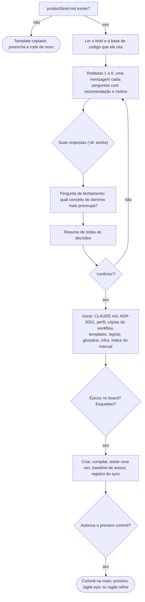

### /agile:idea
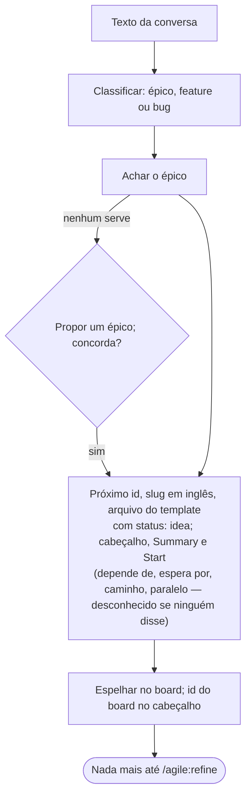

### /agile:discuss


### /agile:epic
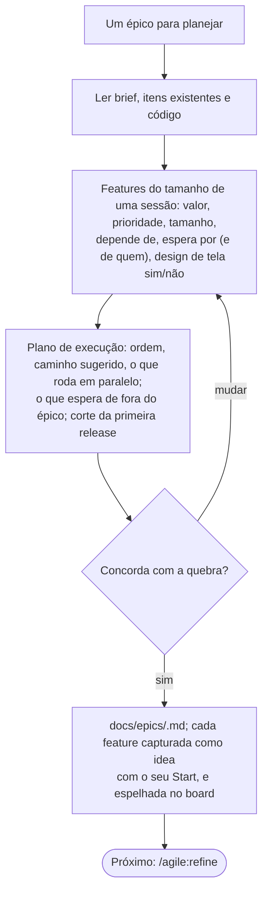

### /agile:refine
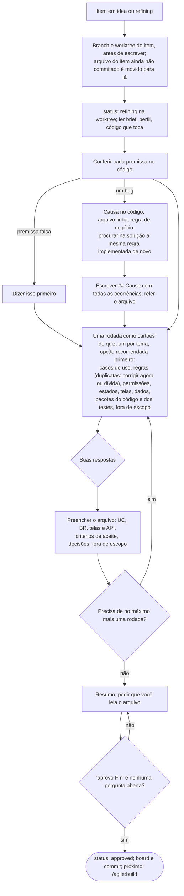

### /agile:screen


### /agile:build
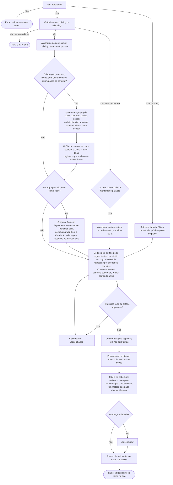

### /agile:review
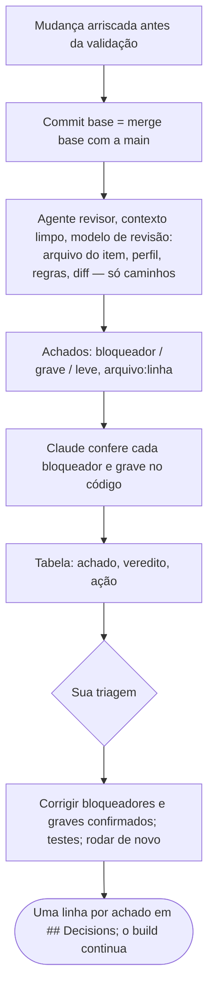

### /agile:change
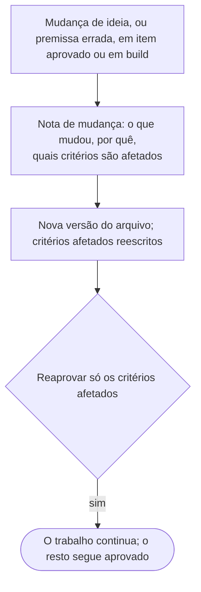

### /agile:ship
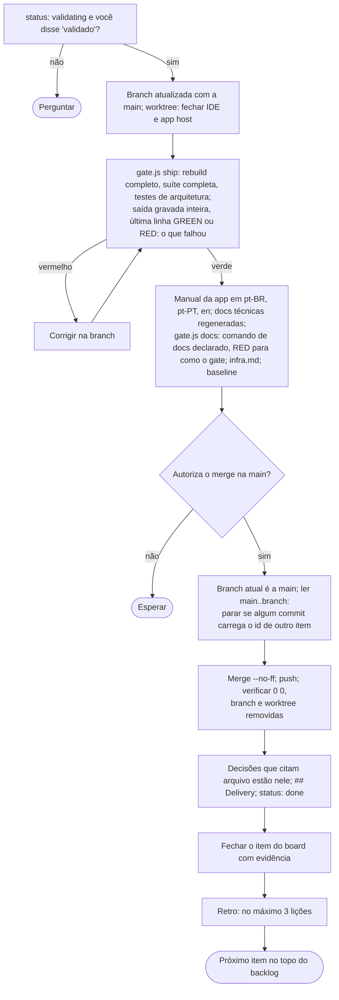

### /agile:retro
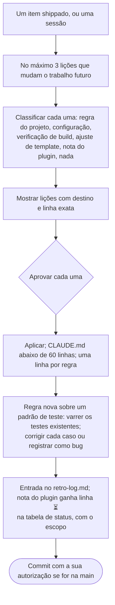

### /agile:pause
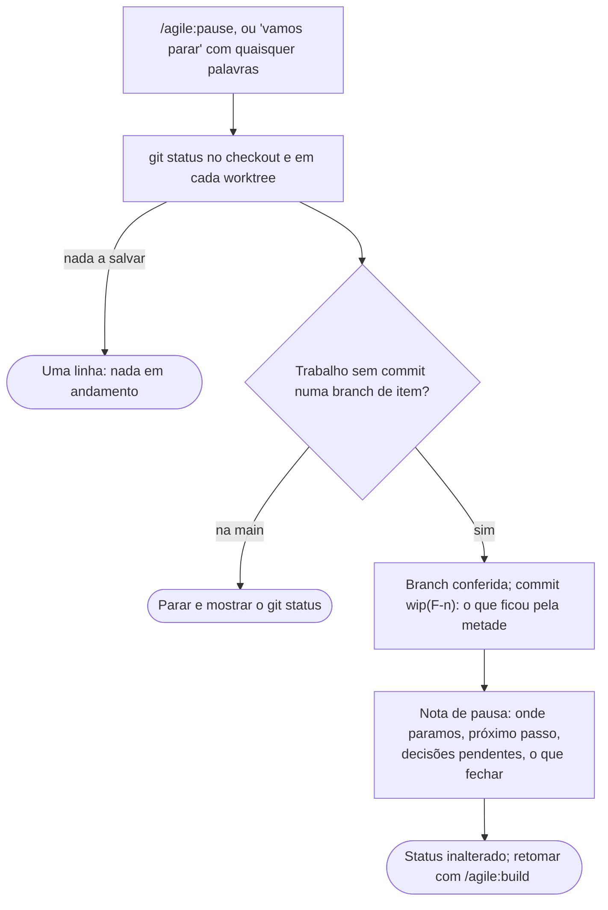

### /agile:status
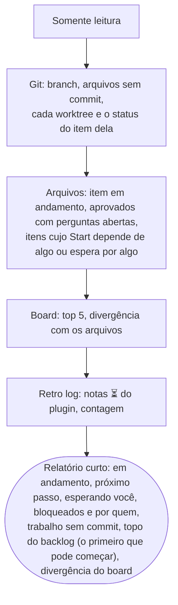

### /agile:sync
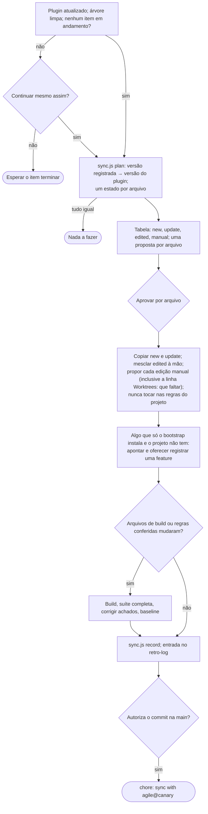

### /agile:autopilot
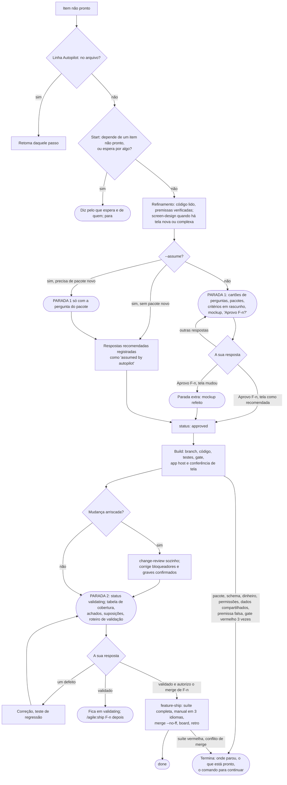

### /agile:version
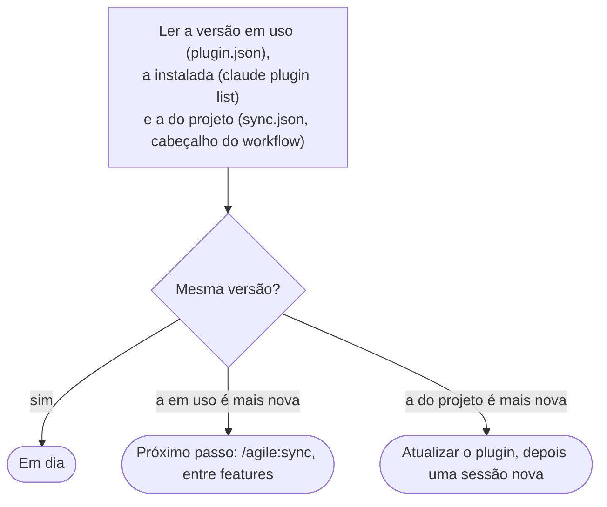
