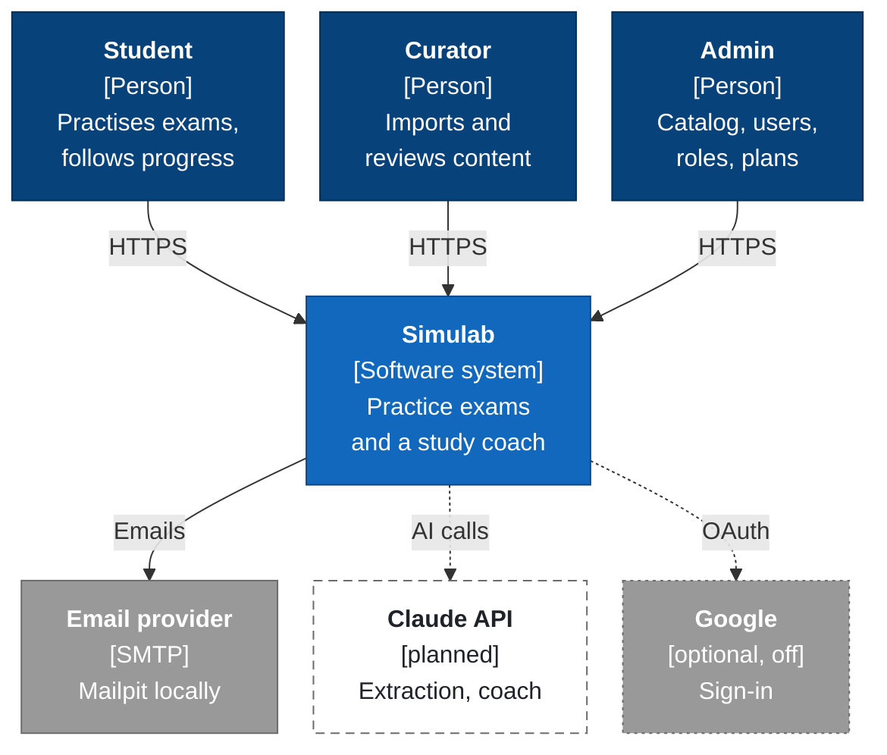
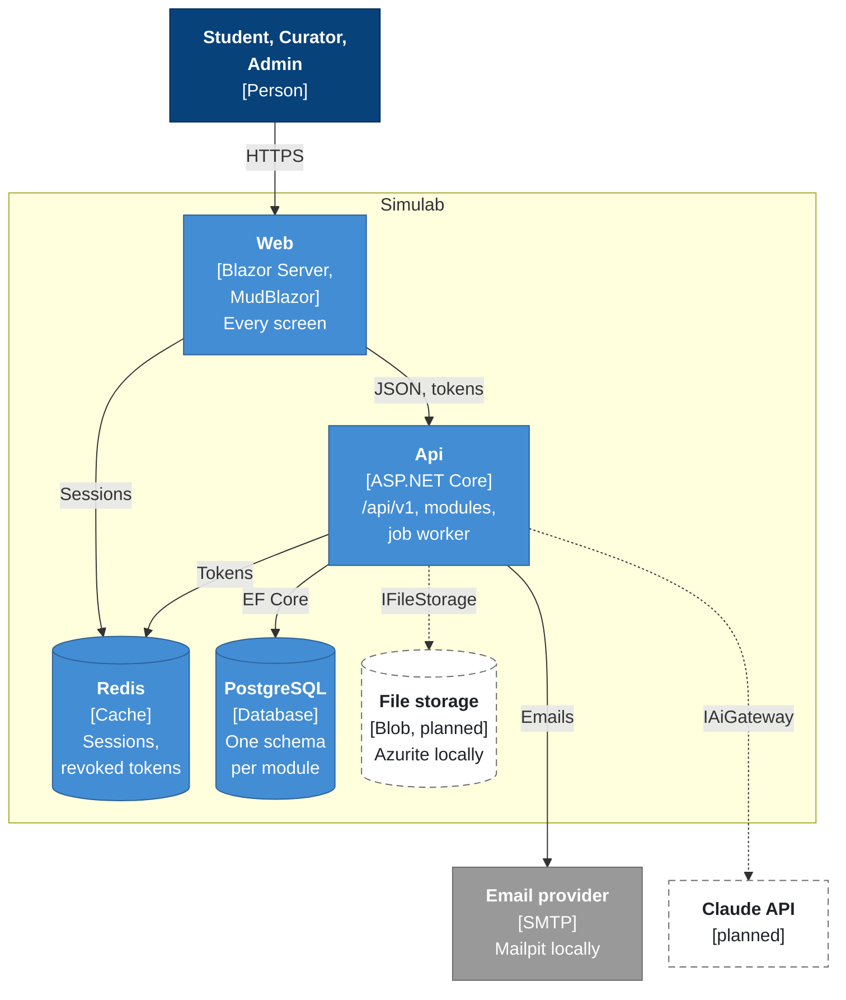

# Simulab — architecture overview

Hand-written (F-23). The generated docs (modules, entities, routes) are in [`docs/architecture/`](architecture/README.md).
Dashed = planned, not built yet. Dotted = optional, off by default.

`ArchitectureOverviewTests` keeps the containers diagram in step with the app host
(`src/Hosts/Simulab.AppHost/AppHost.cs`): every resource it starts is a node with the resource name as its id, and a
node in the `planned` class is not a resource yet. When a planned piece is built, move it to `container` or `external`.

## 1. System context

## 2. Containers

- **Web** — every screen, in pt-BR, pt-PT and en. Talks to the Api only over `/api/v1`; keeps each browser's tokens in Redis (B-3).
- **Api** — the modules (Identity, Catalog), the OpenIddict token endpoint and the job worker that sends the emails (F-13).
- **PostgreSQL** — one database, one schema per module: `identity`, `catalog`, `jobs`.
- **Redis** — refresh-token sessions and the access-token revocation set (F-5), and the Web's server-side sessions (B-3).
- **File storage** (planned) — blob containers behind `IFileStorage`, Azurite locally; added by the first feature that stores files.
- **Claude API** (planned) — reached only through `IAiGateway`, which checks the plan and records usage and cost.
- **In the cloud** (ADR-0002, F-62) — the same containers run on Azure Container Apps, Brazil South, with PostgreSQL Flexible Server, Key Vault and, in production, Azure Cache for Redis (staging keeps Redis as a container). These resources are added only when the app host publishes (`AzureDeployment.cs`), so they are not nodes of this diagram.
- **Google** (optional) — sign-in with Google, off unless the OAuth client is configured (F-20); shown in the context diagram only.

## 3. Inside the Api

The modules and the references between their projects are generated: [`docs/architecture/modules.md`](architecture/modules.md).
