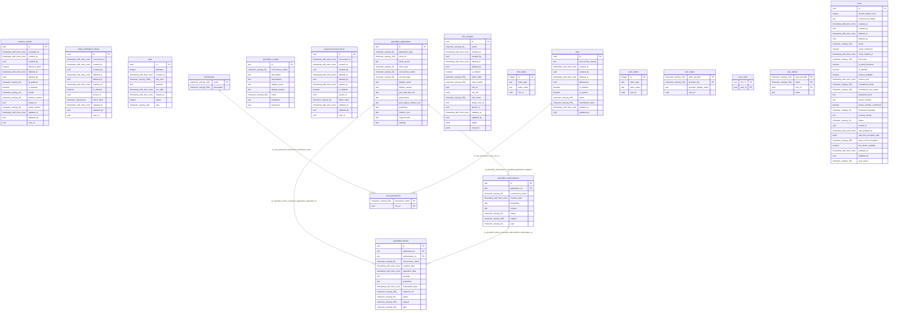

# Identity — entities

Generated from the EF model. Do not edit.

```mermaid
erDiagram
    consent_records {
        uuid id PK
        timestamp_with_time_zone accepted_at
        timestamp_with_time_zone created_at
        uuid created_by
        boolean declares_adult
        timestamp_with_time_zone deleted_at
        uuid deleted_by
        character_varying_45_ ip_address
        boolean is_deleted
        character_varying_10_ locale
        character_varying_40_ privacy_version
        uuid tenant_id
        character_varying_40_ terms_version
        timestamp_with_time_zone updated_at
        uuid updated_by
        uuid user_id
    }
    email_verification_tokens {
        uuid id PK
        timestamp_with_time_zone consumed_at
        timestamp_with_time_zone created_at
        uuid created_by
        timestamp_with_time_zone deleted_at
        uuid deleted_by
        timestamp_with_time_zone expires_at
        boolean is_deleted
        uuid tenant_id
        character_varying_64_ token_hash
        timestamp_with_time_zone updated_at
        uuid updated_by
        uuid user_id
    }
    jobs {
        uuid id PK
        integer attempts
        timestamp_with_time_zone created_at
        character_varying_2000_ last_error
        text payload
        timestamp_with_time_zone run_after
        timestamp_with_time_zone started_at
        integer status
        character_varying_100_ type
    }
    openiddict_applications {
        text id PK
        character_varying_50_ application_type
        character_varying_100_ client_id
        text client_secret
        character_varying_50_ client_type
        character_varying_50_ concurrency_token
        character_varying_50_ consent_type
        text display_name
        text display_names
        text json_web_key_set
        text permissions
        text post_logout_redirect_uris
        text properties
        text redirect_uris
        text requirements
        text settings
    }
    openiddict_authorizations {
        text id PK
        text application_id FK
        character_varying_50_ concurrency_token
        timestamp_with_time_zone creation_date
        text properties
        text scopes
        character_varying_50_ status
        character_varying_400_ subject
        character_varying_50_ type
    }
    openiddict_scopes {
        text id PK
        character_varying_50_ concurrency_token
        text description
        text descriptions
        text display_name
        text display_names
        character_varying_200_ name
        text properties
        text resources
    }
    openiddict_tokens {
        text id PK
        text application_id FK
        text authorization_id FK
        character_varying_50_ concurrency_token
        timestamp_with_time_zone creation_date
        timestamp_with_time_zone expiration_date
        text payload
        text properties
        timestamp_with_time_zone redemption_date
        character_varying_100_ reference_id
        character_varying_50_ status
        character_varying_400_ subject
        character_varying_150_ type
    }
    password_reset_tokens {
        uuid id PK
        timestamp_with_time_zone consumed_at
        timestamp_with_time_zone created_at
        uuid created_by
        timestamp_with_time_zone deleted_at
        uuid deleted_by
        timestamp_with_time_zone expires_at
        boolean is_deleted
        uuid tenant_id
        character_varying_64_ token_hash
        timestamp_with_time_zone updated_at
        uuid updated_by
        uuid user_id
    }
    permissions {
        character_varying_100_ name PK
        character_varying_500_ description
    }
    role_changes {
        uuid id PK
        character_varying_40_ action
        timestamp_with_time_zone created_at
        uuid created_by
        timestamp_with_time_zone deleted_at
        uuid deleted_by
        boolean is_deleted
        character_varying_256_ name_after
        character_varying_256_ name_before
        uuid role_id
        uuid__ role_ids
        character_varying_256_ role_name
        uuid target_user_id
        uuid tenant_id
        timestamp_with_time_zone updated_at
        uuid updated_by
        jsonb added
        jsonb removed
    }
    role_claims {
        integer id PK
        text claim_type
        text claim_value
        uuid role_id
    }
    role_permissions {
        character_varying_100_ permission_name PK
        uuid role_id PK
    }
    roles {
        uuid id PK
        text concurrency_stamp
        timestamp_with_time_zone created_at
        uuid created_by
        timestamp_with_time_zone deleted_at
        uuid deleted_by
        boolean is_deleted
        boolean is_system
        character_varying_256_ name
        character_varying_256_ normalized_name
        timestamp_with_time_zone updated_at
        uuid updated_by
    }
    user_claims {
        integer id PK
        text claim_type
        text claim_value
        uuid user_id
    }
    user_logins {
        character_varying_128_ login_provider PK
        character_varying_128_ provider_key PK
        text provider_display_name
        uuid user_id
    }
    user_roles {
        uuid role_id PK
        uuid user_id PK
    }
    user_tokens {
        character_varying_128_ login_provider PK
        character_varying_128_ name PK
        uuid user_id PK
        text value
    }
    users {
        uuid id PK
        integer access_failed_count
        text concurrency_stamp
        timestamp_with_time_zone created_at
        uuid created_by
        timestamp_with_time_zone deleted_at
        uuid deleted_by
        character_varying_254_ email
        boolean email_confirmed
        timestamp_with_time_zone email_verified_at
        character_varying_120_ full_name
        boolean is_adult_declared
        boolean is_deleted
        boolean lockout_enabled
        timestamp_with_time_zone lockout_end
        character_varying_254_ normalized_email
        character_varying_254_ normalized_user_name
        text password_hash
        text phone_number
        boolean phone_number_confirmed
        character_varying_10_ preferred_language
        text security_stamp
        character_varying_20_ status
        uuid tenant_id
        timestamp_with_time_zone totp_enabled_at
        bigint totp_last_accepted_step
        character_varying_256_ totp_secret_encrypted
        boolean two_factor_enabled
        timestamp_with_time_zone updated_at
        uuid updated_by
        character_varying_254_ user_name
    }
    openiddict_applications ||--}o openiddict_authorizations : "fk_openiddict_authorizations_openiddict_applications_applicati"
    openiddict_applications ||--}o openiddict_tokens : "fk_openiddict_tokens_openiddict_applications_application_id"
    openiddict_authorizations ||--}o openiddict_tokens : "fk_openiddict_tokens_openiddict_authorizations_authorization_id"
    permissions ||--}o role_permissions : "fk_role_permissions_permissions_permission_name"
    roles ||--}o role_permissions : "fk_role_permissions_roles_role_id"
```
