# Identity — entities

Generated from the EF model. Do not edit.

Right-angle lines need a Mermaid viewer with the ELK layout, such as the VS Code built-in Markdown preview; other viewers draw the same diagram with curved lines.

```mermaid
---
config:
  layout: elk
---
erDiagram
    consent_records {
        uuid id PK
        timestamptz accepted_at
        boolean declares_adult
        varchar(45) ip_address
        varchar(10) locale
        varchar(40) privacy_version
        varchar(40) terms_version
        uuid user_id FK
        standard columns "8: tenant, audit, soft delete - see data dictionary"
    }
    email_verification_tokens {
        uuid id PK
        timestamptz consumed_at
        timestamptz expires_at
        varchar(64) token_hash
        uuid user_id FK
        standard columns "8: tenant, audit, soft delete - see data dictionary"
    }
    jobs {
        uuid id PK
        integer attempts
        varchar(2000) last_error
        text payload
        timestamptz run_after
        timestamptz started_at
        integer status
        varchar(100) type
        standard columns "1: audit - see data dictionary"
    }
    openiddict_applications {
        text id PK
        varchar(50) application_type
        varchar(100) client_id
        text client_secret
        varchar(50) client_type
        varchar(50) concurrency_token
        varchar(50) consent_type
        text display_name
        text display_names
        text json_web_key_set
        text permissions
        text post_logout_redirect_uris
        text properties
        text redirect_uris
        text requirements
        text settings
    }
    openiddict_authorizations {
        text id PK
        text application_id FK
        varchar(50) concurrency_token
        timestamptz creation_date
        text properties
        text scopes
        varchar(50) status
        varchar(400) subject
        varchar(50) type
    }
    openiddict_scopes {
        text id PK
        varchar(50) concurrency_token
        text description
        text descriptions
        text display_name
        text display_names
        varchar(200) name
        text properties
        text resources
    }
    openiddict_tokens {
        text id PK
        text application_id FK
        text authorization_id FK
        varchar(50) concurrency_token
        timestamptz creation_date
        timestamptz expiration_date
        text payload
        text properties
        timestamptz redemption_date
        varchar(100) reference_id
        varchar(50) status
        varchar(400) subject
        varchar(150) type
    }
    password_reset_tokens {
        uuid id PK
        timestamptz consumed_at
        timestamptz expires_at
        varchar(64) token_hash
        uuid user_id FK
        standard columns "8: tenant, audit, soft delete - see data dictionary"
    }
    permissions {
        varchar(100) name PK
        varchar(500) description
    }
    role_changes {
        uuid id PK
        varchar(40) action
        varchar(256) name_after
        varchar(256) name_before
        uuid role_id
        uuid[] role_ids
        varchar(256) role_name
        uuid target_user_id
        jsonb added
        jsonb removed
        standard columns "8: tenant, audit, soft delete - see data dictionary"
    }
    role_claims {
        integer id PK
        text claim_type
        text claim_value
        uuid role_id FK
    }
    role_permissions {
        varchar(100) permission_name PK
        uuid role_id PK
    }
    roles {
        uuid id PK
        text concurrency_stamp
        boolean is_system
        varchar(256) name
        varchar(256) normalized_name
        standard columns "7: audit, soft delete - see data dictionary"
    }
    user_claims {
        integer id PK
        text claim_type
        text claim_value
        uuid user_id FK
    }
    user_logins {
        varchar(128) login_provider PK
        varchar(128) provider_key PK
        text provider_display_name
        uuid user_id FK
    }
    user_roles {
        uuid role_id PK
        uuid user_id PK
    }
    user_tokens {
        varchar(128) login_provider PK
        varchar(128) name PK
        uuid user_id PK
        text value
    }
    users {
        uuid id PK
        integer access_failed_count
        text concurrency_stamp
        varchar(254) email
        boolean email_confirmed
        timestamptz email_verified_at
        varchar(120) full_name
        boolean is_adult_declared
        boolean lockout_enabled
        timestamptz lockout_end
        varchar(254) normalized_email
        varchar(254) normalized_user_name
        text password_hash
        text phone_number
        boolean phone_number_confirmed
        varchar(10) preferred_language
        text security_stamp
        varchar(20) status
        timestamptz totp_enabled_at
        bigint totp_last_accepted_step
        varchar(256) totp_secret_encrypted
        boolean two_factor_enabled
        varchar(254) user_name
        standard columns "8: tenant, audit, soft delete - see data dictionary"
    }
    openiddict_applications ||--}o openiddict_authorizations : "application_id"
    openiddict_applications ||--}o openiddict_tokens : "application_id"
    openiddict_authorizations ||--}o openiddict_tokens : "authorization_id"
    permissions ||--}o role_permissions : "permission_name"
    roles ||--}o role_claims : "role_id"
    roles ||--}o role_permissions : "role_id"
    roles ||--}o user_roles : "role_id"
    users ||--}o consent_records : "user_id"
    users ||--}o email_verification_tokens : "user_id"
    users ||--}o password_reset_tokens : "user_id"
    users ||--}o user_claims : "user_id"
    users ||--}o user_logins : "user_id"
    users ||--}o user_roles : "user_id"
    users ||--}o user_tokens : "user_id"
```

