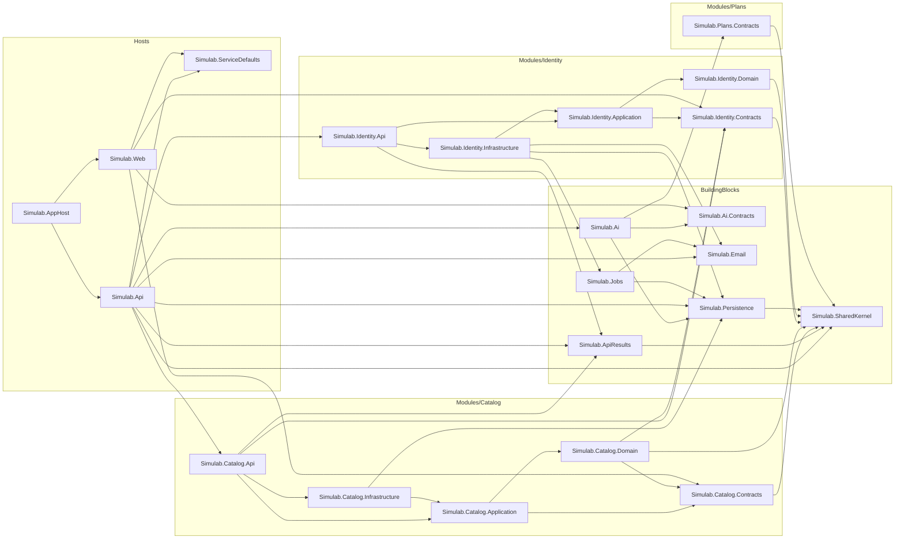

# Simulab — modules and dependencies

Generated from the project references under `src/`. Do not edit.

```mermaid
flowchart LR
    subgraph BuildingBlocks["BuildingBlocks"]
        Simulab_Ai["Simulab.Ai"]
        Simulab_Ai_Contracts["Simulab.Ai.Contracts"]
        Simulab_ApiResults["Simulab.ApiResults"]
        Simulab_Email["Simulab.Email"]
        Simulab_Jobs["Simulab.Jobs"]
        Simulab_Persistence["Simulab.Persistence"]
        Simulab_SharedKernel["Simulab.SharedKernel"]
    end
    subgraph Hosts["Hosts"]
        Simulab_Api["Simulab.Api"]
        Simulab_AppHost["Simulab.AppHost"]
        Simulab_ServiceDefaults["Simulab.ServiceDefaults"]
        Simulab_Web["Simulab.Web"]
    end
    subgraph Modules_Catalog["Modules/Catalog"]
        Simulab_Catalog_Api["Simulab.Catalog.Api"]
        Simulab_Catalog_Application["Simulab.Catalog.Application"]
        Simulab_Catalog_Contracts["Simulab.Catalog.Contracts"]
        Simulab_Catalog_Domain["Simulab.Catalog.Domain"]
        Simulab_Catalog_Infrastructure["Simulab.Catalog.Infrastructure"]
    end
    subgraph Modules_Identity["Modules/Identity"]
        Simulab_Identity_Api["Simulab.Identity.Api"]
        Simulab_Identity_Application["Simulab.Identity.Application"]
        Simulab_Identity_Contracts["Simulab.Identity.Contracts"]
        Simulab_Identity_Domain["Simulab.Identity.Domain"]
        Simulab_Identity_Infrastructure["Simulab.Identity.Infrastructure"]
    end
    subgraph Modules_Plans["Modules/Plans"]
        Simulab_Plans_Contracts["Simulab.Plans.Contracts"]
    end
    Simulab_Ai --> Simulab_Ai_Contracts
    Simulab_Ai --> Simulab_Persistence
    Simulab_Ai --> Simulab_Plans_Contracts
    Simulab_Api --> Simulab_Ai
    Simulab_Api --> Simulab_ApiResults
    Simulab_Api --> Simulab_Catalog_Api
    Simulab_Api --> Simulab_Email
    Simulab_Api --> Simulab_Identity_Api
    Simulab_Api --> Simulab_Persistence
    Simulab_Api --> Simulab_ServiceDefaults
    Simulab_Api --> Simulab_SharedKernel
    Simulab_ApiResults --> Simulab_SharedKernel
    Simulab_AppHost --> Simulab_Api
    Simulab_AppHost --> Simulab_Web
    Simulab_Catalog_Api --> Simulab_ApiResults
    Simulab_Catalog_Api --> Simulab_Catalog_Application
    Simulab_Catalog_Api --> Simulab_Catalog_Infrastructure
    Simulab_Catalog_Api --> Simulab_Identity_Contracts
    Simulab_Catalog_Application --> Simulab_Catalog_Contracts
    Simulab_Catalog_Application --> Simulab_Catalog_Domain
    Simulab_Catalog_Contracts --> Simulab_SharedKernel
    Simulab_Catalog_Domain --> Simulab_Catalog_Contracts
    Simulab_Catalog_Domain --> Simulab_Identity_Contracts
    Simulab_Catalog_Domain --> Simulab_SharedKernel
    Simulab_Catalog_Infrastructure --> Simulab_Catalog_Application
    Simulab_Catalog_Infrastructure --> Simulab_Persistence
    Simulab_Identity_Api --> Simulab_ApiResults
    Simulab_Identity_Api --> Simulab_Identity_Application
    Simulab_Identity_Api --> Simulab_Identity_Infrastructure
    Simulab_Identity_Application --> Simulab_Identity_Contracts
    Simulab_Identity_Application --> Simulab_Identity_Domain
    Simulab_Identity_Contracts --> Simulab_SharedKernel
    Simulab_Identity_Domain --> Simulab_SharedKernel
    Simulab_Identity_Infrastructure --> Simulab_Email
    Simulab_Identity_Infrastructure --> Simulab_Identity_Application
    Simulab_Identity_Infrastructure --> Simulab_Jobs
    Simulab_Identity_Infrastructure --> Simulab_Persistence
    Simulab_Jobs --> Simulab_Email
    Simulab_Jobs --> Simulab_Persistence
    Simulab_Persistence --> Simulab_SharedKernel
    Simulab_Plans_Contracts --> Simulab_SharedKernel
    Simulab_Web --> Simulab_Ai_Contracts
    Simulab_Web --> Simulab_Catalog_Contracts
    Simulab_Web --> Simulab_Identity_Contracts
    Simulab_Web --> Simulab_ServiceDefaults
```
